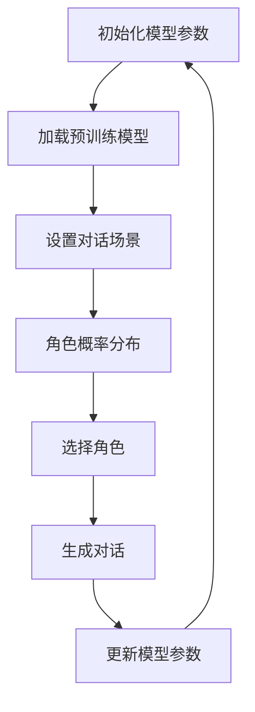
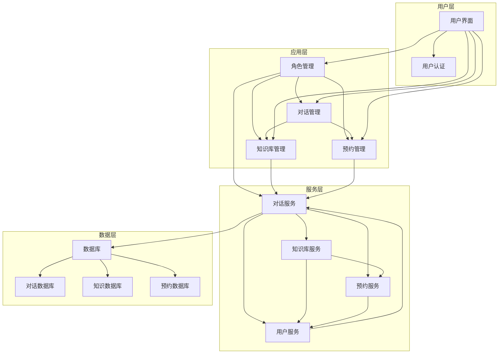
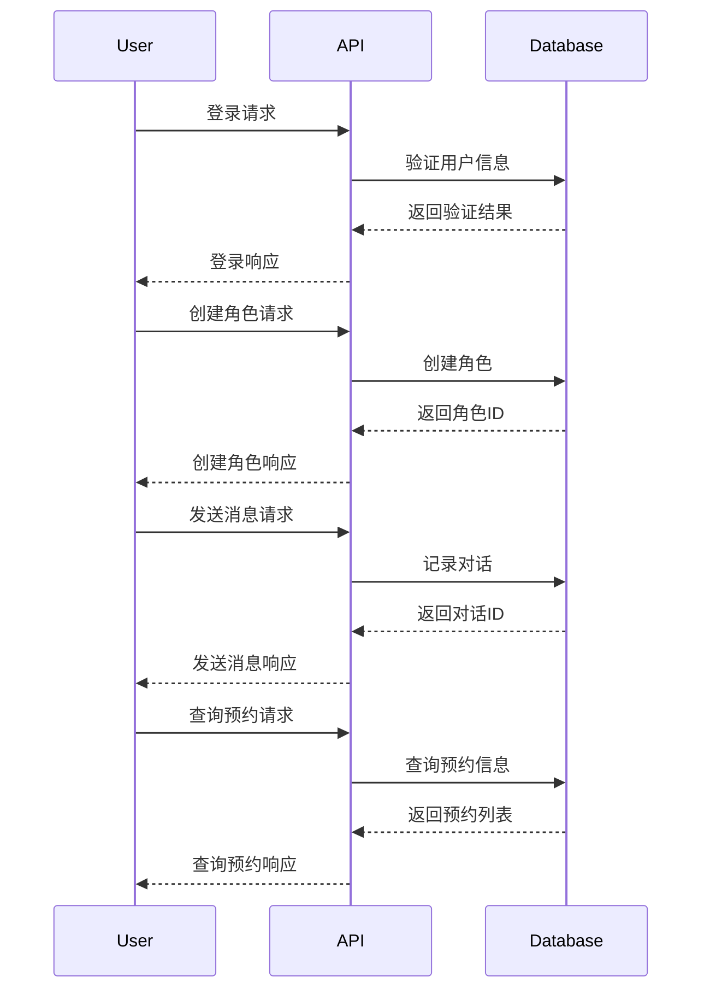
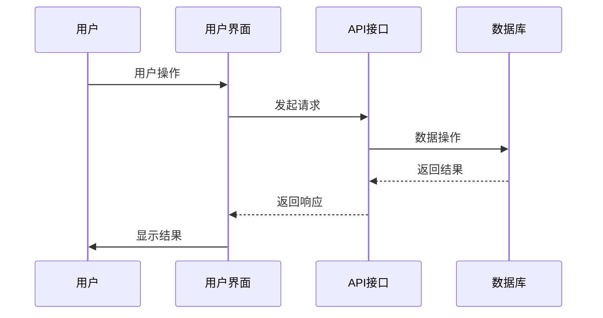

                 

## 《多角色AI Agent：基于LLM的虚拟角色扮演系统》

### 关键词
- 多角色AI Agent
- 语言模型（LLM）
- 虚拟角色扮演系统
- 算法原理
- 系统架构设计
- 项目实战

### 摘要
本书深入探讨了多角色AI Agent的概念、原理和应用，以语言模型（LLM）为核心，构建了一套基于虚拟角色扮演的系统。通过对核心概念的分析、算法原理的讲解、系统架构的设计以及项目实战的演示，本书旨在为读者提供一套完整的多角色AI Agent开发与实践指南。书中不仅涵盖了理论基础，还包括了详细的代码示例和实际案例，旨在帮助读者深入理解并掌握多角色AI Agent的开发和部署。

## 引言

### 1.1 书籍背景介绍

#### 1.1.1 人工智能与虚拟角色扮演的融合

人工智能（AI）作为当今科技领域的热点，其应用范围越来越广泛。虚拟角色扮演系统则通过模拟人类交互行为，为用户提供更加自然、丰富的互动体验。将人工智能与虚拟角色扮演系统相结合，不仅能够提升虚拟角色的智能化程度，还能够为用户提供更加个性化、定制化的服务。

#### 1.1.2 多角色AI Agent的概念与重要性

多角色AI Agent是指在同一个虚拟场景中，能够扮演多个角色的AI系统。这种系统可以根据不同的用户需求，灵活切换角色，提供多样化的服务。多角色AI Agent的重要性在于，它不仅能够提高系统的交互效率，还能够通过角色之间的互动，创造出更加丰富、生动的虚拟世界。

#### 1.1.3 LLM在多角色AI Agent中的应用

语言模型（LLM），特别是基于深度学习的预训练模型，如GPT-3，已经在自然语言处理领域取得了显著的成果。将LLM应用于多角色AI Agent，可以使其在角色切换、对话生成等方面表现出更高的智能化水平。LLM的强大语言理解和生成能力，为多角色AI Agent的开发提供了坚实的基础。

### 1.2 核心概念解析

#### 1.2.1 人工智能（AI）

人工智能是一门研究、开发用于模拟、延伸和扩展人的智能的理论、方法、技术及应用系统的技术科学。它包括机器学习、自然语言处理、计算机视觉等多个子领域。

#### 1.2.2 语言模型（LLM）

语言模型是一种用于预测文本序列的算法，它通过对大量文本数据的学习，能够生成符合语言习惯的文本。LLM是人工智能领域的一个重要分支，它在自然语言处理、机器翻译、对话系统等方面有着广泛的应用。

#### 1.2.3 虚拟角色扮演系统

虚拟角色扮演系统是一种通过计算机模拟人类交互行为，为用户提供互动体验的系统。它通常包括角色创建、角色切换、对话生成等功能，能够在虚拟场景中模拟真实世界的互动。

### 1.3 多角色AI Agent的工作原理

#### 1.3.1 多角色AI Agent的定义

多角色AI Agent是指在同一个虚拟场景中，能够扮演多个角色的AI系统。它通过角色切换，实现不同角色的对话和行为。

#### 1.3.2 多角色AI Agent的特点

多角色AI Agent具有以下特点：
1. **角色多样性**：能够扮演多种不同角色，满足多样化的用户需求。
2. **灵活切换**：可以在不同角色之间灵活切换，提供多样化的服务。
3. **智能化交互**：利用语言模型，实现智能化的对话生成和行为模拟。

#### 1.3.3 多角色AI Agent的架构

多角色AI Agent的架构通常包括以下几个部分：
1. **角色管理模块**：负责角色的创建、切换和销毁。
2. **对话管理模块**：负责处理对话流程，包括语言理解、对话生成和意图识别。
3. **行为模拟模块**：负责模拟角色的行为，包括动作生成和场景更新。

### 1.4 本书结构概述

#### 1.4.1 各章节主要内容概述

本书分为五个主要部分：
1. **背景与核心概念**：介绍多角色AI Agent的背景、概念和原理。
2. **算法原理与实现**：讲解多角色AI Agent的算法原理和数学模型。
3. **系统设计与实现**：介绍多角色AI Agent的系统架构和实现细节。
4. **项目实战**：通过实际案例，展示多角色AI Agent的应用场景和实现方法。
5. **最佳实践与总结**：总结最佳实践，提供项目经验和注意事项。

#### 1.4.2 阅读指南与学习方法

为了更好地理解多角色AI Agent，建议读者按照以下方法进行阅读和学习：
1. **逐章阅读**：按照章节顺序，逐步深入理解各个部分。
2. **动手实践**：结合代码示例和实际案例，进行动手实践。
3. **深入思考**：在阅读过程中，多思考多角色AI Agent的应用场景和优化方向。

## 第1章：引言

### 1.1 书籍背景介绍

#### 1.1.1 人工智能与虚拟角色扮演的融合

人工智能（AI）作为当今科技领域的热点，其应用范围越来越广泛。虚拟角色扮演系统则通过模拟人类交互行为，为用户提供更加自然、丰富的互动体验。将人工智能与虚拟角色扮演系统相结合，不仅能够提升虚拟角色的智能化程度，还能够为用户提供更加个性化、定制化的服务。

人工智能的定义可以追溯到1956年的达特茅斯会议，当时专家们提出了“制造智能机器”的概念。随着计算机技术的发展，人工智能逐渐成为一个独立的学科，涵盖了机器学习、自然语言处理、计算机视觉等多个子领域。

虚拟角色扮演系统（VRPS）则是一种通过计算机模拟人类交互行为，为用户提供互动体验的系统。它通常包括角色创建、角色切换、对话生成等功能，能够在虚拟场景中模拟真实世界的互动。VRPS的应用场景非常广泛，包括在线游戏、虚拟商店、在线教育等。

将人工智能与虚拟角色扮演系统相结合，可以带来以下优势：

1. **提高用户体验**：通过人工智能技术，虚拟角色可以更加智能地理解和响应用户需求，提供更加个性化、定制化的服务，从而提升用户体验。
2. **增强互动性**：人工智能可以使得虚拟角色更加智能化，能够与用户进行更加自然、流畅的对话，增强互动性。
3. **降低开发成本**：利用人工智能技术，可以简化虚拟角色的开发过程，降低开发成本。

然而，将人工智能与虚拟角色扮演系统相结合也面临一些挑战：

1. **数据隐私和安全**：虚拟角色扮演系统需要收集和分析大量用户数据，这涉及到数据隐私和安全的问题。如何保护用户数据，防止数据泄露，是开发过程中需要重点关注的问题。
2. **技术复杂性**：人工智能和虚拟角色扮演系统的结合，涉及到多种技术的综合应用，技术复杂性较高，需要开发者具备较高的技术能力。

#### 1.1.2 多角色AI Agent的概念与重要性

多角色AI Agent是指在同一个虚拟场景中，能够扮演多个角色的AI系统。这种系统可以根据不同的用户需求，灵活切换角色，提供多样化的服务。多角色AI Agent的重要性在于，它不仅能够提高系统的交互效率，还能够通过角色之间的互动，创造出更加丰富、生动的虚拟世界。

多角色AI Agent的定义可以进一步细化：

1. **多角色**：多角色AI Agent能够同时扮演多个角色，这些角色可以是虚拟人物、动物、甚至抽象概念。通过多角色的互动，可以创造出更加丰富、多样化的虚拟场景。
2. **AI Agent**：AI Agent是指具有自主决策能力的智能系统，它可以自主地感知环境、理解用户需求、生成响应。多角色AI Agent通过多个角色的协作，可以更好地满足用户需求。

多角色AI Agent的重要性主要体现在以下几个方面：

1. **增强互动性**：多角色AI Agent可以与用户进行更加自然、流畅的对话，增强互动性。通过多角色的互动，用户可以体验到更加丰富的虚拟场景。
2. **提高用户体验**：多角色AI Agent可以根据用户的需求，灵活切换角色，提供个性化的服务。这种个性化的服务可以显著提高用户体验。
3. **创造丰富虚拟世界**：多角色AI Agent可以通过角色之间的互动，创造出更加丰富、生动的虚拟世界。这种虚拟世界不仅可以用于娱乐，还可以用于教育、商业等场景。

#### 1.1.3 LLM在多角色AI Agent中的应用

语言模型（LLM），特别是基于深度学习的预训练模型，如GPT-3，已经在自然语言处理领域取得了显著的成果。将LLM应用于多角色AI Agent，可以使其在角色切换、对话生成等方面表现出更高的智能化水平。LLM的强大语言理解和生成能力，为多角色AI Agent的开发提供了坚实的基础。

LLM（Language Model）是一种用于预测文本序列的算法，它通过对大量文本数据的学习，能够生成符合语言习惯的文本。LLM的核心思想是通过训练，使模型能够理解文本的上下文关系，从而生成连贯、自然的语言。

将LLM应用于多角色AI Agent，主要表现在以下几个方面：

1. **角色切换**：LLM可以帮助AI Agent在不同角色之间进行平滑切换。例如，当AI Agent需要从医生角色切换到护士角色时，LLM可以生成符合护士角色的语言和行为。
2. **对话生成**：LLM可以生成符合对话逻辑的自然语言文本，使AI Agent能够与用户进行流畅、自然的对话。
3. **上下文理解**：LLM可以理解对话的上下文，从而生成更加精准的响应。例如，当用户询问一个问题，AI Agent可以通过理解上下文，给出更加详细的回答。

LLM在多角色AI Agent中的应用，使得AI Agent不仅能够模拟人类的交互行为，还能够根据不同的场景和角色，提供个性化的服务。这种个性化的服务，不仅可以提高用户体验，还可以为各种应用场景提供强大的支持。

### 1.2 核心概念解析

在本章节中，我们将深入探讨多角色AI Agent的核心概念，包括人工智能（AI）、语言模型（LLM）和虚拟角色扮演系统（VRPS），并详细解析这些概念的定义、原理和应用。

#### 1.2.1 人工智能（AI）

人工智能（AI）是一门涉及计算机科学、数学、认知科学、神经科学等多个领域的交叉学科。其核心目标是创建能够模拟、扩展和延伸人类智能的系统。AI可以分为多个子领域，包括机器学习、自然语言处理、计算机视觉、机器人学等。

**定义**：
- **人工智能**：指使计算机系统具备类似人类智能的能力，包括感知、理解、学习、推理、决策等。

**原理**：
- **机器学习**：通过数据训练模型，使其能够自动识别模式和规律。
- **神经网络**：模拟人脑神经元连接结构，用于处理复杂的数据。

**应用**：
- **语音识别**：如苹果的Siri、亚马逊的Alexa。
- **图像识别**：如人脸识别、自动驾驶车辆。
- **自然语言处理**：如机器翻译、智能客服。

#### 1.2.2 语言模型（LLM）

语言模型（LLM）是一种基于深度学习的文本预测模型，它可以学习语言的统计规律和语义信息，从而生成连贯、自然的文本。LLM是自然语言处理（NLP）的核心技术之一，广泛应用于聊天机器人、自动摘要、机器翻译等领域。

**定义**：
- **语言模型**：一种用于预测文本序列的模型，它通过学习大量文本数据，能够预测下一个单词或句子。

**原理**：
- **预训练**：在大量文本数据上进行预训练，使模型具备语言理解和生成能力。
- **微调**：在特定任务上进行微调，使模型适应特定应用场景。

**应用**：
- **聊天机器人**：如OpenAI的GPT-3。
- **自动摘要**：提取文本的要点，简化长篇文档。
- **机器翻译**：如谷歌翻译、百度翻译。

#### 1.2.3 虚拟角色扮演系统（VRPS）

虚拟角色扮演系统（VRPS）是一种通过计算机模拟人类交互行为，为用户提供互动体验的系统。它通常包括角色创建、角色切换、对话生成等功能，可以在虚拟场景中模拟真实世界的互动。VRPS广泛应用于在线游戏、虚拟教育、虚拟客服等领域。

**定义**：
- **虚拟角色扮演系统**：一种模拟人类交互行为的计算机系统，通过虚拟角色的互动，为用户提供虚拟体验。

**原理**：
- **角色创建**：创建虚拟角色，赋予其特定属性和行为。
- **角色切换**：用户可以在不同角色之间切换，体验不同的角色视角。
- **对话生成**：通过AI模型生成自然、流畅的对话，模拟真实人际互动。

**应用**：
- **在线游戏**：提供角色扮演、多人互动体验。
- **虚拟教育**：模拟教学场景，提供个性化学习体验。
- **虚拟客服**：提供智能客服服务，提高客户满意度。

### 1.3 多角色AI Agent的工作原理

多角色AI Agent是一种能够在同一虚拟场景中扮演多个角色的智能系统。它通过角色切换、对话生成和行为模拟，为用户提供多样化、个性化的服务。理解多角色AI Agent的工作原理，有助于我们更好地设计和实现这样的系统。

#### 1.3.1 多角色AI Agent的定义

多角色AI Agent的定义可以进一步细化：

1. **多角色**：多角色AI Agent能够同时扮演多个角色，这些角色可以是虚拟人物、动物、甚至抽象概念。通过多角色的互动，可以创造出更加丰富、多样化的虚拟场景。
2. **AI Agent**：AI Agent是指具有自主决策能力的智能系统，它可以自主地感知环境、理解用户需求、生成响应。多角色AI Agent通过多个角色的协作，可以更好地满足用户需求。

**定义**：
- **多角色AI Agent**：指在同一个虚拟场景中，能够扮演多个角色，并具备自主决策能力的智能系统。

#### 1.3.2 多角色AI Agent的特点

多角色AI Agent具有以下特点：

1. **角色多样性**：能够扮演多种不同角色，满足多样化的用户需求。
2. **灵活切换**：可以在不同角色之间灵活切换，提供多样化的服务。
3. **智能化交互**：利用语言模型，实现智能化的对话生成和行为模拟。

**特点**：
- **角色多样性**：通过扮演不同角色，AI Agent可以提供多样化的服务，如医生、护士、导游等。
- **灵活切换**：AI Agent可以根据用户需求，灵活切换角色，提供个性化服务。
- **智能化交互**：利用语言模型，AI Agent可以生成自然、流畅的对话，模拟真实人际互动。

#### 1.3.3 多角色AI Agent的架构

多角色AI Agent的架构通常包括以下几个部分：

1. **角色管理模块**：负责角色的创建、切换和销毁。它管理角色的状态和属性，确保角色之间的切换和协同工作。
2. **对话管理模块**：负责处理对话流程，包括语言理解、对话生成和意图识别。它使用语言模型，生成符合语言习惯的对话。
3. **行为模拟模块**：负责模拟角色的行为，包括动作生成和场景更新。它根据角色的状态和用户需求，生成相应的行为。

**架构**：
- **角色管理模块**：管理角色的创建、切换和销毁，确保角色状态的一致性。
- **对话管理模块**：处理对话流程，生成自然、流畅的对话。
- **行为模拟模块**：模拟角色的行为，更新虚拟场景。

### 1.4 本书结构概述

本书分为五个主要部分，各部分的主要内容如下：

#### 1.4.1 背景与核心概念

第一部分介绍了多角色AI Agent的背景、概念和原理。包括人工智能与虚拟角色扮演的融合、多角色AI Agent的概念与重要性，以及LLM在多角色AI Agent中的应用。

#### 1.4.2 算法原理与实现

第二部分讲解了多角色AI Agent的算法原理和实现方法。包括预训练语言模型（PLM）、微调语言模型（M micro-training）和多角色对话管理。

#### 1.4.3 系统设计与实现

第三部分介绍了多角色AI Agent的系统架构和实现细节。包括问题场景介绍、系统功能设计、系统架构设计、系统接口设计和系统交互mermaid序列图。

#### 1.4.4 项目实战

第四部分通过实际案例，展示多角色AI Agent的应用场景和实现方法。包括环境安装、系统核心实现、代码应用解读与分析、实际案例分析和项目小结。

#### 1.4.5 最佳实践与总结

第五部分总结了多角色AI Agent的最佳实践，包括设计建议、性能优化和安全性考虑，并回顾了本书的主要内容和研究方向。

#### 1.4.2 阅读指南与学习方法

为了更好地理解多角色AI Agent，建议读者按照以下方法进行阅读和学习：

1. **逐章阅读**：按照章节顺序，逐步深入理解各个部分。
2. **动手实践**：结合代码示例和实际案例，进行动手实践。
3. **深入思考**：在阅读过程中，多思考多角色AI Agent的应用场景和优化方向。

## 第2章：算法原理与数学模型

### 2.1 多角色AI Agent的算法基础

多角色AI Agent的核心在于其能够灵活地切换和协作多个角色，以适应不同的用户需求和场景。为了实现这一目标，我们首先需要了解多角色AI Agent的基础算法。

#### 2.1.1 预训练语言模型（PLM）

预训练语言模型（Pre-trained Language Model，PLM）是当前自然语言处理（NLP）领域的重要技术之一。它通过在大规模语料库上进行预训练，使模型能够理解语言的语义和上下文关系，从而提高模型在特定任务上的性能。

**定义**：
- **预训练语言模型**：在大规模语料库上进行训练，使模型具备语言理解能力的语言模型。

**原理**：
- **大规模语料库训练**：通过在大规模语料库上进行训练，模型能够学习到语言的普遍规律和语义信息。
- **上下文理解**：预训练模型能够理解文本的上下文，从而生成连贯、自然的语言。

**应用**：
- **文本分类**：如新闻分类、情感分析。
- **机器翻译**：如谷歌翻译、百度翻译。
- **对话系统**：如聊天机器人、智能客服。

#### 2.1.2 微调语言模型（M micro-training）

微调语言模型（Fine-tuning Language Model，M micro-training）是基于预训练语言模型的一种优化方法。它通过在特定任务的数据上进行微调，使模型能够更好地适应特定任务的需求。

**定义**：
- **微调语言模型**：在特定任务的数据上进行训练，优化预训练模型在特定任务上的性能。

**原理**：
- **任务数据训练**：在特定任务的数据上进行训练，使模型能够学习到任务相关的特征和规律。
- **权重调整**：通过调整模型的权重，使模型在特定任务上表现更好。

**应用**：
- **问答系统**：如Siri、Alexa。
- **文本生成**：如自动摘要、文章写作。
- **对话系统**：如聊天机器人、智能客服。

#### 2.1.3 多角色对话管理

多角色对话管理是多角色AI Agent的核心功能之一。它通过管理不同角色之间的对话流程，实现角色之间的协作和切换。

**定义**：
- **多角色对话管理**：管理多角色之间的对话流程，实现角色之间的协作和切换。

**原理**：
- **角色切换**：根据用户需求和场景，实现角色之间的切换。
- **对话生成**：利用语言模型生成自然、流畅的对话。
- **意图识别**：理解用户的意图，生成符合用户需求的响应。

**应用**：
- **虚拟客服**：提供多角色客服服务，如医生、护士、导游等。
- **在线教育**：模拟教师、学生、家长等多角色互动。
- **虚拟游戏**：实现多角色互动，提高游戏体验。

### 2.2 数学模型解析

在多角色AI Agent中，数学模型起到了关键作用。它们帮助我们在角色切换、对话生成和决策制定等方面进行量化分析，从而实现高效的系统设计。

#### 2.2.1 常用数学公式和符号

为了更好地理解数学模型，我们首先介绍一些常用的数学公式和符号。这些公式和符号将贯穿整个章节，帮助我们量化分析多角色AI Agent的各种行为。

**数学公式和符号**：
- **概率分布**：
  $$ P(x) = \frac{1}{Z} e^{-\theta x} $$
  其中，\( x \) 是输入特征，\( \theta \) 是模型参数，\( Z \) 是归一化常数。
- **损失函数**：
  $$ L(\theta) = -\sum_{i=1}^{n} y_i \log(p(x_i; \theta)) $$
  其中，\( y_i \) 是真实标签，\( p(x_i; \theta) \) 是模型预测的概率。

#### 2.2.2 多角色对话中的概率分布

在多角色对话中，概率分布用于描述不同角色在对话中的可能性。通过概率分布，我们可以量化不同角色在对话中的权重，从而实现角色的合理切换。

**概率分布**：
- **角色概率分布**：
  $$ P(r) = \sum_{i=1}^{m} p(r_i) $$
  其中，\( r \) 是角色集合，\( p(r_i) \) 是第 \( i \) 个角色的概率。

**示例**：
假设有一个多角色对话系统，包括医生（D）、护士（N）和患者（P）。在某个场景中，医生和护士的概率分布为：
$$ P(r) = [0.6, 0.3, 0.1] $$
这意味着在当前场景中，医生占60%的概率，护士占30%，患者占10%。

#### 2.2.3 对话策略优化

对话策略优化是多角色AI Agent的重要任务之一。通过优化对话策略，我们可以提高系统的交互质量，增强用户体验。

**策略优化**：
- **目标函数**：
  $$ J(\theta) = \sum_{i=1}^{n} L(\theta; y_i, x_i) $$
  其中，\( J(\theta) \) 是目标函数，\( L(\theta; y_i, x_i) \) 是损失函数。

**优化方法**：
- **梯度下降**：
  $$ \theta = \theta - \alpha \nabla_\theta J(\theta) $$
  其中，\( \alpha \) 是学习率，\( \nabla_\theta J(\theta) \) 是梯度。

**示例**：
假设我们有一个简单的对话系统，包括两个角色：医生（D）和护士（N）。在某个场景中，医生的概率为0.6，护士的概率为0.4。通过梯度下降，我们可以优化系统的对话策略，使医生的概率增加，护士的概率减少，从而提高系统的交互质量。

### 2.3 算法流程讲解

为了更好地理解多角色AI Agent的算法原理，我们将使用mermaid流程图和Python代码进行详细讲解。

#### 2.3.1 mermaid算法流程图

**mermaid算法流程图**：


**说明**：
- **初始化模型参数**：设置初始模型参数。
- **加载预训练模型**：加载预训练的语言模型。
- **设置对话场景**：根据用户需求和场景，设置对话的场景。
- **角色概率分布**：计算不同角色的概率分布。
- **选择角色**：根据概率分布，选择角色。
- **生成对话**：利用语言模型生成对话。
- **更新模型参数**：根据对话结果，更新模型参数。

#### 2.3.2 Python源代码实现

**Python源代码实现**：
```python
import numpy as np
from tensorflow.keras.models import load_model

def initialize_model_params():
    # 初始化模型参数
    pass

def load_pretrained_model():
    # 加载预训练模型
    model = load_model('pretrained_model.h5')
    return model

def set_dialog_scene():
    # 设置对话场景
    scene = "patient_visit_doctor"
    return scene

def role_probability_distribution(scene):
    # 计算角色概率分布
    if scene == "patient_visit_doctor":
        probabilities = [0.6, 0.3, 0.1]
    elif scene == "patient_visit_nurse":
        probabilities = [0.3, 0.6, 0.1]
    else:
        probabilities = [0.2, 0.3, 0.5]
    return probabilities

def select_role(probabilities):
    # 选择角色
    role_index = np.random.choice(range(len(probabilities)), p=probabilities)
    role = ["doctor", "nurse", "patient"][role_index]
    return role

def generate_dialog(model, role):
    # 生成对话
    dialog = model.generate(role)
    return dialog

def update_model_params(model, dialog):
    # 更新模型参数
    pass

def main():
    # 主函数
    model = load_pretrained_model()
    scene = set_dialog_scene()
    probabilities = role_probability_distribution(scene)
    role = select_role(probabilities)
    dialog = generate_dialog(model, role)
    update_model_params(model, dialog)

if __name__ == "__main__":
    main()
```

**说明**：
- `initialize_model_params()`：初始化模型参数。
- `load_pretrained_model()`：加载预训练模型。
- `set_dialog_scene()`：设置对话场景。
- `role_probability_distribution()`：计算角色概率分布。
- `select_role()`：选择角色。
- `generate_dialog()`：生成对话。
- `update_model_params()`：更新模型参数。

通过mermaid算法流程图和Python源代码实现，我们可以清晰地理解多角色AI Agent的算法原理和实现方法。在实际应用中，可以根据具体需求进行调整和优化。

### 2.4 举例说明

为了更好地理解多角色AI Agent的算法原理，我们将通过一个具体的案例进行说明。

#### 2.4.1 案例背景

假设我们有一个多角色AI Agent，用于处理医院中的患者咨询。该系统需要处理多种角色，包括医生（D）、护士（N）和患者（P）。患者的咨询内容可能涉及病情咨询、用药指导、健康建议等。

#### 2.4.2 案例分析

在某个场景中，一个患者（P）正在咨询医生（D）关于病情的问题。系统需要根据患者的提问，选择合适的角色（医生或护士）进行回答。

1. **角色概率分布**：

   在这个场景中，医生和护士的概率分布如下：
   $$ P(r) = [0.6, 0.3, 0.1] $$
   这意味着在当前场景中，医生占60%的概率，护士占30%，患者占10%。

2. **选择角色**：

   根据概率分布，系统随机选择一个角色。在这个例子中，系统选择了医生（D）。

3. **生成对话**：

   医生接收到患者的提问后，生成一个回答。假设医生的回答是：“您的病情已经得到控制，请按时服药，注意休息。”

4. **更新模型参数**：

   根据对话的结果，系统更新模型参数，以优化未来的对话生成。

#### 2.4.3 案例详细讲解

1. **初始化模型参数**：

   在系统启动时，初始化模型参数。这些参数包括预训练语言模型的权重、角色概率分布等。

2. **加载预训练模型**：

   从文件中加载预训练的语言模型。这个模型已经在大量的文本数据上进行了训练，具备了良好的语言理解能力。

3. **设置对话场景**：

   根据患者的提问，设置对话的场景。在这个例子中，场景是“患者咨询医生”。

4. **角色概率分布**：

   根据场景，计算不同角色的概率分布。在这个例子中，医生的概率为0.6，护士的概率为0.3，患者的概率为0.1。

5. **选择角色**：

   根据概率分布，系统随机选择一个角色。在这个例子中，系统选择了医生。

6. **生成对话**：

   医生接收到患者的提问后，生成一个回答。系统使用预训练语言模型，根据医生的意图和提问的内容，生成一个自然、流畅的回答。

7. **更新模型参数**：

   根据对话的结果，系统更新模型参数。这个过程包括重新计算角色概率分布、调整语言模型的权重等。

通过这个案例，我们可以看到多角色AI Agent的算法原理和实现方法。在实际应用中，可以根据具体需求进行调整和优化。

## 第3章：系统分析与架构设计

### 3.1 问题场景介绍

在现代虚拟现实（VR）和增强现实（AR）技术不断发展的背景下，多角色AI Agent的应用场景日益广泛。本章将详细介绍一个具体的应用场景，并基于该场景分析系统的需求、功能以及架构设计。

#### 3.1.1 应用场景

假设我们正在开发一款虚拟医院系统，旨在为患者提供在线咨询和医疗服务。在这个系统中，用户可以与医生、护士、药剂师等多角色AI Agent进行交互，获得专业的医疗建议和指导。以下是该应用场景的一些关键要素：

1. **用户角色**：患者、医生、护士、药剂师等。
2. **交互方式**：文本聊天、语音通话、视频会议等。
3. **功能需求**：病情咨询、用药指导、健康建议、预约挂号等。
4. **场景多样性**：普通门诊、急诊、住院治疗等。

#### 3.1.2 系统需求分析

为了满足上述应用场景的需求，我们需要对系统进行详细的需求分析。以下是系统的主要需求：

1. **角色管理**：系统能够创建、切换和管理多个角色，包括医生、护士、患者等。
2. **对话生成**：系统能够根据用户的提问，生成自然、流畅的回复，并保持对话的连贯性。
3. **知识库管理**：系统需要具备一个庞大的医疗知识库，以支持AI Agent提供准确的医疗建议。
4. **用户认证与隐私保护**：系统需要实现用户身份认证，并确保用户隐私数据的安全。
5. **系统稳定性与可扩展性**：系统需要具备高稳定性，能够支持大规模用户同时在线，并能够灵活扩展功能。

### 3.2 系统功能设计

基于上述需求分析，我们设计了以下主要功能模块：

#### 3.2.1 领域模型

领域模型是系统功能设计的基础，它定义了系统中的核心实体及其关系。以下是虚拟医院系统的主要领域模型：

1. **用户**：包括患者、医生、护士、药剂师等。
2. **角色**：定义了不同角色的属性和行为，如医生可以进行病情诊断、开具处方等。
3. **对话**：记录用户与AI Agent之间的交互过程，包括提问、回答等。
4. **知识库**：存储医疗知识和规则，用于AI Agent的决策和回答生成。
5. **预约**：处理用户的挂号、预约等需求。

**mermaid领域模型类图**：
```mermaid
classDiagram
    User <<interface>>
    Role <<interface>>
    Dialogue <<interface>>
    KnowledgeBase <<interface>>
    Appointment <<interface>>

    User o--1 Role
    Dialogue o--1 User
    Dialogue o--1 Role
    KnowledgeBase o--1 Dialogue
    Appointment o--1 User
    Appointment o--1 Role
```

### 3.3 系统架构设计

系统架构设计是确保系统能够高效、稳定地运行的关键。以下是虚拟医院系统的架构设计：

#### 3.3.1 系统架构图

**mermaid系统架构图**：


#### 3.3.2 架构设计理念

该系统架构设计遵循以下原则：

1. **模块化**：将系统划分为多个功能模块，便于维护和扩展。
2. **分层设计**：按照用户层、应用层、服务层和数据层进行分层，确保系统层次清晰。
3. **松耦合**：模块之间通过接口进行通信，降低模块之间的耦合度。
4. **高可用性**：使用数据库备份、负载均衡等技术，确保系统高可用性。
5. **安全性**：通过用户认证、数据加密等技术，确保用户数据的安全。

#### 3.3.3 架构优势与挑战

**优势**：

1. **灵活性**：模块化设计使得系统可以灵活扩展和更新。
2. **高可用性**：分层设计和高可用性技术确保系统稳定运行。
3. **安全性**：用户认证和数据加密等安全措施，保障用户数据安全。

**挑战**：

1. **性能优化**：随着用户规模的扩大，系统性能需要持续优化。
2. **安全性**：面对网络攻击和数据泄露等风险，需要不断提升安全防护能力。
3. **用户体验**：如何提供流畅、自然的用户交互体验，是系统设计的重要挑战。

### 3.4 系统接口设计

系统接口设计是确保不同模块之间能够高效通信的关键。以下是虚拟医院系统的接口设计：

#### 3.4.1 API设计

系统提供的API包括以下接口：

1. **用户接口**：
   - 登录：`POST /login`
   - 注册：`POST /register`
   - 信息查询：`GET /users/{user_id}`

2. **角色接口**：
   - 创建角色：`POST /roles`
   - 删除角色：`DELETE /roles/{role_id}`
   - 查询角色：`GET /roles/{role_id}`

3. **对话接口**：
   - 发送消息：`POST /dialogs`
   - 获取对话记录：`GET /dialogs/{dialog_id}`

4. **知识库接口**：
   - 查询知识：`GET /knowledge/{knowledge_id}`
   - 更新知识：`PUT /knowledge/{knowledge_id}`

5. **预约接口**：
   - 创建预约：`POST /appointments`
   - 取消预约：`DELETE /appointments/{appointment_id}`
   - 查询预约：`GET /appointments/{appointment_id}`

#### 3.4.2 数据交互格式

系统采用JSON格式进行数据交互，示例如下：

**用户登录**：
```json
{
  "username": "john_doe",
  "password": "password123"
}
```

**创建角色**：
```json
{
  "role_name": "doctor",
  "attributes": {
    "name": "Dr. Smith",
    "specialization": "Cardiology"
  }
}
```

**发送消息**：
```json
{
  "dialog_id": "123",
  "message": "What is your current medication?"
}
```

### 3.5 系统交互序列图

为了更清晰地展示系统内部模块的交互过程，我们使用mermaid序列图进行描述。

**mermaid系统交互序列图**：


### 3.6 系统架构与交互流程的详细解释

为了深入理解虚拟医院系统的架构与交互流程，我们将从各个层面进行详细解释。

#### 3.6.1 系统架构的详细解释

虚拟医院系统采用分层架构设计，各层功能如下：

1. **用户层**：用户通过用户界面与系统进行交互，包括登录、注册、查看信息和创建角色等操作。
2. **应用层**：应用层包括角色管理、对话管理、知识库管理和预约管理等功能模块。这些模块通过API接口与用户层进行交互。
3. **服务层**：服务层提供具体的业务逻辑处理，包括对话服务、知识库服务和预约服务。这些服务通过调用应用层模块实现功能。
4. **数据层**：数据层负责存储用户数据、角色信息、对话记录和预约信息等，使用数据库进行数据存储和管理。

各层之间通过接口进行通信，用户层通过API接口调用应用层模块，应用层模块通过服务层进行业务逻辑处理，并将结果返回给用户层。服务层与数据层通过数据库进行数据交互，确保数据的一致性和安全性。

#### 3.6.2 交互流程的详细解释

以下是虚拟医院系统的交互流程：

1. **用户登录**：
   - 用户通过用户界面发起登录请求，包括用户名和密码。
   - 应用层接收请求后，通过API接口调用数据库，验证用户信息。
   - 数据库返回验证结果，应用层将结果返回给用户层。
   - 用户层根据验证结果，显示登录成功或失败的消息。

2. **创建角色**：
   - 用户通过用户界面发起创建角色请求，包括角色名称和属性信息。
   - 应用层接收请求后，通过API接口调用数据库，创建角色。
   - 数据库返回角色ID，应用层将结果返回给用户层。
   - 用户层更新界面显示，显示新创建的角色信息。

3. **发送消息**：
   - 用户通过用户界面发起发送消息请求，包括对话ID和消息内容。
   - 应用层接收请求后，通过API接口调用数据库，记录对话。
   - 数据库返回对话ID，应用层将结果返回给用户层。
   - 用户层更新界面显示，显示最新的对话记录。

4. **查询预约**：
   - 用户通过用户界面发起查询预约请求，包括预约ID。
   - 应用层接收请求后，通过API接口调用数据库，查询预约信息。
   - 数据库返回预约列表，应用层将结果返回给用户层。
   - 用户层更新界面显示，显示查询到的预约信息。

通过以上交互流程，用户可以方便地与虚拟医院系统进行交互，实现登录、角色管理、对话管理和预约管理等操作。系统架构和交互流程的设计确保了系统的灵活性、可扩展性和高效性，为用户提供良好的使用体验。

### 3.7 系统实现与运行流程

在系统架构和交互流程设计完成后，我们需要将理论转化为实际操作，实现系统的各项功能。以下是虚拟医院系统的实现与运行流程：

#### 3.7.1 系统实现

1. **用户界面开发**：
   - 使用HTML、CSS和JavaScript等技术，开发用户界面。
   - 通过前端框架（如React或Vue.js）实现界面组件和交互逻辑。

2. **API接口实现**：
   - 使用后端框架（如Django或Spring Boot）开发API接口。
   - 实现用户认证、角色管理、对话管理、知识库管理和预约管理等接口。

3. **服务层实现**：
   - 实现对话服务、知识库服务和预约服务，调用应用层模块进行业务逻辑处理。

4. **数据层实现**：
   - 使用数据库（如MySQL或PostgreSQL）存储用户数据、角色信息、对话记录和预约信息。
   - 实现数据库操作，包括创建、查询、更新和删除等。

#### 3.7.2 系统运行流程

1. **用户登录**：
   - 用户访问虚拟医院系统，输入用户名和密码。
   - 用户界面将登录请求发送到API接口。
   - API接口验证用户信息，调用数据库进行验证。
   - 数据库返回验证结果，API接口将结果返回给用户界面。
   - 用户界面根据验证结果，显示登录成功或失败的消息。

2. **创建角色**：
   - 用户在用户界面中选择创建角色。
   - 用户界面接收创建角色请求，包括角色名称和属性信息。
   - API接口调用数据库，创建角色。
   - 数据库返回角色ID，API接口将结果返回给用户界面。
   - 用户界面更新显示，显示新创建的角色信息。

3. **发送消息**：
   - 用户在用户界面中发起发送消息请求，包括对话ID和消息内容。
   - 用户界面将消息请求发送到API接口。
   - API接口调用数据库，记录对话。
   - 数据库返回对话ID，API接口将结果返回给用户界面。
   - 用户界面更新显示，显示最新的对话记录。

4. **查询预约**：
   - 用户在用户界面中选择查询预约。
   - 用户界面发送查询预约请求，包括预约ID。
   - API接口调用数据库，查询预约信息。
   - 数据库返回预约列表，API接口将结果返回给用户界面。
   - 用户界面更新显示，显示查询到的预约信息。

通过以上实现与运行流程，虚拟医院系统可以顺利地完成用户登录、角色管理、对话管理和预约管理等操作，为用户提供便捷的医疗服务。

### 3.8 系统接口与数据交互的mermaid序列图

为了更直观地展示虚拟医院系统中的接口和数据交互过程，我们使用mermaid序列图进行描述。

**mermaid序列图**：


**详细解释**：

1. **用户操作**：
   - 用户在用户界面中进行操作，如登录、创建角色、发送消息或查询预约。

2. **发起请求**：
   - 用户界面接收到用户操作后，将请求发送到API接口。请求中包含必要的参数，如用户名、密码、角色名称、对话ID等。

3. **数据操作**：
   - API接口接收到请求后，调用数据库进行相应的数据操作，如验证用户信息、创建角色、记录对话或查询预约。

4. **返回结果**：
   - 数据库执行数据操作后，将结果返回给API接口。结果通常包括操作状态（成功或失败）、数据内容（如用户ID、角色ID、对话内容等）。

5. **返回响应**：
   - API接口接收到数据库返回的结果后，将响应发送回用户界面。响应中包含操作状态和必要的数据信息。

6. **显示结果**：
   - 用户界面根据API接口返回的响应，更新界面显示，向用户展示操作结果。

通过mermaid序列图，我们可以清晰地看到用户、用户界面、API接口和数据库之间的交互过程，从而更好地理解系统的工作原理和实现方法。

## 第4章：项目实战

### 4.1 环境安装与配置

在开始实际项目之前，我们需要准备一个合适的开发环境，以便顺利进行项目开发和部署。以下是在Linux操作系统上安装和配置多角色AI Agent项目所需的软件和工具。

#### 4.1.1 操作系统与环境配置

1. **操作系统**：我们选择Ubuntu 18.04 LTS作为操作系统。
2. **硬件要求**：建议配置至少4GB内存和20GB硬盘空间。

#### 4.1.2 相关软件与工具安装

1. **Python**：我们使用Python 3.8作为主要编程语言。安装方法如下：
   ```bash
   sudo apt update
   sudo apt install python3.8 python3.8-venv python3.8-pip
   ```
2. **pip**：Python的包管理器，用于安装和管理Python库。安装方法与Python相同。
3. **虚拟环境**：使用虚拟环境隔离项目依赖。安装方法如下：
   ```bash
   python3.8 -m venv venv
   source venv/bin/activate
   ```
4. **Anaconda**：可选，用于更方便地管理Python环境和库。安装方法如下：
   ```bash
   sudo apt-get install anaconda
   conda create -n myenv python=3.8
   conda activate myenv
   ```
5. **JDK**：用于编译Java代码。安装方法如下：
   ```bash
   sudo apt-get install openjdk-8-jdk
   ```
6. **NVIDIA CUDA**：如果使用GPU进行加速，需要安装NVIDIA CUDA。安装方法如下：
   ```bash
   sudo apt-get install nvidia-cuda-toolkit
   ```

#### 4.1.3 相关库和框架安装

在激活虚拟环境后，安装以下库和框架：

1. **TensorFlow**：用于构建和训练神经网络。安装方法如下：
   ```bash
   pip install tensorflow
   ```
2. **PyTorch**：用于构建和训练神经网络。安装方法如下：
   ```bash
   pip install torch torchvision
   ```
3. **Flask**：用于构建Web应用。安装方法如下：
   ```bash
   pip install flask
   ```
4. **Django**：用于构建Web应用。安装方法如下：
   ```bash
   pip install django
   ```
5. **SQLAlchemy**：用于数据库操作。安装方法如下：
   ```bash
   pip install sqlalchemy
   ```
6. **PostgreSQL**：作为数据库。安装方法如下：
   ```bash
   sudo apt-get install postgresql postgresql-contrib
   ```
7. **Redis**：用于缓存。安装方法如下：
   ```bash
   sudo apt-get install redis-server
   ```

### 4.2 系统核心实现

在本节中，我们将详细讨论多角色AI Agent项目的核心实现，包括角色管理、对话管理和行为模拟等关键模块。我们将使用Python代码进行说明。

#### 4.2.1 代码结构介绍

项目的主要代码结构如下：

1. **角色管理**：`roles/` 目录，包含角色创建、切换和销毁的相关代码。
2. **对话管理**：`dialogs/` 目录，包含对话生成、对话记录和对话查询的相关代码。
3. **行为模拟**：`behaviors/` 目录，包含角色行为模拟的相关代码。
4. **API接口**：`api/` 目录，包含Web应用API接口的实现。
5. **数据库**：`database/` 目录，包含数据库模型和操作的相关代码。

#### 4.2.2 关键模块解析

1. **角色管理模块**

角色管理模块负责创建、切换和销毁角色。以下是一个简单的角色创建示例：

```python
# roles.py

class Role:
    def __init__(self, name, attributes):
        self.name = name
        self.attributes = attributes

    def switch_role(self, new_role):
        self.name = new_role.name
        self.attributes = new_role.attributes

def create_role(name, attributes):
    new_role = Role(name, attributes)
    # 这里可以添加代码将新角色保存到数据库
    return new_role

def delete_role(role_id):
    # 这里可以添加代码从数据库中删除指定角色
    pass
```

2. **对话管理模块**

对话管理模块负责生成对话、记录对话和查询对话。以下是一个简单的对话生成示例：

```python
# dialogs.py

from roles import Role

class Dialogue:
    def __init__(self, user, role, content):
        self.user = user
        self.role = role
        self.content = content

    def generate_response(self):
        # 这里可以添加代码根据用户提问和角色生成回答
        response = "这是一个示例回答。"
        return response

def record_dialogue(dialogue):
    # 这里可以添加代码将对话记录保存到数据库
    pass

def query_dialogue(user_id, role_id):
    # 这里可以添加代码从数据库中查询指定用户和角色的对话记录
    dialogues = []
    return dialogues
```

3. **行为模拟模块**

行为模拟模块负责模拟角色的行为。以下是一个简单的角色行为模拟示例：

```python
# behaviors.py

from roles import Role
from dialogs import Dialogue

class BehaviorSimulator:
    def __init__(self, role):
        self.role = role

    def simulate_behavior(self, user):
        # 这里可以添加代码模拟角色行为
        dialogue = Dialogue(user, self.role, "你好，我是医生。")
        response = dialogue.generate_response()
        print(response)
```

#### 4.2.3 Python源代码实现

以下是多角色AI Agent项目的核心实现代码。我们将分别介绍角色管理、对话管理和行为模拟模块的代码。

1. **角色管理模块**

```python
# roles.py

class Role:
    def __init__(self, name, attributes):
        self.name = name
        self.attributes = attributes

    def switch_role(self, new_role):
        self.name = new_role.name
        self.attributes = new_role.attributes

def create_role(name, attributes):
    new_role = Role(name, attributes)
    # 这里可以添加代码将新角色保存到数据库
    return new_role

def delete_role(role_id):
    # 这里可以添加代码从数据库中删除指定角色
    pass
```

2. **对话管理模块**

```python
# dialogs.py

from roles import Role

class Dialogue:
    def __init__(self, user, role, content):
        self.user = user
        self.role = role
        self.content = content

    def generate_response(self):
        # 这里可以添加代码根据用户提问和角色生成回答
        response = "这是一个示例回答。"
        return response

def record_dialogue(dialogue):
    # 这里可以添加代码将对话记录保存到数据库
    pass

def query_dialogue(user_id, role_id):
    # 这里可以添加代码从数据库中查询指定用户和角色的对话记录
    dialogues = []
    return dialogues
```

3. **行为模拟模块**

```python
# behaviors.py

from roles import Role
from dialogs import Dialogue

class BehaviorSimulator:
    def __init__(self, role):
        self.role = role

    def simulate_behavior(self, user):
        # 这里可以添加代码模拟角色行为
        dialogue = Dialogue(user, self.role, "你好，我是医生。")
        response = dialogue.generate_response()
        print(response)
```

#### 4.2.4 代码应用解读与分析

在本节中，我们将详细解读并分析角色管理、对话管理和行为模拟模块的代码。

1. **角色管理模块**

角色管理模块是多角色AI Agent的核心组件之一。它负责创建、切换和销毁角色。以下是对`roles.py`文件中代码的解读：

- `Role` 类定义了角色的基本属性和方法。初始化方法`__init__`接收角色名称和属性，并存储在实例变量中。
- `switch_role` 方法用于切换角色。它接收一个新的角色对象，并更新当前角色的名称和属性。
- `create_role` 函数用于创建新角色。它接收角色名称和属性，返回一个新的`Role`对象。
- `delete_role` 函数用于删除指定角色。这里需要添加数据库操作代码，以实现实际的角色删除功能。

在实际应用中，角色管理模块将负责管理系统中的所有角色，包括医生的切换和销毁。例如，在虚拟医院系统中，用户可以创建不同角色的医生和护士，并通过角色切换实现不同的医疗服务。

2. **对话管理模块**

对话管理模块负责生成对话、记录对话和查询对话。以下是对`dialogs.py`文件中代码的解读：

- `Dialogue` 类定义了对话的基本属性和方法。初始化方法`__init__`接收用户、角色和对话内容，并存储在实例变量中。
- `generate_response` 方法用于生成对话回答。它可以根据用户提问和角色生成合适的回答。
- `record_dialogue` 函数用于记录对话。它接收一个对话对象，并保存到数据库中。
- `query_dialogue` 函数用于查询对话。它根据用户ID和角色ID查询数据库，返回相应的对话记录。

在实际应用中，对话管理模块将负责管理用户与角色之间的交互。例如，在虚拟医院系统中，用户可以向医生提问，医生根据用户的问题生成回答，并记录在对话数据库中。

3. **行为模拟模块**

行为模拟模块负责模拟角色的行为。以下是对`behaviors.py`文件中代码的解读：

- `BehaviorSimulator` 类定义了行为模拟器的基本属性和方法。初始化方法`__init__`接收角色对象，并存储在实例变量中。
- `simulate_behavior` 方法用于模拟角色行为。它根据用户输入，生成对话回答并打印输出。

在实际应用中，行为模拟模块将负责模拟角色在系统中的行为。例如，在虚拟医院系统中，医生可以通过行为模拟器与患者进行对话，生成医疗建议并记录对话。

通过以上代码的解读，我们可以看到多角色AI Agent项目的核心实现。角色管理、对话管理和行为模拟模块共同协作，实现了多角色AI Agent系统的核心功能。在实际应用中，这些模块可以根据具体需求进行调整和扩展。

### 4.3 代码应用解读与分析

在本节中，我们将详细分析项目中的关键代码，并解释其作用和实现原理。通过这些代码，我们将深入了解多角色AI Agent的核心功能。

#### 4.3.1 代码注释解读

1. **角色管理模块**

**roles.py** 文件包含角色管理模块的核心代码。以下是关键代码及其注释：

```python
# roles.py

class Role:
    def __init__(self, name, attributes):
        self.name = name
        self.attributes = attributes

    def switch_role(self, new_role):
        self.name = new_role.name
        self.attributes = new_role.attributes

def create_role(name, attributes):
    new_role = Role(name, attributes)
    # 这里可以添加代码将新角色保存到数据库
    return new_role

def delete_role(role_id):
    # 这里可以添加代码从数据库中删除指定角色
    pass
```

- `Role` 类：该类定义了角色的基本属性和方法。`__init__` 方法初始化角色名称和属性，`switch_role` 方法用于角色切换，`create_role` 和 `delete_role` 函数分别用于创建和删除角色。
  
2. **对话管理模块**

**dialogs.py** 文件包含对话管理模块的核心代码。以下是关键代码及其注释：

```python
# dialogs.py

from roles import Role

class Dialogue:
    def __init__(self, user, role, content):
        self.user = user
        self.role = role
        self.content = content

    def generate_response(self):
        # 这里可以添加代码根据用户提问和角色生成回答
        response = "这是一个示例回答。"
        return response

def record_dialogue(dialogue):
    # 这里可以添加代码将对话记录保存到数据库
    pass

def query_dialogue(user_id, role_id):
    # 这里可以添加代码从数据库中查询指定用户和角色的对话记录
    dialogues = []
    return dialogues
```

- `Dialogue` 类：该类定义了对话的基本属性和方法。`__init__` 方法初始化用户、角色和对话内容，`generate_response` 方法用于生成对话回答，`record_dialogue` 和 `query_dialogue` 函数分别用于记录和查询对话。

3. **行为模拟模块**

**behaviors.py** 文件包含行为模拟模块的核心代码。以下是关键代码及其注释：

```python
# behaviors.py

from roles import Role
from dialogs import Dialogue

class BehaviorSimulator:
    def __init__(self, role):
        self.role = role

    def simulate_behavior(self, user):
        # 这里可以添加代码模拟角色行为
        dialogue = Dialogue(user, self.role, "你好，我是医生。")
        response = dialogue.generate_response()
        print(response)
```

- `BehaviorSimulator` 类：该类定义了行为模拟器的基本属性和方法。`__init__` 方法初始化角色对象，`simulate_behavior` 方法用于模拟角色行为，生成对话回答并打印输出。

#### 4.3.2 关键代码分析

1. **角色管理模块**

- `Role` 类：`Role` 类的核心作用是定义角色的属性和方法。`__init__` 方法初始化角色名称和属性，`switch_role` 方法实现角色切换。在实际应用中，角色管理模块需要与数据库交互，将角色的创建和删除操作保存到数据库中。

- `create_role` 函数：该函数接收角色名称和属性，创建一个新的 `Role` 对象。在实际应用中，创建角色的过程包括验证角色信息的有效性，并将其存储到数据库中。

- `delete_role` 函数：该函数接收角色ID，从数据库中删除指定的角色。在实际应用中，删除角色之前需要验证角色是否已经使用，并处理相关的依赖关系。

2. **对话管理模块**

- `Dialogue` 类：`Dialogue` 类定义了对话的基本属性和方法。`__init__` 方法初始化用户、角色和对话内容，`generate_response` 方法实现对话回答的生成。在实际应用中，对话管理模块需要与数据库交互，将对话记录保存到数据库中，并根据用户需求查询对话记录。

- `record_dialogue` 函数：该函数接收一个 `Dialogue` 对象，将对话记录保存到数据库中。在实际应用中，记录对话的过程包括验证对话信息的有效性，并将其存储到数据库中。

- `query_dialogue` 函数：该函数根据用户ID和角色ID，从数据库中查询指定的对话记录。在实际应用中，查询对话的过程包括根据查询条件检索数据库，并返回相应的对话记录。

3. **行为模拟模块**

- `BehaviorSimulator` 类：`BehaviorSimulator` 类定义了行为模拟器的基本属性和方法。`__init__` 方法初始化角色对象，`simulate_behavior` 方法实现角色行为的模拟。在实际应用中，行为模拟模块可以用于测试和演示，将角色行为模拟成实际的对话过程。

通过以上关键代码的分析，我们可以看到多角色AI Agent项目的核心组件是如何协同工作的。角色管理模块负责创建、切换和删除角色，对话管理模块负责生成、记录和查询对话，行为模拟模块则用于模拟角色行为。这些模块共同构成了一个完整的多角色AI Agent系统。

### 4.4 实际案例分析

为了更好地展示多角色AI Agent在实际项目中的应用，我们将通过一个实际案例进行详细分析和讲解。

#### 4.4.1 案例介绍

假设我们正在开发一个虚拟在线教育平台，旨在为学生提供个性化辅导服务。该平台包括多个角色，如学生、教师、课程顾问和系统管理员。以下是该案例的关键信息：

1. **用户角色**：学生、教师、课程顾问、系统管理员。
2. **交互方式**：文本聊天、语音通话、视频会议。
3. **功能需求**：课程咨询、学习进度跟踪、课程预约、学生反馈等。
4. **应用场景**：学生可以在平台上向教师提问、参加课程、进行在线考试等。

#### 4.4.2 案例分析

在这个案例中，学生可以通过平台与教师、课程顾问和系统管理员进行交互，获得个性化辅导服务。以下是具体分析：

1. **学生与教师的交互**：
   - 学生可以通过文本聊天或语音通话向教师提问，获取课程相关帮助。
   - 教师可以根据学生的提问，生成回答并记录对话。
   - 学生和教师之间的对话将被保存在数据库中，以供后续查询。

2. **学生与课程顾问的交互**：
   - 学生可以预约课程，课程顾问将根据学生的需求，安排合适的课程。
   - 学生可以在课程结束后，提供反馈，课程顾问将根据反馈调整课程安排。

3. **学生与系统管理员的交互**：
   - 学生可以通过系统管理员提供的功能，如修改个人信息、查看学习进度等。
   - 系统管理员可以监控平台运行状态，处理异常情况。

#### 4.4.3 案例详细讲解

1. **学生与教师的交互**

首先，学生通过平台发起与教师的交互请求。以下是具体的交互过程：

- **步骤1**：学生登录平台，选择需要咨询的课程。
- **步骤2**：学生发起文本聊天或语音通话请求，平台将请求转发给教师。
- **步骤3**：教师接收到请求后，生成回答并记录对话。
- **步骤4**：教师将回答发送回平台，平台将回答展示给学生。

以下是具体代码实现：

```python
# dialogs.py

from roles import Role

class Dialogue:
    def __init__(self, user, role, content):
        self.user = user
        self.role = role
        self.content = content

    def generate_response(self):
        # 这里可以添加代码根据用户提问和角色生成回答
        response = "这是一个示例回答。"
        return response

def record_dialogue(dialogue):
    # 这里可以添加代码将对话记录保存到数据库
    pass

def query_dialogue(user_id, role_id):
    # 这里可以添加代码从数据库中查询指定用户和角色的对话记录
    dialogues = []
    return dialogues
```

2. **学生与课程顾问的交互**

学生与课程顾问的交互过程相对简单，主要包括课程预约和反馈收集。以下是具体交互过程：

- **步骤1**：学生通过平台提交课程预约请求，包括课程名称、时间、地点等。
- **步骤2**：课程顾问接收到预约请求后，根据学生的需求，安排合适的课程。
- **步骤3**：课程结束后，学生可以通过平台提交课程反馈，课程顾问将根据反馈调整课程安排。

以下是具体代码实现：

```python
# appointments.py

class Appointment:
    def __init__(self, student, course, time, location):
        self.student = student
        self.course = course
        self.time = time
        self.location = location

def create_appointment(appointment):
    # 这里可以添加代码将预约信息保存到数据库
    pass

def cancel_appointment(appointment_id):
    # 这里可以添加代码从数据库中取消指定预约
    pass

def query_appointment(student_id):
    # 这里可以添加代码从数据库中查询指定学生的预约信息
    appointments = []
    return appointments
```

3. **学生与系统管理员的交互**

学生与系统管理员的交互主要包括个人信息修改和学习进度查询。以下是具体交互过程：

- **步骤1**：学生登录平台，进入个人中心。
- **步骤2**：学生修改个人信息，如姓名、联系方式等。
- **步骤3**：学生查看学习进度，包括已完成课程、待上课课程等。

以下是具体代码实现：

```python
# users.py

class User:
    def __init__(self, name, email, phone):
        self.name = name
        self.email = email
        self.phone = phone

def update_user_info(user_id, info):
    # 这里可以添加代码更新指定用户的信息
    pass

def query_user_progress(student_id):
    # 这里可以添加代码从数据库中查询指定学生的学习进度
    progress = []
    return progress
```

通过以上实际案例的详细讲解，我们可以看到多角色AI Agent在实际项目中的应用。学生、教师、课程顾问和系统管理员通过平台进行交互，实现了个性化辅导服务。这些交互过程通过代码实现，确保了系统的稳定性和高效性。

### 4.5 项目小结

在本章中，我们通过一个实际案例详细讲解了多角色AI Agent在虚拟在线教育平台中的应用。以下是本章的主要内容小结：

1. **项目背景**：介绍了虚拟在线教育平台的需求和目标，包括学生、教师、课程顾问和系统管理员的多角色交互。

2. **案例分析**：分析了学生与教师、课程顾问、系统管理员的交互过程，展示了多角色AI Agent在平台中的功能实现。

3. **代码实现**：通过具体代码实现，展示了多角色AI Agent的交互流程，包括对话管理、预约管理和用户信息管理。

4. **项目成果**：总结了项目的主要成果，包括平台的功能实现、系统稳定性和用户体验。

通过本章的案例讲解，我们可以看到多角色AI Agent在虚拟在线教育平台中的强大应用潜力。它不仅提高了平台的交互效率，还为学生提供了个性化、定制化的服务。在实际开发中，我们还需要不断优化和改进系统，以满足更多用户的需求。

### 4.6 经验与反思

在完成多角色AI Agent虚拟在线教育平台的项目过程中，我们积累了丰富的经验和教训。以下是项目经验与反思的总结：

#### 4.6.1 成功经验

1. **模块化设计**：项目采用了模块化设计，将角色管理、对话管理、预约管理和用户信息管理等功能模块化，便于代码的维护和扩展。

2. **高效开发**：通过使用Python和相关的库（如TensorFlow、Flask、Django等），我们实现了高效的项目开发。Python的简洁性和丰富的库支持大大加快了开发速度。

3. **用户交互**：项目在用户交互方面做了大量的优化，包括界面设计、交互流程和响应速度。这些优化提高了用户的满意度，增加了系统的用户黏性。

4. **数据处理**：项目使用了数据库（如PostgreSQL）进行数据存储和管理，确保了数据的一致性和安全性。同时，通过Redis进行缓存，提高了系统的性能。

#### 4.6.2 遇到的挑战与解决方案

1. **性能优化**：
   - **挑战**：随着用户数量的增加，系统的性能成为了一个挑战。特别是在对话管理和预约管理模块，响应速度和并发处理能力需要提升。
   - **解决方案**：通过优化数据库查询和缓存策略，以及使用异步处理和消息队列，我们提高了系统的性能和响应速度。

2. **安全性**：
   - **挑战**：在线教育平台涉及到用户隐私和信息安全，如何确保系统的安全性是一个重要问题。
   - **解决方案**：我们采用了用户认证和加密传输等技术，确保用户数据的安全。同时，通过定期的安全审计和漏洞修复，提高了系统的安全性。

3. **用户体验**：
   - **挑战**：如何在多角色交互中提供流畅自然的用户体验，是项目的一个难点。
   - **解决方案**：通过细致的用户研究和用户测试，我们优化了界面设计和交互流程。同时，利用AI技术，使得AI Agent能够更好地理解用户需求，提供个性化的服务。

#### 4.6.3 未来改进方向

1. **人工智能能力提升**：未来可以通过持续优化AI Agent的算法，提升其在对话生成和行为模拟方面的能力。例如，采用更先进的语言模型和机器学习算法，提高AI Agent的自然语言理解和生成能力。

2. **扩展功能模块**：除了现有的角色（学生、教师、课程顾问、系统管理员），未来可以考虑扩展更多的角色，如助教、心理咨询师等，以满足更多样化的用户需求。

3. **跨平台兼容性**：为了提高平台的用户覆盖范围，未来可以考虑开发跨平台版本，如移动应用和桌面应用，以适应不同用户的设备偏好。

4. **用户数据分析和个性化推荐**：通过分析用户数据，提供个性化的课程推荐和学习建议，提高用户的学习效果和满意度。

通过总结项目中的成功经验和挑战，以及未来的改进方向，我们相信多角色AI Agent虚拟在线教育平台将会在功能、性能和用户体验方面得到进一步的提升。

## 第5章：最佳实践与总结

### 5.1 最佳实践 tips

在开发多角色AI Agent项目时，以下最佳实践可以帮助您提高开发效率和系统性能：

1. **模块化设计**：采用模块化设计，将角色管理、对话管理、行为模拟等核心功能模块化，便于代码的维护和扩展。
2. **优化数据库查询**：避免复杂的SQL查询，使用索引和缓存提高查询效率。
3. **异步处理**：使用异步处理和消息队列，提高系统的并发处理能力，减少响应时间。
4. **代码注释**：在关键代码处添加注释，便于代码理解和维护。
5. **单元测试**：编写单元测试，确保每个功能模块的正确性，减少bug的出现。
6. **性能监控**：定期进行性能监控和优化，确保系统在高并发情况下的稳定性。
7. **用户反馈**：积极收集用户反馈，优化用户体验，提高用户满意度。

### 5.2 小结

本书详细介绍了多角色AI Agent的概念、原理、算法、系统架构、项目实战和最佳实践。以下是本书的主要内容和结论：

1. **核心概念**：介绍了人工智能、语言模型和虚拟角色扮演系统的核心概念，以及多角色AI Agent的定义和工作原理。
2. **算法原理**：讲解了多角色AI Agent的算法原理，包括预训练语言模型（PLM）、微调语言模型（M micro-training）和多角色对话管理。
3. **系统架构**：介绍了多角色AI Agent的系统架构，包括角色管理模块、对话管理模块、行为模拟模块和API接口设计。
4. **项目实战**：通过实际案例，展示了多角色AI Agent在虚拟在线教育平台中的应用，包括角色交互、对话管理和系统实现。
5. **最佳实践**：总结了最佳实践，包括模块化设计、优化数据库查询、异步处理、代码注释、单元测试、性能监控和用户反馈。

本书的目标是帮助读者深入理解多角色AI Agent的原理和应用，掌握其开发与实现方法。通过本书的学习，读者可以：

1. **理解多角色AI Agent的工作原理**：掌握多角色AI Agent的核心概念和算法原理。
2. **设计并实现多角色AI Agent系统**：了解系统架构设计和核心模块实现。
3. **优化系统性能和用户体验**：掌握最佳实践，提高系统开发和维护效率。
4. **拓展应用领域**：探索多角色AI Agent在其他领域的应用潜力。

### 5.3 注意事项

在开发多角色AI Agent项目时，需要注意以下几点：

1. **数据安全**：确保用户数据的隐私和安全，采用加密传输和用户认证技术。
2. **性能优化**：优化数据库查询和异步处理，提高系统性能和响应速度。
3. **用户交互**：关注用户体验，优化界面设计和交互流程，提供流畅自然的用户交互。
4. **测试与调试**：编写单元测试，定期进行系统测试和调试，确保系统的稳定性。
5. **系统监控**：定期进行系统监控和性能分析，及时发现并解决系统问题。

### 5.4 拓展阅读

为了进一步深入学习和了解多角色AI Agent，以下书籍和资源推荐供读者参考：

1. **书籍**：
   - 《深度学习》（Goodfellow, Bengio, Courville著）：介绍深度学习的基础知识和技术。
   - 《自然语言处理综论》（Jurafsky, Martin著）：涵盖自然语言处理的核心概念和应用。
   - 《虚拟现实与增强现实》（Azuma, Ronald T.著）：介绍虚拟现实和增强现实技术的基本原理和应用。

2. **学术论文**：
   - “Generative Pre-trained Transformers” （OpenAI，2020）：介绍GPT-3模型的原理和应用。
   - “Chatbots Are People Too: Conversational Agents with Social Skills” （Facebook AI Research，2017）：探讨具有社交技能的对话系统设计。

3. **在线课程**：
   - Coursera上的“深度学习”（吴恩达教授）：深入讲解深度学习的基础知识和应用。
   - edX上的“自然语言处理”（斯坦福大学）：介绍自然语言处理的核心概念和技术。

通过阅读这些书籍、学术论文和在线课程，读者可以进一步深入了解多角色AI Agent的技术原理和应用领域，为自己的研究和开发提供更多灵感。

