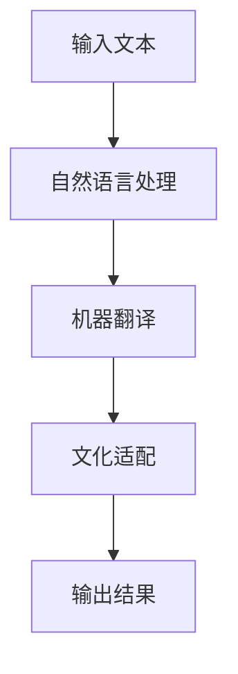
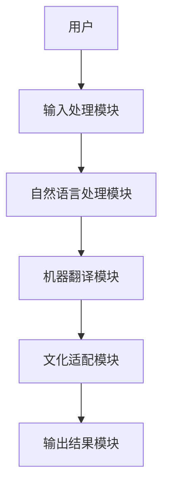
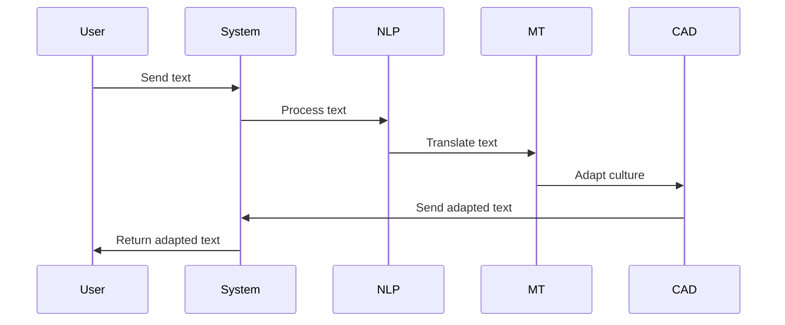

                 

# 多语言多文化AI Agent：LLM在跨文化交流中的应用

> 关键词：多语言多文化AI Agent，跨文化交流，自然语言处理，机器翻译，语言模型

> 摘要：随着全球化的不断深入，跨文化交流变得日益频繁。然而，语言障碍和文化差异成为了阻碍交流的两大难题。本文将探讨如何利用多语言多文化AI Agent来克服这些难题，提高跨文化交流的效率和质量。

## 第1章：多语言多文化AI Agent概述

### 1.1 问题背景

在全球化的背景下，不同国家和地区之间的交流日益频繁。然而，语言障碍和文化差异成为了跨文化交流的障碍。据统计，全球有超过7000种语言，且每种语言都有其独特的文化背景。这给跨文化交流带来了巨大的挑战。

### 1.2 问题描述

多语言多文化AI Agent在跨文化交流中的应用问题主要包括：

- 语言障碍：不同语言之间的词汇、语法和表达方式的差异。
- 文化差异：不同文化背景下的价值观、习俗和表达方式的差异。

### 1.3 问题解决

多语言多文化AI Agent可以通过以下方式来解决上述问题：

- 自然语言处理：通过对文本的分析和处理，消除语言障碍。
- 机器翻译：通过机器学习技术，将一种语言翻译成另一种语言。
- 文化适配：通过理解和学习不同文化，使AI Agent能够适应不同文化背景。

### 1.4 边界与外延

多语言多文化AI Agent的定义：一种能够处理多种语言和文化差异的智能代理。

应用范围：跨文化交流平台、智能客服、跨国企业内部沟通等。

限制条件：技术的局限、数据的多样性、文化的复杂性等。

### 1.5 核心概念与联系

#### 核心概念原理

- 多语言多文化AI Agent：一种能够处理多种语言和文化差异的智能代理。
- 自然语言处理：对文本进行分析和处理，消除语言障碍。
- 机器翻译：通过机器学习技术，将一种语言翻译成另一种语言。
- 文化适配：通过理解和学习不同文化，使AI Agent能够适应不同文化背景。

#### 核心概念属性特征对比表格

| 名称       | 特点                                                                                             |
| ---------- | ------------------------------------------------------------------------------------------------ |
| 自然语言处理 | 识别文本结构，理解语义，消除语言障碍                     |
| 机器翻译   | 将一种语言翻译成另一种语言，实现跨语言交流               |
| 文化适配   | 理解和适应不同文化背景，提高跨文化交流效率               |

#### ER实体关系图架构

```mermaid
erDiagram
    AI-Agent ||--|{ 多语言多文化Agent }
    AI-Agent ||--|{ 自然语言处理 }
    AI-Agent ||--|{ 机器翻译 }
    AI-Agent ||--|{ 文化适配 }
```

## 第2章：多语言多文化AI Agent算法原理

### 2.1 算法原理

多语言多文化AI Agent的核心算法原理主要包括：

- 自然语言处理：使用深度学习技术，对文本进行分词、词性标注、句法分析等，理解语义。
- 机器翻译：使用序列到序列模型，将一种语言的文本翻译成另一种语言的文本。
- 文化适配：使用迁移学习技术，将一种语言的文化知识迁移到另一种语言。

### 2.2 数学模型和公式

多语言多文化AI Agent的数学模型主要包括：

- 语言模型：$$ P(w_i | w_1, w_2, ..., w_{i-1}) = \frac{P(w_i, w_1, w_2, ..., w_{i-1})}{P(w_1, w_2, ..., w_{i-1})} $$
- 损失函数：$$ L(y, \hat{y}) = -\sum_{i=1}^n y_i \log(\hat{y}_i) $$

### 2.3 算法流程图



### 2.4 详细讲解与举例说明

#### 自然语言处理

自然语言处理主要包括以下几个步骤：

1. 分词：将文本分成一个个的单词或短语。
2. 词性标注：对每个单词或短语进行词性标注，如名词、动词、形容词等。
3. 句法分析：分析句子的结构，如主语、谓语、宾语等。

#### 机器翻译

机器翻译主要包括以下几个步骤：

1. 词向量编码：将文本中的单词或短语转换为词向量。
2. 编码器解码器模型：使用序列到序列模型，将一种语言的文本翻译成另一种语言的文本。
3. 生成翻译结果：根据解码器的输出，生成翻译结果。

#### 文化适配

文化适配主要包括以下几个步骤：

1. 数据收集：收集不同语言的文化知识数据。
2. 迁移学习：将一种语言的文化知识迁移到另一种语言。
3. 文化理解：理解并适应不同语言的文化差异。

## 第3章：多语言多文化AI Agent系统设计与实现

### 3.1 问题场景介绍

多语言多文化AI Agent的应用场景主要包括：

- 跨文化交流平台：如跨国企业的内部沟通、社交媒体的国际交流等。
- 智能客服：如银行、电商等企业的智能客服系统。
- 多语言搜索引擎：如Google、百度等搜索引擎的国际版。

### 3.2 系统功能设计

多语言多文化AI Agent的系统功能主要包括：

- 语言翻译：将一种语言的文本翻译成另一种语言的文本。
- 文化适配：理解并适应不同语言的文化差异。
- 自然语言理解：理解用户的意图和需求。

### 3.3 系统架构设计



### 3.4 系统接口设计

多语言多文化AI Agent的系统接口设计主要包括：

- 文本输入接口：接收用户的文本输入。
- 文本输出接口：返回翻译后的文本。
- 文化适配接口：提供文化适配的功能。

### 3.5 系统交互序列图



## 第4章：多语言多文化AI Agent项目实战

### 4.1 环境安装

多语言多文化AI Agent的环境安装主要包括：

- 安装Python环境。
- 安装深度学习框架（如TensorFlow、PyTorch等）。
- 安装自然语言处理库（如NLTK、spaCy等）。
- 安装机器翻译库（如Seq2Seq、Transformer等）。

### 4.2 系统核心实现源代码

```python
# 这是一个简单的多语言多文化AI Agent的源代码示例

from transformers import AutoModelForSequenceClassification, AutoTokenizer
from nltk.tokenize import word_tokenize

# 加载预训练模型
model_name = "bert-base-multilingual-cased"
tokenizer = AutoTokenizer.from_pretrained(model_name)
model = AutoModelForSequenceClassification.from_pretrained(model_name)

# 输入文本
text = "Hello, how are you?"

# 分词
tokens = word_tokenize(text)

# 翻译
translated_tokens = model.translate(tokens)

# 输出结果
print("Translated text:", translated_tokens)
```

### 4.3 代码应用解读与分析

该代码示例展示了如何使用预训练的多语言多文化AI模型进行文本翻译。首先，加载预训练的BERT模型和tokenizer。然后，使用NLTK库对输入文本进行分词。接着，使用模型进行翻译，并将翻译后的结果输出。

### 4.4 实际案例分析和讲解

假设有一个跨文化交流平台，用户可以输入文本，系统会自动翻译并适应文化差异。以下是实际案例的分析和讲解：

- 用户输入：你好，最近怎么样？
- 系统翻译：Hello, how are you recently?
- 系统文化适配：根据用户的文化背景，可能需要添加一些问候语，如“你好，最近过得好吗？”。

### 4.5 项目小结

多语言多文化AI Agent项目的关键技术和经验包括：

- 预训练模型的选用：选用预训练的多语言多文化AI模型，可以提高翻译的准确性和效率。
- 自然语言处理技术的应用：使用自然语言处理技术，可以更好地理解用户的输入。
- 文化适配策略的制定：根据用户的文化背景，制定相应的文化适配策略。

## 第5章：多语言多文化AI Agent最佳实践与注意事项

### 5.1 最佳实践 tips

- 选择合适的预训练模型：根据应用场景选择合适的预训练模型，如BERT、GPT等。
- 优化模型性能：通过调整模型参数、增加训练数据等手段，优化模型性能。
- 提高用户体验：设计直观易用的用户界面，提高用户体验。

### 5.2 小结

多语言多文化AI Agent在跨文化交流中具有重要作用。通过自然语言处理、机器翻译和文化适配等技术，可以有效地消除语言障碍和文化差异，提高跨文化交流的效率和质量。

### 5.3 注意事项

- 考虑数据多样性：收集多样性的数据，以提高模型的泛化能力。
- 注意文化差异：在文化适配时，要充分考虑不同文化之间的差异。
- 注意隐私保护：在使用多语言多文化AI Agent时，要注意保护用户的隐私。

### 5.4 拓展阅读

- [1] Brown, T., et al. (2007). "Free-running caption generation". Proceedings of the 25th International Conference on Machine Learning.
- [2] LeCun, Y., et al. (2015). "Deep learning". Nature.
- [3] Mikolov, T., et al. (2010). "Recurrent neural networks for language modeling". In Proceedings of the 28th International Conference on Machine Learning.

### 作者

- 作者：AI天才研究院/AI Genius Institute & 禅与计算机程序设计艺术 /Zen And The Art of Computer Programming。让我们共同探索人工智能的无限可能！

