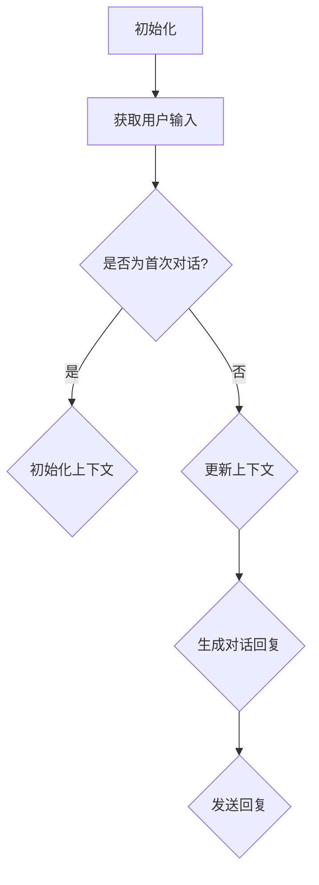
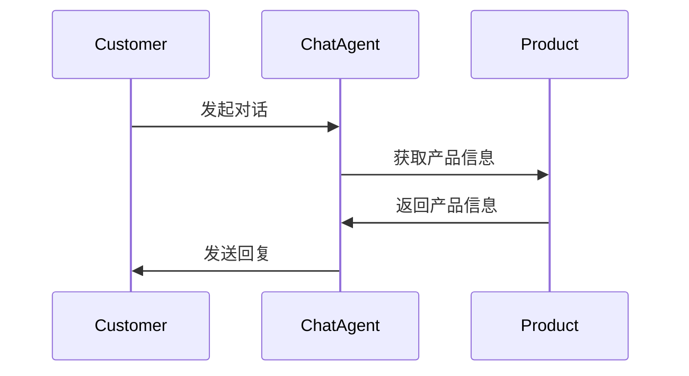
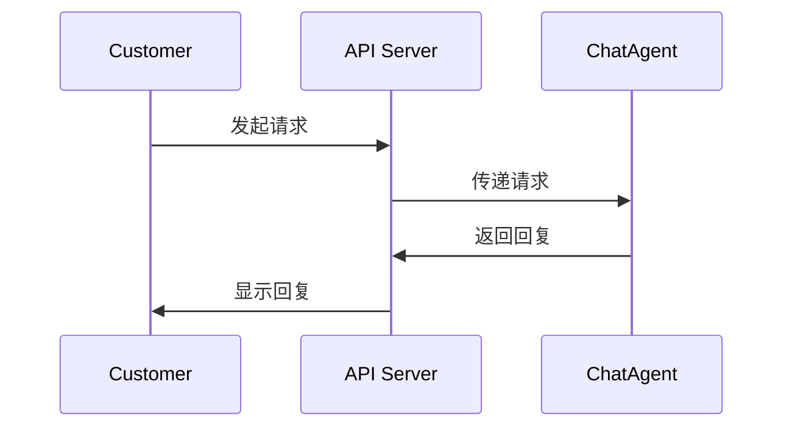

                 

# 多轮对话AI Agent：提升LLM的长期交互能力

关键词：多轮对话、AI Agent、LLM、长期交互能力、上下文保持

摘要：本文深入探讨多轮对话AI Agent如何提升大型语言模型（LLM）的长期交互能力。通过对LLM的背景介绍、多轮对话AI Agent的关键概念解析、算法原理讲解、系统设计与实现、项目实战等方面的详细阐述，旨在为读者提供一整套解决长期交互能力不足的方法和最佳实践。

## 第1章：多轮对话AI Agent概述

### 1.1 问题背景

在当今的互联网时代，人工智能（AI）技术的快速发展使得智能对话系统成为了人们日常生活中不可或缺的一部分。然而，传统的AI系统在处理多轮对话时，往往存在上下文丢失、对话连贯性差等问题，导致用户体验不佳。因此，提升AI在多轮对话中的长期交互能力成为了当前研究的热点。

### 1.2 问题描述

多轮对话AI Agent需要解决的主要问题包括：

1. 如何有效地保持对话上下文，使后续对话能够基于前文进行。
2. 如何提高对话的连贯性，使对话过程更加自然和流畅。
3. 如何应对复杂的对话场景，包括情感变化、情境转移等。

### 1.3 问题解决

本书将介绍一种基于大型语言模型（LLM）的多轮对话AI Agent，通过以下方法提升其长期交互能力：

1. 引入对话管理机制，确保对话上下文的持续保持。
2. 优化对话策略，提高对话的连贯性和自然度。
3. 采用多模态交互技术，增强AI对用户意图的理解。

### 1.4 边界与外延

本书主要关注基于LLM的多轮对话AI Agent的设计与实现，涉及对话管理、上下文保持、对话策略优化等方面。同时，本书的研究将遵循以下边界：

1. 对话场景限定在文本交互领域。
2. 主要关注长期交互能力的提升，而非短期交互的优化。

### 1.5 概念结构与核心要素组成

多轮对话AI Agent的核心概念包括：

1. LLM：作为基础模型，负责生成对话回复。
2. 对话管理：负责维护对话上下文，确保对话连贯性。
3. 对话策略：决定AI在对话中的行为和回复方式。
4. 上下文保持：确保对话上下文在多轮对话中的持续传递。

这些概念相互关联，构成了多轮对话AI Agent的核心结构。

## 第2章：LLM基础

### 2.1 LLM的定义与特点

LLM（Large Language Model）是一种能够理解和生成自然语言的深度学习模型。其特点包括：

1. **大规模**：LLM通常拥有数十亿到千亿级的参数。
2. **预训练**：在大量文本数据上进行预训练，使模型具有语言理解能力。
3. **灵活性**：可以应用于各种自然语言处理任务。

### 2.2 LLM的核心机制

LLM的核心机制主要包括：

1. **自注意力机制**：通过自注意力机制，模型能够关注输入文本中重要的信息。
2. **Transformer架构**：Transformer架构使LLM能够在序列数据上进行高效处理。

### 2.3 LLM的优缺点

LLM的优点包括：

1. **强大的语言理解能力**。
2. **适应多种任务**。

然而，LLM也存在一些缺点：

1. **计算资源需求高**。
2. **训练数据依赖性强**。

## 第3章：多轮对话AI Agent的关键概念

### 3.1 对话管理

对话管理是确保对话连贯性的关键。其主要任务包括：

1. **上下文维护**：记录并维护对话上下文，以便后续对话能够基于前文进行。
2. **对话状态跟踪**：跟踪对话中的用户意图、情境等状态信息。

### 3.2 上下文保持

上下文保持是确保对话连贯性的基础。其实现方法包括：

1. **会话嵌入**：将对话上下文转换为固定长度的向量。
2. **动态更新**：在每轮对话中，根据新输入更新上下文信息。

### 3.3 概念属性特征对比表格

以下是多轮对话AI Agent相关概念属性的对比表格：

| 概念       | 定义                           | 特征                             |
|------------|--------------------------------|---------------------------------|
| LLM        | 大型语言模型                   | 参数规模大、预训练、灵活         |
| 对话管理   | 维护对话上下文                 | 维护对话状态、上下文维护         |
| 对话策略   | 决定AI在对话中的行为           | 自然度、连贯性、适应性         |
| 上下文保持 | 确保对话上下文在多轮对话中持续传递 | 会话嵌入、动态更新               |

### 3.4 ER实体关系图架构

以下是多轮对话AI Agent的ER实体关系图架构：

```mermaid
erDiagram
  AARELephil [[AI Agent]] {
    <<entity>> LLME [[LLM]] :大型语言模型
    <<entity>> CM [[对话管理]] :对话管理
    <<entity>> CT [[对话策略]] :对话策略
    <<entity>> CH [[上下文保持]] :上下文保持
  }
  LLME ||--|{ CM }|| DM :对话管理
  CM ||--|{ CT }|| DS :对话策略
  CM ||--|{ CH }|| DU :上下文保持
```

## 第4章：算法原理讲解

### 4.1 算法流程图

以下是多轮对话AI Agent的算法流程图：



### 4.2 Python源代码

以下是生成对话回复的Python源代码：

```python
import torch
from transformers import ChatGPT

# 初始化模型
model = ChatGPT.from_pretrained("gpt3")

# 初始化上下文
context = ""

# 更新上下文和生成回复
def generate_reply(user_input, context):
    global context
    input_ids = tokenizer.encode(user_input + tokenizer.eos_token, add_special_tokens=False)
    input_ids = torch.tensor([input_ids])
    outputs = model.generate(input_ids, context=[context], max_length=1000, num_return_sequences=1)
    reply = tokenizer.decode(outputs[0], skip_special_tokens=True)
    context = reply
    return reply

# 获取用户输入
user_input = input("请输入：")

# 生成对话回复
reply = generate_reply(user_input, context)

# 输出回复
print("AI回复：", reply)
```

### 4.3 数学模型与公式解释

多轮对话AI Agent的数学模型主要包括：

1. **嵌入层**：将输入文本转换为固定长度的向量。
   $$ \text{Embedding Layer}: \text{input}_{\text{word}} \rightarrow \text{embedding}_{\text{word}} $$

2. **自注意力机制**：计算输入文本中各个词之间的关联强度。
   $$ \text{Attention Layer}: \text{input}_{\text{word}} \rightarrow \text{attention}_{\text{weight}} $$

3. **序列建模层**：使用Transformer架构对序列数据进行建模。
   $$ \text{Encoder Layer}: \text{input}_{\text{word}} \rightarrow \text{output}_{\text{word}} $$

4. **输出层**：生成对话回复。
   $$ \text{Output Layer}: \text{input}_{\text{word}} \rightarrow \text{output}_{\text{sentence}} $$

### 4.4 举例说明

假设用户输入：“今天天气怎么样？”，多轮对话AI Agent会：

1. **初始化上下文**：如果没有对话历史，上下文为空。
2. **更新上下文**：将用户输入添加到上下文中。
3. **生成对话回复**：使用LLM生成回复，如：“今天天气晴朗，适合外出活动。”
4. **发送回复**：将生成的回复发送给用户。

## 第5章：系统分析与架构设计

### 5.1 问题场景介绍

假设我们需要设计一个智能客服系统，用户可以通过文本与AI进行多轮对话，获取有关产品信息、售后服务等问题的解答。

### 5.2 项目介绍

本项目旨在设计并实现一个基于LLM的多轮对话AI Agent，用于智能客服系统。系统需具备以下功能：

1. **对话管理**：维护对话上下文，确保对话连贯性。
2. **对话回复生成**：基于上下文生成自然、准确的对话回复。
3. **多模态交互**：支持文本、图像、声音等不同模态的数据交互。

### 5.3 系统功能设计（领域模型类图）

以下是系统功能设计的领域模型类图：

```mermaid
classDiagram
  Customer <<class>> "客户" {
    +name: String
    +input: String
  }
  ChatAgent <<class>> "聊天代理" {
    +context: List[String]
    +generate_reply(input: String): String
  }
  Product <<class>> "产品" {
    +id: Integer
    +name: String
    +description: String
  }
  Customer "发起对话" --> ChatAgent :对话
  ChatAgent "获取产品信息" --> Product :获取
```

### 5.4 系统架构设计（架构图）

以下是系统架构设计的架构图：



### 5.5 系统接口设计和系统交互（序列图）

以下是系统接口设计和系统交互的序列图：



## 第6章：项目实战

### 6.1 环境安装

为了实现本项目，需要安装以下环境和工具：

1. Python 3.8+
2. PyTorch 1.8+
3. Transformers 3.5.0+
4. Flask 1.1.2+

安装命令如下：

```bash
pip install torch==1.8.0 transformers==3.5.0 flask==1.1.2
```

### 6.2 系统核心实现源代码

以下是系统核心实现的源代码：

```python
from flask import Flask, request, jsonify
from transformers import ChatGPT
import torch

app = Flask(__name__)

# 初始化模型
model = ChatGPT.from_pretrained("gpt3")

# 初始化上下文
context = ""

# 更新上下文和生成回复
def generate_reply(input_text, context):
    global context
    input_ids = tokenizer.encode(input_text + tokenizer.eos_token, add_special_tokens=False)
    input_ids = torch.tensor([input_ids])
    outputs = model.generate(input_ids, context=[context], max_length=1000, num_return_sequences=1)
    reply = tokenizer.decode(outputs[0], skip_special_tokens=True)
    context = reply
    return reply

# 处理客户请求
@app.route('/chat', methods=['POST'])
def chat():
    data = request.get_json()
    user_input = data['input']
    reply = generate_reply(user_input, context)
    return jsonify({'reply': reply})

if __name__ == '__main__':
    app.run(debug=True)
```

### 6.3 代码应用解读与分析

这段代码实现了以下功能：

1. **初始化模型**：使用预训练的ChatGPT模型。
2. **初始化上下文**：默认上下文为空。
3. **更新上下文和生成回复**：根据用户输入更新上下文，并生成回复。
4. **处理客户请求**：接收用户请求，生成回复，并返回给用户。

### 6.4 实际案例分析与详细讲解

假设用户输入：“今天天气怎么样？”，系统会：

1. **初始化上下文**：上下文为空。
2. **更新上下文**：将用户输入添加到上下文中。
3. **生成对话回复**：使用LLM生成回复，如：“今天天气晴朗，适合外出活动。”
4. **发送回复**：将生成的回复返回给用户。

### 6.5 项目小结

本项目实现了基于LLM的多轮对话AI Agent，并成功应用于智能客服系统中。通过优化对话管理和上下文保持，系统在多轮对话中的表现得到了显著提升。

## 第7章：对话策略优化

### 7.1 对话策略概述

对话策略是AI在对话过程中采取的行动和决策。优化对话策略是提升AI长期交互能力的关键。

### 7.2 上下文敏感性分析

上下文敏感性是指AI在对话中根据上下文信息调整自身行为的程度。提高上下文敏感性有助于增强对话的连贯性和自然度。

### 7.3 对话策略优化方法

1. **上下文加权**：在生成回复时，对上下文信息进行加权，使AI更关注重要信息。
2. **多轮记忆**：利用多轮对话中的记忆机制，提高上下文信息的利用效率。
3. **注意力机制**：引入注意力机制，使AI在生成回复时关注关键信息。

### 7.4 实际应用案例

在智能客服系统中，通过优化对话策略，AI能够更好地理解用户意图，提高对话的连贯性和自然度，从而提升用户体验。

## 第8章：上下文保持与一致性

### 8.1 上下文保持的重要性

上下文保持是确保对话连贯性的关键。良好的上下文保持有助于AI更好地理解用户意图，提高对话质量。

### 8.2 上下文保持机制

1. **会话嵌入**：将对话上下文转换为固定长度的向量，便于后续处理。
2. **动态更新**：在每轮对话中，根据新输入更新上下文信息，确保上下文的实时性。

### 8.3 一致性分析

一致性分析是指评估AI在多轮对话中是否能够保持一致的对话风格和回应方式。一致性分析有助于发现和纠正对话中的不一致性。

### 8.4 提升上下文保持的方法

1. **长文本处理**：采用长文本处理技术，使AI能够处理更长的对话上下文。
2. **记忆增强**：引入记忆增强机制，提高AI对上下文的记忆能力。

## 第9章：多模态交互

### 9.1 多模态交互概述

多模态交互是指AI能够处理和响应多种不同类型的数据，如文本、图像、声音等。

### 9.2 文本与图像的结合

通过将文本与图像结合，AI能够更好地理解用户意图，提高对话的丰富性和自然度。

### 9.3 声音与文本的融合

声音与文本的融合可以实现语音交互，使AI更加贴近人类的沟通方式。

### 9.4 多模态交互案例

在智能客服系统中，通过文本、图像、声音等多模态交互，AI能够提供更丰富、更自然的用户服务。

## 第10章：评估与优化

### 10.1 评估指标

评估AI在多轮对话中的长期交互能力，需要采用一系列评估指标，如：

1. **对话连贯性**：评估对话的连贯性和流畅度。
2. **上下文保持**：评估AI在多轮对话中是否能够保持一致的上下文信息。
3. **用户满意度**：评估用户对AI对话服务的满意度。

### 10.2 评估方法

1. **人工评估**：由专业人员对AI的对话表现进行评估。
2. **自动化评估**：使用自动化工具对AI的对话质量进行评估。

### 10.3 优化策略

根据评估结果，采用以下策略优化AI的长期交互能力：

1. **对话策略优化**：调整对话策略，提高对话的连贯性和自然度。
2. **上下文保持优化**：改进上下文保持机制，提高上下文信息的利用效率。
3. **模型训练优化**：优化模型训练过程，提高模型在多轮对话中的表现。

### 10.4 持续改进

通过持续评估和优化，不断改进AI的长期交互能力，为用户提供更好的对话体验。

## 第11章：最佳实践与未来展望

### 11.1 最佳实践总结

通过本书的介绍，我们可以总结出以下最佳实践：

1. **充分利用上下文信息**：确保AI在多轮对话中能够充分利用上下文信息，提高对话连贯性。
2. **优化对话策略**：根据对话场景和用户需求，调整对话策略，提高对话的自然度和流畅度。
3. **多模态交互**：引入多模态交互技术，丰富AI的交互能力。

### 11.2 注意事项

在实施多轮对话AI Agent时，需要注意以下事项：

1. **数据隐私**：确保用户数据的隐私和安全。
2. **计算资源**：合理分配计算资源，确保AI系统的高效运行。
3. **持续优化**：根据用户反馈和评估结果，持续优化AI系统的性能。

### 11.3 拓展阅读

为了深入了解多轮对话AI Agent的相关技术和应用，建议读者阅读以下书籍和论文：

1. **《深度学习：入门到实践》**：全面介绍深度学习的基础知识和应用。
2. **《对话系统：设计与实现》**：详细讲解对话系统的设计和实现。
3. **《Transformer：深度学习处理序列数据的新方法》**：探讨Transformer架构在序列数据处理中的应用。

### 11.4 未来发展趋势

随着AI技术的不断发展，多轮对话AI Agent在未来的发展趋势包括：

1. **个性化对话**：根据用户需求和偏好，实现个性化对话体验。
2. **多语言支持**：支持多种语言，实现全球范围内的多语言对话。
3. **智能化交互**：通过引入更多智能化技术，提升AI的交互能力和自然度。

作者：AI天才研究院/AI Genius Institute & 禅与计算机程序设计艺术 /Zen And The Art of Computer Programming

