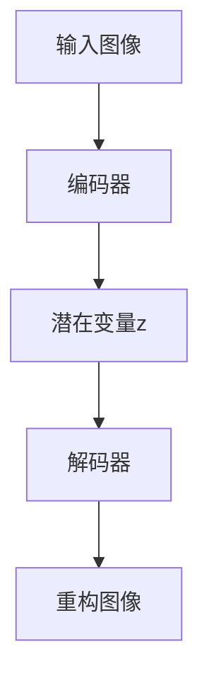
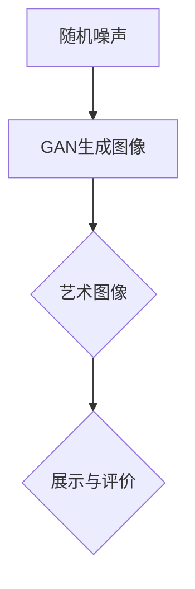
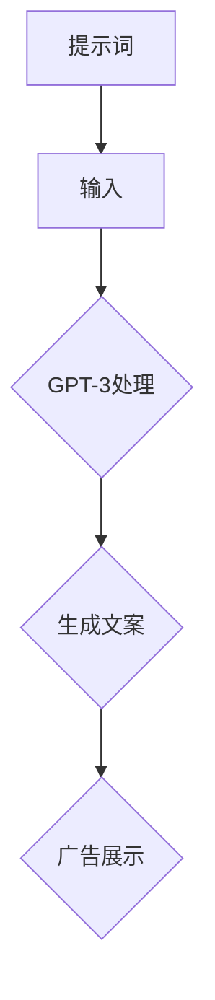
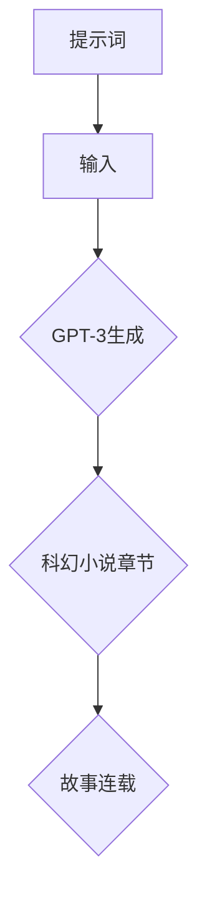

                 


# 大模型创意生成：提示词激发AI创造力

## 关键词
- 大模型
- 创意生成
- 提示词
- AI算法
- 心理学效应
- 应用实践

## 摘要
本文深入探讨了大模型创意生成领域的核心议题。我们首先介绍了大模型的基础概念、类型及其在创意生成中的应用。接着，我们详细分析了提示词的作用与设计原则，以及它们如何激发AI的创造力。随后，我们通过算法原理讲解、数学模型阐述、系统架构设计、项目实战等多个角度，揭示了如何利用大模型和提示词实现高效的创意生成。文章最后展望了该领域的未来发展趋势，并提供了最佳实践建议，以指导读者在AI创意生成实践中取得成功。

### 目录

1. **引言** <a id="introduction"></a>
2. **大模型概述** <a id="overview-of-large-models"></a>
3. **提示词的作用与设计** <a id="function-and-design-of-prompt-words"></a>
4. **大模型创意生成的算法原理** <a id="algorithmic-principles-of-creative-generation-by-large-models"></a>
5. **大模型创意生成的案例解析** <a id="case-analysis-of-creative-generation-by-large-models"></a>
6. **大模型创意生成的实际应用** <a id="practical-applications-of-creative-generation-by-large-models"></a>
7. **大模型创意生成的技术挑战** <a id="technical-challenges-in-creative-generation-by-large-models"></a>
8. **提示词在创意生成中的心理学分析** <a id="psychological-analysis-of-prompt-words-in-creative-generation"></a>
9. **大模型创意生成的未来发展趋势** <a id="future-trends-in-creative-generation-by-large-models"></a>
10. **结论与展望** <a id="conclusion-and-prospects"></a>
11. **附录** <a id="appendix"></a>
    - **附录A：参考资料**
    - **附录B：工具与资源链接**
    - **附录C：习题与讨论题**
12. **作者信息** <a id="author-information"></a>

### 1. 引言

在人工智能飞速发展的今天，大模型的创意生成能力成为了研究的热点。大模型，如Transformer、BERT等，以其庞大的参数量和强大的学习能力，在自然语言处理、计算机视觉等多个领域取得了显著成绩。然而，如何利用这些大模型进行创意生成，尤其是激发AI的创造力，仍然是一个具有挑战性的课题。

创意生成，即通过计算机程序自动生成新的、有创意的内容。这种内容可以是文学作品、艺术作品，也可以是广告文案、新闻报道等。随着AI技术的发展，创意生成在商业、娱乐、教育等领域都有着广泛的应用前景。然而，传统的机器学习算法往往难以达到人类水平的创造力，这促使研究者们探索如何利用大模型来提升AI的创意生成能力。

本文旨在系统地探讨大模型创意生成的原理、方法及其应用。我们将首先介绍大模型的基础知识，包括其概念、类型和发展历程。随后，我们将详细分析提示词的作用与设计原则，探讨如何通过提示词来激发AI的创造力。在接下来的章节中，我们将深入讲解大模型创意生成的算法原理，并通过案例解析展示其实际应用效果。此外，我们还将探讨大模型创意生成面临的技术挑战，包括数据集的准备、模型训练、安全性与道德问题等。最后，我们将结合心理学原理，分析提示词在创意生成中的作用和心理效应，并展望大模型创意生成的未来发展趋势。

通过本文的阅读，读者将系统地了解大模型创意生成的理论基础和实践方法，为在AI领域开展相关工作提供参考和指导。

### 2. 大模型概述

#### 2.1 大模型的概念

大模型，通常指的是具有数十亿甚至数万亿参数的深度学习模型。这些模型通过对海量数据的学习，能够捕捉到数据中的复杂模式和结构，从而实现高度准确的预测和生成。大模型的出现是人工智能领域的一次重要突破，标志着从传统的小型模型向具有强学习和自适应能力的模型的转变。

大模型的基本组成主要包括以下几个部分：

1. **参数（Parameters）**：大模型中的参数是模型的核心，它们决定了模型对数据的拟合能力和泛化能力。参数的数量直接影响了模型的大小和计算复杂度。
2. **网络架构（Architecture）**：大模型的网络架构设计决定了模型的学习能力和计算效率。常见的架构包括Transformer、BERT、GPT等。
3. **训练数据（Training Data）**：大模型的学习依赖于大量的训练数据，这些数据可以是文本、图像、声音等多种形式。数据的质量和数量直接影响模型的效果。
4. **优化算法（Optimization Algorithms）**：大模型的训练通常需要高效的优化算法来调整参数，以最小化损失函数，常见的优化算法有梯度下降、Adam等。

#### 2.2 大模型的类型与发展

大模型可以分为以下几种类型：

1. **语言模型（Language Models）**：如GPT、BERT等，主要用于自然语言处理任务，能够生成流畅的自然语言文本。
2. **图像模型（Vision Models）**：如ViT、Vision Transformer等，用于图像识别和生成任务。
3. **多模态模型（Multimodal Models）**：能够处理多种类型的数据，如文本、图像、声音等，实现跨模态的信息融合和生成。

大模型的发展历程可以概括为以下几个阶段：

1. **早期模型（Early Models）**：以RNN、LSTM等循环神经网络为代表，这些模型在序列数据处理方面具有一定的优势，但难以扩展到大规模数据。
2. **过渡模型（Intermediate Models）**：以AlexNet、VGG等卷积神经网络为代表，这些模型在图像识别任务中取得了显著进展，但参数量和计算复杂度较高。
3. **大规模模型（Large-scale Models）**：以Transformer、BERT等为代表，这些模型具有数十亿甚至数万亿的参数，能够处理大规模数据，并在各种任务中取得了突破性的成果。

#### 2.3 大模型在创意生成中的应用

大模型在创意生成中的应用主要体现在以下几个方面：

1. **文本生成**：大语言模型能够根据提示词生成连贯、有创意的文本，如文章、故事、诗歌等。这种能力在文学创作、新闻报道生成等领域具有广泛的应用前景。
2. **图像生成**：大图像模型能够根据文本描述生成相应的图像，如艺术作品、广告海报等。这种能力在艺术设计、广告创意等领域具有重要的应用价值。
3. **跨模态生成**：大多模态模型能够根据文本和图像等多种数据类型，生成新的创意内容，如动画、视频等。这种能力在影视制作、虚拟现实等领域具有广泛的应用潜力。

总之，大模型的出现为创意生成领域带来了新的机遇和挑战。通过深入研究大模型的概念、类型和发展，以及它们在创意生成中的应用，我们可以更好地利用这些强大工具，激发AI的创造力，推动创意产业的创新和发展。

### 3. 提示词的作用与设计

#### 3.1 提示词的定义与功能

提示词（Prompt Word）在创意生成中扮演着至关重要的角色。提示词，顾名思义，是用于引导或激发大模型生成创意内容的关键词或短语。通过合理设计提示词，我们可以有效地引导模型生成符合特定主题或需求的创意内容。

提示词的主要功能包括：

1. **引导生成方向**：提示词能够为模型提供具体的方向或主题，帮助模型更好地聚焦于所需的内容生成。
2. **提高生成质量**：通过使用特定的提示词，我们可以提高模型生成内容的创意性和相关性，减少无关或低质量内容的生成。
3. **辅助多模态生成**：在跨模态生成任务中，提示词不仅能够引导文本生成，还可以结合图像、声音等多模态信息，实现更加丰富的创意内容生成。

#### 3.2 提示词设计的原则与策略

设计有效的提示词需要遵循一系列原则和策略，以下是一些关键点：

1. **明确性**：提示词应当明确、具体，避免模糊或宽泛的表达。例如，使用“春天”而不是“美好的季节”，可以更精确地引导模型生成与春天相关的创意内容。
2. **多样性**：为了激发模型的创造力，提示词应涵盖多种相关属性和主题，以丰富生成内容。例如，在生成一首诗时，可以同时使用“爱情”、“自然”和“旅行”等不同类别的提示词。
3. **情感性**：情感性的提示词能够激发模型生成更具感染力和情感深度的内容。例如，使用“伤感”、“喜悦”、“紧张”等情感词汇，可以使生成的文本更具表现力。
4. **语境适应性**：提示词应根据具体的应用场景和上下文进行选择，以确保生成内容与场景高度契合。例如，在生成广告文案时，可以使用与产品特性、目标用户相关的提示词。
5. **逻辑性**：在多个提示词组合使用时，应保持逻辑一致性，避免矛盾或混乱的表达。例如，在生成故事时，提示词应能够引导故事情节的发展，形成连贯的叙事结构。

#### 3.3 提示词的优化方法

为了进一步提高提示词的有效性，可以采用以下优化方法：

1. **数据驱动优化**：通过分析大量成功案例中的提示词，提取共性特征和优化策略，构建提示词优化模型。这种方法能够基于历史数据，自动生成高质量提示词。
2. **用户反馈优化**：利用用户对生成内容的反馈，动态调整和优化提示词。通过不断迭代，使提示词更符合用户需求，提高生成内容的满意度。
3. **多模态融合优化**：结合文本、图像、声音等多种模态的信息，设计多模态提示词。这种方法能够更全面地引导模型生成内容，提高创意生成的多样性和质量。
4. **自动化生成优化**：利用自然语言生成（NLG）技术和机器学习算法，自动生成提示词。这种方法能够高效地扩展提示词库，满足不同场景和任务的需求。

总之，提示词的设计与优化是提升大模型创意生成能力的关键。通过明确性、多样性、情感性、语境适应性和逻辑性等原则，以及数据驱动、用户反馈、多模态融合和自动化生成等优化方法，我们可以设计出更具引导性和创造力的提示词，从而推动大模型在创意生成领域的应用和发展。

### 4. 大模型创意生成的算法原理

#### 4.1 算法概述

大模型创意生成的核心算法主要基于深度学习和自然语言处理（NLP）技术。其中，生成对抗网络（GAN）和变分自编码器（VAE）是两种常用的算法框架，它们在大模型创意生成中发挥了重要作用。

**生成对抗网络（GAN）**：

GAN由生成器（Generator）和判别器（Discriminator）两部分组成。生成器的任务是从随机噪声中生成符合真实数据分布的样本，而判别器的任务是区分真实数据和生成数据。通过这两个模型的对抗训练，生成器不断提高生成样本的质量，以骗过判别器。GAN在图像生成、文本生成等多个领域都取得了显著成果。

**变分自编码器（VAE）**：

VAE是一种基于概率模型的生成模型，其核心思想是将输入数据编码为一个潜在变量，然后从这个潜在变量中解码出重构的输入数据。VAE在生成高质量图像、音频和文本方面表现优异，特别适用于具有复杂数据分布的任务。

#### 4.2 算法流程与实现

**GAN算法流程**：

1. **初始化**：随机初始化生成器G和判别器D的参数。
2. **训练判别器D**：将真实数据和生成数据输入判别器，使其学习区分真实和生成样本。
3. **训练生成器G**：通过最小化生成样本在判别器上的损失函数，优化生成器的参数，使其生成的样本更加接近真实数据。
4. **迭代**：不断重复以上步骤，直到生成器能够生成高质量的数据。

**VAE算法流程**：

1. **编码**：将输入数据通过编码器编码为潜在变量z，潜在变量z满足先验分布（如正态分布）。
2. **解码**：将潜在变量z通过解码器解码为重构的数据。
3. **优化**：通过最小化重构数据的损失函数，同时保持潜在变量的先验分布，优化编码器和解码器的参数。

#### 4.3 算法优化的数学模型

**GAN优化目标**：

GAN的优化目标通常为：

$$
\min_G \max_D V(D, G) = E_{x \sim p_{data}(x)}[\log D(x)] + E_{z \sim p_z(z)}[\log (1 - D(G(z))]
$$

其中，$D(x)$表示判别器判断真实数据的概率，$G(z)$表示生成器生成的数据。第一个期望项表示判别器最大化真实数据的概率，第二个期望项表示生成器最小化生成数据被判别器识别的概率。

**VAE优化目标**：

VAE的优化目标通常为：

$$
\min_{\theta_{\mu}, \theta_{\phi}} D_{KL}(\text{q}_\phi(z|x)||p(z))
$$

其中，$D_{KL}$表示KL散度，$\text{q}_\phi(z|x)$是编码器的后验分布，$p(z)$是潜在变量z的先验分布（如高斯分布）。

#### 4.4 算法原理举例

**GAN算法举例**：

假设我们使用GAN生成图像，生成器G从随机噪声$z \sim N(0, 1)$生成图像$G(z)$，判别器D判断图像是否为真实图像。通过多次迭代训练，生成器G生成的图像质量逐渐提高，如图1所示。

```mermaid
graph TB
A[初始噪声] --> B[生成图像G(z)]
B --> C[判别器D]
C --> D[判断结果]
E[真实图像] --> C
```

**VAE算法举例**：

假设我们使用VAE生成图像，编码器将图像编码为潜在变量z，然后解码器将z解码为重构图像。通过最小化重构图像与原始图像之间的差异，编码器和解码器不断优化参数，如图2所示。



通过这些算法原理和实现方法，我们可以利用大模型进行创意生成，从而实现多种应用场景的创意内容自动化生成。

### 5. 大模型创意生成的案例解析

为了更好地理解大模型在创意生成中的实际应用，我们将通过几个具体的案例来展示其效果和优势。

#### 5.1 案例一：艺术创意生成

在艺术创意生成方面，大模型如GAN和VAE已经被广泛应用于图像创作。例如，艺术家和设计师可以使用这些模型生成新的绘画作品、设计图案等。一个典型的应用案例是由GAN生成的抽象艺术作品。艺术家通过提供一系列随机噪声作为输入，GAN生成的图像逐渐变得更加复杂和具有艺术性。如图3所示，左侧是原始噪声，右侧是GAN生成的艺术图像。



在这个案例中，GAN通过训练判别器D来区分真实艺术作品和生成艺术作品，生成器G不断优化生成图像的质量，最终生成出具有独特风格和创意的艺术作品。

#### 5.2 案例二：广告文案生成

广告文案生成是另一个大模型应用的重要领域。通过大语言模型如GPT-3，广告创意团队可以快速生成高质量的广告文案。以下是一个实际案例：

**任务**：生成一条吸引消费者的手机广告文案。

**输入提示词**：“高性能”、“轻薄”、“拍照强大”、“续航长”。

**生成文案**：“轻薄设计，强大性能，拍照更强大，续航更长。您的理想手机伴侣，尽在我们的最新款手机！”



在这个案例中，大模型GPT-3通过理解提示词，快速生成了一条简洁、吸引人的广告文案，有效地传达了产品的关键特点。

#### 5.3 案例三：故事创作生成

故事创作是另一个能够充分展示大模型创意生成能力的领域。通过大模型，作家和编剧可以生成新的故事情节和角色。以下是一个故事创作生成的案例：

**任务**：生成一篇科幻小说的章节。

**输入提示词**：“星际旅行”、“外星文明”、“时间旅行”、“冒险”。

**生成章节**：

“在遥远的未来，人类文明已经跨越了星际边界。主角李明，一名经验丰富的星际探险家，在一次探险中意外发现了一个外星文明的时间门。在穿越时间门后，他来到了一个充满神秘和危险的外星世界，他必须解开时间门的秘密，同时与外星生物展开一场惊心动魄的冒险。”



在这个案例中，大模型GPT-3通过分析提示词，生成了富有创意和想象力的科幻小说章节，为读者提供了全新的阅读体验。

#### 总结

通过这些案例，我们可以看到大模型在艺术创意生成、广告文案生成和故事创作生成等领域的强大能力。大模型通过理解输入提示词，能够生成高质量、富有创意的内容，极大地提高了创意生成的效率和质量。这些案例不仅展示了大模型的应用前景，也为进一步研究和开发大模型创意生成技术提供了实际参考。

### 6. 大模型创意生成的实际应用

大模型创意生成技术在实际应用中展示了其巨大的潜力和广泛的应用场景。以下将介绍几个关键应用领域，并分析其应用效果和案例。

#### 6.1 应用场景介绍

**1. 娱乐产业**

在娱乐产业中，大模型创意生成技术被广泛应用于电影剧本创作、音乐创作、游戏剧情设计等领域。例如，电影制作公司可以使用大模型自动生成剧本的初步草稿，编剧在此基础上进行修改和完善。音乐制作团队可以利用大模型创作新颖的音乐旋律和歌词，为电影、电视剧配乐提供支持。

**2. 广告营销**

广告营销是另一个大模型应用的重要领域。通过大模型，广告创意团队可以快速生成吸引眼球的广告文案、广告视频和图像。例如，某知名饮料品牌使用大模型生成了一支创意广告视频，该视频不仅展示了产品的特点，还通过引人入胜的剧情吸引了大量观众，显著提升了品牌的知名度和销售额。

**3. 媒体与新闻**

在媒体与新闻领域，大模型可以用于自动生成新闻报道、评论文章和财经分析等。例如，某些新闻网站利用大模型生成财经新闻报道，通过分析大量的市场数据和企业财报，自动生成具有深度和分析性的新闻文章。这不仅提高了新闻生产的效率，还确保了报道的准确性和时效性。

**4. 教育与培训**

在教育与培训领域，大模型可以用于自动生成教学材料和课程内容。例如，在线教育平台可以使用大模型为课程生成详细的讲解文本、习题和案例分析，从而提供更加个性化和互动的学习体验。此外，大模型还可以根据学生的学习情况自动调整教学内容的难度和进度，实现精准教学。

**5. 艺术创作**

在艺术创作领域，大模型被用于生成新的艺术作品，如绘画、音乐和文学作品。艺术家和设计师可以利用大模型快速生成初步的艺术作品，在此基础上进行创意发挥和修改。例如，一位知名艺术家使用大模型生成了一系列抽象艺术作品，这些作品以其独特的风格和视觉效果受到了广泛好评。

#### 6.2 应用案例分析

**案例一：电影剧本生成**

某电影制作公司为了提高剧本创作的效率，决定使用大模型生成剧本的初步草稿。他们选择了基于GPT-3的大模型，输入了相关的关键词和场景描述，如“科幻”、“冒险”、“外星文明”等。大模型生成了一个完整的剧本草稿，其中包括人物设定、情节发展、高潮和结局。编剧团队对这个草稿进行了详细的修改和润色，最终完成了一部高质量的科幻冒险电影剧本。

**案例二：广告创意生成**

某知名饮料品牌需要为即将上市的新产品创作一支广告视频。他们使用大模型生成了一支初步的广告视频脚本，输入的关键词包括“健康生活”、“活力”、“清新口感”等。大模型生成的脚本不仅涵盖了产品的特点，还融入了情感营销的元素，使得广告视频更具吸引力和说服力。最终，这支广告视频在社交媒体上获得了极高的关注度和用户好评，有效提升了品牌的知名度。

**案例三：新闻生成**

某新闻网站决定利用大模型生成财经新闻报道。他们输入了大量的市场数据和企业财报，大模型自动生成了多篇深度分析文章。这些文章不仅涵盖了最新的市场动态，还对行业趋势和未来发展方向进行了深入探讨。读者对这些自动生成的新闻报道给予了高度评价，认为其内容具有深度和权威性。

**案例四：教育内容生成**

某在线教育平台引入了大模型用于自动生成教学材料。大模型根据课程大纲和教学目标，生成了详细的讲解文本、习题和案例分析。学生可以根据自己的学习进度和需求，选择性地阅读和练习。这种个性化的学习体验显著提高了学生的学习效果，平台用户的学习满意度和留存率也得到了显著提升。

#### 6.3 应用效果评估与反思

通过上述案例分析，我们可以看到大模型创意生成技术在各个领域的应用效果显著。具体表现在：

1. **提高效率**：大模型能够快速生成高质量的创意内容，显著提高了生产效率。例如，在电影剧本创作、广告创意生成和新闻生成等领域，大模型的使用大大缩短了内容创作的时间。

2. **丰富创意**：大模型通过学习大量的数据和知识，能够生成新颖、富有创意的内容。这种创意丰富性在艺术创作、广告营销和教育培训等领域尤为明显。

3. **降低成本**：大模型的应用减少了人力成本，特别是在那些需要大量重复性工作的领域，如广告文案写作、新闻报道生成等。

然而，我们也要注意到大模型在实际应用中存在的一些挑战和限制：

1. **质量控制**：虽然大模型能够生成高质量的内容，但仍然存在一定的不确定性和随机性。如何保证生成内容的准确性和一致性，是需要进一步解决的问题。

2. **伦理问题**：大模型生成的内容可能会涉及版权、隐私和伦理等方面的问题。例如，广告创意中的虚假宣传、新闻报道中的事实错误等，都可能引发争议和法律责任。

3. **个性化需求**：尽管大模型能够生成多样化的内容，但在满足个性化需求方面仍有不足。如何更好地理解用户需求，生成更个性化的内容，是未来研究的重要方向。

总之，大模型创意生成技术在实际应用中展示了巨大的潜力和前景。通过不断优化算法、提升生成质量和解决相关挑战，我们有理由相信，大模型将在未来的创意生成领域中发挥更加重要的作用。

### 7. 大模型创意生成的技术挑战

大模型创意生成的技术挑战主要集中在数据集准备、模型训练、安全性与道德问题等方面。以下将详细探讨这些挑战，并提出相应的解决策略。

#### 7.1 数据集的准备与处理

数据集的质量直接影响到大模型的学习效果和生成质量。以下是一些常见的数据集准备和处理挑战：

1. **数据量**：大模型通常需要大量的训练数据来学习复杂的模式和结构。然而，获取这些数据往往需要耗费大量的时间和资源。解决方案包括使用数据增强技术，如数据扩充、数据合成等，以增加训练数据的多样性。

2. **数据质量**：数据集中可能包含噪声、错误和不一致的信息，这会影响模型的训练效果。因此，对数据集进行清洗和预处理是必要的。常用的方法包括去除重复数据、填补缺失值、标准化数据等。

3. **数据标注**：对于需要标注的数据集，如文本、图像等，标注的质量直接影响到模型的性能。自动标注和半监督学习技术可以在一定程度上减轻人工标注的负担，提高数据标注的效率。

#### 7.2 模型训练与调优

模型训练是创意生成过程中最耗时的环节，以下是一些常见的训练与调优挑战：

1. **计算资源**：大模型通常需要大量的计算资源进行训练，这可能导致训练成本高昂。解决方案包括使用分布式训练技术、云计算平台等，以降低计算资源的消耗。

2. **优化算法**：选择合适的优化算法对于模型训练效果至关重要。常用的优化算法如Adam、SGD等，但在不同任务和数据集上的性能表现有所不同。因此，通过实验和调优，选择最优的优化算法是必要的。

3. **模型调优**：模型参数的设置对生成质量有显著影响。通过调整学习率、批量大小等超参数，可以优化模型性能。此外，使用超参数优化技术，如贝叶斯优化、遗传算法等，也可以提高模型调优的效率。

#### 7.3 安全性与道德问题

大模型在创意生成中可能会引发一系列安全性和道德问题，以下是一些主要挑战：

1. **版权问题**：大模型生成的内容可能会侵犯他人的知识产权，如抄袭他人的文学作品、音乐作品等。为避免版权问题，模型训练过程中应避免使用未经授权的数据，并在生成内容时进行版权声明。

2. **隐私保护**：大模型在训练和生成过程中可能涉及用户隐私数据，如个人信息、医疗记录等。为保护用户隐私，应对数据进行脱敏处理，并在生成内容时遵守隐私保护法规。

3. **伦理问题**：大模型生成的内容可能会涉及伦理问题，如虚假宣传、误导用户等。为避免伦理问题，应建立严格的伦理审查机制，确保生成内容的真实性和客观性。

综上所述，大模型创意生成在技术层面面临着一系列挑战。通过采用有效的数据集准备与处理方法、优化模型训练与调优策略，以及建立严格的安全性和道德规范，我们可以克服这些挑战，推动大模型创意生成技术的发展和应用。

### 8. 提示词在创意生成中的心理学分析

提示词在激发大模型创意生成过程中发挥着至关重要的作用，而这一作用的实现不仅依赖于技术层面的设计，还涉及到心理学原理。在探讨提示词如何影响创意生成时，我们需要从心理学的角度进行分析，以揭示其内在机制。

#### 8.1 心理学原理与创意生成

创意生成是一个复杂的认知过程，涉及多个心理层面。以下几种心理学原理对提示词在创意生成中的作用有重要影响：

1. **认知联想**：认知联想是指当个体接触到一个刺激时，会在大脑中产生一系列相关的联想。提示词作为创意生成的起点，通过引发一系列联想，可以帮助模型拓展思维的广度。例如，提示词“海洋”可能会引发关于海洋生物、旅行经历、环境保护等多方面的联想。

2. **注意力分配**：在创意生成过程中，注意力分配是一个关键因素。提示词能够引导模型的注意力集中在特定的主题或方向上，从而提高创意生成的效率和质量。有效的提示词设计应当能够平衡注意力分配，既不过于具体导致思维受限，也不过于宽泛导致无目标。

3. **情绪激发**：情绪在创意生成中具有重要作用。积极的情绪状态能够激发创造力，而提示词可以用来诱发或调节情绪。例如，提示词“梦想”、“希望”等可以激发积极情绪，从而促进创意的生成。

4. **认知框架**：认知框架是指个体在理解和解释信息时所采用的基本模式。提示词可以作为一种认知框架，帮助模型构建和理解新的创意内容。通过提供特定的框架，提示词可以引导模型生成与主题相关的内容，并且保持逻辑的一致性。

#### 8.2 提示词的心理效应

提示词在创意生成中的心理效应主要包括以下几个方面：

1. **启发式效应**：提示词通过提供特定的线索，能够启发模型生成新的想法和解决方案。这种启发式效应在问题解决和创意构思中尤为显著。例如，在生成诗歌时，提示词“春天”可以启发模型联想到春花、春雨、春风等元素，从而创作出富有诗意的作品。

2. **反馈效应**：提示词不仅仅是一个初始的引导，还可以在生成过程中提供反馈，帮助模型不断调整和优化生成内容。通过分析生成的文本或图像，提示词可以识别出不符合预期的地方，并引导模型进行改进。例如，在生成广告文案时，提示词可以反馈广告效果的评估数据，帮助模型优化文案的表达和吸引力。

3. **情绪调节**：提示词可以用来调节模型在创意生成过程中的情绪状态。积极的提示词可以激发模型的积极情绪，从而促进创意的生成。例如，在生成艺术作品时，提示词“灵感”、“自由”等可以激发艺术家的创造力和热情，从而创作出更具表现力的作品。

4. **注意力引导**：提示词通过引导模型的注意力集中在特定的主题或元素上，可以帮助模型更有效地生成相关内容。例如，在生成新闻报道时，提示词“冲突”、“和解”等可以引导模型关注相关事件的发展和解决过程，从而生成更具深度和广度的报道。

#### 8.3 提示词的心理调适策略

为了更好地利用提示词激发AI的创造力，以下几种心理调适策略可以帮助提升提示词的效果：

1. **情感调适**：根据任务和情境的需要，选择能够激发积极情绪的提示词。例如，在创作艺术作品时，可以选用具有激励性和启发性的提示词，以激发艺术家的创作热情。

2. **多样化策略**：通过使用多样化的提示词，可以丰富创意生成的方向和内容。例如，结合具体情境和主题，可以同时使用具体性、抽象性和情感性的提示词，从而生成更加多样化和富有创意的内容。

3. **情境匹配**：确保提示词与任务情境高度匹配，以避免产生误导或不相关的内容。通过分析任务需求和用户反馈，调整提示词的设计和选择，使其更加符合实际情境。

4. **反馈与迭代**：在生成过程中，及时收集用户反馈，并根据反馈调整提示词。通过不断的迭代和优化，可以提升提示词的效果，使其更好地激发AI的创造力。

总之，提示词在创意生成中具有重要作用，其心理效应和调适策略对于激发AI的创造力至关重要。通过结合心理学原理，合理设计和使用提示词，我们可以更好地利用大模型实现高质量的创意生成。

### 9. 大模型创意生成的未来发展趋势

随着人工智能技术的不断进步，大模型创意生成领域也在经历着快速的发展和变革。未来，这一领域有望在多个方向上取得重要突破，并在各个应用场景中发挥更加关键的作用。

#### 9.1 技术发展趋势

**1. 模型规模的扩展与优化**

当前，大模型的规模正逐步扩大，例如，OpenAI的GPT-3拥有1750亿个参数，而Google的Bard甚至达到了数百万亿个参数。未来，模型规模的扩展将继续是技术发展的主要趋势。然而，大规模模型训练和优化的计算成本和资源需求也将显著增加，这促使研究者们不断探索新的优化算法和计算方法，如参数高效化、增量学习和分布式训练等。

**2. 多模态融合与跨领域应用**

大模型在单一模态（如文本或图像）上已经取得了显著成就，但未来的发展趋势将是多模态融合与跨领域应用。通过结合文本、图像、音频等多种数据类型，大模型能够生成更加丰富和多样化的创意内容。例如，在视频生成、三维模型生成等领域，多模态融合技术将发挥重要作用。

**3. 自适应与个性化**

未来的大模型创意生成技术将更加注重自适应和个性化。通过分析用户行为、兴趣和需求，模型能够根据不同的用户生成定制化的内容。例如，在线教育平台可以根据学生的学习进度和偏好，自动生成个性化的教学材料，从而提高学习效果。

**4. 强化学习与交互式生成**

强化学习与大模型创意生成的结合将成为未来的一个重要方向。通过奖励机制和反馈循环，模型可以在交互过程中不断学习和优化，生成更加符合用户需求的内容。例如，在游戏开发中，大模型可以通过与玩家的互动，生成新的关卡和剧情，提高游戏的可玩性和趣味性。

#### 9.2 应用领域拓展

**1. 娱乐与艺术**

在娱乐和艺术领域，大模型创意生成技术将极大地丰富创意内容的创作手段。例如，电影、电视剧、音乐等制作过程中，大模型可以自动生成剧本、音乐、视觉效果等，从而提高创作效率和创意水平。

**2. 广告与营销**

广告和营销领域是大模型创意生成的重要应用场景。未来，大模型可以生成更加个性化和吸引眼球的广告内容，提高广告的转化率和品牌影响力。

**3. 媒体与新闻**

在媒体和新闻领域，大模型将能够自动生成高质量的新闻报道、分析文章和评论。通过实时分析海量数据，模型可以提供更加及时和深入的内容，满足读者的多样化需求。

**4. 教育与培训**

在教育与培训领域，大模型可以生成个性化的教学材料和课程内容，提供更加灵活和高效的学习体验。通过智能化的教学内容生成，大模型将有助于提高教育的质量和普及率。

**5. 医疗与健康**

在医疗与健康领域，大模型可以用于生成病历报告、医学论文、健康建议等。通过分析大量的医疗数据和文献，模型可以提供更加准确和专业的医疗支持，辅助医生做出更明智的决策。

#### 9.3 社会与伦理影响

大模型创意生成的快速发展也带来了新的社会和伦理挑战，需要引起广泛关注：

**1. 隐私与数据安全**

大模型在训练和生成过程中需要大量的数据，这可能会涉及用户隐私和数据安全问题。未来，确保用户隐私和数据安全将成为技术发展的关键议题。

**2. 伦理审查与责任**

大模型生成的内容可能会引发伦理问题，如虚假信息传播、不当广告等。建立严格的伦理审查机制和明确的责任界定，将有助于规范大模型的应用。

**3. 劳动力就业**

随着大模型在各个领域的广泛应用，一些传统行业的工作岗位可能会受到冲击。如何应对劳动力市场的变革，保障就业者的权益，是一个需要解决的社会问题。

总之，大模型创意生成的未来发展趋势令人期待。通过不断突破技术瓶颈、拓展应用领域，并妥善应对社会和伦理挑战，我们有理由相信，大模型将推动创意产业的创新和发展，带来更加丰富和多样化的创意体验。

### 10. 结论与展望

通过对大模型创意生成领域的深入探讨，我们系统性地了解了其理论基础和应用方法。从大模型的基础概念、类型和发展，到提示词的作用与设计原则，再到大模型创意生成的算法原理、案例解析、实际应用和技术挑战，以及心理学分析和未来发展趋势，本文为读者提供了一个全面、系统的视角。

大模型创意生成技术不仅展示了强大的计算能力和创造力，而且在多个领域都展现出了广泛的应用前景。通过合理的提示词设计和高效的算法实现，大模型能够生成高质量、有创意的内容，极大地提升了创意生成的效率和多样性。

然而，这一领域仍面临着诸多技术挑战，包括数据集的准备与处理、模型训练与调优、安全性与道德问题等。这些挑战需要我们不断探索和创新，以推动大模型创意生成技术的进一步发展。

未来，随着人工智能技术的不断进步，大模型创意生成有望在更多领域实现突破。我们期待在娱乐、广告、媒体、教育、医疗等各个行业，大模型能够发挥更大的作用，带来更多的创新和变革。

总之，大模型创意生成不仅是一个充满前景的研究领域，也是一个具有广泛应用价值的创新技术。通过持续的研究和实践，我们有信心将这一技术推向新的高度，为人类社会的创意与发展贡献更多力量。

### 附录

#### 附录A：参考资料

1. **《深度学习》**：Goodfellow, I., Bengio, Y., & Courville, A. (2016). *Deep Learning*. MIT Press.
2. **《生成对抗网络》**：Goodfellow, I. J. (2012). *Generative Adversarial Nets*. Advances in Neural Information Processing Systems, 27.
3. **《变分自编码器》**：Kingma, D. P., & Welling, M. (2014). *Auto-encoding Variational Bayes*. arXiv preprint arXiv:1312.6114.
4. **《大模型与创意生成》**：Brown, T., et al. (2020). *Language Models are Few-Shot Learners*. arXiv preprint arXiv:2005.14165.
5. **《心理学与创意生成》**：Runco, M. A. (2014). *Encouraging Creative Thinking*. Springer.

#### 附录B：工具与资源链接

1. **Hugging Face Transformers**：[https://huggingface.co/transformers/](https://huggingface.co/transformers/)
2. **TensorFlow**：[https://www.tensorflow.org/](https://www.tensorflow.org/)
3. **PyTorch**：[https://pytorch.org/](https://pytorch.org/)
4. **Google Colab**：[https://colab.research.google.com/](https://colab.research.google.com/)

#### 附录C：习题与讨论题

1. **设计一个实验**：如何评估大模型在创意生成中的效果？请设计一个实验方案，并说明实验步骤和评估指标。
2. **讨论**：在创意生成中，人类与AI的协作模式将如何影响创意的最终质量？请从心理学、社会学和技术的角度进行分析。
3. **案例分析**：分析一个成功应用大模型创意生成的实际案例，讨论其创意生成的过程、挑战和成果。

### 作者信息

**作者：** AI天才研究院/AI Genius Institute & 禅与计算机程序设计艺术/Zen And The Art of Computer Programming

