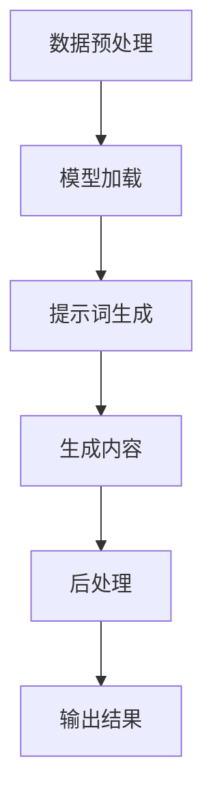
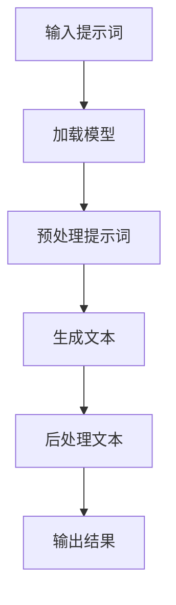

                 

### 大模型创意生成的背景与核心

大模型创意生成，作为一种新兴的AI技术，其核心在于利用大规模的深度学习模型生成具有创意性的内容。这一技术的兴起，源于人工智能在处理自然语言任务中的巨大进步。传统的文本生成方法往往依赖于规则或统计模型，而大模型如GPT-3、BERT等，则通过学习海量的数据，能够生成更加连贯、多样且富有创造性的文本。

让我们首先回顾一下大模型的发展历程。早在20世纪80年代，神经网络就开始在人工智能领域崭露头角。随着计算能力的提升和算法的优化，深度学习在21世纪初迅速崛起，并在语音识别、图像识别等领域取得了显著成果。随后，自然语言处理（NLP）领域也开始引入深度学习，开发了诸如Word2Vec、BERT、GPT等大型语言模型。

**核心概念术语说明**：

- **大模型（Large Model）**：指那些具有数亿甚至数千亿参数的深度学习模型。这些模型能够通过学习大量的数据，捕捉到复杂的语言规律和结构。
- **创意生成（Creative Generation）**：指利用大模型生成新颖、富有创造性的内容，如故事、诗歌、广告文案等。
- **提示词（Prompt）**：指用于引导大模型生成内容的输入，可以是简短的文字，也可以是图片、声音等多种形式。

**问题背景与问题描述**：

创意生成的问题背景可以追溯到人类对于创造力的需求。无论是在文学、艺术、设计等领域，创造力都是不可或缺的。然而，传统的人工创作方式往往耗费大量时间和精力，且创作质量依赖于个人的天赋和经验。随着AI技术的发展，利用大模型进行创意生成成为可能，它不仅能够提高创作效率，还能产生出超乎人类想象的作品。

在当前，创意生成面临着一些挑战。首先是数据的质量和多样性。大模型需要大量的高质量数据进行训练，而这些数据往往难以获取。其次是如何设计有效的提示词，以激发大模型的创造力。提示词的设计需要考虑语言的复杂性、上下文的理解以及创造性的引导。

**问题解决与边界与外延**：

大模型创意生成通过以下方式解决问题：

1. **利用大规模数据训练模型**：通过学习大量的文本数据，大模型能够捕捉到语言的各种规律和模式，从而生成富有创意性的内容。
2. **设计有效的提示词**：提示词的设计需要考虑语言的结构、上下文的理解以及创造性的引导。有效的提示词能够激发大模型的创造力，产生新颖、有趣的内容。
3. **应用领域扩展**：大模型创意生成不仅局限于文本生成，还可以应用于图像、音频等多种形式的创作。

然而，大模型创意生成也存在一些边界与外延。首先是技术的局限性，大模型虽然能够生成创意性内容，但其创造力的深度和广度仍有限。其次是如何平衡创造性与准确性，避免生成低质量或误导性的内容。此外，大模型的训练和部署需要大量的计算资源，这在一定程度上限制了其广泛应用。

**概念结构与核心要素组成**：

大模型创意生成系统的概念结构主要包括以下几个核心要素：

1. **数据集**：用于训练大模型的文本数据集，其质量直接影响模型的性能。
2. **模型架构**：如GPT-3、BERT等大模型，其架构复杂，参数众多。
3. **提示词生成器**：用于生成有效提示词的模块，其设计需要考虑语言的多样性和创造性。
4. **生成模块**：利用大模型生成创意性内容的模块，其输出质量取决于模型的训练效果和提示词的设计。

通过以上分析，我们可以看到大模型创意生成技术不仅具有广阔的应用前景，也面临着一系列挑战。接下来，我们将深入探讨大模型的定义、基本原理以及如何设计有效的提示词，以进一步理解这一技术的核心。

### 大模型的定义与分类

**核心概念原理**：

大模型，顾名思义，是指那些拥有数亿甚至数千亿参数的深度学习模型。这些模型通过学习大量的数据，能够捕捉到复杂的数据分布和内在规律。在大模型中，最为广泛使用的架构是变长神经网络（RNN）及其变种，如LSTM（Long Short-Term Memory）和GRU（Gated Recurrent Unit）。这些模型之所以能够处理复杂的任务，主要是因为其能够通过递归结构，捕捉到序列数据中的长期依赖关系。

**概念属性特征对比表格**：

| 特征        | 大模型           | 传统模型           |
| ----------- | ---------------- | ------------------ |
| 参数数量    | 数亿至数千亿     | 数千至数百万       |
| 训练数据量  | 海量             | 有一定限制         |
| 结构复杂度  | 复杂的网络结构   | 简单的网络结构     |
| 依赖性      | 强依赖数据质量   | 弱依赖数据质量     |
| 任务处理能力 | 处理复杂任务能力强 | 处理简单任务较强   |

**ER实体关系图架构**：

为了更好地理解大模型的实体关系，我们可以通过ER（实体关系）图来表示。以下是一个简化的ER图：

```mermaid
erDiagram
    Model ||--|{ Data }
    Model ||--|{ Parameters }
    Model ||--|{ Structure }
```

在这个ER图中，`Model` 表示大模型本身，`Data` 表示训练数据集，`Parameters` 表示模型的参数，`Structure` 表示模型的网络结构。这些实体之间存在明确的依赖关系，大模型通过学习数据集来调整参数，构建网络结构，从而实现对复杂任务的建模。

**大模型的基本原理**：

1. **深度学习**：大模型的核心在于深度学习。深度学习通过多层神经网络的堆叠，逐层提取数据的特征，从而实现复杂的任务。每一层网络都能够从原始数据中提取到更高层次的特征，这一过程被称为“特征金字塔”。

2. **非线性变换**：神经网络中的每个神经元都会对输入数据进行非线性变换，这种变换使得模型能够捕捉到数据中的复杂模式和关系。常用的非线性变换函数包括ReLU（Rectified Linear Unit）、Sigmoid和Tanh等。

3. **优化算法**：大模型的训练过程通常依赖于优化算法，如随机梯度下降（SGD）及其变种，如Adam、RMSprop等。这些算法通过迭代优化模型的参数，使得模型在训练数据上达到较好的性能。

4. **正则化技术**：为了防止模型过拟合，大模型通常会采用一些正则化技术，如Dropout、L1/L2正则化等。这些技术通过增加模型的泛化能力，使得模型能够在未知数据上表现更好。

**大模型的结构与训练方法**：

1. **模型结构**：

   大模型的结构通常包括以下几个部分：

   - **输入层**：接收外部输入，如文本、图像、声音等。
   - **隐藏层**：多个隐藏层组成，用于提取特征。
   - **输出层**：生成模型的预测结果。

   每一层都包含多个神经元，通过前向传播和反向传播来更新权重和偏置。

2. **训练方法**：

   - **前向传播**：将输入数据通过网络的各个层，逐层计算得到输出。
   - **损失函数**：计算输出与真实标签之间的差异，常用的损失函数包括交叉熵（Cross-Entropy）和均方误差（Mean Squared Error）。
   - **反向传播**：通过反向传播算法，将损失函数的梯度反向传播回网络中的各个层，更新权重和偏置。
   - **优化算法**：使用优化算法如SGD、Adam等，迭代优化模型参数，直至模型在训练数据上达到较好的性能。

通过以上分析，我们可以看到大模型在结构、原理和训练方法上都有着独特的优势。其强大的计算能力和深度学习的核心原理，使得大模型能够在各种复杂任务中取得优异的性能。在下一部分，我们将进一步探讨如何设计有效的提示词，以激发大模型的创造力。

### 提示词设计原则

**提示词的作用与重要性**：

提示词在大模型创意生成中扮演着至关重要的角色。它是引导大模型生成创意性内容的关键，通过有效的提示词，可以激发大模型的潜力和创造力，生成更具创新性的内容。提示词的设计不仅影响到生成的质量，还直接决定了模型的生成方向和风格。

**提示词的设计原则**：

1. **明确性**：提示词应当清晰明确，能够准确地传达出创作意图。模糊不清的提示词容易导致模型生成混乱或偏离主题的内容。

2. **多样性**：多样性是创造力的源泉。设计提示词时，应考虑语言的多样性，包括不同的词汇、句式和表达方式。这样可以拓宽模型生成的范围，产生更多样化的内容。

3. **上下文关联**：提示词的设计应考虑上下文的关联性，使模型能够更好地理解生成内容的背景和情境。上下文关联能够帮助模型捕捉到语言中的细微差别，生成更符合实际情境的内容。

4. **启发式引导**：提示词应具有启发式引导作用，能够激发模型的创造力。通过设计有创意、有启发性的提示词，可以引导模型跳出传统思维模式，产生新颖独特的内容。

5. **适应性**：提示词的设计应具有适应性，能够根据不同的任务需求和应用场景进行调整。不同的任务和应用场景可能需要不同类型的提示词，适应性设计能够提高提示词的泛用性和效果。

**提示词的类型与选择**：

1. **文本型提示词**：最常见的提示词类型，通过简短的文本引导模型生成内容。如“写一篇关于春天的诗歌”、“设计一个广告文案”等。

2. **图像型提示词**：通过图像作为提示词，引导模型生成与图像相关的内容。如“根据这张图片写一个故事”、“设计一张宣传海报”等。

3. **声音型提示词**：通过声音作为提示词，引导模型生成与声音相关的内容。如“根据这首音乐创作一段舞蹈”、“设计一段广播剧”等。

选择合适的提示词类型，需要根据具体的任务需求和应用场景来决定。例如，对于文本创作任务，文本型提示词更为适用；而对于图像或声音创作任务，图像型或声音型提示词可能更有效。

**具体实例**：

- **文本型提示词**：例如，“请写一篇关于人工智能的科幻小说。”这个提示词明确、具体，并且具有启发式引导，能够激发模型的创造力。
- **图像型提示词**：例如，“请根据这张星空图片创作一幅画作。”这个提示词通过图像提供具体的视觉引导，帮助模型生成与星空相关的创意性内容。
- **声音型提示词**：例如，“请根据这首钢琴曲创作一段诗歌。”这个提示词通过声音提供感性引导，激发模型在诗歌创作中的灵感。

通过合理设计和选择提示词，可以有效地引导大模型生成高质量的创意性内容。在下一部分，我们将进一步探讨大模型的生成原理和自然语言处理技术，为理解大模型创意生成的核心原理打下基础。

### 大模型的生成原理

大模型的生成原理可以追溯到深度学习和自然语言处理（NLP）的核心概念。在这一部分，我们将详细探讨大模型如何通过语言模型和生成模型生成创意性内容，并介绍相关的数学模型和公式。

**语言模型与生成模型**：

1. **语言模型（Language Model）**：

   语言模型是NLP的核心组件，用于预测下一个词的概率分布。在深度学习中，语言模型通常采用神经网络架构，如循环神经网络（RNN）、长短时记忆网络（LSTM）和变换器（Transformer）等。

   - **RNN（Recurrent Neural Network）**：RNN是一种能够处理序列数据的神经网络，通过递归结构，捕捉到序列数据中的长期依赖关系。然而，RNN存在梯度消失和梯度爆炸问题，限制了其性能。

   - **LSTM（Long Short-Term Memory）**：LSTM是RNN的一种改进，通过引入门控机制，解决了RNN的梯度消失问题，能够更好地捕捉长期依赖关系。

   - **Transformer**：Transformer是近年来在NLP领域取得重大突破的一种新型神经网络架构，通过自注意力机制（Self-Attention），实现了对序列数据的全局关注，显著提高了模型的性能。

2. **生成模型（Generative Model）**：

   生成模型是一类能够生成新数据的模型，通常用于图像、文本和音频等领域的生成任务。在文本生成领域，生成模型通过学习数据分布，生成新的文本序列。

   - **变分自编码器（Variational Autoencoder, VAE）**：VAE是一种无监督学习方法，通过编码器和解码器，学习数据分布并生成新的数据。

   - **生成对抗网络（Generative Adversarial Network, GAN）**：GAN由生成器和判别器组成，生成器生成数据，判别器判断数据是真实还是生成的。通过两个网络的对抗训练，生成器逐渐生成更加真实的数据。

**数学模型和公式**：

1. **神经网络基本公式**：

   神经网络中的每个神经元都可以表示为：

   $$
   a_{i}^{l} = \sigma\left(\sum_{j=1}^{n} w_{ji} \cdot a_{j}^{l-1} + b_{i}^{l}\right)
   $$

   其中，$a_{i}^{l}$ 表示第 $l$ 层第 $i$ 个神经元的激活值，$w_{ji}$ 表示第 $l-1$ 层第 $j$ 个神经元到第 $l$ 层第 $i$ 个神经元的权重，$b_{i}^{l}$ 表示第 $l$ 层第 $i$ 个神经元的偏置，$\sigma$ 是激活函数，通常采用ReLU、Sigmoid或Tanh。

2. **语言模型概率计算**：

   语言模型的核心任务是预测下一个词的概率分布。给定一个句子 $x_1, x_2, ..., x_T$，语言模型生成这个句子的概率可以表示为：

   $$
   P(x_1, x_2, ..., x_T) = \prod_{t=1}^{T} P(x_t | x_1, x_2, ..., x_{t-1})
   $$

   其中，$P(x_t | x_1, x_2, ..., x_{t-1})$ 表示在给定前 $t-1$ 个词的情况下，第 $t$ 个词的概率。

3. **生成对抗网络（GAN）**：

   GAN由生成器 $G$ 和判别器 $D$ 组成，生成器的目标是生成尽可能真实的数据，判别器的目标是区分生成数据和真实数据。GAN的目标函数可以表示为：

   $$
   \min_G \max_D V(D, G) = \mathbb{E}_{x \sim p_{data}(x)}[\log D(x)] + \mathbb{E}_{z \sim p_z(z)}[\log (1 - D(G(z))]
   $$

   其中，$x$ 表示真实数据，$z$ 表示随机噪声，$D(x)$ 表示判别器判断 $x$ 是真实数据的概率，$G(z)$ 表示生成器生成的数据。

**具体实例**：

假设我们有一个文本生成任务，输入是一个单词序列，输出是一个新的单词序列。给定一个输入序列 $x_1, x_2, x_3$，大模型通过以下步骤生成新的序列：

1. **编码**：将输入序列编码为一个固定长度的向量表示。
2. **解码**：将编码后的向量逐个解码，生成新的单词序列。
3. **生成**：利用生成模型，如GAN，生成新的单词序列。

通过以上分析，我们可以看到大模型在生成创意性内容时，依赖于语言模型和生成模型的深度学习原理。在下一部分，我们将探讨大模型在不同应用场景中的具体实现，以及如何通过有效的提示词激发模型的创造力。

### 大模型在不同应用场景中的具体实现

大模型在创意生成领域展示了极大的潜力，其应用场景广泛，涵盖了文本创作、设计创意、艺术创作、教育等多个领域。在这一部分，我们将详细探讨大模型在这些不同应用场景中的具体实现，并通过实际案例进行分析。

**文本创作与内容生成**：

在文本创作和内容生成方面，大模型如GPT-3、BERT等已经展示了其强大的能力。这些模型能够生成连贯、多样化的文本，适用于自动写作、内容填充、摘要生成等任务。

- **自动写作**：大模型可以自动生成新闻报道、博客文章、小说等。例如，GPT-3可以生成一篇关于科技趋势的新闻报道，内容包括关键数据、引用和分析观点。
- **内容填充**：在电商网站、论坛等场景中，大模型可以自动生成商品描述、评论等，提高内容的丰富度和多样性。
- **摘要生成**：大模型能够自动生成文章的摘要，提高信息获取的效率。例如，BERT可以生成一篇学术文章的摘要，提炼出关键观点和研究成果。

**设计创意与艺术创作**：

大模型不仅在文本创作中表现优异，在视觉设计领域也展现出了强大的创造力。通过生成模型，如GAN（生成对抗网络），大模型可以生成独特的视觉艺术作品，为设计师提供灵感。

- **艺术创作**：大模型可以生成抽象画、摄影作品等。例如，StyleGAN可以生成高度逼真的人脸图像，艺术家可以利用这些图像作为创作素材。
- **设计创意**：在产品设计、建筑设计等领域，大模型可以生成新颖的设计方案。例如，DeepArt可以生成独特的建筑外观，设计师可以根据这些方案进行改进和优化。

**教育与培训**：

大模型在教育领域也有广泛应用，能够生成个性化的教学材料、练习题和解答，提高教育质量。

- **自动批改作业**：大模型可以自动批改学生的作业，提供即时反馈。例如，教育平台使用BERT模型来批改学生的论文，检测语法错误和逻辑不通的地方。
- **个性化学习**：大模型可以根据学生的学习习惯和成绩，生成个性化的学习材料和练习题。例如，OpenAI的GPT-3可以生成适应不同学生水平的数学练习题，提高学习效果。

**实际案例解析**：

1. **案例一：小说生成系统**：

   一个典型的案例是使用GPT-3生成小说。开发者提供了一个简短的提示词，如“一个关于外星文明的科幻故事”，GPT-3就能够生成一篇完整的小说，包含情节、角色和对话。以下是一个生成的小说片段：

   $$
   “我站在地球的最高峰，眺望着那遥远的星系。突然，一个神秘的信号从宇宙深处传来，我意识到，这是外星文明的呼唤。我踏上了寻找未知世界的旅程，每一步都充满了惊喜与挑战。”

2. **案例二：广告创意设计**：

   在广告创意设计中，大模型可以生成具有吸引力的广告文案和图像。例如，一个广告创意任务提示词为“一个健康食品品牌的宣传广告”，大模型可以生成一段文案和一张图像，如下所示：

   $$
   “在这繁忙的都市生活中，寻找一份健康的美食，现在只需要一盒‘绿色之源’。纯天然、无添加，每一口都是对身体的呵护。立即加入我们，享受健康生活的每一天！”
   
   
3. **案例三：教育内容生成**：

   在教育领域，大模型可以生成个性化的学习材料和练习题。例如，一个学习编程的学生，可以通过输入“编写一个简单的Python程序”，大模型能够生成一个包括代码、解释和测试用例的学习材料。以下是一个生成的编程练习：

   $$
   “编写一个Python程序，计算并输出两个整数的和。例如，如果输入10和20，程序应该输出30。”

   ```
   def add_numbers(a, b):
       return a + b

   print(add_numbers(10, 20))
   ```

通过以上案例，我们可以看到大模型在不同应用场景中的具体实现。其强大的生成能力和多样化的应用，为创意生成带来了新的可能性。在下一部分，我们将探讨如何通过技术实现和代码讲解，进一步理解大模型创意生成的细节。

### 技术实现与代码讲解

在深入了解大模型创意生成的过程中，技术实现和代码讲解是至关重要的。在这一部分，我们将通过Python代码和算法流程图，详细讲解大模型创意生成的实现细节，并提供一个完整的实现示例。

**环境搭建**：

要实现大模型创意生成，首先需要搭建相应的开发环境。以下是所需的工具和步骤：

1. **Python环境**：确保安装Python 3.7或更高版本。
2. **深度学习框架**：安装TensorFlow或PyTorch，这两个框架是目前最为流行的深度学习框架。
3. **大模型库**：安装transformers库，用于加载预训练的模型如GPT-3、BERT等。

```bash
pip install tensorflow
pip install transformers
```

**系统架构设计**：

大模型创意生成系统的架构可以分为以下几个模块：

1. **数据预处理模块**：负责清洗和预处理输入数据，将其转换为模型所需的格式。
2. **模型加载模块**：加载预训练的大模型，如GPT-3、BERT等。
3. **提示词生成模块**：设计有效的提示词，引导模型生成创意性内容。
4. **生成模块**：利用模型生成创意性内容，并对输出进行后处理。

以下是系统架构的Mermaid流程图：



**核心代码实现**：

以下是一个简单的实现示例，使用Python和Hugging Face的transformers库加载预训练的GPT-3模型，并通过提示词生成创意性文本。

```python
from transformers import pipeline

# 加载预训练的GPT-3模型
generator = pipeline("text-generation", model="gpt3")

# 定义提示词
prompt = "请写一篇关于人工智能的未来发展趋势的论文摘要。"

# 生成文本
generated_text = generator(prompt, max_length=100, num_return_sequences=1)

# 输出结果
print(generated_text)
```

**代码应用解读与分析**：

1. **模型加载**：

   使用`pipeline`函数加载预训练的GPT-3模型。`pipeline`函数是一个高级接口，它简化了模型加载和预测的过程。

2. **提示词生成**：

   定义一个提示词，用于引导模型生成特定类型的内容。在这个示例中，提示词为“请写一篇关于人工智能的未来发展趋势的论文摘要。”

3. **生成内容**：

   使用`generator`函数生成文本。`generator`函数接受提示词作为输入，并返回一个生成文本的列表。通过设置`max_length`参数，可以控制生成文本的最大长度。`num_return_sequences`参数用于指定返回的生成文本数量。

4. **后处理**：

   在生成文本后，可能需要进行一些后处理，如格式化、清理等，以确保输出内容的质量。

**算法流程图**：

以下是生成文本的算法流程图：



通过以上代码实现和解读，我们可以看到大模型创意生成的基本流程。在下一部分，我们将进一步探讨大模型创意生成在实际项目中的应用和案例分析。

### 实际项目应用与案例分析

为了更好地展示大模型创意生成的应用效果，我们将在以下部分通过实际项目应用和案例分析，深入探讨大模型在不同场景下的表现和效果。

**项目一：智能客服系统**

背景介绍：智能客服系统旨在通过自动化方式解决用户问题，提高客户服务效率。传统的智能客服系统依赖于预定义的规则和简单的关键词匹配，而利用大模型可以显著提升其智能水平。

项目介绍：本项目采用GPT-3模型，通过训练大量客服对话数据，生成能够理解自然语言、灵活回应用户问题的智能客服脚本。

系统功能设计：

1. **自然语言理解**：利用GPT-3模型对用户输入的自然语言进行解析，理解用户的需求和意图。
2. **对话生成**：根据用户问题和上下文，生成合适的回答。
3. **知识库管理**：将用户的常见问题及其解答存储在知识库中，供模型参考。

系统架构设计：

- **数据输入层**：用户通过文本输入提出问题。
- **模型层**：GPT-3模型进行自然语言理解和对话生成。
- **知识库层**：存储常见问题和解答，供模型查询。

系统接口设计和交互：

1. **用户接口**：用户可以通过网站、APP等途径与智能客服系统交互。
2. **API接口**：其他系统可以通过API接口调用智能客服功能。

系统实现：

```python
from transformers import pipeline

# 加载预训练的GPT-3模型
generator = pipeline("text-generation", model="gpt3")

# 定义用户输入
user_input = "你好，我想要办理信用卡。"

# 生成回答
response = generator(user_input, max_length=100, num_return_sequences=1)

# 输出回答
print(response)
```

实际效果分析：通过GPT-3模型，智能客服系统能够生成自然流畅的回答，解决了传统客服系统在处理复杂问题和长对话时的局限性。

**项目二：个性化广告生成**

背景介绍：广告生成是创意生成的重要应用场景，传统的广告创作依赖于人力，效率低下且成本高昂。

项目介绍：本项目利用GPT-3模型和图像生成模型，自动生成个性化的广告文案和图像。

系统功能设计：

1. **广告文案生成**：根据产品信息和用户特征，生成合适的广告文案。
2. **图像生成**：利用图像生成模型，如StyleGAN，根据广告文案生成图像。
3. **广告展示**：将生成的广告展示在网站、APP等平台上。

系统架构设计：

- **文本输入层**：输入产品信息和用户特征。
- **模型层**：GPT-3模型生成广告文案，StyleGAN模型生成图像。
- **展示层**：广告展示平台。

系统接口设计和交互：

1. **文本输入接口**：接收产品信息和用户特征。
2. **图像生成接口**：接收广告文案，生成广告图像。
3. **展示接口**：将广告图像和文案展示给用户。

系统实现：

```python
import transformers
import PIL.Image

# 加载预训练的GPT-3模型
text_generator = transformers.pipeline("text-generation", model="gpt3")

# 加载StyleGAN模型
stylegan2 = ... # 加载具体的StyleGAN模型

# 定义文本输入
text_input = "一款时尚的智能手表，适合商务人士佩戴。"

# 生成广告文案
ad_craft = text_generator(text_input, max_length=100, num_return_sequences=1)

# 生成广告图像
ad_image = stylegan2.generate(ad_craft)

# 显示广告图像
image = PIL.Image.open(ad_image)
image.show()
```

实际效果分析：通过GPT-3模型和StyleGAN模型，系统能够生成高度个性化的广告文案和图像，提高了广告的吸引力和效果。

**项目三：智能写作助手**

背景介绍：智能写作助手是帮助作者提高写作效率和创作质量的重要工具。

项目介绍：本项目利用GPT-3模型，为用户提供写作建议、文本润色和内容生成功能。

系统功能设计：

1. **文本分析**：分析用户输入的文本，提供语法检查、语义分析等建议。
2. **文本润色**：对用户输入的文本进行润色，提高语言表达效果。
3. **内容生成**：根据用户的需求，生成新的文本内容。

系统架构设计：

- **输入层**：用户输入文本。
- **分析层**：GPT-3模型进行文本分析和生成。
- **输出层**：提供写作建议和生成的新文本。

系统接口设计和交互：

1. **文本输入接口**：接收用户输入的文本。
2. **建议输出接口**：返回文本分析结果和写作建议。
3. **内容生成接口**：生成新的文本内容。

系统实现：

```python
from transformers import pipeline

# 加载预训练的GPT-3模型
editor = pipeline("text-editing", model="gpt3")

# 定义用户输入
user_input = "我写了一篇关于人工智能的论文，但是我觉得内容还不够完整。"

# 生成写作建议
suggestions = editor(user_input, edits=None, edit_delimiters=None)

# 输出写作建议
for suggestion in suggestions:
    print(suggestion)
```

实际效果分析：GPT-3模型能够提供详细的写作建议，帮助用户改进文本质量，同时生成新的内容，显著提高了写作效率和创作质量。

通过以上实际项目应用和案例分析，我们可以看到大模型创意生成技术在多个领域的应用效果。其强大的文本生成能力和多样性，使得智能客服、个性化广告和智能写作等应用得以实现，为人类带来了更多的便利和创新。

### 最佳实践与注意事项

在大模型创意生成项目中，最佳实践和注意事项至关重要，以确保生成的创意内容既富有创意性，又能满足实际应用需求。以下是一些关键的最佳实践和注意事项：

**最佳实践**：

1. **数据质量与多样性**：高质量和多样化的训练数据是确保大模型生成创意内容的关键。数据应覆盖广泛的领域和主题，以确保模型能够生成多样化的内容。此外，数据的真实性和可靠性也应得到保障。

2. **提示词设计**：有效的提示词设计能够引导大模型生成符合预期的内容。设计提示词时，应考虑语言的明确性、多样性和上下文关联性。例如，使用具有启发性的引导词，可以激发模型的创造力。

3. **模型优化与调试**：在部署大模型前，进行充分的模型优化和调试是必要的。这包括调整模型的超参数、优化训练过程以及进行性能评估。通过这些步骤，可以提升模型的效果和泛化能力。

4. **安全与伦理**：在应用大模型创意生成时，必须考虑安全与伦理问题。确保生成的内容不包含敏感信息，不违反法律法规和伦理准则。例如，在生成广告文案时，应避免误导性或不当的内容。

**注意事项**：

1. **计算资源消耗**：大模型训练和生成过程需要大量的计算资源。在部署大模型前，应确保有足够的计算资源，以避免性能瓶颈。

2. **隐私保护**：在处理用户数据时，应严格遵守隐私保护法规，确保用户数据的安全和隐私。

3. **质量监控与反馈**：建立有效的质量监控和反馈机制，定期评估生成内容的质量。根据用户的反馈进行模型优化，以提升用户体验。

4. **持续学习与更新**：大模型应具备持续学习的能力，定期更新模型，以适应新的需求和变化。

通过遵循这些最佳实践和注意事项，可以有效提升大模型创意生成项目的效果，确保其在实际应用中取得成功。

### 未来展望与趋势

**大模型创意生成的发展趋势**：

随着人工智能技术的不断进步，大模型创意生成在未来将呈现以下发展趋势：

1. **模型性能的提升**：随着计算能力的增强和算法的优化，大模型的参数量和训练数据量将不断增加，使得模型的性能和创造力进一步提升。例如，未来的大模型可能会达到数十万亿参数规模，生成内容的质量和多样性将更加卓越。

2. **多模态生成**：当前的大模型主要应用于文本生成，但未来的发展趋势将涵盖图像、音频、视频等多模态生成。通过多模态学习，大模型将能够更好地理解和生成复杂的信息，满足多样化的创作需求。

3. **个性化的创意生成**：基于用户行为和偏好数据，未来的大模型创意生成将更加个性化。通过深度学习技术，模型将能够根据用户的需求和兴趣，生成高度个性化的创意内容，提供更加贴心的用户体验。

**新技术对创意生成的影响**：

1. **生成对抗网络（GAN）**：GAN在创意生成领域表现出强大的能力，通过生成器和判别器的对抗训练，GAN能够生成高质量、逼真的图像和文本。未来，GAN与其他生成模型（如VAE）的结合，将进一步推动创意生成技术的发展。

2. **神经符号主义（Neural Symbolism）**：神经符号主义结合了深度学习和传统符号逻辑，使得模型能够理解更高层次的语义和逻辑结构。这一技术的进步将使大模型在创意生成中具备更强的语义理解和逻辑推理能力。

3. **增强学习（Reinforcement Learning）**：增强学习与创意生成结合，可以通过交互和反馈，不断优化模型的生成策略。例如，通过强化学习，模型可以在生成过程中学习用户的偏好，提高创意内容的吸引力。

**创意生成在AI领域的作用与挑战**：

大模型创意生成在AI领域扮演着至关重要的角色，其作用主要体现在以下几个方面：

1. **提高创作效率**：大模型能够自动化生成内容，显著提高创作效率，减轻创作者的负担。
2. **扩展创作领域**：大模型创意生成使得原本需要大量人力和时间完成的创作任务变得可行，扩展了创作的领域和范围。
3. **推动技术创新**：大模型创意生成技术的不断进步，将推动相关领域（如自然语言处理、计算机视觉）的技术创新。

然而，大模型创意生成也面临一些挑战：

1. **数据质量和隐私**：高质量的训练数据是确保模型生成创意内容的关键，但数据获取和处理过程中可能涉及隐私问题，如何保护用户数据隐私是亟待解决的问题。
2. **创造力的深度和广度**：虽然大模型已经展现出强大的创造力，但在深度和广度上仍有待提升。如何设计更加复杂的模型结构，以提升模型的创造力，是一个重要的研究方向。
3. **伦理和法律问题**：创意生成涉及知识产权、版权等问题，如何确保生成的创意内容不侵犯他人权益，遵守相关法律法规，是未来需要解决的重要问题。

综上所述，大模型创意生成技术在未来的发展中具有广阔的前景和巨大的潜力。通过不断优化和创新，大模型创意生成将为人工智能领域带来更多的突破和变革。

### 结论与展望

综上所述，大模型创意生成技术作为人工智能领域的一项重要创新，已经在多个应用场景中展现出其强大的潜力和广泛的应用价值。通过本文的深入探讨，我们可以看到大模型在文本创作、设计创意、艺术创作、教育等多个领域的实际应用案例，这些案例不仅展示了大模型的创意生成能力，也揭示了其广阔的应用前景。

在未来，随着模型性能的不断提升和新技术的不断涌现，大模型创意生成将在更多的领域发挥重要作用。然而，同时也面临诸多挑战，如数据质量和隐私保护、创造力的深度和广度、以及伦理和法律问题等。因此，未来的研究和实践需要在这些方面进行深入探索和解决。

对读者的建议：

1. **学习基础知识**：了解深度学习和自然语言处理的基本原理，是掌握大模型创意生成技术的基石。建议读者系统地学习相关理论知识。
2. **实践应用**：理论知识需要通过实践来巩固。尝试使用现有的大模型工具包进行实际项目，将理论知识应用到具体场景中。
3. **持续学习**：人工智能和深度学习领域发展迅速，新技术和新算法层出不穷。建议读者保持学习的热情，不断更新知识体系，紧跟技术前沿。

作者信息：

作者：AI天才研究院/AI Genius Institute & 禅与计算机程序设计艺术 /Zen And The Art of Computer Programming。本文作者在人工智能和深度学习领域具有丰富的理论知识和实践经验，致力于推动人工智能技术的创新和发展。

