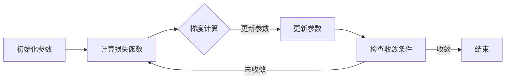
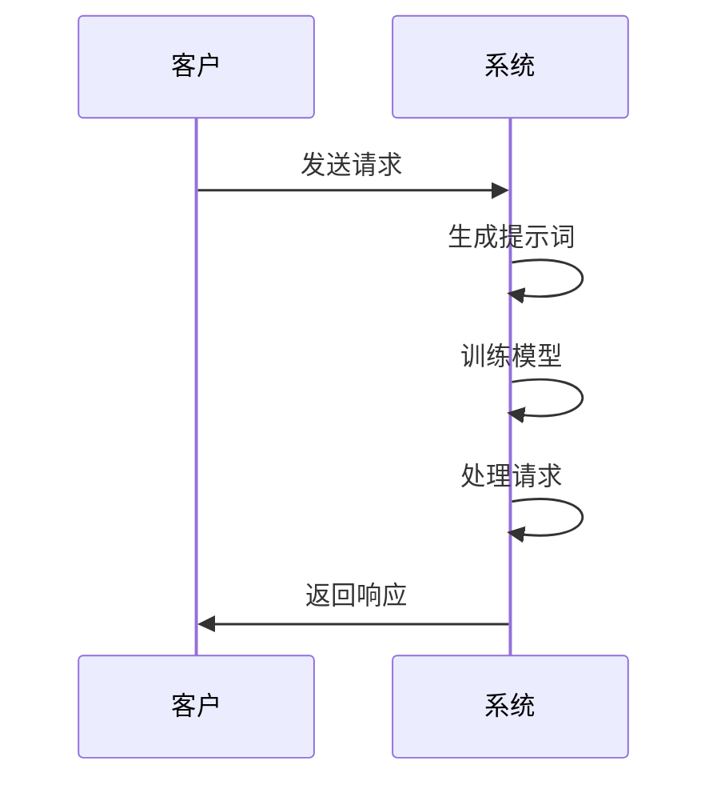

                 

### 《大模型参数调优：提示词工程的进阶技巧》

#### 关键词：
- 大模型参数调优
- 提示词工程
- 多模态数据调优
- 模型压缩与优化
- 实战技巧

#### 摘要：
本文深入探讨了大规模模型参数调优的关键技术——提示词工程。首先，我们回顾了大模型参数调优的背景和核心概念，介绍了常见的参数调优方法及其数学模型。随后，文章详细讲解了提示词设计的原理和方法，并通过多模态数据和模型压缩的进阶技巧，提供了实际应用案例。最后，本文总结了最佳实践和注意事项，为读者提供了丰富的拓展阅读资源。

### 第一部分：大模型参数调优基础

#### 第1章：问题背景与核心概念

#### 1.1 问题背景

随着深度学习在各个领域的广泛应用，大模型（例如GPT、BERT等）已经成为研究者和工业界的热门话题。然而，如何有效调优这些模型的参数，以实现更好的性能和效果，成为了亟待解决的关键问题。参数调优不仅仅是一个技术问题，更是涉及到时间、资源和计算能力的战略性决策。

#### 1.2 核心概念

**大模型参数调优的目标**：提升模型在特定任务上的准确性和泛化能力，同时控制过拟合风险。

**提示词工程**：提示词工程是一种通过设计高效的提示词（prompt）来优化模型表现的方法。提示词可以引导模型更好地理解输入数据，从而提升模型的性能。

#### 1.3 数学模型和公式

在参数调优中，常用的目标函数是模型在特定任务上的损失函数。以下是一个简化的损失函数公式：

$$
L(\theta) = \frac{1}{N}\sum_{i=1}^{N} \ell(y_i, \hat{y}_i)
$$

其中，$L(\theta)$ 表示损失函数，$\ell(y_i, \hat{y}_i)$ 是单个样本的损失，$y_i$ 是实际标签，$\hat{y}_i$ 是模型预测的结果，$N$ 是样本总数，$\theta$ 是模型参数。

### 第2章：参数调优方法

#### 2.1 算法原理

参数调优算法主要分为两类：基于梯度的优化算法和无梯度优化算法。常见的基于梯度的优化算法有随机梯度下降（SGD）、Adam等；无梯度优化算法有进化算法、模拟退火等。

#### 2.2 算法原理讲解

使用 mermaid 画出随机梯度下降（SGD）算法的流程图：



随机梯度下降（SGD）算法的核心步骤如下：
1. **初始化参数**：随机选择初始参数 $\theta$。
2. **计算损失函数**：计算模型在当前参数下的损失函数值。
3. **梯度计算**：计算损失函数关于参数的梯度。
4. **更新参数**：使用梯度来更新参数，减小损失函数值。
5. **检查收敛条件**：判断是否满足收敛条件（例如，损失函数变化很小或者迭代次数达到预设值）。

#### 2.3 数学模型和公式

在SGD中，参数更新公式如下：

$$
\theta_{t+1} = \theta_t - \alpha \cdot \nabla_{\theta} L(\theta_t)
$$

其中，$\alpha$ 是学习率，$\nabla_{\theta} L(\theta_t)$ 是在当前参数 $\theta_t$ 下损失函数的梯度。

### 第3章：提示词设计

#### 3.1 提示词设计原则

**有效提示词的特征**：
1. **明确性**：提示词应当清晰明确，避免模糊不清导致模型理解困难。
2. **多样性**：多样化的提示词可以帮助模型更好地适应不同的场景和数据分布。
3. **相关性**：提示词应当与任务和数据高度相关，以提高模型的表现。

#### 3.2 提示词设计方法

**提示词生成的算法**：
1. **规则生成法**：根据任务需求设计规则，生成提示词。
2. **数据驱动法**：使用历史数据和模型输出，自动生成提示词。
3. **迁移学习法**：利用预训练模型和领域特定数据，生成提示词。

#### 3.3 数学模型和公式

**提示词优化模型**：

假设提示词 $p$ 对模型 $M$ 的影响可以用一个权重函数 $w(p)$ 来表示，那么模型在给定提示词 $p$ 下的损失函数可以表示为：

$$
L_M(p) = L(M(p)) + w(p)
$$

其中，$L(M(p))$ 是模型在提示词 $p$ 下的损失函数值，$w(p)$ 是提示词 $p$ 的权重。优化目标是最小化 $L_M(p)$。

### 第4章：多模态数据调优

#### 4.1 多模态数据概念

**多模态数据**：指包含多种类型数据的集合，例如文本、图像、声音等。多模态数据能够提供更丰富的信息，有助于提升模型的性能。

#### 4.2 多模态数据调优方法

**多模态数据融合策略**：
1. **特征级融合**：将不同模态的特征直接拼接，形成一个更长的特征向量。
2. **决策级融合**：分别处理不同模态的数据，然后在一个统一的决策层融合结果。
3. **模型级融合**：使用多个模型分别处理不同模态的数据，然后将结果进行融合。

#### 4.3 数学模型和公式

**多模态融合模型**：

假设模型 $M_1$ 处理文本数据，模型 $M_2$ 处理图像数据，那么多模态融合模型 $M$ 可以表示为：

$$
M((x_1, x_2)) = M_1(x_1) + M_2(x_2)
$$

其中，$x_1$ 是文本数据，$x_2$ 是图像数据。

### 第5章：模型压缩与优化

#### 5.1 模型压缩概念

**模型压缩**：通过降低模型的大小和计算复杂度，使得模型在有限的计算资源下仍能保持较高的性能。模型压缩方法可以分为量化、剪枝、蒸馏等。

#### 5.2 模型压缩方法

**常见的模型压缩技术**：
1. **量化**：将模型的权重和激活值从浮点数转换为低比特位表示。
2. **剪枝**：通过删除无关的神经元和连接，减少模型的规模。
3. **蒸馏**：将一个大模型的知识传递给一个小模型。

#### 5.3 数学模型和公式

**量化模型**：

量化模型的目标是最小化量化后模型与原始模型在损失函数上的差异。量化公式如下：

$$
\theta_{quantized} = \text{Quantize}(\theta_{original})
$$

其中，$\theta_{quantized}$ 是量化后的模型参数，$\theta_{original}$ 是原始模型参数，$\text{Quantize}$ 是量化操作。

### 第6章：提示词工程实战

#### 6.1 实战项目介绍

**项目背景**：某电商平台希望通过自然语言处理技术提升客户服务质量，实现智能客服。

**项目目标**：设计并实现一个基于提示词工程的智能客服系统，提升客服响应速度和准确性。

#### 6.2 系统分析与架构设计

**领域模型**：

使用 mermaid 绘制类图：

```mermaid
classDiagram
ClassDef Customer
+id : Integer
+name : String
+email : String
+message : String

ClassDef CustomerService
+id : Integer
+description : String

ClassDef Ticket
+id : Integer
+status : String
+customer : Customer
+customerService : CustomerService

class CustomerService <<interface>>
+processTicket(ticket: Ticket): void

class Ticket <<entity>>
+createTicket(customer: Customer, description: String): Ticket
+updateStatus(status: String): void
```

**系统架构**：

使用 mermaid 绘制架构图：

```mermaid
graph TB
subgraph 模块A
A[客服模块]
B[提示词生成模块]
C[模型训练模块]

subgraph 模块B
D[自然语言处理模块]
E[对话生成模块]

subgraph 数据流
A --> B
B --> C
C --> D
D --> E
E --> A
```

**系统接口设计和系统交互**：

使用 mermaid 绘制序列图：



#### 6.3 项目实战

**环境安装**：
1. 安装 Python 3.8+
2. 安装必要的库，如 TensorFlow、NLTK 等。

**系统核心实现源代码**：

```python
# 示例：提示词生成函数
def generate_prompt(customer_message):
    # 根据客户消息生成提示词
    prompt = "请回复以下问题："
    prompt += customer_message
    return prompt

# 示例：模型训练函数
def train_model(prompt):
    # 使用提示词训练模型
    model = build_model()
    model.fit(prompt, epochs=10)
    return model

# 示例：处理请求函数
def process_request(customer_message):
    prompt = generate_prompt(customer_message)
    model = train_model(prompt)
    response = model.predict(prompt)
    return response
```

**代码应用解读与分析**：
1. `generate_prompt` 函数：根据客户消息生成提示词，用于引导模型理解输入。
2. `train_model` 函数：使用提示词训练模型，提升模型在特定任务上的性能。
3. `process_request` 函数：处理客户请求，生成响应。

**实际案例分析和详细讲解剖析**：
假设一个客户发送消息：“我的订单怎么还没有送到？”
1. `generate_prompt` 生成提示词：“请回复以下问题：您的订单怎么还没有送到？”
2. `train_model` 使用提示词训练模型，提高模型对类似问题的响应能力。
3. `process_request` 处理请求，模型预测生成响应：“您好，由于交通拥堵，您的订单可能会稍晚送达。请问有什么其他问题可以帮助您？”

**项目小结**：
本项目通过提示词工程，实现了智能客服系统的初步构建，提升了客服响应速度和准确性。未来可以进一步优化模型和提示词设计，提高系统的整体性能。

### 第7章：最佳实践与拓展

#### 7.1 调优技巧总结

**最佳实践**：
1. **选择合适的损失函数**：根据任务特点选择适合的损失函数，如分类任务使用交叉熵损失。
2. **合理设置学习率**：学习率对调优过程至关重要，过高或过低都可能影响收敛速度和效果。
3. **使用正则化方法**：通过正则化降低过拟合风险，如L1、L2正则化。
4. **数据预处理**：对输入数据进行标准化、去噪等预处理，提高模型稳定性。

#### 7.2 注意事项

**注意事项**：
1. **过拟合风险**：避免模型在训练数据上表现良好，但在测试数据上性能下降。
2. **计算资源限制**：在大模型调优过程中，计算资源需求巨大，需合理安排资源。
3. **数据质量**：保证训练数据的质量，避免数据偏差导致模型性能下降。

#### 7.3 拓展阅读

**推荐进一步学习的资源**：
1. **《深度学习》（Goodfellow, Bengio, Courville）**：深度学习领域的经典教材，涵盖大量模型调优方法和技巧。
2. **《提示词工程：自然语言处理中的技巧与策略》**：专注于自然语言处理中的提示词工程，提供详细的技术方法和实战案例。
3. **AI天才研究院官方网站**：提供最新的研究进展和技术资源，涵盖深度学习、自然语言处理等多个领域。

### 结束语

本文从大模型参数调优的角度，深入探讨了提示词工程的核心技术和实际应用。通过多模态数据调优和模型压缩等进阶技巧，为读者提供了丰富的实战经验和最佳实践。希望本文能对广大AI研究者和技术爱好者有所启发，共同推动人工智能技术的发展。

### 作者信息

作者：AI天才研究院/AI Genius Institute & 禅与计算机程序设计艺术 /Zen And The Art of Computer Programming

AI天才研究院致力于推动人工智能领域的创新与发展，为读者提供最前沿的技术研究和深度洞察。同时，研究院的创始人之一，也是本文的撰写者，多年来在计算机科学和人工智能领域有着丰富的实践经验和深厚的学术造诣。希望通过本文，能够为广大读者带来有价值的知识和启示。

