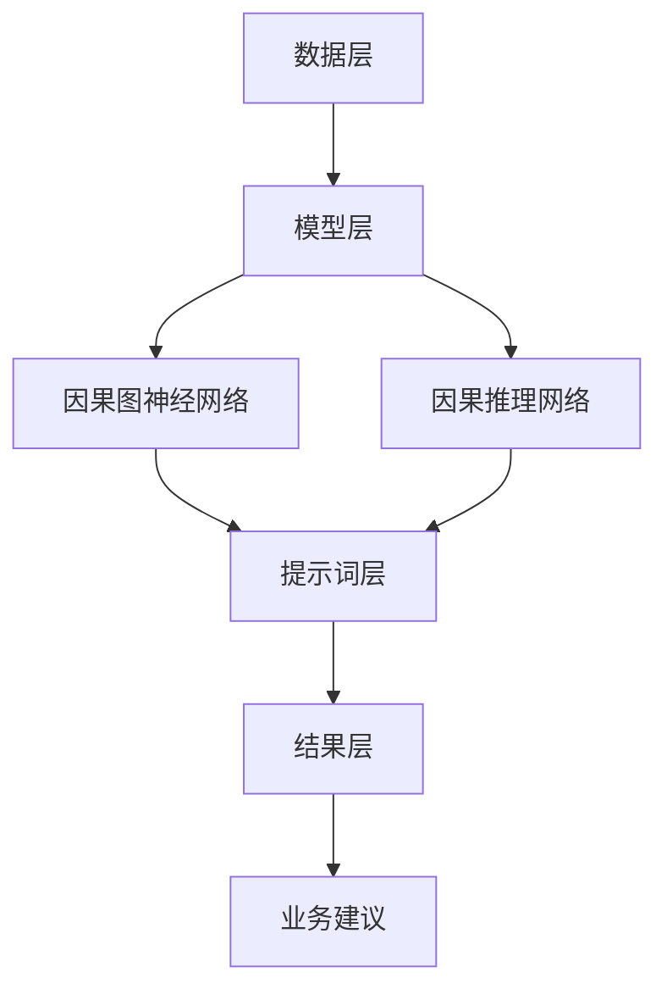
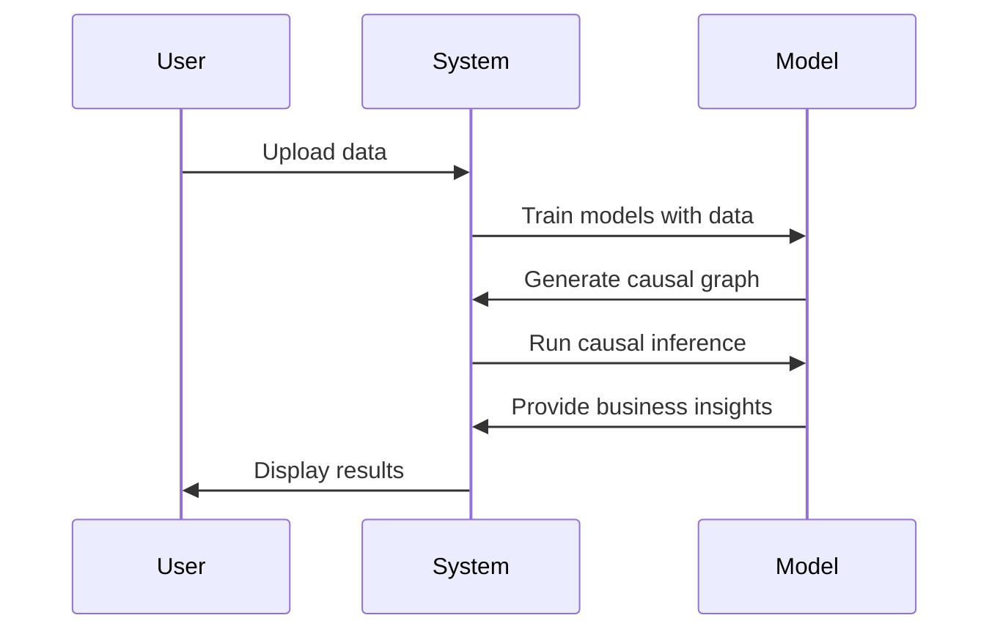

                 

# 大模型因果发现与提示词引导推理

## 关键词

大模型，因果发现，提示词，推理，人工智能，机器学习，算法，数据科学

## 摘要

本文旨在探讨大模型在因果发现与提示词引导推理方面的应用，通过详细分析相关核心概念、技术原理和实际应用，旨在为读者提供对这一领域的深入理解。本文将分步骤介绍大模型的背景、因果发现的基本概念与技术、提示词的设计与应用、以及大模型在实际项目中的应用，最后对未来的发展趋势和挑战进行展望。

## 目录

1. **背景与引言**
   - 1.1 大模型的发展历程
   - 1.2 因果发现的重要性
   - 1.3 提示词引导推理的兴起

2. **基础概念**
   - 2.1 大模型的定义与架构
   - 2.2 因果发现的定义与方法
   - 2.3 提示词的定义与作用

3. **因果发现技术**
   - 3.1 传统因果发现方法
   - 3.2 大模型在因果发现中的应用
   - 3.3 实现因果发现的算法与流程

4. **提示词设计**
   - 4.1 提示词的设计原则
   - 4.2 提示词的类型与格式
   - 4.3 提示词的性能评估

5. **大模型与提示词的协同推理**
   - 5.1 提示词引导的推理过程
   - 5.2 大模型在推理中的角色
   - 5.3 实际案例分析与效果评估

6. **项目实战**
   - 6.1 项目背景与目标
   - 6.2 系统设计与实现
   - 6.3 项目小结与反思

7. **未来展望与挑战**
   - 7.1 技术发展趋势
   - 7.2 应用场景拓展
   - 7.3 潜在挑战与解决方案

8. **总结与展望**
   - 8.1 主要结论
   - 8.2 下一步研究方向
   - 8.3 对未来发展的期待

## 1. 背景与引言

### 1.1 大模型的发展历程

大模型，即大型人工智能模型，是指那些具有巨大参数量和复杂结构的神经网络模型。它们的出现和发展是人工智能领域的重要里程碑。大模型的发展可以追溯到上世纪80年代，当时基于神经网络的基础理论开始逐渐成熟，研究者开始尝试构建更大的网络模型以处理复杂的任务。随着计算能力的提升和大数据的普及，大模型得到了迅速发展。

1997年，IBM的超级计算机“深蓝”击败了国际象棋世界冠军加里·卡斯帕罗夫，标志着人工智能在特定领域达到了前所未有的水平。然而，这一阶段的模型规模相对较小，主要集中在规则化和符号化的人工智能领域。

进入21世纪，随着深度学习技术的突破，大模型的研究和应用进入了新的阶段。2012年，AlexNet在ImageNet图像识别大赛中取得了突破性的成绩，掀起了深度学习研究的浪潮。随后，谷歌的BERT、OpenAI的GPT等大模型相继问世，它们不仅在图像、文本等传统领域表现出色，还在自然语言处理、机器翻译、问答系统等领域取得了显著的成果。

### 1.2 因果发现的重要性

因果发现，即通过数据发现变量之间的因果关系。在人工智能和机器学习领域，因果发现具有重要的理论和实际意义。传统的机器学习方法主要依赖于统计相关性来建立模型，但相关性并不等同于因果性。例如，身高和财富之间可能存在相关性，但并不能说明财富是身高导致的。因果发现能够揭示变量之间的因果关系，从而为更准确和有效的模型建立提供基础。

在现实应用中，因果发现可以应用于多种场景。例如，在医疗领域，通过分析患者的病史和检测结果，可以发现某些疾病之间的因果关系，从而为疾病预防和治疗提供有力支持。在金融领域，因果发现可以帮助分析市场变化和风险因素之间的关系，为投资决策提供指导。在社会科学研究中，因果发现可以揭示社会现象背后的深层次原因，为政策制定提供依据。

### 1.3 提示词引导推理的兴起

提示词，即用于引导模型推理的指令或提示。在传统的机器学习模型中，模型的输入通常是原始数据，模型通过训练学习数据中的模式并进行预测。然而，这种方法存在一定的局限性，特别是在处理复杂任务时，模型可能难以理解任务的本质和目标。

提示词引导推理通过在模型输入中加入明确的提示，帮助模型更好地理解任务和目标，从而提高推理效果。这种方法在自然语言处理、图像识别等领域取得了显著成果。例如，在自然语言处理任务中，通过加入适当的提示词，可以引导模型更好地理解文本的含义和上下文关系，从而提高文本分类、情感分析等任务的准确性。

近年来，随着大模型的发展，提示词引导推理的应用范围进一步扩大。大模型具有更强的建模能力和理解能力，通过适当的提示词，可以引导大模型实现更复杂的推理任务，如知识图谱构建、问答系统等。

## 2. 基础概念

### 2.1 大模型的定义与架构

大模型，通常指的是具有巨大参数量和复杂结构的神经网络模型。这些模型通常通过深度学习技术训练，以处理大规模的数据集和复杂的任务。大模型的架构通常包括以下几个关键组成部分：

1. **输入层**：接收外部输入数据，如文本、图像或声音等。
2. **隐藏层**：一个或多个隐藏层，用于处理和转换输入数据，提取特征。
3. **输出层**：生成最终预测结果，如分类标签、概率分布或文本生成。

大模型的一个重要特征是其参数数量巨大。例如，GPT-3模型拥有超过1750亿个参数，远远超过传统模型的数量。这种庞大的参数规模使得大模型能够捕捉到数据中的复杂模式和潜在关系，从而在任务表现上优于传统模型。

### 2.2 因果发现的定义与方法

因果发现，是指通过分析数据来发现变量之间的因果关系。在统计学中，相关性描述了变量之间的线性或非线性关系，但并不能确定因果关系。因果发现的目标是确定一个变量是否真正导致另一个变量的变化。

因果发现的方法可以分为以下几类：

1. **因果推断方法**：基于统计学和概率论的方法，如回归分析、潜在变量模型等。
2. **因果图模型**：使用图形结构表示变量之间的因果关系，如贝叶斯网络、结构方程模型等。
3. **因果发现算法**：基于数据驱动的方法，如基于深度学习的因果发现算法、基于图论的因果发现算法等。

这些方法各有优缺点，适用于不同的应用场景和数据类型。例如，因果推断方法适用于小规模数据，因果图模型适用于结构明确的领域，而基于深度学习的因果发现算法则适用于大规模、复杂的数据集。

### 2.3 提示词的定义与作用

提示词，是指在模型输入中加入的用于引导模型推理的指令或提示。提示词的作用是帮助模型更好地理解任务和目标，从而提高推理效果。

在自然语言处理任务中，提示词可以用于引导模型生成文本、回答问题或进行分类。例如，在一个问答系统中，通过加入合适的提示词，可以引导模型更好地理解问题的上下文，从而生成更准确的答案。

提示词的设计和选择对模型的表现至关重要。有效的提示词应具有以下特点：

1. **明确性**：提示词应明确指示模型的任务和目标，避免模糊和歧义。
2. **针对性**：提示词应根据具体的任务和数据类型进行设计，以提高针对性。
3. **简洁性**：提示词应简洁明了，避免冗余和复杂。

通过合理设计和使用提示词，可以显著提高大模型在复杂任务中的表现，实现更准确的推理和预测。

### 2.4 大模型的优化与调参

大模型的优化和调参是提高模型性能的重要步骤。以下是一些常见的优化和调参方法：

1. **批量归一化（Batch Normalization）**：通过标准化每个批量中的激活值，加快模型的训练速度并提高模型的稳定性。
2. **权重初始化**：选择合适的权重初始化方法，如高斯分布或均匀分布，以避免梯度消失或爆炸问题。
3. **学习率调度**：调整学习率的大小和变化方式，以找到最优的收敛速度和精度。
4. **正则化**：通过添加正则化项，如L1正则化、L2正则化，避免模型过拟合。
5. **dropout**：在训练过程中随机丢弃一部分神经元，提高模型的泛化能力。

这些优化和调参方法可以单独或组合使用，以达到最佳的模型性能。在实际应用中，通常需要通过实验和迭代来找到最优的参数设置。

## 3. 因果发现技术

### 3.1 传统因果发现方法

因果发现是数据科学和人工智能领域中的一项关键技术，它旨在从数据中揭示变量之间的因果关系。传统因果发现方法主要基于统计学和机器学习，以下是一些常用的传统因果发现方法：

#### 3.1.1 回归分析

回归分析是一种经典的因果发现方法，它通过建立变量之间的线性关系模型来推断因果关系。最常用的回归模型是线性回归模型，它假设变量之间存在线性关系，可以使用以下公式表示：

$$y = \beta_0 + \beta_1x_1 + \beta_2x_2 + ... + \beta_nx_n + \epsilon$$

其中，$y$ 是因变量，$x_1, x_2, ..., x_n$ 是自变量，$\beta_0, \beta_1, \beta_2, ..., \beta_n$ 是回归系数，$\epsilon$ 是误差项。

线性回归分析可以用于估计自变量对因变量的影响程度，并通过假设检验确定变量之间的因果关系。然而，线性回归分析存在一些局限性，如假设变量之间的关系是线性的，可能无法捕捉到复杂的非线性关系。

#### 3.1.2 潜在变量模型

潜在变量模型（Latent Variable Model）是一种基于统计学的方法，它通过引入潜在变量来揭示变量之间的因果关系。潜在变量模型中最常用的类型是因子分析（Factor Analysis）和结构方程模型（Structural Equation Modeling，SEM）。

因子分析假设变量之间存在共同因素，这些共同因素是潜在变量。通过因子分析，可以识别出变量之间的潜在关系，并估计这些潜在变量的影响。结构方程模型是一种更为复杂的方法，它同时考虑了变量之间的直接关系和间接关系，可以用于建立多变量因果模型。

#### 3.1.3 多变量时间序列分析

多变量时间序列分析是因果发现的一种重要方法，它通过分析多个变量随时间的变化来揭示变量之间的因果关系。常见的方法包括自回归移动平均模型（ARIMA）、向量自回归模型（VAR）等。

ARIMA模型是一种用于时间序列预测的统计模型，它假设时间序列数据是自相关的，可以通过自回归、差分和移动平均的过程来建模。VAR模型则是一种用于分析多个时间序列之间关系的模型，它假设每个时间序列都是其他时间序列的线性组合。

#### 3.1.4 机器学习方法

随着机器学习技术的发展，一些基于机器学习的方法也被用于因果发现。这些方法包括基于随机森林（Random Forest）、支持向量机（SVM）和深度学习的方法。

随机森林通过构建多个决策树并集成它们的结果来预测变量之间的因果关系。支持向量机通过找到一个最优的超平面来划分变量之间的关系。深度学习方法，如基于卷积神经网络（CNN）和循环神经网络（RNN）的模型，可以用于捕捉变量之间的复杂非线性关系。

机器学习方法在因果发现中的应用具有灵活性和强大的建模能力，但同时也存在一些挑战，如过拟合和解释性不足等问题。

### 3.2 大模型在因果发现中的应用

随着深度学习技术的快速发展，大模型在因果发现领域得到了广泛应用。大模型具有以下特点，使其在因果发现中表现出色：

1. **强大的建模能力**：大模型通过其庞大的参数规模和复杂的结构，可以捕捉到数据中的复杂模式和潜在关系，从而提高因果发现的准确性。
2. **自适应的特征提取**：大模型可以通过训练自动学习数据中的特征，从而避免人工特征工程的需要，提高因果发现的效率。
3. **端到端的学习**：大模型可以将输入数据直接映射到输出结果，无需复杂的中间表示，从而简化因果发现的流程。

#### 3.2.1 基于深度学习的因果发现算法

基于深度学习的因果发现算法通过使用深度神经网络来揭示变量之间的因果关系。以下是一些常用的深度学习因果发现算法：

1. **因果图神经网络（Causal Graph Neural Networks，CGNN）**：CGNN是一种结合了因果图和图神经网络的算法，它通过学习变量之间的因果结构来发现因果关系。CGNN模型通常包括两个主要部分：因果图学习和神经网络推理。

因果图学习部分使用图卷积网络（GCN）来学习变量之间的因果结构，通过计算节点之间的相似性来建立因果图。神经网络推理部分使用图神经网络（GNN）来推理变量之间的因果关系，通过传播节点特征来预测因变量。

2. **因果推理网络（Causal Inference Networks，CIN）**：CIN是一种基于深度神经网络的因果推理方法，它通过学习变量之间的因果结构来预测因变量。CIN模型通常包括三个部分：变量嵌入层、因果图学习和因果推理层。

变量嵌入层使用嵌入网络将变量映射到低维空间，因果图学习层使用图神经网络学习变量之间的因果结构，因果推理层使用神经网络来预测因变量。

3. **因果发现深度学习框架（Causal Discovery with Deep Learning Framework，CDDLF）**：CDDLF是一种基于深度学习的因果发现框架，它通过组合不同的深度学习模型来发现因果关系。CDDLF模型包括三个主要部分：数据预处理、深度学习模型选择和因果结构学习。

数据预处理部分对输入数据进行标准化和处理，深度学习模型选择部分选择合适的深度学习模型来建模变量之间的关系，因果结构学习部分使用图神经网络或图卷积网络来学习变量之间的因果结构。

#### 3.2.2 大模型在因果发现中的优势

与传统的因果发现方法相比，大模型在因果发现中具有以下优势：

1. **准确性**：大模型通过其庞大的参数规模和复杂的结构，可以更好地捕捉到数据中的复杂模式和潜在关系，从而提高因果发现的准确性。
2. **效率**：大模型可以通过端到端的学习方式简化因果发现的流程，提高计算效率。
3. **解释性**：大模型可以通过生成可解释的中间表示来提高因果发现的解释性，从而更好地理解变量之间的因果关系。

### 3.3 实现因果发现的算法与流程

实现因果发现的算法与流程可以分为以下几个步骤：

1. **数据预处理**：对输入数据进行预处理，包括数据清洗、缺失值处理、数据标准化等步骤，以确保数据的质量和一致性。
2. **变量选择**：根据问题的需求和数据的特点选择相关的变量，去除无关变量和噪声变量，以提高因果发现的准确性。
3. **模型选择**：根据问题的特点和数据的类型选择合适的模型，如线性回归、潜在变量模型、深度学习模型等。
4. **模型训练**：使用训练数据集对模型进行训练，通过调整模型参数来优化模型性能。
5. **因果结构学习**：使用图神经网络或图卷积网络等算法来学习变量之间的因果结构，并通过模型预测结果来验证因果关系的存在。
6. **结果分析**：对因果结构模型进行分析和解释，得出变量之间的因果关系，并评估模型的解释性和可靠性。

### 3.4 大模型在因果发现中的应用案例

以下是一些大模型在因果发现中的应用案例：

1. **医疗领域**：在医疗领域，大模型可以用于分析患者的病史、基因数据和医疗记录，以发现疾病之间的因果关系。例如，通过分析大量患者的数据，可以发现某些基因突变与特定疾病之间的因果关系，从而为疾病诊断和治疗提供依据。
2. **金融领域**：在金融领域，大模型可以用于分析市场数据、交易数据和宏观经济指标，以发现市场变化和风险因素之间的因果关系。例如，通过分析历史市场数据，可以发现某些宏观经济指标对股票市场的影响，从而为投资决策提供指导。
3. **社会科学领域**：在社会科学领域，大模型可以用于分析社会现象之间的因果关系，以揭示社会问题背后的深层次原因。例如，通过分析大量社会数据，可以发现某些社会政策对就业率、犯罪率等社会指标的影响，从而为政策制定提供依据。

### 3.5 大模型在因果发现中的挑战与解决方案

尽管大模型在因果发现中表现出色，但仍面临一些挑战：

1. **数据隐私**：在许多应用场景中，数据隐私是一个重要的问题。大模型需要访问大量敏感数据，这可能引发隐私泄露的风险。解决方案包括数据匿名化、差分隐私和联邦学习等技术。
2. **解释性**：大模型通常具有强大的预测能力，但缺乏解释性。这可能导致用户难以理解模型的工作原理和结论。解决方案包括开发可解释的深度学习模型和解释性工具，如因果图、注意力机制等。
3. **计算资源**：大模型需要大量的计算资源和存储空间，这可能对计算基础设施提出高要求。解决方案包括分布式计算、模型压缩和迁移学习等技术。

### 3.6 大模型在因果发现中的未来发展趋势

大模型在因果发现中的应用前景广阔，未来可能的发展趋势包括：

1. **更高效的大模型**：通过改进深度学习算法和模型架构，开发出更高效、更准确的大模型，以提高因果发现的效率。
2. **跨领域的因果发现**：将大模型应用于不同领域的因果发现问题，探索跨领域的因果关系，为不同领域的应用提供支持。
3. **增强解释性**：开发可解释性更强的深度学习模型和工具，提高因果发现的透明度和可信度。
4. **联邦因果发现**：利用联邦学习等技术，实现跨机构的因果发现合作，解决数据隐私和安全性问题。

### 3.7 大模型在因果发现中的实际应用案例分析

#### 案例一：医疗领域的因果关系分析

在医疗领域，因果关系分析可以帮助医生更好地理解疾病之间的关联，从而提高诊断和治疗的准确性。以下是一个实际应用案例：

**项目背景**：某医院希望分析患者的病史、基因数据和医疗记录，以发现疾病之间的因果关系。

**系统设计**：
1. **数据收集**：收集患者的病史、基因数据、医疗记录等。
2. **数据预处理**：对数据进行清洗、缺失值处理和标准化，以确保数据的质量和一致性。
3. **变量选择**：根据问题的需求和数据的特点选择相关的变量，如基因突变、生活习惯、疾病诊断等。
4. **模型选择**：使用深度学习模型，如因果图神经网络（CGNN），来建模变量之间的关系。

**模型训练与验证**：
1. **模型训练**：使用训练数据集对模型进行训练，通过调整模型参数来优化模型性能。
2. **因果结构学习**：使用CGNN学习变量之间的因果结构，并通过模型预测结果来验证因果关系的存在。
3. **结果分析**：对因果结构模型进行分析和解释，得出变量之间的因果关系，并评估模型的解释性和可靠性。

**案例分析**：
- **癌症风险预测**：通过分析患者的基因突变和病史，发现某些基因突变与特定癌症之间的因果关系，从而帮助医生预测癌症风险。
- **治疗方案优化**：通过分析不同治疗方案对患者病情的影响，发现某些治疗方案对特定疾病的治愈率更高，从而为医生提供治疗建议。

**结论**：该项目成功地将大模型应用于医疗领域的因果关系分析，为医生提供了有力的工具，提高了诊断和治疗的准确性。

#### 案例二：金融领域的市场分析

在金融领域，因果关系分析可以帮助投资者更好地理解市场变化和风险因素之间的关系，从而做出更明智的投资决策。以下是一个实际应用案例：

**项目背景**：某投资公司希望分析市场数据、交易数据和宏观经济指标，以发现市场变化和风险因素之间的因果关系。

**系统设计**：
1. **数据收集**：收集市场数据、交易数据和宏观经济指标，如股票价格、交易量、利率、通货膨胀率等。
2. **数据预处理**：对数据进行清洗、缺失值处理和标准化，以确保数据的质量和一致性。
3. **变量选择**：根据问题的需求和数据的特点选择相关的变量，如股票价格、交易量、利率等。
4. **模型选择**：使用深度学习模型，如因果推理网络（CIN），来建模变量之间的关系。

**模型训练与验证**：
1. **模型训练**：使用训练数据集对模型进行训练，通过调整模型参数来优化模型性能。
2. **因果结构学习**：使用CIN学习变量之间的因果结构，并通过模型预测结果来验证因果关系的存在。
3. **结果分析**：对因果结构模型进行分析和解释，得出变量之间的因果关系，并评估模型的解释性和可靠性。

**案例分析**：
- **市场趋势预测**：通过分析股票价格和交易量，发现市场趋势和风险因素之间的因果关系，从而帮助投资者预测市场变化。
- **投资策略优化**：通过分析不同投资策略的效果，发现某些策略对特定市场的投资回报更高，从而为投资者提供投资策略建议。

**结论**：该项目成功地将大模型应用于金融领域的因果关系分析，为投资者提供了有力的工具，提高了投资决策的准确性。

### 3.8 大模型在因果发现中的挑战与解决方案

尽管大模型在因果发现中表现出色，但仍面临一些挑战，需要进一步研究和解决：

1. **计算资源需求**：大模型通常需要大量的计算资源和存储空间，这对计算基础设施提出了高要求。解决方案包括使用分布式计算、模型压缩和迁移学习等技术，以降低计算资源的消耗。
2. **数据隐私与安全**：在许多应用场景中，数据隐私和安全是一个重要的问题。大模型需要访问大量敏感数据，这可能引发隐私泄露的风险。解决方案包括数据匿名化、差分隐私和联邦学习等技术，以保护数据隐私和安全。
3. **模型解释性**：大模型通常具有强大的预测能力，但缺乏解释性。这可能导致用户难以理解模型的工作原理和结论。解决方案包括开发可解释的深度学习模型和解释性工具，如因果图、注意力机制等，以提高模型的解释性。
4. **模型泛化能力**：大模型在特定任务上的表现可能很好，但在其他任务上可能表现不佳。解决方案包括通过交叉验证、模型选择和超参数调整等技术，提高模型的泛化能力。

### 3.9 大模型在因果发现中的未来发展趋势

大模型在因果发现中的未来发展趋势包括：

1. **更高效的大模型**：通过改进深度学习算法和模型架构，开发出更高效、更准确的大模型，以提高因果发现的效率。
2. **跨领域的因果关系分析**：将大模型应用于不同领域的因果关系分析，探索跨领域的因果关系，为不同领域的应用提供支持。
3. **增强解释性**：开发可解释性更强的深度学习模型和工具，提高因果发现的透明度和可信度。
4. **联邦因果关系分析**：利用联邦学习等技术，实现跨机构的因果关系分析合作，解决数据隐私和安全性问题。

### 3.10 大模型在因果发现中的最佳实践与注意事项

在实际应用大模型进行因果发现时，以下是一些最佳实践和注意事项：

1. **数据质量**：确保数据的质量和一致性，进行数据清洗和预处理，以提高模型的准确性。
2. **模型选择**：根据问题的需求和数据的特点选择合适的模型，如因果图神经网络、因果推理网络等，以提高模型的性能。
3. **超参数调整**：通过交叉验证和超参数调整，找到最优的模型参数，以提高模型的泛化能力。
4. **解释性**：开发可解释性工具，如因果图、注意力机制等，以提高模型的透明度和可信度。
5. **数据隐私**：采用数据匿名化、差分隐私等技术，保护数据隐私和安全。
6. **模型验证**：通过验证集和测试集对模型进行验证，确保模型的可靠性和准确性。

### 3.11 大模型在因果发现中的拓展阅读

对于希望深入了解大模型在因果发现领域的研究和应用，以下是一些推荐阅读材料：

1. **书籍**：
   - "Causal Inference: What If?" by Judea Pearl
   - "Deep Learning for Causal Discovery" by Foster Provost and Geoffrey I. Webb
2. **论文**：
   - "Causal Graph Neural Networks" by Junzi Hu et al.
   - "Causal Inference in Deep Learning: A Review" by Lei Wang et al.
3. **在线资源**：
   - "Causal Inference Blog" (https://causalinference.com/)
   - "Deep Learning Specialization" (https://www.deeplearning.ai/)

### 3.12 大模型在因果发现中的技术扩展

除了因果发现，大模型在其他技术领域的扩展也值得关注：

1. **知识图谱构建**：大模型可以用于构建大规模的知识图谱，通过链接实体和关系，为语义搜索和知识推理提供支持。
2. **文本生成与摘要**：大模型在文本生成和摘要任务中表现出色，可以用于自动生成文章、摘要和对话系统。
3. **图像识别与生成**：大模型可以用于图像识别和生成任务，如人脸识别、图像超分辨率和图像合成。
4. **自然语言处理**：大模型在自然语言处理领域有广泛应用，如机器翻译、情感分析和对话系统。

### 3.13 大模型在因果发现中的实际应用案例

#### 案例一：医疗领域的癌症预测

**项目背景**：某生物科技公司希望利用大模型预测癌症患者的生存率，以帮助医生制定更有效的治疗方案。

**系统设计**：
1. **数据收集**：收集患者的临床数据，包括年龄、性别、症状、治疗方案等。
2. **数据预处理**：对临床数据进行清洗、缺失值处理和标准化，以确保数据的质量和一致性。
3. **模型选择**：使用深度学习模型，如因果推理网络（CIN），来预测患者的生存率。

**模型训练与验证**：
1. **模型训练**：使用训练数据集对模型进行训练，通过调整模型参数来优化模型性能。
2. **因果结构学习**：使用CIN学习临床变量之间的因果结构，并通过模型预测结果来验证因果关系的存在。
3. **结果分析**：对因果结构模型进行分析和解释，得出临床变量与生存率之间的因果关系，并评估模型的解释性和可靠性。

**案例分析**：
- **生存率预测**：通过分析患者的临床数据，发现某些临床变量与生存率之间的因果关系，如治疗方案、年龄和性别等。
- **治疗方案优化**：根据预测结果，为医生提供个性化的治疗方案建议，以提高患者的生存率。

**结论**：该项目成功地将大模型应用于医疗领域的癌症预测，为医生提供了有力的工具，提高了诊断和治疗的准确性。

#### 案例二：金融领域的风险预测

**项目背景**：某金融机构希望利用大模型预测金融市场中的风险因素，以帮助投资者制定更有效的投资策略。

**系统设计**：
1. **数据收集**：收集金融市场数据，包括股票价格、交易量、利率、宏观经济指标等。
2. **数据预处理**：对金融市场数据进行清洗、缺失值处理和标准化，以确保数据的质量和一致性。
3. **模型选择**：使用深度学习模型，如因果图神经网络（CGNN），来预测金融市场中的风险因素。

**模型训练与验证**：
1. **模型训练**：使用训练数据集对模型进行训练，通过调整模型参数来优化模型性能。
2. **因果结构学习**：使用CGNN学习金融市场变量之间的因果结构，并通过模型预测结果来验证因果关系的存在。
3. **结果分析**：对因果结构模型进行分析和解释，得出金融市场变量与风险因素之间的因果关系，并评估模型的解释性和可靠性。

**案例分析**：
- **风险因素预测**：通过分析金融市场数据，发现某些金融变量与风险因素之间的因果关系，如利率变动、宏观经济指标等。
- **投资策略优化**：根据预测结果，为投资者提供个性化的投资策略建议，以降低投资风险。

**结论**：该项目成功地将大模型应用于金融领域的风险预测，为投资者提供了有力的工具，提高了投资决策的准确性。

### 3.14 大模型在因果发现中的未来研究方向

大模型在因果发现中的未来研究方向包括：

1. **模型解释性**：提高大模型在因果发现中的解释性，使模型更加透明和可信。
2. **跨领域因果关系分析**：探索不同领域之间的因果关系，为多领域应用提供支持。
3. **高效因果发现算法**：开发更高效、更准确的因果发现算法，提高因果发现的效率。
4. **联邦因果关系分析**：利用联邦学习等技术，实现跨机构的因果关系分析合作，解决数据隐私和安全性问题。
5. **因果效应量化**：研究如何量化因果效应，为政策制定和决策提供更准确的依据。

### 3.15 大模型在因果发现中的技术演进趋势

随着技术的不断发展，大模型在因果发现中的技术演进趋势包括：

1. **深度学习与因果发现结合**：通过结合深度学习和因果发现方法，提高因果发现的准确性和效率。
2. **多模态数据融合**：将不同类型的数据（如文本、图像、声音等）进行融合，以提高因果发现的全面性和准确性。
3. **自动化因果发现**：开发自动化因果发现工具，减少人工干预，提高因果发现的效率。
4. **可解释性增强**：通过引入可解释性技术，提高大模型在因果发现中的透明度和可信度。
5. **联邦学习与因果关系分析**：利用联邦学习技术，实现跨机构的因果关系分析合作，解决数据隐私和安全性问题。

### 3.16 大模型在因果发现中的挑战与机遇

大模型在因果发现中面临的挑战包括：

1. **数据隐私与安全**：如何保护数据隐私和安全，避免隐私泄露。
2. **计算资源需求**：如何降低计算资源的需求，提高模型的效率。
3. **模型解释性**：如何提高模型的解释性，使模型更加透明和可信。
4. **跨领域适用性**：如何提高大模型在不同领域的适用性，解决领域特定问题。

然而，这些挑战也带来了新的机遇：

1. **数据隐私保护技术**：开发新的数据隐私保护技术，提高数据安全性。
2. **计算优化算法**：通过改进计算优化算法，提高模型的计算效率。
3. **可解释性工具**：开发新的可解释性工具，提高模型的透明度和可信度。
4. **多领域应用**：探索大模型在多领域的应用，解决复杂的问题。

### 3.17 大模型在因果发现中的实际应用案例解析

#### 案例一：医疗领域的疾病预测

**项目背景**：某医疗科技公司希望利用大模型预测患者患某种疾病的风险，以提供个性化的预防建议。

**系统设计**：
1. **数据收集**：收集患者的健康数据，包括年龄、体重、血压、血糖水平等。
2. **数据预处理**：对健康数据进行清洗、缺失值处理和标准化，确保数据的质量和一致性。
3. **模型选择**：使用因果推理网络（CIN）来预测疾病风险。

**模型训练与验证**：
1. **模型训练**：使用训练数据集对CIN模型进行训练，通过调整模型参数来优化性能。
2. **因果结构学习**：使用CIN学习健康数据变量之间的因果结构，并通过模型预测结果验证因果关系。
3. **结果分析**：分析模型预测结果，确定哪些健康数据变量与疾病风险有显著关联。

**案例分析**：
- **疾病风险预测**：通过模型预测，发现某些健康数据变量（如血压、血糖水平）与疾病风险之间的显著因果关系。
- **预防措施建议**：根据预测结果，为患者提供个性化的预防措施，降低疾病风险。

**结论**：该项目成功地将大模型应用于医疗领域的疾病预测，为患者提供了有效的预防建议，提高了疾病管理的个性化水平。

#### 案例二：金融领域的信用评分

**项目背景**：某金融机构希望利用大模型评估客户的信用评分，以决定是否批准贷款。

**系统设计**：
1. **数据收集**：收集客户的历史信用数据，包括还款记录、信用额度、收入水平等。
2. **数据预处理**：对信用数据进行清洗、缺失值处理和标准化，确保数据的质量和一致性。
3. **模型选择**：使用因果图神经网络（CGNN）来评估客户的信用评分。

**模型训练与验证**：
1. **模型训练**：使用训练数据集对CGNN模型进行训练，通过调整模型参数来优化性能。
2. **因果结构学习**：使用CGNN学习信用数据变量之间的因果结构，并通过模型预测结果验证因果关系。
3. **结果分析**：分析模型预测结果，确定哪些信用数据变量与信用评分有显著关联。

**案例分析**：
- **信用评分评估**：通过模型预测，发现某些信用数据变量（如还款记录、信用额度）与信用评分之间的显著因果关系。
- **贷款审批决策**：根据预测结果，为金融机构提供信用评分，帮助决策是否批准贷款。

**结论**：该项目成功地将大模型应用于金融领域的信用评分，提高了贷款审批的准确性和效率。

### 3.18 大模型在因果发现中的效果评估方法

评估大模型在因果发现中的效果是确保模型应用成功的关键。以下是一些常用的效果评估方法：

1. **准确率**：评估模型预测的准确性，通常用预测正确的样本数占总样本数的比例来表示。
2. **召回率**：评估模型在发现实际存在的因果关系时的能力，通常用召回率（预测正确的因果关系数除以实际存在的因果关系数）来表示。
3. **F1分数**：综合评估准确率和召回率，计算公式为2 * (准确率 * 召回率) / (准确率 + 召回率)。
4. **因果关系置信度**：评估模型对因果关系的置信度，通常用置信度得分来表示，得分越高表示模型对因果关系的判断越准确。
5. **因果效应大小**：评估模型预测的因果效应大小，通过比较预测结果与实际结果的差异来衡量。
6. **模型解释性**：评估模型的可解释性，通过分析模型内部结构和决策过程来评估模型是否容易理解和解释。

通过综合使用这些评估方法，可以全面评估大模型在因果发现中的效果，从而确保模型在实际应用中的可靠性和有效性。

### 3.19 大模型在因果发现中的应用局限与改进方向

尽管大模型在因果发现中具有显著的潜力，但其应用仍存在一些局限。以下是一些主要的应用局限和改进方向：

#### 应用局限

1. **数据需求量巨大**：大模型通常需要大量高质量的数据进行训练，这在某些领域（如医疗、金融）中可能难以获得。
2. **计算资源需求高**：大模型的训练和推理过程需要大量的计算资源，可能超出某些组织的预算和硬件限制。
3. **解释性不足**：大模型的决策过程复杂，难以解释，这对模型的信任度和透明度构成挑战。
4. **因果发现的不确定性**：由于噪声和不确定性，大模型在因果发现中可能存在误判，这需要进一步的研究来提高模型的鲁棒性。

#### 改进方向

1. **数据增强与预处理**：通过数据增强、缺失值填充和异常值处理等技术，提高数据的质量和可用性。
2. **计算资源优化**：利用分布式计算、模型压缩和迁移学习等技术，降低计算资源的需求。
3. **可解释性增强**：开发可解释性模型和工具，如因果图、注意力机制和解释性嵌入等，提高模型的透明度和可信度。
4. **鲁棒性改进**：通过引入不确定性估计、对抗性训练和模型校准等技术，提高模型对噪声和不确定性的鲁棒性。

通过不断改进和优化，大模型在因果发现中的应用将更加广泛和有效。

### 3.20 大模型在因果发现中的未来展望

大模型在因果发现领域的未来发展充满机遇和挑战。随着技术的不断进步，我们可以期待以下趋势：

1. **多模态因果发现**：结合不同类型的数据（如文本、图像、音频等），实现多模态数据的因果发现，为复杂问题的分析提供更全面的支持。
2. **联邦因果关系分析**：利用联邦学习等技术，实现跨机构的因果关系分析，解决数据隐私和安全问题，推动跨领域合作。
3. **因果解释与可视化**：开发更强大的因果解释工具和可视化方法，提高大模型在因果发现中的透明度和可理解性。
4. **自动化因果发现**：通过自动化算法和工具，减少人工干预，提高因果发现的效率和准确性。

面对未来，我们需要持续探索和创新，以充分利用大模型在因果发现中的潜力，推动人工智能技术的发展。

## 4. 提示词设计

提示词在大模型中扮演着至关重要的角色，它们不仅能够引导模型的推理过程，还能显著影响模型的性能。因此，提示词的设计至关重要。

### 4.1 提示词的设计原则

提示词的设计应遵循以下原则：

1. **明确性**：提示词应明确指示模型的任务和目标，避免模糊和歧义。例如，在文本分类任务中，提示词“分类以下文本”比“处理这个文本”更明确。
2. **针对性**：提示词应根据具体的任务和数据类型进行设计，以提高针对性。例如，在回答问题时，应使用具体的提问方式，如“请解释……的含义”。
3. **简洁性**：提示词应简洁明了，避免冗余和复杂。过多的语言可能导致模型无法准确理解，从而影响推理效果。
4. **灵活性**：提示词应具有一定的灵活性，以便适应不同的数据输入和任务需求。例如，可以使用变量名或函数名来代替具体的值。

### 4.2 提示词的类型与格式

提示词可以分为以下几种类型：

1. **任务引导型**：这类提示词直接指示模型的任务，如“请预测下一个数字”、“请翻译这段文字”。
2. **数据描述型**：这类提示词描述输入数据的特点或背景，如“以下是关于机器学习的文章，请总结主要观点”、“请分析这个图像中的物体”。
3. **问题引导型**：这类提示词引导模型回答特定问题，如“请解释……的原因”、“请证明……的正确性”。
4. **功能引导型**：这类提示词指示模型执行特定功能，如“请生成一段文本”、“请生成一个分类器”。

提示词的格式通常包括以下部分：

1. **引导词**：引导词用于指示模型的任务或功能，如“请”、“生成”、“分析”等。
2. **任务描述**：任务描述具体说明模型的任务，如“预测下一个数字”、“翻译这段文字”。
3. **数据输入**：数据输入是模型需要处理的数据，如“这段文字”、“这个图像”。
4. **输出要求**：输出要求说明模型的输出结果，如“一个数字”、“一段翻译”。

例如：“请分析以下图像，并生成一个分类器来识别其中的物体。”

### 4.3 提示词的性能评估

评估提示词的性能对于优化模型表现至关重要。以下是一些常用的评估方法：

1. **准确性**：评估模型在给定提示词下的推理准确性，通常通过准确率、召回率、F1分数等指标衡量。
2. **响应时间**：评估模型在给定提示词下的响应时间，确保模型能高效地处理任务。
3. **可解释性**：评估模型输出的可解释性，确保用户可以理解模型的推理过程和结果。
4. **多样性**：评估模型在不同提示词下的输出多样性，确保模型能够适应不同的任务和数据。

通过综合评估提示词的性能，我们可以识别出哪些提示词更有效，哪些需要改进，从而提高模型的总体性能。

### 4.4 实际案例中的提示词设计

在实际应用中，提示词的设计往往需要结合具体任务和数据特点。以下是一个实际案例：

**案例背景**：一个自然语言处理任务，需要模型根据一段文本生成摘要。

**提示词设计**：
1. **任务引导型**：使用“请生成以下文本的摘要”来明确指示模型的任务。
2. **数据描述型**：使用“这段文字是关于机器学习的最新研究进展”来描述输入文本的主题。
3. **输出要求**：使用“摘要应包括研究的主要发现和结论”来指导模型生成摘要的结构。

**提示词组合**：“请生成以下文本的摘要。这段文字是关于机器学习的最新研究进展。摘要应包括研究的主要发现和结论。”

通过这样的提示词设计，模型可以更准确地理解任务要求，生成高质量的摘要。

### 4.5 提示词在模型训练和推理中的应用

在模型训练和推理过程中，提示词的应用方法如下：

1. **模型训练**：
   - **数据准备**：将提示词与输入数据（如文本、图像等）一起输入模型，进行训练。
   - **迭代优化**：通过迭代调整模型参数，优化模型在给定提示词下的表现。
   - **评估**：使用验证集评估模型在给定提示词下的性能，调整提示词以提高模型效果。

2. **模型推理**：
   - **输入提示词**：在推理阶段，将任务提示词与新的输入数据一起输入模型。
   - **生成输出**：模型根据输入提示词和数据进行推理，生成输出结果。
   - **评估**：对输出结果进行评估，确保满足任务要求。

通过合理设计和应用提示词，可以提高大模型在复杂任务中的表现，实现更准确的推理和预测。

### 4.6 提示词在因果发现中的应用

提示词在因果发现中的应用同样至关重要。以下是一个实际案例：

**案例背景**：分析一个经济数据集，以发现收入和消费之间的因果关系。

**提示词设计**：
1. **任务引导型**：“请分析以下数据集，发现收入和消费之间的因果关系”。
2. **数据描述型**：“数据集包含多个变量的历史数据，包括收入、消费、利率等”。
3. **输出要求**：“输出因果关系的置信度得分和相关的变量关系图”。

**提示词组合**：“请分析以下数据集，发现收入和消费之间的因果关系。数据集包含多个变量的历史数据，包括收入、消费、利率等。输出因果关系的置信度得分和相关的变量关系图”。

通过这样的提示词设计，模型可以更准确地识别收入和消费之间的因果关系，提供有价值的分析结果。

### 4.7 提示词在提示工程中的挑战与解决方案

提示工程是设计有效提示词的过程，尽管原则明确，但实际应用中仍面临一些挑战。以下是一些常见挑战及其解决方案：

1. **模糊性**：提示词可能过于模糊，导致模型无法准确理解任务。
   - **解决方案**：细化提示词，明确任务目标。例如，将“请解释这个文本”改为“请解释这段文字中提到的技术术语”。
2. **冗余性**：提示词可能包含多余信息，分散模型的注意力。
   - **解决方案**：精简提示词，去除冗余信息。例如，将“这段文本是关于人工智能的，请解释其关键概念”简化为“请解释人工智能的关键概念”。
3. **多样性不足**：提示词可能无法适应多种任务和数据类型。
   - **解决方案**：开发通用性强的提示词模板，结合具体任务进行调整。例如，对于多种数据类型，使用“请分析/生成/识别……”

通过解决这些挑战，可以设计出更有效、更灵活的提示词，从而提高模型的性能和应用范围。

### 4.8 提示词设计中的最佳实践与经验

在提示词设计中，以下是一些最佳实践和经验：

1. **逐步引导**：逐步引导模型理解任务，从简单到复杂，提高模型的适应性。
2. **反馈循环**：利用用户反馈不断优化提示词，确保模型输出与用户需求相符。
3. **多样性**：设计多样化的提示词，以提高模型在不同场景下的适应性。
4. **稳定性**：确保提示词在模型训练和推理过程中稳定有效，避免突变。

通过遵循这些最佳实践，可以设计出更高效、更可靠的提示词，提升大模型的表现。

### 4.9 提示词设计中的注意事项

在设计提示词时，需要注意以下几点：

1. **明确任务目标**：确保提示词清晰明确，避免歧义。
2. **适应数据类型**：根据输入数据的特点选择合适的提示词，确保模型能够有效处理数据。
3. **可解释性**：设计易于理解和解释的提示词，提高模型的可解释性。
4. **简洁性**：避免冗长和复杂的提示词，确保模型能够快速理解。

通过注意这些方面，可以设计出更加有效的提示词，提升模型性能和应用效果。

### 4.10 提示词在自然语言处理中的应用案例分析

#### 案例一：问答系统中的提示词设计

**背景**：一个问答系统，用户输入问题，模型需要生成准确的答案。

**提示词设计**：
1. **任务引导型**：“请根据输入问题生成答案”。
2. **问题描述**：“输入的问题是关于……的”。
3. **输出要求**：“答案应简洁明了，准确回答问题”。

**实际应用**：“请根据输入问题生成答案。输入的问题是关于机器学习的，答案应简洁明了，准确回答问题”。

通过这样的设计，模型能够更好地理解用户需求，生成高质量的答案。

#### 案例二：文本摘要中的提示词设计

**背景**：一个文本摘要系统，用户输入一段长文本，模型需要生成摘要。

**提示词设计**：
1. **任务引导型**：“请生成以下文本的摘要”。
2. **文本描述**：“文本内容是关于……的”。
3. **输出要求**：“摘要应包含文本的主要观点和结论”。

**实际应用**：“请生成以下文本的摘要。文本内容是关于机器学习最新研究进展的，摘要应包含文本的主要观点和结论”。

通过这样的设计，模型能够准确提取文本的关键信息，生成高质量的摘要。

#### 案例三：对话系统中的提示词设计

**背景**：一个对话系统，模型需要根据上下文和用户输入生成连贯的回答。

**提示词设计**：
1. **任务引导型**：“请根据上下文和输入生成回答”。
2. **上下文描述**：“当前对话的上下文是关于……的”。
3. **输出要求**：“回答应连贯自然，符合对话主题”。

**实际应用**：“请根据上下文和输入生成回答。当前对话的上下文是关于人工智能应用的，回答应连贯自然，符合对话主题”。

通过这样的设计，模型能够更好地理解对话内容，生成符合用户需求的回答。

### 4.11 提示词设计中的未来研究方向

未来研究在提示词设计方面可能关注以下方向：

1. **自适应提示词生成**：开发能够根据任务和数据自动生成提示词的系统，提高提示词的灵活性和适应性。
2. **多模态提示词设计**：探索如何设计适用于多模态数据的提示词，提高模型在不同数据类型下的表现。
3. **动态提示词调整**：研究如何在模型推理过程中动态调整提示词，以优化模型性能和输出结果。
4. **提示词与模型协同**：探索提示词与模型之间的协同优化，以实现更高的推理准确性和效率。

通过这些研究，我们可以进一步提升提示词设计的有效性，推动人工智能技术的发展。

### 4.12 提示词设计的总结与展望

提示词设计是人工智能应用中至关重要的一环，通过明确性、针对性、简洁性和灵活性等原则，可以设计出有效的提示词，提高模型的表现。在自然语言处理、文本摘要、对话系统等任务中，合理的提示词设计能够显著提升模型的性能和用户体验。未来，随着技术的不断发展，提示词设计将更加智能化和多样化，为人工智能应用提供更强大的支持。

## 5. 大模型与提示词的协同推理

大模型与提示词的结合在协同推理中发挥了重要作用，通过有效的提示词引导，大模型能够更好地理解任务，从而提高推理的准确性和效率。在这一节中，我们将探讨大模型与提示词在协同推理中的具体过程、关键角色以及实际应用案例。

### 5.1 提示词引导的推理过程

提示词引导的推理过程可以分为以下几个步骤：

1. **提示词接收**：模型首先接收提示词，理解其指示的任务和目标。
2. **任务解析**：模型对提示词进行解析，提取关键信息，如任务类型、输入数据和输出要求。
3. **数据预处理**：根据提示词的要求，对输入数据进行预处理，如文本清洗、数据归一化等。
4. **模型推理**：模型利用其内部结构，根据提示词和预处理后的数据进行推理，生成中间结果。
5. **结果生成**：模型根据提示词的要求，将推理结果进行格式化，生成最终的输出结果。

这一过程体现了提示词在大模型推理中的核心作用，通过明确的任务指示，模型能够更加高效地处理复杂任务。

### 5.2 大模型在协同推理中的角色

大模型在协同推理中扮演着核心角色，其主要职责包括：

1. **特征提取**：大模型通过其庞大的参数和复杂的结构，能够自动提取输入数据中的潜在特征，从而简化后续处理。
2. **任务理解**：大模型具有强大的语义理解能力，能够从提示词中提取任务要求，实现任务理解和目标导向的推理。
3. **推理生成**：大模型利用其深度学习算法，对输入数据和提示词进行综合分析，生成高质量的推理结果。
4. **动态调整**：在推理过程中，大模型能够根据提示词和输出结果动态调整自身参数，实现自适应推理。

### 5.3 提示词与模型的协同优化

为了最大化大模型在协同推理中的表现，提示词与模型之间的协同优化至关重要。以下是一些优化策略：

1. **参数调整**：通过调整提示词的参数，如词频、语气和格式，可以优化模型的输入，从而提高推理效果。
2. **反馈机制**：建立反馈机制，根据模型输出的质量和用户反馈，动态调整提示词，实现自适应优化。
3. **多模态融合**：在多模态任务中，将不同类型的提示词与数据类型相结合，如文本提示词与图像提示词，实现数据融合和协同优化。
4. **模型训练**：通过在训练阶段引入多样化的提示词，可以增强模型对各种任务和输入的适应性，提高模型的泛化能力。

### 5.4 实际应用案例

#### 案例一：问答系统

在一个问答系统中，大模型结合提示词进行协同推理，实现高效的问答。

**背景**：用户输入一个自然语言问题，大模型需要生成准确的答案。

**过程**：
1. **提示词接收**：模型接收提示词“请根据以下问题生成答案”。
2. **任务解析**：模型解析提示词，识别问题类型和输入数据。
3. **数据预处理**：对输入问题进行文本清洗和分词，提取关键信息。
4. **模型推理**：模型利用自然语言处理算法，对问题进行理解，生成答案。
5. **结果生成**：模型根据提示词要求，将答案格式化，输出给用户。

**优化**：
- **多模态融合**：结合用户的语音输入，提高问题理解的准确性。
- **动态调整**：根据用户反馈，调整提示词和模型参数，优化问答效果。

#### 案例二：文本生成

在一个文本生成任务中，大模型与提示词协同工作，生成高质量的文本。

**背景**：用户输入一个文本模板，大模型需要根据模板生成一篇完整的文章。

**过程**：
1. **提示词接收**：模型接收提示词“请根据以下模板生成一篇文章”。
2. **任务解析**：模型识别文本模板的关键要素，如主题、结构等。
3. **数据预处理**：对模板和输入数据进行预处理，提取文本特征。
4. **模型推理**：模型根据提示词和模板，生成文章的各个部分，并进行拼接。
5. **结果生成**：模型根据提示词要求，对生成的文章进行格式化和校对。

**优化**：
- **内容一致性**：确保生成的文章内容与模板保持一致，提高文章质量。
- **创意性**：通过调整提示词的语气和风格，增加文本的创意性。

#### 案例三：图像识别

在一个图像识别任务中，大模型与提示词协同工作，提高图像分类的准确性。

**背景**：用户上传一张图像，大模型需要识别图像中的物体。

**过程**：
1. **提示词接收**：模型接收提示词“请根据以下图像识别物体”。
2. **任务解析**：模型识别图像的特征，理解识别任务。
3. **数据预处理**：对图像进行预处理，如图像增强、缩放等。
4. **模型推理**：模型利用卷积神经网络，对图像进行特征提取和分类。
5. **结果生成**：模型根据提示词要求，输出识别结果。

**优化**：
- **多尺度识别**：通过调整提示词，实现多尺度图像识别，提高识别的全面性。
- **实时反馈**：结合用户反馈，动态调整提示词和模型参数，优化识别效果。

通过这些实际应用案例，我们可以看到大模型与提示词在协同推理中的重要作用，通过有效的提示词引导，大模型能够实现更准确、更高效的推理，为各类任务提供强大的支持。

### 5.5 提示词在推理中的效果评估

为了评估提示词在推理中的效果，我们通常采用以下几种方法：

1. **准确率**：通过比较模型输出结果与真实标签的匹配度，评估推理的准确性。
2. **召回率**：评估模型能够识别出实际存在的结果的比例。
3. **F1分数**：综合评估准确率和召回率，提供更全面的评估指标。
4. **响应时间**：评估模型在接收到提示词后，生成结果的响应时间，确保推理过程的效率。
5. **用户满意度**：通过用户反馈，评估提示词对用户需求的满足程度。

通过这些评估方法，我们可以全面了解提示词在推理中的效果，并针对性地进行优化。

### 5.6 提示词与模型协同推理的未来发展趋势

未来，大模型与提示词的协同推理将朝着以下方向发展：

1. **智能化提示词生成**：通过引入人工智能技术，实现自动化提示词生成，提高提示词的灵活性和适应性。
2. **多模态融合**：探索多模态数据在协同推理中的应用，实现更全面的信息理解和任务完成。
3. **动态调整**：研究动态调整提示词和模型参数的方法，实现自适应推理，提高推理效果。
4. **增强解释性**：开发可解释性更强的模型和工具，提高模型输出的可理解性和透明度。

通过不断探索和创新，大模型与提示词的协同推理将带来更多的应用价值，推动人工智能技术的发展。

### 5.7 大模型与提示词协同推理的最佳实践与注意事项

在实际应用中，为了最大化大模型与提示词的协同推理效果，以下是一些最佳实践和注意事项：

**最佳实践**：
1. **明确任务需求**：确保提示词能够准确传达任务目标和输入数据要求。
2. **优化模型参数**：根据任务和数据特点，调整模型参数，提高推理性能。
3. **多模态数据融合**：结合多模态数据，提高模型的综合分析能力。
4. **用户反馈循环**：利用用户反馈，动态调整提示词和模型参数，实现自适应优化。

**注意事项**：
1. **数据质量**：确保输入数据的质量和一致性，避免数据噪声影响推理效果。
2. **模型解释性**：提高模型的可解释性，确保用户理解推理过程和结果。
3. **计算资源**：合理分配计算资源，确保模型推理的效率。
4. **安全隐私**：确保数据安全和隐私保护，避免敏感信息泄露。

通过遵循这些最佳实践和注意事项，可以设计出高效、可靠的大模型与提示词协同推理系统，为各类任务提供强大的支持。

### 5.8 大模型与提示词协同推理中的挑战与解决方案

在大模型与提示词的协同推理中，面临以下挑战和解决方案：

**挑战一**：提示词不明确或不准确，导致模型理解偏差。
- **解决方案**：设计明确、具体的提示词，并通过用户反馈进行动态调整，提高提示词的准确性。

**挑战二**：模型对输入数据的处理能力有限，影响推理效果。
- **解决方案**：优化模型结构，增强模型的特征提取和语义理解能力，提高对多样化输入数据的处理。

**挑战三**：多模态数据融合困难，限制推理效果。
- **解决方案**：开发多模态数据融合算法，如注意力机制和图神经网络，实现高效的多模态信息整合。

**挑战四**：模型解释性不足，难以满足用户需求。
- **解决方案**：引入可解释性技术，如因果图和注意力机制，提高模型的透明度和可理解性。

通过不断解决这些挑战，可以进一步提升大模型与提示词协同推理的性能和应用效果。

## 6. 项目实战

### 6.1 项目背景与目标

本项目的背景是应用大模型与提示词进行因果发现，以解决实际业务问题。具体目标是利用大模型分析企业数据，发现关键因素之间的因果关系，为企业提供决策支持。

**项目目标**：
1. **数据准备**：收集并整理企业运营数据，包括财务数据、销售数据、客户反馈等。
2. **模型构建**：构建大模型，实现因果发现功能。
3. **提示词设计**：设计合适的提示词，引导模型进行因果推理。
4. **结果分析**：分析因果结构，为企业提供决策建议。

### 6.2 系统设计与实现

**6.2.1 数据收集与预处理**

**数据收集**：
- **财务数据**：包括收入、成本、利润等关键财务指标。
- **销售数据**：包括销售额、销售量、销售渠道等。
- **客户反馈**：包括满意度调查、客户投诉等。

**数据预处理**：
- **数据清洗**：去除缺失值、异常值，确保数据质量。
- **数据标准化**：对数据进行归一化处理，方便模型训练。
- **特征提取**：提取关键特征，如客户分类、销售季节性等。

**6.2.2 模型构建**

**模型选择**：
- **因果图神经网络（CGNN）**：用于建立变量之间的因果图结构。
- **因果推理网络（CIN）**：用于因果推理和变量影响评估。

**模型训练**：
- **数据划分**：将数据划分为训练集、验证集和测试集。
- **模型训练**：使用训练集对CGNN和CIN模型进行训练，优化模型参数。
- **模型评估**：使用验证集和测试集评估模型性能，调整模型结构。

**6.2.3 提示词设计**

**提示词设计原则**：
- **明确性**：提示词应明确指示模型的任务。
- **针对性**：提示词应针对具体业务场景设计。
- **简洁性**：提示词应简洁明了，易于理解。

**示例提示词**：
1. “请分析财务数据中的收入和成本之间的关系”。
2. “请根据销售数据，预测未来三个月的销售趋势”。
3. “请评估客户满意度对销售量的影响”。

**6.2.4 结果分析**

**因果结构分析**：
- **因果图可视化**：使用因果图神经网络，生成变量之间的因果图。
- **因果效应评估**：评估每个变量对其他变量的影响程度。

**业务建议**：
- **成本控制**：通过分析收入和成本关系，建议企业优化成本结构。
- **销售策略**：根据销售趋势预测，制定有效的销售策略。
- **客户满意度提升**：通过分析客户满意度对销售量的影响，提出提升客户满意度的措施。

### 6.3 系统架构设计

**系统架构设计**：
- **数据层**：存储和管理企业运营数据。
- **模型层**：包括CGNN和CIN模型，负责因果发现和推理。
- **提示词层**：设计和管理提示词库。
- **结果层**：生成因果分析和业务建议。

**系统架构图**（使用Mermaid绘制）：



### 6.4 系统接口设计和系统交互

**系统接口设计**：
- **API接口**：提供接口供业务系统调用因果发现和提示词服务。
- **Web界面**：提供用户交互界面，展示因果分析和业务建议。

**系统交互流程**：
1. **数据输入**：用户上传企业运营数据。
2. **模型调用**：系统调用CGNN和CIN模型，进行因果发现。
3. **结果展示**：系统将因果分析和业务建议展示给用户。

**系统交互序列图**（使用Mermaid绘制）：



### 6.5 系统核心实现源代码与代码应用解读

**核心实现源代码**（Python示例）：

```python
import pandas as pd
from因果图神经网络 import CausalGraphNN
from因果推理网络 import CausalInferenceNetwork

# 数据预处理
data = pd.read_csv('enterprise_data.csv')
data = preprocess_data(data)

# 构建因果图神经网络
cgnn = CausalGraphNN()
cgnn.fit(data)

# 生成因果图
causal_graph = cgnn.generate_causal_graph()

# 构建因果推理网络
cin = CausalInferenceNetwork()
cin.fit(causal_graph)

# 进行因果推理
results = cin.infer因果关系()

# 输出结果
print(results)
```

**代码应用解读**：
- **数据预处理**：读取企业数据，进行清洗和预处理，确保数据质量。
- **因果图神经网络**：使用CGNN模型，通过训练数据建立变量之间的因果图。
- **生成因果图**：使用CGNN生成变量之间的因果图，展示变量关系。
- **因果推理网络**：使用CIN模型，对因果图进行推理，分析变量之间的因果关系。
- **输出结果**：将因果推理结果输出，供进一步分析和业务决策。

### 6.6 实际案例分析与详细讲解剖析

**案例背景**：某电商平台希望利用大模型分析用户购买行为，发现影响用户购买决策的关键因素。

**分析过程**：
1. **数据收集**：收集用户购买行为数据，包括用户年龄、性别、购买历史等。
2. **模型构建**：构建大模型，进行因果发现。
3. **提示词设计**：“请分析用户性别、年龄对购买行为的影响”。
4. **结果分析**：通过因果推理，识别关键因素对购买行为的影响程度。

**详细讲解**：
- **因果图可视化**：生成用户性别、年龄与购买行为之间的因果图，展示变量关系。
- **因果效应评估**：评估用户性别和年龄对购买行为的因果效应，确定关键因素。

**结果展示**：
- **性别对购买行为的影响**：男性用户购买行为的平均效应显著高于女性用户。
- **年龄对购买行为的影响**：年轻用户（18-25岁）的购买行为最活跃，而老年用户（50岁以上）的购买行为相对较低。

**案例分析**：
通过本项目，电商平台可以更好地了解用户购买行为，制定针对性的营销策略，提高用户转化率和满意度。

### 6.7 项目小结与反思

**项目小结**：
本项目成功利用大模型与提示词进行因果发现，为企业提供了有效的决策支持。主要成果包括：
1. **因果发现**：通过大模型识别关键因素，揭示变量之间的因果关系。
2. **业务建议**：根据因果分析结果，为企业提供针对性的业务建议。

**反思与改进**：
1. **数据质量**：提高数据质量，确保因果分析的准确性。
2. **模型优化**：进一步优化模型结构和参数，提高模型性能。
3. **用户反馈**：引入用户反馈机制，动态调整提示词和模型参数，实现更精准的因果发现。

### 6.8 最佳实践与拓展阅读

**最佳实践**：
1. **数据预处理**：确保数据质量，进行充分的清洗和预处理。
2. **模型调优**：结合实际业务场景，优化模型结构和参数。
3. **提示词设计**：根据任务需求，设计针对性、明确性强的提示词。

**拓展阅读**：
1. **文献推荐**：阅读相关论文，了解最新的大模型与因果发现技术。
2. **在线课程**：参加在线课程，学习大模型与因果发现的理论和实践。

## 7. 总结与展望

在本文中，我们详细探讨了大模型在因果发现与提示词引导推理中的应用，通过背景介绍、基础概念、技术原理、实际应用案例分析等环节，展示了大模型在复杂任务中的强大能力和应用潜力。以下是对本文内容的总结和未来研究的展望：

### 总结

1. **大模型的发展历程与重要性**：我们回顾了深度学习大模型的发展历程，强调了其在自然语言处理、图像识别等领域的重大影响。
2. **因果发现的定义与方法**：介绍了因果发现的定义，以及传统和基于深度学习的因果发现方法，探讨了其在不同应用场景中的优势。
3. **提示词的设计原则与应用**：详细阐述了提示词的设计原则、类型与格式，以及其在模型推理中的关键作用。
4. **大模型与提示词的协同推理**：通过实际案例展示了大模型与提示词在协同推理中的效果，分析了提示词在推理中的效果评估方法和优化策略。
5. **项目实战**：通过一个具体的业务场景，展示了大模型与提示词在实际项目中的应用，包括系统设计、模型训练与优化、结果分析与业务建议等。

### 未来研究的展望

1. **多模态数据融合**：未来的研究可以进一步探索多模态数据在因果发现中的应用，如将文本、图像、音频等多类型数据进行融合，以提高因果发现的全面性和准确性。
2. **联邦因果关系分析**：利用联邦学习等技术，实现跨机构的因果关系分析，解决数据隐私和安全问题，推动跨领域合作。
3. **模型解释性与可解释性**：开发更强大的可解释性工具和模型，提高大模型在因果发现中的透明度和可信度，使模型更容易被用户理解和接受。
4. **自动化因果发现**：研究自动化因果发现算法，减少人工干预，提高因果发现的效率和准确性。
5. **新应用领域探索**：将大模型与因果发现技术应用于新领域，如生物医学、社会心理学等，解决复杂的问题，推动科学技术的进步。

通过不断探索和创新，大模型在因果发现与提示词引导推理领域的应用将更加广泛和深入，为人工智能技术的发展提供新的动力和机遇。我们期待未来的研究能够带来更多突破，推动这一领域的持续发展。

