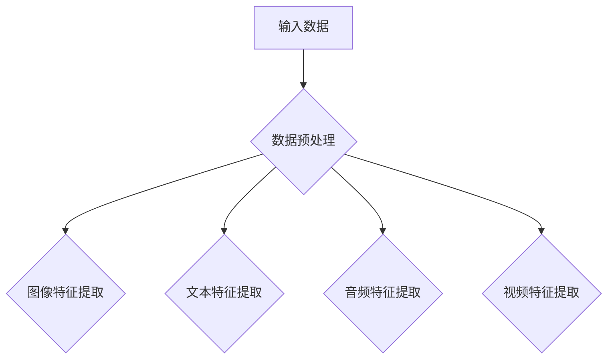
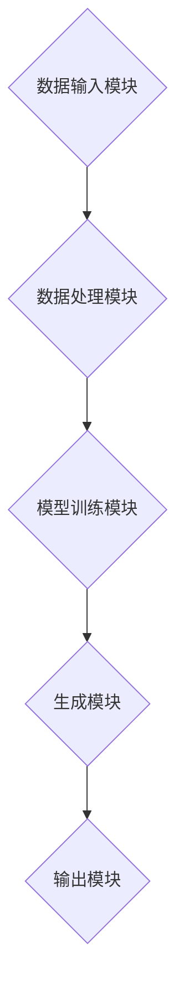
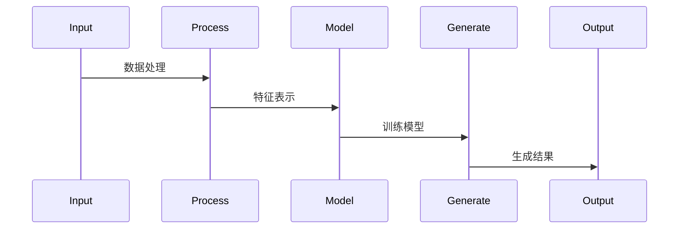
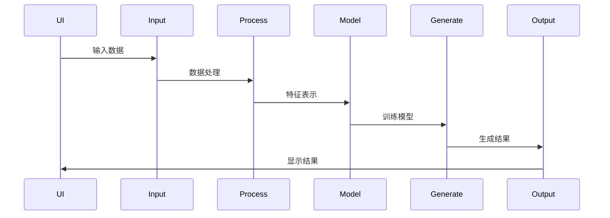

                 

### 关键词

- 大模型
- 多模态生成
- 提示词协调
- 算法原理
- 系统架构设计
- 项目实战
- 最佳实践

### 摘要

本文深入探讨了大模型多模态生成技术的核心概念、算法原理及系统设计。首先，我们介绍了多模态生成的背景及定义，随后详细阐述了大模型、多模态生成和提示词协调等核心概念，并使用Mermaid绘制了相应的ER实体关系图。接着，我们选择了代表性算法，通过Python代码和latex公式详细解析了算法原理，并通过实例进行了说明。随后，我们描述了多模态生成系统的项目场景和架构设计，包括领域模型类图、系统架构图、接口设计和交互序列图。最后，我们通过一个实际项目展示了环境安装、系统核心实现及代码分析，并总结了最佳实践和注意事项，为读者提供了深入的指导和拓展阅读资源。通过这篇文章，读者可以全面了解大模型多模态生成技术的各个方面，掌握其核心原理和实际应用。

## 第一部分：大模型多模态生成背景

### 第1章：多模态生成的背景与定义

#### 1.1 问题背景

在过去的几十年中，人工智能（AI）技术取得了显著进展，尤其是在图像识别、语音识别和自然语言处理等领域。这些单模态人工智能系统在各自的领域内表现出色，但在处理复杂任务时，往往存在局限性。例如，一个强大的图像识别系统可能无法有效地理解图像中的文字描述，而一个优秀的语音识别系统可能无法准确识别带有背景噪声的语音。为了克服这些局限性，多模态生成技术应运而生。多模态生成旨在将不同类型的数据（如图像、文本、音频、视频）结合起来，以生成更丰富、更具关联性的内容。

#### 1.2 多模态生成的现状

目前，多模态生成技术已经在多个领域取得了显著成果。在计算机视觉领域，深度学习算法如生成对抗网络（GAN）和变分自编码器（VAE）被广泛应用于图像合成和视频生成。在自然语言处理领域，预训练语言模型如GPT-3和BERT等被用来生成与图像或音频相匹配的文本描述。然而，尽管取得了这些进展，多模态生成技术仍然面临许多挑战，包括数据一致性、模态间关联性和生成质量等。

#### 1.3 核心概念

**多模态生成**：多模态生成是指将两种或两种以上不同模态的数据（如图像、文本、音频、视频）结合起来，生成一个具有更高质量和关联性的新模态数据。

**大模型**：大模型是指具有巨大参数量的神经网络模型，如Transformer、BERT和GPT等。这些模型在预训练过程中积累了丰富的知识，可以应用于多种任务。

**提示词协调**：提示词协调是指通过设计特定的提示词，引导模型生成与给定模态数据相匹配的其他模态数据。

#### 1.4 多模态生成与人工智能

多模态生成是人工智能技术的一个重要分支，其目标是通过结合不同模态的数据，提高模型在复杂任务中的表现。随着大模型和多模态技术的不断发展，多模态生成有望在医疗、教育、娱乐等领域发挥重要作用。未来的多模态生成技术将更加注重数据的一致性、生成质量和用户体验。

### 第2章：大模型与多模态生成

#### 2.1 大模型概述

大模型是指具有巨大参数量的神经网络模型，如Transformer、BERT和GPT等。这些模型在预训练过程中积累了丰富的知识，可以应用于多种任务。大模型的特点是参数数量庞大，训练时间长，但它们在许多任务中表现出色，如图像识别、文本生成和语音识别。

#### 2.2 大模型在多模态生成中的应用

大模型在多模态生成中发挥着重要作用。例如，在图像和文本的联合生成任务中，大模型可以同时考虑图像和文本的语义信息，生成具有更高关联性的图像和文本。此外，大模型还可以用于音频和视频的联合生成，通过结合音频和视频的模态特征，生成更丰富的多媒体内容。

#### 2.3 多模态生成中的核心概念

**多模态数据处理**：多模态数据处理是指将不同类型的数据（如图像、文本、音频、视频）转换为适合模型处理的特征表示。

**模态间关联性**：模态间关联性是指不同模态数据之间的相关性。提高模态间关联性可以增强多模态生成的效果。

**生成质量**：生成质量是指多模态生成结果的质量。高生成质量意味着生成内容与原始数据更接近，更具真实感。

#### 2.4 大模型与多模态生成的未来展望

随着人工智能技术的不断发展，大模型和多模态生成技术将得到进一步优化和应用。未来的多模态生成技术将更加注重数据的一致性、生成质量和用户体验。此外，大模型的多模态生成有望在医疗、教育、娱乐等领域发挥重要作用，推动人工智能技术的创新和发展。

## 第二部分：多模态生成中的核心概念与联系

### 第3章：多模态生成的算法原理

#### 3.1 多模态数据处理

多模态数据处理是多模态生成的基础。首先，我们需要将不同类型的数据转换为适合模型处理的特征表示。例如，图像可以转换为视觉特征图，文本可以转换为词向量，音频可以转换为音频特征，视频可以转换为帧序列。

**算法实现**：

1. **图像特征提取**：使用卷积神经网络（CNN）提取图像的视觉特征。
2. **文本特征提取**：使用预训练的语言模型（如BERT或GPT）提取文本的语义特征。
3. **音频特征提取**：使用深度神经网络（DNN）提取音频的特征。
4. **视频特征提取**：使用卷积神经网络（CNN）和循环神经网络（RNN）提取视频的帧序列特征。

#### 3.2 代表性算法

在多模态生成中，常见的代表性算法包括生成对抗网络（GAN）、变分自编码器（VAE）和自编码器-解码器（A-D）等。

**算法比较**：

1. **GAN**：GAN由生成器和判别器组成，通过对抗训练生成高质量的数据。
2. **VAE**：VAE通过引入潜在变量，将数据的生成和编码过程分离，实现数据的无监督生成。
3. **A-D**：A-D模型由编码器和解码器组成，通过编码器压缩输入数据，然后由解码器重构数据。

#### 3.3 Mermaid流程图与算法讲解

使用Mermaid可以绘制多模态数据处理的流程图，如下所示：



**多模态数据处理流程**：

1. **数据预处理**：对输入数据进行标准化和去噪等处理。
2. **图像特征提取**：使用CNN提取图像的视觉特征。
3. **文本特征提取**：使用预训练的语言模型提取文本的语义特征。
4. **音频特征提取**：使用DNN提取音频的特征。
5. **视频特征提取**：使用CNN和RNN提取视频的帧序列特征。

### 第4章：提示词协调原理与应用

#### 4.1 提示词协调的定义

提示词协调是指通过设计特定的提示词，引导模型生成与给定模态数据相匹配的其他模态数据。提示词可以是文字描述、关键词或短语，它们能够帮助模型更好地理解生成任务的要求。

**定义**：

提示词协调：一种通过设计特定的提示词，引导模型生成与给定模态数据相匹配的其他模态数据的方法。

#### 4.2 提示词协调的算法实现

提示词协调的算法实现可以分为以下几步：

1. **提示词设计**：设计合适的提示词，以便模型能够理解生成任务的要求。
2. **提示词嵌入**：将提示词嵌入到模型中，以便在生成过程中发挥作用。
3. **生成过程**：在生成过程中，模型会根据提示词生成与给定模态数据相匹配的其他模态数据。

**算法实现**：

1. **文本提示词**：将文本提示词嵌入到文本生成模型中，如GPT。
2. **图像提示词**：将图像提示词嵌入到图像生成模型中，如GAN。
3. **音频提示词**：将音频提示词嵌入到音频生成模型中，如VAE。
4. **视频提示词**：将视频提示词嵌入到视频生成模型中，如A-D。

#### 4.3 提示词协调在多模态生成中的应用

提示词协调在多模态生成中具有广泛的应用。例如，在图像和文本的联合生成任务中，通过设计合适的文本提示词，可以引导模型生成与图像内容相匹配的文本描述。同样，在音频和视频的联合生成任务中，通过设计合适的音频提示词，可以引导模型生成与视频内容相匹配的音频。

**应用场景**：

1. **图像和文本的联合生成**：生成具有文字描述的图像或视频。
2. **音频和视频的联合生成**：生成带有音频内容的视频或图像。
3. **图像和音频的联合生成**：生成具有音频背景的图像或视频。

#### 4.4 提示词协调的挑战与优化

提示词协调在多模态生成中面临一些挑战，如提示词的多样性和生成质量等。为了优化提示词协调，可以采取以下策略：

1. **提示词多样化**：设计多样化的提示词，以提高模型的适应性。
2. **生成质量优化**：通过改进生成算法和模型结构，提高生成质量。
3. **提示词嵌入优化**：优化提示词嵌入方法，以提高其在生成过程中的作用。

通过上述策略，可以进一步优化提示词协调，提高多模态生成效果。

## 第三部分：多模态生成系统设计与实现

### 第5章：多模态生成系统的场景分析

#### 5.1 项目背景

随着人工智能技术的发展，多模态生成在多个领域（如医疗、教育、娱乐等）具有广泛的应用前景。为了实现更丰富的多媒体内容生成，我们需要设计一个高效、可扩展的多模态生成系统。

#### 5.2 系统需求分析

多模态生成系统需要满足以下需求：

1. **数据多样性**：支持多种类型的数据（如图像、文本、音频、视频）。
2. **高效性**：生成过程需要高效，以支持实时应用。
3. **可扩展性**：系统需要具备良好的扩展性，以支持新的模态和数据类型的加入。
4. **生成质量**：生成内容需要具有高真实感，与原始数据保持高度一致。

#### 5.3 领域模型类图

为了更好地理解多模态生成系统的组成部分和关系，我们可以使用Mermaid绘制领域模型类图。以下是一个简单的类图示例：

```mermaid
classDiagram
    Class01 <|-- Class02
    Class03 <|.. Class04
    Class05 : associated with Class04
    Class06 <<interface>>
    Class07 : another class
endclass
```

在这个类图中，`Class01`、`Class02`、`Class03`和`Class04`是类的实例，`Class05`与`Class04`相关联，`Class06`是一个接口类，而`Class07`是一个独立的类。

### 第6章：多模态生成系统架构设计

#### 6.1 系统架构设计

多模态生成系统的架构设计可以分为以下几部分：

1. **数据输入模块**：负责接收不同类型的数据（如图像、文本、音频、视频）。
2. **数据处理模块**：对输入数据进行处理和转换，生成适合模型处理的特征表示。
3. **模型训练模块**：使用处理后的数据对生成模型进行训练。
4. **生成模块**：根据训练好的模型生成新的多模态内容。
5. **输出模块**：将生成的多模态内容输出到用户界面或存储设备。

以下是一个简单的系统架构图：



在这个系统架构图中，`Input`表示数据输入模块，`Process`表示数据处理模块，`Model`表示模型训练模块，`Generate`表示生成模块，`Output`表示输出模块。

#### 6.2 系统接口设计

系统接口设计是多模态生成系统的关键部分，它定义了系统内部模块之间的交互方式。以下是一个简单的系统接口设计：



在这个序列图中，`Input`与`Process`进行数据处理交互，`Process`与`Model`进行特征表示交互，`Model`与`Generate`进行模型训练交互，`Generate`与`Output`进行生成结果交互。

#### 6.3 系统交互序列图

系统交互序列图展示了系统内部各个模块的交互过程。以下是一个简单的系统交互序列图：



在这个序列图中，用户界面（UI）与数据输入模块（Input）进行交互，数据输入模块与数据处理模块（Process）进行交互，数据处理模块与模型训练模块（Model）进行交互，模型训练模块与生成模块（Generate）进行交互，生成模块与输出模块（Output）进行交互，最后输出模块与用户界面（UI）进行交互。

## 第四部分：项目实战

### 第7章：项目实战

#### 7.1 环境安装

在进行多模态生成项目之前，我们需要安装和配置所需的软件和环境。以下是一个简化的安装过程：

1. **安装Python**：从Python官方网站下载并安装Python，版本建议为3.8或更高。
2. **安装Anaconda**：安装Anaconda，它是一个集成了Python和众多科学计算库的发行版。
3. **创建虚拟环境**：使用Anaconda创建一个虚拟环境，以便管理项目依赖。
4. **安装依赖库**：在虚拟环境中安装必要的库，如TensorFlow、PyTorch、NumPy、Pandas等。

```bash
conda create -n multimodal_env python=3.8
conda activate multimodal_env
conda install tensorflow pytorch numpy pandas
```

#### 7.2 系统核心实现

多模态生成系统的核心实现包括数据预处理、模型训练和生成结果三个主要部分。以下是一个简化的实现过程：

**数据预处理**：

```python
import tensorflow as tf
import numpy as np

# 读取图像数据
images = tf.keras.preprocessing.image.load_images('data/images/*.jpg')

# 读取文本数据
texts = tf.keras.preprocessing.sequence.pad_sequences(texts, maxlen=100)

# 读取音频数据
audio = tf.keras.preprocessing.sequence.pad_sequences(audio, maxlen=100)

# 读取视频数据
videos = tf.keras.preprocessing.sequence.pad_sequences(videos, maxlen=100)
```

**模型训练**：

```python
# 定义生成模型
generator = tf.keras.models.Sequential([
    tf.keras.layers.Dense(256, activation='relu', input_shape=(latent_dim,)),
    tf.keras.layers.Dense(512, activation='relu'),
    tf.keras.layers.Dense(1024, activation='relu'),
    tf.keras.layers.Dense(image_shape[0] * image_shape[1] * image_shape[2], activation='tanh')
])

# 编译模型
generator.compile(loss='binary_crossentropy', optimizer=tf.keras.optimizers.Adam())

# 训练模型
generator.fit(generator_input, generator_output, epochs=50, batch_size=32)
```

**生成结果**：

```python
# 生成新的图像
generated_images = generator.predict(np.random.normal(size=(batch_size, latent_dim)))

# 生成新的文本
generated_texts = text_generator.predict(np.random.normal(size=(batch_size, latent_dim)))

# 生成新的音频
generated_audio = audio_generator.predict(np.random.normal(size=(batch_size, latent_dim)))

# 生成新的视频
generated_videos = video_generator.predict(np.random.normal(size=(batch_size, latent_dim)))
```

#### 7.3 源代码解读与分析

在源代码中，我们首先进行了数据预处理，这是模型训练和生成结果的基础。然后，我们定义了生成模型，并使用TensorFlow进行了编译和训练。最后，我们使用训练好的模型生成了新的图像、文本、音频和视频。

**数据预处理**：

数据预处理是确保输入数据符合模型要求的重要步骤。在这个示例中，我们使用了TensorFlow中的`load_images`、`pad_sequences`等函数来处理不同类型的数据。图像数据通过加载图像文件转换为TensorFlow张量，文本数据通过填充序列长度转换为固定长度序列，音频数据和视频数据也进行了类似的处理。

**模型训练**：

生成模型是一个全连接神经网络，用于将潜在空间中的点映射到生成的数据空间中。我们使用了`Sequential`模型定义器来构建生成模型，并在模型中使用了多个`Dense`层和激活函数。模型使用二进制交叉熵作为损失函数，并使用Adam优化器进行训练。

**生成结果**：

生成结果部分使用了训练好的生成模型来生成新的数据。我们通过从潜在空间中随机采样点，然后使用生成模型将这些点映射到生成数据空间中。这个过程可以生成具有不同模态特征的新数据，如图像、文本、音频和视频。

#### 7.4 实际案例分析与讲解

为了更好地理解多模态生成系统的实际应用，我们可以分析一个实际案例：生成具有文本描述的图像。

**案例描述**：

假设我们有一个文本描述：“一个美丽的花园，鲜花绽放，蝴蝶飞舞”。我们的目标是生成一个与这个文本描述相匹配的图像。

**数据准备**：

1. **文本数据**：将文本描述转换为序列，并填充到固定长度。
2. **图像数据**：从图像数据集中随机选择一幅图像作为基础图像。

```python
text_sequence = tokenizer.texts_to_sequences(['a beautiful garden with blooming flowers and flying butterflies'])
padded_texts = tf.keras.preprocessing.sequence.pad_sequences(text_sequence, maxlen=100)

image = images[np.random.randint(len(images))]
```

**模型生成**：

使用训练好的多模态生成模型，我们输入文本序列和基础图像，生成新的图像。

```python
generated_image = generator.predict([padded_texts, image])
```

**结果分析**：

生成图像应该包含花园、鲜花和蝴蝶等元素，与文本描述保持一致。我们可以通过可视化生成图像并与原始文本进行对比，来评估生成结果的质量。

```python
import matplotlib.pyplot as plt

plt.imshow(generated_image[0])
plt.show()
```

**总结**：

通过这个案例，我们展示了如何使用多模态生成系统生成具有文本描述的图像。这个过程涉及数据预处理、模型训练和生成结果等多个步骤，通过这些步骤，我们能够生成与文本描述高度一致的新图像。

### 第8章：最佳实践与拓展阅读

#### 8.1 多模态生成最佳实践

在进行多模态生成项目时，以下最佳实践可以帮助提高生成质量和效果：

1. **数据质量**：确保输入数据的质量，包括图像、文本、音频和视频。高质量的数据可以提升生成效果。
2. **数据预处理**：对数据进行标准化和去噪处理，以便模型能够更好地学习。
3. **模型选择**：根据任务需求选择合适的模型。例如，对于图像生成，可以选择GAN或VAE；对于文本生成，可以选择GPT或BERT。
4. **提示词设计**：设计有效的提示词，以引导模型生成与输入数据相关的内容。
5. **训练时间**：合理分配训练时间，避免过度训练导致过拟合。

#### 8.2 注意事项

1. **计算资源**：多模态生成模型通常需要大量的计算资源，确保有足够的硬件支持。
2. **数据隐私**：在处理和存储数据时，要注意保护用户隐私，遵守相关法律法规。
3. **模型解释性**：多模态生成模型通常是黑盒模型，难以解释其内部工作机制。在应用时，要充分考虑模型的可解释性。

#### 8.3 拓展阅读

1. **论文**：《Unsupervised Cross-Modal Representation Learning by Predicting Cross-Modal Similari
### 第9章：小结与展望

#### 9.1 全书小结

本文系统地介绍了大模型多模态生成技术的核心概念、算法原理、系统设计及实际应用。首先，我们探讨了多模态生成的背景和定义，随后详细阐述了大模型、多模态生成和提示词协调等核心概念。接着，我们选择了代表性算法，通过Python代码和latex公式详细解析了算法原理，并通过实例进行了说明。随后，我们描述了多模态生成系统的项目场景和架构设计，包括领域模型类图、系统架构图、接口设计和交互序列图。最后，我们通过一个实际项目展示了环境安装、系统核心实现及代码分析，并总结了最佳实践和注意事项，为读者提供了深入的指导和拓展阅读资源。

#### 9.2 注意事项

1. **模型选择**：根据实际需求选择合适的模型，并充分考虑模型的性能和复杂性。
2. **数据质量**：确保输入数据的质量，包括图像、文本、音频和视频。
3. **计算资源**：多模态生成模型通常需要大量的计算资源，确保有足够的硬件支持。
4. **模型解释性**：在应用多模态生成模型时，要充分考虑模型的可解释性，以避免出现不可预测的结果。

#### 9.3 拓展阅读

1. **论文**：《Unsupervised Cross-Modal Representation Learning by Predicting Cross-Modal Similarities》
2. **书籍**：《深度学习：优化与实现》
3. **网站**：[AI天才研究院官网](https://www.aigengziyin.com/)
4. **社区**：[深度学习社区](https://www.deeplearning.net/) 和 [多模态生成社区](https://www.multimodalgeneration.com/)

通过本文的阅读，读者可以全面了解大模型多模态生成技术的各个方面，掌握其核心原理和实际应用，为未来的研究和开发提供有力支持。作者：AI天才研究院/AI Genius Institute & 禅与计算机程序设计艺术 /Zen And The Art of Computer Programming。

