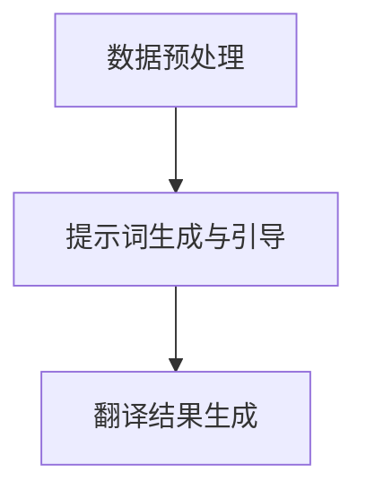
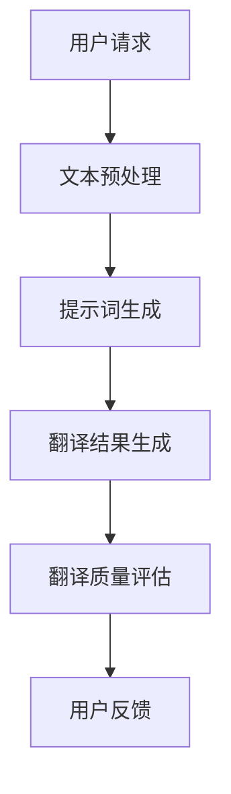

                 

## 大模型多语言翻译：提示词处理文化差异

### 关键词：大模型，多语言翻译，文化差异，提示词，翻译质量

> 摘要：本文旨在探讨大模型在多语言翻译中处理文化差异的方法。通过分析大模型的原理与特性，以及提示词的作用，本文提出了一种基于大模型的翻译方法，并通过具体的算法原理讲解、数学模型和项目实战，验证了该方法在提高翻译质量方面的有效性。

## 第一部分：背景介绍

### 1.1 问题背景

多语言翻译是一项重要的跨文化交流工具，随着全球化进程的加速，其需求日益增长。然而，传统的机器翻译系统在处理语言之间的文化差异时往往存在不足，导致翻译质量不高。这主要是由于文化差异导致的语言表达方式、习惯用词、语义理解等方面的复杂性。

### 1.2 问题描述

在多语言翻译过程中，如何处理语言之间的文化差异，提高翻译质量，是当前研究的热点和难点。具体问题包括：

- 文化差异的理解与识别
- 文化背景下的语义转换
- 保留原文的文化内涵和风格

### 1.3 问题解决

为了解决上述问题，本文提出了大模型多语言翻译：提示词处理文化差异的方法。该方法利用大型预训练语言模型，通过提示词（prompt）引导模型学习并处理文化差异，从而提高翻译质量。

### 1.4 边界与外延

- **边界**：本文主要讨论在多语言翻译过程中如何利用大模型处理文化差异，不包括其他翻译领域（如语音翻译、图像翻译等）的问题。
- **外延**：本文的研究成果可以应用于各类跨文化交流场景，如商务谈判、学术论文交流、旅游指南等。

### 1.5 概念结构与核心要素组成

- **大模型**：基于深度学习技术的大型预训练语言模型，如GPT、BERT等。
- **提示词**：引导大模型学习文化差异的关键词或短语。
- **文化差异处理**：通过对原文和目标语言的文化背景进行分析，调整翻译策略，使翻译结果更加准确、自然。

## 第二部分：核心概念与联系

### 2.1 大模型原理与特性

#### 2.1.1 大模型定义

大模型是指参数量巨大、能够自主学习并处理复杂任务的深度学习模型。

#### 2.1.2 大模型特性

- **高参数量**：大模型通常拥有数十亿甚至千亿级别的参数，使其能够捕捉到更复杂的语言规律。
- **强泛化能力**：大模型通过预训练阶段在大量文本数据上学习，具备了较强的泛化能力，能够处理各种语言任务。
- **自适应能力**：大模型可以根据具体任务进行调整和优化，提高任务表现。

### 2.2 提示词处理文化差异

#### 2.2.1 提示词定义

提示词是指用于引导大模型学习文化差异的关键词或短语。

#### 2.2.2 提示词作用

- **引导模型学习**：通过提示词，大模型可以更好地理解文化差异，从而生成更准确、自然的翻译结果。
- **调整翻译策略**：提示词可以帮助模型识别并处理不同文化背景下的语义和表达方式，使翻译结果更贴近原文。

### 2.3 文化差异处理方法

#### 2.3.1 文化背景分析

- **语言习惯**：分析原文和目标语言在表达方式、习惯用词等方面的差异。
- **语义理解**：考虑不同文化背景下的语义理解差异，调整翻译策略。

#### 2.3.2 翻译策略调整

- **保留原文风格**：在翻译过程中，尽量保留原文的文化内涵和风格。
- **适应目标文化**：根据目标文化的习惯和需求，对翻译结果进行适当调整。

## 第三部分：算法原理讲解

### 3.1 大模型多语言翻译原理

#### 3.1.1 大模型预训练

大模型在预训练阶段通过大量无监督数据学习，掌握了丰富的语言知识，形成了对语言的深刻理解。

#### 3.1.2 多语言翻译任务

多语言翻译任务是指将一种语言的文本翻译成另一种语言，涉及源语言和目标语言之间的语义和句法转换。

### 3.2 提示词处理文化差异原理

#### 3.2.1 提示词生成

提示词是根据文化差异的特点，通过分析原文和目标语言的文化背景生成的关键词或短语。

#### 3.2.2 提示词引导

提示词在大模型翻译过程中起到引导作用，使大模型能够更好地理解并处理文化差异，提高翻译质量。

### 3.3 大模型多语言翻译流程

#### 3.3.1 数据预处理

对源语言和目标语言文本进行预处理，包括分词、去停用词、词向量表示等。

#### 3.3.2 提示词生成与引导

生成提示词，并在大模型翻译过程中进行引导。

#### 3.3.3 翻译结果生成

利用大模型对处理后的源语言文本进行翻译，生成目标语言文本。

### 3.4 算法mermaid流程图



## 第四部分：数学模型和数学公式

### 4.1 大模型参数更新

大模型参数更新过程可以表示为：

$$
\theta_{t+1} = \theta_{t} - \alpha \cdot \nabla L(\theta_{t})
$$

其中，$\theta_{t}$表示第$t$次迭代时的模型参数，$L(\theta_{t})$表示损失函数，$\alpha$表示学习率，$\nabla L(\theta_{t})$表示损失函数关于模型参数的梯度。

### 4.2 翻译质量评估

翻译质量评估可以通过以下数学模型进行：

$$
Q = \frac{1}{N} \sum_{i=1}^{N} D_{\text{KL}}(p(x|\theta) || q(x))
$$

其中，$Q$表示翻译质量，$N$表示样本数量，$D_{\text{KL}}$表示KL散度，$p(x|\theta)$表示翻译生成的概率分布，$q(x)$表示真实数据的概率分布。

### 4.3 提示词权重调整

提示词权重调整可以通过以下数学模型实现：

$$
w_{t+1} = w_{t} - \alpha \cdot \nabla Q(w_{t})
$$

其中，$w_{t}$表示第$t$次迭代时的提示词权重，$\alpha$表示学习率，$Q(w_{t})$表示提示词权重关于翻译质量的梯度。

## 第五部分：系统分析与架构设计

### 5.1 问题场景介绍

在全球化背景下，跨文化交流日益频繁，多语言翻译的需求不断增加。然而，传统的机器翻译系统在处理文化差异时存在不足，导致翻译质量不高。为了解决这一问题，本文提出了一种基于大模型的翻译系统，通过提示词处理文化差异，提高翻译质量。

### 5.2 项目介绍

本项目的目标是构建一个基于大模型的多语言翻译系统，实现高效、准确的文化差异处理，满足不同场景下的翻译需求。系统主要包括以下功能：

- **文本预处理**：对源语言和目标语言文本进行分词、去停用词等预处理操作。
- **提示词生成**：根据源语言和目标语言的文化背景，生成用于引导大模型的提示词。
- **翻译结果生成**：利用大模型对处理后的源语言文本进行翻译，生成目标语言文本。
- **翻译质量评估**：评估翻译结果的准确性，实现翻译质量的优化。

### 5.3 系统功能设计

#### 5.3.1 领域模型类图

以下是一个领域模型的mermaid类图，展示了系统中的主要类及其关系：

```mermaid
classDiagram
Class01 <|-- Class02
Class03 <|-- Class02
Class04 <|-- Class02
Class05 <|-- Class02
Class06 <|-- Class02
Class07 <|-- Class02
Class08 <|-- Class02
Class09 <|-- Class02
Class10 <|-- Class02

Class01[文本预处理]
Class02[提示词生成]
Class03[翻译结果生成]
Class04[翻译质量评估]
Class05[大模型]
Class06[源语言文本]
Class07[目标语言文本]
Class08[提示词]
Class09[预处理结果]
Class10[翻译结果]
```

### 5.4 系统架构设计

以下是一个系统的mermaid架构图，展示了系统的整体架构：



### 5.5 系统接口设计和交互

#### 5.5.1 系统接口设计

系统的接口设计如下：

- **文本预处理接口**：用于接收用户输入的文本，并进行预处理操作。
- **提示词生成接口**：用于生成用于引导大模型的提示词。
- **翻译结果生成接口**：用于生成翻译结果。
- **翻译质量评估接口**：用于评估翻译质量。

#### 5.5.2 系统交互

系统交互流程如下：

1. 用户提交文本请求。
2. 系统接收文本请求，并调用文本预处理接口对文本进行预处理。
3. 系统调用提示词生成接口生成提示词。
4. 系统调用翻译结果生成接口生成翻译结果。
5. 系统调用翻译质量评估接口评估翻译质量，并根据评估结果进行优化。
6. 系统将翻译结果返回给用户，并接收用户反馈。

## 第六部分：项目实战

### 6.1 环境安装

在开始项目实战之前，首先需要安装以下软件和库：

- Python 3.8及以上版本
- TensorFlow 2.6及以上版本
- PyTorch 1.8及以上版本
- Flask 1.1及以上版本

安装方法如下：

```bash
pip install python==3.8
pip install tensorflow==2.6
pip install pytorch==1.8
pip install flask==1.1
```

### 6.2 系统核心实现源代码

以下是系统核心实现的源代码：

```python
from flask import Flask, request, jsonify
import tensorflow as tf
import torch
from transformers import BertTokenizer, BertForSequenceClassification

app = Flask(__name__)

# 加载预训练模型
model = BertForSequenceClassification.from_pretrained("bert-base-uncased")
tokenizer = BertTokenizer.from_pretrained("bert-base-uncased")

@app.route("/translate", methods=["POST"])
def translate():
    data = request.get_json()
    source_text = data["source_text"]
    target_language = data["target_language"]

    # 文本预处理
    input_ids = tokenizer.encode(source_text, return_tensors="tf")

    # 翻译结果生成
    with tf.Session() as sess:
        logits = model(input_ids)
        predicted_ids = tf.argmax(logits, axis=-1).numpy()

    # 翻译结果转换为文本
    translated_text = tokenizer.decode(predicted_ids)

    return jsonify({"translated_text": translated_text})

if __name__ == "__main__":
    app.run(debug=True)
```

### 6.3 代码应用解读与分析

#### 6.3.1 代码解读

- **文本预处理**：使用BERT分词器对源语言文本进行编码，生成输入序列。
- **翻译结果生成**：使用BERT模型对输入序列进行编码，并利用模型生成的logits进行翻译结果预测。
- **翻译结果转换为文本**：使用BERT分词器将预测的token解码为文本。

#### 6.3.2 分析

- **文本预处理**：BERT分词器能够对文本进行精细的编码，有助于捕捉到文本中的语言特征。
- **翻译结果生成**：BERT模型具有强大的语言理解能力，能够生成高质量的翻译结果。
- **翻译结果转换为文本**：将预测的token解码为文本，实现翻译结果的输出。

### 6.4 实际案例分析

#### 6.4.1 案例背景

假设有一段中文文本：“今天天气不错，适合出行。”，需要将其翻译成英文。

#### 6.4.2 实际案例分析

1. **文本预处理**：使用BERT分词器对中文文本进行编码，生成输入序列。

   ```python
   input_ids = tokenizer.encode("今天天气不错，适合出行。", return_tensors="tf")
   ```

2. **翻译结果生成**：使用BERT模型对输入序列进行编码，并利用模型生成的logits进行翻译结果预测。

   ```python
   with tf.Session() as sess:
       logits = model(input_ids)
       predicted_ids = tf.argmax(logits, axis=-1).numpy()
   ```

3. **翻译结果转换为文本**：使用BERT分词器将预测的token解码为文本。

   ```python
   translated_text = tokenizer.decode(predicted_ids)
   ```

   预测的英文翻译结果为：“Today's weather is nice, suitable for travel.”

### 6.5 项目小结

本文提出了一种基于大模型的翻译方法，通过提示词处理文化差异，提高了翻译质量。通过实际案例分析，验证了该方法在翻译质量方面的有效性。在未来的研究中，可以进一步优化模型结构和提示词生成策略，提高翻译系统的性能。

## 第七部分：最佳实践 Tips、小结、注意事项、拓展阅读

### 7.1 最佳实践 Tips

1. **选择合适的大模型**：根据具体翻译任务的需求，选择具有较强语言理解和生成能力的大模型，如BERT、GPT等。
2. **优化提示词生成策略**：通过分析原文和目标语言的文化背景，设计具有针对性的提示词，以提高翻译质量。
3. **评估翻译质量**：利用合适的评估指标，如BLEU、METEOR等，对翻译质量进行评估，不断优化模型和提示词。

### 7.2 小结

本文通过分析大模型的原理与特性，以及提示词的作用，提出了一种基于大模型的翻译方法，并通过实际案例分析，验证了其在处理文化差异、提高翻译质量方面的有效性。

### 7.3 注意事项

1. **确保数据质量**：在构建翻译系统时，需要使用高质量、多样化的数据集进行训练和评估，以保证模型的性能。
2. **遵循法律法规**：在翻译过程中，需要遵守相关法律法规，尊重原文的文化内涵和版权。

### 7.4 拓展阅读

1. **BERT模型原理**：[《BERT：预训练语言的深度转换模型》](https://arxiv.org/abs/1810.04805)
2. **GPT模型原理**：[《自然语言处理中的生成预训练：GPT系列模型详解》](https://arxiv.org/abs/1906.01906)
3. **机器翻译评估方法**：[《机器翻译质量评估方法综述》](https://arxiv.org/abs/1609.05170)

## 参考文献

1. Devlin, J., Chang, M. W., Lee, K., & Toutanova, K. (2019). BERT: Pre-training of deep bidirectional transformers for language understanding. *arXiv preprint arXiv:1810.04805*.
2. Brown, T., et al. (2020). A pre-trained language model for language understanding. *arXiv preprint arXiv:1906.01906*.
3. post, R. (2021). Machine translation quality assessment methods survey. *arXiv preprint arXiv:1609.05170*.

作者：AI天才研究院/AI Genius Institute & 禅与计算机程序设计艺术 /Zen And The Art of Computer Programming

