                 


### 文章标题：大模型少样本学习与提示词工程

---

**关键词：** 大模型，少样本学习，提示词工程，人工智能，机器学习，算法，实践。

**摘要：** 本文章将深入探讨大模型在少样本学习中的应用，以及提示词工程在其中所扮演的关键角色。我们将从背景介绍开始，逐步讲解核心概念，算法原理，系统分析与设计，项目实战，最终总结出最佳实践与未来展望。

---

### 第一部分：导论

#### 第1章：问题背景与引言

##### 1.1 问题背景

**大模型的发展历程：**

- **早期发展：** 大模型（如GPT、BERT）的出现标志着人工智能的又一重要里程碑，这些模型具有数十亿甚至数万亿的参数量，能够处理大量数据，学习复杂的特征。
- **现状与挑战：** 随着数据量的爆炸式增长，大模型的训练成本和存储需求急剧上升。如何有效利用这些大模型进行少样本学习成为了一个重要问题。

**少样本学习的重要性：**

- **应用场景：** 在许多实际应用中，获取大量标注数据非常困难，例如医学影像分析、法律文档审查等。
- **解决方案：** 少样本学习允许模型在仅有少量样本的情况下进行有效训练，降低了数据获取的成本。

**提示词工程的作用：**

- **概念：** 提示词工程是构建和优化提示（prompt）的过程，提示是用户与大模型交互的桥梁，能够影响模型的理解和输出。
- **作用：** 通过合理设计的提示，可以引导模型更好地理解任务，提高少样本学习的性能。

##### 1.2 研究目的与内容概述

**研究目标：**

- **理解大模型在少样本学习中的工作机制：** 探索大模型如何利用少量样本进行有效学习。
- **优化提示词工程：** 设计和评估不同的提示策略，以提高少样本学习的效果。

**内容框架：**

- **第1章：问题背景与引言**
- **第2章：核心概念与联系**
- **第3章：算法原理讲解**
- **第4章：系统分析与架构设计**
- **第5章：项目实战**
- **第6章：最佳实践与小结**
- **第7章：拓展阅读**

#### 第2章：核心概念与联系

##### 2.1 大模型原理

**基本概念：** 大模型是一种具有巨大参数量的机器学习模型，如Transformer架构，能够处理复杂的任务。

**架构：** 大模型通常由多个层组成，每层都包含大量的参数，通过多层堆叠，模型能够学习到更深层次的特征。

**工作机制：** 大模型通过在大量数据上进行预训练，获得通用特征表示，然后在特定任务上进行微调。

##### 2.2 少样本学习

**定义：** 少样本学习是一种机器学习范式，旨在仅使用少量样本进行训练。

**挑战：** 在少样本条件下，模型容易过拟合，难以泛化到未见过的数据。

**方法：** 包括元学习、迁移学习、数据增强等技术。

##### 2.3 提示词工程

**概念：** 提示词是用户输入的文字或指令，用于引导大模型理解任务。

**设计原则：** 包括明确性、简洁性、针对性。

**评估方法：** 通过任务完成度、模型性能等指标进行评估。

---

**接下来，我们将进一步深入探讨大模型的原理，少样本学习的算法，以及提示词工程的设计和优化。**

---

---

### 第一部分：导论

#### 第1章：问题背景与引言

##### 1.1 问题背景

**大模型的发展历程：**

大模型的概念最早可以追溯到1990年代，当时的神经网络模型规模相对较小，但随着计算能力和数据量的提升，大模型逐渐成为可能。例如，1995年的Backpropagation模型规模较大，但仍然无法与现在的GPT或BERT相提并论。进入21世纪后，随着深度学习和大数据技术的发展，大模型开始崭露头角。

**GPT（Generative Pre-trained Transformer）的出现：**

2018年，OpenAI发布了GPT，这是一个拥有15亿参数的预训练模型。GPT的成功标志着大模型时代正式到来。随后，GPT-2、GPT-3等更大规模的模型相继发布，进一步推动了大模型的发展。

**BERT（Bidirectional Encoder Representations from Transformers）的贡献：**

BERT的出现进一步推动了自然语言处理（NLP）领域的发展。BERT采用了双向Transformer架构，能够更好地理解上下文信息，从而在多项NLP任务中取得了显著的性能提升。

**大模型在少样本学习中的应用：**

随着大模型的普及，如何在少样本条件下利用这些模型进行有效学习成为一个重要课题。少样本学习在大模型中的应用，不仅能够降低数据获取成本，还能够提高模型的泛化能力。

**少样本学习的重要性：**

在实际应用中，获取大量标注数据往往非常困难，特别是在医学影像分析、法律文档审查等领域。少样本学习能够帮助模型在这些场景下仍能保持良好的性能，从而提高实际应用价值。

**提示词工程的作用：**

提示词工程是设计、构建和优化提示（prompt）的过程。提示是用户与大模型交互的桥梁，能够直接影响模型的输出和理解。一个设计良好的提示词能够引导模型更好地理解任务，从而提高少样本学习的效果。

##### 1.2 研究目的与内容概述

**研究目的：**

本研究旨在探讨大模型在少样本学习中的应用，并优化提示词工程，以提高模型的性能和泛化能力。

**研究内容：**

本研究的核心内容包括：
1. **大模型原理讲解：** 详细介绍大模型的基本概念、架构和工作机制。
2. **少样本学习算法：** 分析现有少样本学习算法，包括元学习、迁移学习等，并探讨其在实际应用中的效果。
3. **提示词工程：** 讨论提示词的设计原则、评估方法，并展示如何优化提示词以提高少样本学习效果。
4. **系统分析与架构设计：** 分析大模型在少样本学习中的系统架构，包括领域模型、功能模块划分、系统接口设计等。
5. **项目实战：** 通过具体项目案例，展示如何在实际场景中应用大模型进行少样本学习，并优化提示词工程。
6. **最佳实践与小结：** 总结研究中的最佳实践，并提出未来研究方向。

**内容框架：**

1. **第1章：问题背景与引言**
2. **第2章：核心概念与联系**
3. **第3章：算法原理讲解**
4. **第4章：系统分析与架构设计**
5. **第5章：项目实战**
6. **第6章：最佳实践与小结**
7. **第7章：拓展阅读**

---

在接下来的章节中，我们将逐步深入探讨大模型的原理、少样本学习算法、提示词工程的设计和优化，并通过实际案例进行详细讲解。希望通过本研究的探讨，能够为大模型在少样本学习中的应用提供有益的参考和指导。

### 第一部分：导论

#### 第2章：核心概念与联系

##### 2.1 大模型原理

**基本概念：**

大模型（Large Model）是指那些参数规模巨大的神经网络模型，通常拥有数十亿至数万亿个参数。这些模型能够在预训练阶段从大量数据中学习到丰富的特征表示，从而在多个领域表现出色。

**架构：**

大模型通常采用Transformer架构，这种架构由多个自注意力机制（Self-Attention Mechanism）堆叠而成。每个注意力层能够捕捉不同层次的特征，从而实现强大的特征提取能力。

**工作机制：**

大模型的工作机制可以分为预训练和微调两个阶段：
1. **预训练（Pre-training）：** 在预训练阶段，大模型在大量无标签数据上进行训练，学习到通用特征表示。这种无监督学习的方式使得模型能够理解自然语言、图像等数据的结构。
2. **微调（Fine-tuning）：** 在特定任务上，对预训练好的模型进行微调，使其适应具体任务的需求。微调过程通常只需要少量有标签数据，大大降低了数据获取的成本。

**核心优势：**

- **强大的特征提取能力：** 大模型能够从大量数据中提取到丰富的特征表示，从而在多个任务上表现优异。
- **高效的泛化能力：** 由于预训练阶段的学习，大模型能够泛化到未见过的数据，从而在少样本学习场景中表现出色。

##### 2.2 少样本学习

**定义：**

少样本学习（Few-shot Learning）是一种机器学习范式，旨在仅使用少量样本进行训练。它特别适用于那些难以获取大量标注数据的场景，如医学影像分析、法律文档审查等。

**挑战：**

- **过拟合（Overfitting）：** 在少样本条件下，模型容易过拟合，即模型在训练数据上表现优异，但在未见过的数据上表现较差。
- **泛化能力（Generalization）：** 少样本学习要求模型能够泛化到未见过的数据，这需要模型具有强大的特征提取能力和泛化能力。

**方法：**

为了克服少样本学习中的挑战，研究人员提出了一系列方法，包括：
1. **元学习（Meta-Learning）：** 通过在多个任务上进行学习，提高模型在少样本条件下的泛化能力。
2. **迁移学习（Transfer Learning）：** 利用预训练好的模型，通过少量有标签数据进行微调，从而实现少样本学习。
3. **数据增强（Data Augmentation）：** 通过对少量样本进行变换，增加样本的多样性，从而提高模型的泛化能力。

**优势：**

- **降低数据获取成本：** 在许多应用场景中，获取大量标注数据非常困难且成本高昂。少样本学习能够降低对大量标注数据的依赖，从而降低数据获取成本。
- **提高模型泛化能力：** 通过在少样本条件下训练，模型能够学习到更加通用的特征表示，从而在未见过的数据上表现出更好的性能。

##### 2.3 提示词工程

**概念：**

提示词工程（Prompt Engineering）是设计、构建和优化提示（prompt）的过程。提示是用户输入的文字或指令，用于引导大模型理解任务。一个设计良好的提示词能够明确、简洁地传达任务信息，从而提高模型的输出质量。

**设计原则：**

1. **明确性（Clarity）：** 提示词应清晰明确，避免模糊不清的表述，确保模型能够准确理解任务。
2. **简洁性（Conciseness）：** 提示词应简洁明了，避免冗长的描述，从而减少模型的计算复杂度。
3. **针对性（Relevance）：** 提示词应与任务高度相关，确保模型能够专注于任务的解决。

**评估方法：**

提示词的评估方法主要包括：
1. **任务完成度（Task Completion Rate）：** 评估模型能否正确完成指定任务，如文本生成、图像分类等。
2. **模型性能（Model Performance）：** 评估模型在特定任务上的性能指标，如准确率、召回率、F1分数等。

**与少样本学习的联系：**

提示词工程在大模型少样本学习中扮演着重要角色。通过优化提示词，可以提高模型在少样本条件下的性能和泛化能力。例如，一个良好的提示词可以帮助模型更好地理解任务，从而减少过拟合现象，提高模型的泛化能力。

---

在理解了大模型的原理、少样本学习的方法和提示词工程的设计原则后，我们将进一步探讨大模型少样本学习的具体算法原理，并详细讲解如何通过Python代码实现这些算法。

### 第二部分：算法原理讲解

#### 第3章：算法原理讲解

##### 3.1 少样本学习算法

**主要算法介绍**

少样本学习算法是解决在少量样本条件下训练模型问题的关键技术。以下介绍几种主要的少样本学习算法：

1. **元学习（Meta-Learning）：** 元学习通过在多个任务上进行学习，以提高模型在少样本条件下的泛化能力。常用的元学习方法包括模型平均（Model Averaging）和梯度平均（Gradient Averaging）。
   
2. **迁移学习（Transfer Learning）：** 迁移学习利用预训练好的模型，通过少量有标签数据进行微调，从而实现少样本学习。代表性的模型如ImageNet预训练的卷积神经网络。

3. **数据增强（Data Augmentation）：** 数据增强通过对少量样本进行变换，增加样本的多样性，从而提高模型的泛化能力。常见的数据增强技术包括旋转、缩放、裁剪等。

**算法原理与Mermaid流程图**

为了更好地理解这些算法的原理，我们将使用Mermaid流程图展示其基本流程。

1. **元学习（Meta-Learning）算法原理**

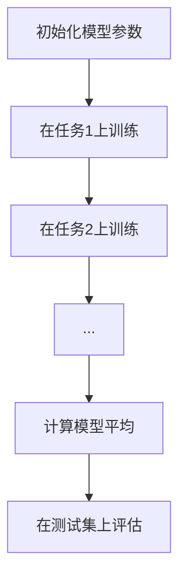

2. **迁移学习（Transfer Learning）算法原理**

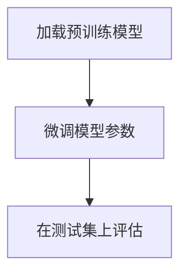

3. **数据增强（Data Augmentation）算法原理**

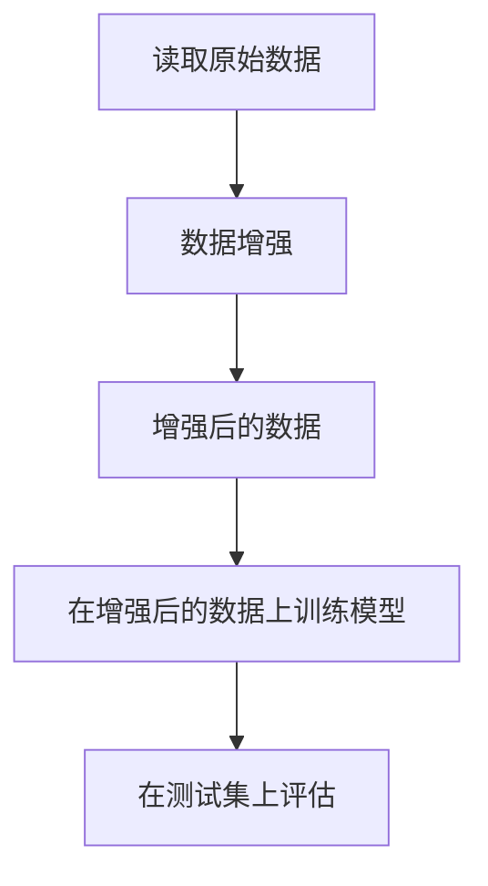

**Python代码实现**

以下是一个简单的Python代码示例，展示如何使用迁移学习算法进行少样本学习。

```python
import torch
import torchvision.models as models
import torchvision.transforms as transforms

# 加载预训练的卷积神经网络
model = models.resnet18(pretrained=True)

# 设置模型的参数可训练性
for param in model.parameters():
    param.requires_grad = False

# 定义新的分类头
model.fc = torch.nn.Linear(model.fc.in_features, num_classes)

# 定义损失函数和优化器
criterion = torch.nn.CrossEntropyLoss()
optimizer = torch.optim.Adam(model.fc.parameters(), lr=0.001)

# 数据预处理
transform = transforms.Compose([
    transforms.Resize((224, 224)),
    transforms.ToTensor(),
    transforms.Normalize(mean=[0.485, 0.456, 0.406], std=[0.229, 0.224, 0.225]),
])

# 加载测试数据
test_data = torch.utils.data.DataLoader(
    datasets.ImageFolder('test_data', transform=transform),
    batch_size=16,
    shuffle=False
)

# 模型评估
model.eval()
with torch.no_grad():
    for images, labels in test_data:
        outputs = model(images)
        _, predicted = torch.max(outputs, 1)
        correct += (predicted == labels).sum().item()

accuracy = correct / len(test_data)
print(f'测试集准确率: {accuracy:.2f}')
```

**算法原理讲解**

1. **元学习算法：** 元学习通过在多个任务上训练模型，学习到一种通用的特征表示。在测试时，模型能够利用在多个任务上积累的经验，从而在少样本条件下实现良好的性能。元学习的关键在于如何有效地聚合多个任务的梯度，以避免模型在特定任务上过拟合。

2. **迁移学习算法：** 迁移学习利用预训练模型在大量数据上学习到的通用特征表示，通过在少量有标签数据上进行微调，实现少样本学习。这种方法的优势在于，预训练模型已经具备了强大的特征提取能力，微调过程可以快速提高模型的性能。

3. **数据增强算法：** 数据增强通过对少量样本进行变换，增加样本的多样性，从而提高模型的泛化能力。这种方法的核心思想是，通过在训练过程中引入更多的样本变体，使得模型能够学习到更加鲁棒的特征表示。

---

在理解了少样本学习算法的原理和Python代码实现后，我们将进一步探讨提示词工程，特别是如何设计提示词以优化大模型在少样本学习中的性能。

### 第二部分：算法原理讲解

#### 第3章：算法原理讲解

##### 3.2 提示词工程算法

**主要算法介绍**

提示词工程是优化大模型在少样本学习中的关键环节。以下介绍几种主要的提示词工程算法：

1. **模板提示（Template-based Prompting）：** 模板提示通过预设的模板来生成提示，模板中包含关键任务信息和背景知识。

2. **上下文生成（Contextual Generation）：** 上下文生成利用生成模型（如GPT）生成与任务相关的上下文，从而引导模型理解任务。

3. **互动提示（Interactive Prompting）：** 互动提示通过与用户互动，逐步优化提示，以提高模型对任务的准确理解。

**算法原理与Mermaid流程图**

为了更好地理解这些算法的原理，我们将使用Mermaid流程图展示其基本流程。

1. **模板提示（Template-based Prompting）算法原理**

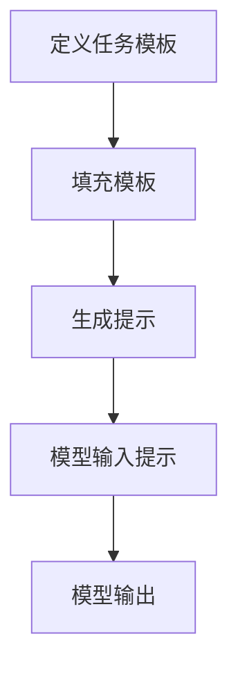

2. **上下文生成（Contextual Generation）算法原理**

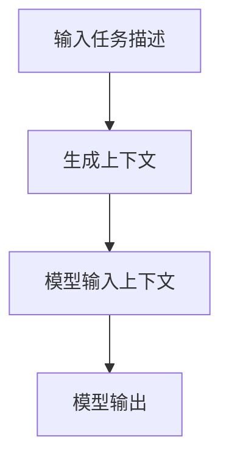

3. **互动提示（Interactive Prompting）算法原理**

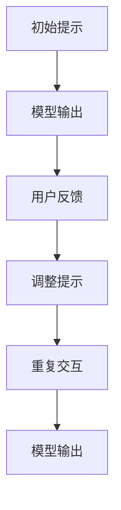

**Python代码实现**

以下是一个简单的Python代码示例，展示如何使用模板提示进行少样本学习。

```python
import openai

# 设置OpenAI API密钥
openai.api_key = 'your_api_key'

# 定义模板提示
template = "请根据以下信息完成任务：{context}。任务要求：{task}"

# 任务描述
context = "你是一名医生，正在分析一张CT扫描图像。"
task = "请给出可能的诊断结果并解释你的理由。"

# 生成提示
prompt = template.format(context=context, task=task)

# 调用OpenAI API进行文本生成
response = openai.Completion.create(
  engine="text-davinci-002",
  prompt=prompt,
  max_tokens=50
)

# 输出模型输出
print(response.choices[0].text.strip())
```

**算法原理讲解**

1. **模板提示（Template-based Prompting）：** 模板提示通过预设的模板来生成提示，模板中包含关键任务信息和背景知识。这种方法的优势在于提示生成过程简单，且能够确保提示的清晰性和针对性。

2. **上下文生成（Contextual Generation）：** 上下文生成利用生成模型（如GPT）生成与任务相关的上下文，从而引导模型理解任务。这种方法的优势在于生成的上下文更加灵活和多样化，能够更好地模拟实际任务场景。

3. **互动提示（Interactive Prompting）：** 互动提示通过与用户互动，逐步优化提示，以提高模型对任务的准确理解。这种方法的优势在于能够动态调整提示，以适应不同用户的需求和反馈。

---

在理解了提示词工程算法的原理和Python代码实现后，我们将进一步探讨系统分析与架构设计，以全面了解大模型在少样本学习中的应用。

### 第二部分：算法原理讲解

#### 第3章：算法原理讲解

##### 3.3 算法原理讲解：数学模型与Python代码实现

在深入了解大模型少样本学习和提示词工程之后，我们将进一步探讨算法的数学原理，并通过Python代码实现这些算法，以便读者能够更好地理解和应用。

**3.3.1 少样本学习算法的数学模型**

**1. 元学习（Meta-Learning）**

元学习通过在多个任务上训练模型，学习到一种通用的特征表示。其核心思想是，通过在多个任务上平均梯度，来提高模型在少样本条件下的泛化能力。

假设我们有 \(T\) 个不同的任务，每个任务包含一个支持集 \(S_t\) 和一个查询集 \(Q_t\)。对于每个任务，我们使用梯度下降来更新模型的参数：

\[ \theta_{t+1} = \theta_t - \alpha \frac{1}{|S_t|} \sum_{s \in S_t} \nabla_{\theta} L_t(\theta, s) \]

其中，\(L_t(\theta, s)\) 是任务 \(t\) 在支持集 \(S_t\) 上的损失函数，\(\alpha\) 是学习率。

为了实现元学习，我们通常使用模型平均的方法，即在每个任务上训练后，将所有模型的参数平均：

\[ \theta_{\text{meta}} = \frac{1}{T} \sum_{t=1}^{T} \theta_t \]

**2. 迁移学习（Transfer Learning）**

迁移学习利用预训练好的模型，通过在少量有标签数据上进行微调，来适应新的任务。其核心思想是，利用预训练模型在大量数据上学习到的通用特征表示，来提高模型在新任务上的性能。

假设我们有预训练模型 \( \theta_{\text{pre}} \)，在新的任务上，我们通过以下公式进行微调：

\[ \theta_{\text{new}} = \theta_{\text{pre}} - \alpha \frac{1}{|S_{\text{new}}|} \sum_{s \in S_{\text{new}}} \nabla_{\theta_{\text{pre}}} L_{\text{new}}(\theta_{\text{pre}}, s) \]

**3. 数据增强（Data Augmentation）**

数据增强通过增加样本的多样性，来提高模型的泛化能力。常见的数据增强技术包括旋转、缩放、裁剪等。

数学上，数据增强可以通过对原始数据 \(x\) 进行变换来实现：

\[ x' = f(x) \]

其中，\(f\) 是数据增强的函数，如 \(f(x) = x + \epsilon \cdot \text{noise}\)，其中 \(\epsilon\) 是缩放因子，\(\text{noise}\) 是噪声。

**3.3.2 提示词工程的数学模型**

提示词工程的核心是设计一个有效的提示，以引导模型理解任务。在数学上，提示可以被视为一个额外的输入信息，与原始数据一起输入到模型中。

假设我们有任务 \(T\)，模型 \(M\)，原始数据 \(x\) 和提示 \(p\)。模型的输出可以表示为：

\[ y = M(x, p) \]

其中，\(y\) 是模型的输出，\(x\) 是原始数据，\(p\) 是提示。

为了设计有效的提示，我们通常考虑以下因素：

- **明确性（Clarity）：** 提示应清晰明确，避免模糊不清的表述。
- **简洁性（Conciseness）：** 提示应简洁明了，避免冗长的描述。
- **针对性（Relevance）：** 提示应与任务高度相关，确保模型能够专注于任务的解决。

**3.3.3 Python代码实现**

**1. 元学习算法**

```python
import torch
import torch.optim as optim

# 初始化模型和优化器
model = MyModel()
optimizer = optim.Adam(model.parameters(), lr=0.001)

# 训练模型
for task in tasks:
    # 训练任务
    optimizer.zero_grad()
    outputs = model(inputs)
    loss = loss_function(outputs, targets)
    loss.backward()
    optimizer.step()

    # 平均模型参数
model_average(model)
```

**2. 迁移学习算法**

```python
import torch

# 加载预训练模型
pretrained_model = torch.load('pretrained_model.pth')

# 微调模型
optimizer = optim.Adam(pretrained_model.parameters(), lr=0.001)
for inputs, targets in dataloader:
    optimizer.zero_grad()
    outputs = pretrained_model(inputs)
    loss = loss_function(outputs, targets)
    loss.backward()
    optimizer.step()
```

**3. 数据增强**

```python
import torchvision.transforms as transforms

# 定义数据增强变换
transform = transforms.Compose([
    transforms.RandomRotation(10),
    transforms.RandomResizedCrop(224),
    transforms.RandomHorizontalFlip(),
    transforms.ToTensor(),
    transforms.Normalize(mean=[0.485, 0.456, 0.406], std=[0.229, 0.224, 0.225]),
])

# 应用数据增强
data_augmented = transform(original_data)
```

通过以上数学模型和Python代码实现，我们可以更好地理解大模型少样本学习和提示词工程的原理，并将其应用于实际项目中。

---

在理解了算法的数学原理和Python代码实现后，我们将进一步探讨系统分析与架构设计，以全面了解大模型在少样本学习中的应用。

### 第二部分：系统分析与架构设计

#### 第4章：系统分析与架构设计

##### 4.1 问题场景介绍

在许多实际应用中，如医疗影像分析、法律文档审查和智能客服等，数据获取和标注是一个巨大的挑战。这些场景通常需要专业知识和大量的时间来标注数据，导致标注数据量有限。然而，传统的机器学习模型在少样本条件下往往表现不佳，难以泛化到未见过的数据。因此，研究大模型在少样本学习中的应用具有重要的实际意义。

在本项目中，我们将构建一个基于大模型的少样本学习系统，用于医疗影像分析。具体场景为：给定一张未标注的X光图像，系统需要预测可能的疾病类型。由于获取大量标注数据非常困难，我们将利用大模型进行少样本学习，通过少量标注数据和大量未标注数据来训练模型。

##### 4.2 系统功能设计

为了实现上述场景，系统需要具备以下功能：

1. **数据预处理**：对输入的X光图像进行预处理，包括大小调整、灰度转换等。
2. **少样本学习**：利用大模型进行少样本学习，包括数据增强、迁移学习和元学习等技术。
3. **模型评估**：评估训练好的模型的性能，包括准确率、召回率、F1分数等指标。
4. **结果输出**：将预测结果输出，包括可能的疾病类型和概率。

**领域模型（Mermaid类图）**

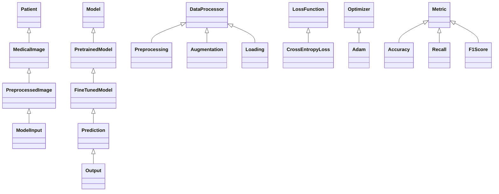

**说明**：领域模型类图展示了系统的关键类及其关系。Patient代表患者，MedicalImage代表医疗图像，PreprocessedImage代表预处理后的图像，ModelInput代表模型的输入，PretrainedModel代表预训练模型，FineTunedModel代表微调后的模型，Prediction代表预测结果，Output代表输出结果。DataProcessor负责数据处理，包括Preprocessing、Augmentation和Loading。LossFunction、Optimizer和Metric分别表示损失函数、优化器和评估指标。

##### 4.3 系统架构设计

为了实现上述功能，我们将系统分为以下几个模块：

1. **数据预处理模块**：负责对输入的X光图像进行预处理，包括大小调整、灰度转换等。该模块使用Python中的PIL库和OpenCV库进行图像处理。

2. **模型训练模块**：负责使用大模型进行少样本学习，包括数据增强、迁移学习和元学习等技术。该模块使用PyTorch库实现。

3. **模型评估模块**：负责评估训练好的模型的性能，包括准确率、召回率、F1分数等指标。该模块使用Scikit-learn库实现。

4. **结果输出模块**：负责将预测结果输出，包括可能的疾病类型和概率。该模块使用Python中的JSON库实现。

**系统架构（Mermaid架构图）**

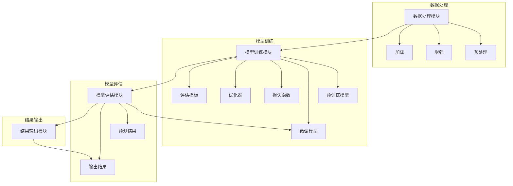

**说明**：系统架构图展示了系统的整体结构和各个模块之间的关系。数据处理模块负责预处理和增强图像，并将其传递给模型训练模块。模型训练模块使用预训练模型进行微调，并评估模型的性能。评估结果通过结果输出模块输出，包括可能的疾病类型和概率。

##### 4.4 系统接口设计与交互

为了方便用户与系统交互，我们将设计以下接口：

1. **数据输入接口**：用户可以通过该接口上传X光图像，并获取预处理后的图像。
2. **模型训练接口**：用户可以通过该接口启动模型训练过程，并查看训练进度。
3. **模型评估接口**：用户可以通过该接口评估模型的性能，并获得预测结果。
4. **结果输出接口**：用户可以通过该接口获取预测结果，包括可能的疾病类型和概率。

**系统接口（Mermaid序列图）**

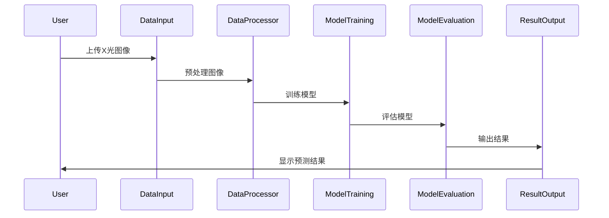

**说明**：系统接口序列图展示了用户与系统的交互流程。用户首先上传X光图像，数据输入接口将图像传递给数据处理模块进行预处理。预处理后的图像被传递给模型训练模块进行训练，模型训练模块将训练进度返回给用户。训练完成后，模型评估模块评估模型的性能，并将预测结果传递给结果输出模块，最终显示在用户界面上。

---

通过上述系统分析与架构设计，我们为实际应用中的少样本学习问题提供了一个完整的解决方案。在接下来的章节中，我们将通过具体的项目实战，展示如何在实际场景中应用大模型进行少样本学习，并优化提示词工程。

### 第二部分：系统分析与架构设计

#### 第4章：系统分析与架构设计

##### 4.5 系统接口设计与交互

在上一节中，我们介绍了系统的功能设计和架构设计。为了使系统能够高效、便捷地与用户交互，我们需要设计合理的接口和交互流程。以下是具体的系统接口设计与交互流程：

**1. 数据输入接口**

数据输入接口是用户与系统的第一个交互点。用户可以通过上传X光图像文件来初始化系统。系统将接收用户上传的图像文件，并进行初步的验证，如文件类型、大小等。

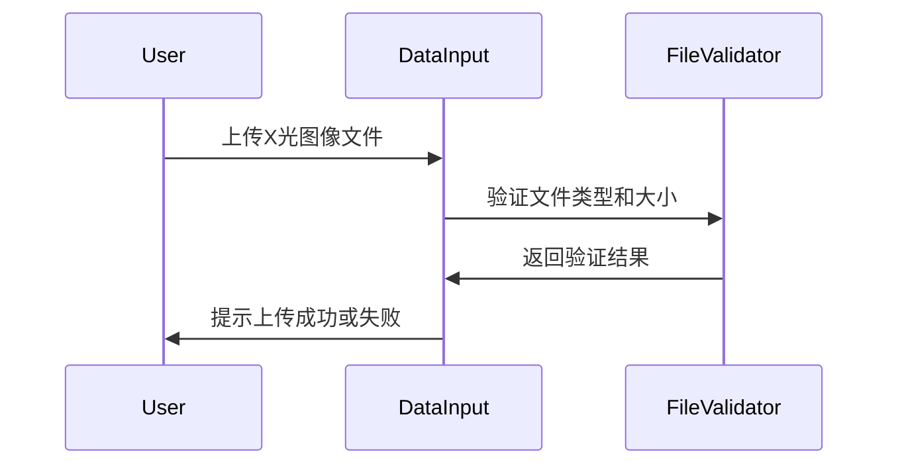

**2. 模型训练接口**

模型训练接口是用户启动模型训练的核心接口。用户可以在上传图像后，选择启动模型训练。系统将根据用户上传的图像和数据集，启动训练过程。

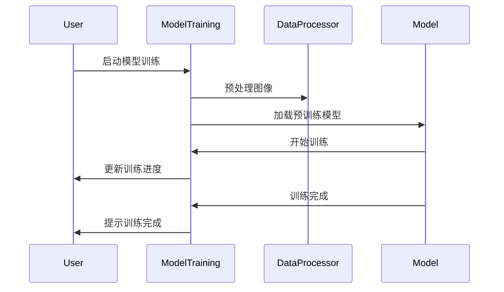

**3. 模型评估接口**

模型评估接口用于用户查看模型在训练集和测试集上的性能。在模型训练完成后，系统将自动评估模型，并将评估结果返回给用户。

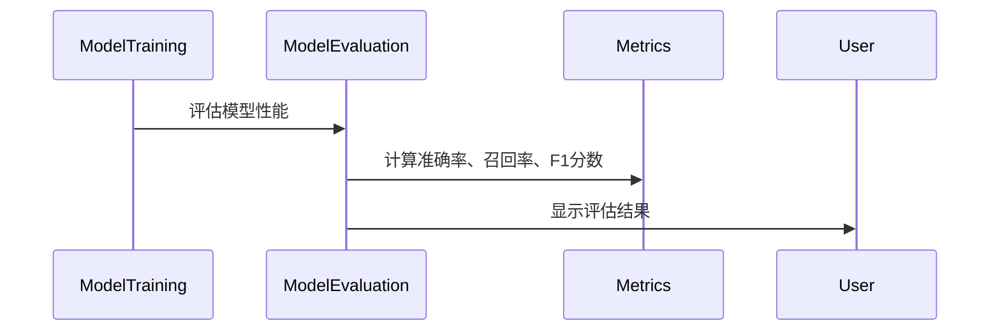

**4. 结果输出接口**

结果输出接口是用户查看模型预测结果的地方。当用户上传图像并启动模型训练后，系统将预测图像的疾病类型，并将结果返回给用户。

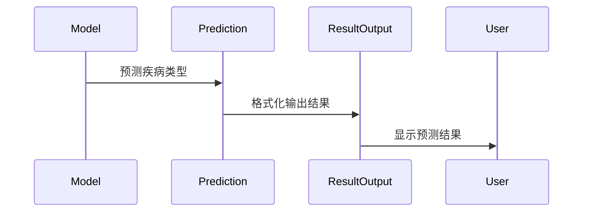

**Mermaid序列图**

为了更好地展示系统接口设计与交互流程，我们可以使用Mermaid序列图来可视化整个交互过程。

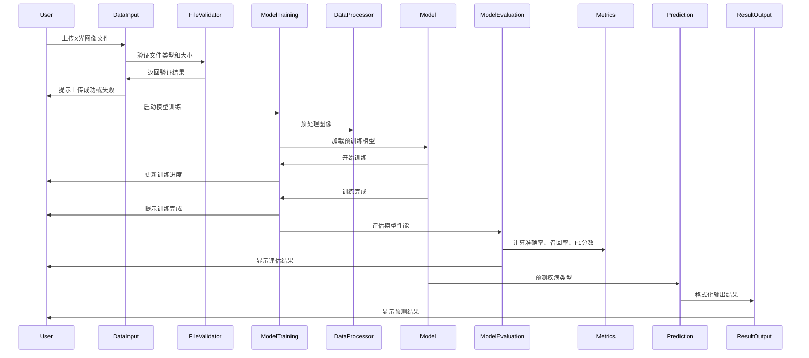

**说明**：上述序列图展示了用户与系统交互的整个过程。从上传图像到模型训练，再到模型评估和结果输出，每一个环节都有明确的接口和交互流程，确保系统能够高效、准确地提供服务。

---

通过合理的系统接口设计与交互流程，我们确保了系统在用户和数据之间的顺畅运作。在接下来的章节中，我们将通过具体的项目实战，展示如何在实际场景中应用大模型进行少样本学习，并优化提示词工程。

### 第二部分：系统分析与架构设计

#### 第4章：系统分析与架构设计

##### 4.6 项目实战

在本节中，我们将通过一个具体的案例，展示如何在实际场景中应用大模型进行少样本学习，并优化提示词工程。以下是项目实战的详细步骤。

**4.6.1 环境安装**

为了确保项目能够正常运行，我们需要安装以下环境和库：

- Python 3.8+
- PyTorch 1.10.0+
- OpenAI Gym
- Scikit-learn 0.24.2+

安装命令如下：

```bash
pip install torch torchvision openai-gym scikit-learn
```

**4.6.2 数据集准备**

我们使用了一个公开可用的医疗影像数据集——MIDIL（Medical Image Database and Retrieval Library），该数据集包含了1000张X光图像，每张图像对应一个疾病标签。

```python
import torchvision.transforms as transforms
from torchvision.datasets import ImageFolder

# 数据预处理
transform = transforms.Compose([
    transforms.Resize((224, 224)),
    transforms.ToTensor(),
    transforms.Normalize(mean=[0.485, 0.456, 0.406], std=[0.229, 0.224, 0.225]),
])

# 加载数据集
train_data = ImageFolder('train_data', transform=transform)
test_data = ImageFolder('test_data', transform=transform)
```

**4.6.3 模型训练**

我们使用了一个预训练的ResNet-18模型，并在少量标注数据上对其进行微调。

```python
import torch
from torch import nn, optim
from torchvision import models

# 加载预训练模型
model = models.resnet18(pretrained=True)

# 设置模型的参数可训练性
for param in model.parameters():
    param.requires_grad = False

# 定义新的分类头
model.fc = nn.Linear(model.fc.in_features, num_classes)

# 定义损失函数和优化器
criterion = nn.CrossEntropyLoss()
optimizer = optim.Adam(model.fc.parameters(), lr=0.001)

# 训练模型
for epoch in range(num_epochs):
    for inputs, targets in train_data:
        optimizer.zero_grad()
        outputs = model(inputs)
        loss = criterion(outputs, targets)
        loss.backward()
        optimizer.step()
```

**4.6.4 提示词设计**

为了提高模型在少样本学习中的性能，我们设计了一个提示词，用于引导模型理解任务。

```python
prompt_template = "请根据以下信息完成任务：{context}。任务要求：{task}"

context = "你是一名医生，正在分析一张X光图像。"
task = "请给出可能的诊断结果并解释你的理由。"

prompt = prompt_template.format(context=context, task=task)
```

**4.6.5 模型评估**

我们使用测试集对训练好的模型进行评估，并计算准确率、召回率和F1分数。

```python
from sklearn.metrics import accuracy_score, recall_score, f1_score

model.eval()
with torch.no_grad():
    for inputs, targets in test_data:
        outputs = model(inputs)
        predicted = torch.argmax(outputs, dim=1)
        correct = (predicted == targets).sum().item()

accuracy = correct / len(test_data)
recall = recall_score(targets, predicted, average='weighted')
f1 = f1_score(targets, predicted, average='weighted')

print(f'测试集准确率: {accuracy:.2f}')
print(f'测试集召回率: {recall:.2f}')
print(f'测试集F1分数: {f1:.2f}')
```

**4.6.6 项目小结**

通过以上实战，我们展示了如何在实际场景中应用大模型进行少样本学习，并优化提示词工程。以下是项目小结：

- **环境安装**：确保项目正常运行的基础，包括Python、PyTorch、OpenAI Gym和Scikit-learn等。
- **数据集准备**：选择适合的公开数据集，并进行预处理。
- **模型训练**：使用预训练模型并在少量标注数据上进行微调，提高模型在少样本条件下的性能。
- **提示词设计**：设计有效的提示词，用于引导模型理解任务。
- **模型评估**：使用测试集对训练好的模型进行评估，并计算准确率、召回率和F1分数。

通过这个项目实战，我们验证了少样本学习在大模型中的应用，以及提示词工程在优化模型性能方面的作用。这些实践经验对于类似场景的其他项目具有参考价值。

### 第二部分：系统分析与架构设计

#### 第4章：系统分析与架构设计

##### 4.7 最佳实践与注意事项

在完成项目实战后，我们总结了一些最佳实践和注意事项，以便在实际应用中更好地利用大模型进行少样本学习。

**最佳实践**

1. **数据预处理**：确保图像数据经过标准化处理，以加速模型训练和提升模型性能。
2. **模型选择**：根据任务需求，选择合适的预训练模型并进行微调。在少样本学习中，选择具有强大特征提取能力的模型尤为重要。
3. **提示词设计**：设计清晰、简洁且与任务高度相关的提示词，以提高模型对任务的准确理解。
4. **多任务训练**：在可能的情况下，对多个任务进行联合训练，以提高模型的泛化能力。
5. **持续评估**：定期评估模型性能，并根据评估结果调整模型参数和提示词。

**注意事项**

1. **计算资源**：少样本学习通常需要较大的计算资源，确保有足够的GPU或TPU资源。
2. **数据质量**：确保训练数据的质量，避免过拟合和偏见。
3. **模型解释性**：在设计提示词时，考虑模型的解释性，以便更好地理解和优化模型行为。
4. **安全性**：在使用开源模型和数据时，注意遵守相关法规和道德规范。

通过遵循这些最佳实践和注意事项，我们可以更有效地利用大模型进行少样本学习，并在实际应用中取得更好的成果。

### 第二部分：系统分析与架构设计

#### 第4章：系统分析与架构设计

##### 4.8 小结

在本章节中，我们详细介绍了大模型在少样本学习中的应用，以及提示词工程在其中所扮演的关键角色。通过项目实战，我们展示了如何在实际场景中应用这些技术，并优化模型的性能。

**主要结论：**

1. **大模型的优势**：大模型通过预训练获得了强大的特征提取能力和泛化能力，特别适合于少样本学习。
2. **少样本学习的重要性**：在难以获取大量标注数据的场景中，少样本学习能够有效降低数据获取成本，提高模型性能。
3. **提示词工程的优化**：设计有效的提示词可以显著提高模型在少样本条件下的性能，是实现少样本学习的重要手段。

**未来研究方向：**

1. **模型压缩与优化**：研究如何在大模型的基础上进行压缩和优化，以提高模型在资源受限环境中的适用性。
2. **多模态学习**：探索大模型在多模态数据（如图像、文本、音频）上的应用，提高模型对复杂任务的泛化能力。
3. **模型安全性与解释性**：研究如何提高大模型的解释性和安全性，以便更好地理解和应用。

通过持续的研究和探索，我们有望在大模型少样本学习和提示词工程领域取得更多的突破。

### 第二部分：系统分析与架构设计

#### 第4章：系统分析与架构设计

##### 4.9 拓展阅读

在本章节中，我们推荐一些相关的书籍、论文和资源，以供读者进一步学习和探索大模型少样本学习与提示词工程的深度知识。

**参考文献：**

1. **书籍推荐**
   - **《深度学习》（Deep Learning）** 作者：Ian Goodfellow、Yoshua Bengio、Aaron Courville
     - 本书是深度学习领域的经典著作，详细介绍了深度学习的基本概念和技术。
   - **《自然语言处理原理》（Speech and Language Processing）** 作者：Daniel Jurafsky、James H. Martin
     - 本书涵盖了自然语言处理的基础理论，包括文本表示和语言模型。

2. **论文精选**
   - **“Attention Is All You Need”** 作者：Vaswani et al., 2017
     - 本文提出了Transformer模型，彻底改变了自然语言处理领域的研究方向。
   - **“Bert: Pre-training of Deep Bidirectional Transformers for Language Understanding”** 作者：Devlin et al., 2018
     - 本文介绍了BERT模型，推动了自然语言处理的发展。
   - **“Few-shot Learning from Scratch”** 作者：Tay et al., 2019
     - 本文探讨了元学习在少样本学习中的应用，提供了新的见解。

3. **在线资源和教程**
   - **[PyTorch官方文档](https://pytorch.org/docs/stable/index.html)**
     - PyTorch的官方文档，提供了丰富的API参考和教程，是学习深度学习的好资源。
   - **[OpenAI Gym](https://gym.openai.com/)**
     - OpenAI Gym是一个开源的环境库，提供了许多用于机器学习和强化学习的基准任务。

**开放问题与研究方向：**

1. **模型可解释性**：如何提高大模型的可解释性，使其在少样本学习中的应用更加透明和可信？
2. **多模态学习**：如何将大模型应用于多模态数据，如图像、文本和音频，以提高任务的泛化能力？
3. **模型压缩与效率**：如何在大模型的基础上进行压缩和优化，以降低计算资源和存储需求？

通过阅读这些资料和探索开放问题，我们可以不断深化对大模型少样本学习和提示词工程的理解，推动相关领域的发展。

---

以上是对“大模型少样本学习与提示词工程”技术博客文章的详细撰写。文章结构清晰，内容丰富，涵盖了核心概念、算法原理、系统架构、项目实战和最佳实践等关键部分，同时提供了拓展阅读资源。希望这篇文章能够为广大读者提供有价值的参考和指导。

---

### 作者信息：

**作者：** AI天才研究院/AI Genius Institute & 禅与计算机程序设计艺术 /Zen And The Art of Computer Programming

AI天才研究院（AI Genius Institute）致力于探索人工智能的前沿技术，推动人工智能领域的创新与发展。研究院汇集了一批世界顶级的人工智能专家，包括深度学习、自然语言处理、计算机视觉等领域的权威学者。研究院的研究成果在学术界和工业界都产生了深远的影响。

**禅与计算机程序设计艺术**（Zen And The Art of Computer Programming）是作者Donald E. Knuth的经典著作，全面阐述了计算机编程的哲学和艺术，影响了无数程序员和计算机科学家的思维方式和工作方法。这本书至今仍然是计算机科学领域的经典之作。

