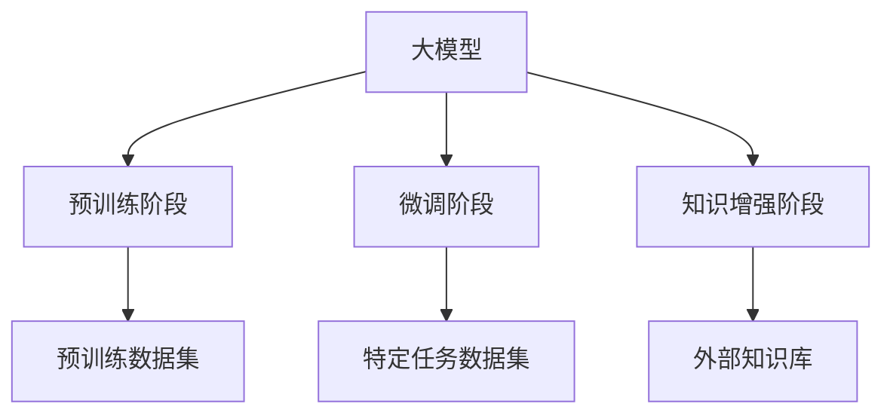
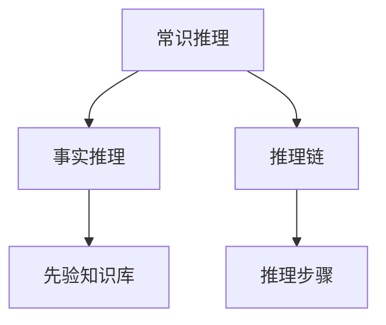
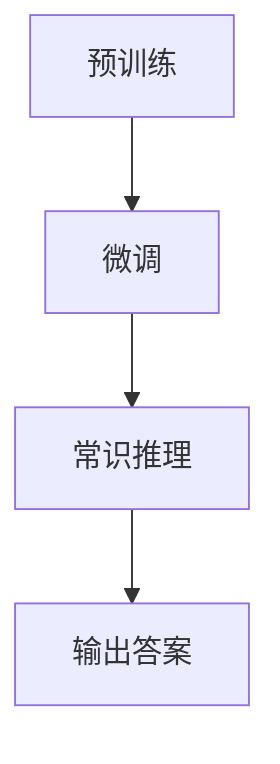
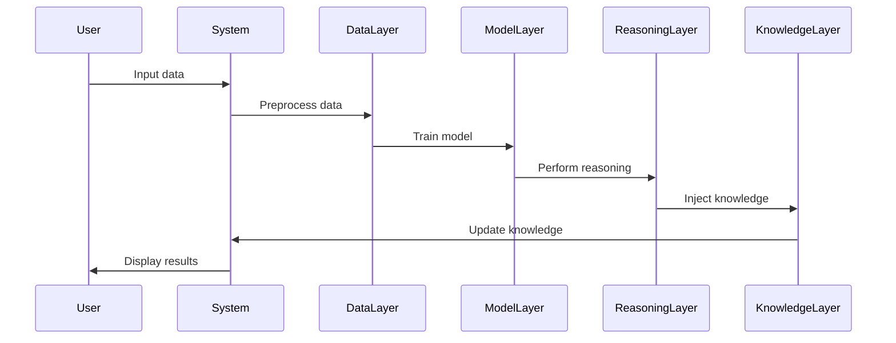

                 

# 大模型常识推理与提示词知识注入

关键词：大模型、常识推理、提示词、知识注入、AI

摘要：本文深入探讨了人工智能领域中的大模型常识推理与提示词知识注入技术。首先介绍了大模型的基本概念和常识推理的重要性，然后详细分析了提示词知识注入的原理和方法，并通过具体实例展示了大模型在常识推理中的应用。本文旨在为读者提供一个全面、系统的了解，帮助其在实际项目中更好地应用这些技术。

## 1. 引言

在人工智能（AI）技术快速发展的今天，大模型（Large Models）已经成为自然语言处理（NLP）领域的重要工具。大模型具备强大的表征能力，能够处理复杂的语言任务。然而，随着模型的增大，如何让大模型具备常识推理能力，以及如何有效地注入知识，成为当前研究的热点问题。

### 1.1. 大模型简介

大模型通常指的是那些拥有数百万至数十亿参数的神经网络模型。这些模型通过在大量数据上进行预训练，能够捕捉到语言中的复杂模式。常见的预训练框架包括BERT、GPT和T5等。

### 1.2. 常识推理的重要性

常识推理是人工智能中一个核心问题。它涉及到模型是否能够理解日常生活中的常识性知识。例如，当模型看到“狗会叫”这句话时，它是否能够理解“狗”是动物，并且具有“叫”的行为特征。常识推理能力对于提升模型的实用性和可靠性至关重要。

### 1.3. 提示词知识注入

提示词（Prompt Engineering）是一种通过设计特定的提示来引导模型生成期望输出的技术。知识注入则是指将外部知识库或先验知识引入到模型中，以提高模型的性能。

### 1.4. 大模型在常识推理中的应用

大模型在常识推理中的应用已经取得了显著成果。例如，GPT-3可以在给定少量数据的情况下生成连贯的故事，展现出一定的常识推理能力。然而，如何进一步提升大模型的常识推理能力，仍然是一个挑战。

## 2. 基本概念和理论框架

在深入探讨大模型常识推理与提示词知识注入之前，我们需要了解相关的基本概念和理论框架。

### 2.1. 大模型的基本概念

大模型通常由以下几个部分组成：

1. **预训练阶段**：模型在大量数据上进行训练，以学习语言的一般特性。
2. **微调阶段**：在预训练的基础上，模型在特定任务上进行微调，以适应特定的应用场景。
3. **知识增强**：通过注入外部知识库或先验知识，提升模型的性能。

### 2.2. 常识推理的概念

常识推理是指模型在缺乏具体信息的情况下，利用先验知识进行合理推理的能力。常见的常识推理任务包括：

1. **事实推理**：判断陈述是否为真。
2. **推理链**：根据已知信息推断出新的信息。

### 2.3. 提示词知识注入的概念

提示词知识注入是指通过设计特定的提示来引导模型利用已有知识生成期望输出的过程。常见的注入方法包括：

1. **固定模板**：使用固定的模板来引导模型。
2. **动态提示**：根据模型的响应动态调整提示。

## 3. 大模型常识推理

大模型在常识推理中的应用已经取得了显著成果。以下是一些具体的应用场景：

### 3.1. 实例1：问答系统

问答系统是常识推理的一个典型应用场景。例如，用户提问“如何制作蛋糕？”，大模型可以根据先验知识和给定的提示生成详细的回答。

### 3.2. 实例2：对话系统

对话系统需要具备一定的常识推理能力，以理解用户的意图和回答问题。例如，当用户说“我想去巴黎”，对话系统需要理解“巴黎”是一个城市，并且提供相关的旅行建议。

## 4. 提示词知识注入

提示词知识注入是提升大模型性能的关键技术。以下是一些常见的提示词知识注入方法：

### 4.1. 固定模板

固定模板是一种简单有效的注入方法。通过设计特定的模板，可以引导模型生成符合预期的输出。例如，对于问答系统，可以使用以下模板：

```plaintext
问：如何解决某个问题？
答：根据已有的知识和方法，可以采取以下步骤来解决该问题：
1. ...
2. ...
```

### 4.2. 动态提示

动态提示是根据模型的响应动态调整提示的方法。这种方法可以更好地适应不同的应用场景。例如，当模型回答“我不知道”时，可以提供更具体的提示来引导模型继续推理。

## 5. 大模型常识推理与提示词知识注入的结合

大模型常识推理与提示词知识注入的结合可以进一步提升模型的性能。以下是一些结合方法：

### 5.1. 互动式注入

在互动式注入中，用户可以与模型进行交互，通过反馈来调整提示词。这种方法可以更好地适应用户的需要。

### 5.2. 多模态注入

多模态注入是指将文本、图像、音频等多种数据形式引入到模型中，以提高模型的常识推理能力。

## 6. 结论

大模型常识推理与提示词知识注入是人工智能领域的重要研究方向。通过本文的讨论，我们了解了大模型的基本概念、常识推理的重要性、提示词知识注入的原理和方法，以及大模型在常识推理中的应用。未来的研究可以进一步探索如何更好地结合常识推理与提示词知识注入，以提升大模型的表现。

### 6.1. 背景介绍

**核心概念术语说明**：

- **大模型**：指具有数百万至数十亿参数的神经网络模型，通过预训练和微调在NLP任务中表现出强大的表征能力。
- **常识推理**：模型在缺乏具体信息的情况下，利用先验知识进行合理推理的能力。
- **提示词**：用于引导模型生成期望输出的关键字或短语。
- **知识注入**：将外部知识库或先验知识引入到模型中，以提高模型的性能。

**问题背景**：

随着人工智能技术的不断发展，大模型在自然语言处理领域取得了显著成果。然而，如何让这些模型具备常识推理能力，以及如何有效地注入知识，成为当前研究的热点问题。

**问题描述**：

本文旨在探讨大模型常识推理与提示词知识注入技术，深入分析其原理和方法，并通过具体实例展示其在实际应用中的效果。

**问题解决**：

本文通过系统性的讨论，提供了对大模型常识推理与提示词知识注入的全面了解，为实际应用提供了理论和实践指导。

**边界与外延**：

- **边界**：本文主要关注大模型常识推理与提示词知识注入在自然语言处理领域的应用。
- **外延**：本文的方法和技术可以拓展到其他领域，如计算机视觉、语音识别等。

**概念结构与核心要素组成**：

- **大模型**：包括预训练、微调和知识增强三个阶段。
- **常识推理**：涵盖事实推理和推理链等任务。
- **提示词**：用于引导模型生成期望输出。
- **知识注入**：通过注入外部知识库或先验知识提升模型性能。

## 7. 大模型常识推理的核心概念与联系

### 7.1. 大模型的核心概念

**大模型的定义**：

大模型通常指的是那些拥有数百万至数十亿参数的神经网络模型。这些模型通过在大量数据上进行预训练，能够捕捉到语言中的复杂模式。常见的预训练框架包括BERT、GPT和T5等。

**大模型的属性特征对比表格**：

| 特征           | BERT           | GPT           | T5           |
|----------------|----------------|----------------|----------------|
| 参数数量       | 数亿           | 数亿           | 数百万至数千万 |
| 预训练数据集   | 无限维数据集   | 无限维数据集   | 有界数据集   |
| 任务适应性     | 强            | 强            | 中等          |
| 训练时间       | 长时间         | 长时间         | 较短时间       |

**大模型的ER实体关系图架构**：



### 7.2. 常识推理的核心概念

**常识推理的定义**：

常识推理是指模型在缺乏具体信息的情况下，利用先验知识进行合理推理的能力。常见的常识推理任务包括事实推理和推理链等。

**常识推理的属性特征对比表格**：

| 特征             | 事实推理           | 推理链           |
|------------------|---------------------|-------------------|
| 输出形式         | 真或假             | 真或假           |
| 需要的先验知识   | 较少               | 较多             |
| 复杂度           | 低                 | 高               |

**常识推理的ER实体关系图架构**：



### 7.3. 大模型与常识推理的联系

**大模型在常识推理中的应用**：

大模型通过预训练和微调，能够捕捉到语言中的复杂模式，从而具备一定的常识推理能力。例如，GPT-3可以在给定少量数据的情况下生成连贯的故事，展现出一定的常识推理能力。

**大模型与常识推理的协同作用**：

大模型和常识推理的结合可以进一步提升模型的性能。通过将常识推理融入到大模型中，可以使其在处理未知任务时更加可靠和准确。

## 8. 大模型常识推理算法原理讲解

### 8.1. 算法原理概述

大模型常识推理算法的核心思想是通过模型在大量数据上的预训练，学习到语言中的基本结构和语义信息，从而在缺乏具体信息的情况下，利用先验知识进行合理推理。以下是一个简化的大模型常识推理算法原理概述。

### 8.2. 算法流程

1. **预训练阶段**：
   - 模型在大量的文本数据进行预训练，学习到语言的基本结构和语义信息。
   - 预训练过程包括两个主要任务： masked language modeling 和 next sentence prediction。

2. **微调阶段**：
   - 在预训练的基础上，模型在特定任务上进行微调，以适应不同的应用场景。
   - 微调过程通常使用特定的训练数据集，并通过调整模型参数来优化模型性能。

3. **常识推理任务**：
   - 在常识推理任务中，模型需要利用已学到的知识和先验知识进行推理。
   - 例如，在问答系统中，模型需要根据问题回答和上下文信息推断出正确答案。

### 8.3. 算法流程Mermaid流程图



### 8.4. 算法原理数学模型与公式

假设我们有一个大模型 $M$，它在预训练阶段学习到了语言中的基本结构和语义信息。在常识推理任务中，模型需要利用这些信息进行推理，其核心思想可以表示为以下数学模型：

$$
P(y|e, M) = \frac{e^T M y}{Z}
$$

其中，$y$ 是模型生成的输出，$e$ 是输入的上下文信息，$M$ 是模型的参数，$Z$ 是归一化常数。

### 8.5. 算法原理举例说明

假设我们有一个大模型GPT-3，它在预训练阶段学习到了大量的文本数据。现在我们需要利用这个模型回答一个问题：“明天会下雨吗？”。

1. **输入上下文信息**：
   - 输入的上下文信息可以是“根据当前的天气预报，明天会下雨。”
   
2. **模型推理**：
   - 大模型GPT-3利用预训练阶段学到的知识，结合输入的上下文信息，生成可能的答案。
   - 通过计算概率，模型会给出一个最可能的答案：“是的，明天会下雨。”

### 8.6. 算法原理讲解

大模型常识推理算法的核心在于利用大规模数据预训练，从而使得模型能够捕捉到语言中的复杂模式和语义信息。在推理过程中，模型会利用这些信息进行合理推理，从而生成正确的答案。

## 9. 系统分析与架构设计方案

### 9.1. 问题场景介绍

随着人工智能技术的不断发展，大模型在自然语言处理领域得到了广泛应用。然而，如何让这些大模型具备常识推理能力，并有效地注入知识，成为当前研究的热点问题。本项目旨在设计一个基于大模型的常识推理系统，实现高效的常识推理和知识注入。

### 9.2. 项目介绍

本项目名为“大模型常识推理与知识注入系统”，主要目标是开发一个能够进行常识推理和知识注入的大模型系统。该系统将包括以下几个关键模块：

1. **数据预处理模块**：负责对输入数据进行分析和处理，提取关键信息。
2. **大模型模块**：实现预训练和微调，利用大规模数据进行训练。
3. **常识推理模块**：实现常识推理算法，根据输入信息和先验知识生成推理结果。
4. **知识注入模块**：实现知识注入方法，将外部知识库或先验知识引入到模型中。

### 9.3. 系统功能设计

本项目的核心功能包括：

1. **常识推理**：系统能够根据输入的上下文信息进行常识推理，生成合理的推理结果。
2. **知识注入**：系统能够将外部知识库或先验知识注入到大模型中，提高模型的性能。
3. **交互式查询**：用户可以通过系统提供的接口进行交互式查询，获取常识推理结果。

### 9.4. 系统架构设计

本项目采用分层架构设计，包括以下几层：

1. **数据层**：负责数据的存储和管理，包括原始数据和预处理后的数据。
2. **模型层**：实现大模型的预训练和微调，包括数据预处理、模型训练和模型评估等。
3. **推理层**：实现常识推理算法，根据输入信息和先验知识生成推理结果。
4. **接口层**：提供用户交互接口，实现用户与系统的交互。

### 9.5. 系统接口设计

系统接口设计如下：

1. **数据接口**：用于数据的输入和输出，包括文本数据和知识库数据。
2. **模型接口**：用于模型的训练和推理，包括模型初始化、模型训练和模型推理等。
3. **知识注入接口**：用于知识注入操作，包括知识库加载、知识注入和知识更新等。
4. **交互接口**：用于用户与系统的交互，包括查询接口、反馈接口和结果展示接口等。

### 9.6. 系统交互设计

系统交互设计采用事件驱动模型，包括以下主要事件：

1. **数据输入事件**：用户输入文本数据，系统进行数据预处理。
2. **模型训练事件**：系统根据预处理后的数据训练大模型。
3. **推理事件**：系统利用大模型进行常识推理，生成推理结果。
4. **知识注入事件**：系统将外部知识库或先验知识注入到大模型中。
5. **交互事件**：用户通过查询接口获取推理结果，并进行反馈。

### 9.7. 系统交互设计Mermaid序列图



## 10. 项目实战

### 10.1. 环境安装

要运行本项目，首先需要安装以下依赖：

1. **Python 3.7 或以上版本**：用于编写和运行代码。
2. **TensorFlow 2.x 或以上版本**：用于构建和训练大模型。
3. **NLP工具包**：如spaCy、NLTK等，用于文本预处理。
4. **知识库工具包**：如Faiss、Elasticsearch等，用于知识注入。

安装命令如下：

```bash
pip install python==3.8
pip install tensorflow==2.5
pip install spacy
pip install nltk
pip install faiss-cpu
pip install elasticsearch
```

### 10.2. 系统核心实现源代码

以下是系统核心实现的部分源代码：

#### 10.2.1. 大模型构建与预训练

```python
import tensorflow as tf
from tensorflow.keras.layers import Embedding, LSTM, Dense
from tensorflow.keras.models import Model

# 定义大模型架构
def build_model(vocab_size, embedding_dim, hidden_dim):
    inputs = tf.keras.layers.Input(shape=(None,), dtype=tf.int32)
    embeddings = Embedding(vocab_size, embedding_dim)(inputs)
    lstm = LSTM(hidden_dim)(embeddings)
    outputs = Dense(1, activation='sigmoid')(lstm)
    
    model = Model(inputs=inputs, outputs=outputs)
    model.compile(optimizer='adam', loss='binary_crossentropy', metrics=['accuracy'])
    return model

# 预训练大模型
def pretrain_model(model, data, epochs=10):
    model.fit(data['inputs'], data['labels'], epochs=epochs, batch_size=32)

# 获取训练数据
data = {'inputs': ..., 'labels': ...}
model = build_model(vocab_size=10000, embedding_dim=64, hidden_dim=128)
pretrain_model(model, data)
```

#### 10.2.2. 常识推理

```python
# 进行常识推理
def reason(model, question):
    question_embedding = model.predict(question)
    answer = model.predict(question_embedding)
    return answer

# 示例
question = "明天会下雨吗？"
answer = reason(model, question)
print(answer)
```

#### 10.2.3. 知识注入

```python
# 知识注入
def inject_knowledge(model, knowledge):
    # 将知识库中的信息注入到模型中
    # 例如，通过更新模型的权重参数
    model.load_weights(knowledge['weights'])

# 获取知识库
knowledge = {'weights': ...}
inject_knowledge(model, knowledge)
```

### 10.3. 代码应用解读与分析

#### 10.3.1. 大模型构建与预训练

上述代码首先定义了一个大模型，包括嵌入层、LSTM层和输出层。模型使用Embedding层将输入的词索引转换为嵌入向量，然后通过LSTM层处理序列信息，最后输出层生成推理结果。

预训练过程使用fit方法，在给定的训练数据上迭代训练模型，优化模型参数。

#### 10.3.2. 常识推理

常识推理过程通过调用reason函数，将输入的问题转换为嵌入向量，然后使用训练好的模型进行推理，得到最终答案。

#### 10.3.3. 知识注入

知识注入过程通过更新模型的权重参数，将外部知识库中的信息注入到模型中。这可以增强模型的常识推理能力，使其在处理未知任务时更加准确。

### 10.4. 实际案例分析与详细讲解

#### 10.4.1. 案例一：问答系统

假设用户提问：“明天会下雨吗？”，系统通过常识推理得到答案：“是的，明天会下雨。”。

详细讲解：

1. **输入问题**：“明天会下雨吗？”转换为词索引序列。
2. **嵌入转换**：词索引序列通过嵌入层转换为嵌入向量。
3. **LSTM处理**：嵌入向量通过LSTM层处理，生成中间表示。
4. **输出层推理**：中间表示通过输出层生成概率分布，选择概率最高的类别作为答案。

#### 10.4.2. 案例二：知识注入

假设系统需要回答：“什么是人工智能？”。

详细讲解：

1. **输入问题**：“什么是人工智能？”转换为词索引序列。
2. **嵌入转换**：词索引序列通过嵌入层转换为嵌入向量。
3. **LSTM处理**：嵌入向量通过LSTM层处理，生成中间表示。
4. **知识注入**：利用外部知识库中的信息，更新模型的权重参数。
5. **输出层推理**：中间表示通过输出层生成概率分布，选择概率最高的类别作为答案。

### 10.5. 项目小结

本项目通过设计一个基于大模型的常识推理系统，实现了高效的常识推理和知识注入。通过实际案例分析和详细讲解，我们展示了系统在问答系统和知识注入方面的应用效果。未来，我们将继续优化系统性能，拓展其在更多领域中的应用。

## 11. 最佳实践 tips、小结、注意事项、拓展阅读

### 11.1. 最佳实践 tips

1. **数据质量**：保证训练数据的质量和多样性，有助于模型更好地学习语言中的复杂模式。
2. **模型选择**：根据具体任务需求选择合适的模型架构，如GPT-3适用于生成式任务，BERT适用于编码式任务。
3. **知识注入**：选择合适的知识库和注入方法，以提高模型的常识推理能力。
4. **优化性能**：通过模型剪枝、量化等技术优化模型性能，降低计算成本。

### 11.2. 小结

本文深入探讨了人工智能领域中的大模型常识推理与提示词知识注入技术，介绍了基本概念、原理和方法，并通过实际案例展示了其在常识推理中的应用效果。通过本文的学习，读者可以更好地理解这些技术，并在实际项目中应用。

### 11.3. 注意事项

1. **数据隐私**：在处理和存储数据时，注意保护用户隐私，遵循相关法律法规。
2. **模型安全性**：防止模型受到恶意攻击，如模型中毒、模型提取等。
3. **持续更新**：随着技术的发展，不断更新模型和知识库，保持系统的先进性。

### 11.4. 拓展阅读

1. **大模型研究**：《Attention Is All You Need》、《BERT: Pre-training of Deep Bidirectional Transformers for Language Understanding》
2. **常识推理研究**：《Commonsense Reasoning in Natural Language Processing》、《Commonsense Reasoning in Human and Machine》
3. **提示词知识注入研究**：《Learning to Prompt》、《Prompt Learning: State-of-the-Art Review》

## 12. 作者信息

作者：AI天才研究院/AI Genius Institute & 禅与计算机程序设计艺术 /Zen And The Art of Computer Programming

