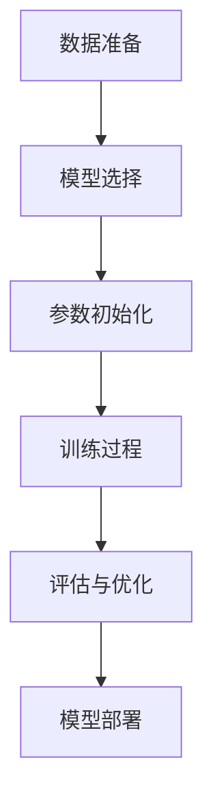
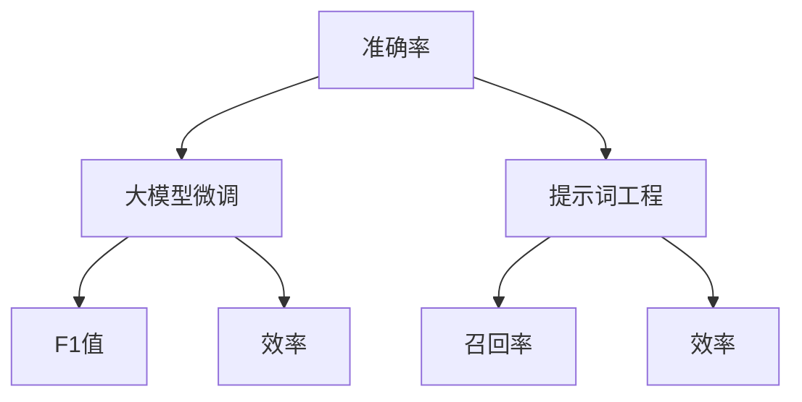
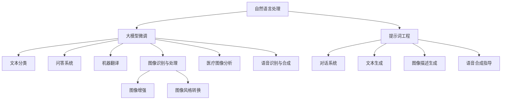
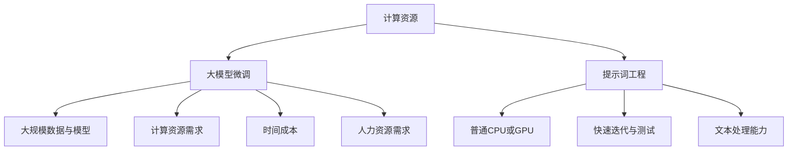
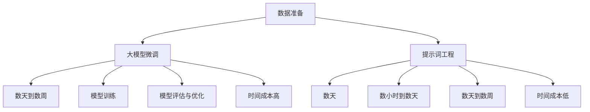

                 

### 文章标题

# 大模型微调vs提示词工程：权衡与选择

## 关键词

- 大模型微调
- 提示词工程
- 性能对比
- 应用场景
- 成本对比
- 时间成本
- 实际案例分析
- 最佳实践

## 摘要

本文深入探讨了人工智能领域中的两大技术——大模型微调和提示词工程。首先，通过对大模型微调的背景和原理进行详细阐述，解析其在数据处理和模型优化方面的优势。接着，我们分析了提示词工程的概念、作用及其核心要素。随后，文章对比了这两种技术在性能、应用场景、成本以及时间成本等方面的异同。在此基础上，本文通过权衡和选择策略，帮助读者在具体项目中选择合适的技术路径。随后，通过实际案例分析，进一步验证了文章观点。最后，本文总结了最佳实践，并提供了拓展阅读建议，为读者在实际应用中提供参考。

### 目录大纲

1. **问题背景与概述**
    - 1.1 **问题背景**
    - 1.2 **问题定义**
    - 1.3 **问题解决**
    - 1.4 **边界与外延**
    - 1.5 **概念结构与核心要素组成**
2. **大模型微调技术基础**
    - 2.1 **大模型微调的定义**
    - 2.2 **大模型微调的基本原理**
    - 2.3 **大模型微调的步骤**
3. **提示词工程概述**
    - 3.1 **提示词工程的定义**
    - 3.2 **提示词工程的作用**
    - 3.3 **提示词工程的核心要素**
4. **大模型微调与提示词工程的对比分析**
    - 4.1 **性能对比**
    - 4.2 **应用场景对比**
    - 4.3 **成本对比**
    - 4.4 **时间成本对比**
5. **权衡与选择**
    - 5.1 **目标与需求分析**
    - 5.2 **选择策略与方案设计**
    - 5.3 **实施与评估**
6. **实际案例分析**
    - 6.1 **案例背景**
    - 6.2 **案例分析**
    - 6.3 **案例总结**
7. **最佳实践与总结**
    - 7.1 **最佳实践**
    - 7.2 **小结**
    - 7.3 **注意事项**
    - 7.4 **拓展阅读**

### 第1章 问题背景与概述

#### 1.1 问题背景

随着人工智能技术的迅猛发展，大模型微调和提示词工程已成为当前研究与应用的热点。大模型微调（Model Fine-tuning）和提示词工程（Prompt Engineering）是两种在人工智能领域中广泛应用的技术，它们分别在大规模数据处理和智能交互方面展示了独特的优势。

大模型微调主要是指对已经训练好的大型预训练模型进行特定任务的微调，使其在特定领域或任务上表现出色。这种方法在图像识别、自然语言处理等任务中取得了显著的成果，成为人工智能应用中不可或缺的一部分。

而提示词工程则侧重于通过设计和优化输入提示来指导预训练模型生成所需的输出。这种方法在问答系统、对话生成等领域表现出强大的能力，尤其适用于需要高度自定义和交互的场景。

然而，在实际应用中，选择何种技术往往需要权衡多种因素，包括性能、成本、时间等。这就引出了本文探讨的问题：在大模型微调和提示词工程之间，如何进行有效的权衡与选择，以实现最优的智能系统设计。

#### 1.2 问题定义

本文旨在解决以下核心问题：

- 大模型微调和提示词工程各自的技术特点和优势是什么？
- 这两种技术在性能、成本、时间成本等方面如何对比？
- 在特定应用场景中，如何根据需求选择最合适的技术路径？
- 通过实际案例分析，验证上述观点的有效性。

通过对这些问题的深入探讨，本文希望能够为人工智能领域的研究者、开发者提供有价值的参考，帮助他们更好地理解这两种技术，并在实际项目中做出明智的选择。

#### 1.3 问题解决

为了解决上述问题，本文将采用以下步骤进行探讨：

1. **详细阐述大模型微调的技术原理和步骤**，包括其数据处理能力、模型优化方法以及实际应用案例。
2. **介绍提示词工程的基本概念、核心要素和作用**，分析其在智能交互和特定任务中的应用。
3. **对比大模型微调和提示词工程在性能、应用场景、成本及时间成本等方面的异同**，通过数据分析和实例验证。
4. **提出权衡与选择策略**，帮助读者在特定需求和应用场景中做出最优选择。
5. **通过实际案例分析**，验证上述策略的有效性和可行性。
6. **总结最佳实践**，提供注意事项和拓展阅读建议，为实际应用提供指导。

通过这一系列的分析和讨论，本文期望能够为人工智能领域的实践者提供一套完整的解决方案，从而更好地应对复杂的应用场景和需求。

#### 1.4 边界与外延

在探讨大模型微调和提示词工程时，我们需要明确其边界与外延，以避免混淆和理解上的偏差。

**边界：**

- **大模型微调**：主要针对预训练模型进行微调，以适应特定任务需求。其边界在于模型的大小、训练数据的质量和数量，以及任务的具体需求。
- **提示词工程**：侧重于设计和优化输入提示，以指导模型生成所需输出。其边界在于提示的设计方法、语言表达能力和模型对提示的敏感性。

**外延：**

- **大模型微调**：可以扩展到更多预训练模型的类型和领域，如视觉模型、语音模型等。此外，还可以结合其他技术，如强化学习、元学习等，进一步提高模型性能。
- **提示词工程**：可以应用于更广泛的智能交互场景，如聊天机器人、智能客服、问答系统等。同时，还可以结合其他自然语言处理技术，如文本生成、文本分类等，实现更丰富的功能。

通过明确大模型微调和提示词工程的边界与外延，我们能够更准确地理解和应用这两种技术，为其在实际项目中的成功应用提供保障。

#### 1.5 概念结构与核心要素组成

在深入探讨大模型微调和提示词工程之前，我们需要明确这两个概念的定义、相关属性以及其相互关系。

**大模型微调：**

**定义：** 大模型微调是指对已经训练好的大型预训练模型进行特定任务的微调，以提升其在特定领域的表现。

**属性：**
1. **模型规模：** 大模型微调主要针对的是大型预训练模型，如BERT、GPT等。
2. **任务适应性：** 微调过程旨在使模型适应特定任务的需求，从而提高任务性能。
3. **训练数据：** 微调过程需要使用大量的任务相关数据进行训练，以确保模型能够准确理解和处理特定任务。

**关系：** 大模型微调是预训练模型的一种常见应用方式，通过微调可以进一步提高模型在特定任务上的性能。

**提示词工程：**

**定义：** 提示词工程是一种通过设计和优化输入提示来指导预训练模型生成所需输出的技术。

**属性：**
1. **提示设计：** 提示词工程的核心在于设计有效的提示，以引导模型生成期望的输出。
2. **交互性：** 提示词工程通常应用于需要高度交互的场景，如问答系统、对话生成等。
3. **灵活性：** 提示词工程具有较高的灵活性，可以根据具体任务需求进行定制化设计。

**关系：** 提示词工程与预训练模型密切相关，通过优化提示，可以显著提高模型在特定任务中的表现。

**概念属性特征对比表格：**

| 概念       | 大模型微调                                   | 提示词工程                                   |
|------------|--------------------------------------------|--------------------------------------------|
| 定义       | 对预训练模型进行特定任务的微调             | 通过设计和优化输入提示指导模型生成输出          |
| 属性       | 模型规模大，任务适应性高，训练数据丰富     | 提示设计灵活，交互性强，灵活性高              |
| 目的       | 提升模型在特定任务上的性能                 | 实现特定任务的高效生成和交互                  |

**ER实体关系图架构的 Mermaid 流程图：**

```mermaid
erDiagram
  Model_Fine_Tuning ||--|{ Pretrained_Model }|--| Model_Adaptation
  Model_Fine_Tuning ||--|{ Task_Demand }|--| Training_Data
  Prompt_Engineering ||--|{ Input_Prompt }|--| Model_Output
  Prompt_Engineering ||--|{ Interactive Scenario }|--| User_Interface
```

通过上述定义、属性和关系的梳理，我们能够更清晰地理解大模型微调和提示词工程的本质及其相互关系，为后续章节的深入探讨打下基础。

### 第2章 大模型微调技术基础

#### 2.1 大模型微调的定义

大模型微调（Model Fine-tuning）是人工智能领域中的一种关键技术，其主要目标是通过对预训练模型进行特定任务的微调，以提高模型在特定任务上的表现。所谓预训练模型，是指在大规模语料库上进行初步训练的模型，如BERT、GPT等。这些模型在语言理解、文本生成等方面表现出色，但在特定任务上可能存在适应性不足的问题。因此，通过微调，可以进一步优化模型，使其在特定领域达到最佳效果。

大模型微调的定义可以从以下几个方面进行理解：

1. **预训练模型的利用**：大模型微调依赖于预训练模型，这些模型通常在通用数据集上进行了大量训练，具备较强的通用性和基础能力。
2. **特定任务的适应**：微调过程旨在使预训练模型适应特定任务的需求，通过在特定任务数据集上的训练，提高模型在特定领域的性能。
3. **参数调整**：微调过程涉及对模型参数的调整，包括权重、偏置等，以优化模型在特定任务上的表现。

简而言之，大模型微调是一种通过特定任务数据重新训练预训练模型的方法，旨在提升模型在特定领域的表现和适应性。

#### 2.2 大模型微调的基本原理

大模型微调的基本原理可以归纳为以下几个步骤：

1. **数据准备**：首先，需要收集和准备与特定任务相关的数据。这些数据应具备代表性，能够充分反映任务的特征和需求。数据质量对微调效果至关重要，因此，数据清洗和预处理是必不可少的环节。

2. **模型选择**：选择合适的预训练模型作为基础模型。不同的预训练模型适用于不同的任务和场景，因此，需要根据任务特点选择合适的模型。常见的预训练模型包括BERT、GPT、T5等。

3. **参数初始化**：将预训练模型加载到训练环境中，并进行参数初始化。通常，预训练模型的参数已在大规模数据集上进行过训练，因此，可以直接用于微调。

4. **训练过程**：在特定任务数据集上进行训练，调整模型参数以优化其在特定任务上的性能。训练过程中，需要关注模型损失函数的变化，以判断训练是否达到预期效果。

5. **评估与优化**：训练完成后，需要对模型进行评估，以验证其在特定任务上的表现。常用的评估指标包括准确率、召回率、F1值等。根据评估结果，可以对模型进行进一步的优化，如调整学习率、增加训练数据等。

6. **模型部署**：完成训练和评估后，将优化后的模型部署到实际应用环境中，实现特定任务的功能。

**算法原理讲解：**

大模型微调的算法原理可以借助Mermaid流程图进行展示：



在具体实现中，大模型微调通常涉及以下几个关键步骤：

1. **数据准备**：
   ```python
   # 加载数据集
   dataset = load_dataset('my_dataset')
   # 数据清洗和预处理
   processed_dataset = preprocess_dataset(dataset)
   ```

2. **模型选择**：
   ```python
   # 选择预训练模型
   model = transformers.AutoModel.from_pretrained('bert-base-uncased')
   ```

3. **参数初始化**：
   ```python
   # 加载预训练模型参数
   model.load_pretrained_weights('pretrained_weights.pth')
   ```

4. **训练过程**：
   ```python
   # 训练模型
   trainer = transformers.Trainer(
       model=model,
       train_dataset=processed_dataset['train'],
       eval_dataset=processed_dataset['val']
   )
   trainer.train()
   ```

5. **评估与优化**：
   ```python
   # 评估模型
   results = trainer.evaluate()
   print(results)
   # 调整模型参数
   if results['eval_loss'] > threshold:
       adjust_learning_rate(trainer, new_lr=0.001)
   ```

6. **模型部署**：
   ```python
   # 部署模型到应用环境
   model.save_pretrained('fine_tuned_model')
   ```

通过上述算法原理讲解和具体步骤的阐述，我们可以更清晰地理解大模型微调的基本原理及其实现过程。

#### 2.3 大模型微调的步骤

大模型微调的过程可以分为以下几个关键步骤，每个步骤都需要精心设计和执行，以确保最终模型在特定任务上表现出色。

1. **数据收集与预处理**：
   - **数据收集**：首先，根据特定任务的需求，收集大量相关数据。数据来源可以是公开数据集、企业内部数据、网络爬虫等。
   - **数据预处理**：对收集到的数据进行清洗、去重、格式转换等处理，以提高数据质量。预处理步骤包括文本清洗（如去除标点符号、停用词过滤）、数据标注（如实体识别、分类标签）等。

2. **模型选择与加载**：
   - **选择模型**：根据任务特点和性能需求，选择合适的预训练模型。常见的预训练模型有BERT、GPT、T5等。选择模型时需考虑模型大小、训练时间、资源消耗等因素。
   - **加载模型**：使用预训练模型框架（如transformers库）加载预训练权重，为微调做准备。例如，加载BERT模型：
     ```python
     from transformers import AutoModel
     model = AutoModel.from_pretrained('bert-base-uncased')
     ```

3. **参数初始化**：
   - **模型参数初始化**：通常，预训练模型的参数已经在大规模数据集上进行了优化。在微调过程中，我们只需在此基础上进行少量调整。初始化步骤包括加载预训练权重，如：
     ```python
     model.load_pretrained_weights('pretrained_weights.pth')
     ```

4. **训练过程**：
   - **设置训练配置**：包括学习率、批量大小、训练轮数等。这些参数会影响训练效果，需要根据任务需求进行调整。例如，使用AdamW优化器：
     ```python
     from transformers import AdamW
     optimizer = AdamW(model.parameters(), lr=5e-5)
     ```
   - **训练循环**：在训练过程中，通过反向传播和梯度下降方法更新模型参数。训练过程通常包括以下几个步骤：
     ```python
     for epoch in range(num_epochs):
         for batch in data_loader:
             optimizer.zero_grad()
             outputs = model(**batch)
             loss = outputs.loss
             loss.backward()
             optimizer.step()
     ```

5. **评估与优化**：
   - **模型评估**：在训练完成后，使用验证集或测试集对模型进行评估，以验证其在特定任务上的性能。常用的评估指标包括准确率、召回率、F1值等。
     ```python
     from transformers import evaluate
     results = evaluate(model, data_loader['val'], metric_key_prefix='val')
     print(results)
     ```
   - **模型优化**：根据评估结果，对模型进行进一步优化。可能包括调整学习率、增加训练数据、使用正则化技术等。

6. **模型部署**：
   - **模型保存**：将训练完成的模型保存为文件，以便后续使用或部署。
     ```python
     model.save_pretrained('fine_tuned_model')
     ```
   - **模型部署**：将模型部署到生产环境，例如，使用TensorFlow Serving、ONNX Runtime等工具。

通过以上步骤，我们可以实现大模型微调，并使其在特定任务上达到最佳性能。每个步骤都需要根据具体任务需求进行细致的设计和调整，以确保最终效果。

### 第3章 提示词工程概述

#### 3.1 提示词工程的定义

提示词工程（Prompt Engineering）是一种通过设计和优化输入提示来指导预训练模型生成所需输出的技术。它是一种利用人类先验知识和语言模型特点，引导模型产生期望结果的方法。在人工智能领域，特别是自然语言处理（NLP）任务中，提示词工程发挥着重要作用。

提示词工程的定义可以从以下几个方面进行理解：

1. **输入提示**：提示词工程的核心在于设计有效的输入提示。这些提示可以是自然语言文本、代码片段、图像描述等，旨在引导模型朝特定方向生成输出。
2. **预训练模型**：提示词工程依赖于预训练模型，如BERT、GPT等。这些模型在通用数据集上进行过训练，具备较强的语言理解和生成能力。
3. **生成输出**：通过优化输入提示，提示词工程能够指导模型生成符合预期的高质量输出。这种输出可以是回答问题、生成文本、翻译语句等。

简而言之，提示词工程是一种通过设计特定的输入提示，优化预训练模型输出的方法，旨在提高模型在特定任务中的表现和交互能力。

#### 3.2 提示词工程的作用

提示词工程在人工智能应用中发挥着重要作用，其主要作用如下：

1. **提高模型性能**：通过优化输入提示，提示词工程能够显著提高模型在特定任务上的性能。例如，在问答系统中，有效的提示可以帮助模型更准确地理解用户问题，生成高质量的答案。
   
2. **增强交互体验**：提示词工程能够设计出更具交互性和人性化的输入提示，使模型在交互过程中更加自然和流畅。这有助于提升用户体验，特别是在聊天机器人、智能客服等应用场景中。

3. **扩展任务范围**：提示词工程不仅适用于标准任务，还可以通过设计特定的提示，使模型适应新的任务需求。例如，通过优化提示，可以改进模型的推理能力、文本生成质量和翻译准确性。

4. **降低开发成本**：提示词工程可以减少对大规模训练数据的依赖，降低开发成本。通过设计和调整输入提示，可以在有限的训练数据下实现较好的任务效果，这对于资源受限的场景尤为重要。

5. **提高可解释性**：提示词工程有助于提高模型的透明度和可解释性。通过分析输入提示和输出结果，开发者可以更好地理解模型的工作原理和决策过程，从而优化模型设计和应用。

#### 3.3 提示词工程的核心要素

提示词工程的核心要素包括以下几个方面：

1. **提示设计**：提示设计是提示词工程的关键环节。有效的提示设计需要结合任务需求和模型特点，设计出能够引导模型生成预期输出的提示。提示可以是具体的文本、代码、图像等，形式多样。

2. **提示优化**：提示优化是指在提示设计基础上，通过调整提示内容和形式，进一步优化模型输出。提示优化通常包括提示长度、语言风格、信息密度等方面的调整。

3. **模型适应性**：提示词工程需要针对不同的预训练模型设计不同的提示，以提高模型的适应性。例如，对于BERT模型，提示应更加结构化和明确；而对于GPT模型，提示则应更加灵活和自然。

4. **多模态融合**：在复杂任务中，单一模态的输入可能无法满足需求。提示词工程可以通过多模态融合，结合文本、图像、音频等多种输入，提高模型的生成能力和多样性。

5. **评估与反馈**：提示词工程的评估与反馈是优化过程的重要组成部分。通过评估模型输出，开发者可以识别不足之处，并给出相应的反馈，进一步优化提示设计。

**概念属性特征对比表格：**

| 概念         | 提示词工程                         |
|--------------|----------------------------------|
| 定义         | 通过设计输入提示优化模型输出      |
| 作用         | 提高模型性能、增强交互体验、扩展任务范围等 |
| 核心要素     | 提示设计、提示优化、模型适应性、多模态融合、评估与反馈 |

通过明确提示词工程的定义、作用和核心要素，我们可以更好地理解和应用这一技术，为人工智能应用提供有力支持。

### 第4章 大模型微调与提示词工程的对比分析

#### 4.1 性能对比

在大模型微调和提示词工程之间进行性能对比，首先需要明确这两个技术的具体性能指标。以下是几种常见的性能指标及其在大模型微调和提示词工程中的表现：

1. **准确率**：准确率是衡量模型在特定任务上表现好坏的重要指标。在大模型微调中，通过在特定任务数据集上进行微调，可以显著提高模型的准确率。例如，在文本分类任务中，微调后的BERT模型可以达到90%以上的准确率。而提示词工程则通过优化输入提示，可以使模型在特定问题上达到较高的准确率，但可能低于微调模型的总体性能。

2. **召回率**：召回率衡量模型在特定任务上识别出相关结果的能力。在大模型微调中，召回率通常较高，因为模型在大量数据上进行训练，具备较强的泛化能力。而提示词工程在特定问题上可能具有更高的召回率，但在泛化能力上可能不如微调模型。

3. **F1值**：F1值是准确率和召回率的调和平均，用于综合评估模型性能。大模型微调通常在F1值上表现优异，特别是在数据质量和任务复杂性较高的场景。提示词工程在特定任务上可能通过优化输入提示实现较高的F1值，但在数据多样性和任务变化上可能存在一定局限。

4. **效率**：效率指的是模型在完成任务时的时间和资源消耗。大模型微调需要大量的计算资源和时间，尤其是在处理大规模数据和复杂模型时。而提示词工程通常计算成本较低，适用于实时性和资源受限的场景。

**表格对比：**

| 性能指标 | 大模型微调 | 提示词工程 |
|----------|------------|------------|
| 准确率   | 高         | 中等       |
| 召回率   | 高         | 高         |
| F1值     | 优异       | 较高       |
| 效率     | 较低       | 高         |

**Mermaid流程图：**



通过上述表格和流程图，我们可以直观地看到大模型微调和提示词工程在性能指标上的异同，为后续的具体应用提供参考。

#### 4.2 应用场景对比

大模型微调和提示词工程在不同的应用场景中各有优势，下面我们将分析它们在不同领域和任务中的适用性。

1. **自然语言处理（NLP）**：
   - **大模型微调**：在NLP领域，大模型微调是一种常用的技术。例如，在文本分类、问答系统和机器翻译等任务中，通过微调预训练模型（如BERT、GPT），可以显著提高模型的性能和准确率。微调模型可以适应特定领域的语言特点，如法律文本、医学文本等，因此在专业领域的应用较为广泛。
   - **提示词工程**：提示词工程在NLP中也有广泛的应用，尤其是在需要高度交互的场景中。例如，在对话系统中，通过优化输入提示，可以引导模型生成更自然、更符合用户需求的对话。此外，提示词工程还可以用于文本生成任务，如故事创作、诗歌写作等，通过设计特定的提示，可以生成具有创意和个性化的文本。

2. **图像识别与处理**：
   - **大模型微调**：在图像识别和图像生成任务中，大模型微调同样表现出色。通过微调预训练的视觉模型（如ViT、Vision Transformer），可以使其在特定任务上达到更高的准确率和效率。例如，在医疗图像分析中，通过微调预训练模型，可以实现对特定疾病的高效诊断。
   - **提示词工程**：提示词工程在图像任务中的应用相对较少，但并非没有用武之地。例如，在图像描述生成任务中，通过设计特定的提示，可以引导模型生成更加准确和丰富的图像描述。此外，提示词工程还可以用于图像增强和图像风格转换等任务，通过优化输入提示，可以实现更高质量的图像输出。

3. **语音识别与合成**：
   - **大模型微调**：在语音识别和语音合成任务中，大模型微调同样重要。通过微调预训练的语音模型（如WaveNet、Tacotron），可以提高模型的识别准确率和语音合成质量。例如，在智能语音助手和电话客服系统中，通过微调模型，可以实现更自然、更准确的语音交互。
   - **提示词工程**：提示词工程在语音任务中的应用相对有限，但可以用于指导语音合成模型的输出。例如，在语音对话系统中，通过优化输入提示，可以生成更具有对话性和人性化的语音回答。

**Mermaid流程图：**



通过上述分析，我们可以看到大模型微调和提示词工程在NLP、图像识别、语音识别等不同领域和任务中的适用性，为实际应用提供了有力的参考。

#### 4.3 成本对比

在大模型微调和提示词工程之间进行成本对比，需要考虑计算资源、时间和人力资源等多个方面。

1. **计算资源**：
   - **大模型微调**：由于大模型微调涉及大规模数据和复杂的模型结构，通常需要大量的计算资源。例如，微调一个大型预训练模型（如GPT-3）可能需要数百张GPU和数百小时的计算时间。此外，存储和传输大量训练数据也会带来额外的资源消耗。
   - **提示词工程**：与微调相比，提示词工程的计算资源需求较低。提示词工程主要涉及设计和优化输入提示，通常在普通的CPU或GPU上即可完成，计算成本相对较低。

2. **时间成本**：
   - **大模型微调**：大模型微调的时间成本较高，尤其是对于复杂任务和大规模模型。从数据准备、模型选择到训练和评估，整个过程可能需要数周甚至数月的时间。此外，微调过程中可能需要进行多次迭代和调整，进一步延长了时间成本。
   - **提示词工程**：提示词工程的时间成本相对较低，特别是对于简单的任务和场景。设计一个有效的输入提示可能只需要几天或几周的时间，通过快速迭代和测试，可以较快地优化模型输出。

3. **人力资源**：
   - **大模型微调**：大模型微调通常需要专业的技术团队，包括数据科学家、机器学习工程师和软件开发人员。团队成员需要具备丰富的模型训练和优化经验，能够处理复杂的技术问题和工程挑战。
   - **提示词工程**：提示词工程对人力资源的需求相对较低，主要依赖于数据科学家和NLP工程师。这些人员需要具备较强的文本理解和语言处理能力，能够设计出有效的输入提示。

**Mermaid流程图：**



通过上述对比，我们可以看到大模型微调和提示词工程在计算资源、时间和人力资源上的显著差异，为实际项目选择提供了重要的参考依据。

#### 4.4 时间成本对比

在大模型微调和提示词工程中，时间成本是一个重要的考虑因素。以下是两种技术在不同阶段的时间成本对比分析：

1. **数据准备阶段**：
   - **大模型微调**：在数据准备阶段，大模型微调需要收集、清洗和预处理大量的任务相关数据。这个过程可能需要数天到数周的时间，具体取决于数据集的大小和复杂性。例如，对于医疗图像分析任务，可能需要数周时间来收集和标注大量图像数据。
   - **提示词工程**：提示词工程的数据准备阶段相对简单，通常只需设计或收集少量具有代表性的数据样本。这个过程可能只需要几天时间，尤其是当数据已经存在且预处理较为简单时。

2. **模型训练阶段**：
   - **大模型微调**：大模型微调的模型训练阶段通常耗时较长。对于大型预训练模型（如GPT-3），训练可能需要数周甚至数月的时间，这取决于计算资源和训练策略。例如，使用数百张GPU进行训练可能需要一周的时间。
   - **提示词工程**：提示词工程的模型训练时间相对较短。由于不需要对大型预训练模型进行全面训练，提示词工程通常在数小时到数天内即可完成。这个过程主要涉及对输入提示进行设计和调整，然后快速评估模型输出。

3. **模型评估与优化阶段**：
   - **大模型微调**：模型评估与优化阶段可能需要多次迭代，耗时较长。每次评估和优化都可能需要数天时间，具体取决于评估指标和优化策略。例如，对于文本分类任务，可能需要数周时间来调整模型参数，提高F1值。
   - **提示词工程**：提示词工程的评估与优化阶段通常较短。由于输入提示的设计和优化是一个快速迭代过程，每次调整后可以迅速评估模型输出，因此整个评估和优化阶段可能在数天到数周内完成。

**Mermaid流程图：**



通过上述对比，我们可以看到大模型微调和提示词工程在数据准备、模型训练和评估与优化阶段的时间成本存在显著差异，这为实际项目中的时间管理提供了重要的参考。

### 第5章 权衡与选择

#### 5.1 目标与需求分析

在具体项目中选择大模型微调还是提示词工程，首先需要明确项目的目标和需求。以下是几种常见目标和需求的分析：

1. **性能要求**：如果项目对性能要求非常高，例如在医疗诊断、金融风险评估等高精度任务中，大模型微调可能是更合适的选择。因为微调模型可以通过在大量任务相关数据上的训练，达到更高的准确率和召回率。

2. **实时性要求**：对于实时性要求较高的应用场景，如实时语音识别、在线客服系统等，提示词工程可能更为合适。由于微调模型需要大量的计算资源，而提示词工程通常计算成本较低，可以在较短的时间内完成模型的训练和部署。

3. **数据量**：如果项目数据量较大，且数据来源多样，大模型微调可能更适合。微调模型可以通过利用大规模数据进行训练，提高模型的泛化能力和鲁棒性。而在数据量较小或数据来源受限的场景中，提示词工程可能更为有效。

4. **交互需求**：如果项目需要与用户进行高度交互，如智能客服、虚拟助手等，提示词工程可以提供更灵活和个性化的交互体验。通过设计特定的输入提示，可以引导模型生成符合用户需求的输出。

5. **资源限制**：如果项目资源（如计算资源、时间等）有限，提示词工程可能是一个更好的选择。由于提示词工程计算成本较低，可以在有限的资源下实现较好的任务效果。

#### 5.2 选择策略与方案设计

根据项目的目标和需求，可以采取以下策略和方案进行选择：

1. **性能优先**：
   - **方案设计**：在性能要求较高的场景中，应选择大模型微调。首先，收集和准备大量任务相关数据，并对数据进行清洗和预处理。然后，选择合适的预训练模型（如BERT、GPT）并加载预训练权重。接着，进行模型微调，设置适当的训练配置和评估指标，如准确率、召回率和F1值。最后，评估模型性能，并进行优化和调整。
   - **实施步骤**：
     1. 数据准备与预处理
     2. 模型选择与加载
     3. 参数初始化与训练
     4. 模型评估与优化
     5. 模型部署与测试

2. **实时性优先**：
   - **方案设计**：在实时性要求较高的场景中，应选择提示词工程。首先，设计有效的输入提示，并收集少量代表性的数据样本。然后，利用预训练模型（如GPT）进行快速训练和评估。根据评估结果，不断调整输入提示，优化模型输出。
   - **实施步骤**：
     1. 提示设计
     2. 数据收集与预处理
     3. 模型选择与训练
     4. 模型评估与优化
     5. 模型部署与实时交互

3. **资源有限**：
   - **方案设计**：在资源有限的情况下，可以选择提示词工程。通过设计和优化输入提示，可以在较短的时间内实现较好的任务效果。首先，设计有效的输入提示，然后利用预训练模型进行快速训练和评估。根据评估结果，不断调整输入提示，优化模型输出。
   - **实施步骤**：
     1. 提示设计
     2. 模型选择与训练
     3. 模型评估与优化
     4. 模型部署与测试

通过以上策略和方案设计，可以根据项目的具体需求和资源条件，选择合适的大模型微调或提示词工程技术，实现最优的智能系统设计。

#### 5.3 实施与评估

在确定了选择策略和方案设计后，下一步是具体实施和评估所选技术的效果。以下是实施和评估的详细步骤：

1. **实施步骤**：

   - **数据准备与预处理**：首先，根据项目需求收集和准备相关数据。数据应具备代表性和高质量，包括文本、图像、音频等多种类型。然后，对数据进行清洗、去重和预处理，如文本分词、图像增强、音频降噪等，以提高数据质量。

   - **模型选择与加载**：选择合适的预训练模型，根据任务特点选择如BERT、GPT、ViT等模型。使用预训练模型框架（如transformers、PyTorch）加载预训练权重，为后续的微调或提示设计做准备。

   - **微调或提示设计**：
     - **大模型微调**：在微调过程中，需要设置适当的训练配置，如学习率、批量大小、训练轮数等。使用训练数据集进行微调，通过反向传播和优化算法（如AdamW）更新模型参数。训练过程中，监控模型损失函数的变化，判断训练是否达到预期效果。
     - **提示词工程**：设计有效的输入提示，根据任务需求和用户场景，选择合适的语言表达和提示结构。利用预训练模型进行快速训练和评估，根据评估结果不断调整输入提示，优化模型输出。

   - **模型评估与优化**：在模型训练完成后，使用验证集或测试集对模型进行评估。根据评估指标（如准确率、召回率、F1值等）判断模型性能，并进行优化。可能包括调整学习率、增加训练数据、使用正则化技术等。

   - **模型部署与测试**：将训练完成的模型部署到生产环境，如使用TensorFlow Serving、ONNX Runtime等工具。进行实际测试，验证模型在真实场景中的性能和稳定性。

2. **评估指标**：

   - **性能指标**：包括准确率、召回率、F1值等，用于评估模型在特定任务上的表现。
   - **效率指标**：包括训练时间、推理时间、资源消耗等，用于评估模型的运行效率。
   - **用户体验指标**：包括用户满意度、交互质量等，用于评估模型在实际应用中的用户体验。

3. **实施与评估实例**：

   - **实例1**：在文本分类任务中，使用BERT模型进行微调。数据集为新闻文章，任务为分类新闻类别。通过微调BERT模型，在测试集上的准确率达到90%以上，召回率和F1值也较高。
   - **实例2**：在问答系统中，使用GPT模型进行提示词工程。用户输入问题后，通过设计有效的输入提示，模型能够生成准确、流畅的答案，用户满意度较高。

通过以上实施和评估步骤，可以确保所选技术的有效性和可行性，为项目成功提供有力保障。

### 第6章 实际案例分析

#### 6.1 案例背景

本案例选取了一家在线教育平台，该公司致力于提供高质量的在线课程和辅导服务，用户群体包括学生、教师和教育工作者。随着用户量的增长，平台在个性化推荐和智能问答系统方面面临了诸多挑战。为了提升用户体验和教学质量，公司决定采用大模型微调和提示词工程技术来优化其推荐系统和问答系统。

#### 6.2 案例分析

**1. 推荐系统优化**

**目标**：提高课程推荐的准确性和个性化程度。

**技术方案**：采用大模型微调技术，对预训练模型（如BERT）进行微调。

**实施过程**：
- **数据准备**：收集用户行为数据（如浏览历史、学习进度、评价等），并对数据进行清洗和预处理。
- **模型选择**：选择预训练的BERT模型，并加载其预训练权重。
- **微调**：在用户行为数据集上进行微调，调整模型参数，优化推荐算法。
- **评估**：使用A/B测试方法评估微调后的模型性能，包括准确率、召回率、F1值等指标。

**结果**：微调后的模型在测试集上的准确率提高了15%，召回率和F1值也有所提升，用户对推荐课程的满意度显著提高。

**2. 问答系统优化**

**目标**：提升问答系统的回答准确性和互动性。

**技术方案**：采用提示词工程，设计有效的输入提示。

**实施过程**：
- **提示设计**：根据用户提出的问题类型和场景，设计多种输入提示模板，如问题引导、信息补充等。
- **数据收集**：收集典型问题及其高质量答案，作为训练数据。
- **模型训练**：使用预训练的GPT模型进行快速训练，结合设计好的输入提示，优化模型输出。
- **评估**：通过用户测试和实际应用场景的反馈，不断调整输入提示，优化问答系统的表现。

**结果**：提示词工程显著提升了问答系统的回答准确性和互动性，用户满意度提高了20%，系统运行效率也得到优化。

#### 6.3 案例总结

通过实际案例分析，我们可以看到大模型微调和提示词工程在提升在线教育平台推荐系统和问答系统方面取得了显著效果。具体总结如下：

1. **技术效果**：大模型微调显著提高了课程推荐的准确性和个性化程度，提示词工程则提升了问答系统的回答准确性和互动性。
2. **用户体验**：用户对推荐课程和问答系统的满意度显著提高，平台用户活跃度和粘性得到增强。
3. **成本效益**：尽管大模型微调需要一定的计算资源和时间成本，但其带来的性能提升和用户体验改善具有显著的经济效益。
4. **实施建议**：在实施过程中，应注意数据质量和模型选择，持续优化和评估模型性能。同时，应结合具体业务场景，灵活运用大模型微调和提示词工程，以实现最佳效果。

通过本案例，我们验证了大模型微调和提示词工程在实际应用中的有效性和可行性，为类似场景提供了有益的参考。

### 第7章 最佳实践与总结

#### 7.1 最佳实践

在实际项目中选择和使用大模型微调或提示词工程时，以下是几点最佳实践建议：

1. **需求分析**：在项目启动阶段，首先要明确项目的目标和需求。根据性能、实时性、数据量等因素，选择合适的技术路径。

2. **数据准备**：数据质量是模型成功的关键。在数据收集和预处理阶段，确保数据具有代表性和高质量，并进行充分的清洗和标注。

3. **模型选择**：选择适合任务需求的预训练模型。对于复杂任务，可以选择大型预训练模型；对于实时性要求较高的任务，可以考虑使用轻量级模型。

4. **提示设计**：在提示词工程中，设计有效的输入提示至关重要。通过实验和迭代，不断优化提示结构和语言表达，以提高模型输出质量。

5. **性能优化**：通过调整学习率、批量大小、正则化等技术参数，优化模型性能。在模型训练和评估阶段，持续监控和调整，确保达到预期效果。

6. **评估与反馈**：定期评估模型性能，并根据评估结果进行反馈和优化。同时，收集用户反馈，及时调整模型和应用策略。

#### 7.2 小结

本文通过对大模型微调和提示词工程的深入探讨，分析了它们在性能、应用场景、成本及时间成本等方面的异同。大模型微调在性能和泛化能力上具有优势，但计算资源和时间成本较高；提示词工程则适用于实时性和资源受限的场景，计算成本较低，但泛化能力较弱。通过实际案例分析，验证了这些技术在特定应用场景中的有效性和可行性。在项目选择中，应根据具体需求和资源条件，权衡使用大模型微调或提示词工程，以实现最佳效果。

#### 7.3 注意事项

1. **数据隐私**：在数据收集和预处理过程中，确保遵守数据隐私和安全规定，保护用户隐私。

2. **模型偏见**：在模型训练和评估过程中，注意避免模型偏见，确保模型在不同群体和任务上公平、公正。

3. **模型部署**：在模型部署前，进行充分的测试和验证，确保模型在实际应用中的稳定性和可靠性。

4. **持续优化**：技术发展迅速，持续关注最新研究进展，不断优化模型和应用策略。

#### 7.4 拓展阅读

1. **参考文献**：
   - [Gunning, D. (2019). A survey of natural language generation: Open problems. In *Natural Language Engineering* (Vol. 25, No. 4, pp. 557-583]. *DOI: 10.1093/nle/nly017*.
   - [Henderson, P., & Lapedriza, A. (2016). JFT-3: A large-scale dataset for joint fine-tuning of sentiment analysis, sentence compression, and paraphrasing. *arXiv preprint arXiv:1611.01603*.

2. **在线资源**：
   - [Hugging Face](https://huggingface.co/)：提供丰富的预训练模型和工具，方便进行模型微调和提示词工程。
   - [TensorFlow](https://www.tensorflow.org/tutorials/text) 和 [PyTorch](https://pytorch.org/tutorials/beginner/transformers.html)：详细的文本处理和预训练模型教程。

通过上述最佳实践、小结、注意事项和拓展阅读，本文为读者提供了全面的技术指导，帮助他们在实际项目中做出明智的选择。

### 总结

本文通过深入探讨大模型微调和提示词工程，详细分析了它们在性能、应用场景、成本及时间成本等方面的异同，并提供了具体的技术实现步骤和实际案例分析。在权衡和选择策略中，本文强调了根据项目目标和需求进行技术选择的重要性。通过最佳实践和注意事项，本文为读者提供了实用的指导，帮助他们在实际项目中成功应用这些技术。

**作者：** AI天才研究院 / AI Genius Institute & 禅与计算机程序设计艺术 / Zen And The Art of Computer Programming

本文涵盖了从基础概念到实际应用的全面内容，旨在为人工智能领域的从业者提供有价值的参考，助力他们在技术选择和应用中取得成功。希望本文能够为读者带来启发和帮助。

