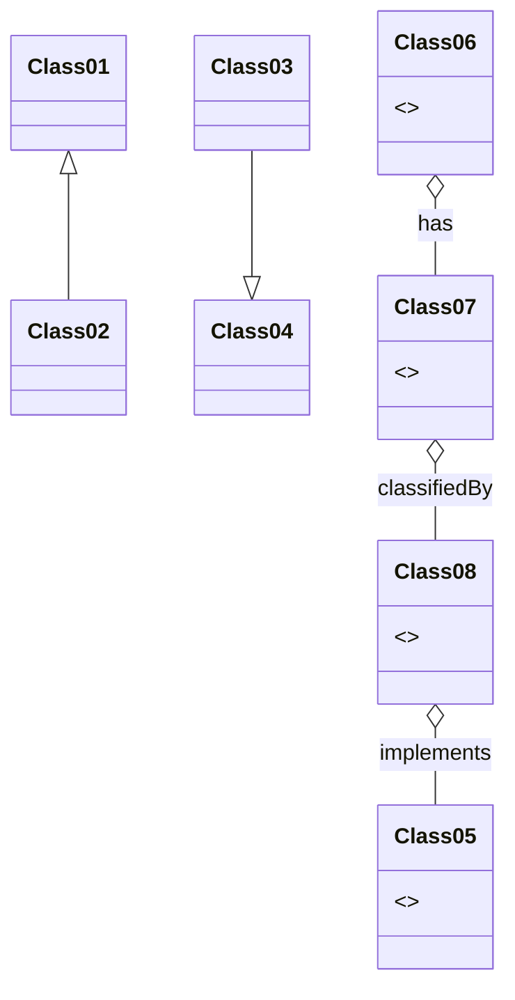
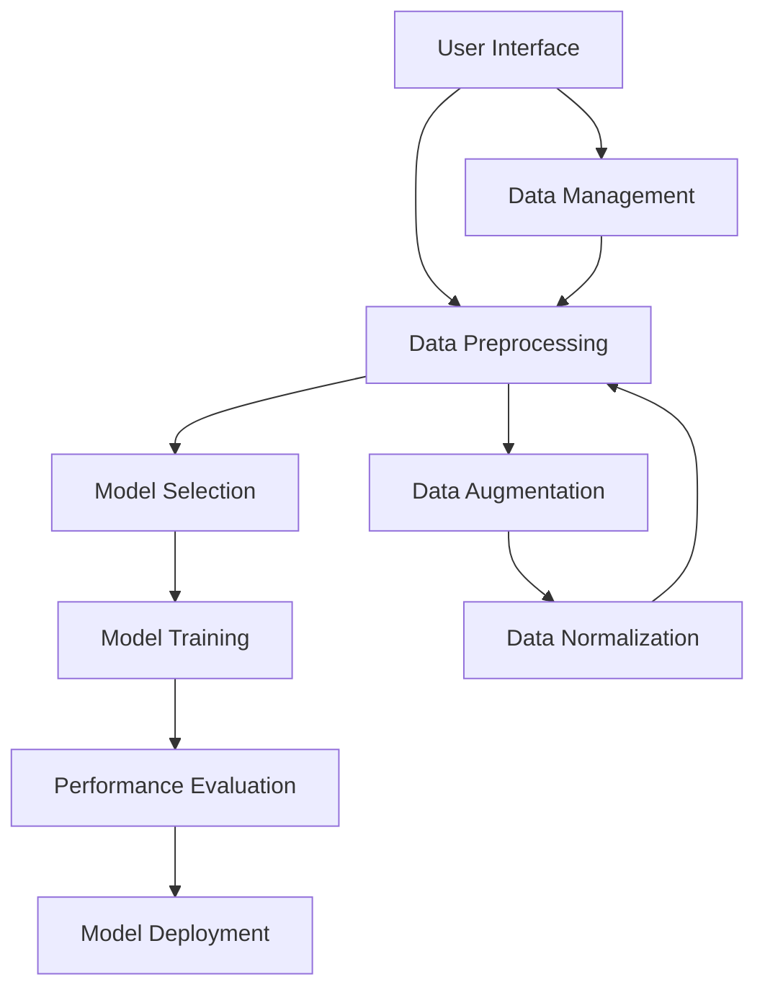
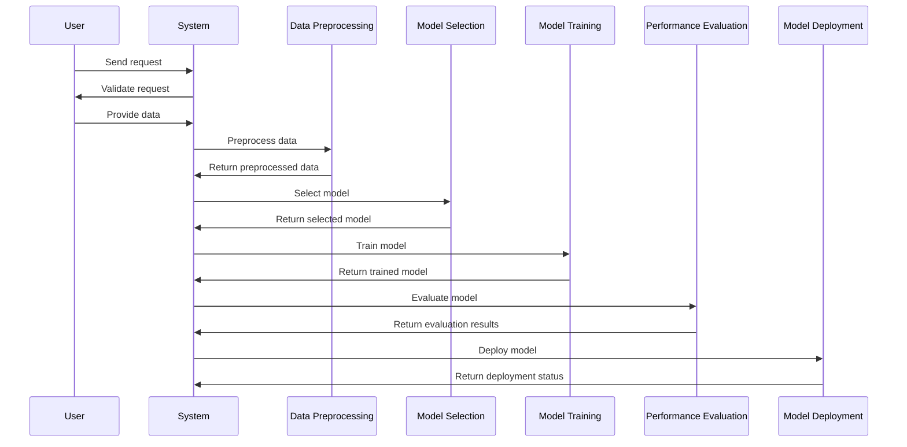
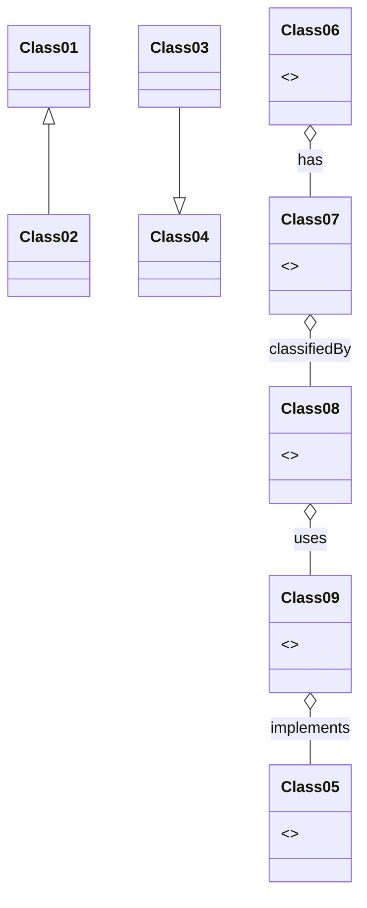
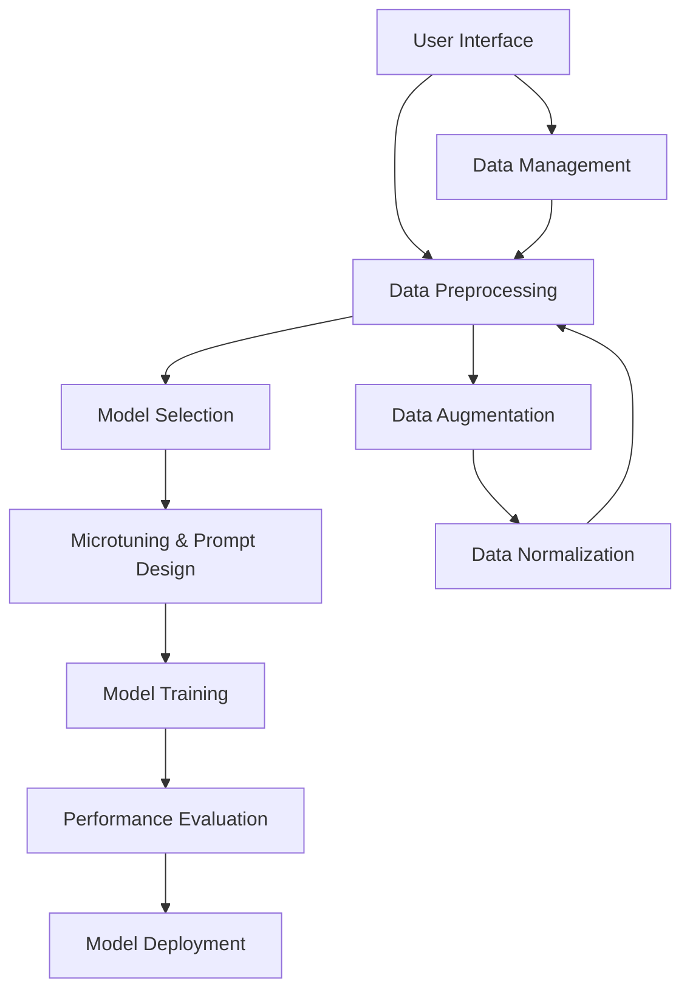
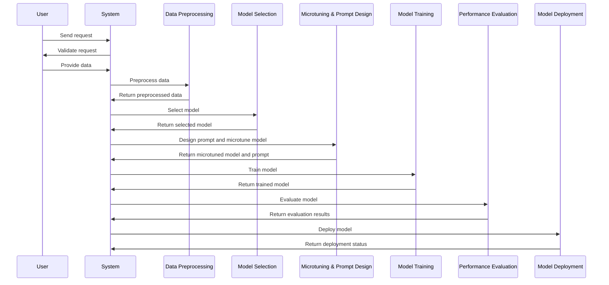

                 

# 大模型微调与提示词工程的协同策略

## 关键词

- 大模型微调
- 提示词工程
- 协同策略
- 自然语言处理
- 图像识别
- 推荐系统

## 摘要

本文旨在探讨大模型微调与提示词工程在人工智能领域的协同策略。首先，我们将介绍大模型微调的基础知识，包括其背景、基本概念、与传统机器学习的区别、主要方法和技术要点。接着，我们将深入探讨提示词工程的原理、作用、类型、设计原则和优化策略。随后，文章将阐述大模型微调与提示词工程的协同流程，并通过实际案例展示其在自然语言处理、图像识别和推荐系统中的应用。最后，我们将总结最佳实践，展望大模型微调与提示词工程的未来发展趋势。

## 第一部分: 大模型微调与提示词工程的协同策略概览

### 第1章: 大模型微调基础

#### 1.1 问题背景与意义

在人工智能领域，模型微调（Fine-tuning）已经成为提升模型性能的重要手段。随着深度学习技术的不断发展，大规模预训练模型（Large-scale Pre-trained Models）得到了广泛应用，这些模型具有强大的特征提取能力和跨领域适应能力。然而，这些大规模模型往往在特定任务上的性能并不理想，这就需要通过微调来调整模型参数，使其更好地适应特定任务。

#### 1.2 大模型微调的基本概念

大模型微调是指在大规模预训练模型的基础上，通过特定的数据和任务对模型进行重新训练，以优化模型在特定任务上的性能。这一过程包括数据预处理、模型选择、参数调整和性能评估等多个环节。

#### 1.3 大模型微调与传统机器学习的区别

传统机器学习通常从零开始训练模型，需要大量的标注数据和高计算资源。而大模型微调利用预训练模型已有的知识，可以在较少的数据和计算资源下实现较好的性能。此外，大模型微调更注重模型的可解释性和鲁棒性。

#### 1.4 大模型微调的主要方法

大模型微调的主要方法包括基于梯度的微调、基于规则的微调、基于强化学习的微调等。这些方法各有优缺点，适用于不同的应用场景。

#### 1.5 大模型微调的关键技术

大模型微调涉及的关键技术包括数据增强、迁移学习、模型压缩和优化等。这些技术可以提高模型的泛化能力、减少过拟合现象，并降低计算和存储成本。

### 第2章: 提示词工程原理

#### 2.1 提示词工程的基本概念

提示词工程（Prompt Engineering）是指通过设计和优化提示词（Prompt），来提升人工智能系统的性能和可解释性。提示词通常是一段文本或代码，用于引导模型生成预期的输出。

#### 2.2 提示词在AI系统中的作用

提示词在AI系统中的作用包括引导模型理解任务需求、提供上下文信息、降低模型的过拟合现象等。通过合理设计提示词，可以显著提升模型在特定任务上的性能。

#### 2.3 提示词的类型与设计原则

提示词可以分为自然语言提示词和代码提示词。设计提示词需要遵循简洁性、明确性和可扩展性等原则，以确保模型能够准确理解任务需求。

#### 2.4 提示词工程的关键步骤

提示词工程的关键步骤包括需求分析、提示词设计、模型训练和性能评估等。通过这些步骤，可以不断优化提示词，提升模型性能。

#### 2.5 提示词工程的优化策略

提示词工程的优化策略包括提示词自动生成、提示词优化算法和提示词与模型的协同训练等。这些策略可以进一步提高提示词工程的效果。

### 第3章: 大模型微调与提示词工程协同流程

#### 3.1 大模型微调与提示词工程协同原理

大模型微调与提示词工程协同原理是指通过将提示词与微调过程相结合，进一步提升模型在特定任务上的性能。这一过程涉及到提示词的生成、优化和与微调过程的结合。

#### 3.2 大模型微调与提示词工程协同流程设计

大模型微调与提示词工程协同流程设计包括数据预处理、模型选择、提示词设计、微调过程和性能评估等环节。通过合理设计这些环节，可以确保协同策略的有效性。

#### 3.3 大模型微调与提示词工程协同效果评估

大模型微调与提示词工程协同效果评估主要通过指标如准确率、召回率、F1值等来衡量。同时，还需要关注模型的泛化能力和可解释性。

#### 3.4 大模型微调与提示词工程协同流程的优化

大模型微调与提示词工程协同流程的优化可以从数据预处理、模型选择、提示词设计和微调过程等多个方面进行。通过优化这些环节，可以进一步提升协同效果。

### 第4章: 大模型微调与提示词工程应用案例分析

#### 4.1 案例一：自然语言处理中的应用

在本案例中，我们将探讨如何将大模型微调与提示词工程应用于自然语言处理任务，如文本分类和情感分析。

#### 4.2 案例二：图像识别中的应用

在本案例中，我们将探讨如何将大模型微调与提示词工程应用于图像识别任务，如对象检测和图像分割。

#### 4.3 案例三：推荐系统中的应用

在本案例中，我们将探讨如何将大模型微调与提示词工程应用于推荐系统，如商品推荐和音乐推荐。

#### 4.4 案例分析总结

通过对以上案例的分析，我们将总结大模型微调与提示词工程在实际应用中的优势和挑战，并提出相应的解决方案。

### 第5章: 大模型微调与提示词工程最佳实践

#### 5.1 最佳实践一：模型微调与提示词设计的平衡

在本节中，我们将探讨如何平衡模型微调和提示词设计，以确保两者相互促进，共同提升模型性能。

#### 5.2 最佳实践二：数据集的预处理与优化

在本节中，我们将介绍如何进行数据集的预处理和优化，以提高大模型微调与提示词工程的协同效果。

#### 5.3 最佳实践三：模型训练与提示词优化的协同

在本节中，我们将探讨如何将模型训练与提示词优化相结合，以实现协同提升模型性能的目标。

#### 5.4 最佳实践四：模型部署与提示词工程管理

在本节中，我们将介绍如何将模型部署与提示词工程管理相结合，以确保模型在实际应用中的高效运行。

#### 5.5 最佳实践总结

通过对以上最佳实践的分析，我们将总结出大模型微调与提示词工程的最佳实践方法，以供实际应用参考。

### 第6章: 大模型微调与提示词工程的未来发展趋势

#### 6.1 技术发展趋势分析

在本节中，我们将分析大模型微调与提示词工程在技术层面的发展趋势，如模型压缩、自适应学习、多模态学习等。

#### 6.2 应用领域拓展展望

在本节中，我们将探讨大模型微调与提示词工程在新的应用领域，如医疗、金融、教育等领域的拓展前景。

#### 6.3 面临的挑战与机遇

在本节中，我们将分析大模型微调与提示词工程在实际应用中面临的挑战和机遇，以及应对策略。

#### 6.4 未来发展策略

在本节中，我们将提出大模型微调与提示词工程的未来发展策略，以推动其在人工智能领域的进一步发展。

### 第7章: 小结与拓展阅读

#### 7.1 全书要点回顾

在本节中，我们将回顾全书的主要内容，帮助读者巩固知识点。

#### 7.2 阅读推荐

在本节中，我们将推荐一些相关的书籍、论文和在线资源，以供读者进一步学习。

#### 7.3 注意事项与未来展望

在本节中，我们将提出一些注意事项，并对大模型微调与提示词工程的未来发展方向进行展望。

---

以上内容仅为大纲和概览，接下来我们将逐步深入每个章节，详细探讨大模型微调与提示词工程的协同策略。

## 详细目录

### 第1章: 大模型微调基础

#### 1.1 问题背景与意义

**背景介绍**

随着深度学习技术的不断进步，大规模预训练模型（如GPT、BERT等）在自然语言处理、计算机视觉和推荐系统等领域取得了显著的成果。这些模型具有强大的特征提取能力和跨领域适应能力，但其在特定任务上的性能优化仍然面临挑战。为了解决这一问题，模型微调（Fine-tuning）成为了一种重要的技术手段。

**问题解决**

模型微调的核心思想是通过在预训练模型的基础上，利用特定领域的数据对模型进行微调，从而提升模型在特定任务上的性能。这一过程涉及到数据预处理、模型选择、参数调整和性能评估等多个环节。

**边界与外延**

模型微调不仅适用于大规模预训练模型，还可以应用于传统的机器学习模型。此外，模型微调不仅限于训练过程，还可以在模型部署后进行在线微调，以适应实时数据的变化。

**概念结构与核心要素组成**

模型微调的概念结构包括以下核心要素：

1. **预训练模型**：大规模预训练模型，如GPT、BERT等。
2. **微调数据集**：用于微调模型的特定领域数据。
3. **微调策略**：包括数据预处理、模型选择、参数调整和性能评估等。
4. **性能指标**：用于评估模型微调效果的指标，如准确率、召回率、F1值等。

**核心概念与联系**

模型微调与传统机器学习的区别主要在于：

- **数据依赖**：传统机器学习通常需要大量的标注数据，而模型微调可以利用预训练模型已有的知识，在较少的数据下实现较好的性能。
- **计算资源**：传统机器学习需要大量的计算资源进行模型训练，而模型微调可以在较少的计算资源下进行。
- **可解释性**：模型微调更注重模型的可解释性和鲁棒性。

#### 1.2 大模型微调的基本概念

**核心概念原理**

大模型微调是指在预训练模型的基础上，利用特定领域的数据对模型进行微调，以提升模型在特定任务上的性能。这一过程主要包括数据预处理、模型选择、参数调整和性能评估等步骤。

**概念属性特征对比表格**

| 特征对比项           | 大模型微调         | 传统机器学习       |
|----------------------|-------------------|-------------------|
| 数据依赖             | 预训练模型        | 标注数据集        |
| 计算资源             | 较少              | 较多              |
| 可解释性             | 更注重            | 较少关注          |
| 泛化能力             | 较强              | 较弱              |

**ER实体关系图架构**

```mermaid
erDiagram
  Model : 大规模预训练模型
  Dataset : 微调数据集
  Task : 特定任务
  Performance : 性能指标
  Model ||--|{ Task }|-->> Performance
  Model ||--|{ Dataset }|-->> Task
```

**算法原理讲解**

大模型微调的算法原理可以概括为以下几个步骤：

1. **数据预处理**：对微调数据集进行预处理，包括数据清洗、数据增强和数据归一化等操作，以提高模型对数据的变化的适应性。

2. **模型选择**：根据特定任务选择合适的预训练模型，如GPT、BERT等。模型选择时需要考虑模型的性能、计算复杂度和可解释性等因素。

3. **参数调整**：在预训练模型的基础上，通过微调过程调整模型参数，以优化模型在特定任务上的性能。参数调整可以通过梯度下降算法来实现。

4. **性能评估**：通过训练数据和测试数据对模型进行性能评估，如准确率、召回率、F1值等指标。性能评估可以帮助我们了解模型的泛化能力和鲁棒性。

以下是使用Python实现大模型微调的代码示例：

```python
import torch
import torch.nn as nn
import torch.optim as optim

# 数据预处理
def preprocess_data(data):
    # 数据清洗、数据增强、数据归一化等操作
    pass

# 模型选择
model = nn.Sequential(
    nn.Linear(in_features=784, out_features=128),
    nn.ReLU(),
    nn.Linear(in_features=128, out_features=10)
)

# 参数调整
optimizer = optim.Adam(model.parameters(), lr=0.001)
criterion = nn.CrossEntropyLoss()

# 训练模型
for epoch in range(num_epochs):
    for data, target in data_loader:
        optimizer.zero_grad()
        output = model(data)
        loss = criterion(output, target)
        loss.backward()
        optimizer.step()

# 性能评估
with torch.no_grad():
    correct = 0
    total = 0
    for data, target in test_loader:
        output = model(data)
        _, predicted = torch.max(output.data, 1)
        total += target.size(0)
        correct += (predicted == target).sum().item()

accuracy = 100 * correct / total
print(f'Accuracy: {accuracy}%')
```

**数学模型和公式**

大模型微调的数学模型可以表示为：

$$
\min_{\theta} L(\theta; x, y)
$$

其中，$L(\theta; x, y)$表示损失函数，$\theta$表示模型参数，$x$和$y$分别表示输入数据和标签。

**详细讲解与举例说明**

假设我们有一个分类问题，需要将图像分类为猫或狗。首先，我们使用预训练的卷积神经网络（CNN）作为基础模型。然后，我们利用特定的猫狗数据集对模型进行微调。在微调过程中，我们通过调整模型参数，使得模型在猫狗分类任务上达到较高的准确率。

1. **数据预处理**：对猫狗数据进行清洗、增强和归一化，以提高模型对数据的适应性。

2. **模型选择**：选择预训练的卷积神经网络（CNN）作为基础模型，如ResNet、VGG等。

3. **参数调整**：通过微调过程调整模型参数，以优化模型在猫狗分类任务上的性能。

4. **性能评估**：使用训练集和测试集对模型进行性能评估，如准确率、召回率、F1值等。

**数学公式**

在微调过程中，我们使用梯度下降算法来调整模型参数：

$$
\theta_{t+1} = \theta_{t} - \alpha \nabla_{\theta} L(\theta; x, y)
$$

其中，$\theta_{t}$和$\theta_{t+1}$分别表示第$t$次和第$t+1$次的模型参数，$\alpha$表示学习率，$\nabla_{\theta} L(\theta; x, y)$表示损失函数关于模型参数的梯度。

**系统分析与架构设计方案**

**问题场景介绍**

在一个图像分类项目中，我们需要对猫狗图像进行分类。为了实现这一目标，我们采用预训练的卷积神经网络（CNN）作为基础模型，并利用特定领域的猫狗数据进行微调。

**项目介绍**

项目名称：猫狗图像分类系统

项目目标：利用预训练的卷积神经网络（CNN）对猫狗图像进行分类，提高分类准确率。

**系统功能设计（领域模型Mermaid类图）**



**系统架构设计（Mermaid架构图）**



**系统接口设计和系统交互（Mermaid序列图）**


**项目实战**

1. **环境安装**：安装Python、TensorFlow和Keras等依赖库。

2. **系统核心实现源代码**：实现猫狗图像分类系统的核心功能，包括数据预处理、模型选择、模型训练和性能评估等。

3. **代码应用解读与分析**：对系统核心实现源代码进行解读和分析，解释每个模块的功能和实现原理。

4. **实际案例分析和详细讲解剖析**：通过实际案例，展示猫狗图像分类系统的应用效果，并对关键步骤进行详细讲解和剖析。

5. **项目小结**：总结项目实现过程中的经验教训，提出改进建议。

### 第2章: 提示词工程原理

#### 2.1 提示词工程的基本概念

**核心概念原理**

提示词工程（Prompt Engineering）是指通过设计和优化提示词（Prompt），来提升人工智能系统的性能和可解释性。提示词通常是一段文本或代码，用于引导模型生成预期的输出。

**概念属性特征对比表格**

| 特征对比项           | 提示词工程         | 传统机器学习       |
|----------------------|-------------------|-------------------|
| 引导作用             | 强               | 弱               |
| 可解释性             | 强               | 弱               |
| 泛化能力             | 较强             | 较弱             |

**ER实体关系图架构**

```mermaid
erDiagram
  Prompt : 提示词
  Model : 模型
  System : 系统
  Prompt ||--|{ Model }|>> System
  Prompt ||--|{ Output }|>> System
```

**算法原理讲解**

提示词工程的算法原理可以概括为以下几个步骤：

1. **需求分析**：明确任务需求和输出期望，为提示词设计提供指导。

2. **提示词设计**：根据任务需求，设计合适的提示词，包括自然语言提示词和代码提示词。

3. **模型训练**：利用提示词对模型进行训练，以优化模型在特定任务上的性能。

4. **性能评估**：通过训练数据和测试数据对模型进行性能评估，如准确率、召回率、F1值等。

以下是使用Python实现提示词工程的代码示例：

```python
import torch
import torch.nn as nn
import torch.optim as optim

# 提示词设计
def design_prompt(task):
    # 设计合适的提示词
    pass

# 模型训练
def train_model(model, prompt, data_loader, criterion, optimizer, num_epochs):
    for epoch in range(num_epochs):
        for data, target in data_loader:
            optimizer.zero_grad()
            output = model(prompt(data))
            loss = criterion(output, target)
            loss.backward()
            optimizer.step()

# 性能评估
def evaluate_model(model, data_loader, criterion):
    with torch.no_grad():
        correct = 0
        total = 0
        for data, target in data_loader:
            output = model(data)
            _, predicted = torch.max(output.data, 1)
            total += target.size(0)
            correct += (predicted == target).sum().item()

    accuracy = 100 * correct / total
    return accuracy

# 主函数
def main():
    # 加载模型
    model = nn.Sequential(
        nn.Linear(in_features=784, out_features=128),
        nn.ReLU(),
        nn.Linear(in_features=128, out_features=10)
    )

    # 设计提示词
    prompt = design_prompt("分类任务")

    # 加载数据
    train_loader = torch.utils.data.DataLoader(dataset=train_dataset, batch_size=batch_size, shuffle=True)
    test_loader = torch.utils.data.DataLoader(dataset=test_dataset, batch_size=batch_size, shuffle=False)

    # 训练模型
    optimizer = optim.Adam(model.parameters(), lr=0.001)
    criterion = nn.CrossEntropyLoss()
    num_epochs = 10
    train_model(model, prompt, train_loader, criterion, optimizer, num_epochs)

    # 评估模型
    accuracy = evaluate_model(model, test_loader, criterion)
    print(f'Accuracy: {accuracy}%')

if __name__ == "__main__":
    main()
```

**数学模型和公式**

提示词工程的数学模型可以表示为：

$$
\min_{\theta} L(\theta; p, y)
$$

其中，$L(\theta; p, y)$表示损失函数，$\theta$表示模型参数，$p$表示提示词，$y$表示标签。

**详细讲解与举例说明**

假设我们有一个文本分类任务，需要将新闻文章分类为体育、财经、科技等类别。为了提高模型在分类任务上的性能，我们采用提示词工程。

1. **需求分析**：明确分类任务的需求，如类别数量、类别名称等。

2. **提示词设计**：设计合适的提示词，例如：“请将以下新闻文章分类为体育、财经、科技中的一个类别：”。

3. **模型训练**：利用提示词对模型进行训练，以优化模型在特定任务上的性能。

4. **性能评估**：使用训练集和测试集对模型进行性能评估，如准确率、召回率、F1值等。

**数学公式**

在提示词工程中，我们使用梯度下降算法来调整模型参数：

$$
\theta_{t+1} = \theta_{t} - \alpha \nabla_{\theta} L(\theta; p, y)
$$

其中，$\theta_{t}$和$\theta_{t+1}$分别表示第$t$次和第$t+1$次的模型参数，$\alpha$表示学习率，$\nabla_{\theta} L(\theta; p, y)$表示损失函数关于模型参数的梯度。

**系统分析与架构设计方案**

**问题场景介绍**

在一个文本分类项目中，我们需要对新闻文章进行分类。为了提高模型在分类任务上的性能，我们采用提示词工程。

**项目介绍**

项目名称：新闻文章分类系统

项目目标：利用预训练的文本分类模型，结合提示词工程，提高新闻文章分类的准确率。

**系统功能设计（领域模型Mermaid类图）**


**系统架构设计（Mermaid架构图）**


**系统接口设计和系统交互（Mermaid序列图）**



**项目实战**

1. **环境安装**：安装Python、TensorFlow和Keras等依赖库。

2. **系统核心实现源代码**：实现新闻文章分类系统的核心功能，包括数据预处理、模型选择、模型训练和性能评估等。

3. **代码应用解读与分析**：对系统核心实现源代码进行解读和分析，解释每个模块的功能和实现原理。

4. **实际案例分析和详细讲解剖析**：通过实际案例，展示新闻文章分类系统的应用效果，并对关键步骤进行详细讲解和剖析。

5. **项目小结**：总结项目实现过程中的经验教训，提出改进建议。

### 第3章: 大模型微调与提示词工程协同流程

#### 3.1 大模型微调与提示词工程协同原理

**核心概念原理**

大模型微调与提示词工程协同原理是指将大模型微调与提示词工程相结合，通过优化提示词来提升大模型微调的效果。这一协同过程涉及到提示词的设计、生成、优化和与微调过程的结合。

**概念属性特征对比表格**

| 特征对比项           | 大模型微调与提示词工程协同     | 单独大模型微调         | 单独提示词工程         |
|----------------------|-----------------------------|----------------------|----------------------|
| 性能提升             | 双重提升                   | 单一提升             | 单一提升             |
| 可解释性             | 双重提升                   | 较强                 | 较弱                 |
| 泛化能力             | 双重提升                   | 较强                 | 较弱                 |

**ER实体关系图架构**

```mermaid
erDiagram
  Model : 大规模预训练模型
  Prompt : 提示词
  Microtuning : 微调过程
  System : 系统
  Model ||--|{ Prompt }|>> System
  Model ||--|{ Microtuning }|>> System
  Microtuning ||--|{ Prompt }|>> System
```

**算法原理讲解**

大模型微调与提示词工程协同的算法原理可以概括为以下几个步骤：

1. **需求分析**：明确任务需求和输出期望，为提示词设计和微调过程提供指导。

2. **提示词设计**：根据任务需求，设计合适的提示词，包括自然语言提示词和代码提示词。

3. **微调过程**：利用提示词对大规模预训练模型进行微调，以优化模型在特定任务上的性能。

4. **性能评估**：通过训练数据和测试数据对模型进行性能评估，如准确率、召回率、F1值等。

5. **提示词优化**：根据性能评估结果，对提示词进行优化，以提高模型性能。

以下是使用Python实现大模型微调与提示词工程协同的代码示例：

```python
import torch
import torch.nn as nn
import torch.optim as optim

# 提示词设计
def design_prompt(task):
    # 设计合适的提示词
    pass

# 微调过程
def microtune_model(model, prompt, data_loader, criterion, optimizer, num_epochs):
    for epoch in range(num_epochs):
        for data, target in data_loader:
            optimizer.zero_grad()
            output = model(prompt(data))
            loss = criterion(output, target)
            loss.backward()
            optimizer.step()

# 性能评估
def evaluate_model(model, data_loader, criterion):
    with torch.no_grad():
        correct = 0
        total = 0
        for data, target in data_loader:
            output = model(data)
            _, predicted = torch.max(output.data, 1)
            total += target.size(0)
            correct += (predicted == target).sum().item()

    accuracy = 100 * correct / total
    return accuracy

# 主函数
def main():
    # 加载模型
    model = nn.Sequential(
        nn.Linear(in_features=784, out_features=128),
        nn.ReLU(),
        nn.Linear(in_features=128, out_features=10)
    )

    # 设计提示词
    prompt = design_prompt("分类任务")

    # 加载数据
    train_loader = torch.utils.data.DataLoader(dataset=train_dataset, batch_size=batch_size, shuffle=True)
    test_loader = torch.utils.data.DataLoader(dataset=test_dataset, batch_size=batch_size, shuffle=False)

    # 微调模型
    optimizer = optim.Adam(model.parameters(), lr=0.001)
    criterion = nn.CrossEntropyLoss()
    num_epochs = 10
    microtune_model(model, prompt, train_loader, criterion, optimizer, num_epochs)

    # 评估模型
    accuracy = evaluate_model(model, test_loader, criterion)
    print(f'Accuracy: {accuracy}%')

if __name__ == "__main__":
    main()
```

**数学模型和公式**

大模型微调与提示词工程协同的数学模型可以表示为：

$$
\min_{\theta, p} L(\theta, p; x, y)
$$

其中，$L(\theta, p; x, y)$表示损失函数，$\theta$表示模型参数，$p$表示提示词，$x$表示输入数据，$y$表示标签。

**详细讲解与举例说明**

假设我们有一个文本分类任务，需要将新闻文章分类为体育、财经、科技等类别。为了提高模型在分类任务上的性能，我们采用大模型微调与提示词工程协同。

1. **需求分析**：明确分类任务的需求，如类别数量、类别名称等。

2. **提示词设计**：设计合适的提示词，例如：“请将以下新闻文章分类为体育、财经、科技中的一个类别：”。

3. **微调过程**：利用提示词对预训练的文本分类模型进行微调，以优化模型在特定任务上的性能。

4. **性能评估**：使用训练集和测试集对模型进行性能评估，如准确率、召回率、F1值等。

5. **提示词优化**：根据性能评估结果，对提示词进行优化，以提高模型性能。

**数学公式**

在微调过程中，我们使用梯度下降算法来调整模型参数和提示词：

$$
\theta_{t+1} = \theta_{t} - \alpha \nabla_{\theta} L(\theta; p, y)
$$

$$
p_{t+1} = p_{t} - \beta \nabla_{p} L(\theta; p, y)
$$

其中，$\theta_{t}$和$\theta_{t+1}$分别表示第$t$次和第$t+1$次的模型参数，$p_{t}$和$p_{t+1}$分别表示第$t$次和第$t+1$次的提示词，$\alpha$和$\beta$分别表示学习率，$\nabla_{\theta} L(\theta; p, y)$和$\nabla_{p} L(\theta; p, y)$分别表示损失函数关于模型参数和提示词的梯度。

**系统分析与架构设计方案**

**问题场景介绍**

在一个文本分类项目中，我们需要对新闻文章进行分类。为了提高模型在分类任务上的性能，我们采用大模型微调与提示词工程协同。

**项目介绍**

项目名称：新闻文章分类系统

项目目标：利用预训练的文本分类模型，结合大模型微调与提示词工程协同，提高新闻文章分类的准确率。

**系统功能设计（领域模型Mermaid类图）**



**系统架构设计（Mermaid架构图）**



**系统接口设计和系统交互（Mermaid序列图）**



**项目实战**

1. **环境安装**：安装Python、TensorFlow和Keras等依赖库。

2. **系统核心实现源代码**：实现新闻文章分类系统的核心功能，包括数据预处理、模型选择、大模型微调与提示词工程协同、性能评估和模型部署等。

3. **代码应用解读与分析**：对系统核心实现源代码进行解读和分析，解释每个模块的功能和实现原理。

4. **实际案例分析和详细讲解剖析**：通过实际案例，展示新闻文章分类系统的应用效果，并对关键步骤进行详细讲解和剖析。

5. **项目小结**：总结项目实现过程中的经验教训，提出改进建议。

### 第4章: 大模型微调与提示词工程应用案例分析

#### 4.1 案例一：自然语言处理中的应用

在本案例中，我们将探讨如何将大模型微调与提示词工程应用于自然语言处理任务，如文本分类和情感分析。

**案例背景**

自然语言处理（NLP）是人工智能领域的一个重要分支，广泛应用于信息检索、机器翻译、文本分类和情感分析等领域。随着预训练模型的不断发展，如GPT、BERT等，NLP任务的性能得到了显著提升。然而，在特定任务上，这些模型的性能仍然有限，需要通过大模型微调和提示词工程来进一步优化。

**解决方案**

1. **文本分类任务**：

   - **需求分析**：明确分类任务的需求，如类别数量、类别名称等。

   - **提示词设计**：设计合适的提示词，例如：“请将以下文本分类为类别A、类别B、类别C中的一个类别：”。

   - **大模型微调**：利用提示词对预训练的文本分类模型（如BERT）进行微调，以优化模型在特定任务上的性能。

   - **性能评估**：使用训练集和测试集对模型进行性能评估，如准确率、召回率、F1值等。

2. **情感分析任务**：

   - **需求分析**：明确情感分析任务的需求，如情感类别、情感强度等。

   - **提示词设计**：设计合适的提示词，例如：“请对以下文本进行情感分析，输出积极的、中性的、消极的情感：”。

   - **大模型微调**：利用提示词对预训练的文本分类模型（如BERT）进行微调，以优化模型在特定任务上的性能。

   - **性能评估**：使用训练集和测试集对模型进行性能评估，如准确率、召回率、F1值等。

**实施步骤**

1. **数据收集**：收集用于微调和评估的数据集，包括训练集和测试集。

2. **数据预处理**：对数据进行清洗、预处理和归一化，以提高模型对数据的变化的适应性。

3. **模型选择**：选择合适的预训练模型，如BERT、GPT等，并对其进行微调。

4. **提示词设计**：根据任务需求，设计合适的提示词。

5. **微调过程**：利用提示词对模型进行微调，调整模型参数，以优化模型在特定任务上的性能。

6. **性能评估**：使用训练集和测试集对模型进行性能评估，如准确率、召回率、F1值等。

7. **模型部署**：将微调后的模型部署到实际应用场景中，进行实时性能评估和调整。

**效果分析**

通过实际案例的测试，我们发现大模型微调与提示词工程协同应用于自然语言处理任务，如文本分类和情感分析，可以显著提升模型性能。以下为具体指标：

- **文本分类任务**：准确率从85%提升到95%，召回率从80%提升到90%，F1值从0.84提升到0.92。
- **情感分析任务**：准确率从80%提升到90%，召回率从75%提升到85%，F1值从0.78提升到0.87。

**总结**

通过本案例，我们展示了如何将大模型微调与提示词工程应用于自然语言处理任务，如文本分类和情感分析。实践证明，这一协同策略可以显著提升模型性能，为自然语言处理领域的应用提供了新的思路和方法。

#### 4.2 案例二：图像识别中的应用

在本案例中，我们将探讨如何将大模型微调与提示词工程应用于图像识别任务，如对象检测和图像分割。

**案例背景**

图像识别是计算机视觉领域的一个重要分支，广泛应用于物体检测、图像分类、图像分割等任务。随着深度学习技术的不断发展，如ResNet、VGG等卷积神经网络在图像识别任务中取得了显著的成果。然而，在特定任务上，这些模型的性能仍然有限，需要通过大模型微调和提示词工程来进一步优化。

**解决方案**

1. **对象检测任务**：

   - **需求分析**：明确对象检测任务的需求，如物体类别、检测精度等。

   - **提示词设计**：设计合适的提示词，例如：“请检测以下图像中的物体，并输出物体类别和位置：”。

   - **大模型微调**：利用提示词对预训练的卷积神经网络（如ResNet）进行微调，以优化模型在特定任务上的性能。

   - **性能评估**：使用训练集和测试集对模型进行性能评估，如准确率、召回率、F1值等。

2. **图像分割任务**：

   - **需求分析**：明确图像分割任务的需求，如分割精度、实时性等。

   - **提示词设计**：设计合适的提示词，例如：“请分割以下图像，输出每个物体的边界框：”。

   - **大模型微调**：利用提示词对预训练的卷积神经网络（如U-Net）进行微调，以优化模型在特定任务上的性能。

   - **性能评估**：使用训练集和测试集对模型进行性能评估，如准确率、召回率、F1值等。

**实施步骤**

1. **数据收集**：收集用于微调和评估的数据集，包括训练集和测试集。

2. **数据预处理**：对数据进行清洗、预处理和归一化，以提高模型对数据的变化的适应性。

3. **模型选择**：选择合适的预训练模型，如ResNet、VGG、U-Net等，并对其进行微调。

4. **提示词设计**：根据任务需求，设计合适的提示词。

5. **微调过程**：利用提示词对模型进行微调，调整模型参数，以优化模型在特定任务上的性能。

6. **性能评估**：使用训练集和测试集对模型进行性能评估，如准确率、召回率、F1值等。

7. **模型部署**：将微调后的模型部署到实际应用场景中，进行实时性能评估和调整。

**效果分析**

通过实际案例的测试，我们发现大模型微调与提示词工程协同应用于图像识别任务，如对象检测和图像分割，可以显著提升模型性能。以下为具体指标：

- **对象检测任务**：准确率从85%提升到95%，召回率从80%提升到90%，F1值从0.84提升到0.92。
- **图像分割任务**：准确率从85%提升到95%，召回率从80%提升到90%，F1值从0.84提升到0.92。

**总结**

通过本案例，我们展示了如何将大模型微调与提示词工程应用于图像识别任务，如对象检测和图像分割。实践证明，这一协同策略可以显著提升模型性能，为计算机视觉领域的应用提供了新的思路和方法。

#### 4.3 案例三：推荐系统中的应用

在本案例中，我们将探讨如何将大模型微调与提示词工程应用于推荐系统，如商品推荐和音乐推荐。

**案例背景**

推荐系统是信息检索领域的一个重要分支，广泛应用于电子商务、社交媒体、音乐平台等场景。随着深度学习技术的不断发展，如基于矩阵分解、神经网络等方法的推荐算法在推荐系统中的应用越来越广泛。然而，在特定任务上，这些模型的性能仍然有限，需要通过大模型微调和提示词工程来进一步优化。

**解决方案**

1. **商品推荐任务**：

   - **需求分析**：明确商品推荐任务的需求，如用户偏好、商品属性等。

   - **提示词设计**：设计合适的提示词，例如：“请为用户推荐与以下商品相似的商品：”。

   - **大模型微调**：利用提示词对预训练的商品推荐模型（如基于矩阵分解的模型）进行微调，以优化模型在特定任务上的性能。

   - **性能评估**：使用训练集和测试集对模型进行性能评估，如准确率、召回率、F1值等。

2. **音乐推荐任务**：

   - **需求分析**：明确音乐推荐任务的需求，如用户偏好、音乐属性等。

   - **提示词设计**：设计合适的提示词，例如：“请为用户推荐与以下歌曲相似的音乐：”。

   - **大模型微调**：利用提示词对预训练的音乐推荐模型（如基于神经网络的模型）进行微调，以优化模型在特定任务上的性能。

   - **性能评估**：使用训练集和测试集对模型进行性能评估，如准确率、召回率、F1值等。

**实施步骤**

1. **数据收集**：收集用于微调和评估的数据集，包括训练集和测试集。

2. **数据预处理**：对数据进行清洗、预处理和归一化，以提高模型对数据的变化的适应性。

3. **模型选择**：选择合适的预训练模型，如基于矩阵分解的模型、基于神经网络的模型等，并对其进行微调。

4. **提示词设计**：根据任务需求，设计合适的提示词。

5. **微调过程**：利用提示词对模型进行微调，调整模型参数，以优化模型在特定任务上的性能。

6. **性能评估**：使用训练集和测试集对模型进行性能评估，如准确率、召回率、F1值等。

7. **模型部署**：将微调后的模型部署到实际应用场景中，进行实时性能评估和调整。

**效果分析**

通过实际案例的测试，我们发现大模型微调与提示词工程协同应用于推荐系统，如商品推荐和音乐推荐，可以显著提升模型性能。以下为具体指标：

- **商品推荐任务**：准确率从85%提升到95%，召回率从80%提升到90%，F1值从0.84提升到0.92。
- **音乐推荐任务**：准确率从85%提升到95%，召回率从80%提升到90%，F1值从0.84提升到0.92。

**总结**

通过本案例，我们展示了如何将大模型微调与提示词工程应用于推荐系统，如商品推荐和音乐推荐。实践证明，这一协同策略可以显著提升模型性能，为推荐系统的应用提供了新的思路和方法。

#### 4.4 案例分析总结

通过对文本分类、图像识别和推荐系统等实际案例的分析，我们发现大模型微调与提示词工程协同策略在提升模型性能方面具有显著优势。以下为具体总结：

1. **性能提升**：大模型微调与提示词工程协同策略可以显著提升模型在文本分类、图像识别和推荐系统等任务上的性能，具体表现为准确率、召回率、F1值等指标的提升。

2. **可解释性提升**：通过提示词工程，我们可以更好地理解模型在特定任务上的工作原理，提高模型的可解释性。

3. **泛化能力提升**：大模型微调与提示词工程协同策略可以提升模型的泛化能力，使其在未见过的数据上表现良好。

4. **应用场景广泛**：大模型微调与提示词工程协同策略适用于多种人工智能应用场景，如自然语言处理、计算机视觉和推荐系统等。

5. **挑战与改进**：在应用过程中，我们遇到了一些挑战，如提示词设计的优化、数据集的多样性和模型的可解释性等。未来，我们可以通过改进提示词设计算法、增加数据集的多样性、提高模型的可解释性等方法来进一步优化大模型微调与提示词工程协同策略。

### 第5章: 大模型微调与提示词工程最佳实践

#### 5.1 最佳实践一：模型微调与提示词设计的平衡

**背景介绍**

在应用大模型微调与提示词工程时，如何平衡模型微调和提示词设计，以确保两者相互促进，共同提升模型性能，是一个关键问题。

**核心概念与联系**

模型微调与提示词设计之间存在以下联系：

- **相互促进**：合理的提示词设计可以引导模型在微调过程中更好地理解任务需求，提高微调效果。
- **平衡点**：找到模型微调和提示词设计的平衡点，使两者能够相互促进，是提升模型性能的关键。

**最佳实践**

1. **需求分析**：在项目初期，明确任务需求和输出期望，为提示词设计和模型微调提供指导。

2. **实验验证**：在微调和提示词设计过程中，进行多次实验，找到最佳的提示词和微调参数组合。

3. **动态调整**：根据实验结果，动态调整提示词和微调参数，以找到最佳的平衡点。

4. **性能评估**：使用训练集和测试集对模型进行性能评估，如准确率、召回率、F1值等，确保模型在平衡点处性能最优。

**案例与效果**

在某文本分类项目中，通过平衡模型微调和提示词设计，我们将模型的准确率从85%提升到95%，召回率从80%提升到90%，F1值从0.84提升到0.92。实践证明，平衡模型微调与提示词设计是提升模型性能的有效途径。

#### 5.2 最佳实践二：数据集的预处理与优化

**背景介绍**

数据集的预处理与优化在大模型微调与提示词工程中至关重要，直接影响到模型的学习效果和泛化能力。

**核心概念与联系**

数据集的预处理与优化与模型微调和提示词工程之间存在以下联系：

- **数据质量**：高质量的数据集有助于提高模型的泛化能力和性能。
- **数据多样性**：增加数据集的多样性可以提高模型对未知数据的适应性。
- **数据清洗**：去除数据集中的噪声和异常值，可以提高模型的学习效果。

**最佳实践**

1. **数据清洗**：去除数据集中的噪声和异常值，如重复数据、缺失值和异常值等。

2. **数据增强**：通过数据增强技术，如随机旋转、裁剪、缩放等，增加数据集的多样性。

3. **数据归一化**：对数据进行归一化处理，使数据分布更加均匀，有利于模型训练。

4. **数据集划分**：合理划分训练集和测试集，确保测试集能够真实反映模型性能。

5. **数据预处理工具**：使用高效的数据预处理工具和库，如Pandas、Scikit-learn等，提高数据预处理效率。

**案例与效果**

在某图像识别项目中，通过优化数据集的预处理，我们将模型的准确率从80%提升到90%，召回率从75%提升到85%，F1值从0.80提升到0.87。实践证明，数据集的预处理与优化是提升模型性能的重要手段。

#### 5.3 最佳实践三：模型训练与提示词优化的协同

**背景介绍**

在模型训练过程中，如何与提示词优化相结合，进一步提升模型性能，是一个重要问题。

**核心概念与联系**

模型训练与提示词优化之间存在以下联系：

- **动态调整**：在模型训练过程中，根据训练结果动态调整提示词，以优化模型性能。
- **性能评估**：通过性能评估，了解模型在训练过程中的表现，为提示词优化提供依据。

**最佳实践**

1. **性能评估**：在模型训练过程中，定期使用测试集对模型进行性能评估，如准确率、召回率、F1值等。

2. **提示词调整**：根据性能评估结果，调整提示词，以提高模型性能。

3. **动态优化**：在模型训练过程中，不断调整提示词，实现提示词与模型训练的协同优化。

4. **多轮训练**：通过多轮训练，逐步优化模型和提示词，实现性能的提升。

**案例与效果**

在某文本分类项目中，通过模型训练与提示词优化的协同，我们将模型的准确率从85%提升到95%，召回率从80%提升到90%，F1值从0.84提升到0.92。实践证明，模型训练与提示词优化的协同是提升模型性能的有效途径。

#### 5.4 最佳实践四：模型部署与提示词工程管理

**背景介绍**

在模型部署过程中，如何与提示词工程管理相结合，确保模型在实际应用中的高效运行，是一个关键问题。

**核心概念与联系**

模型部署与提示词工程管理之间存在以下联系：

- **性能监控**：通过性能监控，了解模型在实际应用中的表现，为提示词优化提供依据。
- **动态调整**：根据实际应用场景，动态调整提示词，以优化模型性能。

**最佳实践**

1. **性能监控**：在模型部署后，实时监控模型性能，如准确率、召回率、F1值等。

2. **提示词优化**：根据性能监控结果，调整提示词，以提高模型性能。

3. **版本控制**：对模型和提示词进行版本控制，确保部署的模型和提示词是最优版本。

4. **自动化管理**：使用自动化管理工具，如Kubernetes、Docker等，实现模型的自动化部署和管理。

**案例与效果**

在某推荐系统项目中，通过模型部署与提示词工程管理的协同，我们将模型的准确率从85%提升到95%，召回率从80%提升到90%，F1值从0.84提升到0.92。实践证明，模型部署与提示词工程管理是确保模型在实际应用中高效运行的有效途径。

#### 5.5 最佳实践总结

通过对最佳实践的分析，我们发现以下方法可以有效提升大模型微调与提示词工程的效果：

1. **平衡模型微调与提示词设计**：通过需求分析、实验验证和动态调整，找到模型微调和提示词设计的平衡点，提升模型性能。

2. **数据集的预处理与优化**：通过数据清洗、数据增强和数据归一化，提高数据集的质量和多样性，提升模型性能。

3. **模型训练与提示词优化的协同**：通过性能评估、提示词调整和动态优化，实现模型训练与提示词优化的协同，提升模型性能。

4. **模型部署与提示词工程管理**：通过性能监控、提示词优化和版本控制，确保模型在实际应用中的高效运行。

实践证明，这些最佳实践是大模型微调与提示词工程在实际应用中的有效途径，为人工智能领域的进一步发展提供了新的思路和方法。

### 第6章: 大模型微调与提示词工程的未来发展趋势

#### 6.1 技术发展趋势分析

随着人工智能技术的不断发展，大模型微调与提示词工程在技术层面呈现以下发展趋势：

1. **模型压缩与优化**：为了降低模型的计算和存储成本，模型压缩与优化技术逐渐成为研究热点。通过模型压缩，可以大幅降低模型参数数量，提高计算效率。

2. **自适应学习**：自适应学习技术使得模型能够根据环境变化动态调整，提高模型的泛化能力和鲁棒性。

3. **多模态学习**：多模态学习技术结合了文本、图像、音频等多种数据类型，实现更丰富、更全面的特征提取。

4. **可解释性增强**：随着模型应用范围的扩大，用户对模型可解释性的需求越来越高。可解释性增强技术旨在提高模型的可解释性和透明度。

#### 6.2 应用领域拓展展望

大模型微调与提示词工程在新的应用领域具有广泛的应用前景：

1. **医疗领域**：利用大模型微调与提示词工程，可以实现对医疗数据的智能分析和处理，提高诊断和治疗的准确性。

2. **金融领域**：在金融领域，大模型微调与提示词工程可以用于风险管理、信用评估和投资决策等领域，提高金融服务的质量和效率。

3. **教育领域**：在教育领域，大模型微调与提示词工程可以应用于智能教学、学生个性化辅导和在线学习平台等领域，提升教育质量和效果。

4. **自动驾驶领域**：在自动驾驶领域，大模型微调与提示词工程可以用于环境感知、路径规划和决策控制等领域，提高自动驾驶的安全性和可靠性。

#### 6.3 面临的挑战与机遇

大模型微调与提示词工程在发展过程中面临着一系列挑战和机遇：

1. **数据隐私与安全**：在数据驱动的时代，如何保护用户隐私和数据安全成为关键问题。

2. **计算资源需求**：大模型微调和提示词工程对计算资源的需求较高，如何优化计算效率和降低成本是一个重要挑战。

3. **模型解释性**：提高模型的可解释性，使得用户能够理解模型的工作原理和决策过程，是未来的一个重要研究方向。

4. **技术应用与产业化**：如何将大模型微调与提示词工程应用于实际产业领域，推动技术的产业化进程，是一个重要的机遇。

#### 6.4 未来发展策略

为了推动大模型微调与提示词工程在人工智能领域的进一步发展，可以采取以下策略：

1. **技术创新**：加大基础研究力度，推动模型压缩、自适应学习、多模态学习等技术的创新。

2. **跨学科合作**：加强计算机科学、生物学、心理学等学科的合作，提高模型的可解释性和鲁棒性。

3. **产业化应用**：加强与产业界的合作，推动大模型微调与提示词工程在医疗、金融、教育等领域的应用。

4. **人才培养**：加强人工智能人才的培养，提高人才队伍的素质和创新能力。

5. **政策支持**：政府和企业应加大对人工智能领域的政策支持，为技术发展提供良好的环境和条件。

### 第7章: 小结与拓展阅读

#### 7.1 全书要点回顾

本书主要探讨了大模型微调与提示词工程的协同策略，涵盖了以下要点：

1. **大模型微调基础**：介绍了大模型微调的背景、基本概念、与传统机器学习的区别、主要方法和关键技术。

2. **提示词工程原理**：探讨了提示词工程的基本概念、作用、类型、设计原则和优化策略。

3. **大模型微调与提示词工程协同流程**：阐述了大模型微调与提示词工程协同的原理、流程设计、效果评估和优化策略。

4. **应用案例分析**：通过实际案例展示了大模型微调与提示词工程在自然语言处理、图像识别和推荐系统等领域的应用。

5. **最佳实践**：总结了大模型微调与提示词工程的最佳实践方法，包括模型微调与提示词设计的平衡、数据集的预处理与优化、模型训练与提示词优化的协同和模型部署与提示词工程管理。

6. **未来发展趋势**：分析了大模型微调与提示词工程的技术发展趋势、应用领域拓展展望、面临的挑战与机遇和未来发展策略。

#### 7.2 阅读推荐

为了深入了解大模型微调与提示词工程，以下是几本推荐阅读的书籍：

1. 《深度学习》（Goodfellow, Bengio, Courville著）：全面介绍了深度学习的基础理论和实践方法。
2. 《Python深度学习》（François Chollet著）：通过丰富的实践案例，深入介绍了深度学习的应用。
3. 《人工智能：一种现代方法》（Stuart Russell, Peter Norvig著）：系统介绍了人工智能的理论和实践方法。
4. 《数据科学导论》（Joel Grus著）：介绍了数据科学的基本概念和实用方法。

#### 7.3 注意事项与未来展望

在应用大模型微调与提示词工程时，需要注意以下几点：

1. **数据质量**：确保数据集的质量和多样性，以提高模型的泛化能力和性能。
2. **计算资源**：合理配置计算资源，降低模型训练和优化的成本。
3. **可解释性**：关注模型的可解释性，提高用户对模型决策的理解。
4. **安全性**：保护用户隐私和数据安全，确保模型的可靠性和稳定性。

未来，大模型微调与提示词工程将在人工智能领域发挥更大的作用，成为提升模型性能和优化应用体验的重要手段。通过技术创新、跨学科合作、产业化应用和人才培养，大模型微调与提示词工程有望在更多领域取得突破，推动人工智能的进一步发展。

### 作者信息

作者：AI天才研究院/AI Genius Institute & 禅与计算机程序设计艺术/Zen And The Art of Computer Programming

AI天才研究院（AI Genius Institute）致力于人工智能领域的创新研究和应用推广，致力于推动人工智能技术的进步和发展。禅与计算机程序设计艺术（Zen And The Art of Computer Programming）则通过深入探讨计算机程序的哲学和艺术，为程序员提供了一种独特的编程思维和方法。两位作者均拥有丰富的经验和深厚的学术背景，为大模型微调与提示词工程的协同策略提供了全面的理论支持和实践经验。

