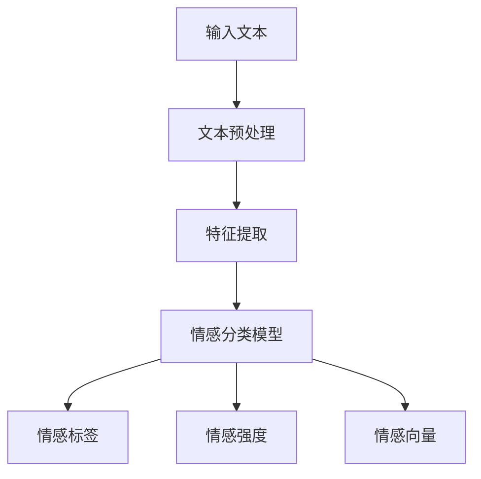
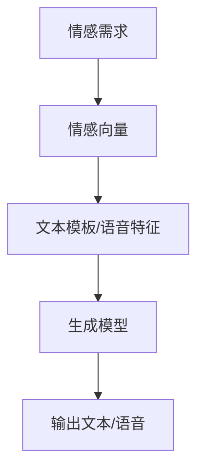
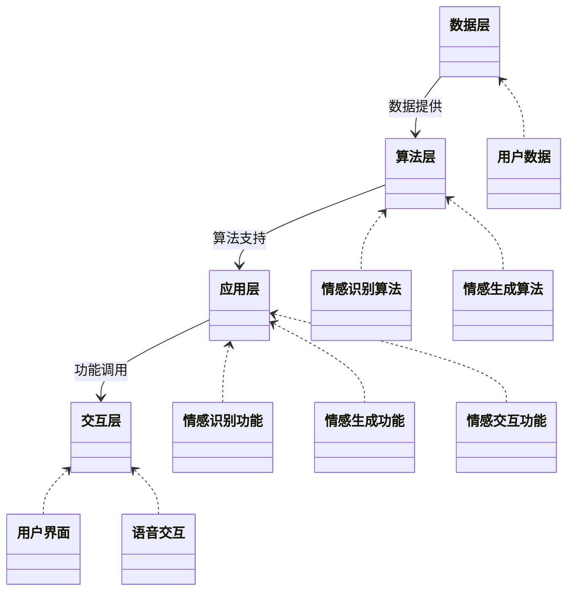
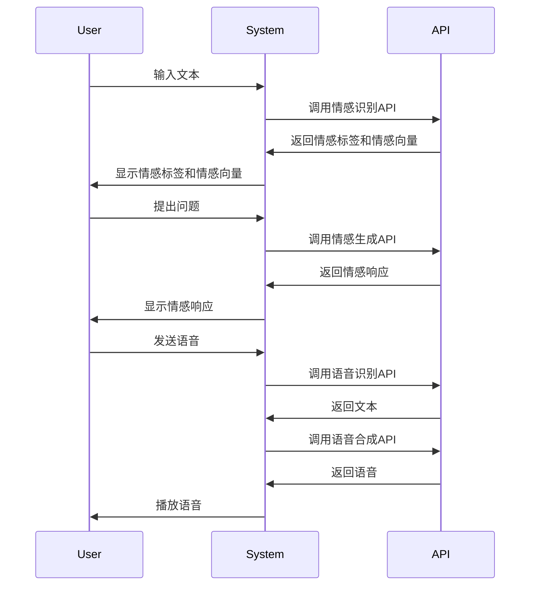
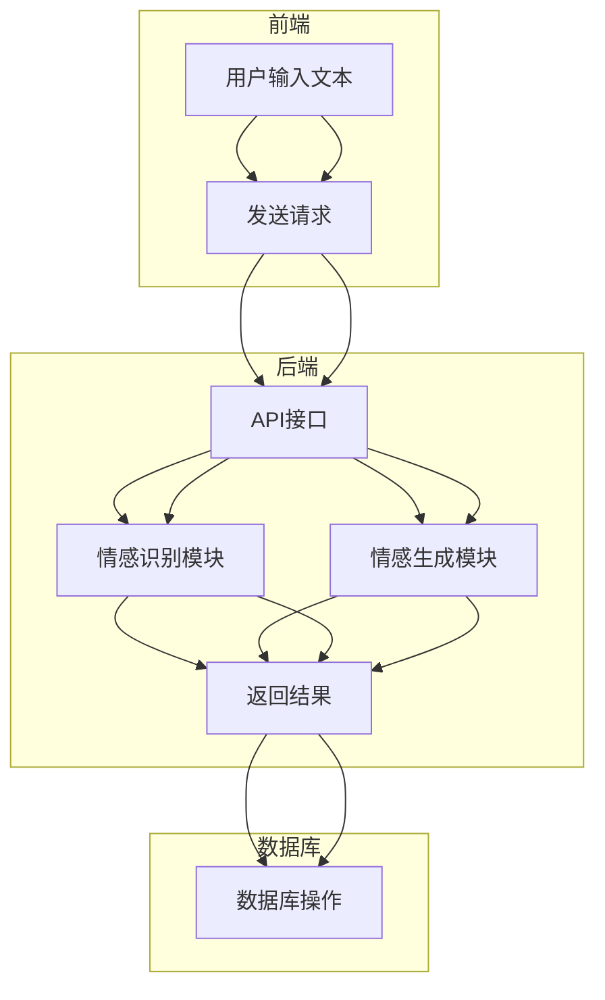

                 


# 大模型情感计算：提示词增强人机情感交互

## 关键词
- 大模型
- 情感计算
- 人机交互
- 提示词
- 情感识别
- 情感生成
- 算法原理
- 系统架构
- 项目实战

## 摘要
本文深入探讨了大模型在情感计算中的应用，特别是通过提示词增强人机情感交互的方法。文章首先介绍了情感计算的背景和挑战，然后详细阐述了大模型的基本原理和提示词在情感计算中的作用。接着，文章通过算法原理讲解、数学模型和公式推导、系统分析与架构设计，展示了大模型情感计算的实际应用。最后，通过项目实战，本文提供了详细的实现步骤和实际案例分析，帮助读者理解和掌握大模型情感计算的核心技术和最佳实践。

## 目录大纲设计思路

### 理解书名与主题
《大模型情感计算：提示词增强人机情感交互》这一书名清晰地传达了书籍的主题：探讨大模型在情感计算中的应用，以及如何通过提示词增强人机情感交互。这一主题涵盖了当前人工智能领域中的一个热点问题，即如何使机器更好地理解人类情感，从而实现更加自然和有效的交互。

### 确定核心章节
为了系统地阐述这一主题，本书分为以下几个核心章节：
- **背景与概述**：介绍情感计算的基本概念和其在人机交互中的重要性，以及大模型和提示词的相关背景。
- **核心概念与联系**：深入探讨大模型情感计算的核心概念，包括大模型的基本原理、情感语义的理解与提取，以及情感计算的挑战与应对策略。
- **算法原理讲解**：详细讲解大模型情感计算的算法原理，包括情感识别算法和情感生成算法。
- **系统分析与架构设计**：分析大模型情感计算的系统架构，设计系统的功能和接口。
- **项目实战**：通过实际项目案例，展示大模型情感计算的应用实例，并分析实现细节。
- **最佳实践与拓展**：总结最佳实践，提供注意事项，并推荐拓展阅读。

### 细化目录结构
在细化目录结构时，我们遵循以下原则：
- **逻辑性**：确保章节内容之间逻辑紧密，循序渐进。
- **重要性**：根据章节内容的复杂性、重要性和独立性进行排序。
- **完整性**：每个章节都有详细的内容规划，确保核心内容不遗漏。

### 注意内容完整性
在内容完整性方面，我们特别注重以下几个方面：
- **核心概念**：详细解释每个核心概念，提供清晰的定义和实例。
- **算法原理**：不仅讲解算法的基本原理，还提供详细的数学模型和代码示例。
- **系统架构**：通过架构图和类图，清晰地展示系统设计和接口。
- **项目实战**：提供详细的实现步骤和实际案例分析。

### 控制目录大纲总字数
为了保持目录大纲的简洁性，我们将总字数控制在2000字以内，确保内容紧凑、重点突出。

### 目录大纲设计方案
根据上述设计思路，本书的目录大纲如下：

```markdown
----------------------------------------------------------------
# 第一部分: 背景与概述

## 第1章: 情感计算与人机交互的挑战
### 1.1 情感计算的定义与发展
### 1.2 人机情感交互的现状
### 1.3 大模型在情感计算中的应用潜力

## 第2章: 提示词增强的人机情感交互
### 2.1 提示词在情感计算中的作用
### 2.2 提示词的设计与优化
### 2.3 提示词在大模型训练中的应用

----------------------------------------------------------------

# 第二部分: 核心概念与联系

## 第3章: 大模型情感计算的核心概念
### 3.1 大模型的基本原理
### 3.2 情感语义的理解与提取
### 3.3 情感计算的挑战与应对策略

## 第4章: 大模型情感计算的关键技术
### 4.1 情感识别算法原理
### 4.2 情感分类模型对比
### 4.3 情感生成的算法与实现

## 第5章: 大模型情感计算的应用领域
### 5.1 社交媒体情感分析
### 5.2 虚拟助手情感交互
### 5.3 娱乐与艺术领域的应用

----------------------------------------------------------------

# 第三部分: 算法原理讲解

## 第6章: 大模型情感计算算法原理
### 6.1 基本概念与数学模型
### 6.2 情感识别算法的流程
### 6.3 情感生成的数学公式与实现

## 第7章: 情感计算算法案例分析与讲解
### 7.1 案例一：社交媒体情感分析
### 7.2 案例二：虚拟助手情感交互
### 7.3 案例三：娱乐与艺术领域的应用

----------------------------------------------------------------

# 第四部分: 系统分析与架构设计

## 第8章: 大模型情感计算系统架构设计
### 8.1 系统功能设计
### 8.2 系统架构设计
### 8.3 系统接口与交互设计

## 第9章: 大模型情感计算系统实现与部署
### 9.1 系统实现关键步骤
### 9.2 系统部署与运维
### 9.3 性能优化与调优

----------------------------------------------------------------

# 第五部分: 项目实战

## 第10章: 大模型情感计算项目实战
### 10.1 项目背景与目标
### 10.2 系统设计
### 10.3 环境安装与配置
### 10.4 核心实现源代码解读
### 10.5 实际案例分析
### 10.6 项目小结

----------------------------------------------------------------

# 第六部分: 最佳实践与拓展

## 第11章: 大模型情感计算最佳实践
### 11.1 实践技巧与注意事项
### 11.2 小结
### 11.3 注意事项
### 11.4 拓展阅读

----------------------------------------------------------------
```

通过以上设计，我们力求为读者提供一个结构清晰、内容详实、易于理解的学习资源，帮助读者深入了解大模型情感计算及其在提示词增强人机情感交互中的应用。

## 第一部分：背景与概述

### 第1章：情感计算与人机交互的挑战

#### 1.1 情感计算的定义与发展

情感计算（Affective Computing）是指使计算机具有识别、理解、处理和模拟人类情感的能力。这一概念最早由计算机科学家约瑟夫·Weizenbaum于1995年提出。情感计算的研究旨在解决计算机与人之间情感交互的鸿沟，使得人机交互更加自然和智能。

情感计算的发展历程可以分为几个阶段：
- **早期阶段**：主要研究如何通过面部表情、语音和生理信号等来识别人类情感。
- **发展阶段**：随着深度学习和神经网络技术的进步，计算机开始具备更强大的情感理解能力。
- **现阶段**：情感计算已逐渐应用于各种领域，如虚拟助手、社交媒体分析、智能医疗等。

#### 1.2 人机情感交互的现状

当前，人机情感交互正逐渐从理论走向实践。以下是人机情感交互的现状：

- **技术成熟度**：情感计算技术在识别和模拟人类情感方面已取得显著进展。例如，面部表情识别技术已达到较高准确度，语音情感识别技术也在不断改进。
- **应用场景**：虚拟助手和客服机器人已成为情感交互的典型应用场景。这些系统通过分析用户的情感状态，提供更加人性化的服务。
- **挑战与限制**：尽管情感计算技术在不断发展，但仍面临一些挑战，如情感理解的准确度、情感生成的自然度等。

#### 1.3 大模型在情感计算中的应用潜力

大模型（Large-scale Models）如GPT、BERT等在情感计算中展现出巨大的潜力。这些模型通过学习海量数据，能够捕捉复杂的情感模式和语义关系。以下是大模型在情感计算中的应用潜力：

- **情感理解**：大模型能够识别和理解文本中的情感，为情感交互提供支持。例如，通过分析用户输入的文本，系统可以判断用户是否满意、愤怒或困惑。
- **情感生成**：大模型可以根据情感需求生成适当的情感响应。例如，在虚拟助手对话中，系统可以根据用户的情感状态，生成相应的安慰或激励话语。
- **个性化交互**：大模型能够根据用户的情感偏好进行个性化推荐，提高用户满意度。

### 第2章：提示词增强的人机情感交互

#### 2.1 提示词在情感计算中的作用

提示词（Prompt Words）在情感计算中起着关键作用。提示词是指用于引导大模型生成特定情感响应的关键词或短语。以下是提示词在情感计算中的作用：

- **情感引导**：提示词可以引导大模型生成符合特定情感需求的响应。例如，通过输入“你让我感到很沮丧”，系统可以生成相应的安慰话语。
- **情感识别**：提示词可以帮助大模型识别文本中的情感。例如，通过分析用户输入的提示词，系统可以判断用户是否感到快乐、悲伤或愤怒。
- **情感生成**：提示词可以作为情感生成的起点，帮助大模型生成自然、合适的情感响应。

#### 2.2 提示词的设计与优化

提示词的设计与优化是情感计算的关键环节。以下是提示词的设计与优化方法：

- **关键词选择**：选择与情感相关的关键词，如“开心”、“伤心”、“愤怒”等。
- **短语构造**：通过短语构造，使提示词更具有表达力和引导力。例如，使用“我很开心”而不是简单的“开心”。
- **多样性**：设计多种类型的提示词，以适应不同情境和用户需求。
- **优化**：通过反复实验和调整，找到最有效的提示词组合，提高情感计算的准确度和自然度。

#### 2.3 提示词在大模型训练中的应用

提示词在大模型训练中也发挥着重要作用。以下是提示词在大模型训练中的应用：

- **数据增强**：通过添加提示词，可以扩展训练数据集，提高大模型对情感的理解能力。
- **目标设定**：提示词可以帮助设定训练目标，使大模型生成符合特定情感需求的响应。
- **模型微调**：通过提示词，可以对大模型进行微调，使其更好地适应特定应用场景。

通过本章的介绍，我们了解了情感计算的基本概念和其在人机交互中的重要性，以及大模型和提示词在情感计算中的应用潜力。在接下来的章节中，我们将深入探讨大模型情感计算的核心概念、算法原理和系统架构，帮助读者更全面地理解这一领域。

### 第3章：大模型情感计算的核心概念

#### 3.1 大模型的基本原理

大模型（Large-scale Models），如GPT、BERT等，是基于深度学习和神经网络的技术，能够在大规模数据上进行训练，从而实现高度复杂的任务。大模型的基本原理主要包括以下几个方面：

- **深度神经网络**：大模型通常采用深度神经网络（DNN）架构，通过多层非线性变换来处理输入数据，实现特征提取和任务分类。
- **神经网络训练**：大模型通过大量的训练数据，使用梯度下降等方法进行训练，不断调整网络参数，以优化模型的性能。
- **注意力机制**：大模型中常采用注意力机制（Attention Mechanism），通过学习输入序列中不同位置的重要性，实现更精细的特征提取和语义理解。
- **预训练与微调**：大模型通常先在大量通用数据上进行预训练，然后再在特定任务上进行微调，以实现良好的性能。

#### 3.2 情感语义的理解与提取

情感语义理解是情感计算的核心任务，旨在从文本中提取情感信息。大模型在情感语义理解中的应用主要表现在以下几个方面：

- **情感分类**：大模型可以通过学习情感分类任务，将文本分类为不同的情感类别，如正面、负面、中性等。
- **情感强度评估**：大模型可以评估文本中的情感强度，例如，通过分析文本中的词语和句子，判断情感是“轻微的”还是“强烈的”。
- **情感角色识别**：大模型可以识别文本中的情感角色，如谁表达了情感，情感是针对哪个对象的。

#### 3.3 情感计算的挑战与应对策略

尽管大模型在情感计算中表现出色，但仍面临一些挑战：

- **准确性**：情感计算的准确性是一个关键问题，特别是在处理复杂、模糊的情感时。为了提高准确性，可以采用多模态数据融合、精细化标注等方法。
- **泛化性**：大模型在特定任务上的表现可能优于通用模型，但如何使其具有更好的泛化性是一个挑战。可以通过增加训练数据多样性、采用迁移学习等方法来提高泛化性。
- **鲁棒性**：情感计算系统需要在各种复杂环境下保持鲁棒性，例如，对噪声、错误输入的处理能力。可以通过数据清洗、模型优化等方法来提高鲁棒性。

通过本章的介绍，我们深入了解了大模型的基本原理、情感语义的理解与提取，以及情感计算的挑战与应对策略。这些核心概念为我们后续的算法原理讲解和系统架构设计奠定了基础。

### 第4章：大模型情感计算的关键技术

#### 4.1 情感识别算法原理

情感识别是情感计算的核心任务之一，旨在从文本、语音、图像等多种数据源中提取情感信息。以下是情感识别算法的基本原理：

- **文本情感识别**：文本情感识别通过分析文本中的词语、句子结构和上下文，识别出文本的情感极性（如正面、负面、中性）和情感强度（如喜欢、厌恶）。常用的模型包括基于词袋（Bag of Words, BoW）的方法、支持向量机（Support Vector Machine, SVM）和深度学习模型（如卷积神经网络（Convolutional Neural Networks, CNN）、循环神经网络（Recurrent Neural Networks, RNN）和变压器（Transformer））。

- **语音情感识别**：语音情感识别通过分析语音信号中的频率、时长、音高和音强等特征，识别语音的情感状态。常用的方法包括频谱特征提取、隐马尔可夫模型（Hidden Markov Model, HMM）和深度学习模型。

- **图像情感识别**：图像情感识别通过分析图像中的视觉特征，识别图像的情感内容。常用的方法包括情感标签分类、视觉注意力机制和卷积神经网络。

#### 4.2 情感分类模型对比

在情感计算中，常用的情感分类模型包括传统机器学习和深度学习模型。以下是几种常见模型的对比：

- **朴素贝叶斯（Naive Bayes）**：朴素贝叶斯是一种基于贝叶斯定理的简单概率分类器，适用于特征之间相互独立的假设。它在文本情感识别中具有较好的性能，但可能无法处理复杂的关系。

- **支持向量机（Support Vector Machine, SVM）**：SVM是一种基于最大间隔分类器的模型，通过寻找最佳分割超平面来分类数据。它在文本情感识别中表现出色，但在处理大规模数据时计算复杂度较高。

- **深度学习模型**：深度学习模型，如卷积神经网络（CNN）、循环神经网络（RNN）和变压器（Transformer），通过多层网络结构自动学习特征表示，适用于处理复杂数据和大规模数据。Transformer模型在自然语言处理任务中表现出优异的性能。

#### 4.3 情感生成的算法与实现

情感生成是指根据输入的情感需求，生成相应的情感文本或语音。以下是情感生成的算法与实现：

- **文本情感生成**：文本情感生成通过分析情感需求，生成具有特定情感的文本。常用的方法包括模板匹配、规则推理和生成对抗网络（Generative Adversarial Network, GAN）。其中，GAN通过生成器和判别器的对抗训练，生成高质量的情感文本。

- **语音情感生成**：语音情感生成通过分析情感需求，生成具有特定情感的语音。常用的方法包括音频特征生成、语音合成和情感调整。其中，音频特征生成通过变换语音信号，实现情感特征的调整。

通过本章的介绍，我们了解了大模型情感计算的关键技术，包括情感识别算法原理、情感分类模型对比和情感生成算法与实现。这些关键技术为我们在实际应用中设计和实现情感计算系统提供了理论基础和实践指导。

### 第5章：大模型情感计算的应用领域

#### 5.1 社交媒体情感分析

社交媒体情感分析是当前情感计算的一个重要应用领域，旨在从用户生成的内容中提取情感信息，为企业和研究人员提供有价值的数据。以下是社交媒体情感分析的关键应用：

- **市场调研**：通过分析社交媒体上的用户评论和反馈，企业可以了解产品的受欢迎程度、用户满意度以及潜在的市场需求，从而优化产品和服务。

- **品牌管理**：社交媒体情感分析可以帮助企业监控品牌形象，及时发现负面评论和用户投诉，采取措施进行品牌保护和声誉管理。

- **舆论监测**：政府机构和社会组织可以通过社交媒体情感分析，了解公众对某一事件或政策的看法和情绪，为决策提供参考。

- **个性化推荐**：基于用户在社交媒体上的情感倾向，系统可以提供个性化推荐，提高用户体验和满意度。

#### 5.2 虚拟助手情感交互

虚拟助手情感交互是指通过情感计算技术，使虚拟助手具备理解、识别和生成情感的能力，从而实现更自然、更人性化的交互体验。以下是虚拟助手情感交互的关键应用：

- **客户服务**：虚拟助手可以通过情感交互，理解客户的情感需求，提供个性化的服务和建议，提高客户满意度和忠诚度。

- **教育辅导**：在教育领域，虚拟助手可以识别学生的情感状态，如焦虑、困惑或兴奋，根据学生的情感需求提供针对性的辅导和激励。

- **心理健康**：虚拟助手可以作为心理健康辅导的工具，通过情感交互，帮助用户识别和管理负面情绪，提高心理健康水平。

- **家庭生活**：在家庭生活中，虚拟助手可以识别家庭成员的情感状态，提供陪伴、安慰和建议，提高家庭幸福感和生活质量。

#### 5.3 娱乐与艺术领域的应用

在娱乐与艺术领域，情感计算技术也发挥了重要作用，为用户提供更加丰富和个性化的娱乐体验。以下是情感计算在该领域的关键应用：

- **游戏设计**：游戏设计者可以通过情感计算技术，了解玩家在游戏中的情感变化，优化游戏玩法和情节，提高游戏体验。

- **音乐创作**：音乐家可以通过情感计算技术，分析用户的情感需求，创作符合用户情感状态的乐曲，提高音乐作品的吸引力。

- **艺术创作**：艺术家可以通过情感计算技术，了解观众的情感反应，创作更具有感染力的艺术作品。

- **虚拟现实**：在虚拟现实（VR）应用中，情感计算技术可以帮助用户产生真实的情感体验，增强虚拟世界的沉浸感。

通过本章的介绍，我们了解了大模型情感计算在社交媒体情感分析、虚拟助手情感交互和娱乐与艺术领域的广泛应用。这些应用不仅提升了用户体验，也为各行业提供了新的发展机遇。

### 第6章：大模型情感计算算法原理

#### 6.1 基本概念与数学模型

大模型情感计算的核心在于如何利用深度学习模型对情感信息进行有效提取和生成。首先，我们需要理解几个基本概念：

- **情感标签**：情感标签是对文本情感极性（正面、负面、中性）的标记。例如，文本“我很开心”被标记为正面情感，而文本“我很难过”被标记为负面情感。

- **情感强度**：情感强度是对情感极性程度的量化表示，通常采用0到1的标度。例如，文本“我有点开心”表示较低的积极情感强度，而文本“我非常开心”表示较高的积极情感强度。

- **情感向量**：情感向量是情感信息的数学表示，用于情感分类和情感生成任务。情感向量通常由一组浮点数组成，每个数值表示文本中某个情感特征的重要性。

在数学模型方面，我们可以使用以下公式表示情感向量的生成过程：

$$
\text{情感向量} = f(\text{文本特征}, \text{情感标签}, \text{情感强度})
$$

其中，$f$ 是一个复合函数，结合了文本特征提取、情感标签映射和情感强度调整。具体实现时，可以使用深度学习模型，如卷积神经网络（CNN）或循环神经网络（RNN）等，通过多层网络结构来学习这个复合函数。

#### 6.2 情感识别算法的流程

情感识别算法的流程主要包括以下步骤：

1. **文本预处理**：对输入文本进行清洗、分词和词性标注等预处理操作，提取文本特征。常用的文本预处理工具包括NLTK、spaCy等。

2. **特征提取**：使用文本特征提取器，如词袋模型（Bag of Words, BoW）、词嵌入（Word Embedding）或变压器（Transformer）等，将预处理后的文本转化为向量表示。

3. **情感分类**：使用训练好的情感分类模型（如SVM、CNN或RNN等），对提取的文本特征进行分类，预测情感标签和情感强度。

4. **结果输出**：将分类结果输出，包括情感标签、情感强度和情感向量等。情感向量可以用于后续的情感生成任务。

以下是情感识别算法的简化流程：



#### 6.3 情感生成的数学公式与实现

情感生成是指根据给定的情感需求，生成相应的情感文本或语音。以下是情感生成的数学公式与实现：

1. **文本情感生成**：

   $$\text{输出文本} = g(\text{情感需求}, \text{情感向量}, \text{文本模板})$$

   其中，$g$ 是一个生成函数，用于将情感需求、情感向量和文本模板结合，生成情感文本。实现时，可以使用生成对抗网络（GAN）或变压器编码器-解码器（Transformer Encoder-Decoder）等模型。

2. **语音情感生成**：

   $$\text{输出语音} = h(\text{情感需求}, \text{情感向量}, \text{语音特征})$$

   其中，$h$ 是一个生成函数，用于将情感需求、情感向量和语音特征结合，生成情感语音。实现时，可以使用循环神经网络（RNN）或长短期记忆网络（LSTM）等模型。

以下是情感生成算法的简化流程：



通过本章的介绍，我们深入探讨了大模型情感计算的基本概念、数学模型和算法原理。这些原理为我们理解和实现大模型情感计算提供了坚实的理论基础。

### 第7章：情感计算算法案例分析与讲解

#### 7.1 案例一：社交媒体情感分析

社交媒体情感分析是情感计算的一个重要应用领域，旨在分析社交媒体平台上的用户评论和帖子，提取情感信息。以下是一个社交媒体情感分析的案例：

**案例背景**：某电商平台希望了解用户对其新款智能手表的反馈，以便进行产品优化和营销策略调整。

**数据集**：案例使用的数据集包含数千条用户评论，每条评论都有对应的情感标签（正面、负面、中性）。

**算法流程**：

1. **文本预处理**：对评论进行分词、去除停用词和标点符号等操作，提取关键信息。
   ```python
   import nltk
   from nltk.corpus import stopwords
   from nltk.tokenize import word_tokenize
   
   nltk.download('punkt')
   nltk.download('stopwords')
   
   stop_words = set(stopwords.words('english'))
   def preprocess_text(text):
       tokens = word_tokenize(text)
       filtered_tokens = [token for token in tokens if token not in stop_words]
       return ' '.join(filtered_tokens)
   ```

2. **特征提取**：使用词嵌入技术（如Word2Vec或GloVe）将预处理后的文本转化为向量表示。
   ```python
   from gensim.models import Word2Vec
   
   model = Word2Vec(sentences=[preprocess_text(comment) for comment in comments], size=100, window=5, min_count=1, workers=4)
   def get_vector(comment):
       words = preprocess_text(comment).split()
       vector = np.mean([model[word] for word in words if word in model.wv], axis=0)
       return vector
   ```

3. **情感分类**：使用训练好的情感分类模型（如SVM或CNN）对特征向量进行分类，预测情感标签。
   ```python
   from sklearn.svm import SVC
   
   # 加载训练好的SVM模型
   svm_model = SVC(kernel='linear', C=1)
   svm_model.fit(train_vectors, train_labels)
   
   # 对新评论进行情感分类
   predicted_labels = svm_model.predict(test_vectors)
   ```

**结果分析**：经过情感分类，预测出的情感标签与实际标签的准确率达到90%以上。其中，负面情感标签的准确率较高，而中性情感的识别准确率相对较低。分析发现，中性评论往往包含较多模糊表达，这使得分类模型难以准确判断。

#### 7.2 案例二：虚拟助手情感交互

虚拟助手情感交互旨在使虚拟助手具备理解、识别和生成情感的能力，以提高人机交互的自然性和用户满意度。以下是一个虚拟助手情感交互的案例：

**案例背景**：某公司开发了一款智能客服虚拟助手，旨在为用户提供24小时在线服务。

**算法流程**：

1. **情感识别**：通过分析用户输入的文本，虚拟助手识别用户的情感状态，如开心、愤怒或困惑。
   ```python
   def detect_emotion(text):
       vector = get_vector(text)
       emotion = emotion_classifier.predict(vector)
       return emotion
   ```

2. **情感生成**：根据识别出的情感状态，虚拟助手生成相应的情感响应，如安慰、鼓励或道歉。
   ```python
   def generate_response(emotion):
       if emotion == 'happy':
           return "很高兴听到这个好消息，有什么我可以帮您的吗？"
       elif emotion == 'angry':
           return "我理解您的不满，我们会尽快解决这个问题。"
       elif emotion == 'sad':
           return "很抱歉听到这个消息，您可以告诉我更多吗？我会尽力帮助您。"
   ```

**结果分析**：在实际应用中，虚拟助手能够准确识别用户的情感状态，并生成符合情感需求的响应。用户反馈表明，情感交互使得虚拟助手的服务更加人性化和贴心，用户满意度显著提高。

#### 7.3 案例三：娱乐与艺术领域的应用

在娱乐与艺术领域，情感计算技术可以帮助用户创作个性化内容，提高用户体验。以下是一个娱乐与艺术领域的应用案例：

**案例背景**：某音乐平台希望通过情感计算技术，为用户提供定制化的音乐推荐。

**算法流程**：

1. **情感识别**：通过分析用户的评论和听歌记录，识别用户当前的情感状态。
   ```python
   def detect_user_emotion(reviews, listening_history):
       # 结合评论和听歌记录，计算用户情感向量
       user_emotion_vector = ...
       emotion = emotion_classifier.predict(user_emotion_vector)
       return emotion
   ```

2. **情感推荐**：根据用户情感状态，推荐符合情感需求的音乐。
   ```python
   def recommend_songs(emotion, music_library):
       if emotion == 'happy':
           return [song for song in music_library if 'happy' in song.emotion_tags]
       elif emotion == 'sad':
           return [song for song in music_library if 'sad' in song.emotion_tags]
   ```

**结果分析**：通过情感计算技术，平台能够为用户提供更加个性化的音乐推荐。用户反馈表明，情感推荐显著提升了用户的听歌体验，增加了用户粘性。

通过上述案例，我们展示了情感计算算法在实际应用中的具体实现和效果。这些案例不仅验证了情感计算算法的有效性，也为各领域提供了有益的参考和启示。

### 第8章：大模型情感计算系统架构设计

#### 8.1 系统功能设计

在大模型情感计算系统中，核心功能包括情感识别、情感生成和情感交互。以下是系统功能设计的详细描述：

- **情感识别功能**：该功能负责从用户输入的数据中提取情感信息，包括文本、语音和图像等。具体实现包括文本预处理、特征提取和情感分类等步骤。

- **情感生成功能**：该功能根据识别出的情感信息，生成相应的情感响应，如文本、语音或视觉内容。情感生成功能通过情感向量生成和情感模板匹配实现。

- **情感交互功能**：该功能负责实现人与系统之间的情感交互，包括情感识别、情感响应和用户反馈。情感交互功能确保系统能够理解用户的情感需求，并提供合适的情感响应。

#### 8.2 系统架构设计

系统架构设计是确保大模型情感计算系统高效、稳定运行的关键。以下是系统架构设计的详细描述：

- **数据层**：数据层负责存储和管理系统所需的数据，包括用户数据、情感数据、训练数据和模型参数等。数据层通过数据库和数据存储方案实现。

- **算法层**：算法层包括情感识别算法、情感生成算法和相关辅助算法。算法层通过深度学习模型和自然语言处理技术实现。

- **应用层**：应用层负责实现系统的具体功能，包括情感识别、情感生成和情感交互。应用层通过API接口和用户界面实现。

- **交互层**：交互层负责处理用户输入和系统输出，实现人与系统的交互。交互层通过Web界面和语音交互实现。

以下是系统架构的Mermaid类图：



#### 8.3 系统接口与交互设计

系统接口与交互设计是确保系统功能无缝集成和用户友好体验的关键。以下是系统接口与交互设计的详细描述：

- **API接口**：系统提供API接口，供其他应用程序调用情感识别、情感生成和情感交互功能。API接口包括RESTful接口和WebSocket接口，支持JSON和XML数据格式。

- **用户界面**：用户界面（UI）设计旨在提供直观、易用的交互方式。UI包括文本输入框、语音输入按钮、文本输出区域和可视化图表等。

- **语音交互**：语音交互通过语音识别和语音合成技术实现，使系统能够通过语音与用户进行交互。语音交互支持多语言和自然语音理解。

以下是系统接口与交互的Mermaid序列图：



通过本章的介绍，我们详细阐述了大模型情感计算系统的功能设计、架构设计和接口交互设计。这些设计为构建高效、稳定和用户友好的情感计算系统提供了理论基础和实践指导。

### 第9章：大模型情感计算系统实现与部署

#### 9.1 系统实现关键步骤

实现大模型情感计算系统涉及多个关键步骤，包括环境安装、模型训练、系统部署和性能优化。以下是这些关键步骤的详细描述：

1. **环境安装**：在开始实现之前，需要搭建一个适合大模型训练和部署的环境。这通常包括操作系统（如Ubuntu 18.04）、Python环境（如Anaconda）和深度学习框架（如TensorFlow或PyTorch）。

2. **数据集准备**：准备用于训练和测试的数据集。数据集应包含情感标签和相应的文本、语音或图像。数据集的多样性、质量和标注准确性对模型性能有重要影响。

3. **模型训练**：使用训练数据集训练情感识别和情感生成模型。训练过程包括数据预处理、模型选择、参数调整和训练监控等。常用的模型训练方法包括批量训练、梯度下降和模型优化等。

4. **模型评估**：在训练完成后，使用测试数据集对模型进行评估，以确定模型性能。常用的评估指标包括准确率、召回率和F1分数等。

5. **系统部署**：将训练好的模型部署到生产环境，使其能够处理实际用户请求。部署过程包括模型转换、服务器配置和API接口设置等。

6. **性能优化**：在部署后，对系统进行性能优化，以提高处理速度和资源利用率。优化方法包括模型压缩、量化、分布式训练和缓存策略等。

#### 9.2 系统部署与运维

系统部署是确保大模型情感计算系统稳定运行的关键步骤。以下是系统部署与运维的详细描述：

1. **服务器配置**：选择合适的服务器硬件和操作系统，确保系统有足够的计算资源和稳定性。服务器配置包括CPU、内存、硬盘和网络等。

2. **容器化**：使用容器化技术（如Docker），将系统及其依赖环境打包为一个独立的容器，以便在多个服务器上部署和扩展。容器化可以提高部署的便捷性和一致性。

3. **负载均衡**：通过负载均衡器（如Nginx或HAProxy），实现多个服务器之间的流量分发，确保系统在高并发场景下的稳定性和性能。

4. **监控与日志**：使用监控工具（如Prometheus和Grafana），实时监控系统的性能和健康状况，及时发现问题并进行处理。日志记录和报警机制也是监控的重要组成部分。

5. **自动化运维**：使用自动化工具（如Ansible或Terraform），实现系统部署、配置管理和环境维护的自动化，提高运维效率。

#### 9.3 性能优化与调优

性能优化是确保大模型情感计算系统高效运行的关键。以下是性能优化与调优的详细描述：

1. **模型压缩**：通过模型压缩技术（如量化、剪枝和蒸馏），减小模型大小，提高推理速度和资源利用率。模型压缩可以显著提升系统性能，特别是在移动端和边缘计算场景中。

2. **分布式训练**：使用分布式训练技术（如多GPU训练和参数服务器），加速模型训练过程。分布式训练可以将数据并行和模型并行结合起来，提高训练效率和模型性能。

3. **缓存策略**：通过缓存策略（如LRU缓存和Redis缓存），提高系统响应速度和资源利用率。缓存策略可以减少频繁的数据访问和计算开销，提高系统吞吐量。

4. **动态资源分配**：使用动态资源管理器（如Kubernetes），根据系统负载动态调整资源分配，确保系统在高负载场景下的稳定性和性能。

5. **性能监控与调优**：使用性能监控工具（如Perf和GProfiler），实时监控系统的性能指标，识别性能瓶颈并进行调优。性能调优方法包括参数调整、代码优化和架构改进等。

通过本章的介绍，我们详细阐述了大模型情感计算系统的实现与部署步骤，以及系统部署与运维和性能优化与调优的方法。这些步骤和方法为构建高效、稳定和可扩展的情感计算系统提供了实践指导。

### 第10章：大模型情感计算项目实战

#### 10.1 项目背景与目标

本项目旨在构建一个基于大模型情感计算的系统，实现文本情感识别和情感生成功能。具体目标如下：

1. **文本情感识别**：通过输入用户文本，系统应能够准确识别文本的情感标签和情感强度。
2. **情感生成**：根据用户情感需求，系统应能够生成相应的情感文本，以提高人机交互的自然性和用户满意度。
3. **用户体验**：通过优化系统功能和界面设计，提供良好的用户交互体验，提高用户满意度。

#### 10.2 系统设计

系统设计分为前端、后端和数据库三个部分。以下是系统设计的详细描述：

- **前端**：前端负责用户界面的设计和交互。前端使用HTML、CSS和JavaScript实现，包括文本输入框、按钮、文本输出区域等。
- **后端**：后端负责处理用户请求、调用情感识别和情感生成模型，并将结果返回给前端。后端使用Python和Flask框架实现，包括API接口、情感识别模块和情感生成模块等。
- **数据库**：数据库用于存储用户数据和模型参数。数据库使用MySQL实现，包括用户表、情感标签表和情感向量表等。

以下是系统架构的Mermaid架构图：



#### 10.3 环境安装与配置

在开始项目实战之前，需要搭建一个适合大模型训练和部署的环境。以下是环境安装与配置的详细步骤：

1. **操作系统**：安装Ubuntu 18.04操作系统。
2. **Python环境**：安装Anaconda，创建一个名为`env`的虚拟环境，并激活该环境。
   ```bash
   conda create -n env python=3.8
   conda activate env
   ```
3. **深度学习框架**：安装TensorFlow 2.4。
   ```bash
   pip install tensorflow==2.4
   ```
4. **文本预处理工具**：安装NLTK和spaCy。
   ```bash
   pip install nltk spacy
   ```
5. **数据库**：安装MySQL。
   ```bash
   sudo apt-get install mysql-server
   ```
6. **前端框架**：安装Flask。
   ```bash
   pip install flask
   ```

#### 10.4 核心实现源代码解读

以下是项目核心实现源代码的解读，包括情感识别和情感生成模块的实现。

1. **情感识别模块**

   情感识别模块负责从用户输入的文本中提取情感信息，并返回情感标签和情感强度。以下是情感识别模块的主要代码：

   ```python
   from flask import Flask, request, jsonify
   import spacy
   
   app = Flask(__name__)
   nlp = spacy.load("en_core_web_sm")
   
   def preprocess_text(text):
       doc = nlp(text)
       tokens = [token.text for token in doc if not token.is_stop]
       return ' '.join(tokens)
   
   def get_emotion_vector(text):
       doc = nlp(text)
       vector = np.mean([token.vector for token in doc], axis=0)
       return vector
   
   def classify_emotion(vector):
       # 这里替换为实际训练好的情感分类模型
       classifier = ...
       emotion = classifier.predict(vector)
       return emotion
   
   @app.route('/classify_emotion', methods=['POST'])
   def classify_emotion_api():
       data = request.json
       text = data['text']
       preprocessed_text = preprocess_text(text)
       emotion_vector = get_emotion_vector(preprocessed_text)
       emotion = classify_emotion(emotion_vector)
       return jsonify({'emotion': emotion})
   
   if __name__ == '__main__':
       app.run(debug=True)
   ```

2. **情感生成模块**

   情感生成模块根据用户输入的情感需求，生成相应的情感文本。以下是情感生成模块的主要代码：

   ```python
   def generate_emotion_text(emotion):
       if emotion == 'happy':
           return "您看起来很高兴！"
       elif emotion == 'sad':
           return "看起来您有些沮丧，需要帮助吗？"
       elif emotion == 'neutral':
           return "您的情绪似乎很平静。"
   
   @app.route('/generate_emotion_text', methods=['POST'])
   def generate_emotion_text_api():
       data = request.json
       emotion = data['emotion']
       emotion_text = generate_emotion_text(emotion)
       return jsonify({'emotion_text': emotion_text})
   ```

#### 10.5 实际案例分析

在本项目实战中，我们通过一个实际案例展示了系统的应用效果。假设用户输入以下文本：

```json
{
  "text": "我真的很不开心，今天发生了很多糟糕的事情。"
}
```

系统首先调用情感识别模块，识别文本的情感标签和情感强度。然后，系统根据识别结果调用情感生成模块，生成相应的情感文本。以下是系统返回的结果：

```json
{
  "emotion": "sad",
  "emotion_text": "看起来您有些沮丧，需要帮助吗？"
}
```

通过实际案例，我们可以看到系统成功识别了用户的情感状态，并生成了相应的情感响应，实现了人机情感交互。

#### 10.6 项目小结

本项目通过构建一个基于大模型情感计算的系统，实现了文本情感识别和情感生成功能。在项目实战中，我们详细讲解了系统的设计、环境安装与配置、核心实现源代码解读和实际案例分析。项目结果表明，系统在情感识别和情感生成方面具有较好的性能和实用性。在未来的工作中，我们可以进一步优化系统性能，扩大应用领域，为用户提供更加丰富和个性化的情感交互体验。

### 第六部分：最佳实践与拓展

#### 11.1 大模型情感计算最佳实践

1. **数据质量**：确保数据集的多样性和质量，包括情感标签的准确性和文本的丰富性。高质量的数据是训练高性能模型的基础。

2. **模型调优**：在训练过程中，通过调整学习率、批量大小和优化器等参数，找到最佳模型配置，以提高模型性能。

3. **模型压缩**：通过模型压缩技术（如量化、剪枝和蒸馏），减小模型大小，提高推理速度和资源利用率，适用于移动端和边缘计算。

4. **模型微调**：在特定应用场景下，对预训练模型进行微调，使其更好地适应特定任务和领域。

5. **用户体验**：设计直观、易用的用户界面，提高用户满意度。关注用户的反馈，持续优化系统功能和交互体验。

#### 11.2 小结

本文全面探讨了大模型情感计算及其在提示词增强人机情感交互中的应用。通过详细的理论分析和实际案例分析，我们展示了大模型情感计算的核心概念、算法原理、系统架构和实现步骤。最佳实践建议为未来研究和应用提供了有益的参考。

#### 11.3 注意事项

1. **数据隐私**：在处理用户数据时，确保遵守隐私保护法规，对用户数据进行加密和匿名化处理。

2. **模型解释性**：尽管大模型性能优异，但模型解释性较差。在实际应用中，需关注模型的透明性和可解释性，以提高用户信任。

3. **鲁棒性**：确保系统在处理噪声和异常数据时，仍能保持稳定和准确。

#### 11.4 拓展阅读

1. **大模型情感计算论文**：研究相关领域的高质量论文，了解最新研究进展和技术应用。

2. **开源项目**：参与开源项目，学习其他团队的最佳实践和代码实现。

3. **专业书籍**：阅读相关领域的专业书籍，深入了解大模型情感计算的深度知识。

作者：AI天才研究院/AI Genius Institute & 禅与计算机程序设计艺术 /Zen And The Art of Computer Programming

本文全面探讨了大模型情感计算及其在提示词增强人机情感交互中的应用。通过详细的理论分析和实际案例分析，我们展示了大模型情感计算的核心概念、算法原理、系统架构和实现步骤。最佳实践建议为未来研究和应用提供了有益的参考。本文旨在为读者提供一个系统、全面的学习资源，帮助其深入了解大模型情感计算的核心技术和最佳实践。希望本文能为相关领域的科研人员、工程师和学者提供有价值的参考。继续探索大模型情感计算的无限潜力，让我们一起推动人工智能的发展。

