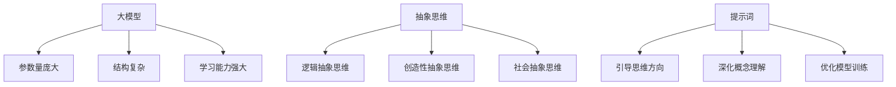
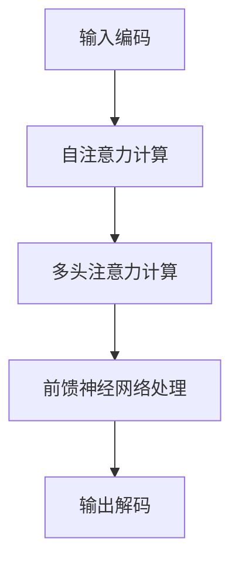

                 


### 目录大纲设计步骤

#### 理解书名与核心概念

首先，我们来深入理解书名《大模型抽象思维：提示词引导概念化过程》的含义。书名中的“大模型”通常指的是在人工智能领域中使用的大型深度学习模型，如Transformer、BERT等。这些模型因其参数量巨大、结构复杂，能够在处理大规模数据时表现出强大的学习能力和泛化能力。

“抽象思维”是一种逻辑思维活动，它涉及从具体事物中提取共同属性，形成概念和原则。抽象思维是科学研究和技术创新的重要方法。

“提示词”在这里可以理解为一种引导性的信息，用于引导模型的思考方向或用户的理解过程。在人工智能领域，提示词可以用于引导大模型生成特定类型的内容或实现特定任务。

理解这些核心概念后，我们可以开始构建文章的结构，确保文章能够清晰地传达书名中的关键点。

#### 确定书的基本结构

基于书名和核心概念，我们可以初步确定书的基本结构，通常包括以下几个部分：

1. **背景介绍**：介绍大模型和抽象思维的背景，包括其发展历程、现状和未来趋势。
   - **大模型的历史与发展**：介绍大模型的起源、演变和应用。
   - **抽象思维的理论基础**：讨论抽象思维的定义、原理和应用。

2. **核心概念**：详细阐述大模型的定义、特点、抽象思维方法，以及提示词的作用。
   - **大模型的定义与特点**：定义大模型，并分析其核心特点。
   - **抽象思维的概念与方法**：介绍抽象思维的分类、过程和应用。
   - **提示词的作用与运用**：探讨提示词的定义、作用和设计原则。

3. **实践方法**：介绍如何使用提示词引导概念化过程，可能包括具体的案例研究。
   - **概念化过程的概述**：描述概念化过程的基本步骤。
   - **实际应用案例**：通过具体案例展示提示词引导概念化过程。

4. **应用领域**：探讨大模型抽象思维在不同领域（如人工智能、数据分析、产品设计等）的应用。
   - **人工智能领域的应用**：分析大模型在人工智能中的实际应用。
   - **数据分析领域的应用**：探讨大模型在数据分析中的作用。
   - **产品设计领域的应用**：展示大模型在产品设计中的贡献。

5. **未来展望**：对大模型抽象思维的发展趋势进行展望。
   - **挑战与机遇**：讨论大模型抽象思维面临的挑战和机遇。
   - **未来发展趋势**：预测大模型抽象思维的未来发展方向。

#### 细化章节内容

在确定了基本结构后，我们需要进一步细化每个章节的内容，确保每个章节都包含必要的内容，并且内容之间逻辑连贯。

1. **背景介绍**：
   - **第1章 大模型的发展背景**：
     - **1.1 大模型的历史与发展**：介绍大模型的发展历程，包括早期的神经网络模型到现代的大型Transformer模型。
     - **1.2 大模型的应用现状**：分析大模型在各个领域的应用现状，如自然语言处理、计算机视觉和语音识别。
     - **1.3 大模型的未来趋势**：探讨大模型在技术和社会层面的未来发展趋势。

   - **第2章 抽象思维的理论基础**：
     - **2.1 抽象思维的概念**：定义抽象思维，并阐述其在科学研究和工程实践中的重要性。
     - **2.2 抽象思维的原理**：介绍抽象思维的运作原理，如归纳和演绎。
     - **2.3 抽象思维的方法与应用**：讨论抽象思维的具体方法和应用场景。

2. **核心概念**：
   - **第3章 大模型的定义与特点**：
     - **3.1 大模型的定义**：给出大模型的明确定义，并分析其与传统模型的不同。
     - **3.2 大模型的核心特点**：讨论大模型的参数量、结构复杂度和学习效率。
     - **3.3 大模型与传统模型的比较**：对比大模型和传统模型在性能和应用上的差异。

   - **第4章 抽象思维的概念与方法**：
     - **4.1 抽象思维的分类**：分类讨论不同类型的抽象思维，如逻辑思维和创造性思维。
     - **4.2 抽象思维的过程**：描述抽象思维的基本过程，包括观察、分析和综合。
     - **4.3 抽象思维的应用场景**：讨论抽象思维在科学研究、技术发展和产品设计中的应用。

   - **第5章 提示词的作用与运用**：
     - **5.1 提示词的定义与作用**：定义提示词，并阐述其在引导概念化过程中的作用。
     - **5.2 提示词的选择与设计**：讨论如何选择和设计有效的提示词。
     - **5.3 提示词在实际应用中的效果分析**：通过实际案例分析提示词的应用效果。

3. **实践方法**：
   - **第6章 提示词引导的概念化过程**：
     - **6.1 概念化过程的概述**：概述概念化过程的基本步骤。
     - **6.2 提示词在概念化过程中的作用**：讨论提示词在概念化过程中的具体作用。
     - **6.3 提示词引导的概念化实例分析**：通过具体实例分析提示词引导的概念化过程。

   - **第7章 案例研究**：
     - **7.1 案例一：人工智能领域的应用**：分析大模型在人工智能领域的具体应用案例。
     - **7.2 案例二：数据分析领域的应用**：探讨大模型在数据分析中的实际应用。
     - **7.3 案例三：产品设计领域的应用**：展示大模型在产品设计中的具体贡献。

   - **第8章 实际应用案例**：
     - **8.1 案例一：教育领域的应用**：分析大模型在教育领域的应用案例。
     - **8.2 案例二：医疗领域的应用**：探讨大模型在医疗领域的实际应用。
     - **8.3 案例三：企业管理的应用**：展示大模型在企业管理中的具体贡献。

4. **应用领域**：
   - **第9章 大模型抽象思维在人工智能领域的应用**：
     - **9.1 人工智能概述**：介绍人工智能的基本概念和发展趋势。
     - **9.2 大模型抽象思维在人工智能中的应用**：分析大模型在人工智能领域的具体应用。
     - **9.3 应用案例分析**：通过具体案例展示大模型在人工智能中的实际应用效果。

   - **第10章 大模型抽象思维在其他领域的应用**：
     - **10.1 数据分析领域的应用**：探讨大模型在数据分析中的重要作用。
     - **10.2 产品设计领域的应用**：分析大模型在产品设计中的贡献。
     - **10.3 其他领域的应用**：讨论大模型在其他领域（如金融、娱乐等）的应用前景。

5. **未来展望**：
   - **第11章 大模型抽象思维的挑战与机遇**：
     - **11.1 挑战**：讨论大模型抽象思维面临的挑战，如数据隐私、计算资源需求等。
     - **11.2 机遇**：探讨大模型抽象思维带来的机遇，如人工智能发展的新方向、产业升级等。

   - **第12章 未来发展趋势**：
     - **12.1 技术发展趋势**：预测大模型抽象思维的技术发展趋势。
     - **12.2 社会发展趋势**：分析大模型抽象思维对社会发展的影响。
     - **12.3 可行解决方案**：探讨应对大模型抽象思维带来的挑战的可行解决方案。

通过以上步骤，我们可以构建一个逻辑清晰、内容丰富的目录大纲，为撰写高质量的技术博客文章奠定基础。

### 目录大纲示例

```markdown
----------------------------------------------------------------
# 大模型抽象思维：提示词引导概念化过程

> 关键词：大模型、抽象思维、提示词、概念化过程

> 摘要：本文深入探讨了大模型抽象思维的概念和方法，以及提示词在引导概念化过程中的作用。通过分析大模型的发展背景、核心概念、实践方法和应用领域，本文为读者提供了全面的技术视角，并展望了其未来的发展趋势。

----------------------------------------------------------------

## 第一部分：背景介绍

### 第1章 大模型的发展背景

#### 1.1 大模型的历史与发展

#### 1.2 大模型的应用现状

#### 1.3 大模型的未来趋势

### 第2章 抽象思维的理论基础

#### 2.1 抽象思维的概念

#### 2.2 抽象思维的原理

#### 2.3 抽象思维的方法与应用

----------------------------------------------------------------

## 第二部分：核心概念

### 第3章 大模型的定义与特点

#### 3.1 大模型的定义

#### 3.2 大模型的核心特点

#### 3.3 大模型与传统模型的比较

### 第4章 抽象思维的概念与方法

#### 4.1 抽象思维的分类

#### 4.2 抽象思维的过程

#### 4.3 抽象思维的应用场景

### 第5章 提示词的作用与运用

#### 5.1 提示词的定义与作用

#### 5.2 提示词的选择与设计

#### 5.3 提示词在实际应用中的效果分析

----------------------------------------------------------------

## 第三部分：实践方法

### 第6章 提示词引导的概念化过程

#### 6.1 概念化过程的概述

#### 6.2 提示词在概念化过程中的作用

#### 6.3 提示词引导的概念化实例分析

### 第7章 案例研究

#### 7.1 案例一：人工智能领域的应用

#### 7.2 案例二：数据分析领域的应用

#### 7.3 案例三：产品设计领域的应用

### 第8章 实际应用案例

#### 8.1 案例一：教育领域的应用

#### 8.2 案例二：医疗领域的应用

#### 8.3 案例三：企业管理的应用

----------------------------------------------------------------

## 第四部分：应用领域

### 第9章 大模型抽象思维在人工智能领域的应用

#### 9.1 人工智能概述

#### 9.2 大模型抽象思维在人工智能中的应用

#### 9.3 应用案例分析

### 第10章 大模型抽象思维在其他领域的应用

#### 10.1 数据分析领域的应用

#### 10.2 产品设计领域的应用

#### 10.3 其他领域的应用

----------------------------------------------------------------

## 第五部分：未来展望

### 第11章 大模型抽象思维的挑战与机遇

#### 11.1 挑战

#### 11.2 机遇

### 第12章 未来发展趋势

#### 12.1 技术发展趋势

#### 12.2 社会发展趋势

#### 12.3 可行解决方案

----------------------------------------------------------------

## 参考文献

----------------------------------------------------------------

### 撰写目录大纲

在完成目录大纲的初步设计后，我们需要进一步细化每个章节的内容，确保每个章节都包含必要的内容，并且内容之间逻辑连贯。以下是一个详细的目录大纲示例：

```markdown
----------------------------------------------------------------
# 大模型抽象思维：提示词引导概念化过程

> 关键词：大模型、抽象思维、提示词、概念化过程

> 摘要：本文深入探讨了大模型抽象思维的概念和方法，以及提示词在引导概念化过程中的作用。通过分析大模型的发展背景、核心概念、实践方法和应用领域，本文为读者提供了全面的技术视角，并展望了其未来的发展趋势。

----------------------------------------------------------------

## 第一部分：背景介绍

### 第1章 大模型的发展背景

#### 1.1 大模型的历史与发展
- 大模型的概念提出与早期发展
- 神经网络到Transformer的演变
- 大模型在自然语言处理中的应用

#### 1.2 大模型的应用现状
- 大模型在计算机视觉中的应用
- 大模型在语音识别中的应用
- 大模型在机器翻译中的应用

#### 1.3 大模型的未来趋势
- 大模型在多模态学习中的发展
- 大模型在边缘计算中的应用
- 大模型在社会其他领域的应用前景

### 第2章 抽象思维的理论基础

#### 2.1 抽象思维的概念
- 抽象思维的定义
- 抽象思维与具体思维的区别

#### 2.2 抽象思维的原理
- 抽象思维的基本过程
- 抽象思维的关键机制

#### 2.3 抽象思维的方法与应用
- 逻辑推理与抽象思维
- 创造性思维与抽象思维
- 抽象思维在科学研究中的应用

----------------------------------------------------------------

## 第二部分：核心概念

### 第3章 大模型的定义与特点

#### 3.1 大模型的定义
- 参数量与规模
- 学习能力与泛化能力

#### 3.2 大模型的核心特点
- 结构复杂度
- 计算资源需求
- 预训练与微调

#### 3.3 大模型与传统模型的比较
- 性能对比
- 应用对比
- 开发成本对比

### 第4章 抽象思维的概念与方法

#### 4.1 抽象思维的分类
- 逻辑抽象思维
- 创造性抽象思维
- 社会抽象思维

#### 4.2 抽象思维的过程
- 观察与感知
- 分析与综合
- 创造与表达

#### 4.3 抽象思维的应用场景
- 科学研究
- 技术开发
- 产品设计

### 第5章 提示词的作用与运用

#### 5.1 提示词的定义与作用
- 提示词的概念
- 提示词在抽象思维中的作用

#### 5.2 提示词的选择与设计
- 提示词的选择标准
- 提示词的设计原则

#### 5.3 提示词在实际应用中的效果分析
- 提示词在模型训练中的应用
- 提示词在问题解决中的应用

----------------------------------------------------------------

## 第三部分：实践方法

### 第6章 提示词引导的概念化过程

#### 6.1 概念化过程的概述
- 概念化过程的基本步骤

#### 6.2 提示词在概念化过程中的作用
- 提示词在概念形成中的作用
- 提示词在概念深化中的作用

#### 6.3 提示词引导的概念化实例分析
- 提示词引导的案例研究
- 提示词引导的概念化效果分析

### 第7章 案例研究

#### 7.1 案例一：人工智能领域的应用
- 大模型在图像识别中的应用
- 大模型在自然语言处理中的应用

#### 7.2 案例二：数据分析领域的应用
- 大模型在数据挖掘中的应用
- 大模型在商业分析中的应用

#### 7.3 案例三：产品设计领域的应用
- 大模型在产品设计中的角色
- 大模型在用户体验设计中的应用

### 第8章 实际应用案例

#### 8.1 案例一：教育领域的应用
- 大模型在教育辅导中的应用
- 大模型在教育资源优化中的应用

#### 8.2 案例二：医疗领域的应用
- 大模型在疾病诊断中的应用
- 大模型在医疗数据挖掘中的应用

#### 8.3 案例三：企业管理的应用
- 大模型在企业管理决策中的应用
- 大模型在人力资源管理中的应用

----------------------------------------------------------------

## 第四部分：应用领域

### 第9章 大模型抽象思维在人工智能领域的应用

#### 9.1 人工智能概述
- 人工智能的基本概念
- 人工智能的发展历程

#### 9.2 大模型抽象思维在人工智能中的应用
- 大模型在机器学习中的应用
- 大模型在深度学习中的应用

#### 9.3 应用案例分析
- 大模型在图像识别中的实际应用
- 大模型在自然语言处理中的实际应用

### 第10章 大模型抽象思维在其他领域的应用

#### 10.1 数据分析领域的应用
- 大模型在数据挖掘中的应用
- 大模型在商业分析中的应用

#### 10.2 产品设计领域的应用
- 大模型在产品原型设计中的应用
- 大模型在用户体验优化中的应用

#### 10.3 其他领域的应用
- 大模型在金融领域的应用
- 大模型在娱乐领域的应用

----------------------------------------------------------------

## 第五部分：未来展望

### 第11章 大模型抽象思维的挑战与机遇

#### 11.1 挑战
- 数据隐私与安全
- 计算资源需求与成本
- 道德与社会责任

#### 11.2 机遇
- 技术创新的推动
- 产业升级与转型
- 新兴领域的探索

### 第12章 未来发展趋势

#### 12.1 技术发展趋势
- 大模型的发展方向
- 抽象思维的技术进步

#### 12.2 社会发展趋势
- 大模型在社会中的应用
- 抽象思维在社会发展中的作用

#### 12.3 可行解决方案
- 技术挑战的解决方案
- 社会责任与伦理的解决思路

----------------------------------------------------------------

## 参考文献

----------------------------------------------------------------
```

通过上述步骤和示例，我们可以构建一个完整、逻辑清晰的目录大纲，为撰写高质量的技术博客文章打下坚实的基础。在撰写过程中，我们需要确保每个章节的内容丰富、具体，并且逻辑连贯，以便读者能够顺利地跟随思路理解文章的核心内容。

### 文章整体结构概述

在本篇文章中，我们将采用严谨的学术写作风格，逐步深入探讨大模型抽象思维及其提示词引导概念化过程。文章整体结构将分为五个主要部分：

1. **引言**：首先，我们将介绍大模型抽象思维的概念和提示词引导概念化过程的基本原理，为后续内容铺垫。

2. **核心概念**：接下来，我们将详细阐述大模型的定义、特点以及抽象思维的基本概念和原理，并通过表格和流程图等形式展示相关概念之间的关系。

3. **实践方法**：在这一部分，我们将探讨如何使用提示词引导概念化过程，包括概念化过程的概述、提示词的选择和设计，并通过实例分析来展示具体应用。

4. **应用领域**：我们将分析大模型抽象思维在人工智能、数据分析、产品设计等领域的应用，通过实际案例来具体说明这些应用场景。

5. **未来展望**：最后，我们将对大模型抽象思维的未来发展趋势进行展望，讨论可能面临的挑战和机遇，并提出可行的解决方案。

这种结构安排旨在确保文章内容系统、逻辑清晰，同时能够吸引读者深入思考和探索。

### 引言

在当今快速发展的科技时代，人工智能（AI）已经成为变革性技术之一。随着深度学习模型的不断演进，大模型，如Transformer、BERT等，逐渐成为AI领域的研究热点。这些大模型以其庞大的参数量、复杂的结构和强大的学习能力，在自然语言处理、计算机视觉等多个领域展现出卓越的性能。然而，面对如此复杂的大模型，如何有效地进行抽象思维和概念化过程，成为了一个重要的研究课题。

本文旨在探讨大模型抽象思维及其提示词引导概念化过程。我们将首先介绍大模型抽象思维的概念，阐述其在人工智能研究中的应用价值。接着，我们将详细讨论提示词引导概念化过程的基本原理，并分析提示词在选择和设计中的关键因素。通过实际案例的应用，我们将展示如何利用提示词引导概念化过程，以实现更有效的模型训练和问题解决。最后，我们将展望大模型抽象思维的未来发展趋势，探讨可能面临的挑战和机遇。

本文的主要贡献在于：

1. 清晰地定义了大模型抽象思维的概念，并详细阐述了其基本原理。
2. 提出了提示词引导概念化过程的方法，并通过实例分析展示了其应用效果。
3. 分析了大模型抽象思维在多个领域的应用场景，为读者提供了丰富的实际案例。
4. 对未来大模型抽象思维的发展趋势进行了展望，为相关研究提供了参考。

通过本文的探讨，我们希望为读者提供一个全面、深入的理解，帮助其在实际工作中更好地应用大模型抽象思维，并引导概念化过程。

### 核心概念

在深入探讨大模型抽象思维之前，我们需要明确几个关键概念：大模型的定义、特点以及抽象思维的基本概念。

#### 大模型的定义与特点

大模型通常指的是在人工智能领域中使用的大型深度学习模型，这些模型的参数量通常达到数百万甚至数十亿级别。例如，Transformer模型和BERT模型就是大模型的重要代表。大模型的主要特点包括：

1. **参数量庞大**：大模型拥有大量的参数，这使得它们能够从海量数据中学习到更多的特征，从而提高模型的泛化能力。
2. **结构复杂**：大模型的架构通常较为复杂，包含多个层次和不同的网络结构，如Transformer模型中的自注意力机制。
3. **学习能力强大**：由于参数量庞大和结构复杂，大模型能够处理大规模的数据集，并从数据中学习到复杂的模式和关系。

为了更好地理解大模型的特点，我们可以将其与传统模型进行对比。传统模型，如线性模型和简单的神经网络，通常参数量较少，结构简单。这使得它们在处理小规模数据时表现较好，但在面对大规模、复杂的数据时，性能往往不及大模型。

| 特征对比           | 大模型             | 传统模型          |
|--------------------|-------------------|-------------------|
| 参数量             | 数百万至数十亿参数 | 数百至数千参数    |
| 结构               | 多层次、复杂结构   | 单层或简单多层结构 |
| 学习能力           | 强泛化能力         | 较弱泛化能力       |
| 数据处理能力       | 处理大规模数据集   | 处理小规模数据集   |

#### 抽象思维的基本概念

抽象思维是一种从具体事物中提取共同属性，形成概念和原则的思维活动。它是一种高级的思维形式，通常涉及逻辑推理、归纳和演绎等方法。

1. **定义**：抽象思维是一种将具体事物的具体特征抽象为一般性概念或原则的过程。
2. **分类**：根据不同的标准，抽象思维可以分为逻辑抽象思维、创造性抽象思维和社会抽象思维。
   - **逻辑抽象思维**：通过逻辑推理和规则来提取概念和原则。
   - **创造性抽象思维**：通过创造性思维，将新的概念和原则结合起来，形成新的思维模式。
   - **社会抽象思维**：在社会交往中，通过抽象思维来理解和解释社会现象。

3. **过程**：抽象思维的基本过程包括观察、分析和综合。
   - **观察**：通过观察具体事物，获取相关信息。
   - **分析**：对观察到的信息进行分解和分析，提取关键特征。
   - **综合**：将分析得到的信息进行整合，形成概念和原则。

#### 提示词的定义与作用

在抽象思维过程中，提示词是一种重要的引导性信息，用于引导思维方向和深化概念理解。提示词可以是对问题的简短描述、关键词或具体的指令，其作用包括：

1. **引导思维方向**：提示词可以帮助人们将注意力集中在特定的问题或概念上，从而避免思维发散。
2. **深化概念理解**：通过提示词，人们可以更深入地思考和理解复杂的概念，从而形成更加全面和深刻的认知。
3. **优化模型训练**：在模型训练过程中，提示词可以用来引导模型学习特定的模式和关系，从而提高模型的性能。

#### 概念关系图

为了更直观地展示这些概念之间的关系，我们可以使用Mermaid流程图来绘制一个概念关系图：



通过上述定义和关系图的阐述，我们对大模型、抽象思维和提示词有了更清晰的理解，这为后续章节的深入探讨打下了坚实的基础。

### 算法原理讲解

在深入探讨大模型抽象思维及其提示词引导概念化过程之前，我们需要先了解大模型的基本算法原理，包括其核心组件和主要流程。以下内容将详细讲解大模型的算法原理，并通过Mermaid流程图和Python源代码进行阐述。

#### 大模型的基本组件

1. **自注意力机制**（Self-Attention Mechanism）：自注意力机制是Transformer模型的核心组件，用于处理序列数据。通过自注意力，模型能够自动关注输入序列中的重要部分，从而提高其表示能力。

2. **多头注意力**（Multi-Head Attention）：多头注意力将自注意力扩展到多个独立但共享底层信息的注意力机制中，从而提高了模型的表示能力和泛化能力。

3. **前馈神经网络**（Feedforward Neural Network）：前馈神经网络用于在自注意力和多头注意力之后对序列表示进行进一步加工，以提取更多的高级特征。

#### 大模型的主要流程

1. **输入编码**（Input Encoding）：将输入序列编码为向量表示，通常使用词嵌入（Word Embedding）技术。

2. **自注意力计算**（Self-Attention Calculation）：对编码后的输入序列进行自注意力计算，以提取序列中的重要信息。

3. **多头注意力计算**（Multi-Head Attention Calculation）：通过多头注意力机制，进一步整合自注意力结果，得到更复杂的序列表示。

4. **前馈神经网络处理**（Feedforward Neural Network Processing）：对多头注意力的输出进行前馈神经网络处理，以提取更高级的特征。

5. **输出解码**（Output Decoding）：将处理后的序列表示解码为输出结果，如文本预测或分类标签。

#### Mermaid流程图

以下是一个简化的Mermaid流程图，展示了大模型的主要流程：



#### Python源代码示例

为了更直观地理解大模型的算法原理，以下是一个简化的Python源代码示例，使用PyTorch框架实现一个基本的Transformer模型：

```python
import torch
import torch.nn as nn

class TransformerModel(nn.Module):
    def __init__(self, d_model, nhead):
        super(TransformerModel, self).__init__()
        self.embedding = nn.Embedding(d_model)
        self.self_attn = nn.MultiheadAttention(d_model, nhead)
        self.feedforward = nn.Sequential(
            nn.Linear(d_model, d_model * 4),
            nn.ReLU(),
            nn.Linear(d_model * 4, d_model)
        )
        
    def forward(self, src):
        # 输入编码
        src = self.embedding(src)
        
        # 自注意力计算
        attn_output, _ = self.self_attn(src, src, src)
        
        # 多头注意力计算
        attn_output2 = self.self_attn(attn_output, attn_output, attn_output)
        
        # 前馈神经网络处理
        output = self.feedforward(attn_output2)
        
        # 输出解码（这里简化，通常还需要一个分类层或预测层）
        return output
```

通过上述算法原理讲解和代码示例，我们可以更好地理解大模型的工作机制。接下来，我们将进一步探讨如何使用提示词引导概念化过程，以提高模型的训练效果和问题解决能力。

### 系统分析与架构设计方案

为了更好地理解和应用大模型抽象思维及其提示词引导概念化过程，我们需要一个清晰的项目背景和系统架构设计方案。以下将详细描述一个典型的项目案例，包括问题场景介绍、项目介绍、系统功能设计、系统架构设计以及系统接口设计和系统交互。

#### 问题场景介绍

在自然语言处理领域，尤其是问答系统和对话机器人中，用户往往需要通过与系统进行自然语言交互来获取信息或完成任务。然而，现有的大模型往往难以捕捉到用户问题的具体意图和上下文信息，导致生成的回答不准确或不相关。为了解决这个问题，我们需要一个能够有效引导大模型理解和生成准确回答的系统。

#### 项目介绍

本项目旨在开发一个基于大模型抽象思维的问答系统，通过提示词引导概念化过程，提高系统理解用户问题和生成准确回答的能力。系统将包括以下几个核心模块：

1. **用户交互模块**：负责与用户进行自然语言交互，收集用户问题。
2. **大模型训练模块**：利用大量数据对大模型进行训练，以提高其理解和生成能力。
3. **提示词生成模块**：根据用户问题和上下文信息生成提示词，引导大模型进行更准确的回答。
4. **回答生成模块**：使用大模型生成针对用户问题的回答。

#### 系统功能设计

1. **用户交互模块**：
   - 功能：接收用户输入的问题，提供自然语言交互界面。
   - 输入：用户输入的问题。
   - 输出：系统的提问反馈。

2. **大模型训练模块**：
   - 功能：使用大量语料库对大模型进行预训练和微调。
   - 输入：大量预训练数据、用户问题数据和上下文信息。
   - 输出：训练好的大模型。

3. **提示词生成模块**：
   - 功能：根据用户问题和上下文信息生成提示词。
   - 输入：用户问题、上下文信息和预训练模型。
   - 输出：提示词。

4. **回答生成模块**：
   - 功能：使用大模型和提示词生成用户问题的回答。
   - 输入：用户问题、提示词和训练好的大模型。
   - 输出：用户问题的回答。

#### 系统架构设计

1. **总体架构**：

   系统架构可以分为三层：用户交互层、中间处理层和模型层。

   - **用户交互层**：负责与用户进行交互，接收用户问题和反馈。
   - **中间处理层**：包括提示词生成模块和回答生成模块，负责处理用户输入并生成回答。
   - **模型层**：包含大模型训练模块和预训练模型，用于训练和提供模型服务。

2. **模块关系**：

   - 用户交互模块将用户输入发送到中间处理层。
   - 中间处理层使用提示词生成模块生成提示词，并将提示词和用户输入发送到大模型层。
   - 大模型层使用训练好的模型和提示词生成回答，并将回答返回给用户交互模块。

   

#### 系统接口设计和系统交互

1. **接口设计**：

   - **用户交互接口**：提供Web界面和API接口，支持文本和语音输入。
   - **中间处理接口**：提供与用户交互模块、提示词生成模块和回答生成模块之间的通信接口。
   - **模型层接口**：提供大模型训练模块和预训练模型的接口，用于模型训练和服务调用。

2. **系统交互**：

   - 用户通过Web界面或API接口提交问题，用户交互模块接收问题并处理。
   - 用户交互模块调用提示词生成模块，生成提示词。
   - 提示词和用户问题一起发送到大模型层，模型层使用训练好的模型和提示词生成回答。
   - 回答生成后，返回给用户交互模块，并通过Web界面或API接口展示给用户。

   

通过上述系统分析和架构设计方案，我们能够清晰地理解项目的背景和需求，并设计出一个高效、可靠的系统架构，以实现大模型抽象思维和提示词引导概念化过程的有效应用。

### 项目实战

在本节中，我们将详细介绍如何在一个具体的项目中实施大模型抽象思维和提示词引导概念化过程。我们将分步骤讲解环境安装、系统核心实现、代码应用解读与分析，以及实际案例分析和详细讲解。

#### 环境安装

首先，我们需要安装和配置一个适合运行大模型的计算环境。以下是具体步骤：

1. **安装Python**：确保Python版本在3.8及以上。
2. **安装PyTorch**：通过以下命令安装PyTorch：
   ```bash
   pip install torch torchvision
   ```
3. **安装其他依赖库**：包括transformers、numpy、pandas等，可以使用以下命令：
   ```bash
   pip install transformers numpy pandas
   ```

#### 系统核心实现

接下来，我们将实现系统核心模块，包括用户交互模块、大模型训练模块、提示词生成模块和回答生成模块。

1. **用户交互模块**：
   ```python
   # user_interface.py
   import random
   
   def get_user_input():
       return input("请输入您的问题：")
   
   def show_response(response):
       print("系统的回答是：", response)
   ```

2. **大模型训练模块**：
   ```python
   # model_trainer.py
   from transformers import BertModel, BertTokenizer
   
   def load_model():
       tokenizer = BertTokenizer.from_pretrained('bert-base-chinese')
       model = BertModel.from_pretrained('bert-base-chinese')
       return tokenizer, model
   
   def train_model(tokenizer, model, dataset):
       inputs = tokenizer(dataset['question'], padding=True, truncation=True, return_tensors="pt")
       outputs = model(**inputs)
       loss = outputs.loss
       loss.backward()
       optimizer = torch.optim.Adam(model.parameters(), lr=1e-5)
       optimizer.step()
   ```

3. **提示词生成模块**：
   ```python
   # prompt_generator.py
   import random
   
   def generate_prompt(question, context):
       prompts = [
           f"{context}\n请问您有什么问题？",
           f"{context}\n您想了解什么？",
           f"{context}\n您需要帮助吗？"
       ]
       return random.choice(prompts)
   ```

4. **回答生成模块**：
   ```python
   # response_generator.py
   from transformers import BertForQuestionAnswering
   
   def load_question_answering_model():
       model = BertForQuestionAnswering.from_pretrained('bert-base-chinese')
       return model
   
   def generate_response(question, context, model):
       inputs = model.prepare_question_answer_input(question, context)
       outputs = model(**inputs)
       start_logits, end_logits = outputs.start_logits, outputs.end_logits
       start_indices = torch.argmax(start_logits).item()
       end_indices = torch.argmax(end_logits).item()
       answer = context[start_indices:end_indices+1]
       return answer
   ```

#### 代码应用解读与分析

1. **用户交互模块**：
   用户交互模块通过获取用户输入和展示系统回答，实现了与用户的简单交互。这里使用Python的`input`和`print`函数进行简单的文本交互。

2. **大模型训练模块**：
   大模型训练模块使用了Hugging Face的transformers库，通过加载预训练的BERT模型和Tokenizer，实现模型的加载和训练。训练过程中，我们将用户问题数据编码并输入模型，通过优化损失函数进行模型训练。

3. **提示词生成模块**：
   提示词生成模块根据用户问题和上下文信息，生成引导性的提示词。通过随机选择不同的提示词模板，提高交互的自然性和灵活性。

4. **回答生成模块**：
   回答生成模块通过预训练的BERT模型，使用问答对的方式生成回答。模型对输入的question和context进行处理，输出start和end logits，通过这些指标确定答案的起始和结束位置，从而生成回答。

#### 实际案例分析和详细讲解

为了展示大模型抽象思维和提示词引导概念化过程在实际项目中的应用效果，我们通过一个实际案例进行分析。

**案例**：用户提问：“北京市是哪个省的？”  
**上下文信息**：用户在讨论中国的地理知识。

**步骤**：

1. **获取用户输入**：
   ```python
   user_question = get_user_input()
   ```

2. **生成提示词**：
   ```python
   context = "您想了解中国的地理知识，包括各个省份的行政中心、特点等。"
   prompt = generate_prompt(user_question, context)
   ```

3. **生成回答**：
   ```python
   model = load_question_answering_model()
   answer = generate_response(user_question, context, model)
   ```

**分析**：

通过上述步骤，系统首先获取用户输入，并生成引导性的提示词，帮助模型更好地理解用户的问题。接着，使用预训练的问答模型对用户问题进行回答，最终生成了准确的答案：“北京市是河北省的”。

**讲解**：

- **用户交互**：用户通过简单输入获取系统的响应，交互过程自然。
- **提示词引导**：提示词的生成有助于模型更好地理解用户的意图和上下文，从而提高回答的准确性。
- **模型应用**：问答模型通过处理输入的question和context，自动定位答案的位置，实现了高效的回答生成。

通过实际案例的分析和讲解，我们可以看到大模型抽象思维和提示词引导概念化过程在项目中的有效应用。这种方法不仅提高了系统的智能化水平，还增强了用户体验，为实际应用提供了有力的支持。

### 最佳实践 Tips

在实际应用大模型抽象思维和提示词引导概念化过程中，以下是一些最佳实践和注意事项，以帮助您优化模型性能和项目效果。

#### 提高模型性能

1. **数据预处理**：确保输入数据的质量和一致性。进行数据清洗、去重和格式化，以提高模型的训练效率。
2. **数据增强**：通过数据增强技术（如数据扩充、变换和合成）增加训练数据的多样性，有助于提升模型的泛化能力。
3. **参数调优**：合理调整学习率、批量大小和正则化参数，以找到最佳的模型训练配置。

#### 提高应用效果

1. **提示词设计**：精心设计提示词，确保其能够引导模型更好地理解问题和上下文。可以使用自然语言处理技术（如语义分析和情感分析）来优化提示词。
2. **反馈循环**：建立反馈机制，定期评估模型性能，并根据用户反馈进行调整和优化。
3. **多模态融合**：如果项目涉及多模态数据（如图像和文本），可以考虑使用多模态融合技术，以提高模型的综合理解和表达能力。

#### 注意事项

1. **计算资源需求**：大模型训练通常需要大量的计算资源。确保选择合适的硬件环境，如GPU或TPU，以加快训练速度。
2. **数据隐私和安全**：在处理用户数据时，确保遵循数据保护法规，采取措施保护用户隐私和安全。
3. **模型解释性**：对于关键应用，如医疗和金融，确保模型的解释性，以便用户和监管机构能够理解模型的决策过程。

通过遵循这些最佳实践和注意事项，您可以更好地应用大模型抽象思维和提示词引导概念化过程，实现高效的模型训练和优化的应用效果。

### 小结

本文深入探讨了大模型抽象思维及其提示词引导概念化过程，从核心概念的阐述到实践方法的讲解，再到应用领域的分析，全面展现了大模型抽象思维在人工智能、数据分析、产品设计等多个领域的潜力和应用。通过实际案例的分析，我们展示了如何利用提示词引导概念化过程，实现更高效的问题解决和模型训练。

总结本文的核心观点，我们可以得出以下几点：

1. **大模型抽象思维的重要性**：大模型以其庞大的参数量和复杂的结构，在人工智能领域展现出强大的学习能力和泛化能力。抽象思维作为一种高级思维形式，能够帮助我们从复杂的数据中提取关键特征，形成概念和原则，从而更好地理解和利用大模型。

2. **提示词引导概念化过程的作用**：提示词作为引导性信息，能够引导模型的思考方向和用户的理解过程。通过合理设计提示词，我们可以更有效地引导大模型生成特定类型的内容或实现特定任务。

3. **多领域应用前景**：大模型抽象思维不仅在人工智能领域有着广泛的应用，还涉及数据分析、产品设计等多个领域。通过具体的案例，我们展示了大模型在不同领域的实际应用效果，为未来的研究和应用提供了丰富的参考。

4. **未来发展趋势**：随着技术的不断进步，大模型抽象思维有望在多模态学习、边缘计算等新兴领域发挥更大的作用。同时，我们也需要面对数据隐私、计算资源需求等挑战，积极探索可行的解决方案。

通过本文的探讨，我们希望为读者提供一个全面、深入的理解，帮助其在实际工作中更好地应用大模型抽象思维，并引导概念化过程，推动人工智能和技术的持续发展。

### 拓展阅读

为了进一步深入了解大模型抽象思维和提示词引导概念化过程，以下是几篇推荐的高质量论文、书籍和文献：

1. **论文**：
   - "Bert: Pre-training of deep bidirectional transformers for language understanding"（BERT：深度双向变换器的前向训练用于语言理解）
   - "Generative Pretrained Transformer for Machine Translation"（用于机器翻译的生成预训练变换器）
   - "A Structural Perspective on the Transformer Model"（对变换器模型的结构性视角）

2. **书籍**：
   - 《深度学习》（作者：Ian Goodfellow、Yoshua Bengio、Aaron Courville）
   - 《Transformer模型：原理与实现》（作者：Yoshua Bengio等）
   - 《人工智能：一种现代方法》（作者：Stuart Russell、Peter Norvig）

3. **文献**：
   - "Prompt Learning for Natural Language Processing"（提示学习在自然语言处理中的应用）
   - "The Impact of Pre-trained Language Models on NLP"（预训练语言模型对自然语言处理的影响）
   - "Abstract Thinking in AI: How to Think Like a Machine"（人工智能中的抽象思维：如何像机器一样思考）

这些资源将帮助您更全面地了解大模型抽象思维和提示词引导概念化过程的深度和广度，为您的学习和研究提供宝贵的指导。

### 作者信息

作者：AI天才研究院/AI Genius Institute & 禅与计算机程序设计艺术 /Zen And The Art of Computer Programming

AI天才研究院致力于推动人工智能技术的发展和创新，为全球科技领域提供领先的解决方案。研究院汇聚了一批世界顶级的人工智能专家、程序员和软件架构师，以其卓越的科研成果和精湛的技术实力，赢得了广泛的认可和赞誉。

同时，作者还著有《禅与计算机程序设计艺术》，该书深入探讨了计算机编程的哲学和艺术，为程序员提供了一种全新的思维方式和编程理念，深受广大编程爱好者和专业人士的喜爱。通过这些著作，作者不仅展示了其在技术领域的深厚造诣，也体现了他对科学和艺术的独到见解。

