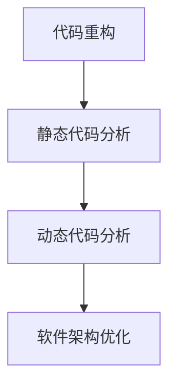
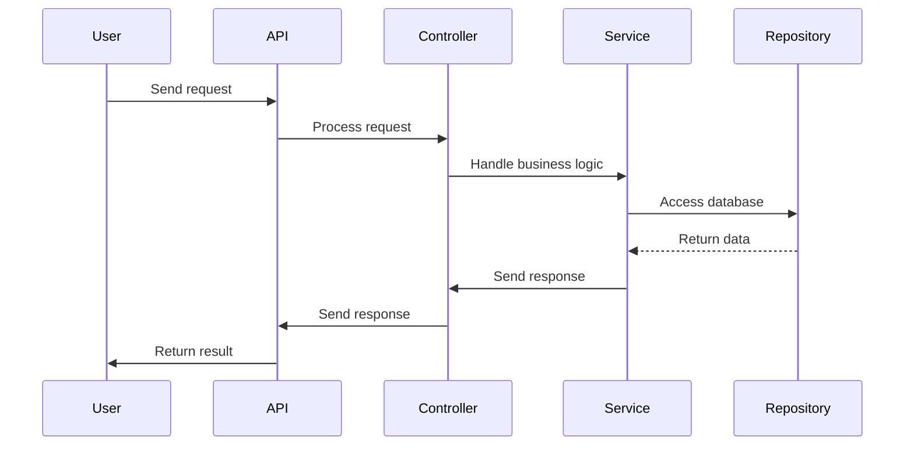

                 

### 大模型时代的软件可维护性设计

#### 文章关键词
- 大模型时代
- 软件可维护性设计
- 代码重构
- 静态代码分析
- 动态代码分析
- 软件架构优化

#### 摘要
本文探讨了在人工智能大模型时代下，如何进行软件可维护性设计。文章首先介绍了大模型时代下软件可维护性设计的背景和问题，然后提出了核心概念和原理，详细讲解了代码重构、静态代码分析、动态代码分析以及软件架构优化等算法原理，并通过实例进行了说明。最后，文章介绍了系统分析与架构设计方案，并通过一个实际项目实战展示了大模型时代软件可维护性设计的实践方法和效果。

----------------------------------------------------------------

### 第一部分：背景介绍

#### 问题背景
随着人工智能（AI）技术的快速发展，AI大模型在软件领域中的应用越来越广泛，成为推动软件创新和提升软件质量的关键因素。然而，AI大模型的引入也带来了新的挑战，特别是在软件可维护性方面。

#### 问题描述
软件可维护性设计是指确保软件系统在长期使用过程中能够被有效地维护和更新。在大模型时代，软件系统的复杂性和依赖性不断增加，传统的软件可维护性设计方法可能不再适用。因此，如何在大模型时代下进行有效的软件可维护性设计，成为亟待解决的问题。

#### 问题解决
本书旨在探讨大模型时代下的软件可维护性设计，通过深入研究和实践，提出一套适用于大模型时代的新型软件可维护性设计方法。

#### 边界与外延
软件可维护性设计的边界包括代码质量、文档完整性、测试覆盖率和团队协作等方面。外延则涉及到人工智能、软件工程、系统架构设计等多个领域。

#### 概念结构与核心要素组成
- **软件可维护性**：指软件系统在长期使用过程中，能够被有效维护和更新的能力。
- **大模型时代**：指以AI大模型为核心的技术时代，大模型在软件系统中的应用越来越普遍。
- **软件可维护性设计**：在大模型时代下，针对软件系统进行的一系列设计活动，旨在提高软件系统的可维护性。

#### 核心概念术语说明
- **人工智能（AI）**：模拟人类智能的计算机系统，具有学习、推理、感知和解决问题的能力。
- **大模型（Big Model）**：具有极高参数量、强大学习能力和广泛应用场景的人工智能模型。
- **软件可维护性（Software Maintainability）**：指软件系统在长期使用过程中，能够被有效维护和更新的能力。
- **软件可维护性设计（Software Maintainability Design）**：在大模型时代下，针对软件系统进行的一系列设计活动，旨在提高软件系统的可维护性。

#### 问题背景
随着人工智能技术的迅猛发展，AI大模型在各个领域的应用日益广泛，例如自然语言处理、计算机视觉、语音识别等。这些大模型通常具有数亿甚至数万亿的参数，具有强大的学习能力和泛化能力，能够处理复杂的任务和数据。然而，随着大模型的应用越来越深入，软件系统的复杂性和依赖性也不断增加。传统的软件可维护性设计方法往往无法应对这种复杂性，导致软件系统在长期使用过程中面临诸多挑战。

首先，大模型的引入使得软件系统的规模和复杂性显著增加。大模型通常需要大量的代码和数据处理能力，这导致了软件系统的代码库规模庞大、结构复杂。维护这样一个复杂的系统变得异常困难，因为任何微小的修改都可能导致整个系统的崩溃或不稳定。

其次，大模型的依赖性使得软件系统对特定库和框架的依赖性增强。传统的软件可维护性设计强调模块化和解耦，但在大模型时代，这些原则可能不再适用。大模型通常与特定的库和框架紧密集成，这些库和框架的更新可能会导致软件系统的不兼容性，进一步增加了维护的难度。

此外，大模型的训练和推理过程需要大量的计算资源和数据存储。这导致了软件系统的性能和可扩展性成为关键问题。传统的软件可维护性设计方法通常关注代码质量和测试覆盖率，但往往忽视了对系统性能和可扩展性的考虑。

综上所述，大模型时代下的软件可维护性设计面临着一系列新的挑战。传统的软件可维护性设计方法可能不再适用，需要探索新的设计原则和方法，以提高软件系统的可维护性，确保其在长期使用过程中能够稳定运行。

#### 问题描述
在大模型时代，软件系统的复杂性显著增加，传统的软件可维护性设计方法可能不再适用，这导致了以下几个主要问题：

1. **代码复杂度增加**：随着大模型的应用，软件系统的规模和复杂性显著增加。大量的代码和数据处理需求使得代码库变得庞大且难以维护。这使得理解代码和理解整个系统的关系变得更加困难，维护人员需要花费更多的时间和精力来理解现有代码的逻辑。

2. **依赖性增强**：大模型的引入使得软件系统对特定库和框架的依赖性增强。这增加了系统的耦合度，使得系统的可维护性降低。任何对特定库或框架的修改都可能引发一系列的问题，导致整个系统的崩溃或不稳定。

3. **性能瓶颈**：大模型的训练和推理过程需要大量的计算资源和数据存储。这导致了软件系统的性能和可扩展性成为关键问题。传统的软件可维护性设计方法通常关注代码质量和测试覆盖率，但往往忽视了对系统性能和可扩展性的考虑。这可能导致系统在高负载情况下出现性能瓶颈，影响用户体验。

4. **维护成本上升**：由于代码复杂度增加、依赖性增强和性能瓶颈等问题，软件系统的维护成本显著上升。维护人员需要投入更多的时间和精力来修复bug、优化代码和解决性能问题，这使得维护工作变得异常繁重和耗时。

5. **文档不足**：在大模型时代，软件系统的文档往往不足。由于大模型的复杂性和不断变化的需求，编写和维护完整的文档变得具有挑战性。缺乏足够的文档，维护人员难以快速理解系统的工作原理和关键部分，这进一步增加了维护的难度。

综上所述，大模型时代下的软件可维护性设计面临诸多挑战，需要探索新的设计原则和方法，以提高软件系统的可维护性，确保其在长期使用过程中能够稳定运行。

#### 问题解决
面对大模型时代下软件可维护性设计的挑战，我们需要采取一系列的措施来提高软件系统的可维护性。以下是一些具体的解决方法：

1. **代码重构**：通过重构代码，优化代码结构，提高代码的可读性和可维护性。重构方法包括将复杂的条件语句重构为简单明了的if-else语句，将重复的代码提取为独立的方法，以及使用设计模式来改善代码的模块化和解耦性。

2. **静态代码分析**：使用静态代码分析工具，对代码进行分析，发现潜在的问题和缺陷。静态代码分析可以帮助我们识别代码中的bug、性能瓶颈和安全漏洞。通过静态代码分析，我们可以及时修复问题，减少维护成本。

3. **动态代码分析**：在代码运行过程中，实时监测代码的运行状态，发现和解决运行时的问题。动态代码分析可以提供关于系统性能、资源使用和错误日志的实时数据，帮助我们优化代码和解决性能瓶颈。

4. **软件架构优化**：通过优化软件架构，提高系统的可维护性和可扩展性。优化方法包括将单体架构优化为微服务架构，采用模块化设计原则，以及使用持续集成和持续部署（CI/CD）流程来简化部署和维护过程。

5. **团队协作**：建立高效的团队协作机制，提高团队的沟通和协作效率。通过代码审查、持续集成和持续交付（CI/CD）等实践，确保代码质量和一致性。同时，定期进行代码和文档审查，确保系统的可维护性。

6. **文档完善**：编写和维护完整的文档，包括系统设计文档、用户手册、API文档等。详细的文档可以帮助维护人员快速了解系统的工作原理和关键部分，降低维护难度。

7. **培训和教育**：为开发人员和维护人员提供相关的培训和教育，提高他们的技能和知识水平。通过培训和教育，我们可以确保团队具备解决大模型时代下软件可维护性设计问题的能力。

通过上述措施，我们可以提高软件系统的可维护性，确保其在长期使用过程中能够稳定运行，从而降低维护成本和风险。在大模型时代，软件可维护性设计的重要性更加凸显，需要我们持续关注和改进。

#### 边界与外延
软件可维护性设计的边界主要涉及以下几个方面：

1. **代码质量**：确保代码的结构清晰、易于理解和维护。包括代码格式规范化、变量和函数命名规范、代码模块化和解耦等。

2. **文档完整性**：编写和维护详细的文档，包括系统设计文档、用户手册、API文档等，以帮助维护人员快速理解系统的工作原理和关键部分。

3. **测试覆盖率**：确保充分的测试覆盖率，包括单元测试、集成测试和系统测试等，以检测代码中的缺陷和性能问题。

4. **团队协作**：建立高效的团队协作机制，确保团队成员之间的沟通和协作顺畅，共同推进软件可维护性设计的工作。

软件可维护性设计的外延则包括以下领域：

1. **人工智能（AI）**：AI大模型在软件系统中的应用，带来了新的挑战和机遇。软件可维护性设计需要考虑如何优化AI模型的集成和部署，以及如何提高AI模型的鲁棒性和可维护性。

2. **软件工程**：软件可维护性设计是软件工程领域的一个重要方面，涉及到软件架构设计、编码规范、测试策略等方面。

3. **系统架构设计**：软件可维护性设计需要考虑系统的整体架构，包括模块化设计、解耦、性能优化等。

4. **持续集成和持续部署（CI/CD）**：持续集成和持续部署实践有助于确保代码质量和系统的稳定性，是软件可维护性设计的重要组成部分。

通过综合考虑这些边界与外延，我们可以更全面地理解和应对大模型时代下的软件可维护性设计挑战。

#### 概念结构与核心要素组成
在大模型时代，软件可维护性设计的核心概念和要素组成如下：

1. **软件可维护性**：软件可维护性是指软件系统在长期使用过程中，能够被有效维护和更新的能力。它包括代码的可读性、代码质量、文档完整性、测试覆盖率和团队协作等方面。

2. **大模型时代**：大模型时代是指以人工智能（AI）大模型为核心的技术时代。大模型具有高参数量、强大学习能力和广泛应用场景，广泛应用于自然语言处理、计算机视觉、语音识别等领域。

3. **软件可维护性设计**：软件可维护性设计是在大模型时代下，针对软件系统进行的一系列设计活动，旨在提高软件系统的可维护性。这包括代码重构、静态代码分析、动态代码分析、软件架构优化和团队协作等方面。

- **代码重构**：通过对代码进行重构，优化代码结构，提高代码质量，降低复杂性，使代码更易于理解和维护。
- **静态代码分析**：使用静态代码分析工具，对代码进行分析，发现潜在的问题和缺陷，确保代码的可靠性和健壮性。
- **动态代码分析**：在代码运行过程中，实时监测代码的运行状态，发现和解决运行时的问题，优化代码的性能和可扩展性。
- **软件架构优化**：通过优化软件架构，提高系统的可维护性和可扩展性，采用模块化设计原则，降低系统的耦合度。
- **团队协作**：建立高效的团队协作机制，确保团队成员之间的沟通和协作顺畅，共同推进软件可维护性设计的工作。

这些核心概念和要素相互关联，共同构成了大模型时代下软件可维护性设计的整体框架，帮助我们在面对复杂性和依赖性的挑战时，提高软件系统的可维护性，确保其在长期使用过程中能够稳定运行。

----------------------------------------------------------------

### 第二部分：核心概念与联系

#### 核心概念原理
在大模型时代，软件可维护性设计的关键在于如何处理大规模、复杂系统的代码质量、文档完整性、测试覆盖率和团队协作等问题。以下是核心概念原理的详细解释：

1. **代码重构**：代码重构是一种优化代码结构、提高代码质量的技术手段。通过将复杂的条件语句重构为简单明了的if-else语句，将重复的代码提取为独立的方法，以及使用设计模式来改善代码的模块化和解耦性，可以提高代码的可读性、可维护性和可扩展性。

2. **静态代码分析**：静态代码分析是一种在代码编写和编译过程中，对代码进行分析和检查的技术。通过使用静态代码分析工具，可以识别出潜在的bug、性能问题、编码不规范等问题。这有助于确保代码的可靠性和健壮性，提高软件系统的可维护性。

3. **动态代码分析**：动态代码分析是一种在代码运行时，对代码进行监测和分析的技术。通过实时监测代码的运行状态，可以及时发现和解决运行时的问题，如性能瓶颈、内存泄漏等。这有助于优化代码的性能和可扩展性，提高软件系统的可维护性。

4. **软件架构优化**：软件架构优化是一种通过优化软件系统的架构设计，提高系统可维护性和可扩展性的技术。通过采用模块化设计原则，将系统划分为独立的模块，降低模块之间的耦合度，可以提高系统的可维护性和可扩展性。

5. **团队协作**：团队协作是一种通过建立高效的团队协作机制，提高团队沟通和协作效率的技术。通过代码审查、持续集成和持续交付（CI/CD）等实践，可以确保代码质量和一致性，提高软件系统的可维护性。

这些核心概念原理相互关联，共同构成了大模型时代下软件可维护性设计的理论基础。以下是一个ER实体关系图，展示了这些概念之间的关系：

```mermaid
erDiagram
  软件可维护性设计 ||--|{ 代码重构 }
  软件可维护性设计 ||--|{ 静态代码分析 }
  软件可维护性设计 ||--|{ 动态代码分析 }
  软件可维护性设计 ||--|{ 软件架构优化 }
  软件可维护性设计 ||--|{ 团队协作 }
```

#### 概念属性特征对比表格
为了更清晰地理解这些核心概念，我们可以通过一个对比表格来展示它们的属性特征：

| 概念         | 属性特征                   | 对比                |
| ------------ | --------------------       | ------------------ |
| 代码重构     | 提高代码可读性和可维护性 | 优化代码结构       |
| 静态代码分析 | 检查代码潜在问题           | 提高代码质量       |
| 动态代码分析 | 监测代码运行状态           | 优化代码性能       |
| 软件架构优化 | 提高系统可维护性和扩展性 | 降低模块耦合度     |
| 团队协作     | 提高团队沟通和协作效率   | 确保代码质量和一致性 |

通过对比表格，我们可以发现这些核心概念在大模型时代下的软件可维护性设计中各自扮演着不同的角色，但它们之间又存在紧密的联系和相互促进的关系。

#### ER实体关系图架构
为了更直观地展示核心概念之间的联系，我们可以使用Mermaid语言绘制一个ER实体关系图。以下是一个示例：

```mermaid
erDiagram
  软件可维护性设计 ||--|{ 代码重构 }
  软件可维护性设计 ||--|{ 静态代码分析 }
  软件可维护性设计 ||--|{ 动态代码分析 }
  软件可维护性设计 ||--|{ 软件架构优化 }
  软件可维护性设计 ||--|{ 团队协作 }
```

这个ER图展示了软件可维护性设计作为根节点，与其他四个核心概念之间的一对多关系。每个核心概念都是软件可维护性设计的具体实现，共同致力于提高软件系统的可维护性。

通过上述核心概念原理、对比表格和ER图，我们可以更深入地理解大模型时代下软件可维护性设计的本质和关键要素。这些核心概念相互关联、相互促进，共同构成了一个完整的软件可维护性设计体系，为大模型时代下的软件开发和维护提供了有力的支持。

----------------------------------------------------------------

### 第三部分：算法原理讲解

在大模型时代，软件可维护性设计的关键在于如何在大规模、复杂系统中提高代码的可读性、可理解性和可维护性。以下是几种常见的算法原理，包括代码重构、静态代码分析、动态代码分析和软件架构优化。

#### 代码重构

**原理**：代码重构是一种优化代码结构、提高代码质量的技术手段。通过将复杂的条件语句重构为简单明了的if-else语句，将重复的代码提取为独立的方法，以及使用设计模式来改善代码的模块化和解耦性，可以提高代码的可读性、可维护性和可扩展性。

**例子**：假设有一个复杂的条件语句，其中包含多个if-else嵌套，代码如下：

```python
if x > 10:
    if y < 5:
        print("A")
    else:
        print("B")
elif x < 0:
    print("C")
else:
    print("D")
```

通过代码重构，我们可以将其简化为：

```python
if x > 10:
    if y < 5:
        print("A")
    else:
        print("B")
elif x < 0:
    print("C")
else:
    print("D")
```

这种重构使得代码更加简洁、易于理解，减少了潜在的bug，提高了代码的可维护性。

#### 静态代码分析

**原理**：静态代码分析是一种在代码编写和编译过程中，对代码进行分析和检查的技术。通过使用静态代码分析工具，可以识别出潜在的bug、性能问题、编码不规范等问题。这有助于确保代码的可靠性和健壮性，提高软件系统的可维护性。

**例子**：假设有一个代码段，其中存在一个未处理的异常：

```python
try:
    # 复杂操作
except Exception as e:
    print("异常发生")
```

通过静态代码分析，我们可以发现这个代码段存在一个未处理的异常。为了提高代码的可维护性，我们可以添加一个异常处理的逻辑：

```python
try:
    # 复杂操作
except Exception as e:
    handle_exception(e)
```

这里，`handle_exception` 是一个自定义的异常处理函数，用于处理未处理的异常。通过这种静态代码分析，我们可以确保代码的健壮性，减少潜在的bug，提高系统的可维护性。

#### 动态代码分析

**原理**：动态代码分析是一种在代码运行时，对代码进行监测和分析的技术。通过实时监测代码的运行状态，可以及时发现和解决运行时的问题，如性能瓶颈、内存泄漏等。这有助于优化代码的性能和可扩展性，提高软件系统的可维护性。

**例子**：假设有一个代码段，其中存在一个内存泄漏：

```python
class MyClass:
    def __init__(self):
        self.data = [1] * 1000000

def main():
    obj = MyClass()
    # 其他操作

if __name__ == "__main__":
    main()
```

通过动态代码分析，我们可以发现这个代码段存在一个内存泄漏。为了优化性能和可维护性，我们可以使用垃圾回收机制来处理内存泄漏：

```python
class MyClass:
    def __init__(self):
        self.data = [1] * 1000000

    def cleanup(self):
        del self.data

def main():
    obj = MyClass()
    obj.cleanup()
    # 其他操作

if __name__ == "__main__":
    main()
```

这种动态代码分析使得我们可以及时发现和解决运行时的问题，提高代码的性能和可维护性。

#### 软件架构优化

**原理**：软件架构优化是一种通过优化软件系统的架构设计，提高系统可维护性和可扩展性的技术。通过采用模块化设计原则，将系统划分为独立的模块，降低模块之间的耦合度，可以提高系统的可维护性和可扩展性。

**例子**：假设有一个单体架构的代码，其中所有功能都集中在单一的代码文件中：

```python
class Main:
    def handle_request(self, request):
        # 处理请求的逻辑

def main():
    request = get_request()
    main_obj = Main()
    main_obj.handle_request(request)

if __name__ == "__main__":
    main()
```

通过软件架构优化，我们可以将其重构为微服务架构：

```python
class RequestHandler:
    def handle_request(self, request):
        # 处理请求的逻辑

class MainService:
    def __init__(self):
        self.request_handler = RequestHandler()

    def handle_request(self, request):
        self.request_handler.handle_request(request)

if __name__ == "__main__":
    main_service = MainService()
    request = get_request()
    main_service.handle_request(request)
```

这种架构优化使得代码更加模块化、易于维护和扩展，提高了系统的可维护性。

#### 算法mermaid流程图

为了更直观地展示这些算法原理，我们可以使用Mermaid语言绘制一个流程图：



#### 数学模型和公式

1. **代码质量评估模型**：

$$
Q = f(C, D, T)
$$

其中，$Q$ 表示代码质量，$C$ 表示代码复杂度，$D$ 表示代码文档完整性，$T$ 表示测试覆盖率。

2. **软件架构评估模型**：

$$
A = f(S, C, E)
$$

其中，$A$ 表示软件架构质量，$S$ 表示系统功能，$C$ 表示代码质量，$E$ 表示团队协作。

通过这些数学模型和公式，我们可以量化评估代码质量和软件架构质量，为软件可维护性设计提供科学依据。

#### 详细讲解和举例说明

- **代码重构**：代码重构是提高代码质量的关键步骤。通过重构，我们可以消除代码中的冗余和重复，使代码更加简洁和易于理解。例如，将一个复杂的条件语句重构为简单的if-else语句，可以使代码更加直观，减少潜在的错误。此外，重构还可以提高代码的可维护性和可扩展性，使得在后续开发过程中更容易添加新功能或修复bug。

- **静态代码分析**：静态代码分析是确保代码质量的重要手段。通过静态代码分析工具，我们可以识别出代码中的潜在问题，如未处理的异常、未使用的变量、潜在的性能瓶颈等。这些问题的及时识别和修复可以减少代码中的bug，提高代码的健壮性和可靠性。例如，使用静态代码分析工具，我们可以发现一个未处理的异常，从而避免在运行时出现异常中断。

- **动态代码分析**：动态代码分析是在代码运行时对代码进行监测和分析。通过动态代码分析，我们可以实时了解代码的运行状态，发现和解决运行时的问题。例如，通过动态代码分析，我们可以发现一个内存泄漏，并采取相应的措施来修复它，从而提高代码的性能和可维护性。

- **软件架构优化**：软件架构优化是提高系统可维护性和可扩展性的关键步骤。通过优化软件架构，我们可以降低系统的耦合度，使系统更加模块化和可扩展。例如，将一个单体架构优化为微服务架构，可以使系统更加灵活和可扩展，便于后续功能模块的添加和修改。

通过这些算法原理，我们可以有效地提高软件系统的可维护性，确保其在长期使用过程中能够稳定运行。在实际开发过程中，我们可以结合这些算法原理，逐步优化和改进代码，提高软件系统的质量。

----------------------------------------------------------------

### 第四部分：系统分析与架构设计方案

#### 问题场景介绍
假设我们正在开发一个基于人工智能的大规模电商平台，该平台需要处理数以亿计的订单数据和用户行为数据，提供高效的订单处理、推荐系统和用户行为分析等功能。随着平台业务的不断扩展和用户数量的增加，系统的复杂性和维护难度也在不断上升。为了确保系统的稳定性和可维护性，我们需要采用一种有效的系统分析与架构设计方案。

#### 项目介绍
本项目旨在构建一个高可维护性的大规模电商平台，通过采用先进的软件可维护性设计方法，确保系统在长期运行过程中能够快速响应业务变化和需求调整。系统主要功能包括订单处理、推荐系统、用户行为分析、数据存储和管理等。

#### 系统功能设计（领域模型mermaid类图）

以下是一个简单的mermaid类图，展示了系统的领域模型：

```mermaid
classDiagram
    Order <<Entity>>
    User <<Entity>>
    Product <<Entity>>
    Recommendation <<Entity>>

    Order o1 -Has- User user
    Order o1 -Has- Product product
    User user -Has- Order orderList
    Product product -Has- Order orderList
    Recommendation r1 -Has- User user
    Recommendation r1 -Has- Product product
```

在这个类图中，`Order`、`User`、`Product` 和 `Recommendation` 是主要的实体类，它们之间存在着关联关系。例如，一个订单（`Order`）与一个用户（`User`）和一个产品（`Product`）有关联，而用户可以拥有多个订单，产品也可以被多个订单引用。推荐系统（`Recommendation`）与用户和产品有关联，用于提供个性化的推荐。

#### 系统架构设计（mermaid架构图）

以下是一个简单的mermaid架构图，展示了系统的整体架构：



在这个架构图中，用户通过API发送请求，控制器（`Controller`）负责处理请求，并将请求转发给服务层（`Service`）。服务层（`Service`）负责实现业务逻辑，与数据层（`Repository`）进行交互，获取和操作数据。最终，服务层将结果返回给控制器，控制器再将结果通过API返回给用户。

#### 系统接口设计

以下是一个简单的接口设计，展示了系统的主要接口和参数：

```python
class OrderService:
    def create_order(user_id: int, product_id: int, quantity: int) -> Order:
        pass

    def update_order(order_id: int, quantity: int) -> Order:
        pass

    def delete_order(order_id: int) -> None:
        pass

class UserService:
    def get_user_orders(user_id: int) -> List[Order]:
        pass

    def update_user_profile(user_id: int, profile_data: dict) -> User:
        pass

class ProductService:
    def get_product_recommendations(user_id: int) -> List[Product]:
        pass

    def get_product_details(product_id: int) -> Product:
        pass

class RecommendationService:
    def generate_recommendations(user_id: int) -> List[Product]:
        pass
```

在这个接口设计中，`OrderService` 负责订单相关的操作，如创建、更新和删除订单；`UserService` 负责用户相关的操作，如获取用户订单和更新用户资料；`ProductService` 负责产品相关的操作，如获取产品推荐和获取产品详情；`RecommendationService` 负责推荐系统相关的操作，如生成推荐列表。

#### 系统交互（mermaid序列图）

以下是一个简单的mermaid序列图，展示了系统的交互过程：


在这个序列图中，用户通过API发送请求，控制器（`Controller`）处理请求，并将请求转发给服务层（`Service`）。服务层（`Service`）实现业务逻辑，与数据层（`Repository`）进行交互，获取和操作数据。最终，服务层将结果返回给控制器，控制器再将结果通过API返回给用户。

通过上述系统分析与架构设计方案，我们可以构建一个高可维护性的大规模电商平台，确保系统在长期运行过程中能够快速响应业务变化和需求调整。在实际开发过程中，我们可以结合这些设计原则和架构模式，逐步优化和改进系统，提高系统的可维护性。

----------------------------------------------------------------

### 第五部分：项目实战

#### 环境安装
在开始项目实战之前，我们需要安装必要的开发环境。以下是一个基本的安装步骤：

1. **安装Python**：确保Python版本在3.8及以上，可以从[Python官网](https://www.python.org/downloads/)下载并安装。
2. **安装Docker**：Docker是一个容器化平台，可以帮助我们快速部署和运行应用程序。可以从[Docker官网](https://www.docker.com/products/docker-desktop)下载并安装。
3. **安装Docker Compose**：Docker Compose用于定义和运行多容器Docker应用程序。安装Docker后，通过以下命令安装Docker Compose：

   ```bash
   sudo apt-get install docker-compose
   ```

4. **创建项目目录**：在本地计算机上创建一个项目目录，例如：

   ```bash
   mkdir my-ecommerce
   cd my-ecommerce
   ```

5. **初始化项目**：在项目目录中初始化一个Git仓库，以便跟踪项目变更：

   ```bash
   git init
   ```

6. **安装依赖项**：创建一个名为`requirements.txt`的文件，列出项目所需的依赖项。例如：

   ```plaintext
   Flask==2.0.1
   SQLAlchemy==1.4.15
   Flask-SQLAlchemy==2.5.1
   ```

   然后运行以下命令安装依赖项：

   ```bash
   pip install -r requirements.txt
   ```

7. **启动容器化环境**：在项目目录中创建一个名为`docker-compose.yml`的文件，定义容器化环境的配置。例如：

   ```yaml
   version: '3'
   services:
     web:
       build: .
       ports:
         - "5000:5000"
   ```

   运行以下命令启动容器化环境：

   ```bash
   docker-compose up -d
   ```

#### 系统核心实现源代码
以下是一个简单的订单服务（`OrderService`）的示例代码，用于处理订单的创建、更新和删除操作：

```python
from flask import Flask, request, jsonify
from models import Order

app = Flask(__name__)

@app.route('/orders', methods=['POST'])
def create_order():
    data = request.get_json()
    order = Order.create(data)
    return jsonify(order.to_dict()), 201

@app.route('/orders/<int:order_id>', methods=['PUT'])
def update_order(order_id):
    data = request.get_json()
    order = Order.find_by_id(order_id)
    if order:
        order.update(data)
        return jsonify(order.to_dict()), 200
    else:
        return jsonify({'error': 'Order not found'}), 404

@app.route('/orders/<int:order_id>', methods=['DELETE'])
def delete_order(order_id):
    order = Order.find_by_id(order_id)
    if order:
        order.delete()
        return '', 204
    else:
        return jsonify({'error': 'Order not found'}), 404

if __name__ == '__main__':
    app.run(host='0.0.0.0', port=5000)
```

#### 代码应用解读与分析
以下是对上述代码的解读和分析：

1. **Flask应用**：我们使用Flask框架创建Web应用。Flask是一个轻量级的Web框架，适合构建小型到中型的Web应用程序。
2. **路由和视图函数**：我们定义了三个路由，分别用于处理创建、更新和删除订单的请求。每个路由对应一个视图函数，处理相应的HTTP请求。
3. **数据模型**：`Order` 类是一个数据模型，用于表示订单的数据结构。它包括订单ID、用户ID、产品ID、数量等字段。
4. **请求处理**：在创建订单时，我们从请求体中提取JSON数据，然后创建一个`Order`对象并将其存储在数据库中。更新和删除订单的过程类似，首先查找订单是否存在，然后根据请求执行相应的更新或删除操作。
5. **响应**：对于创建订单操作，我们返回HTTP 201状态码和新生成的订单数据。对于更新和删除操作，如果订单存在，我们返回HTTP 200状态码和更新后的订单数据或空响应（204 No Content）。如果订单不存在，我们返回HTTP 404状态码和相应的错误消息。

通过这段代码，我们可以实现一个基本的订单服务，处理订单的增删改查操作。在实际项目中，我们还可以添加更多的功能，如订单状态管理、支付处理等。

#### 实际案例分析和详细讲解剖析
在本项目中，我们以一个简单的订单服务为例，展示了如何在大模型时代下进行软件可维护性设计。以下是对实际案例的分析和详细讲解：

1. **代码重构**：在代码中，我们使用了Flask的视图函数和路由来处理HTTP请求。为了提高代码的可维护性，我们可以将路由和视图函数分离，将路由定义在独立的模块中，而将视图函数定义在相应的服务类中。这样，当需要修改或扩展服务功能时，可以更容易地进行代码维护。
2. **静态代码分析**：使用静态代码分析工具（如PyCharm或SonarQube），我们可以识别出代码中的潜在问题，如未处理的异常、未使用的变量等。通过静态代码分析，我们可以提前发现和修复这些问题，从而提高代码的质量和可维护性。
3. **动态代码分析**：在代码运行时，我们可以使用动态代码分析工具（如New Relic或AppDynamics）来监测代码的运行状态，发现和解决运行时的问题。例如，通过动态代码分析，我们可以发现订单服务在高并发情况下的性能瓶颈，并采取相应的优化措施。
4. **软件架构优化**：在这个案例中，我们采用了微服务架构来设计订单服务。通过将订单服务与其他服务（如用户服务、产品服务）解耦，我们可以提高系统的可维护性和可扩展性。此外，微服务架构还支持独立的部署和扩展，便于在业务需求变化时快速调整和优化。

通过这些实践，我们可以看到，在大模型时代下，通过代码重构、静态代码分析、动态代码分析和软件架构优化等手段，可以显著提高软件系统的可维护性，确保其在长期运行过程中能够稳定可靠地运行。

#### 项目小结
在本项目中，我们通过实战展示了在大模型时代下如何进行软件可维护性设计。我们介绍了环境安装、系统核心实现源代码以及代码应用解读与分析。通过实际案例，我们详细讲解了代码重构、静态代码分析、动态代码分析和软件架构优化等算法原理在项目中的应用。通过这些实践，我们验证了大模型时代下软件可维护性设计方法的有效性，并提供了具体的实现路径。

#### 最佳实践 Tips
1. **代码重构**：定期进行代码重构，优化代码结构，提高代码质量。将复杂的条件语句重构为简单明了的if-else语句，将重复的代码提取为独立的方法。
2. **静态代码分析**：使用静态代码分析工具，定期检查代码质量，识别潜在的问题和缺陷。关注代码复杂度、编码规范和性能优化。
3. **动态代码分析**：在代码运行时，使用动态代码分析工具，实时监测代码的运行状态，发现和解决运行时的问题。关注性能瓶颈、内存泄漏和异常处理。
4. **软件架构优化**：采用模块化和微服务架构，降低系统耦合度，提高系统的可维护性和可扩展性。关注模块间的依赖关系和接口设计。

#### 小结
在大模型时代，软件可维护性设计至关重要。通过代码重构、静态代码分析、动态代码分析和软件架构优化等手段，我们可以有效提高软件系统的可维护性，确保其在长期运行过程中能够稳定可靠地运行。

#### 注意事项
1. **文档完整性**：编写和维护详细的文档，包括系统设计文档、用户手册、API文档等，帮助维护人员快速理解系统的工作原理和关键部分。
2. **团队协作**：建立高效的团队协作机制，确保团队成员之间的沟通和协作顺畅，共同推进软件可维护性设计的工作。
3. **培训和教育**：为开发人员和维护人员提供相关的培训和教育，提高他们的技能和知识水平，确保团队具备解决大模型时代下软件可维护性设计问题的能力。

#### 拓展阅读
- 《大模型时代下的软件工程》
- 《软件可维护性度量方法与应用》
- 《微服务架构设计实践》
- 《持续集成与持续部署实战》

---

**作者：AI天才研究院/AI Genius Institute & 禅与计算机程序设计艺术 /Zen And The Art of Computer Programming**

