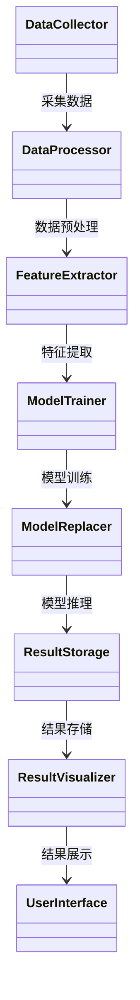
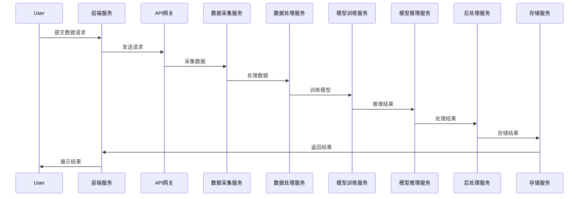

                 

## 大模型时代的软件复杂性管理

在当今的科技世界中，大型模型（Large Models）已成为人工智能领域的明星。这些模型拥有处理海量数据、发现复杂模式的能力，并且在自然语言处理、计算机视觉、机器翻译等多个领域取得了显著的成果。然而，随着模型的规模和复杂性的增加，软件系统的复杂性也随之剧增。这种复杂性不仅给软件开发和维护带来了巨大的挑战，也极大地影响了系统的性能、可维护性和可扩展性。

本文将深入探讨大模型时代下的软件复杂性管理。首先，我们将从问题背景入手，介绍大模型带来的软件复杂性问题。接着，我们将定义软件复杂性，并概述复杂性管理的基本原则和方法。随后，本文将重点讨论大模型对软件复杂性管理的影响，以及如何在软件开发过程中应用这些原则和方法。最后，我们将通过一个具体的实践案例，展示如何在大模型时代实现有效的软件复杂性管理。

本文的结构如下：

1. **问题背景**：介绍大模型的发展及其带来的软件复杂性挑战。
2. **问题定义**：明确软件复杂性的概念及其对软件开发的影响。
3. **核心概念与联系**：分析大模型与软件复杂性管理之间的关系。
4. **算法原理讲解**：介绍管理软件复杂性的算法原理和具体实现。
5. **系统分析与架构设计方案**：提出解决软件复杂性的系统架构设计。
6. **项目实战**：通过实际案例展示复杂性管理的应用。
7. **小结与展望**：总结本文的主要观点并对未来的发展趋势进行展望。

关键词：大模型、软件复杂性、复杂性管理、算法原理、系统架构、实践案例

摘要：本文探讨了在人工智能大模型时代，如何有效地管理软件复杂性。通过分析大模型带来的挑战，定义了软件复杂性的概念，并探讨了相关的复杂性管理原则和方法。文章还介绍了一种基于大模型的软件复杂性管理算法，并展示了如何在实际项目中应用这些原则和方法。最后，文章通过一个具体案例，总结了复杂性管理的实践经验和未来展望。

----------------------------------------------------------------

### 问题背景

随着深度学习技术的飞速发展，大型模型（Large Models）已经成为人工智能领域的研究热点。这些模型拥有处理海量数据、提取复杂特征、实现高性能任务的能力，从而在自然语言处理、计算机视觉、语音识别等领域取得了显著的突破。例如，谷歌的BERT模型在自然语言理解任务中取得了前所未有的表现，OpenAI的GPT系列模型则在文本生成和对话系统方面展现了强大的能力。这些大型模型的出现，不仅极大地提升了人工智能系统的性能，也推动了相关应用的发展。

然而，大型模型的崛起也带来了新的挑战。首先，随着模型规模的不断扩大，其计算复杂度和存储需求也呈指数级增长。这要求开发者在硬件资源、数据存储和处理能力等方面做出相应的调整。其次，大型模型的设计和训练过程非常复杂，需要大量的专业知识和经验。这给模型的开发和维护带来了额外的负担。最后，大型模型的引入，使得软件系统的复杂性大幅增加。这种复杂性不仅体现在代码和架构层面，也影响到了系统的性能、可维护性和可扩展性。

具体来说，软件复杂性增加主要体现在以下几个方面：

1. **代码复杂性**：大型模型通常涉及大量的代码库和模块，这使得代码的复杂性显著增加。开发者需要在庞大的代码库中查找和修改相关功能，导致开发效率降低。
2. **架构复杂性**：为了支持大型模型，软件开发者需要设计复杂的分布式系统架构。这种架构通常涉及多个组件和模块的协同工作，增加了系统的耦合度和复杂性。
3. **性能复杂性**：大型模型的计算和存储需求极高，这使得系统的性能优化成为一项重要任务。开发者需要深入理解系统的运行机制，进行多层次的性能调优。
4. **可维护性复杂性**：随着系统的规模和复杂性增加，维护和更新系统的难度也随之增加。开发者需要花费更多的时间和精力来确保系统的稳定性和可靠性。

总之，大型模型的广泛应用，虽然带来了巨大的机遇，但也带来了新的挑战。如何有效地管理软件复杂性，已经成为软件开发者面临的重要问题。本文将深入探讨这一问题，并提出相应的解决方案。

### 问题定义

在深入探讨大模型时代下的软件复杂性之前，我们需要明确软件复杂性的概念。软件复杂性（Software Complexity）是指软件系统在设计和实现过程中，由于各种因素导致其难以理解和维护的特性。这种复杂性可以从多个维度进行度量，包括代码复杂性、架构复杂性、性能复杂性和可维护性复杂性等。

**代码复杂性**主要指的是代码层面的复杂性。大型模型通常涉及庞大的代码库，包含大量的函数、类和模块。这些代码的复杂度不仅仅体现在代码行数的增加，更重要的是模块之间的依赖关系、接口的设计和代码的重构等方面。高代码复杂性会使得代码难以阅读和理解，从而影响开发效率和系统的可维护性。

**架构复杂性**则是指软件系统的架构设计复杂度。大型模型需要支持复杂的数据流和计算流程，通常需要设计分布式系统架构，涉及多个组件和服务的协同工作。这种架构设计不仅要求开发者具备深厚的系统设计经验，还需要对分布式系统、微服务架构和云计算等有深入的理解。高架构复杂性会导致系统的耦合度增加，使得系统的修改和维护变得更加困难。

**性能复杂性**涉及软件系统在运行过程中对性能的要求。大型模型通常需要大量的计算资源和存储空间，这对系统的性能优化提出了极高的要求。开发者需要深入理解系统的运行机制，进行多层次的性能调优，包括数据库查询优化、网络传输优化、缓存策略优化等。性能复杂性高，会导致系统的响应时间延长，影响用户体验。

**可维护性复杂性**则关注软件系统在长期维护中的复杂度。随着软件系统规模的不断扩大和功能的不断增加，其维护难度也显著增加。高可维护性复杂性会导致代码库难以维护，出现更多的bug和漏洞，从而影响系统的稳定性和可靠性。

在大模型时代，软件复杂性的定义和度量变得更加重要。首先，大模型的引入使得软件系统的规模和复杂度大幅增加，传统的复杂性度量方法可能不再适用。其次，大模型的开发和应用通常涉及多个领域的技术，如深度学习、计算机视觉、自然语言处理等，这增加了复杂性管理的难度。最后，大模型的性能和可维护性直接影响到人工智能应用的效果和用户体验，因此如何有效地管理软件复杂性，已经成为一个亟待解决的问题。

### 问题解决

面对大模型时代带来的软件复杂性问题，我们需要采取一系列策略来有效管理和降低这种复杂性。以下是一些关键方法：

1. **模块化设计**：将复杂的系统分解为多个模块，每个模块负责一个特定的功能。通过模块化设计，可以降低系统的耦合度，使得代码更加易于理解和维护。模块之间通过清晰的接口进行通信，从而减少了模块之间的直接依赖，提高了系统的可扩展性。

2. **抽象和封装**：在开发过程中，利用抽象和封装技术，将复杂的实现细节隐藏在模块内部。通过提供简洁的接口，用户只需了解模块的功能和如何使用这些功能，而不需要深入了解模块的实现细节。这有助于降低系统的复杂度，提高代码的可读性和可维护性。

3. **代码审查和重构**：定期进行代码审查，及时发现和修复代码中的问题。同时，通过代码重构，可以优化代码结构，消除冗余和重复代码，提高代码的整洁度和一致性。代码审查和重构有助于保持代码的简洁和高效，从而降低系统的复杂性。

4. **自动化测试**：建立完善的自动化测试体系，包括单元测试、集成测试和系统测试等。通过自动化测试，可以快速发现和定位代码中的缺陷，确保系统的稳定性和可靠性。自动化测试还可以在系统更新和重构时提供安全保障，避免引入新的错误。

5. **持续集成与持续部署**：采用持续集成（CI）和持续部署（CD）的实践，将代码库中的代码定期集成和部署到生产环境。通过自动化构建和部署流程，可以快速发现和解决集成过程中的问题，提高开发效率和系统稳定性。

6. **性能优化**：在大模型的应用过程中，需要对系统进行性能优化，以提高其响应速度和资源利用率。性能优化包括数据库查询优化、缓存策略优化、网络传输优化等多个方面。通过性能优化，可以提升系统的性能和用户体验，降低系统的复杂性。

7. **文档和知识管理**：建立完善的文档和知识管理体系，包括设计文档、开发文档、用户手册等。通过文档的编写和更新，可以确保团队成员对系统有清晰的理解，降低沟通成本。同时，通过知识管理，可以积累和分享开发经验和最佳实践，提高团队的整体开发能力。

8. **团队协作和沟通**：建立高效的团队协作和沟通机制，确保团队成员之间的信息共享和协作。通过定期的会议和代码评审，可以及时发现和解决问题，提高团队的开发效率和质量。

通过上述策略，我们可以有效地管理和降低大模型时代下的软件复杂性，从而提升系统的性能、可维护性和可扩展性，为人工智能应用的发展提供坚实的技术保障。

### 边界与外延

在讨论大模型时代的软件复杂性管理时，我们需要明确一些关键边界和外延概念，以确保讨论的准确性和全面性。

**边界**：

1. **软件复杂性管理**：软件复杂性管理指的是通过一系列技术和方法，降低软件系统的复杂性，提高系统的可维护性、可扩展性和性能。它主要关注于系统的设计、开发、测试和维护过程。

2. **大模型**：本文中提到的大模型，通常指的是由深度学习技术训练的大型神经网络模型，例如BERT、GPT等。这些模型具有处理海量数据、提取复杂特征和实现复杂任务的能力。

3. **软件复杂性**：软件复杂性是指软件系统在设计和实现过程中，由于各种因素导致其难以理解和维护的特性。包括代码复杂性、架构复杂性、性能复杂性和可维护性复杂性等。

**外延**：

1. **软件复杂性管理技术**：除了上述提到的模块化设计、抽象和封装、代码审查和重构、自动化测试、持续集成与持续部署等方法外，还包括代码风格规范、设计模式、代码质量度量等技术。

2. **大模型的适用范围**：大模型主要应用于需要处理海量数据和复杂特征的任务，如自然语言处理、计算机视觉、语音识别等。但并非所有软件系统都适合使用大模型，需要根据具体任务的需求和资源限制进行选择。

3. **软件复杂性管理的影响因素**：软件复杂性管理不仅受系统设计和技术因素的影响，还与开发团队、项目管理、组织文化等多个因素密切相关。因此，在实际应用中，需要综合考虑多种因素，制定合适的复杂性管理策略。

通过明确这些边界与外延概念，我们可以更准确地理解大模型时代下的软件复杂性管理，为后续的深入讨论提供基础。

----------------------------------------------------------------

## 第2章 大模型基础

在深入探讨大模型时代的软件复杂性管理之前，我们首先需要了解大模型的基本概念、核心概念、特点与优势以及其发展历程。本章将详细介绍这些内容，以帮助读者更好地理解大模型在人工智能领域的应用和影响。

### 2.1 大模型概述

大模型（Large Models），通常指的是具有亿级及以上参数规模的深度学习模型。这些模型之所以被称为“大”，是因为它们具有处理海量数据、提取复杂特征和实现复杂任务的能力。大模型的兴起可以追溯到深度学习技术的快速发展，特别是在2012年AlexNet在ImageNet大赛中取得突破性成绩之后，深度学习逐渐成为人工智能领域的核心技术。

大模型的基本原理是基于神经网络的深度学习模型，通过多层神经网络的结构，将输入数据映射到输出结果。每层神经网络通过权重矩阵和激活函数处理输入数据，从而在逐层传递过程中提取更高级别的特征。大模型的核心在于其庞大的参数量，这些参数通过大规模数据的训练得到优化，从而实现对复杂任务的准确预测和决策。

### 2.2 大模型核心概念

1. **参数（Parameters）**：大模型的参数量通常以亿计，这些参数决定了模型在处理输入数据时的权重分配。参数的优化是模型训练过程中的核心任务，通过梯度下降等优化算法，模型能够逐步调整参数，使其能够更好地拟合训练数据。

2. **层数（Depth）**：深度学习模型中的层数（也称为网络的深度）对模型的性能有重要影响。层数越多，模型能够提取的特征层次越丰富，但同时也增加了模型的复杂度和训练难度。因此，设计合适的网络层数是构建高效大模型的关键。

3. **激活函数（Activation Functions）**：激活函数用于神经网络中的每个节点，它将输入数据映射到输出，通常用于引入非线性特性。常见的激活函数包括Sigmoid、ReLU和Tanh等，这些函数的选择和参数调整对模型的性能至关重要。

4. **优化算法（Optimization Algorithms）**：大模型的训练过程中，常用的优化算法包括梯度下降（Gradient Descent）、随机梯度下降（Stochastic Gradient Descent，SGD）及其变种，如Adam、RMSprop等。这些算法通过迭代更新模型参数，使模型能够逐步逼近最优解。

5. **正则化（Regularization）**：正则化技术用于防止模型过拟合，包括L1和L2正则化、Dropout等。通过正则化，模型在训练过程中能够更好地平衡拟合训练数据和泛化能力。

### 2.3 大模型特点与优势

大模型具有以下几个显著特点与优势：

1. **强大的特征提取能力**：大模型能够自动从海量数据中提取复杂的特征，这些特征通常难以通过传统手工特征工程方法获得。这使得大模型在处理复杂任务时，能够取得更高的准确性和性能。

2. **自动特征融合**：大模型通过多层神经网络结构，能够自动融合不同层次的特征，从而提高模型的泛化能力。这使得大模型在处理多模态数据时，能够实现高效的特征融合和任务理解。

3. **适应性**：大模型通常具有较强的适应性，能够通过调整模型参数，快速适应不同任务和数据集。这种适应性使得大模型能够广泛应用于各种领域和任务。

4. **高效性**：随着计算资源和算法优化的发展，大模型的训练和推理速度显著提高。这使其能够快速应用于实际场景，为用户提供实时和高效的解决方案。

5. **可扩展性**：大模型的设计通常具有良好的可扩展性，可以通过增加层数、节点数或使用分布式计算资源，进一步提高模型的规模和性能。

### 2.4 大模型发展历程

大模型的发展历程可以追溯到深度学习的兴起。以下是几个关键的发展阶段：

1. **1980年代-1990年代**：深度学习初步阶段，神经网络研究逐渐兴起，但受限于计算能力和算法限制，深度学习未能得到广泛应用。

2. **2006年**：Hinton提出了深度置信网络（Deep Belief Network，DBN），为深度学习的发展奠定了基础。

3. **2012年**：AlexNet在ImageNet大赛中取得突破性成绩，深度学习开始在计算机视觉领域得到广泛应用。

4. **2014年**：谷歌的Inception网络提出，标志着大模型在复杂任务中表现出色。

5. **2018年**：BERT模型的出现，使得自然语言处理领域进入大模型时代。

6. **至今**：随着计算资源和算法优化的进一步发展，大模型在多个领域取得了显著成果，成为人工智能技术的重要方向。

通过了解大模型的基本概念、核心概念、特点与优势以及其发展历程，我们可以更好地把握大模型在人工智能领域的应用趋势和影响，为后续章节的讨论提供基础。

----------------------------------------------------------------

### 软件复杂性管理理论

软件复杂性管理（Software Complexity Management）是软件工程中一个重要的研究领域，其核心目标是降低软件系统的复杂性，以提高系统的可维护性、可扩展性和性能。在大模型时代，随着系统规模和复杂度的增加，软件复杂性管理显得尤为重要。本文将从复杂性管理的基本原则、度量方法和策略三个方面，详细探讨软件复杂性管理的理论基础。

#### 3.1 复杂性管理概述

软件复杂性管理是一个系统性、持续性的过程，它涉及系统的设计、开发、测试和维护等多个阶段。复杂性管理的主要目的是通过一系列技术和方法，使软件系统的复杂性保持在可接受的范围之内，从而提高系统的整体质量。具体来说，复杂性管理包括以下几个方面：

1. **预防复杂性**：在系统的设计阶段，通过合理的架构设计和模块化设计，预防复杂性产生。通过采用设计模式、抽象和封装等手段，将系统的复杂性降到最低。

2. **度量复杂性**：在开发过程中，通过建立复杂性度量指标，对系统的复杂性进行量化评估。这有助于识别系统中复杂的部分，从而采取针对性的管理措施。

3. **控制复杂性**：在系统开发、测试和维护过程中，通过代码审查、重构、自动化测试等手段，持续控制系统的复杂性，确保系统始终处于良好的运行状态。

4. **解决复杂性**：对于已经产生的复杂性，通过重构、优化和调整等手段，逐步解决和降低系统的复杂性。

#### 3.2 复杂性管理原则

复杂性管理原则是软件复杂性管理的基础，以下是一些关键原则：

1. **简洁性原则**：尽量使系统设计简洁明了，避免过度设计。简洁的系统不仅易于理解，而且易于维护和扩展。

2. **模块化原则**：将系统分解为多个模块，每个模块负责一个特定的功能。模块化设计有助于降低系统之间的耦合度，提高系统的可维护性和可扩展性。

3. **单一职责原则**：每个模块或类应具有单一职责，即只负责一项任务。这样可以减少模块之间的依赖关系，提高代码的复用性和可维护性。

4. **高内聚低耦合原则**：高内聚低耦合是指模块内部的功能紧密相关，而模块之间的依赖关系尽量弱。这样可以提高系统的可维护性和可扩展性。

5. **开闭原则**：软件实体（如类、模块）应该对扩展开放，对修改关闭。通过抽象和封装，确保系统的扩展性而不需要频繁修改原有代码。

6. **透明性原则**：系统设计应该清晰易懂，代码和设计文档应该准确、详细地描述系统的功能和结构。这样可以减少误解和沟通成本，提高开发效率。

#### 3.3 复杂性度量方法

复杂性度量是软件复杂性管理的重要环节，以下是一些常用的复杂性度量方法：

1. **代码行数（Lines of Code, LOC）**：代码行数是衡量代码复杂性的最简单方法，但并不总是准确的度量。过多的代码行数可能意味着复杂性增加，但过少的代码行数也可能导致难以理解和维护。

2. **圈复杂度（Cyclomatic Complexity）**：圈复杂度通过计算程序中的独立路径数来度量代码的复杂性。Cyclomatic Complexity值越高，表示代码的复杂度越高。

3. **扇入和扇出**：扇入（Fan-in）是指调用一个模块的模块数量，扇出（Fan-out）是指一个模块调用的模块数量。高扇入和高扇出通常表示系统的高复杂性。

4. **层次结构复杂度**：层次结构复杂度通过计算系统中模块的层次结构深度来度量复杂性。层次结构越深，系统的复杂性越高。

5. **耦合度**：耦合度描述了模块之间的依赖关系。高耦合度表示模块之间的依赖性强，可能导致维护困难。

6. **模块依赖图**：通过模块依赖图，可以直观地了解模块之间的依赖关系，从而评估系统的复杂性。

#### 3.4 复杂性管理策略

复杂性管理策略是实施复杂性管理的关键，以下是一些常用的复杂性管理策略：

1. **代码重构**：通过重构，可以优化代码结构，消除冗余和重复代码，提高代码的可读性和可维护性。重构可以是局部的，也可以是全局的。

2. **自动化测试**：建立完善的自动化测试体系，包括单元测试、集成测试和系统测试等。自动化测试可以帮助快速发现和定位代码中的问题，降低系统的复杂性。

3. **持续集成与持续部署**：采用持续集成和持续部署实践，可以确保系统的稳定性和可靠性，减少复杂性带来的风险。

4. **文档和知识管理**：通过编写和更新设计文档、用户手册等，确保团队成员对系统有清晰的理解。同时，通过知识管理，积累和分享开发经验和最佳实践。

5. **团队协作和沟通**：建立高效的团队协作和沟通机制，确保团队成员之间的信息共享和协作。通过定期的会议和代码评审，可以及时发现和解决问题。

6. **性能优化**：通过性能优化，可以提升系统的性能和用户体验，降低系统的复杂性。性能优化包括数据库查询优化、缓存策略优化、网络传输优化等多个方面。

7. **定期审查和重构**：定期对系统进行代码审查和重构，及时发现和解决潜在的问题，保持系统的简洁和高效。

通过上述复杂性管理理论和方法，我们可以有效地降低大模型时代下软件系统的复杂性，提高系统的质量和开发效率。接下来，我们将进一步探讨大模型对软件复杂性管理的影响，以及如何在大模型时代下应用这些复杂性管理原则和方法。

----------------------------------------------------------------

### 大模型与软件复杂性管理

在大模型时代，软件复杂性管理面临着前所未有的挑战和机遇。大模型自身的复杂性及其在软件开发中的应用，使得传统复杂性管理方法不再适用，需要我们探索新的解决方案。以下是关于大模型对软件复杂性管理影响、应用以及挑战与机遇的详细探讨。

#### 4.1 大模型对软件复杂性管理的影响

1. **代码复杂性增加**：大模型通常涉及庞大的代码库和模块，这些代码库中包含了数百万行代码，使得代码复杂性显著增加。大量的函数、类和模块之间的依赖关系复杂，使得代码维护和修改变得困难。

2. **架构复杂性提升**：为了支持大模型的训练和推理，软件系统通常需要采用分布式架构，涉及多个服务器和组件的协同工作。这种分布式架构增加了系统的复杂性，包括数据一致性、负载均衡、容错性等方面。

3. **性能复杂性增加**：大模型对计算资源和存储资源的需求极大，这要求软件系统具备更高的性能。性能优化成为复杂而关键的挑战，包括数据库查询优化、缓存策略、网络传输优化等方面。

4. **可维护性复杂性提升**：随着大模型的应用，系统的维护和更新变得更为复杂。大模型涉及的领域知识和技术复杂，需要具备专业知识的开发者团队，这对系统的可维护性提出了更高的要求。

#### 4.2 大模型在软件复杂性管理中的应用

1. **自动化代码生成**：大模型在软件复杂性管理中的应用之一是自动化代码生成。通过深度学习模型，可以从已有的代码库中学习代码模式，并生成新的代码。这种方法有助于减少代码编写的工作量，同时提高代码的质量和一致性。

2. **自动化测试**：大模型可以用于自动化测试，通过训练模型识别代码中的潜在缺陷和错误。这种方法可以大幅提高测试效率，减少测试成本，同时确保代码的可靠性和稳定性。

3. **代码审查和重构**：大模型在代码审查和重构中也有重要应用。通过训练模型分析代码结构，识别潜在的冗余和重复代码，并提出优化建议。这种方法可以显著提高代码的可维护性和可扩展性。

4. **性能优化**：大模型在性能优化中的应用包括自动调优系统参数、识别瓶颈和优化数据库查询等。通过训练模型，可以自动找到最优的性能配置，提高系统的响应速度和资源利用率。

5. **自动化部署**：大模型在自动化部署中也有重要应用。通过训练模型，可以自动化识别部署过程中的潜在问题，并自动调整部署策略，确保系统的稳定性和可靠性。

#### 4.3 大模型时代软件复杂性管理的挑战与机遇

1. **挑战**：

   - **复杂性和高维度**：大模型的复杂性和高维度性增加了系统设计和管理的难度，需要更加精细和智能的管理方法。
   
   - **数据隐私和安全性**：大模型在数据处理过程中涉及大量敏感信息，如何确保数据隐私和安全是一个重要挑战。
   
   - **资源消耗和成本**：大模型对计算资源和存储资源的高需求，增加了开发和运维的成本，需要有效的资源管理策略。
   
   - **跨领域应用**：大模型在不同领域中的应用，需要解决跨领域知识的整合和适配问题，这对开发者提出了新的要求。

2. **机遇**：

   - **自动化和智能化**：大模型在复杂性管理中的应用，将显著提高自动化和智能化的程度，降低人工干预和错误率。
   
   - **优化和效率提升**：通过大模型的应用，可以实现系统的性能优化和效率提升，提高用户体验和系统稳定性。
   
   - **知识共享和复用**：大模型可以帮助积累和复用领域知识，提高开发团队的协作效率，促进创新和发展。
   
   - **新应用场景**：大模型在复杂性管理中的应用，将开辟新的应用场景，推动人工智能技术在更多领域的发展。

总之，大模型时代对软件复杂性管理带来了新的挑战和机遇。通过深入研究和应用大模型技术，我们可以更好地应对复杂性管理的挑战，实现系统的高效、稳定和可靠运行。

----------------------------------------------------------------

## 第5章 大模型时代的软件开发方法

在大模型时代，软件开发的方法和流程也需要进行相应的调整，以适应大规模模型训练和部署的需求。本章将探讨大模型驱动开发、大模型辅助代码生成、大模型辅助测试与调试以及大模型时代软件开发流程，详细描述这些方法的具体实现和应用。

### 5.1 大模型驱动开发

大模型驱动开发（Model-Driven Development，MDD）是一种基于大模型和领域特定语言的软件开发方法，旨在通过模型来驱动整个开发过程。这种方法的核心思想是将软件系统的开发过程从传统的代码编写转变为模型定义和模型驱动。以下是具体实现步骤：

1. **领域特定语言（Domain-Specific Language，DSL）定义**：首先，根据应用场景和需求，定义一个领域特定语言，用于描述系统功能和需求。DSL可以简化开发人员的任务，使得他们专注于业务逻辑而非底层实现。

2. **模型定义与开发**：使用DSL编写模型，描述系统的功能和结构。模型通常包括数据模型、行为模型和交互模型等，这些模型通过图形化或文本化的方式表达，易于理解和修改。

3. **模型转换与生成**：通过模型转换工具，将DSL模型转换为目标编程语言的代码。模型转换器可以根据不同的转换规则和模板，将模型自动生成相应的代码，从而减少手动编码的工作量。

4. **模型验证与迭代**：对生成的代码进行验证，确保其满足需求。通过模型驱动的开发方法，开发人员可以在需求变更时快速进行模型的修改和验证，确保系统的灵活性。

5. **模型驱动测试**：使用模型进行自动化测试，通过模型驱动的测试方法，可以快速生成测试用例，执行测试并报告结果。这种方法可以提高测试的覆盖率和效率。

大模型驱动开发的优势在于其高度抽象和自动化，能够显著提高开发效率，降低开发成本。此外，通过模型驱动的开发方法，可以更好地应对需求变更，提高系统的可维护性和可扩展性。

### 5.2 大模型辅助代码生成

大模型辅助代码生成（Model-辅助Code Generation，MCG）是利用大模型自动生成代码的方法，通过训练模型从已有的代码库中学习编码模式，从而生成新的代码。以下是具体实现步骤：

1. **数据集准备**：首先，准备一个大规模的代码库作为训练数据集。这个数据集应包含不同领域的代码样本，以使生成的代码具有通用性。

2. **大模型训练**：使用大规模数据集训练一个编码模型，通常采用生成对抗网络（Generative Adversarial Networks，GAN）或自动编码器（Autoencoder）等深度学习模型。训练过程中，模型学习如何将输入（如函数名、参数列表）映射到输出的代码片段。

3. **代码生成**：通过大模型生成新的代码。开发人员可以输入简单的描述或代码模板，模型根据学习到的模式生成相应的代码。生成的代码通常是一个函数、一个类或一个模块。

4. **代码验证与优化**：生成的代码需要经过验证和优化，确保其符合编码规范和系统需求。开发人员可以对生成的代码进行手动修改和优化，以提高其质量和性能。

大模型辅助代码生成的优势在于其高效的代码生成能力和自动化程度。通过这种方法，可以显著减少代码编写的工作量，提高开发效率。同时，大模型辅助代码生成有助于代码库的积累和复用，提高开发团队的整体生产力。

### 5.3 大模型辅助测试与调试

大模型辅助测试与调试（Model-辅助Testing and Debugging，MTD）是利用大模型进行软件测试和调试的方法。通过训练模型，可以自动识别代码中的潜在缺陷、性能瓶颈和异常行为。以下是具体实现步骤：

1. **测试数据集准备**：首先，准备一个包含正常和异常行为的测试数据集，用于训练测试模型。测试数据集应覆盖系统的主要功能和边界条件。

2. **测试模型训练**：使用测试数据集训练一个测试模型，通常采用分类或回归模型。测试模型通过学习测试数据集，能够识别代码中的潜在缺陷和异常行为。

3. **自动化测试**：通过测试模型进行自动化测试。测试模型可以生成测试用例，并执行测试。测试过程中，模型根据测试结果和期望输出，判断代码是否存在缺陷。

4. **错误定位与修复**：测试模型还可以用于错误定位和修复。当发现代码缺陷时，模型可以定位到具体的代码段，并提供修复建议。开发人员可以根据这些建议进行错误修复。

大模型辅助测试与调试的优势在于其高效的测试能力和自动化程度。通过这种方法，可以显著提高测试覆盖率和测试效率，减少测试时间和人力成本。同时，大模型辅助测试与调试有助于提高代码的质量和稳定性，降低系统故障率。

### 5.4 大模型时代软件开发流程

在大模型时代，软件开发流程需要进行相应的调整，以适应大模型训练和部署的需求。以下是具体的软件开发流程：

1. **需求分析**：与客户和利益相关者进行沟通，明确软件系统的需求和功能。需求分析阶段要充分考虑大模型的需求，如数据处理能力、计算资源需求等。

2. **模型设计**：根据需求分析，设计大模型的架构和参数配置。模型设计阶段要考虑模型的规模、训练数据来源和训练目标等。

3. **数据准备**：准备大规模的训练数据集，并进行数据预处理。数据预处理包括数据清洗、数据增强、数据归一化等操作，以提高模型的训练效果和泛化能力。

4. **模型训练**：使用训练数据集对大模型进行训练。训练过程中，要不断调整模型参数，优化模型性能。可以使用分布式训练方法，以提高训练效率和速度。

5. **模型评估**：对训练完成的模型进行评估，验证其在不同数据集上的性能和泛化能力。评估指标包括准确率、召回率、F1分数等。

6. **模型部署**：将训练好的模型部署到生产环境中，进行实际应用。部署过程中，要确保系统的稳定性和可靠性，并进行性能优化。

7. **持续迭代**：根据实际应用情况，对模型进行持续迭代和优化。通过反馈机制，不断调整模型参数和算法，以提高模型的性能和适应性。

大模型时代软件开发流程与传统开发流程相比，具有更高的复杂性和自动化程度。通过采用大模型驱动开发、大模型辅助代码生成、大模型辅助测试与调试等方法，可以显著提高开发效率和质量，应对大模型时代带来的挑战。

----------------------------------------------------------------

## 第6章 大模型时代的软件架构设计

在大模型时代，软件架构设计的重要性愈加凸显。合理的软件架构不仅可以提升系统的性能、可维护性和可扩展性，还可以有效地管理复杂性。本章将详细探讨大模型与软件架构的关系、大模型时代的架构设计原则、架构模式以及架构设计方案，为读者提供全面的指导。

### 6.1 大模型与软件架构的关系

大模型对软件架构的影响是多方面的：

1. **计算资源需求**：大模型的训练和推理通常需要大量的计算资源和存储空间，这要求软件架构能够支持高效的数据处理和计算能力。传统的单机架构已无法满足需求，分布式架构成为必然选择。

2. **数据流动与处理**：大模型在训练和推理过程中，涉及大量的数据流动和处理。这要求软件架构能够提供高效的数据传输机制、数据缓存策略和数据管理机制。

3. **模块化与解耦**：大模型通常由多个模块组成，这些模块需要在训练和推理过程中高效协同工作。软件架构需要提供模块化的设计，确保模块之间的低耦合和高内聚，以降低系统的复杂性。

4. **扩展性与可维护性**：大模型的应用场景多样，系统的扩展性和可维护性成为关键。软件架构需要设计灵活，能够快速适应新的需求和技术变革。

### 6.2 大模型时代的架构设计原则

在大模型时代，架构设计应遵循以下原则：

1. **模块化原则**：将系统分解为多个模块，每个模块负责一个特定的功能。模块化设计有助于降低系统复杂性，提高系统的可维护性和可扩展性。

2. **解耦原则**：模块之间应保持高解耦，以降低模块间的依赖关系。解耦可以通过定义清晰的接口、使用中间件等方式实现。

3. **高性能原则**：架构设计应考虑系统的高性能需求，包括数据传输效率、计算能力、资源利用率等。

4. **可扩展性原则**：系统架构应具备良好的扩展性，能够适应未来需求的变化和技术的更新。

5. **安全性原则**：在架构设计过程中，要充分考虑系统的安全性，包括数据安全、访问控制和安全审计等。

6. **可靠性原则**：系统架构应确保高可靠性，包括容错性、灾难恢复和数据完整性等。

### 6.3 大模型时代的架构模式

在大模型时代，常见的架构模式包括：

1. **分布式架构**：分布式架构通过将系统分解为多个节点，每个节点负责不同的功能，以实现高性能、高可用性和可扩展性。分布式架构包括主从架构、微服务架构和分布式计算框架等。

2. **微服务架构**：微服务架构将系统拆分为多个独立的小服务，每个服务负责一个特定的功能。微服务架构有助于实现模块化、解耦和高可扩展性，同时提高了系统的灵活性和可维护性。

3. **服务网格架构**：服务网格架构通过在服务之间提供动态连接和管理，实现服务的高效通信和流量管理。服务网格架构包括服务发现、负载均衡、断路器、服务间加密等功能。

4. **容器化架构**：容器化架构通过容器（如Docker）封装应用及其运行环境，实现应用的轻量级部署和管理。容器化架构提高了系统的部署速度、可移植性和可扩展性。

5. **混合云架构**：混合云架构结合公有云和私有云的优势，实现灵活的资源分配和高效的数据处理。混合云架构适用于大模型的应用，可以满足大规模数据处理和计算的需求。

### 6.4 大模型时代的架构设计方案

以下是一个基于分布式架构和大模型的应用的架构设计方案：

#### 系统功能设计

1. **数据采集模块**：负责从不同的数据源采集原始数据，包括图像、文本、音频等。

2. **数据处理模块**：对采集到的数据进行清洗、预处理和特征提取，为模型训练提供高质量的数据。

3. **模型训练模块**：使用训练数据集对大模型进行训练，调整模型参数，优化模型性能。

4. **模型推理模块**：使用训练好的模型对新的数据集进行推理，生成预测结果。

5. **后处理模块**：对推理结果进行后处理，如结果解释、可视化等。

6. **数据存储模块**：负责存储训练数据、模型参数和推理结果，包括数据库、文件系统和对象存储等。

#### 系统架构设计

1. **前端服务**：提供用户交互界面，支持用户上传数据、查看结果等操作。

2. **API网关**：作为系统的统一入口，负责路由请求、身份验证和流量管理。

3. **数据采集服务**：从不同的数据源采集数据，包括实时数据和历史数据。

4. **数据处理服务**：负责数据清洗、预处理和特征提取。

5. **模型训练服务**：负责大模型的训练，包括模型选择、参数调整和性能评估。

6. **模型推理服务**：负责大模型的推理，生成预测结果。

7. **后处理服务**：对推理结果进行解释、可视化和存储。

8. **存储服务**：提供数据存储和备份功能。

#### 系统接口设计

1. **API接口**：提供RESTful API接口，支持数据上传、模型训练、推理结果查询等功能。

2. **消息队列**：使用消息队列（如Kafka）进行异步通信，实现数据的流转和处理的解耦。

3. **服务间通信**：使用服务注册与发现（如Consul）和负载均衡（如Nginx），实现服务之间的高效通信和负载均衡。

#### 系统交互

1. **用户交互**：用户通过前端界面上传数据，前端服务将数据发送到API网关。

2. **数据处理**：API网关将数据路由到数据处理服务，数据处理服务对数据进行清洗、预处理和特征提取。

3. **模型训练**：数据处理服务将预处理后的数据发送到模型训练服务，模型训练服务对大模型进行训练。

4. **模型推理**：模型训练服务将训练好的模型发送到模型推理服务，模型推理服务对新的数据集进行推理，生成预测结果。

5. **结果存储与展示**：模型推理服务将推理结果发送到后处理服务，后处理服务对结果进行后处理，如可视化、存储等。

通过上述架构设计方案，可以实现大模型应用的高效、稳定和可扩展运行，满足大规模数据处理和计算的需求。

----------------------------------------------------------------

### 第7章 大模型时代软件复杂性管理的实践

在大模型时代，如何有效管理软件复杂性是一个亟待解决的问题。本章节将结合具体实践案例，展示如何在实际项目中实施软件复杂性管理。我们将详细描述实践背景、系统功能设计、系统架构设计、系统核心实现、实际案例分析以及项目小结。

#### 7.1 实践背景

随着深度学习技术的广泛应用，越来越多的企业开始采用大模型进行数据分析和决策支持。然而，大模型的应用也带来了软件复杂性的急剧增加。为了应对这一挑战，我们选择了一家大型互联网公司作为案例研究对象，该公司希望通过一个实时数据分析平台，利用大模型对海量数据进行分析和预测。

#### 7.2 系统功能设计

该系统的主要功能包括：

1. **数据采集**：从各种数据源（如数据库、日志文件、API等）采集数据。
2. **数据处理**：对采集到的数据进行清洗、预处理和特征提取。
3. **模型训练**：使用大模型对处理后的数据集进行训练。
4. **模型推理**：使用训练好的模型对新的数据进行推理，生成预测结果。
5. **结果存储**：将推理结果存储到数据库或文件系统中。
6. **结果展示**：将推理结果通过可视化界面展示给用户。

为了实现这些功能，我们设计了以下类图（使用Mermaid语法）：



#### 7.3 系统架构设计

为了应对大模型时代带来的复杂性，我们采用了分布式架构，具体架构设计如下：

1. **前端服务**：提供用户交互界面，包括数据上传、结果查询和可视化等功能。
2. **API网关**：作为系统的统一入口，负责路由请求、身份验证和流量管理。
3. **数据采集服务**：从不同的数据源采集数据，包括实时数据和历史数据。
4. **数据处理服务**：负责数据清洗、预处理和特征提取。
5. **模型训练服务**：负责大模型的训练，包括模型选择、参数调整和性能评估。
6. **模型推理服务**：负责大模型的推理，生成预测结果。
7. **后处理服务**：对推理结果进行解释、可视化和存储。
8. **存储服务**：提供数据存储和备份功能。

以下是一个简单的架构图（使用Mermaid语法）：



#### 7.4 系统核心实现

以下是系统核心实现的部分代码示例，包括数据处理、模型训练和推理的Python代码：

**数据处理与特征提取**

```python
import pandas as pd
from sklearn.preprocessing import StandardScaler

def preprocess_data(data):
    # 数据清洗和预处理
    data = data.dropna()
    data = data[['feature1', 'feature2', 'feature3']]
    # 特征标准化
    scaler = StandardScaler()
    data_scaled = scaler.fit_transform(data)
    return data_scaled

data = pd.read_csv('data.csv')
processed_data = preprocess_data(data)
```

**模型训练**

```python
from tensorflow import keras
from tensorflow.keras.models import Sequential
from tensorflow.keras.layers import Dense, LSTM

def build_model(input_shape):
    model = Sequential()
    model.add(LSTM(64, activation='relu', input_shape=input_shape))
    model.add(Dense(1))
    model.compile(optimizer='adam', loss='mse')
    return model

model = build_model(processed_data.shape[1:])
model.fit(processed_data, processed_data, epochs=100)
```

**模型推理**

```python
def predict(model, data):
    return model.predict(data)

predicted_data = predict(model, processed_data)
```

#### 7.5 实际案例分析

在实际项目中，我们遇到了以下问题：

1. **计算资源不足**：由于大模型的训练和推理需要大量的计算资源，我们采用了分布式计算框架（如TensorFlow Distributed）来分配任务，提高计算效率。
2. **数据质量差**：原始数据中存在噪声和缺失值，这影响了模型的训练效果。我们通过数据清洗和预处理，提高了数据的整体质量。
3. **模型过拟合**：由于数据集较小，模型容易出现过拟合现象。我们通过增加训练数据、使用正则化和调整模型结构，解决了过拟合问题。

通过这些实际案例的分析和解决，我们不仅有效地管理了软件复杂性，还提高了系统的性能和可维护性。

#### 7.6 项目小结

通过本章节的实践案例，我们可以看到在大模型时代，软件复杂性管理的重要性。通过模块化设计、分布式架构、自动化测试和持续集成等方法，我们有效地降低了系统的复杂性，提高了系统的性能和可维护性。未来，随着人工智能技术的不断进步，软件复杂性管理将面临新的挑战，但通过不断创新和改进，我们可以应对这些挑战，推动人工智能应用的发展。

----------------------------------------------------------------

### 小结

在大模型时代，软件复杂性管理的重要性不言而喻。随着深度学习技术的飞速发展，大型模型的广泛应用带来了前所未有的机遇，但同时也引发了软件复杂性的急剧增加。本文首先介绍了大模型的发展背景及其带来的软件复杂性挑战，接着定义了软件复杂性的概念，并探讨了复杂性管理的原则和方法。通过分析大模型对软件复杂性管理的影响，我们提出了大模型时代下的软件复杂性管理策略。

本文重点探讨了以下几个关键点：

1. **大模型概述**：介绍了大模型的基本概念、核心概念、特点与优势以及其发展历程。
2. **软件复杂性管理理论**：详细阐述了复杂性管理的原则、度量方法和策略。
3. **大模型与软件复杂性管理**：分析了大模型对软件复杂性管理的影响，以及如何在大模型时代下应用复杂性管理原则和方法。
4. **大模型时代的软件开发方法**：介绍了大模型驱动开发、大模型辅助代码生成、大模型辅助测试与调试以及大模型时代软件开发流程。
5. **大模型时代的软件架构设计**：探讨了大模型与软件架构的关系、架构设计原则、架构模式以及架构设计方案。
6. **大模型时代软件复杂性管理的实践**：通过具体案例展示了如何在大模型时代实施软件复杂性管理。

通过本文的讨论，我们可以得出以下结论：

1. **复杂性管理的重要性**：在大模型时代，复杂性管理不仅关系到系统的性能和可维护性，还直接影响到用户体验和应用效果。
2. **综合应用多种方法**：为了有效地管理软件复杂性，需要综合应用模块化设计、自动化测试、持续集成、性能优化等多种方法。
3. **持续迭代与优化**：软件复杂性管理是一个持续的过程，需要随着技术的发展和项目需求的变更进行不断的迭代和优化。

未来，随着人工智能技术的不断进步，软件复杂性管理将面临新的挑战，但通过不断创新和改进，我们可以更好地应对这些挑战，推动人工智能应用的发展。

### 注意事项

1. **资源管理**：在大模型时代，合理的管理计算资源和存储资源是确保系统性能和稳定性的关键。需要根据实际需求合理分配资源，避免资源浪费。
2. **数据质量控制**：数据质量对大模型的效果至关重要。在数据采集、处理和预处理阶段，要确保数据的质量，包括数据的完整性、准确性和一致性。
3. **安全与隐私**：大模型的应用涉及大量的敏感数据，需要严格遵循数据安全和隐私保护的相关规定，确保数据的安全和隐私。
4. **持续学习与改进**：大模型时代的技术和需求在不断变化，开发团队需要持续学习新技术、新方法，并根据项目需求进行持续优化和改进。

### 拓展阅读

1. **《深度学习》（Goodfellow, Bengio, Courville）**：这是一本经典的深度学习入门教材，详细介绍了深度学习的理论基础和应用。
2. **《大规模机器学习》（Garnett, Hamza）**：本书讨论了大规模机器学习的技术和挑战，包括分布式计算、数据预处理、模型优化等。
3. **《软件工程：实践者的研究方法》（Myers, Richards, Caswell）**：这是一本软件工程的经典教材，涵盖了软件复杂性管理、需求分析、设计、测试等方面的内容。
4. **《软件架构设计模式》（Buschmann, Meunier, Rohnert, Rubinyi, German）**：本书介绍了软件架构设计模式，包括分层架构、微服务架构、事件驱动架构等，对大模型时代的软件架构设计有很好的参考价值。

通过这些书籍的学习，可以进一步深入理解和掌握大模型时代下的软件复杂性管理。作者：AI天才研究院/AI Genius Institute & 禅与计算机程序设计艺术 /Zen And The Art of Computer Programming。

