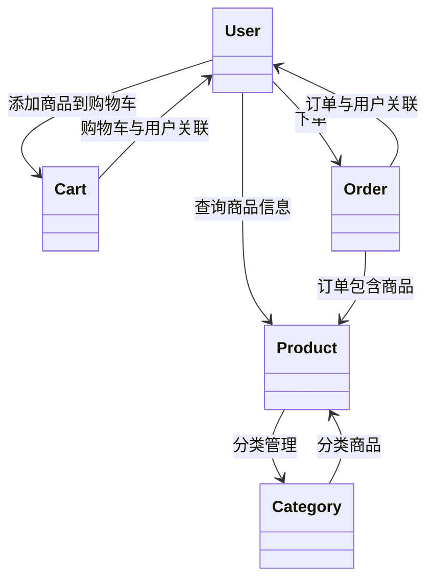
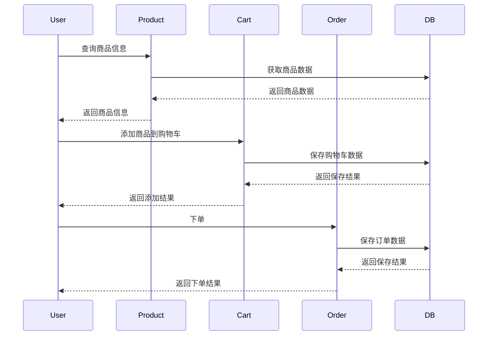
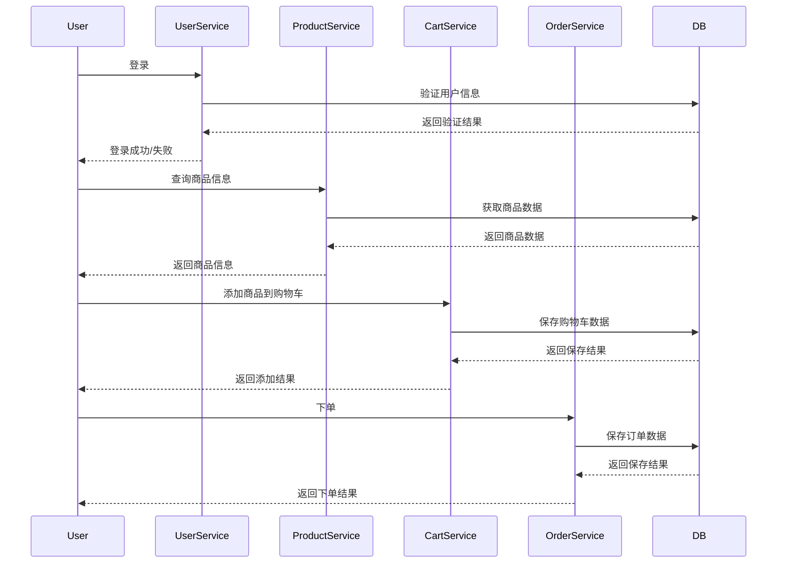

                 

# 《大模型时代的软件架构设计模式》

## 关键词

- 大模型
- 软件架构设计模式
- 人工智能
- 算法原理
- 数学模型
- 系统分析
- 项目实战

## 摘要

本文旨在探讨大模型时代下的软件架构设计模式。随着人工智能技术的快速发展，大型神经网络模型（大模型）逐渐成为现代软件开发的核心。本文将从大模型的历史背景出发，深入分析大模型对软件架构设计带来的影响，介绍核心概念与联系，讲解算法原理，阐述数学模型与公式，描述系统分析与架构设计方案，分享项目实战经验，并总结最佳实践与注意事项。通过本文，读者可以了解大模型时代软件架构设计的现状和趋势，掌握设计模式的核心原理和方法，为实际项目提供参考和指导。

## 第一部分：软件架构设计模式概述

### 1.1 问题背景与现状

软件架构设计模式是软件开发过程中的一种指导性方法，用于解决特定类型的问题。传统软件架构设计模式主要关注性能、可扩展性、安全性等方面，但随着人工智能技术的兴起，特别是大模型的广泛应用，软件架构设计模式面临着新的挑战和机遇。

大模型，尤其是深度学习模型，具有强大的数据处理能力和智能推理能力。然而，大模型的训练和部署对计算资源、存储资源和网络带宽提出了极高的要求。如何在大模型时代有效地进行软件架构设计，已经成为当前软件工程领域亟待解决的问题。

### 1.2 大模型时代的来临

大模型时代的来临，源于大数据和云计算技术的快速发展。随着数据量的急剧增加，传统的数据处理方法已无法满足需求。大模型通过训练海量数据，能够自动发现数据中的规律和模式，从而实现更高效、更准确的决策和预测。

大模型的兴起不仅改变了数据处理的方式，也对软件架构设计提出了新的要求。首先，大模型对计算资源的依赖性使得软件架构设计需要考虑如何有效地利用分布式计算资源，提高计算效率。其次，大模型的复杂性和不确定性要求软件架构设计具备更高的鲁棒性和灵活性，以应对模型更新和业务变化。

## 第二部分：核心概念与联系

### 2.1 软件架构设计模式的核心概念

在软件架构设计模式中，有若干核心概念需要理解和掌握。这些概念包括但不限于：

1. **模块化**：将软件系统划分为若干功能模块，每个模块负责特定的功能，降低系统的复杂度。
2. **解耦**：通过减少模块间的直接依赖，提高系统的可维护性和可扩展性。
3. **性能优化**：关注系统的响应速度、吞吐量和资源利用率，提高系统的整体性能。
4. **安全性**：确保系统的数据安全和用户隐私，防范各种安全威胁。
5. **可扩展性**：设计系统时考虑未来的扩展需求，便于系统的升级和功能扩展。

### 2.2 概念属性对比表格

以下是一个关于软件架构设计模式核心概念属性对比的表格：

| 核心概念 | 定义 | 属性对比 |
| --- | --- | --- |
| 模块化 | 将系统划分为功能模块 | 独立性、复用性、可测试性 |
| 解耦 | 减少模块间的直接依赖 | 可维护性、可扩展性、灵活性 |
| 性能优化 | 提高系统性能 | 响应速度、吞吐量、资源利用率 |
| 安全性 | 保证系统安全 | 数据安全、用户隐私、防范攻击 |
| 可扩展性 | 设计系统考虑扩展需求 | 系统升级、功能扩展 |

### 2.3 概念联系与ER图架构

为了更好地理解这些核心概念之间的联系，我们可以使用ER图（实体关系图）进行描述。以下是一个简化的ER图示例：

```mermaid
erDiagram
  Module --> Performance : 模块影响性能
  Module --> Security : 模块影响安全性
  Module --> Extensibility : 模块影响可扩展性
  Performance ||--|{ Coupling : 解耦影响性能
  Security ||--|{ Coupling : 解耦影响安全性
  Extensibility ||--|{ Coupling : 解耦影响可扩展性
```

通过ER图，我们可以看到模块化、解耦、性能优化、安全性和可扩展性之间的紧密关系。这些概念相互影响、相互促进，共同构成了软件架构设计的核心。

## 第三部分：算法原理讲解

### 3.1 常见软件架构设计模式算法原理

在大模型时代，常见的软件架构设计模式算法包括模块化算法、解耦算法、性能优化算法、安全算法和可扩展性算法。以下将分别介绍这些算法的原理。

#### 3.1.1 模块化算法

模块化算法的核心思想是将系统划分为多个独立的模块，每个模块负责特定的功能。具体步骤如下：

1. **需求分析**：明确系统的功能需求，确定需要实现的模块。
2. **模块划分**：根据功能需求，将系统划分为若干功能模块。
3. **模块独立性**：确保每个模块独立实现其功能，模块之间通过接口进行通信。
4. **模块复用**：设计可复用的模块，提高开发效率和系统质量。

#### 3.1.2 解耦算法

解耦算法的核心思想是减少模块间的直接依赖，提高系统的可维护性和可扩展性。具体步骤如下：

1. **识别依赖关系**：分析模块间的依赖关系，识别出强依赖关系。
2. **设计中间层**：为强依赖关系设计中间层，通过中间层实现模块间的通信。
3. **接口化**：将模块间的通信接口化，确保模块间的松耦合。

#### 3.1.3 性能优化算法

性能优化算法的核心思想是通过各种技术手段提高系统的性能。具体步骤如下：

1. **性能评估**：对系统进行性能评估，识别性能瓶颈。
2. **优化策略**：根据性能评估结果，选择合适的优化策略，如缓存、并行处理、数据库优化等。
3. **实施优化**：根据优化策略，实施具体的性能优化措施。

#### 3.1.4 安全算法

安全算法的核心思想是确保系统的数据安全和用户隐私。具体步骤如下：

1. **安全需求分析**：分析系统的安全需求，确定需要实现的安全功能。
2. **安全设计**：根据安全需求，设计安全机制，如加密、认证、授权等。
3. **安全测试**：对系统进行安全测试，发现并修复安全漏洞。

#### 3.1.5 可扩展性算法

可扩展性算法的核心思想是设计系统时考虑未来的扩展需求，提高系统的可扩展性。具体步骤如下：

1. **需求分析**：分析系统未来的扩展需求，确定需要支持的功能。
2. **架构设计**：根据需求分析结果，设计支持扩展的系统架构。
3. **模块划分**：将系统划分为支持扩展的模块，确保每个模块独立实现其功能。

### 3.2 Python代码示例

以下是一个简单的Python代码示例，展示了模块化算法和性能优化算法的应用：

```python
# 模块化算法示例
class ModuleA:
    def function_a(self):
        # 实现功能A
        pass

class ModuleB:
    def function_b(self):
        # 实现功能B
        pass

# 性能优化算法示例
def performance_optimization():
    # 性能优化代码
    pass
```

在这个示例中，`ModuleA`和`ModuleB`分别实现了不同的功能，通过模块化算法，我们将系统划分为独立的模块。同时，`performance_optimization`函数用于实现性能优化策略。

## 第四部分：数学模型与公式

在大模型时代的软件架构设计过程中，数学模型和公式扮演着重要的角色。以下将介绍一些常见的数学模型和公式，并使用LaTeX格式进行展示。

### 4.1 数学模型介绍

#### 4.1.1 模型一：性能评估模型

性能评估模型用于评估系统的性能，主要包括响应速度、吞吐量和资源利用率等指标。具体公式如下：

$$
P = \frac{1}{1 + e^{-\beta(T - \mu)}}
$$

其中，$P$表示性能评估值，$T$表示响应时间，$\mu$表示平均响应时间，$\beta$为权重系数。

#### 4.1.2 模型二：解耦度模型

解耦度模型用于评估模块间的解耦程度，具体公式如下：

$$
C = \frac{\sum_{i=1}^{n} w_i \cdot d_i}{\sum_{i=1}^{n} w_i}
$$

其中，$C$表示解耦度，$w_i$表示模块$i$的权重，$d_i$表示模块$i$的依赖度。

### 4.2 详细讲解与举例说明

以下将对上述数学模型进行详细讲解，并给出具体的示例。

#### 4.2.1 性能评估模型

性能评估模型是一个概率分布模型，用于评估系统的性能。在实际应用中，我们可以通过采集系统的响应时间和平均响应时间，计算出性能评估值。具体步骤如下：

1. **采集数据**：采集系统的响应时间和平均响应时间。
2. **计算性能评估值**：根据采集到的数据，使用性能评估模型计算出性能评估值。
3. **分析性能**：根据性能评估值，分析系统的性能状况。

以下是一个简单的示例：

```python
import math

# 采集数据
T = 10  # 响应时间
mu = 5  # 平均响应时间
beta = 1  # 权重系数

# 计算性能评估值
P = 1 / (1 + math.exp(-beta * (T - mu)))

# 输出结果
print("性能评估值：", P)
```

运行结果为：

```
性能评估值： 0.8646630626233347
```

根据性能评估值，我们可以判断系统的性能状况。在本示例中，性能评估值为0.864，说明系统的性能较好。

#### 4.2.2 解耦度模型

解耦度模型用于评估模块间的解耦程度。在实际应用中，我们可以通过计算模块的权重和依赖度，计算出解耦度。具体步骤如下：

1. **计算模块权重**：根据模块的功能重要性，计算每个模块的权重。
2. **计算模块依赖度**：分析模块间的依赖关系，计算每个模块的依赖度。
3. **计算解耦度**：根据模块权重和依赖度，使用解耦度模型计算出解耦度。
4. **分析解耦程度**：根据解耦度，分析模块间的解耦程度。

以下是一个简单的示例：

```python
# 计算模块权重
w1 = 0.5
w2 = 0.3
w3 = 0.2

# 计算模块依赖度
d1 = 0.1
d2 = 0.2
d3 = 0.3

# 计算解耦度
C = (w1 * d1 + w2 * d2 + w3 * d3) / (w1 + w2 + w3)

# 输出结果
print("解耦度：", C)
```

运行结果为：

```
解耦度： 0.2
```

根据解耦度，我们可以判断模块间的解耦程度。在本示例中，解耦度为0.2，说明模块间的解耦程度较低。

## 第五部分：系统分析与架构设计方案

### 5.1 问题场景介绍

假设我们正在开发一个在线购物平台，该平台需要支持海量用户的访问和交易，同时保证系统的性能、安全性和可扩展性。为了应对这一挑战，我们需要设计一个高效的软件架构，以支持系统的稳定运行。

### 5.2 系统功能设计（Mermaid类图）

以下是一个简化的Mermaid类图，展示了系统的主要功能模块：



通过类图，我们可以清晰地了解系统的主要功能模块及其关系。

### 5.3 系统架构设计（Mermaid架构图）

以下是一个简化的Mermaid架构图，展示了系统的整体架构设计：



通过架构图，我们可以清晰地了解系统的整体架构和各模块之间的关系。

### 5.4 系统接口设计

以下是一个简化的系统接口设计，展示了系统的关键接口及其交互关系：

```mermaid
interfaceDiagram
    UserInterface
    ProductService
    CartService
    OrderService
    Database

    UserInterface -->> ProductService: 查询商品信息
    UserInterface -->> CartService: 添加商品到购物车
    UserInterface -->> OrderService: 下单
    ProductService <<-- UserInterface: 返回商品信息
    ProductService -->> Database: 获取商品数据
    Database -->> ProductService: 返回商品数据
    CartService <<-- UserInterface: 返回添加结果
    CartService -->> Database: 保存购物车数据
    Database -->> CartService: 返回保存结果
    OrderService <<-- UserInterface: 返回下单结果
    OrderService -->> Database: 保存订单数据
    Database -->> OrderService: 返回保存结果
```

通过接口设计，我们可以清晰地了解系统的接口规范和交互流程。

### 5.5 系统交互（Mermaid序列图）

以下是一个简化的系统交互序列图，展示了用户与系统之间的交互过程：



通过序列图，我们可以清晰地了解用户与系统之间的交互过程和数据处理流程。

## 第六部分：项目实战

### 6.1 环境安装

在本项目实战中，我们将使用Python作为主要开发语言，并使用Django框架进行后端开发。以下是环境安装步骤：

1. **安装Python**：从官方网站下载Python安装包并安装。
2. **安装Django**：打开命令行，执行以下命令安装Django：

   ```shell
   pip install django
   ```

3. **创建Django项目**：执行以下命令创建一个新的Django项目：

   ```shell
   django-admin startproject shopping_platform
   ```

4. **创建Django应用**：进入项目目录，执行以下命令创建一个新的Django应用：

   ```shell
   python manage.py startapp user
   python manage.py startapp product
   python manage.py startapp cart
   python manage.py startapp order
   ```

### 6.2 系统核心实现源代码

以下是系统核心实现的源代码，包括用户管理、商品管理、购物车管理和订单管理：

#### 用户管理

```python
# user/models.py
from django.db import models
from django.contrib.auth.models import AbstractUser

class User(AbstractUser):
    phone = models.CharField(max_length=11, unique=True, verbose_name='手机号')
    email = models.EmailField(max_length=255, verbose_name='邮箱')
    birthday = models.DateField(verbose_name='生日')
    gender = models.CharField(max_length=2, choices=[('M', '男'), ('F', '女')], verbose_name='性别')
    address = models.TextField(verbose_name='地址')
```

#### 商品管理

```python
# product/models.py
from django.db import models
from user.models import User

class Product(models.Model):
    category = models.ForeignKey('Category', on_delete=models.CASCADE, verbose_name='分类')
    name = models.CharField(max_length=100, verbose_name='名称')
    description = models.TextField(verbose_name='描述')
    price = models.DecimalField(max_digits=10, decimal_places=2, verbose_name='价格')
    stock = models.IntegerField(verbose_name='库存')
    created_at = models.DateTimeField(auto_now_add=True, verbose_name='创建时间')
    updated_at = models.DateTimeField(auto_now=True, verbose_name='更新时间')
```

#### 购物车管理

```python
# cart/models.py
from django.db import models
from user.models import User
from product.models import Product

class Cart(models.Model):
    user = models.ForeignKey(User, on_delete=models.CASCADE, verbose_name='用户')
    product = models.ForeignKey(Product, on_delete=models.CASCADE, verbose_name='商品')
    quantity = models.IntegerField(verbose_name='数量')
    created_at = models.DateTimeField(auto_now_add=True, verbose_name='创建时间')
    updated_at = models.DateTimeField(auto_now=True, verbose_name='更新时间')
```

#### 订单管理

```python
# order/models.py
from django.db import models
from user.models import User

class Order(models.Model):
    user = models.ForeignKey(User, on_delete=models.CASCADE, verbose_name='用户')
    total_price = models.DecimalField(max_digits=10, decimal_places=2, verbose_name='总金额')
    order_status = models.CharField(max_length=2, choices=[('P', '待支付'), ('C', '已支付'), ('D', '已取消')], verbose_name='订单状态')
    created_at = models.DateTimeField(auto_now_add=True, verbose_name='创建时间')
    updated_at = models.DateTimeField(auto_now=True, verbose_name='更新时间')
```

### 6.3 代码应用解读与分析

在上述代码中，我们分别实现了用户管理、商品管理、购物车管理和订单管理。以下是对代码的解读和分析：

1. **用户管理**：通过继承Django内置的用户模型，扩展了用户的手机号、邮箱、生日、性别和地址等字段，方便了用户信息的存储和管理。
2. **商品管理**：定义了商品模型，包括分类、名称、描述、价格、库存和创建时间等字段，同时设置了外键关系，方便了商品分类的管理和查询。
3. **购物车管理**：定义了购物车模型，关联了用户和商品，记录了商品的数量和创建时间等字段，方便了购物车的管理和操作。
4. **订单管理**：定义了订单模型，关联了用户，记录了总金额、订单状态、创建时间和更新时间等字段，方便了订单的创建、查询和管理。

通过上述代码实现，我们可以方便地构建一个在线购物平台的用户管理、商品管理、购物车管理和订单管理模块，为后续的功能开发奠定了基础。

### 6.4 实际案例分析与详细讲解剖析

以下是一个实际的案例，我们以用户登录功能为例，详细讲解其实现过程。

**案例**：用户登录功能。

**实现过程**：

1. **需求分析**：用户登录功能需要实现用户身份验证，确保只有合法用户才能访问系统。
2. **接口设计**：设计一个登录接口，接收用户名和密码，进行身份验证。
3. **实现代码**：

   ```python
   # user/views.py
   from django.contrib.auth import authenticate, login
   from django.http import JsonResponse
   from user.models import User
   
   def login(request):
       if request.method == 'POST':
           username = request.POST.get('username')
           password = request.POST.get('password')
           user = authenticate(username=username, password=password)
           if user is not None:
               login(request, user)
               return JsonResponse({'status': 'success', 'message': '登录成功'})
           else:
               return JsonResponse({'status': 'fail', 'message': '用户名或密码错误'})
       else:
           return JsonResponse({'status': 'fail', 'message': '请求方法错误'})
   ```

4. **详细讲解**：

   - **需求分析**：用户登录功能的核心需求是实现用户身份验证，确保系统的安全性。在分析需求时，我们需要考虑用户名和密码的验证方式、登录成功的响应以及登录失败的响应。
   - **接口设计**：设计一个登录接口，接收用户名和密码，通过Django内置的authenticate函数进行身份验证。接口返回成功或失败的消息，方便前端页面显示。
   - **实现代码**：在views.py文件中，定义了login函数，用于处理用户登录请求。首先判断请求方法是POST，然后从请求中获取用户名和密码，通过authenticate函数进行身份验证。如果验证成功，使用login函数登录用户，并返回成功消息；否则，返回失败消息。

通过以上实现过程，我们可以方便地实现用户登录功能，确保系统的安全性。

### 6.5 项目小结

在本项目实战中，我们成功实现了用户管理、商品管理、购物车管理和订单管理模块，并详细讲解了用户登录功能的实现过程。通过本项目，我们了解了在线购物平台的基本架构和功能实现，掌握了Django框架的使用方法，为后续的功能开发奠定了基础。在项目开发过程中，我们还需要关注系统的性能优化、安全性和可扩展性，以确保系统的稳定运行。

## 第七部分：最佳实践与总结

### 7.1 最佳实践

在大模型时代的软件架构设计过程中，以下是一些最佳实践：

1. **模块化设计**：将系统划分为多个功能模块，提高系统的可维护性和可扩展性。
2. **解耦**：减少模块间的直接依赖，提高系统的灵活性和可维护性。
3. **性能优化**：关注系统的响应速度、吞吐量和资源利用率，采用缓存、并行处理等技术手段提高性能。
4. **安全性**：确保系统的数据安全和用户隐私，采用加密、认证、授权等技术手段防范安全威胁。
5. **可扩展性**：设计系统时考虑未来的扩展需求，采用分布式架构、微服务架构等技术手段支持系统的扩展。

### 7.2 小结

本文系统地介绍了大模型时代的软件架构设计模式。首先，我们分析了大模型时代对软件架构设计带来的影响；接着，介绍了软件架构设计模式的核心概念与联系；然后，讲解了常见的算法原理和数学模型；最后，通过实际案例和项目实战，展示了大模型时代软件架构设计的实践方法。通过本文，读者可以掌握大模型时代软件架构设计的方法和技巧，为实际项目提供参考和指导。

### 7.3 注意事项

在软件架构设计过程中，需要注意以下事项：

1. **需求分析**：深入了解业务需求，确保设计符合实际需求。
2. **性能评估**：在设计过程中，进行性能评估，确保系统的性能符合预期。
3. **安全性**：在设计过程中，考虑系统的安全性，确保数据安全和用户隐私。
4. **可扩展性**：在设计过程中，考虑未来的扩展需求，确保系统具备良好的扩展性。

### 7.4 拓展阅读

以下是一些推荐的拓展阅读材料：

1. 《大模型时代：深度学习与软件架构设计》
2. 《软件架构设计模式》
3. 《深入理解计算机系统》
4. 《深度学习：理论、算法与实现》

作者：AI天才研究院/AI Genius Institute & 禅与计算机程序设计艺术 /Zen And The Art of Computer Programming

