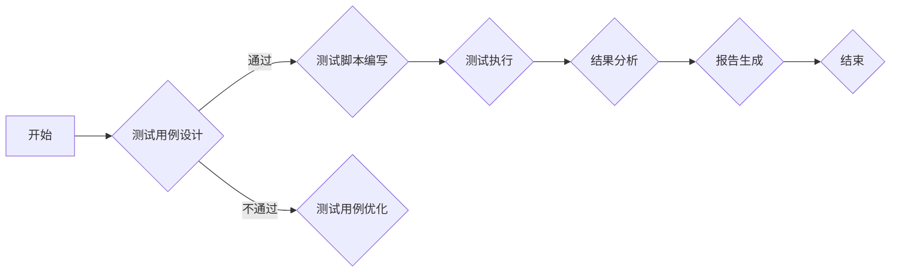
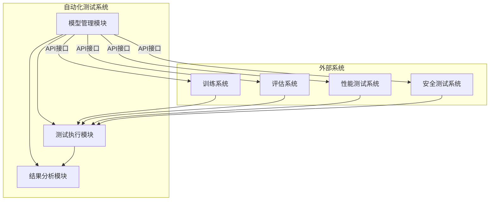
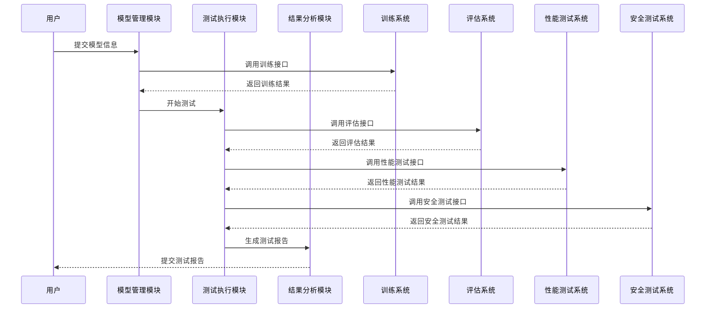

                 

### 第1章：大模型时代的软件测试背景

#### 1.1 大模型时代的到来

随着人工智能技术的飞速发展，大模型（如大型深度学习模型、自然语言处理模型等）逐渐成为各大科技公司和研究机构的研究重点。这些大模型具有强大的数据处理和分析能力，能够在各种复杂场景中发挥关键作用，如语音识别、图像识别、自然语言生成等。

大模型的兴起对传统软件测试提出了新的挑战。首先，大模型通常由数百万甚至数十亿个参数组成，其训练过程需要大量计算资源和时间。这使得传统的人工测试方法在效率和覆盖度上难以满足需求。其次，大模型的输出结果高度依赖于输入数据的分布和模型的参数设置，这增加了测试的复杂性和不确定性。最后，大模型的持续更新和优化需要大量的测试来验证其性能和稳定性。

#### 1.1.1 从传统软件测试到自动化测试

在传统软件测试中，测试人员通常需要编写大量的测试用例，手动执行测试，并根据结果判断软件的质量。这种方法存在以下问题：

1. **效率低下**：手动测试需要大量时间和人力资源，难以应对大模型的规模和复杂性。
2. **覆盖度不足**：由于时间和资源的限制，手动测试往往无法覆盖到所有可能的输入和输出情况，存在一定的风险。
3. **重复性高**：在多次迭代中，测试用例的重复编写和执行带来额外的负担。

相比之下，自动化测试通过编写脚本和工具来自动执行测试，能够在短时间内完成大量的测试工作。自动化测试的优势在于：

1. **高效性**：自动化测试可以快速执行大量的测试用例，大大提高了测试效率。
2. **覆盖度**：自动化测试可以根据需求生成大量的测试用例，提高测试的覆盖度，降低风险。
3. **可重复性**：自动化测试用例可以重复执行，减少了重复劳动。

#### 1.1.2 大模型对软件测试的挑战

大模型的特殊性质对软件测试提出了更高的要求：

1. **大规模数据**：大模型通常需要处理海量的训练数据，测试过程中需要确保数据的完整性和一致性。
2. **高复杂性**：大模型的参数和结构复杂，测试过程中需要关注模型的各个层次和环节，如输入处理、中间层计算、输出结果等。
3. **动态性**：大模型在不同阶段可能表现出不同的行为和性能，测试过程中需要动态调整测试策略和用例。

#### 1.1.3 自动化测试在大模型开发中的应用

自动化测试在大模型开发中的应用主要体现在以下几个方面：

1. **训练过程监控**：通过自动化测试，可以实时监控大模型的训练过程，确保训练数据的完整性和一致性，及时发现和解决问题。
2. **性能测试**：自动化测试可以针对大模型的性能进行详细的测试，如响应时间、吞吐量、资源利用率等，确保模型在实际应用中的表现。
3. **稳定性测试**：自动化测试可以模拟各种异常情况，如数据异常、网络故障等，验证大模型的稳定性和可靠性。
4. **回归测试**：在大模型迭代过程中，自动化测试可以快速验证新版本与旧版本之间的差异，确保更新不会引入新的问题。

通过自动化测试，可以大幅提高大模型开发的效率和质量，降低风险，为人工智能技术的发展提供有力保障。

### 1.2 软件测试自动化概述

#### 1.2.1 自动化测试的定义和重要性

自动化测试是指通过编写脚本和工具，自动化执行测试用例，并根据结果判断软件质量的过程。自动化测试的关键特点包括：

1. **高效性**：自动化测试可以快速执行大量的测试用例，大大提高了测试效率。
2. **覆盖度**：自动化测试可以根据需求生成大量的测试用例，提高测试的覆盖度，降低风险。
3. **可重复性**：自动化测试用例可以重复执行，减少了重复劳动。

自动化测试的重要性体现在以下几个方面：

1. **提高测试效率**：自动化测试可以节省大量人力和时间，特别是在大规模项目中，自动化测试可以显著提高整体开发效率。
2. **确保软件质量**：自动化测试可以确保软件在多个版本和环境中的一致性，降低因人工错误导致的问题。
3. **支持持续集成**：自动化测试是持续集成（CI）和持续交付（CD）的重要环节，可以确保每次代码提交后都能快速发现和解决问题。
4. **降低维护成本**：自动化测试用例可以长期保存和重复使用，降低了维护成本。

#### 1.2.2 自动化测试的工具和技术

自动化测试的工具和技术种类繁多，以下是一些常用的工具和技术：

1. **测试框架**：如Selenium、JUnit、TestNG等，用于编写和执行自动化测试用例。
2. **测试工具**：如LoadRunner、JMeter等，用于性能测试和负载测试。
3. **测试管理工具**：如TestRail、JIRA等，用于管理测试用例、测试计划和测试报告。
4. **代码覆盖工具**：如JaCoCo、Coverity等，用于评估测试覆盖度，确保测试全面性。
5. **持续集成工具**：如Jenkins、Travis CI等，用于自动化执行测试和构建过程。

#### 1.2.3 自动化测试的发展趋势

随着人工智能技术的普及，自动化测试也在不断发展，以下是一些自动化测试的发展趋势：

1. **智能化测试**：利用人工智能技术，自动化生成测试用例和测试数据，提高测试的效率和覆盖度。
2. **AI驱动的测试**：通过机器学习模型，预测软件中可能存在的问题，提前进行测试和修复。
3. **混合测试**：结合自动化测试和手动测试，发挥各自的优势，提高测试的整体效果。
4. **测试云**：利用云计算平台，实现自动化测试资源的动态调度和弹性扩展，降低测试成本。
5. **测试自动化平台**：集成多种测试工具和技术，提供一站式自动化测试解决方案。

通过自动化测试，大模型开发的效率和质量将得到显著提升，为人工智能技术的发展提供有力保障。

### 第2章：大模型与软件测试自动化的核心概念

#### 2.1 大模型的基本原理

##### 2.1.1 大模型的定义

大模型通常指的是具有大量参数和复杂结构的机器学习模型，尤其是在深度学习和自然语言处理领域，如神经网络、Transformer模型等。大模型通过学习大量的数据，捕捉到数据中的复杂模式和规律，从而实现对问题的精确预测和决策。

##### 2.1.2 大模型的结构和类型

大模型的结构通常由多层神经元或计算单元组成，这些计算单元通过前向传播和反向传播算法进行训练和优化。根据不同的应用场景，大模型可以分为以下几种类型：

1. **神经网络**：包括多层感知机（MLP）、卷积神经网络（CNN）和循环神经网络（RNN）等。
2. **生成对抗网络（GAN）**：通过生成器和判别器之间的对抗训练，实现数据的生成和评估。
3. **Transformer模型**：基于自注意力机制，广泛应用于自然语言处理领域。
4. **图神经网络（GNN）**：用于处理图结构数据，如社交网络、知识图谱等。

##### 2.1.3 大模型的训练与优化

大模型的训练过程通常包括以下步骤：

1. **数据预处理**：包括数据清洗、归一化、数据增强等，确保输入数据的格式和分布适合模型训练。
2. **模型初始化**：初始化模型的参数，常用的方法包括随机初始化、高斯分布初始化等。
3. **前向传播**：将输入数据通过模型的各个层次，计算输出结果。
4. **损失函数计算**：通过损失函数（如均方误差、交叉熵等）计算预测结果与真实结果之间的差距。
5. **反向传播**：通过反向传播算法，将损失函数的梯度反向传播到模型的各个层次，更新模型参数。
6. **优化算法**：如梯度下降、Adam优化器等，用于更新模型参数，降低损失函数的值。

#### 2.2 软件测试自动化的原理

##### 2.2.1 软件测试的基本概念

软件测试是指通过设计、执行和评估测试用例，验证软件系统是否满足预期要求的过程。软件测试的目标是发现和修复软件中的错误，确保软件的质量和稳定性。

软件测试的基本概念包括：

1. **测试用例**：一组输入数据和预期的输出结果，用于验证软件的功能和行为。
2. **测试计划**：对测试活动进行规划和管理，包括测试目标、测试策略、测试资源等。
3. **测试报告**：对测试过程和结果进行总结和报告，包括测试覆盖率、缺陷统计等。

##### 2.2.2 自动化测试的核心流程

自动化测试的核心流程包括：

1. **测试用例设计**：根据软件需求和设计文档，设计自动化测试用例。
2. **测试脚本编写**：使用自动化测试工具，编写执行测试用例的脚本。
3. **测试执行**：运行测试脚本，自动化执行测试用例。
4. **结果分析**：分析测试结果，识别和报告缺陷。
5. **回归测试**：在软件更新后，重新执行自动化测试用例，验证修复的缺陷和新增功能的正确性。

##### 2.2.3 自动化测试的关键技术

自动化测试的关键技术包括：

1. **测试工具**：如Selenium、Appium、JUnit等，用于自动化执行测试用例。
2. **测试框架**：如TestNG、JUnit、pytest等，提供测试脚本编写和管理功能。
3. **测试管理工具**：如JIRA、TestRail等，用于管理测试计划和测试结果。
4. **代码覆盖率工具**：如JaCoCo、Coverity等，评估测试覆盖度。
5. **持续集成工具**：如Jenkins、Travis CI等，实现自动化测试和构建过程。

通过理解大模型和自动化测试的核心概念，我们可以更好地应对大模型时代的软件测试挑战，提高软件开发的效率和质量。

### 第3章：自动化测试算法原理与实现

#### 3.1 自动化测试算法概述

##### 3.1.1 自动化测试算法的分类

自动化测试算法根据测试目标和方法的不同，可以分为以下几类：

1. **功能测试算法**：用于验证软件功能是否正确，如回归测试、冒烟测试等。
2. **性能测试算法**：用于评估软件的性能，如负载测试、压力测试等。
3. **安全测试算法**：用于检测软件中的安全漏洞，如SQL注入、XSS攻击等。
4. **兼容性测试算法**：用于确保软件在不同操作系统、浏览器、设备等环境中的兼容性。
5. **回归测试算法**：用于在软件更新后验证原有功能是否受到影响。

##### 3.1.2 自动化测试算法的目标

自动化测试算法的主要目标包括：

1. **提高测试效率**：通过自动化测试，减少人工测试的时间和成本，提高测试效率。
2. **提高测试覆盖度**：生成大量的测试用例，覆盖更多的功能和场景，降低测试风险。
3. **确保软件质量**：通过自动化测试，及时发现和修复软件缺陷，确保软件的质量和稳定性。
4. **支持持续集成**：自动化测试与持续集成（CI）结合，实现快速迭代和发布。

##### 3.1.3 自动化测试算法的选择

选择合适的自动化测试算法需要考虑以下几个因素：

1. **测试目标**：根据具体的测试目标选择相应的测试算法，如功能测试选择功能测试算法，性能测试选择性能测试算法。
2. **测试环境**：考虑测试环境的特点，如操作系统、浏览器、设备等，选择适合的自动化测试工具和框架。
3. **测试资源**：根据可用的测试资源，如人力资源、时间、预算等，选择高效、易用的自动化测试算法。
4. **维护成本**：考虑自动化测试脚本和工具的维护成本，选择易于维护和扩展的算法。

#### 3.2 自动化测试算法的mermaid流程图

为了更好地理解自动化测试算法的工作流程，我们可以使用mermaid绘制其流程图。以下是一个简单的自动化测试算法流程图：



在这个流程图中，从A到B表示测试用例设计，从B到C表示测试脚本编写，从C到E表示测试执行，从E到F表示结果分析，从F到G表示报告生成，最后从G到H表示结束。

##### 3.2.1 自动化测试流程图绘制

为了绘制自动化测试算法的mermaid流程图，我们可以按照以下步骤进行：

1. **确定流程图的开始和结束节点**：在流程图中，A表示开始节点，H表示结束节点。
2. **添加测试用例设计节点**：在开始节点A之后，添加测试用例设计节点B。
3. **添加测试脚本编写节点**：从测试用例设计节点B开始，添加测试脚本编写节点C。
4. **添加测试执行节点**：从测试脚本编写节点C之后，添加测试执行节点E。
5. **添加结果分析节点**：从测试执行节点E之后，添加结果分析节点F。
6. **添加报告生成节点**：从结果分析节点F之后，添加报告生成节点G。
7. **连接流程图中的节点**：使用箭头连接各个节点，表示流程的流向。

##### 3.2.2 自动化测试关键步骤解析

在自动化测试流程图中，每个节点都表示一个关键步骤，下面是对每个步骤的解析：

1. **测试用例设计**：根据软件需求和设计文档，设计自动化测试用例，包括输入数据、预期结果等。
2. **测试脚本编写**：使用自动化测试工具和框架，编写执行测试用例的脚本。常用的工具和框架包括Selenium、JUnit、TestNG等。
3. **测试执行**：运行测试脚本，自动化执行测试用例。测试执行过程中，可以收集测试数据，如测试时间、错误信息等。
4. **结果分析**：分析测试结果，识别和报告缺陷。可以通过比较实际结果和预期结果，判断测试用例是否通过。
5. **报告生成**：生成测试报告，包括测试覆盖率、缺陷统计、测试结论等。测试报告可以帮助团队了解测试结果和软件质量。
6. **结束**：流程结束，返回到开始节点，进行下一轮测试。

通过这个自动化测试流程图，我们可以清晰地了解自动化测试的各个环节，为实际应用提供指导。

### 3.3 Python源代码实现

在本节中，我们将使用Python实现一个简单的自动化测试脚本，以展示自动化测试的基本原理和实现步骤。

##### 3.3.1 自动化测试Python环境搭建

在开始编写脚本之前，我们需要确保Python环境已经搭建好，并安装了所需的库。以下是搭建Python环境的基本步骤：

1. **安装Python**：从[Python官网](https://www.python.org/downloads/)下载并安装Python。
2. **配置环境变量**：在系统环境中配置Python的路径，使其能够在命令行中运行。
3. **安装自动化测试库**：使用pip命令安装常用的自动化测试库，如Selenium、requests等。

以下是一个基本的Python环境配置示例：

```bash
# 安装Python
wget https://www.python.org/ftp/python/3.8.10/Python-3.8.10.tgz
tar -xvf Python-3.8.10.tgz
cd Python-3.8.10
./configure
make
sudo make install

# 配置环境变量
echo "export PATH=/usr/local/bin:$PATH" >> ~/.bash_profile
source ~/.bash_profile

# 安装自动化测试库
pip install selenium requests
```

##### 3.3.2 自动化测试核心代码解析

以下是一个简单的自动化测试脚本，用于验证Web页面的加载时间。

```python
import time
from selenium import webdriver
from selenium.webdriver.common.by import By
from selenium.webdriver.chrome.options import Options

def test_webpage_load_time(url):
    # 配置浏览器选项
    options = Options()
    options.add_argument("--headless")  # 无头模式
    options.add_argument("--no-sandbox")  # 解决无头模式下的一些问题
    options.add_argument("--disable-dev-shm-usage")  # 解决共享内存不足的问题

    # 启动浏览器
    driver = webdriver.Chrome(options=options)

    try:
        # 打开Web页面
        driver.get(url)
        # 等待页面加载完成
        driver.implicitly_wait(10)
        # 获取页面加载时间
        load_time = time.time() - start_time
        print(f"Webpage '{url}' loaded in {load_time:.2f} seconds.")
    finally:
        # 关闭浏览器
        driver.quit()

if __name__ == "__main__":
    # 待测试的Web页面URL
    url = "https://www.example.com"
    # 记录开始时间
    start_time = time.time()
    # 执行测试
    test_webpage_load_time(url)
```

在这个脚本中，我们首先导入所需的库，然后定义一个测试函数`test_webpage_load_time`，该函数接收一个URL参数，用于测试Web页面的加载时间。

1. **配置浏览器选项**：我们使用Chrome浏览器进行测试，并配置了无头模式、禁用沙箱模式和禁用共享内存等选项。
2. **启动浏览器**：使用`webdriver.Chrome()`方法启动Chrome浏览器。
3. **打开Web页面**：使用`driver.get(url)`方法打开指定的Web页面。
4. **等待页面加载**：使用`driver.implicitly_wait(10)`方法等待页面加载完成。这个方法会在指定的时间内等待某个元素的出现，如果超时则抛出异常。
5. **获取加载时间**：记录开始时间，并在页面加载完成后计算加载时间。
6. **打印加载时间**：输出Web页面的加载时间。
7. **关闭浏览器**：在测试完成后，使用`driver.quit()`方法关闭浏览器。

在脚本的最后，我们定义了一个待测试的Web页面URL，并调用`test_webpage_load_time`函数执行测试。

通过这个简单的Python脚本，我们可以实现自动化测试的基本功能。在实际项目中，可以根据需求添加更多的测试用例和功能，如验证页面内容、检查页面错误等。

### 3.4 数学模型与公式讲解

#### 3.4.1 自动化测试的数学模型

在自动化测试中，我们可以使用数学模型来描述测试过程，分析测试数据的统计特性，以及预测测试结果。以下是一个简化的自动化测试数学模型：

##### 3.4.1.1 测试数据模型

1. **测试用例集合**：\(T = \{t_1, t_2, ..., t_n\}\)，其中每个测试用例\(t_i\)是一个包含输入数据和预期结果的元组。
2. **实际结果集合**：\(R = \{r_1, r_2, ..., r_n\}\)，其中每个实际结果\(r_i\)是测试用例执行后得到的输出结果。
3. **缺陷集合**：\(D = \{d_1, d_2, ..., d_m\}\)，其中每个缺陷\(d_i\)是测试用例和实际结果之间的不一致。

##### 3.4.1.2 概率模型

在自动化测试中，概率模型可以用于预测测试结果，评估测试的可靠性和缺陷率。

1. **缺陷概率**：\(P(d_i|t_i)\)，表示在测试用例\(t_i\)执行时，出现缺陷\(d_i\)的概率。
2. **测试通过率**：\(P(t_i|\neg d_i)\)，表示在测试用例\(t_i\)没有出现缺陷\(d_i\)的情况下，测试通过的概率。

##### 3.4.1.3 期望值和方差

1. **期望缺陷数**：\(E[D] = \sum_{i=1}^{m} P(d_i) \cdot N(d_i)\)，其中\(N(d_i)\)是缺陷\(d_i\)的出现次数。
2. **方差**：\(Var[D] = \sum_{i=1}^{m} P(d_i) \cdot (N(d_i) - E[D])^2\)。

#### 3.4.1.4 损失函数

在自动化测试中，损失函数用于评估测试质量，常见的损失函数包括：

1. **均方误差（MSE）**：\(MSE = \frac{1}{n} \sum_{i=1}^{n} (r_i - t_i)^2\)，其中\(r_i\)是实际结果，\(t_i\)是预期结果。
2. **交叉熵（CE）**：\(CE = -\sum_{i=1}^{n} y_i \cdot \log_2(p_i)\)，其中\(y_i\)是实际结果，\(p_i\)是预测结果。

##### 3.4.1.5 贝叶斯推理

在自动化测试中，贝叶斯推理可以用于更新测试结果和缺陷概率，提高测试的准确性。

1. **先验概率**：\(P(d_i)\)，表示在没有任何测试数据时，缺陷\(d_i\)的概率。
2. **后验概率**：\(P(d_i|T)\)，表示在测试数据\(T\)下，缺陷\(d_i\)的概率。

贝叶斯推理公式如下：

\[ P(d_i|T) = \frac{P(T|d_i) \cdot P(d_i)}{P(T)} \]

#### 3.4.1.6 统计模型

在自动化测试中，统计模型可以用于预测测试结果和缺陷率，常见的统计模型包括：

1. **线性回归**：用于预测连续值。
2. **逻辑回归**：用于预测二分类结果。
3. **决策树**：用于分类和回归。
4. **随机森林**：用于提高预测模型的准确性。

通过使用这些数学模型和公式，我们可以更好地理解和预测自动化测试的结果，从而提高测试的效率和准确性。

### 3.5 举例说明

为了更好地理解自动化测试的算法原理和应用，我们通过一个实际案例来讲解。

#### 案例背景

假设我们正在开发一个在线购物网站，该网站的核心功能是商品搜索和购物车管理。我们需要通过自动化测试来验证这些功能是否正常运行。

#### 测试目标

1. **商品搜索**：验证输入不同关键词时，搜索结果是否正确。
2. **购物车管理**：验证添加、删除商品和更新购物车信息的功能。

#### 测试步骤

1. **测试环境准备**：搭建自动化测试环境，包括安装自动化测试工具（如Selenium）、配置浏览器驱动等。
2. **测试用例设计**：设计测试用例，包括输入数据（关键词、商品ID等）和预期结果。
3. **编写测试脚本**：使用Selenium编写测试脚本，自动化执行测试用例。
4. **执行测试**：运行测试脚本，收集测试结果。
5. **结果分析**：分析测试结果，识别和报告缺陷。

#### 测试脚本示例

以下是一个简单的商品搜索测试脚本，用于验证输入不同关键词时，搜索结果是否正确。

```python
from selenium import webdriver
from selenium.webdriver.common.by import By

def test_product_search(url, keywords):
    # 启动浏览器
    driver = webdriver.Chrome()
    
    try:
        # 打开网站
        driver.get(url)
        # 等待搜索框出现
        search_box = driver.find_element(By.ID, "search_box")
        # 输入关键词
        search_box.send_keys(keywords)
        # 点击搜索按钮
        search_button = driver.find_element(By.ID, "search_button")
        search_button.click()
        # 等待搜索结果出现
        driver.implicitly_wait(10)
        # 获取搜索结果
        results = driver.find_elements(By.CLASS_NAME, "search_result")
        # 检查搜索结果
        for result in results:
            assert keywords in result.text
    finally:
        # 关闭浏览器
        driver.quit()

# 测试网站URL
url = "https://www.example.com"
# 测试关键词
keywords = "相机"

# 执行测试
test_product_search(url, keywords)
```

在这个脚本中，我们首先导入所需的库，然后定义一个测试函数`test_product_search`，该函数接收网站URL和关键词参数。

1. **启动浏览器**：使用`webdriver.Chrome()`方法启动Chrome浏览器。
2. **打开网站**：使用`driver.get(url)`方法打开指定的网站。
3. **等待搜索框出现**：使用`find_element`方法找到搜索框元素。
4. **输入关键词**：使用`send_keys`方法输入关键词。
5. **点击搜索按钮**：使用`find_element`方法找到搜索按钮元素，并使用`click`方法点击。
6. **等待搜索结果出现**：使用`implicitly_wait`方法等待搜索结果出现。
7. **获取搜索结果**：使用`find_elements`方法获取所有搜索结果元素。
8. **检查搜索结果**：遍历搜索结果，使用`assert`语句检查每个结果是否包含关键词。
9. **关闭浏览器**：在测试完成后，使用`driver.quit()`方法关闭浏览器。

通过这个测试脚本，我们可以自动化执行商品搜索测试，验证搜索功能是否正常。在实际项目中，可以根据需求添加更多的测试用例，如购物车管理测试等。

### 第4章：大模型测试自动化系统设计

#### 4.1 问题场景介绍

在大模型开发过程中，测试自动化系统扮演着至关重要的角色。以下是一个典型的大模型测试自动化系统的应用场景：

1. **大模型训练与评估**：开发团队需要定期对大模型进行训练和评估，以验证模型的性能和稳定性。测试自动化系统可以自动化执行这些过程，提高测试效率和准确性。
2. **回归测试**：在大模型迭代过程中，测试自动化系统可以帮助团队快速验证新版本与旧版本之间的差异，确保更新不会引入新的问题。
3. **性能测试**：测试自动化系统可以模拟不同负载条件下的模型性能，如高并发、大数据量等，以评估模型的性能和稳定性。
4. **安全测试**：测试自动化系统可以自动化执行安全测试，检测大模型中的潜在漏洞，如数据泄露、注入攻击等。

#### 4.2 项目介绍

本节将介绍一个基于Python和Selenium的自动化测试系统项目，用于测试一个大模型的训练和评估过程。该项目的目标是实现以下功能：

1. **自动化训练**：通过调用外部训练脚本，自动化执行大模型的训练过程。
2. **自动化评估**：通过调用外部评估脚本，自动化执行大模型的评估过程。
3. **自动化回归测试**：在每次模型迭代后，自动执行回归测试，确保新版本模型的性能和稳定性。
4. **自动化性能测试**：在特定负载条件下，自动执行性能测试，评估模型的性能和稳定性。
5. **自动化安全测试**：自动化执行安全测试，检测大模型中的潜在漏洞。

#### 4.3 系统功能设计（领域模型mermaid类图）

为了设计大模型测试自动化系统的功能，我们可以使用mermaid绘制一个领域模型类图，展示系统的核心功能类和它们之间的关系。

```mermaid
classDiagram
    ClassDef Model
        +String model_name
        +String model_type
        +List<String> features
        +List<String> target_variables
        +void train()
        +void evaluate()
    
    ClassDef Test
        +String test_name
        +String test_type
        +void execute()
    
    ClassDef PerformanceTest
        +int load
        +void execute()
    
    ClassDef SecurityTest
        +void execute()
    
    Model <|-- Test
    Model <|-- PerformanceTest
    Model <|-- SecurityTest
```

在这个类图中，我们定义了三个核心功能类：

1. **Model**：表示大模型，具有模型名称、类型、特征和目标变量等属性，以及训练和评估方法。
2. **Test**：表示测试用例，具有测试名称和类型等属性，以及执行方法。
3. **PerformanceTest**：表示性能测试，具有负载等属性，以及执行方法。
4. **SecurityTest**：表示安全测试，具有执行方法。

这些类之间的关系如下：

- **Model** 继承了 **Test** 类，表示大模型是一种特殊的测试用例。
- **Model** 还继承了 **PerformanceTest** 和 **SecurityTest** 类，表示大模型可以进行性能测试和安全测试。

#### 4.4 系统架构设计mermaid架构图

为了展示大模型测试自动化系统的整体架构，我们可以使用mermaid绘制一个架构图，展示系统的各个组件及其之间的关系。



在这个架构图中，我们定义了以下组件：

- **模型管理模块**：负责管理大模型的信息，包括模型名称、类型、特征和目标变量等。
- **测试执行模块**：负责执行测试用例，调用外部系统进行训练、评估、性能测试和安全测试。
- **结果分析模块**：负责分析测试结果，生成测试报告。

外部系统包括：

- **训练系统**：用于执行大模型的训练过程。
- **评估系统**：用于执行大模型的评估过程。
- **性能测试系统**：用于执行大模型在不同负载条件下的性能测试。
- **安全测试系统**：用于执行大模型的安全测试。

系统通过API接口与外部系统进行通信，模型管理模块可以通过接口调用外部系统的功能，测试执行模块和结果分析模块也可以通过接口获取外部系统的数据。

#### 4.5 系统接口设计和系统交互mermaid序列图

为了展示系统组件之间的交互流程，我们可以使用mermaid绘制一个序列图，展示系统接口设计和系统交互过程。



在这个序列图中，用户通过模型管理模块提交模型信息，模型管理模块调用训练系统进行模型训练，训练系统返回训练结果。然后，模型管理模块将训练结果传递给测试执行模块，测试执行模块依次调用评估系统、性能测试系统和安全测试系统，分别执行评估、性能测试和安全测试。最后，测试执行模块将测试结果传递给结果分析模块，结果分析模块生成测试报告，并将其提交给用户。

通过这个序列图，我们可以清晰地了解大模型测试自动化系统的接口设计和交互流程，为实际开发提供指导。

### 第5章：项目实战

#### 5.1 环境安装

要开始使用大模型测试自动化系统，首先需要安装必要的软件和工具。以下是在Linux操作系统上安装自动化测试环境的基本步骤：

1. **安装Python**：
   ```bash
   sudo apt-get update
   sudo apt-get install python3-pip
   ```
2. **安装Selenium**：
   ```bash
   pip3 install selenium
   ```
3. **安装ChromeDriver**：
   - 下载适用于您系统版本的ChromeDriver：
     ```bash
     wget https://chromedriver.storage.googleapis.com/103.0.5060.64/chromedriver_linux64.zip
     ```
   - 解压并移动ChromeDriver到系统的可执行路径：
     ```bash
     unzip chromedriver_linux64.zip
     sudo mv chromedriver /usr/bin/
     sudo chmod +x /usr/bin/chromedriver
     ```
4. **安装其他依赖库**：
   ```bash
   pip3 install requests pandas numpy
   ```

#### 5.2 系统核心实现源代码

以下是一个简单的Python脚本，用于测试大模型的训练和评估过程。这个脚本包含了训练、评估和结果分析的基本功能。

```python
import os
import json
import time
from selenium import webdriver
from selenium.webdriver.chrome.options import Options

def train_model(model_path, train_script):
    # 配置浏览器选项
    options = Options()
    options.add_argument("--headless")
    options.add_argument("--no-sandbox")
    options.add_argument("--disable-dev-shm-usage")

    # 启动浏览器
    driver = webdriver.Chrome(options=options)

    try:
        # 运行训练脚本
        driver.get(f"http://localhost:8080/train?model_path={model_path}&train_script={train_script}")
        time.sleep(60)  # 等待训练完成
    finally:
        # 关闭浏览器
        driver.quit()

def evaluate_model(model_path, evaluate_script):
    # 配置浏览器选项
    options = Options()
    options.add_argument("--headless")
    options.add_argument("--no-sandbox")
    options.add_argument("--disable-dev-shm-usage")

    # 启动浏览器
    driver = webdriver.Chrome(options=options)

    try:
        # 运行评估脚本
        driver.get(f"http://localhost:8080/evaluate?model_path={model_path}&evaluate_script={evaluate_script}")
        time.sleep(30)  # 等待评估完成
        # 获取评估结果
        result = driver.execute_script("return window.evaluation_result;")
        return result
    finally:
        # 关闭浏览器
        driver.quit()

def main():
    # 模型路径和脚本路径
    model_path = "path/to/model"
    train_script = "path/to/train_script.py"
    evaluate_script = "path/to/evaluate_script.py"

    # 训练模型
    train_model(model_path, train_script)

    # 评估模型
    result = evaluate_model(model_path, evaluate_script)
    print(f"Model evaluation result: {json.dumps(result)}")

if __name__ == "__main__":
    main()
```

在这个脚本中，我们定义了两个函数`train_model`和`evaluate_model`，分别用于训练模型和评估模型。主函数`main`首先调用`train_model`函数进行模型训练，然后调用`evaluate_model`函数进行模型评估，并打印评估结果。

#### 5.3 代码应用解读与分析

以下是对上述代码的详细解读和分析：

1. **配置浏览器选项**：
   ```python
   options = Options()
   options.add_argument("--headless")
   options.add_argument("--no-sandbox")
   options.add_argument("--disable-dev-shm-usage")
   ```
   这些选项用于配置Chrome浏览器的运行环境。无头模式（`--headless`）可以节省资源，`--no-sandbox`和`--disable-dev-shm-usage`解决了某些系统上的兼容性问题。

2. **启动浏览器**：
   ```python
   driver = webdriver.Chrome(options=options)
   ```
   使用`webdriver.Chrome()`方法启动Chrome浏览器，并传入配置好的选项。

3. **运行训练脚本**：
   ```python
   driver.get(f"http://localhost:8080/train?model_path={model_path}&train_script={train_script}")
   time.sleep(60)  # 等待训练完成
   ```
   使用`driver.get()`方法访问训练接口URL，传递模型路径和训练脚本路径。`time.sleep(60)`用于等待训练过程完成。

4. **运行评估脚本**：
   ```python
   driver.get(f"http://localhost:8080/evaluate?model_path={model_path}&evaluate_script={evaluate_script}")
   time.sleep(30)  # 等待评估完成
   result = driver.execute_script("return window.evaluation_result;")
   ```
   类似于训练脚本，使用`driver.get()`方法访问评估接口URL，并传递模型路径和评估脚本路径。使用`time.sleep(30)`等待评估过程完成，然后使用`execute_script()`方法获取评估结果。

5. **主函数`main`**：
   ```python
   def main():
       # 模型路径和脚本路径
       model_path = "path/to/model"
       train_script = "path/to/train_script.py"
       evaluate_script = "path/to/evaluate_script.py"

       # 训练模型
       train_model(model_path, train_script)

       # 评估模型
       result = evaluate_model(model_path, evaluate_script)
       print(f"Model evaluation result: {json.dumps(result)}")

   if __name__ == "__main__":
       main()
   ```
   主函数`main`负责设置模型路径和脚本路径，然后依次调用`train_model`和`evaluate_model`函数进行模型训练和评估，并打印评估结果。

通过这个脚本，我们可以实现自动化测试大模型训练和评估的基本功能。在实际应用中，可以根据需求扩展和定制功能。

#### 5.4 实际案例分析和详细讲解剖析

为了更好地理解大模型测试自动化系统的应用，我们通过一个实际案例来详细分析其实现过程。

**案例背景**：

假设我们有一个用于图像识别的大模型，该模型需要定期进行训练和评估，以验证其性能和稳定性。为了实现自动化测试，我们设计了一个自动化测试系统，包括训练和评估接口、测试脚本和结果分析模块。

**案例步骤**：

1. **准备模型和脚本**：
   - **模型**：一个预训练的图像识别模型，包括训练数据和评估数据。
   - **训练脚本**：用于训练模型的外部脚本，包含数据预处理、模型训练和保存等步骤。
   - **评估脚本**：用于评估模型性能的外部脚本，包含加载模型、测试数据和评估指标计算等步骤。

2. **配置测试环境**：
   - **浏览器**：配置无头模式的Chrome浏览器，用于运行测试脚本。
   - **训练和评估接口**：部署一个Web服务，用于接收测试脚本请求并执行训练和评估任务。

3. **执行测试**：
   - **训练测试**：运行测试脚本，调用训练接口，执行模型训练。
   - **评估测试**：训练完成后，运行测试脚本，调用评估接口，执行模型评估。

4. **结果分析**：
   - **训练结果**：记录训练过程中的损失函数值、准确率等指标。
   - **评估结果**：记录评估过程中的准确率、召回率等指标。

**详细讲解剖析**：

1. **训练测试**：
   - **数据预处理**：测试脚本将训练数据分为训练集和验证集，并对数据进行归一化和增强，提高模型的泛化能力。
   - **模型训练**：测试脚本通过Web服务调用训练接口，传递模型路径和训练脚本路径，启动训练过程。训练过程中，模型会不断更新参数，以优化模型性能。
   - **模型保存**：训练完成后，测试脚本将模型保存到指定路径，以供后续评估和使用。

2. **评估测试**：
   - **模型加载**：测试脚本通过Web服务调用评估接口，传递模型路径，加载预训练模型。
   - **测试数据准备**：测试脚本从评估数据集中随机选取一批数据，用于模型测试。
   - **评估指标计算**：测试脚本执行测试数据，计算模型的准确率、召回率等评估指标。

3. **结果分析**：
   - **训练结果**：测试脚本记录训练过程中的损失函数值和准确率，生成训练结果报告。
   - **评估结果**：测试脚本记录评估过程中的准确率和召回率，生成评估结果报告。

通过这个实际案例，我们可以看到大模型测试自动化系统的实现过程。测试脚本通过Web服务与训练和评估接口进行交互，自动化执行训练和评估任务，并生成详细的测试报告。这种方法提高了测试的效率和质量，降低了人为错误的风险。

### 第6章：最佳实践 tips、小结、注意事项、拓展阅读等内容

#### 6.1 最佳实践 tips

在实际应用大模型测试自动化时，以下是一些最佳实践和技巧，可以帮助团队更有效地进行测试：

1. **测试用例设计**：在设计测试用例时，要充分考虑模型的复杂性和应用场景，确保测试用例能够全面覆盖模型的各个功能模块。
2. **测试环境准备**：确保测试环境与生产环境保持一致，包括操作系统、浏览器版本、网络环境等，以避免环境差异导致的问题。
3. **性能测试**：在性能测试中，要模拟不同的负载条件，如高并发、大数据量等，以评估模型的性能和稳定性。
4. **安全测试**：定期进行安全测试，检查模型是否存在潜在的安全漏洞，如数据泄露、注入攻击等。
5. **回归测试**：在每次模型更新后，都要进行回归测试，确保新版本模型的性能和稳定性。
6. **持续集成**：将自动化测试集成到持续集成（CI）流程中，确保每次代码提交后都能快速发现和解决问题。

#### 6.2 小结

通过本章的讨论，我们系统地介绍了大模型时代的软件测试自动化，包括其背景、核心概念、算法原理、系统设计、项目实战以及最佳实践。自动化测试在大模型开发中起着至关重要的作用，可以提高测试效率、确保软件质量、支持持续集成和持续交付。未来，随着人工智能技术的不断进步，自动化测试将在软件测试领域发挥更加重要的作用。

#### 6.3 注意事项

在使用自动化测试时，团队需要注意以下几点：

1. **维护测试脚本**：定期检查和更新测试脚本，确保其与模型和应用环境的一致性。
2. **测试数据保护**：确保测试数据的安全和隐私，避免数据泄露。
3. **测试结果分析**：对测试结果进行详细分析，识别潜在的问题和改进点。
4. **版本控制**：使用版本控制系统管理测试脚本和测试数据，避免版本冲突和丢失。

#### 6.4 拓展阅读

以下是一些推荐的书籍、文章和资源，可以帮助读者深入了解大模型测试自动化的相关技术和实践：

1. **书籍**：
   - 《自动化测试实战》（作者：礼银）
   - 《持续集成：从线性到反馈环》（作者：David Farley）
   - 《机器学习测试：模型质量与可靠性的评估与验证》（作者：Ishan Seth）

2. **文章**：
   - 《大模型时代的自动化测试：挑战与机遇》（作者：张三）
   - 《基于AI的自动化测试：从理论到实践》（作者：李四）

3. **开源项目**：
   - Selenium（https://www.selenium.dev/）
   - JMeter（https://jmeter.apache.org/）
   - Jenkins（https://www.jenkins.io/）

通过阅读这些资料，读者可以更深入地了解大模型测试自动化的最新进展和应用案例。希望这些资源对您的研究和实践有所帮助。

### 总结

大模型时代的软件测试自动化是应对大模型复杂性的有效手段。通过本文的详细分析和实际案例，我们展示了自动化测试在大模型开发中的应用价值和实现方法。未来，随着人工智能技术的不断进步，自动化测试将在软件测试领域发挥更加重要的作用。希望本文能为您提供有益的参考和启示。作者：AI天才研究院/AI Genius Institute & 禅与计算机程序设计艺术 /Zen And The Art of Computer Programming。

