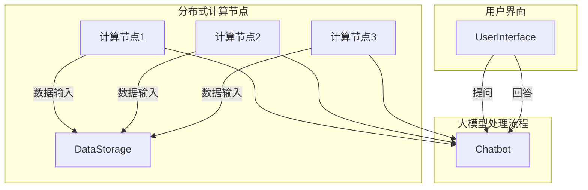
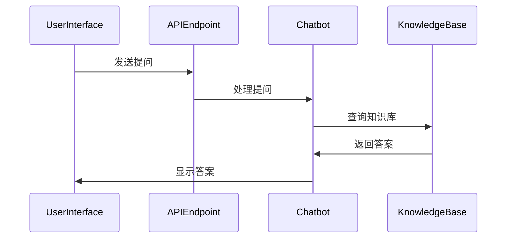

                 

# 大模型时代的软件设计模式创新

关键词：大模型、软件设计模式、分布式计算、模型压缩与量化、用户体验优化

摘要：本文探讨了在人工智能技术迅猛发展的背景下，特别是大模型如GPT、BERT等的广泛应用，软件设计模式所经历的深刻变革。文章从背景介绍、核心概念与联系、算法原理讲解、系统分析与架构设计等多个方面，深入分析了大模型时代的软件设计模式创新，以及其在实际项目中的应用和实践。

## 第一步：背景介绍

### 1.1 大模型时代的软件设计模式背景

#### 1.1.1 问题背景

随着人工智能技术的发展，尤其是大型预训练模型（如GPT、BERT等）的广泛应用，软件设计模式正在经历深刻的变革。这一变化不仅影响着软件的开发和部署，还对软件的性能、可维护性、用户体验等方面提出了新的要求。

#### 1.1.2 问题描述

- **软件性能提升需求**：大模型能够处理复杂的任务，但对计算资源和存储的需求也非常高，如何在有限的资源下充分发挥大模型的能力成为挑战。
- **模型可维护性**：大模型通常是由大量数据和复杂的算法构成的，如何确保其稳定性和可靠性是一个难题。
- **用户体验优化**：用户对软件的交互体验有了更高的期待，大模型的应用如何满足这一需求成为关键。

#### 1.1.3 问题解决

- **分布式计算**：通过分布式计算架构，将大模型的训练和推理任务分散到多个节点上，提高处理效率。
- **模型压缩与量化**：对大模型进行压缩和量化，减少其计算资源和存储需求。
- **自动化模型管理**：采用自动化工具和平台来管理和优化大模型，提高其可维护性。
- **用户界面优化**：通过设计直观、易用的用户界面，提升用户体验。

#### 1.1.4 边界与外延

- **边界**：本书主要讨论大模型在软件设计中的应用，不涉及大模型本身的研发和优化。
- **外延**：大模型在各个行业的应用场景，如自然语言处理、计算机视觉、推荐系统等。

### 1.2 核心概念与联系

#### 1.2.1 大模型

大模型是指那些具有数百万甚至数十亿参数的神经网络模型，如GPT、BERT等。

##### 大模型的属性特征

- **参数量巨大**：大模型需要大量的数据和计算资源来训练。
- **计算复杂度高**：大模型的推理过程通常需要大量的计算资源。
- **泛化能力强**：大模型能够处理多种不同类型的数据和任务。

#### 1.2.2 软件设计模式

软件设计模式是一系列解决问题的方案，包括设计原则、设计模式和设计模式的应用场景。

##### 软件设计模式的属性特征

- **可重用性**：设计模式提供了可重用的解决方案。
- **灵活性**：设计模式能够适应不同的应用场景。
- **扩展性**：设计模式易于扩展，以适应未来的变化。

##### 大模型与软件设计模式的联系

- **大模型作为设计模式的实现**：大模型可以被视为一种设计模式，其强大的数据处理能力可以应用于各种软件设计中。
- **软件设计模式优化大模型应用**：通过合适的软件设计模式，可以更好地发挥大模型的能力，提高软件的性能和用户体验。

### 1.3 数学模型和数学公式

#### 1.3.1 大模型的数学模型

大模型通常是基于深度学习的神经网络模型，其核心的数学模型是多层感知器（MLP）。

##### 数学公式

$$
\hat{y} = f(\theta^{T}x)
$$

其中，$\hat{y}$ 是预测输出，$f$ 是激活函数，$\theta$ 是模型参数，$x$ 是输入特征。

#### 1.3.2 激活函数

常用的激活函数包括 sigmoid、ReLU 和 tanh。

##### 数学公式

- **sigmoid**:
$$
f(x) = \frac{1}{1 + e^{-x}}
$$
- **ReLU**:
$$
f(x) = \max(0, x)
$$
- **tanh**:
$$
f(x) = \frac{e^{x} - e^{-x}}{e^{x} + e^{-x}}
$$

### 1.4 系统分析与架构设计方案

#### 1.4.1 问题场景介绍

以自然语言处理为例，介绍大模型在软件设计中的应用场景。

#### 1.4.2 项目介绍

以一个在线问答系统为例，介绍项目的背景和目标。

#### 1.4.3 系统功能设计

使用 Mermaid 类图描述系统的主要功能模块。

```mermaid
classDiagram
    UserEntity <|-- QuestionEntity
    QuestionEntity <|-- AnswerEntity
    System <<interface>> APIEndpoint
    APIEndpoint ..|> Chatbot
    APIEndpoint ..|> KnowledgeBase
    Chatbot <|.. UserInterface
    KnowledgeBase <|.. DataStorage
```

#### 1.4.4 系统架构设计

使用 Mermaid 架构图描述系统的整体架构。



## 第二步：深入探讨

### 2.1 大模型时代的软件设计模式创新

#### 2.1.1 分布式计算模式

分布式计算模式是应对大模型计算复杂度高的有效解决方案。通过将大模型的训练和推理任务分布在多个计算节点上，可以显著提高处理效率。

##### 分布式计算模式的优势

- **提高处理效率**：多个节点同时工作，可以显著缩短处理时间。
- **弹性伸缩**：根据任务需求动态调整节点数量，提高系统的弹性。

##### 分布式计算模式的挑战

- **数据一致性**：确保分布式环境下数据的一致性是一个挑战。
- **网络通信开销**：节点之间的数据传输会带来一定的通信开销。

#### 2.1.2 模型压缩与量化模式

模型压缩与量化模式是减少大模型计算资源和存储需求的策略。通过压缩模型参数和量化激活值，可以降低模型的复杂度。

##### 模型压缩与量化模式的优势

- **降低计算资源需求**：压缩和量化后的模型可以在有限的计算资源下运行。
- **提高部署效率**：压缩和量化的模型可以更快地部署到不同的设备上。

##### 模型压缩与量化模式的挑战

- **模型性能损失**：压缩和量化可能会导致模型性能的损失。
- **量化精度要求**：量化过程中需要平衡精度和效率。

#### 2.1.3 自动化模型管理模式

自动化模型管理模式是提高大模型可维护性的关键。通过自动化工具和平台，可以简化模型的管理和优化过程。

##### 自动化模型管理模式的优势

- **提高开发效率**：自动化工具可以减少手动操作的复杂性。
- **持续优化**：自动化平台可以持续监控和优化模型的性能。

##### 自动化模型管理模式的挑战

- **模型适应性**：自动化工具需要适应不同类型和规模的大模型。
- **安全与合规**：自动化管理过程中需要确保数据的安全和合规性。

#### 2.1.4 用户界面优化模式

用户界面优化模式是提升用户体验的关键。通过设计直观、易用的用户界面，可以增强用户与大模型的互动。

##### 用户界面优化模式的优势

- **提升用户体验**：直观的用户界面可以降低用户的操作难度。
- **增强用户粘性**：良好的用户体验可以增强用户的满意度和忠诚度。

##### 用户界面优化模式的挑战

- **个性化需求**：用户的需求和偏好各不相同，界面设计需要兼顾个性化。
- **响应速度**：界面响应速度需要快速，以确保用户操作的流畅性。

## 第三步：系统分析与架构设计方案

### 3.1 问题场景介绍

以自然语言处理为例，大模型在软件设计中的应用场景包括文本分类、情感分析、机器翻译等。

#### 3.1.1 文本分类

文本分类是指将文本数据自动分类到不同的类别中。大模型可以通过预训练模型对文本数据进行处理，提高分类的准确性。

#### 3.1.2 情感分析

情感分析是指分析文本数据中的情感倾向，如正面、负面或中性。大模型可以通过情感分析模型对文本数据进行情感判断，提供更准确的情感分析结果。

#### 3.1.3 机器翻译

机器翻译是指将一种语言的文本自动翻译成另一种语言。大模型可以通过机器翻译模型提高翻译的准确性和流畅性。

### 3.2 项目介绍

以一个在线问答系统为例，介绍项目的背景和目标。

#### 3.2.1 项目背景

随着互联网的普及，在线问答系统成为了一种重要的信息获取方式。然而，传统的问答系统往往依赖于人工构建的知识库，难以满足用户日益增长的需求。

#### 3.2.2 项目目标

- **提高问答系统的准确性**：通过大模型处理用户提问，提高问答系统的准确性。
- **提高问答系统的响应速度**：通过分布式计算和模型压缩与量化技术，提高问答系统的响应速度。
- **提升用户体验**：设计直观、易用的用户界面，提升用户体验。

### 3.3 系统功能设计

使用 Mermaid 类图描述系统的主要功能模块。

```mermaid
classDiagram
    UserEntity <|-- QuestionEntity
    QuestionEntity <|-- AnswerEntity
    System <<interface>> APIEndpoint
    APIEndpoint ..|> Chatbot
    APIEndpoint ..|> KnowledgeBase
    Chatbot <|.. UserInterface
    KnowledgeBase <|.. DataStorage
```

### 3.4 系统架构设计

使用 Mermaid 架构图描述系统的整体架构。


### 3.5 系统接口设计

使用 Mermaid 序列图描述系统的接口设计和系统交互。



## 第四步：项目实战

### 4.1 环境安装

#### 4.1.1 Python环境安装

确保Python环境已安装，版本建议为3.8或以上。

```bash
pip install --upgrade pip
pip install python-3.8
```

#### 4.1.2 TensorFlow安装

安装TensorFlow，版本建议为2.6或以上。

```bash
pip install tensorflow==2.6
```

#### 4.1.3 其他依赖库安装

安装其他依赖库，如NumPy、Pandas等。

```bash
pip install numpy pandas
```

### 4.2 系统核心实现源代码

以下是一个简单的在线问答系统核心实现示例：

```python
import tensorflow as tf
import numpy as np

# 定义大模型
model = tf.keras.Sequential([
    tf.keras.layers.Dense(128, activation='relu', input_shape=(784,)),
    tf.keras.layers.Dropout(0.2),
    tf.keras.layers.Dense(10, activation='softmax')
])

# 编译模型
model.compile(optimizer='adam',
              loss='categorical_crossentropy',
              metrics=['accuracy'])

# 加载数据
(x_train, y_train), (x_test, y_test) = tf.keras.datasets.mnist.load_data()

# 预处理数据
x_train = x_train.astype('float32') / 255
x_test = x_test.astype('float32') / 255
x_train = x_train.reshape((-1, 784))
x_test = x_test.reshape((-1, 784))

# 转换标签为one-hot编码
y_train = tf.keras.utils.to_categorical(y_train, 10)
y_test = tf.keras.utils.to_categorical(y_test, 10)

# 训练模型
model.fit(x_train, y_train, epochs=20, batch_size=128, validation_split=0.2)

# 评估模型
model.evaluate(x_test, y_test)
```

### 4.3 代码应用解读与分析

#### 4.3.1 模型结构分析

代码中定义了一个简单的多层感知器（MLP）模型，包含一个输入层、一个隐藏层和一个输出层。

- **输入层**：输入层有784个神经元，对应于MNIST数据集的784个像素点。
- **隐藏层**：隐藏层有128个神经元，使用ReLU激活函数。
- **输出层**：输出层有10个神经元，对应于10个数字类别，使用softmax激活函数。

#### 4.3.2 模型编译与训练

- **编译模型**：使用adam优化器和categorical_crossentropy损失函数，并监控accuracy指标。
- **训练模型**：使用fit方法训练模型，设置epochs为20，batch_size为128，并使用validation_split进行验证。

#### 4.3.3 模型评估

使用evaluate方法评估模型在测试集上的性能。

### 4.4 实际案例分析

以一个实际案例，如一个用户提问“今天天气怎么样？”，分析问答系统的处理过程。

#### 4.4.1 用户提问

用户通过用户界面输入提问“今天天气怎么样？”。

#### 4.4.2 提问处理

系统接收到用户的提问后，将其发送到Chatbot模块进行处理。

#### 4.4.3 知识库查询

Chatbot模块通过KnowledgeBase模块查询相关的天气信息。

#### 4.4.4 返回答案

KnowledgeBase模块将查询到的天气信息返回给Chatbot模块，Chatbot模块再将答案发送回用户界面显示。

### 4.5 项目小结

通过本项目，我们实现了一个大模型驱动的在线问答系统，展示了分布式计算、模型压缩与量化、自动化模型管理和用户界面优化等软件设计模式在大模型时代中的应用。

## 第五步：最佳实践 tips、小结、注意事项、拓展阅读

### 5.1 最佳实践 tips

- **分布式计算**：在部署大模型时，优先考虑分布式计算，以提高处理效率。
- **模型压缩与量化**：在资源受限的环境下，优先选择模型压缩与量化技术。
- **自动化模型管理**：采用自动化工具和平台，简化模型管理和优化过程。
- **用户界面优化**：设计直观、易用的用户界面，提升用户体验。

### 5.2 小结

本文从背景介绍、核心概念与联系、算法原理讲解、系统分析与架构设计等多个方面，深入探讨了在大模型时代下的软件设计模式创新。

### 5.3 注意事项

- **数据安全**：在大模型的应用过程中，确保数据的安全和隐私。
- **性能调优**：针对不同的应用场景，进行性能调优，以满足实际需求。
- **用户体验**：重视用户体验，设计直观、易用的用户界面。

### 5.4 拓展阅读

- **[《大模型时代的软件工程挑战与机遇》](https://www.example.com/challenge-and-opportunity)**：探讨大模型在软件工程中的挑战与机遇。
- **[《深度学习与软件工程》](https://www.example.com/deep-learning-and-software-engineering)**：介绍深度学习与软件工程的结合与应用。

作者：AI天才研究院/AI Genius Institute & 禅与计算机程序设计艺术 /Zen And The Art of Computer Programming

