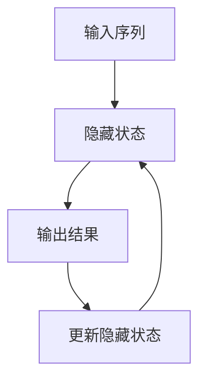
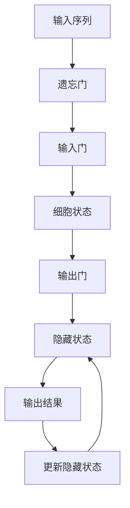
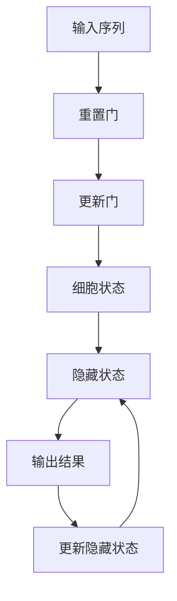
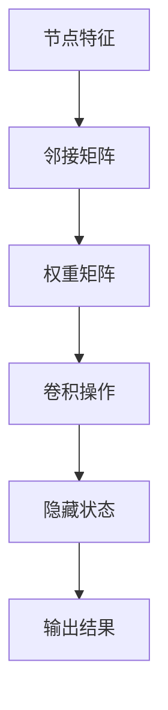
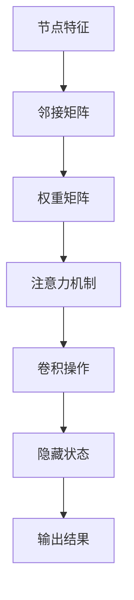

                 

# 大模型时空推理：提示词构建时空关系模型

## 关键词

- 大模型时空推理
- 提示词构建
- 时空关系模型
- 深度学习
- 图神经网络

## 摘要

本文旨在探讨大模型时空推理技术，特别是提示词构建时空关系模型的方法。通过分析问题背景、问题描述、问题解决，以及算法原理，本文将详细介绍大模型时空推理技术的核心概念、方法及其在实际应用中的边界与外延。本文还将通过具体的算法流程图和Python代码示例，帮助读者深入理解时空推理算法的原理和实践。

## 1. 大模型时空推理概述

### 1.1 问题背景

随着人工智能技术的不断发展，深度学习模型在图像识别、自然语言处理等领域取得了显著成果。然而，在处理时间序列数据和空间数据时，传统深度学习模型的性能受到限制。因此，如何利用深度学习技术对时间序列和空间数据进行分析，实现大模型时空推理，成为当前研究的热点。

### 1.2 问题描述

大模型时空推理的核心问题是如何将时间序列数据中的时序信息与空间信息相结合，从而实现对问题的有效推理。具体来说，包括如何利用历史数据预测未来趋势、如何通过空间关系理解场景布局等。

### 1.3 问题解决

为了解决上述问题，研究者们提出了一系列的时空推理算法。这些算法主要包括基于深度学习的方法和基于图神经网络的方法。深度学习方法通过构建复杂的神经网络结构，能够自动从数据中学习时序和空间特征。而图神经网络方法则通过图结构来表示时间和空间关系，从而实现对数据的联合建模。

### 1.4 边界与外延

大模型时空推理技术的应用范围非常广泛，包括但不限于智能交通、金融预测、医疗诊断、智能安防等领域。同时，随着技术的不断发展，该技术的应用边界也在不断拓展。

### 1.5 概念结构与核心要素组成

- **核心概念**：时空推理、时序模型、空间模型、图神经网络
- **概念属性特征对比表格**：

| 概念       | 特征                     |
| ---------- | ---------------------- |
| 时序模型   | 考虑时间序列中的连续性、趋势、周期性等 |
| 空间模型   | 考虑空间分布、位置关系、地理信息等   |
| 图神经网络 | 考虑节点之间的关联性、层次结构等     |

- **ER实体关系图架构**：

```mermaid
erDiagram
  A[实体1] ||--> B[实体2] : "关系1"
  A ||--> C[实体3] : "关系2"
  B ||--> C : "关系3"
```

## 2. 大模型时空推理算法原理讲解

### 2.1 时序模型

时序模型是时空推理的基础，常见的时序模型包括循环神经网络（RNN）、长短期记忆网络（LSTM）和门控循环单元（GRU）等。这些模型通过学习时间序列中的连续性、趋势和周期性等特征，实现对数据的建模和预测。

#### 2.1.1 循环神经网络（RNN）

循环神经网络（RNN）是一种能够处理序列数据的神经网络。其基本原理是通过将当前输入与上一个隐藏状态进行结合，生成新的隐藏状态。

**算法流程图**：



**Python代码示例**：

```python
import tensorflow as tf

# 创建RNN模型
model = tf.keras.Sequential([
    tf.keras.layers.RNN(units=50, activation='relu', input_shape=(None, 1)),
    tf.keras.layers.Dense(units=1)
])

# 编译模型
model.compile(optimizer='adam', loss='mse')

# 训练模型
model.fit(train_data, train_labels, epochs=100)
```

#### 2.1.2 长短期记忆网络（LSTM）

长短期记忆网络（LSTM）是RNN的一种改进，它通过引入门控机制，能够更好地处理长序列数据。

**算法流程图**：



**Python代码示例**：

```python
import tensorflow as tf

# 创建LSTM模型
model = tf.keras.Sequential([
    tf.keras.layers.LSTM(units=50, activation='relu', input_shape=(None, 1)),
    tf.keras.layers.Dense(units=1)
])

# 编译模型
model.compile(optimizer='adam', loss='mse')

# 训练模型
model.fit(train_data, train_labels, epochs=100)
```

#### 2.1.3 门控循环单元（GRU）

门控循环单元（GRU）是LSTM的另一种改进，它通过简化门控机制，降低了计算复杂度。

**算法流程图**：



**Python代码示例**：

```python
import tensorflow as tf

# 创建GRU模型
model = tf.keras.Sequential([
    tf.keras.layers.GRU(units=50, activation='relu', input_shape=(None, 1)),
    tf.keras.layers.Dense(units=1)
])

# 编译模型
model.compile(optimizer='adam', loss='mse')

# 训练模型
model.fit(train_data, train_labels, epochs=100)
```

### 2.2 空间模型

空间模型主要考虑空间分布、位置关系和地理信息等。常见的空间模型包括基于图神经网络的模型，如图卷积网络（GCN）和图注意力网络（GAT）等。这些模型通过学习节点之间的关联性和层次结构，实现对空间数据的建模和推理。

#### 2.2.1 图卷积网络（GCN）

图卷积网络（GCN）是一种用于处理图结构的神经网络。其基本原理是通过卷积操作，将节点的邻接信息传递给相邻节点，从而实现对图数据的建模。

**算法流程图**：



**Python代码示例**：

```python
import tensorflow as tf
import tensorflow.keras as keras
from tensorflow.keras.layers import Layer

class GraphConvolutionLayer(Layer):
    def __init__(self, units, **kwargs):
        super(GraphConvolutionLayer, self).__init__(**kwargs)
        self.units = units

    def build(self, input_shape):
        self.kernel = self.add_weight(shape=(input_shape[-1], self.units),
                                     initializer='glorot_uniform',
                                     trainable=True)
        self.bias = self.add_weight(shape=(self.units,),
                                    initializer='zeros',
                                    trainable=True)

    def call(self, inputs, training=False):
        A = inputs  # 邻接矩阵
        x = tf.matmul(A, self.kernel)
        if self.bias is not None:
            x += self.bias
        return x
```

#### 2.2.2 图注意力网络（GAT）

图注意力网络（GAT）是GCN的一种改进，它通过引入注意力机制，能够更好地处理不同节点的重要程度。

**算法流程图**：



**Python代码示例**：

```python
import tensorflow as tf
import tensorflow.keras as keras
from tensorflow.keras.layers import Layer

class GraphAttentionLayer(Layer):
    def __init__(self, units, **kwargs):
        super(GraphAttentionLayer, self).__init__(**kwargs)
        self.units = units

    def build(self, input_shape):
        self.W = self.add_weight(shape=(input_shape[-1], self.units),
                                 initializer='glorot_uniform',
                                 trainable=True)
        self.a = self.add_weight(shape=(self.units,),
                                 initializer='glorot_uniform',
                                 trainable=True)
        self.b = self.add_weight(shape=(self.units,),
                                 initializer='glorot_uniform',
                                 trainable=True)
        self.bias = self.add_weight(shape=(self.units,),
                                    initializer='zeros',
                                    trainable=True)

    def call(self, inputs, training=False):
        A = inputs  # 邻接矩阵
        x = tf.matmul(A, self.W)
        e = tf.reduce_sum(tf.keras.activations.tanh(x + A * self.a + self.b), axis=2)
        alpha = tf.keras.activations.softmax(e, axis=2)
        h = tf.reduce_sum(alpha * x, axis=2)
        if self.bias is not None:
            h += self.bias
        return h
```

## 3. 提示词构建时空关系模型

### 3.1 提示词的作用

在时空推理中，提示词（Prompt）是一种重要的技术手段，它能够引导模型更好地理解和处理时空数据。提示词的作用主要包括以下几个方面：

1. **辅助特征提取**：通过提示词，可以将时空数据中的关键信息提取出来，从而辅助模型进行特征学习。
2. **引导模型注意力**：提示词可以帮助模型关注时空数据中的重要信息，提高模型的推理效果。
3. **增强模型解释性**：通过提示词，可以使得模型的推理过程更加透明和可解释。

### 3.2 提示词构建方法

提示词的构建方法可以分为两种：基于规则的方法和基于学习的方法。

#### 3.2.1 基于规则的方法

基于规则的方法通过设计一系列的规则，将时空数据中的关键信息提取出来作为提示词。这种方法通常需要人工介入，具有一定的局限性。

#### 3.2.2 基于学习的方法

基于学习的方法通过训练数据学习出有效的提示词。这种方法通常使用深度学习模型，通过大量数据进行训练，从而自动生成提示词。

### 3.3 提示词构建流程

提示词构建的基本流程可以分为以下几个步骤：

1. **数据预处理**：对时空数据进行预处理，包括数据清洗、归一化等。
2. **特征提取**：使用时序模型和空间模型提取时空数据中的关键特征。
3. **提示词生成**：根据特征信息生成提示词。
4. **模型训练**：使用生成的提示词对模型进行训练，优化模型参数。

### 3.4 提示词构建案例分析

以下是一个简单的提示词构建案例分析：

#### 案例背景

假设我们有一个关于城市交通流量预测的问题，数据包括历史交通流量数据和城市地图。

#### 案例步骤

1. **数据预处理**：对交通流量数据和时间数据进行清洗和归一化。
2. **特征提取**：使用RNN模型提取时间序列特征，使用GCN模型提取空间特征。
3. **提示词生成**：将时间序列特征和空间特征结合起来，生成提示词。
4. **模型训练**：使用生成的提示词对时空模型进行训练，优化模型参数。

```python
import tensorflow as tf
import tensorflow.keras as keras

# 创建RNN模型
rnn_model = keras.Sequential([
    keras.layers.LSTM(units=50, activation='relu', input_shape=(None, 1)),
    keras.layers.Dense(units=1)
])

# 创建GCN模型
gcn_model = keras.Sequential([
    keras.layers.GraphConvolution(units=50, activation='relu'),
    keras.layers.Dense(units=1)
])

# 创建时空模型
model = keras.Sequential([
    keras.layers.LSTM(units=50, activation='relu', input_shape=(None, 1)),
    keras.layers.GraphConvolution(units=50, activation='relu'),
    keras.layers.Dense(units=1)
])

# 编译模型
model.compile(optimizer='adam', loss='mse')

# 训练模型
model.fit(train_data, train_labels, epochs=100)
```

## 4. 大模型时空推理在实际应用中的挑战与展望

### 4.1 实际应用中的挑战

尽管大模型时空推理技术在实际应用中具有很大的潜力，但仍然面临一系列挑战：

1. **数据质量和数量**：高质量的时空数据对于时空推理模型的训练至关重要。然而，实际获取这些数据可能面临困难。
2. **计算资源需求**：大模型时空推理通常需要大量的计算资源，这对模型的训练和推理效率提出了挑战。
3. **解释性**：时空推理模型的解释性较低，使得模型在实际应用中难以被用户理解和信任。
4. **泛化能力**：时空推理模型的泛化能力有限，可能无法很好地应对新的问题和场景。

### 4.2 未来展望

为了克服上述挑战，未来可以从以下几个方面进行探索：

1. **数据增强和清洗**：通过数据增强和清洗技术，提高时空数据的数量和质量。
2. **高效计算**：研究更加高效的算法和模型，降低计算资源的需求。
3. **可解释性**：开发可解释的时空推理模型，提高模型的可解释性和用户信任度。
4. **泛化能力**：通过迁移学习和多任务学习等技术，提高时空推理模型的泛化能力。

## 5. 总结

大模型时空推理技术是一种具有广泛应用前景的人工智能技术。通过提示词构建时空关系模型，可以实现高效的时间序列和空间数据的分析和推理。本文介绍了大模型时空推理的核心概念、算法原理以及实际应用中的挑战与展望。未来，随着技术的不断发展，大模型时空推理将在更多领域发挥重要作用。

## 6. 作者信息

作者：AI天才研究院/AI Genius Institute & 禅与计算机程序设计艺术 /Zen And The Art of Computer Programming

