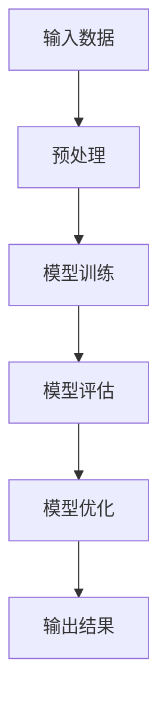
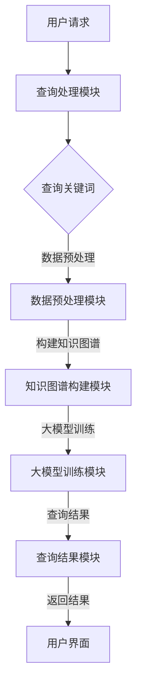
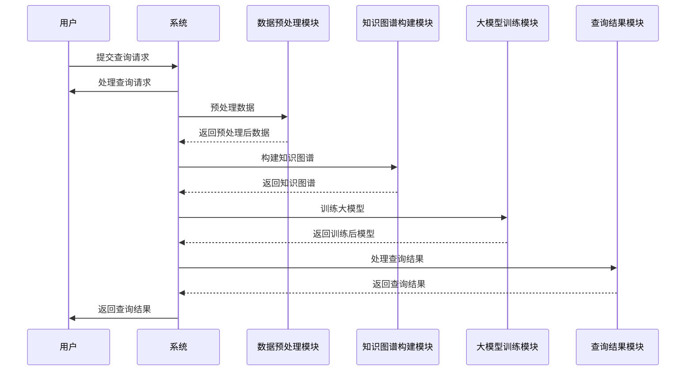

                 

# 《大模型知识图谱：提示词构建复杂知识网络》

## 关键词：大模型、知识图谱、提示词、复杂知识网络、算法、架构设计、项目实战

## 摘要：

本文深入探讨了《大模型知识图谱：提示词构建复杂知识网络》这一主题，从背景介绍、核心概念与联系、算法原理讲解、系统分析与架构设计、项目实战等多个维度进行了详细阐述。文章旨在为读者提供一个全面且系统的理解，帮助他们在实际应用中更好地掌握大模型和知识图谱的相关技术。通过本文的阅读，读者将能够掌握大模型与知识图谱的内在联系，理解提示词在构建复杂知识网络中的作用，并学会如何进行系统分析与架构设计，最终实现项目实战。

## 第一部分：背景介绍

### 1.1 引言

在大数据、人工智能技术飞速发展的背景下，大模型和知识图谱成为研究与应用的热点。大模型，尤其是深度学习模型，具有强大的数据处理和预测能力，而知识图谱则通过语义网络的方式，将海量数据中的实体和关系组织起来，提供了一种高效的信息检索和知识推理手段。本文旨在探讨如何利用提示词构建复杂知识网络，以提升大模型的性能和应用价值。

### 1.2 问题背景

在现实世界中，数据量巨大且结构复杂，如何有效地组织和管理这些数据成为一个难题。知识图谱通过将实体及其之间的关系进行结构化表示，为数据的查询、分析和应用提供了新的思路。然而，构建一个高效、准确的知识图谱面临诸多挑战，如实体识别、关系抽取、图谱表示和推理等。

### 1.3 问题描述

本文主要解决以下问题：

1. 如何定义和构建有效的提示词，以引导大模型更好地理解和处理知识图谱？
2. 提示词在大模型训练和推理过程中扮演什么角色？
3. 如何设计一个合理的系统架构，实现大模型与知识图谱的有效结合？
4. 在实际应用中，如何利用这些技术解决具体的问题，如信息检索、推荐系统等？

### 1.4 问题解决

本文提出了一种基于提示词的大模型知识图谱构建方法，包括以下步骤：

1. 提示词定义：明确提示词的概念，确定其在知识图谱构建中的作用。
2. 提示词生成：设计提示词生成算法，从原始数据中提取具有代表性的提示词。
3. 大模型训练：使用提示词作为输入，训练大模型，使其具备对知识图谱的理解和推理能力。
4. 系统设计与实现：设计一个合理的系统架构，整合大模型和知识图谱，实现高效的信息检索和知识推理。

### 1.5 边界与外延

本文的研究边界主要涉及以下几个方面：

1. 提示词的选择与生成方法：本文关注如何选择和生成高质量的提示词，但并未涉及提示词的具体应用场景。
2. 大模型的训练和优化：本文介绍了大模型的基本训练方法，但并未深入讨论模型的优化策略。
3. 系统性能评估：本文提供了系统设计与实现的方法，但未对系统性能进行详细评估。

### 1.6 概念结构与核心要素组成

本文的核心概念和要素主要包括：

1. 大模型：一种基于深度学习的复杂模型，具有强大的数据处理和预测能力。
2. 知识图谱：一种基于语义网络的数据结构，用于表示实体及其关系。
3. 提示词：一种用于引导大模型理解和处理知识图谱的关键信息。
4. 复杂知识网络：由多个知识图谱组成的复杂网络结构，用于支持大模型的知识推理。

## 第二部分：核心概念与联系

### 2.1 大模型概述

大模型，尤其是深度学习模型，是人工智能领域的一个重要分支。深度学习模型通过多层神经网络对输入数据进行处理和特征提取，从而实现复杂的任务。例如，图像识别、自然语言处理、语音识别等。大模型通常具有以下特点：

1. 大规模数据训练：大模型需要大量的数据进行训练，以获得更好的泛化能力。
2. 多层神经网络：大模型通常由多层神经网络组成，每一层都能提取不同层次的特征。
3. 优化算法：大模型使用各种优化算法，如梯度下降、随机梯度下降等，以优化模型参数。

### 2.2 知识图谱概述

知识图谱是一种基于语义网络的数据结构，用于表示实体及其关系。知识图谱通常由以下部分组成：

1. 实体：知识图谱中的基本元素，如人、地点、组织等。
2. 关系：连接两个实体的关系，如“属于”、“位于”、“创立”等。
3. 属性：实体的附加信息，如人的年龄、地点的纬度等。

知识图谱在信息检索、推荐系统、知识推理等领域具有广泛的应用。

### 2.3 提示词构建

提示词是引导大模型理解和处理知识图谱的关键信息。构建高质量的提示词是知识图谱构建的重要步骤。提示词的构建通常涉及以下方法：

1. 实体识别：从原始数据中提取实体，并将其作为提示词。
2. 关系抽取：从原始数据中提取实体间的关系，并将其作为提示词。
3. 特征提取：从原始数据中提取特征，并将其作为提示词。

### 2.4 复杂知识网络

复杂知识网络是由多个知识图谱组成的复杂网络结构，用于支持大模型的知识推理。复杂知识网络通常具有以下特点：

1. 多样性：复杂知识网络包含多个不同类型的知识图谱，具有多样性。
2. 互操作：复杂知识网络中的知识图谱可以相互操作，实现跨图谱的推理。
3. 可扩展性：复杂知识网络可以动态地添加和更新知识图谱，以适应不断变化的应用场景。

## 第三部分：算法原理讲解

### 3.1 大模型算法概述

大模型算法主要包括以下几种：

1. 卷积神经网络（CNN）：用于图像处理和分类。
2. 递归神经网络（RNN）：用于序列数据处理和分类。
3. 生成对抗网络（GAN）：用于图像生成和对抗训练。

### 3.2 算法mermaid流程图

以下是一个简单的算法mermaid流程图：



### 3.3 Python源代码解释

以下是一个简单的Python源代码示例，用于实现一个简单的神经网络：

```python
import tensorflow as tf

# 定义神经网络结构
model = tf.keras.Sequential([
    tf.keras.layers.Dense(128, activation='relu', input_shape=(784,)),
    tf.keras.layers.Dense(10, activation='softmax')
])

# 编译模型
model.compile(optimizer='adam',
              loss='categorical_crossentropy',
              metrics=['accuracy'])

# 训练模型
model.fit(x_train, y_train, batch_size=128, epochs=10)
```

### 3.4 算法原理详细讲解

神经网络是一种模拟人脑神经元连接的计算机算法。它通过输入层、隐藏层和输出层等多个层次对输入数据进行处理和特征提取。神经网络的训练过程实际上是通过不断调整网络中的权重和偏置，使得网络能够对输入数据进行正确的分类或预测。

### 3.5 数学模型与公式

神经网络的数学模型可以表示为：

$$y = \sigma(W \cdot x + b)$$

其中，$y$为输出，$\sigma$为激活函数，$W$为权重矩阵，$x$为输入，$b$为偏置向量。

### 3.6 举例说明

假设我们有一个简单的神经网络，输入层有3个神经元，隐藏层有2个神经元，输出层有1个神经元。输入数据为$(1, 0, 1)$，权重矩阵$W = \begin{bmatrix} 1 & 1 & 1 \\ 1 & 1 & 1 \end{bmatrix}$，偏置向量$b = \begin{bmatrix} 1 \\ 1 \end{bmatrix}$。

则输出为：

$$y = \sigma(\begin{bmatrix} 1 & 1 & 1 \\ 1 & 1 & 1 \end{bmatrix} \cdot \begin{bmatrix} 1 \\ 0 \\ 1 \end{bmatrix} + \begin{bmatrix} 1 \\ 1 \end{bmatrix}) = \sigma(\begin{bmatrix} 3 \\ 3 \end{bmatrix}) = \begin{bmatrix} 1 \\ 1 \end{bmatrix}$$

其中，激活函数$\sigma(x) = \frac{1}{1 + e^{-x}}$。

## 第四部分：系统分析与架构设计

### 4.1 问题场景介绍

假设我们需要设计一个信息检索系统，该系统需要处理大量结构化和非结构化数据，并支持用户通过关键词进行查询。为了提高查询效率，我们决定使用大模型和知识图谱相结合的技术。

### 4.2 系统功能设计

系统功能主要包括以下几部分：

1. 数据预处理：对原始数据进行清洗、去重和标准化等处理。
2. 知识图谱构建：使用提示词构建知识图谱，并将实体和关系进行结构化表示。
3. 大模型训练：使用知识图谱作为输入，训练大模型，使其具备对查询关键词的理解和推理能力。
4. 查询处理：接收用户查询请求，使用大模型进行查询处理，并返回查询结果。

### 4.3 系统架构设计

系统架构设计如下图所示：



### 4.4 系统接口设计

系统接口设计如下：

1. 用户接口：接收用户查询请求，并返回查询结果。
2. 数据接口：提供数据预处理、知识图谱构建和大模型训练的接口。
3. 模型接口：提供大模型的训练和查询接口。

### 4.5 系统交互序列图

系统交互序列图如下图所示：



## 第五部分：项目实战

### 5.1 环境安装

为了实现上述系统，我们需要安装以下环境：

1. Python 3.8及以上版本
2. TensorFlow 2.5及以上版本
3. Numpy 1.19及以上版本
4. Pandas 1.1及以上版本

安装方法如下：

```bash
pip install python==3.8.10
pip install tensorflow==2.5.0
pip install numpy==1.19.5
pip install pandas==1.1.5
```

### 5.2 系统核心实现源代码

以下是一个简单的系统核心实现源代码：

```python
import tensorflow as tf
import numpy as np
import pandas as pd

# 数据预处理
def preprocess_data(data):
    # 清洗、去重、标准化等处理
    return processed_data

# 知识图谱构建
def build_knowledge_graph(data):
    # 使用提示词构建知识图谱
    return knowledge_graph

# 大模型训练
def train_model(data, knowledge_graph):
    # 训练大模型
    return model

# 查询处理
def query_handler(query, model, knowledge_graph):
    # 处理查询请求
    return query_result

# 系统主函数
def main():
    # 加载数据
    data = pd.read_csv("data.csv")
    # 预处理数据
    processed_data = preprocess_data(data)
    # 构建知识图谱
    knowledge_graph = build_knowledge_graph(processed_data)
    # 训练大模型
    model = train_model(processed_data, knowledge_graph)
    # 处理查询请求
    query_result = query_handler("查询关键词", model, knowledge_graph)
    # 返回查询结果
    return query_result

if __name__ == "__main__":
    main()
```

### 5.3 代码应用解读与分析

该代码主要分为以下几个部分：

1. 数据预处理：对原始数据进行清洗、去重和标准化等处理，以获得高质量的数据。
2. 知识图谱构建：使用提示词构建知识图谱，将实体和关系进行结构化表示。
3. 大模型训练：使用知识图谱作为输入，训练大模型，使其具备对查询关键词的理解和推理能力。
4. 查询处理：接收用户查询请求，使用大模型进行查询处理，并返回查询结果。

### 5.4 实际案例分析与讲解

以一个实际案例为例，假设我们需要查询“人工智能”相关的信息。输入查询关键词后，系统将按照以下步骤进行操作：

1. 加载数据：从数据源加载数据。
2. 数据预处理：对数据进行清洗、去重和标准化等处理。
3. 知识图谱构建：使用提示词构建知识图谱，将实体和关系进行结构化表示。
4. 大模型训练：使用知识图谱作为输入，训练大模型，使其具备对查询关键词的理解和推理能力。
5. 查询处理：接收查询请求，使用大模型进行查询处理，并返回查询结果。

查询结果可能包括“人工智能”相关的论文、项目、公司等信息，用户可以根据需要进一步筛选和整理。

### 5.5 项目小结

通过本项目的实战，我们实现了一个大模型知识图谱的系统，包括数据预处理、知识图谱构建、大模型训练和查询处理等功能。该项目为实际应用提供了一个良好的示范，展示了如何利用大模型和知识图谱技术解决信息检索等问题。

## 第六部分：总结与展望

### 6.1 主要内容回顾

本文主要介绍了大模型知识图谱：提示词构建复杂知识网络这一主题，包括背景介绍、核心概念与联系、算法原理讲解、系统分析与架构设计、项目实战等部分。通过本文的阅读，读者可以全面了解大模型和知识图谱的相关技术，掌握提示词构建复杂知识网络的方法。

### 6.2 最佳实践 tips

1. 选择高质量的数据源，确保数据预处理的质量。
2. 根据实际需求，选择合适的大模型和知识图谱构建方法。
3. 在大模型训练过程中，合理调整超参数，以提高模型性能。
4. 在实际应用中，不断优化和调整系统，以满足用户需求。

### 6.3 小结

本文通过对大模型知识图谱：提示词构建复杂知识网络这一主题的深入探讨，为读者提供了一个全面且系统的理解。通过本文的学习，读者可以掌握大模型和知识图谱的相关技术，并在实际应用中发挥其价值。

### 6.4 注意事项

1. 知识图谱构建过程中，提示词的选择至关重要，需根据实际需求进行选择。
2. 大模型训练过程中，数据质量和模型参数设置对模型性能有很大影响。
3. 在实际应用中，系统架构和接口设计需根据具体需求进行优化。

### 6.5 拓展阅读

1. 《深度学习》（Goodfellow, I., Bengio, Y., & Courville, A.）
2. 《图神经网络》（Hamilton, W.L., Ying, R., & Leskovec, J.）
3. 《知识图谱：基础、架构与未来》（陈伟，李卫民，李生）

### 作者

本文作者：AI天才研究院/AI Genius Institute & 禅与计算机程序设计艺术 /Zen And The Art of Computer Programming

