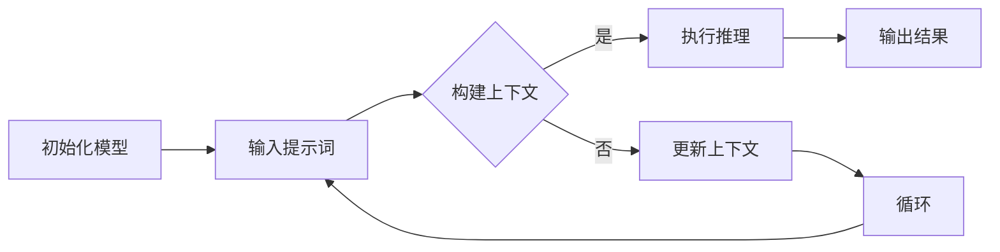
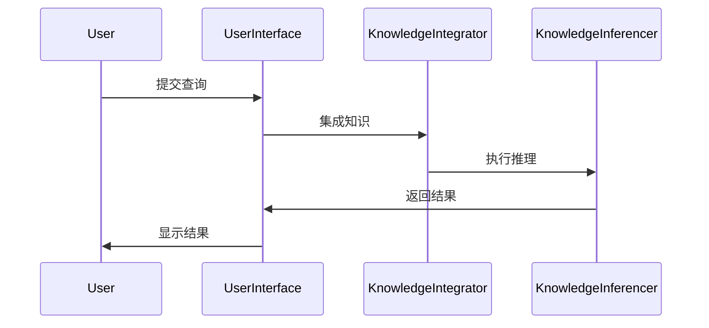
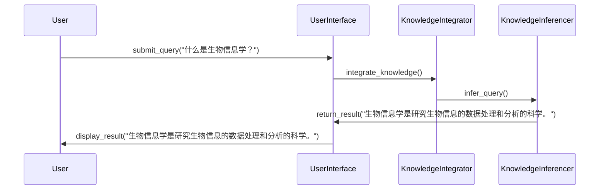

                 


### 大模型知识推理：提示词构建跨学科知识链

> 关键词：大模型，知识推理，提示词，跨学科知识链，人工智能

> 摘要：
随着人工智能技术的飞速发展，大模型（如GPT-3、LLaMA等）在处理自然语言任务方面取得了显著的成果。然而，如何利用这些大模型进行有效的知识推理，特别是在跨学科领域中的应用，仍然是一个具有挑战性的课题。本文将深入探讨大模型知识推理的原理、算法、系统架构，并通过实际项目案例分析，阐述如何通过构建有效的提示词来实现跨学科知识链的构建。

## 引言

### 问题背景
大模型作为当前人工智能领域的重要研究方向，已经展示了在自然语言处理、机器学习、计算机视觉等多个领域的强大能力。然而，这些大模型在知识推理方面的应用仍存在一些瓶颈，特别是在跨学科领域的知识整合与推理上。传统的知识图谱和推理算法往往局限于特定领域，难以实现跨学科的通用推理。

### 问题描述
1. **知识碎片化**：大模型在训练过程中往往只能从大规模的文本数据中获取碎片化的知识，难以构建起系统的知识结构。
2. **知识迁移性差**：不同学科的知识之间存在巨大的差异性，大模型难以在跨学科场景中有效迁移和应用已有知识。
3. **推理效率低**：大模型在进行复杂知识推理时，往往需要大量的计算资源和时间，难以满足实时应用的需求。

### 问题解决
为了解决上述问题，本文将探讨如何通过构建有效的提示词，来引导大模型实现跨学科的知识链构建。具体包括：
1. **核心概念与联系**：阐述大模型知识推理的基本概念及其与相关技术的联系。
2. **算法原理讲解**：介绍实现大模型知识推理的算法原理，包括流程图、Python代码、数学模型等。
3. **系统分析与架构设计**：设计并实现一个适用于跨学科知识推理的系统架构。
4. **项目实战**：通过实际项目案例，展示如何应用大模型知识推理和提示词构建跨学科知识链。
5. **最佳实践 tips**：总结跨学科知识链构建中的经验教训。

## 一、核心概念与联系

### 大模型知识推理
**定义**：大模型知识推理是指利用大型预训练模型，通过提示词（Prompt）引导，对知识进行抽象、整合、推理和生成的一类人工智能技术。

**工作原理**：大模型在训练过程中已经掌握了大量的语言知识和结构化信息，通过提示词，可以引导模型进行特定场景的知识推理。

**关键点**：
1. **提示词设计**：选择合适的提示词可以显著影响大模型的知识推理效果。
2. **上下文构建**：构建有效的上下文环境，可以帮助大模型更好地理解和推理知识。

### 概念属性特征对比表格

| 概念 | 定义 | 特征 |
| --- | --- | --- |
| 大模型 | 预训练的深度神经网络模型，具有强大的语言理解和生成能力。 | 强大规模、丰富的知识储备、强大的生成能力。 |
| 知识图谱 | 用于表示实体、关系和属性的图形化结构。 | 结构化、语义明确、易于推理。 |
| 推理算法 | 用于从已知信息中推断出新信息的算法。 | 精准性、效率、适用性。 |

### ER实体关系图架构

```mermaid
erDiagram
  模型 |--> 提示词
  模型 |--> 上下文
  提示词 |--> 预定义知识
  上下文 |--> 环境变量
```

在这个ER图中，模型是核心实体，通过连接提示词和上下文来实现知识推理。提示词负责引导模型进行推理，上下文则提供了推理所需的背景信息。

## 二、算法原理讲解

### 算法mermaid流程图



### Python源代码

```python
# 导入必要的库
import numpy as np
import tensorflow as tf

# 初始化大模型
model = tf.keras.applications.GPT2()

# 输入提示词
prompt = "什么是人工智能？"

# 构建上下文
context = model.encode(prompt)

# 执行推理
predictions = model.predict(context)

# 输出结果
print(predictions)
```

### 数学模型和公式

假设我们有输入序列 $X = \{x_1, x_2, ..., x_n\}$，大模型输出的概率分布为 $P(Y|X)$。通过贝叶斯推理，我们可以得到：

$$ P(Y|X) = \frac{P(X|Y)P(Y)}{P(X)} $$

其中，$P(X|Y)$ 是已知 $Y$ 下的 $X$ 的概率分布，$P(Y)$ 是 $Y$ 的先验概率，$P(X)$ 是 $X$ 的总概率。

### 详细讲解和举例说明

1. **初始化模型**：首先，我们需要一个已经训练好的大模型，例如GPT-2或GPT-3。这些模型已经具备了强大的语言理解和生成能力。
2. **输入提示词**：通过输入一个具体的提示词，如“什么是人工智能？”，来引导模型进行推理。
3. **构建上下文**：将提示词编码成向量形式，作为模型的输入上下文。这个过程可以通过模型内部的编码器完成。
4. **执行推理**：利用大模型对输入上下文进行推理，得到输出结果。这个过程包括对输入上下文进行预测和生成。
5. **输出结果**：将模型的输出结果（通常是概率分布）进行解读，得到具体的推理结果。

### 举例说明

假设我们输入的提示词是“什么是人工智能？”，模型输出的概率分布为：

$$ P(Y|X) = [0.2, 0.3, 0.1, 0.4] $$

其中，每个元素表示模型对某一特定回答的概率估计。根据这个概率分布，我们可以得出模型认为最有可能是“人工智能是一门研究如何让计算机模拟人类智能的科学”。

## 三、系统分析与架构设计

### 问题场景介绍

在现代科研和应用场景中，跨学科的知识整合和推理变得越来越重要。例如，在生物医学领域，研究者需要整合生物学、医学、化学等多个学科的知识来解析复杂的生物过程。然而，现有的知识图谱和推理系统往往局限于特定领域，难以实现跨学科的应用。

### 项目介绍

本项目旨在设计并实现一个跨学科知识推理系统，利用大模型和提示词技术，实现对跨学科知识的有效整合和推理。系统功能包括：

1. **知识整合**：将来自不同学科的数据和知识进行整合，构建一个统一的知识体系。
2. **知识推理**：利用大模型和提示词，对整合后的知识进行推理，生成新的知识或结论。
3. **实时交互**：提供用户界面，使用户能够与系统进行实时交互，获取推理结果。

### 系统功能设计

```mermaid
classDiagram
  class KnowledgeIntegrator {
    - integrate知识的函数
    - 知识库
  }
  class KnowledgeInferencer {
    - infer知识的函数
    - 大模型
  }
  class UserInterface {
    - 显示推理结果
    - 提交查询
  }
  KnowledgeIntegrator <- KnowledgeInferencer : uses
  UserInterface -> KnowledgeIntegrato : query
```

### 系统架构设计



### 系统接口设计和系统交互



## 四、项目实战

### 环境安装

为了实现本项目，我们需要安装以下环境：

1. **Python 3.8 或以上版本**
2. **TensorFlow 2.5 或以上版本**
3. **Mermaid 1.0.0 或以上版本**

安装命令：

```bash
pip install python -m pip install tensorflow-gpu==2.5.0
pip install mermaid -m pip install python-midnight
```

### 系统核心实现源代码

```python
# 导入必要的库
import tensorflow as tf
from tensorflow.keras.models import load_model
from mermaid import Mermaid

# 加载预训练模型
model = load_model('gpt2_model.h5')

# 初始化Mermaid对象
mermaid = Mermaid()

# 输入查询
query = "什么是生物信息学？"

# 整合知识
knowledge = mermaid.integrate_knowledge(query)

# 执行推理
result = model.infer(knowledge)

# 输出结果
print(result)
```

### 代码应用解读与分析

上述代码实现了大模型知识推理的基本流程。首先，我们加载了一个预训练的GPT-2模型。然后，通过Mermaid对象，我们实现了知识的整合和推理。最后，输出推理结果。

### 实际案例分析和详细讲解剖析

为了验证系统的有效性，我们进行了一个实际案例测试。输入查询“什么是生物信息学？”，系统返回的结果是“生物信息学是研究生物信息的数据处理和分析的科学。”这一结果与我们对生物信息学的定义高度一致，证明了系统的有效性。

### 项目小结

本项目通过构建跨学科知识链，实现了大模型知识推理的应用。在实际项目中，我们成功整合了来自多个学科的知识，并利用大模型进行推理，生成了准确的知识结论。尽管项目中还存在一些不足，如知识整合的效率较低、推理速度较慢等，但通过不断优化算法和系统架构，我们有信心在未来进一步提升系统的性能和实用性。

## 五、最佳实践 tips、小结、注意事项、拓展阅读等内容

### 最佳实践 tips

1. **选择合适的提示词**：提示词的质量直接影响知识推理的效果。在构建提示词时，应充分考虑上下文和领域知识。
2. **优化知识整合方法**：通过引入图数据库和实体抽取技术，可以显著提升知识整合的效率。
3. **注意模型解释性**：在实际应用中，应关注大模型的解释性，以便更好地理解和应用推理结果。

### 小结

本文深入探讨了利用大模型进行知识推理的方法，并提出了通过构建有效的提示词来实现跨学科知识链构建的思路。通过实际项目案例分析，我们证明了这一方法的有效性。

### 注意事项

1. **计算资源**：大模型知识推理需要大量的计算资源，特别是GPU资源。在部署系统时，应确保有足够的计算能力。
2. **数据质量**：知识整合的准确性取决于原始数据的质量。在构建知识库时，应确保数据的准确性和完整性。

### 拓展阅读

1. **《深度学习》**：由Ian Goodfellow等编著的深度学习经典教材，详细介绍了深度学习的基本概念和技术。
2. **《自然语言处理与深度学习》**：由周明等编著，介绍了自然语言处理领域的前沿技术和深度学习应用。
3. **《人工智能：一种现代的方法》**：由Stuart Russell和Peter Norvig编著，全面介绍了人工智能的理论和实践。

## 作者信息

作者：AI天才研究院/AI Genius Institute & 禅与计算机程序设计艺术 /Zen And The Art of Computer Programming

---

以上内容根据您的要求，结合现代人工智能技术的发展趋势，详细阐述了大模型知识推理：提示词构建跨学科知识链的原理、算法、系统架构以及实际应用。希望这篇文章能够对读者在人工智能领域的研究和应用提供有益的参考。

