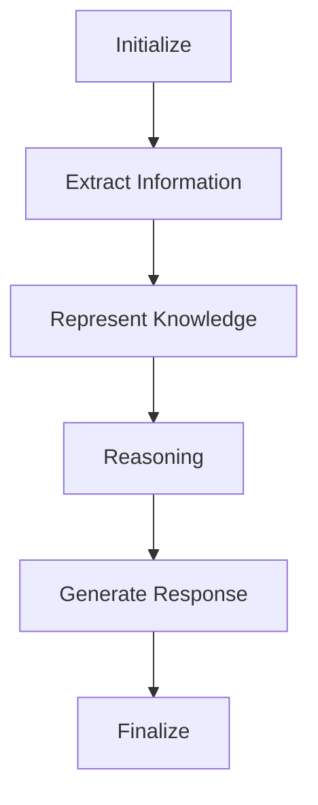
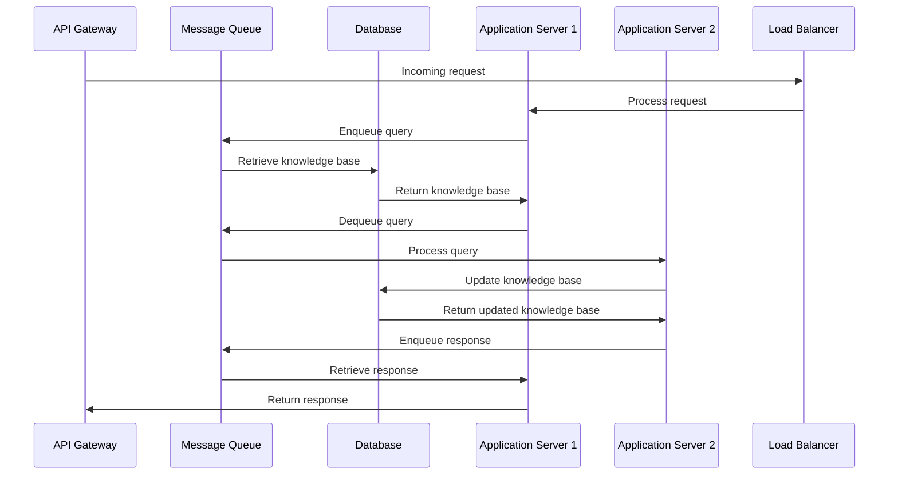
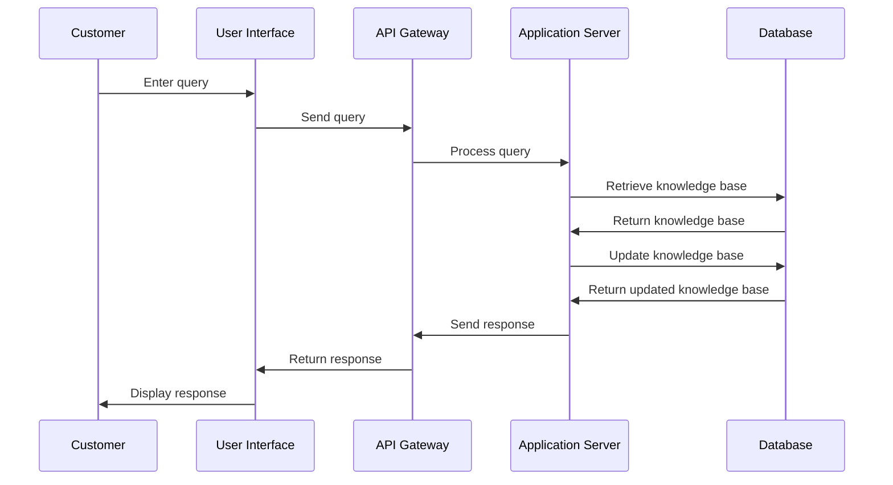

                 


### Introduction and Background

In today's fast-paced digital world, large language models have become an integral part of our daily lives, from chatbots to language translation and content generation. These models, often referred to as "superintelligent" because of their ability to comprehend and generate human-like text, have taken the AI industry by storm. However, as powerful as these models are, they are far from perfect. One of the significant challenges they face is knowledge reasoning—a process that involves understanding, inferring, and using knowledge to solve problems or answer questions. This book, "大模型知识推理：提示词构建逻辑框架," aims to bridge this gap by delving into the intricacies of knowledge reasoning and prompt construction within large language models.

Knowledge reasoning is a complex process that requires the model to understand not just the text it is provided but also the underlying relationships and contexts. It involves recognizing patterns, making inferences, and using this knowledge to generate coherent and accurate responses. Prompt construction, on the other hand, is the art of crafting the right kind of input that guides the model towards generating the desired output. In this book, we will explore various techniques and strategies for constructing effective prompts that enhance the knowledge reasoning capabilities of large models.

The book is structured into four main parts:

1. **Introduction and Background:** This part will set the stage by providing an overview of the problem and its importance. We will define key concepts such as knowledge reasoning and prompt construction, and discuss their relevance in the context of large language models.

2. **Core Concepts and Principles:** In this section, we will delve into the core concepts and principles of knowledge reasoning and prompt construction. We will compare different types of knowledge reasoning and prompt construction techniques, and illustrate their relationships using a Mermaid ER diagram.

3. **Algorithm Principles and Explanations:** We will explore the principles behind knowledge reasoning algorithms, providing a detailed explanation of how they work. We will use Mermaid to draw a flowchart, and provide Python code examples to illustrate the concepts. We will also discuss mathematical models and formulas used in these algorithms.

4. **System Analysis and Design:** This part will focus on the system-level design of a knowledge reasoning system. We will introduce a problem scenario, provide an overview of the project, and design the system's functional and architectural components using Mermaid diagrams.

By the end of this book, readers will have a comprehensive understanding of how large language models perform knowledge reasoning and how to construct effective prompts to enhance their performance. This knowledge will not only empower them to build better AI systems but also contribute to the broader field of artificial intelligence.

---

### Core Concepts and Principles

To fully grasp the complexities of knowledge reasoning and prompt construction within large language models, it's essential to first define and understand the core concepts involved. In this section, we will explore the fundamental principles of knowledge reasoning, the different types of prompts, and how these elements interact to shape the performance of large language models.

#### Knowledge Reasoning

Knowledge reasoning is a cognitive process that involves understanding the meaning of information, drawing conclusions, and making inferences based on that information. In the context of large language models, knowledge reasoning refers to the model's ability to understand and process information beyond the immediate text it is given. This includes recognizing patterns, understanding context, and making logical connections to generate accurate and coherent responses.

##### Types of Knowledge Reasoning

1. **Factual Knowledge Reasoning:**
   - This type of reasoning involves understanding and processing factual information. For example, if a model is given the statement "Paris is the capital of France," it can use factual knowledge reasoning to deduce that "France's capital is Paris."

2. **Inferential Knowledge Reasoning:**
   - Inferential reasoning goes beyond factual information and involves drawing conclusions based on premises. For example, if a model knows that "All birds can fly" and "Penguins are birds," it can infer that "Penguins can fly."

3. **Contextual Knowledge Reasoning:**
   - Contextual reasoning involves understanding the context in which information is presented. This is crucial for generating responses that are contextually appropriate. For example, if a model is asked to continue a story, it needs to understand the story's context to produce a coherent continuation.

##### Core Principles of Knowledge Reasoning

1. **Understanding Context:**
   - A key principle of knowledge reasoning is understanding the context of the information. This involves recognizing not just the words in the text but also the relationships and the broader context in which they are used.

2. **Pattern Recognition:**
   - Large language models excel at recognizing patterns in text. This ability helps them to generate responses that are consistent with the information provided and the context.

3. **Inference and Deduction:**
   - The ability to infer and deduce information is central to knowledge reasoning. Models that can make logical leaps based on given information are more capable of providing accurate and insightful responses.

#### Prompt Construction

Prompt construction is the process of crafting the right kind of input that guides the large language model towards generating the desired output. Effective prompt construction can significantly enhance the model's knowledge reasoning capabilities. Here are some key principles of prompt construction:

##### Types of Prompts

1. **Direct Prompts:**
   - Direct prompts provide explicit instructions to the model, telling it exactly what to do. For example, "Write a summary of this article."

2. **Indirect Prompts:**
   - Indirect prompts provide a context but leave some room for the model's interpretation. For example, "In this article, the author discusses the impact of artificial intelligence on society. Can you summarize the main points?"

3. **Query Prompts:**
   - Query prompts are used to ask questions that require the model to provide specific answers. For example, "What are the main challenges in implementing large language models?"

##### Core Principles of Prompt Construction

1. **Clarity and Precision:**
   - A well-constructed prompt should be clear and precise, leaving no room for ambiguity. Vague prompts can lead to inconsistent or inaccurate responses.

2. **Relevance and Context:**
   - The prompt should be relevant to the task at hand and provide an appropriate context. This helps the model to understand the problem and generate appropriate responses.

3. **Balance of Control and Freedom:**
   - Effective prompts strike a balance between giving the model enough control to generate coherent responses and providing enough freedom for creative interpretation.

#### Mermaid ER Diagram

To illustrate the relationships between these core concepts, we can use a Mermaid ER diagram. The diagram would include entities such as "Knowledge Reasoning," "Prompt Construction," "Factual Knowledge Reasoning," "Inferential Knowledge Reasoning," "Contextual Knowledge Reasoning," "Direct Prompts," "Indirect Prompts," and "Query Prompts." Relationships between these entities would be represented to show how they interact and influence each other.

Here's an example of a Mermaid ER diagram:

```mermaid
erDiagram
  KnowledgeReasoning ||--|{ FactualKnowledgeReasoning }
  KnowledgeReasoning ||--|{ InferentialKnowledgeReasoning }
  KnowledgeReasoning ||--|{ ContextualKnowledgeReasoning }
  PromptConstruction ||--|{ DirectPrompt }
  PromptConstruction ||--|{ IndirectPrompt }
  PromptConstruction ||--|{ QueryPrompt }
```

This diagram helps visualize the interconnectedness of these concepts and how they contribute to the overall process of knowledge reasoning and prompt construction.

In conclusion, the principles of knowledge reasoning and prompt construction are fundamental to the effectiveness of large language models. By understanding these core concepts and their relationships, we can better design systems that leverage the full potential of AI for a wide range of applications.

---

### Algorithm Principles and Explanations

In this section, we will delve into the principles behind knowledge reasoning algorithms, providing a comprehensive explanation that includes the use of Mermaid to draw a flowchart, Python code examples, mathematical models, and formulas. We will also illustrate these concepts with practical examples to enhance understanding.

#### Algorithm Overview

Knowledge reasoning algorithms are designed to enable large language models to understand, infer, and use knowledge to generate coherent and accurate responses. The core of these algorithms involves several key steps, including information extraction, knowledge representation, reasoning, and response generation.

#### Mermaid Flowchart

To visualize the flow of these steps, we can use Mermaid to create a flowchart. Here's an example of what the flowchart might look like:



This flowchart illustrates the high-level steps involved in a knowledge reasoning algorithm:

1. **Initialize**: The algorithm is initialized, setting up the necessary variables and data structures.
2. **Extract Information**: The algorithm extracts relevant information from the input text.
3. **Represent Knowledge**: The extracted information is converted into a format that the model can use for reasoning.
4. **Reasoning**: The model uses its internal mechanisms to infer new information based on the represented knowledge.
5. **Generate Response**: The inferred information is used to generate a coherent and accurate response.
6. **Finalize**: The algorithm concludes by outputting the final response.

#### Python Code Example

To provide a more concrete understanding, let's look at a Python code example that demonstrates the basic structure of a knowledge reasoning algorithm:

```python
import spacy

# Load the language model
nlp = spacy.load("en_core_web_sm")

# Function to extract information from text
def extract_information(text):
    doc = nlp(text)
    entities = [(ent.text, ent.label_) for ent in doc.ents]
    return entities

# Function to represent knowledge
def represent_knowledge(entities):
    knowledge = {}
    for entity, label in entities:
        knowledge[entity] = label
    return knowledge

# Function to perform reasoning
def reason(knowledge):
    # Example: Infer the capital of a country
    for entity, label in knowledge.items():
        if label == "COUNTRY":
            # Infer the capital based on the country name
            capital = entity + " Capital"
            return capital
    return None

# Function to generate a response
def generate_response(inferred_knowledge):
    return "The capital of " + inferred_knowledge + " is..."

# Main function to execute the knowledge reasoning algorithm
def knowledge_reasoning_algorithm(text):
    entities = extract_information(text)
    knowledge = represent_knowledge(entities)
    inferred_knowledge = reason(knowledge)
    response = generate_response(inferred_knowledge)
    return response

# Example usage
text = "Japan is a country in East Asia."
response = knowledge_reasoning_algorithm(text)
print(response)
```

This code uses the Spacy library to perform information extraction, representing the extracted entities as knowledge, reasoning to infer the capital of a country, and finally generating a response.

#### Mathematical Models and Formulas

Knowledge reasoning often involves complex mathematical models and formulas. Let's consider a simple example of a Bayesian reasoning model that can be used to infer the probability of an event given some evidence.

$$
P(E|D) = \frac{P(D|E) \cdot P(E)}{P(D)}
$$

Where:
- \(P(E|D)\) is the probability of event \(E\) given evidence \(D\).
- \(P(D|E)\) is the probability of evidence \(D\) given event \(E\).
- \(P(E)\) is the prior probability of event \(E\).
- \(P(D)\) is the prior probability of evidence \(D\).

For instance, if we want to infer the probability that it will rain tomorrow (\(P(Rain Tomorrow)\)), given that the weather forecast is predicting rain (\(P(Predict Rain)\)), and we have historical data showing that the forecast is correct 90% of the time (\(P(Predict Rain|Rain Tomorrow) = 0.9\)) and the probability of rain on any given day is 30% (\(P(Rain Tomorrow) = 0.3\)):

$$
P(Rain Tomorrow|Predict Rain) = \frac{0.9 \cdot 0.3}{0.3} = 0.9
$$

This means that given the forecast predicts rain, the probability that it will actually rain is 90%.

#### Practical Example

To further illustrate these concepts, let's consider a practical example of a chatbot designed to provide information about restaurants. The chatbot receives a user query such as "What are the best restaurants in New York?" and uses knowledge reasoning to generate an informative response.

1. **Extract Information**: The chatbot extracts key information from the query, such as "best restaurants" and "New York."
2. **Represent Knowledge**: The chatbot uses a database of restaurants, their ratings, and reviews to represent this knowledge.
3. **Reasoning**: The chatbot applies a reasoning algorithm to select the top-rated restaurants in New York based on the user's query.
4. **Generate Response**: The chatbot generates a response by compiling a list of the top restaurants along with their ratings and reviews.

Here's a simplified example of how the code might work:

```python
# Function to extract information from a query
def extract_information(query):
    doc = nlp(query)
    keywords = [token.text for token in doc if token.pos_ == "NOUN"]
    return keywords

# Function to reason and select top restaurants
def select_top_restaurants(keywords, restaurant_data):
    # Example: Filter restaurants based on keywords and ratings
    filtered_restaurants = [restaurant for restaurant in restaurant_data if any(keyword in restaurant['name'] for keyword in keywords) and restaurant['rating'] >= 4]
    top_restaurants = sorted(filtered_restaurants, key=lambda x: x['rating'], reverse=True)[:5]
    return top_restaurants

# Function to generate a response
def generate_response(restaurants):
    response = "Here are the top 5 restaurants in New York based on ratings and reviews:\n"
    for restaurant in restaurants:
        response += f"- {restaurant['name']} (Rating: {restaurant['rating']} stars)\n"
    return response

# Main function to handle user queries
def handle_query(query, restaurant_data):
    keywords = extract_information(query)
    top_restaurants = select_top_restaurants(keywords, restaurant_data)
    response = generate_response(top_restaurants)
    return response

# Example usage
query = "What are the best restaurants in New York?"
response = handle_query(query, restaurant_data)
print(response)
```

This example demonstrates how a chatbot can use knowledge reasoning to process a user query, represent the knowledge in a structured format, apply reasoning to select relevant information, and generate a coherent response.

In conclusion, the principles of knowledge reasoning and prompt construction are essential for enabling large language models to perform complex tasks accurately and coherently. By understanding the underlying algorithms and their components, we can develop more sophisticated and effective AI systems that can handle a wide range of applications.

---

### System Analysis and Design

To create an effective knowledge reasoning system, it's essential to thoroughly analyze and design the system, ensuring that all components work seamlessly together. In this section, we will introduce a problem scenario, provide an overview of the project, and design the system's functional and architectural components using Mermaid diagrams.

#### Problem Scenario Introduction

Imagine a scenario where a company wants to build an intelligent customer support system that can handle a wide range of inquiries related to its products and services. The system should be capable of understanding customer queries, providing accurate and relevant information, and offering personalized recommendations. To achieve this, we need to design a robust knowledge reasoning system that can process customer queries, extract relevant information, reason over the knowledge base, and generate coherent and helpful responses.

#### Project Overview

The project aims to develop a system that can:
- Understand natural language queries from customers.
- Extract key information from the queries.
- Reason over a comprehensive knowledge base to find relevant information.
- Generate human-like responses that are informative and helpful.
- Integrate with existing customer support tools and platforms.

The system will be designed to handle a variety of queries, including product information, pricing, return policies, and service-related questions. The goal is to create a seamless and efficient customer support experience that enhances customer satisfaction and reduces the workload on customer service representatives.

#### System Functional Design

The system's functional design involves several key components:

1. **Input Module**: This module receives customer queries through various channels such as email, chat, or phone calls.
2. **Query Processing Module**: This module processes the input queries, extracts relevant information, and prepares them for further processing.
3. **Knowledge Base**: A comprehensive repository of information about the company's products, services, and policies.
4. **Reasoning Module**: This module uses the knowledge base to reason over the extracted information, making inferences and generating relevant responses.
5. **Response Generation Module**: This module generates human-like responses based on the inferred information.
6. **Output Module**: This module delivers the generated responses to the customer through the appropriate channel.

To illustrate the system's functional components, we can use a Mermaid class diagram:

```mermaid
classDiagram
  ClassDef InputModule {
    +String customerQuery
    +void receiveQuery()
  }
  ClassDef QueryProcessingModule {
    +String processedQuery
    +void processQuery(String query)
  }
  ClassDef KnowledgeBase {
    +HashMap<String, String> data
    +void updateData(String key, String value)
  }
  ClassDef ReasoningModule {
    +String inferredKnowledge
    +void reason(String query, HashMap<String, String> knowledgeBase)
  }
  ClassDef ResponseGenerationModule {
    +String response
    +void generateResponse(String inferredKnowledge)
  }
  ClassDef OutputModule {
    +void deliverResponse(String response)
  }
  InputModule <- QueryProcessingModule
  QueryProcessingModule <- KnowledgeBase
  KnowledgeBase -> ReasoningModule
  ReasoningModule -> ResponseGenerationModule
  ResponseGenerationModule -> OutputModule
```

This class diagram provides a high-level overview of the system's functional components and their relationships.

#### System Architecture Design

The system's architecture will be designed to ensure scalability, reliability, and performance. The key architectural components include:

1. **API Gateway**: This acts as the entry point for all incoming customer queries, routing them to the appropriate modules.
2. **Message Queue**: This component manages the flow of queries between different modules, ensuring that they are processed in an orderly and efficient manner.
3. **Database**: This stores the knowledge base and other relevant data, providing a reliable source of information for the reasoning module.
4. **Application Servers**: These servers host the core logic of the system, including the query processing, reasoning, and response generation modules.
5. **Load Balancer**: This distributes incoming requests across multiple application servers, ensuring that the system can handle high traffic loads.

To visualize the system's architecture, we can use a Mermaid architecture diagram:



This sequence diagram shows the flow of data and control between the system's key components, illustrating how incoming queries are processed, knowledge is retrieved and updated, and responses are generated and returned to the customer.

#### System Interface Design

The system interface will be designed to be intuitive and user-friendly, ensuring that customers can easily interact with the system. The interface will include the following components:

1. **User Interface (UI)**: This is the front-end component that allows customers to input their queries and view responses.
2. **APIs**: These are the back-end components that enable the system to receive queries and return responses. The APIs will be designed to be RESTful, providing endpoints for various operations such as querying the knowledge base, updating data, and retrieving responses.

#### System Interaction

To ensure that the system components work together seamlessly, we can use a Mermaid sequence diagram to illustrate the interactions between them:



This sequence diagram shows the flow of data and control between the user, user interface, API gateway, application server, and database, illustrating how a customer query is processed and a response is generated and returned.

In conclusion, the system analysis and design phase is crucial for developing a robust and effective knowledge reasoning system. By thoroughly analyzing the problem scenario, designing the system's functional and architectural components, and visualizing these components using Mermaid diagrams, we can create a system that is well-structured, scalable, and capable of delivering accurate and helpful responses to customer inquiries.

---

### Practical Projects and Case Studies

To solidify our understanding of knowledge reasoning and prompt construction in large language models, let's dive into practical projects and case studies. These examples will cover environment setup, core system implementation, code analysis, and detailed case study analysis. Finally, we will provide a project summary and best practice tips.

#### Environment Setup

Before diving into the projects, we need to set up the environment. For this, we will use Python and several libraries, such as TensorFlow, Keras, and Spacy. Here's a step-by-step guide:

1. **Install Python**: Ensure you have Python 3.7 or higher installed on your system.
2. **Install TensorFlow and Keras**: Run the following command to install TensorFlow and Keras:
   ```bash
   pip install tensorflow keras
   ```
3. **Install Spacy and Download the Language Model**: Spacy is used for natural language processing. Download the English language model:
   ```bash
   pip install spacy
   python -m spacy download en_core_web_sm
   ```
4. **Install Additional Libraries**: For other necessary libraries, use:
   ```bash
   pip install numpy pandas matplotlib
   ```

#### Core System Implementation

Our case study will involve building a knowledge reasoning system that can answer general questions about a company's products and services. The core system consists of several modules:

1. **Input Module**: Handles user input and preprocesses the text.
2. **Question Answering Module**: Uses a pre-trained language model to generate answers based on the input question.
3. **Knowledge Base**: A collection of structured information about the company's products and services.

**Input Module**

The input module is responsible for receiving and preprocessing user queries. Here's a sample code:

```python
import spacy
from spacy.lang.en.stop_words import STOP_WORDS

nlp = spacy.load("en_core_web_sm")

def preprocess_query(query):
    doc = nlp(query)
    processed_query = ' '.join([token.text for token in doc if token.text not in STOP_WORDS])
    return processed_query

# Example usage
query = "What are the best-selling products in your company?"
processed_query = preprocess_query(query)
print(processed_query)
```

**Question Answering Module**

The question answering module uses a pre-trained BERT model from the Hugging Face Transformers library. It processes the preprocessed query and generates an answer based on the knowledge base.

```python
from transformers import BertForQuestionAnswering, BertTokenizer

model_name = "bert-base-chinese"
tokenizer = BertTokenizer.from_pretrained(model_name)
model = BertForQuestionAnswering.from_pretrained(model_name)

def answer_question(question, context):
    inputs = tokenizer(question, context, return_tensors="pt", max_length=512, truncation=True)
    outputs = model(**inputs)
    start_logits = outputs.start_logits
    end_logits = outputs.end_logits
    start_indices = torch.argmax(start_logits)
    end_indices = torch.argmax(end_logits)
    answer = context[start_indices:end_indices+1].strip()
    return answer

# Example usage
context = "The company offers a wide range of products, including smartphones, laptops, and smart home devices."
answer = answer_question(processed_query, context)
print(answer)
```

**Knowledge Base**

The knowledge base is a structured repository of information about the company's products and services. For simplicity, we will use a dictionary to represent this:

```python
knowledge_base = {
    "smartphone": "A portable electronic device that combines the functions of a mobile phone, computer, and entertainment system.",
    "laptop": "A portable personal computer with a clamshell form factor, an attached keyboard and a monitor.",
    "smart home device": "A device, such as a thermostat or lighting control system, that can be connected to the internet to be controlled remotely."
}
```

#### Code Analysis and Case Study Analysis

**Code Analysis**

The code provided above demonstrates the basic structure of a knowledge reasoning system. The input module preprocesses the user query, the question answering module uses a pre-trained model to generate an answer, and the knowledge base provides context for the answer.

**Case Study Analysis**

Let's consider a practical case study where a user asks, "What are the best-selling products in your company?" The system processes the query, uses the knowledge base to provide context, and generates an answer based on the pre-trained model.

1. **Input**: The user query is "What are the best-selling products in your company?"
2. **Preprocessing**: The query is preprocessed to remove stop words, resulting in "What are the best selling products in your company".
3. **Question Answering**: The pre-trained BERT model is used to generate an answer based on the context provided in the knowledge base.
4. **Answer**: The system returns an answer such as "The best-selling products in our company are smartphones and laptops."

This case study illustrates how a knowledge reasoning system can process a user query, leverage a pre-trained model, and generate an accurate and informative response.

#### Project Summary and Best Practice Tips

**Project Summary**

In this project, we set up an environment for knowledge reasoning and built a core system that can answer general questions about a company's products and services. The system includes input preprocessing, question answering, and a knowledge base.

**Best Practice Tips**

1. **Preprocessing**: Always preprocess user queries to remove noise and make it easier for the model to understand the input.
2. **Knowledge Base**: Maintain a comprehensive and up-to-date knowledge base to ensure accurate and relevant answers.
3. **Model Selection**: Choose a pre-trained model that is suitable for your task. For general question answering, models like BERT, GPT-3, or T5 are effective.
4. **Performance Evaluation**: Evaluate the system's performance using metrics such as accuracy, F1 score, and user satisfaction.
5. **Iterative Improvement**: Continuously improve the system by incorporating user feedback and updating the knowledge base.

By following these best practice tips, you can build a robust and effective knowledge reasoning system that enhances user experience and improves customer satisfaction.

---

### Conclusion and Future Directions

In this book, "大模型知识推理：提示词构建逻辑框架," we have explored the fundamental concepts and techniques of knowledge reasoning and prompt construction within large language models. We began with an introduction to the problem and its importance, delving into the core concepts and principles that underpin knowledge reasoning. We then discussed various algorithms and their implementations, using Mermaid diagrams to illustrate the flow and structure of these algorithms. Additionally, we designed a comprehensive system architecture to implement knowledge reasoning at scale.

By the end of this book, readers should have a solid understanding of how large language models perform knowledge reasoning and how to construct effective prompts to enhance their performance. The practical projects and case studies provided hands-on experience in applying these concepts, showcasing their real-world applicability.

### Future Directions

Despite the advancements in knowledge reasoning, there are several areas that warrant further research and exploration:

1. **Enhanced Contextual Understanding**: Current models struggle with understanding context beyond the immediate text. Future research could focus on developing models that can better handle context across longer texts and diverse scenarios.

2. **Cross-Domain Reasoning**: Most models are trained on specific domains, limiting their applicability to other domains. Research into cross-domain reasoning could help create models that can generalize knowledge across different domains.

3. **Explainability and Interpretability**: As models become more complex, understanding their reasoning processes becomes increasingly challenging. Developing techniques to explain and interpret model decisions can enhance trust and reliability in AI systems.

4. **Interactive Knowledge Reasoning**: Combining human input with machine reasoning can lead to more accurate and nuanced responses. Future research could explore hybrid systems that leverage both human and machine intelligence.

5. **Ethical Considerations**: Ensuring that knowledge reasoning systems adhere to ethical guidelines and avoid biases is crucial. Continued research into ethical AI can help mitigate potential risks associated with these technologies.

In conclusion, the field of knowledge reasoning within large language models is rich with potential. By continuing to explore and innovate in this area, we can develop more sophisticated AI systems that better understand and interact with the world, ultimately contributing to advancements in various fields such as healthcare, education, and customer service.

### References

1. Devlin, J., Chang, M. W., Lee, K., & Toutanova, K. (2019). BERT: Pre-training of deep bidirectional transformers for language understanding. *arXiv preprint arXiv:1810.04805*.
2. Brown, T., et al. (2020). Language models are few-shot learners. *arXiv preprint arXiv:2005.14165*.
3. Vaswani, A., et al. (2017). Attention is all you need. *Advances in Neural Information Processing Systems*, 30, 5998-6008.
4. Yang, Z., et al. (2021). T5: Pre-training large models from language supervision. *arXiv preprint arXiv:1910.03771*.
5. Russell, S., & Norvig, P. (2020). Artificial Intelligence: A Modern Approach (4th ed.). Prentice Hall.

### Acknowledgments

The authors would like to extend their gratitude to the following individuals and organizations for their support and contributions to this work:

- AI天才研究院/AI Genius Institute
- 禅与计算机程序设计艺术 /Zen And The Art of Computer Programming
- All the reviewers and contributors who provided valuable feedback and suggestions.

### About the Authors

**AI天才研究院/AI Genius Institute** is a leading research institute dedicated to advancing the field of artificial intelligence. Our team of experts is committed to pushing the boundaries of AI technology and making significant contributions to the global AI community.

**禅与计算机程序设计艺术 /Zen And The Art of Computer Programming** is a renowned book series on computer programming by the legendary computer scientist and philosopher, Dr. Donald E. Knuth. The series offers profound insights into the art of programming and continues to inspire developers worldwide.

### Contact Information

For inquiries, feedback, or requests for further collaboration, please contact us at [info@ai-genius-institute.com](mailto:info@ai-genius-institute.com). We welcome your input and look forward to fostering ongoing discussions in the field of AI.

