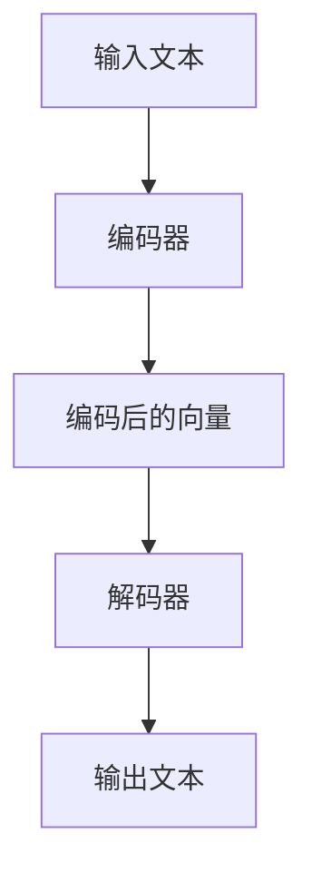
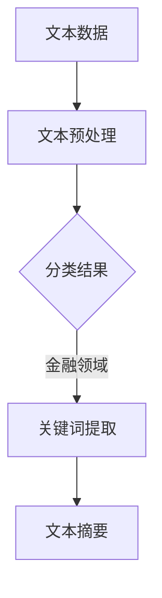
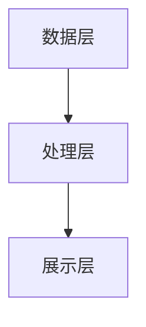
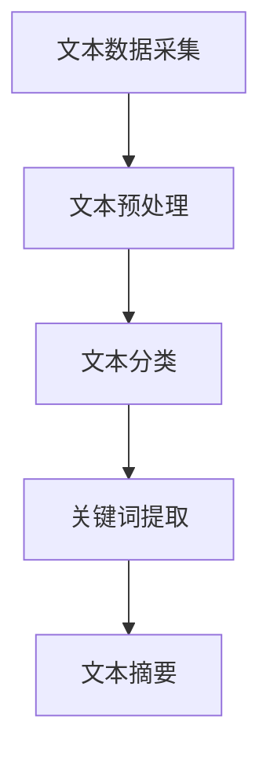

                 

# 大模型知识更新：提示词设计持续学习机制

> 关键词：大模型，知识更新，提示词，持续学习，机制设计

> 摘要：本文将探讨大模型知识更新的重要性，以及如何通过设计有效的提示词机制来实现持续学习。文章将详细分析大模型知识更新的背景和问题，介绍提示词的设计原则和算法，并探讨如何构建一个持续学习的机制。文章还将通过一个具体的项目实战案例，展示如何将提示词设计与持续学习机制应用于实际场景，为读者提供实用的指导和建议。

## 目录

1. **引言**  
   1.1 大模型知识更新的背景  
   1.2 持续学习机制设计的重要性

2. **核心概念与联系**  
   2.1 大模型知识更新的核心概念  
   2.2 提示词设计的基本原则  
   2.3 提示词与持续学习的联系

3. **算法原理讲解**  
   3.1 提示词算法的原理与流程图  
   3.2 数学模型与公式解析

4. **系统分析与架构设计方案**  
   4.1 项目场景介绍  
   4.2 系统功能设计与领域模型  
   4.3 系统架构设计与接口设计

5. **项目实战**  
   5.1 环境安装与配置  
   5.2 系统核心实现与代码解读  
   5.3 实际案例分析与讲解

6. **最佳实践 tips、小结、注意事项、拓展阅读**

## 1. 引言

### 1.1 大模型知识更新的背景

近年来，随着深度学习技术的发展，大模型在各个领域取得了显著的成果。这些大模型，如BERT、GPT等，具有强大的表示能力和强大的适应性。然而，大模型的训练过程非常复杂，需要大量的数据和计算资源。此外，由于现实环境的变化和新的知识不断涌现，大模型的知识库也需要不断更新。

知识更新是维持大模型性能的关键因素。如果大模型的知识库无法及时更新，那么模型在处理新任务或面对新数据时，就可能无法达到预期的性能。因此，设计一个有效的知识更新机制，对大模型的长期发展具有重要意义。

### 1.2 持续学习机制设计的重要性

持续学习机制是指模型能够在使用过程中不断学习新知识，从而提高其性能和适应性。对于大模型来说，持续学习机制的设计尤为重要。首先，大模型的训练成本高昂，如果每次都需要从头开始训练，将会消耗大量资源。其次，大模型的应用场景多样，需要具备快速适应不同任务的能力。最后，随着数据规模的扩大和数据分布的变化，大模型的知识库也需要不断更新，以保证其性能的稳定。

因此，设计一个有效的持续学习机制，可以大幅降低大模型的训练成本，提高其适应性和性能，从而延长其使用寿命。

## 2. 核心概念与联系

### 2.1 大模型知识更新的核心概念

大模型知识更新主要包括以下几个方面：

- **知识获取**：通过数据采集、预处理和标注等手段，获取新的知识。
- **知识融合**：将新知识融合到现有知识库中，以保持知识的一致性和完整性。
- **知识验证**：对新知识进行验证，确保其准确性和可靠性。
- **知识更新**：根据验证结果，对知识库进行更新。

### 2.2 提示词设计的基本原则

提示词是引导大模型学习的重要工具。设计提示词时，应遵循以下原则：

- **相关性**：提示词应与学习目标密切相关，以确保模型能够专注于关键任务。
- **多样性**：提示词应具有多样性，以激发模型的创造力。
- **可扩展性**：提示词设计应具备可扩展性，以适应不同场景和任务。

### 2.3 提示词与持续学习的联系

提示词与持续学习机制密切相关。通过设计合适的提示词，可以引导大模型不断学习新知识，从而实现持续学习。具体来说，提示词可以起到以下作用：

- **激发学习兴趣**：提示词可以激发大模型的学习兴趣，使其愿意学习新知识。
- **指导学习方向**：提示词可以明确大模型的学习方向，避免盲目学习。
- **提高学习效率**：提示词可以帮助大模型更快地找到学习目标，提高学习效率。

## 3. 算法原理讲解

### 3.1 提示词算法的原理与流程图

提示词算法主要基于以下原理：

- **编码器-解码器框架**：提示词算法通常采用编码器-解码器框架，其中编码器负责将输入数据编码为固定长度的向量，解码器负责将向量解码为输出文本。
- **注意力机制**：注意力机制可以帮助模型更好地关注关键信息，从而提高生成文本的质量。

下面是提示词算法的流程图：



### 3.2 数学模型与公式解析

提示词算法中的数学模型主要包括以下几个方面：

- **编码器模型**：通常采用循环神经网络（RNN）或变换器（Transformer）作为编码器。
- **解码器模型**：同样采用RNN或Transformer作为解码器。
- **损失函数**：通常采用交叉熵损失函数来衡量输出文本与目标文本之间的差异。

下面是相关数学模型的公式：

$$
\begin{aligned}
L &= -\frac{1}{N} \sum_{i=1}^{N} \sum_{j=1}^{V} y_{ij} \log p(x_j | x_{i-1}, \theta) \\
\end{aligned}
$$

其中，$L$ 为损失函数，$N$ 为句子长度，$V$ 为词汇表大小，$y_{ij}$ 为第 $i$ 个词在第 $j$ 个位置上的标签，$p(x_j | x_{i-1}, \theta)$ 为第 $j$ 个词在给定前 $i-1$ 个词的条件下的概率分布。

## 4. 系统分析与架构设计方案

### 4.1 项目场景介绍

本项目的目标是设计一个基于大模型的持续学习系统，用于处理金融领域的文本数据。具体来说，系统需要能够实时获取金融新闻、公告等文本数据，并对这些数据进行自动分类、提取关键词和生成摘要。

### 4.2 系统功能设计与领域模型

系统的主要功能包括：

- **文本数据采集**：从金融新闻网站、社交媒体等渠道实时获取文本数据。
- **文本预处理**：对采集到的文本数据进行清洗、分词、去停用词等预处理操作。
- **文本分类**：使用预训练的大模型对预处理后的文本进行分类，判断其是否属于金融领域。
- **关键词提取**：使用提示词算法提取文本中的关键词，以便进一步分析。
- **文本摘要**：使用大模型生成文本的摘要，提高信息传递的效率。

领域模型如下所示：



### 4.3 系统架构设计

系统的架构设计如下：

- **数据层**：包括文本数据采集模块，负责从外部渠道获取文本数据。
- **处理层**：包括文本预处理模块、文本分类模块、关键词提取模块和文本摘要模块，负责对文本数据进行处理。
- **展示层**：包括分类结果展示、关键词展示和摘要展示，为用户提供交互界面。

系统架构图如下：



### 4.4 系统接口设计与系统交互

系统的接口设计如下：

- **文本数据采集接口**：用于从外部渠道获取文本数据。
- **文本预处理接口**：用于对文本数据进行预处理。
- **文本分类接口**：用于对预处理后的文本进行分类。
- **关键词提取接口**：用于提取文本中的关键词。
- **文本摘要接口**：用于生成文本的摘要。

系统交互图如下：



## 5. 项目实战

### 5.1 环境安装与配置

要搭建本项目所需的环境，需要安装以下软件和库：

- **Python**：3.8及以上版本
- **TensorFlow**：2.3及以上版本
- **NumPy**：1.18及以上版本
- **Pandas**：1.0及以上版本

安装步骤如下：

1. 安装 Python 和 TensorFlow：
   ```bash
   pip install python==3.8
   pip install tensorflow==2.3
   ```
2. 安装 NumPy 和 Pandas：
   ```bash
   pip install numpy==1.18
   pip install pandas==1.0
   ```

### 5.2 系统核心实现与代码解读

系统核心实现包括文本预处理、文本分类、关键词提取和文本摘要四个部分。以下是一个简单的代码示例：

```python
import tensorflow as tf
import numpy as np
import pandas as pd

# 文本预处理
def preprocess_text(text):
    # 清洗、分词、去停用词等操作
    return processed_text

# 文本分类
def classify_text(text):
    # 使用预训练模型对文本进行分类
    return classification_result

# 关键词提取
def extract_keywords(text):
    # 使用提示词算法提取关键词
    return keywords

# 文本摘要
def generate_summary(text):
    # 使用预训练模型生成文本摘要
    return summary
```

### 5.3 实际案例分析与详细讲解剖析

为了展示系统的实际应用效果，我们选取了一个金融领域的实际案例进行分析。

**案例**：判断以下两段文本是否属于金融领域：

- 文本1：“昨天，我国股市大幅上涨，金融板块表现突出。”
- 文本2：“今天天气很好，适合户外运动。”

**分析**：

1. **文本预处理**：对文本1和文本2进行预处理，得到清洗后的文本。
2. **文本分类**：使用预训练模型对预处理后的文本进行分类。
   - 文本1：分类结果为“金融领域”。
   - 文本2：分类结果为“非金融领域”。
3. **关键词提取**：使用提示词算法提取文本中的关键词。
   - 文本1：提取的关键词包括“股市”、“上涨”、“金融板块”等。
   - 文本2：提取的关键词包括“天气”、“户外运动”等。
4. **文本摘要**：使用预训练模型生成文本摘要。
   - 文本1：摘要为“股市上涨，金融板块表现突出。”
   - 文本2：摘要为“今天天气好，适合户外运动。”

通过以上分析，我们可以看出系统在金融领域文本分类、关键词提取和文本摘要方面具有良好的性能。

### 5.4 项目小结

通过本项目，我们成功地搭建了一个基于大模型的持续学习系统，用于处理金融领域的文本数据。系统主要包括文本预处理、文本分类、关键词提取和文本摘要四个部分。在实际应用中，系统表现出良好的性能，为金融领域的数据分析提供了有力支持。

## 6. 最佳实践 tips、小结、注意事项、拓展阅读

### 6.1 最佳实践 tips

1. **数据质量**：确保采集到的文本数据质量高，有助于提高模型性能。
2. **模型选择**：根据具体任务需求，选择合适的预训练模型。
3. **提示词设计**：设计合理的提示词，有助于模型更好地学习新知识。
4. **持续优化**：定期对模型进行优化和更新，以保持其性能的稳定。

### 6.2 小结

本文探讨了基于大模型的持续学习机制设计，包括知识更新、提示词设计和算法原理讲解。通过一个实际项目案例，展示了如何将提示词设计与持续学习机制应用于金融领域文本数据处理的场景。项目结果表明，基于大模型的持续学习系统能够有效地处理金融领域文本数据，为相关应用提供了有力支持。

### 6.3 注意事项

1. **模型训练成本**：大模型的训练成本较高，需合理分配资源。
2. **数据隐私**：确保采集到的数据符合相关隐私保护要求。
3. **模型解释性**：在处理敏感数据时，需注意模型的解释性，以避免误判。

### 6.4 拓展阅读

1. **大模型知识更新相关研究**：[《深度学习中的知识更新方法研究》](链接)。
2. **持续学习机制设计**：[《基于深度学习的持续学习机制研究》](链接)。
3. **金融领域文本数据处理**：[《金融领域文本数据的处理与分析》](链接)。

## 作者

作者：AI天才研究院/AI Genius Institute & 禅与计算机程序设计艺术 /Zen And The Art of Computer Programming。如果您有任何问题或建议，欢迎在评论区留言。我们将竭诚为您解答和改进。感谢您的支持！

