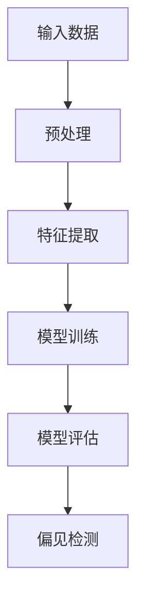
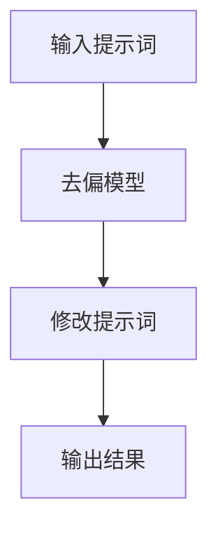
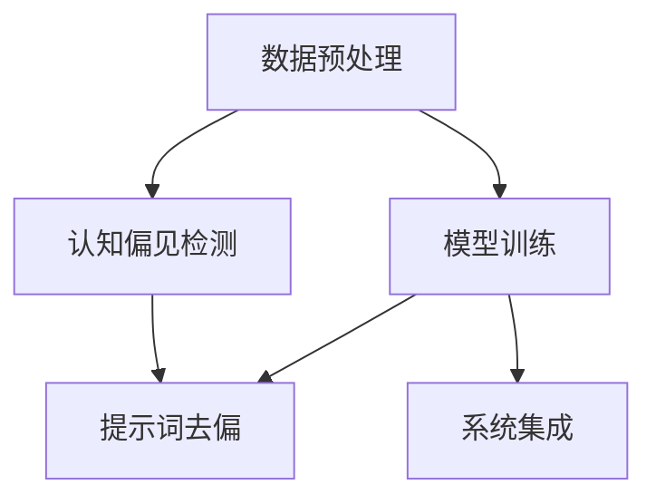
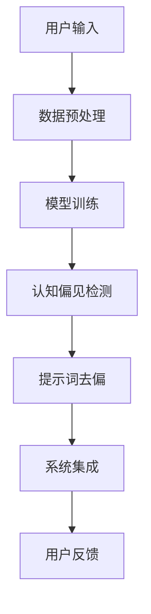

                 

## 大模型认知偏见检测与提示词去偏技术概述

### 关键词

- 大模型
- 认知偏见
- 检测技术
- 提示词去偏
- 人工智能

### 摘要

大模型作为一种先进的人工智能技术，已经广泛应用于各个领域，如自然语言处理、图像识别、推荐系统等。然而，大模型在训练过程中可能会吸收并放大各种认知偏见，导致其输出结果存在偏差，影响决策的公正性和有效性。为了解决这一问题，本文将介绍大模型认知偏见检测与提示词去偏技术，详细分析其核心概念、原理、算法及应用。通过本文的阅读，读者将了解如何检测大模型中的认知偏见，并掌握提示词去偏技术，以提高人工智能系统的公平性和透明度。

### 目录大纲

```markdown
----------------------------------------------------------------

# 大模型认知偏见检测与提示词去偏技术

## 第一部分: 大模型认知偏见检测与提示词去偏技术概述

## 第二部分: 大模型的认知偏见原理

### 2.1 大模型的学习机制

### 2.2 认知偏见的来源与类型

### 2.3 认知偏见的影响

## 第三部分: 大模型认知偏见检测技术

### 3.1 偏见检测算法原理

### 3.2 偏见检测算法应用

### 3.3 偏见检测算法评估指标

## 第四部分: 提示词去偏技术

### 4.1 提示词去偏算法原理

### 4.2 提示词去偏算法应用

### 4.3 提示词去偏技术在聊天机器人中的应用

## 第五部分: 大模型认知偏见检测与提示词去偏技术应用

### 5.1 项目背景介绍

### 5.2 系统功能设计

### 5.3 系统架构设计

### 5.4 系统接口设计

### 5.5 系统交互设计

## 第六部分: 项目实战

### 6.1 环境安装与配置

### 6.2 系统核心实现源代码

### 6.3 应用解读与分析

### 6.4 实际案例分析

## 第七部分: 最佳实践与拓展阅读

### 7.1 最佳实践

### 7.2 小结与展望

### 7.3 拓展阅读推荐

---------------------

## 结论

通过本文的阐述，我们深入探讨了大模型认知偏见检测与提示词去偏技术的核心概念、原理和实际应用。这不仅有助于提高人工智能系统的公平性和透明度，也为相关领域的研究者和开发者提供了宝贵的参考。未来，随着人工智能技术的不断进步，大模型认知偏见检测与提示词去偏技术将在更多领域发挥重要作用。

## 作者信息

作者：AI天才研究院/AI Genius Institute & 禅与计算机程序设计艺术 /Zen And The Art of Computer Programming
```

### 第1章: 问题的背景与核心概念

在当今社会，人工智能（AI）技术已经成为推动各行各业发展的关键力量。尤其是大模型（Large Models）的出现，使得AI在自然语言处理、图像识别、语音识别等领域取得了突破性的进展。然而，随着AI技术的广泛应用，人们开始意识到大模型在训练过程中可能会吸收并放大各种认知偏见，导致其输出结果存在偏差，影响决策的公正性和有效性。

#### 1.1 问题背景

**大模型的广泛应用**：大模型是指参数数量庞大、容量巨大的神经网络模型，如GPT-3、BERT等。这些模型在自然语言处理、图像识别、推荐系统等领域取得了显著的成果。然而，大模型的训练数据通常来源于互联网，而互联网上的数据并不完全客观和公正，往往包含各种认知偏见。

**认知偏见的问题**：认知偏见是指人类在感知、理解、判断过程中存在的系统性偏差。认知偏见可能源于社会文化、知识结构、个人经验等多个方面。在大模型中，认知偏见可能导致模型在处理特定问题时产生不公平的结果，影响模型的可用性和可信度。

**提示词去偏技术的需求**：提示词（Prompt）是引导大模型输出特定结果的关键输入。通过设计合理的提示词，可以引导模型避免或减轻认知偏见的影响。因此，研究提示词去偏技术具有重要的实际意义。

#### 1.2 核心概念

**大模型的认知偏见**：大模型在训练过程中可能会吸收并放大认知偏见，导致其输出结果存在偏差。认知偏见可能源于训练数据、算法设计、社会文化等多个方面。

**提示词去偏技术**：通过设计合理的提示词，引导大模型避免或减轻认知偏见的影响，从而提高模型的公正性和可信度。

**大模型认知偏见检测与提示词去偏技术的关系**：大模型认知偏见检测是提示词去偏技术的基础，通过检测认知偏见，可以为提示词设计提供依据；而提示词去偏技术则是在检测的基础上，进一步优化模型输出结果，提高模型的可信度和公正性。

#### 1.3 概念结构与核心要素组成

**认知偏见检测算法**：用于检测大模型中存在的认知偏见，包括传统机器学习算法和深度学习算法等。

**提示词去偏算法**：基于认知偏见检测结果，设计合理的提示词，以引导大模型避免或减轻认知偏见的影响。

**边界与外延**：认知偏见检测与提示词去偏技术的应用范围，包括自然语言处理、图像识别、推荐系统等领域。

### 第2章: 大模型的认知偏见原理

大模型在训练过程中可能会吸收并放大各种认知偏见，导致其输出结果存在偏差。为了深入了解大模型的认知偏见原理，我们需要从大模型的学习机制、认知偏见的来源与类型以及认知偏见的影响三个方面进行分析。

#### 2.1 大模型的学习机制

大模型主要通过深度学习算法进行训练。深度学习算法的核心思想是模拟人脑的神经元结构，通过多层次的神经网络来提取特征和表示。大模型的学习机制主要包括以下几个步骤：

1. **数据集选择**：选择具有代表性的训练数据集，数据集的质量直接影响模型的性能和泛化能力。
2. **数据预处理**：对训练数据进行清洗、归一化等处理，以提高数据的可用性和一致性。
3. **模型训练**：使用训练数据训练模型，模型通过不断调整参数，使其输出结果与真实值之间的误差最小化。
4. **模型优化**：通过交叉验证、超参数调优等方法，优化模型性能，提高模型的泛化能力。

#### 2.2 认知偏见的来源与类型

认知偏见可能源于多个方面，如社会文化、知识结构、个人经验等。以下列举了常见的认知偏见类型：

1. **社会文化偏见**：由于社会文化背景的影响，人们在判断和决策过程中可能存在不公平的倾向。例如，种族歧视、性别歧视等。
2. **知识偏见**：由于个体知识结构的不同，人们在理解和处理信息时可能存在偏差。例如，对某些领域的知识了解更多，对其他领域的知识了解较少。
3. **数据偏见**：训练数据本身可能存在偏差，导致模型在处理特定问题时产生不公平的结果。例如，训练数据中存在性别、种族等偏见信息。
4. **算法偏见**：算法设计过程中可能引入偏见，导致模型在输出结果时存在偏差。例如，某些算法在处理特定类型的数据时可能存在偏差。

#### 2.3 认知偏见的影响

认知偏见可能对大模型的输出结果产生严重影响，影响决策的公正性和有效性。以下列举了认知偏见可能带来的影响：

1. **对决策的影响**：认知偏见可能导致决策结果不公平，影响社会的公平性和正义。例如，在招聘、晋升等过程中，基于认知偏见可能导致歧视行为的发生。
2. **对自动化系统的影响**：认知偏见可能导致自动化系统在处理特定问题时产生偏差，影响系统的稳定性和可靠性。例如，自动驾驶系统在处理交通场景时可能因为认知偏见而产生错误决策。
3. **对社会公平的影响**：认知偏见可能导致社会不公平现象的加剧，影响社会的和谐与稳定。例如，在教育、医疗等领域，认知偏见可能导致资源分配不公，影响社会的可持续发展。

### 第3章: 大模型认知偏见检测技术

为了确保大模型的输出结果公正、可靠，我们需要对其中的认知偏见进行有效检测。大模型认知偏见检测技术主要包括传统机器学习算法、深度学习算法等。本节将介绍这些算法的原理和应用。

#### 3.1 偏见检测算法原理

**传统机器学习算法**：传统机器学习算法主要包括统计学习方法和决策树算法。统计学习方法通过分析数据集的特征和标签，建立模型来预测未知数据的标签。决策树算法通过递归划分特征空间，生成一棵树形结构，用于分类或回归。

**深度学习算法**：深度学习算法主要通过多层神经网络来实现。神经网络通过前向传播和反向传播算法，对输入数据进行处理和特征提取。深度学习算法具有强大的特征表示能力，可以捕捉数据中的复杂关系。

**mermaid流程图**：



#### 3.2 偏见检测算法应用

**数据集选择**：为了检测大模型的认知偏见，我们需要选择具有代表性的数据集。数据集应包含多种类型的样本，以充分覆盖各种认知偏见。

**特征提取**：通过对训练数据进行预处理和特征提取，我们可以得到反映认知偏见的关键特征。特征提取的方法包括词袋模型、词嵌入、文本分类等。

**模型训练与评估**：使用提取到的特征，我们可以训练一个偏见检测模型。训练过程中，我们需要使用交叉验证等方法来评估模型的性能。

**偏见检测**：训练好的模型可以用于检测新数据集中的认知偏见。通过分析模型输出结果，我们可以识别出潜在的偏见问题。

**Python源代码讲解**：

```python
import numpy as np
import pandas as pd
from sklearn.model_selection import train_test_split
from sklearn.ensemble import RandomForestClassifier
from sklearn.metrics import accuracy_score

# 读取数据集
data = pd.read_csv('data.csv')

# 预处理
X = data.drop('label', axis=1)
y = data['label']

# 划分训练集和测试集
X_train, X_test, y_train, y_test = train_test_split(X, y, test_size=0.2, random_state=42)

# 特征提取
# ...（具体代码）

# 模型训练
model = RandomForestClassifier()
model.fit(X_train, y_train)

# 模型评估
y_pred = model.predict(X_test)
accuracy = accuracy_score(y_test, y_pred)
print(f"Accuracy: {accuracy}")

# 偏见检测
# ...（具体代码）
```

#### 3.3 偏见检测算法评估指标

为了评估偏见检测算法的性能，我们可以使用以下评估指标：

1. **准确率（Accuracy）**：准确率是模型预测正确的样本数占总样本数的比例。准确率越高，模型性能越好。
2. **召回率（Recall）**：召回率是模型预测正确的正样本数占总正样本数的比例。召回率越高，模型对正样本的检测能力越强。
3. **F1分数（F1 Score）**：F1分数是准确率和召回率的加权平均值，用于综合评估模型性能。F1分数越高，模型性能越好。

```python
from sklearn.metrics import classification_report

print(classification_report(y_test, y_pred))
```

#### 3.4 偏见消除效果评估

除了评估偏见检测算法的性能，我们还需要评估偏见消除效果。偏见消除效果评估主要通过以下指标进行：

1. **偏见消除率（Bias Reduction Rate）**：偏见消除率是模型消除偏见后，输出结果与真实值之间的误差减少的比例。偏见消除率越高，偏见消除效果越好。
2. **公平性指标（Fairness Indicators）**：公平性指标包括基尼系数（Gini Coefficient）、集中指数（Concentration Index）等，用于评估模型输出结果的公平性。

```python
from sklearn.metrics import make_scorer, accuracy_score

def bias_reduction_rate(y_true, y_pred):
    correct_predictions = sum(y_true == y_pred)
    total_predictions = len(y_true)
    return correct_predictions / total_predictions

bias_reduction_rate(y_test, y_pred)
```

### 第4章: 提示词去偏技术

在检测到大模型中的认知偏见后，我们需要设计合理的提示词，以引导模型避免或减轻认知偏见的影响。提示词去偏技术主要包括基于规则的方法、基于统计的方法和基于深度学习的方法。本节将介绍这些方法的原理和应用。

#### 4.1 提示词去偏算法原理

**基于规则的方法**：基于规则的方法通过制定一系列规则，对提示词进行修改，以达到去偏目的。规则通常基于常识和领域知识，如避免使用带有性别歧视的词汇等。

**基于统计的方法**：基于统计的方法通过分析训练数据中的词汇分布，对提示词进行修改。例如，通过统计方法，可以识别出带有偏见倾向的词汇，并替换为中性词汇。

**基于深度学习的方法**：基于深度学习的方法通过训练一个去偏模型，对提示词进行自动修改。去偏模型通常基于预训练的深度学习模型，如BERT、GPT等。

**mermaid流程图**：



#### 4.2 提示词去偏算法应用

**提示词预处理**：在应用提示词去偏算法之前，我们需要对提示词进行预处理。预处理包括分词、词性标注、去除停用词等操作。

**去偏算法实现**：根据选择的去偏算法，我们可以实现提示词去偏功能。以下是一个基于深度学习方法的示例：

```python
from transformers import BertTokenizer, BertModel
import torch

# 加载预训练模型
tokenizer = BertTokenizer.from_pretrained('bert-base-uncased')
model = BertModel.from_pretrained('bert-base-uncased')

# 输入提示词
prompt = "He is a great leader."

# 分词
tokens = tokenizer.tokenize(prompt)

# 去偏
input_ids = tokenizer.convert_tokens_to_ids(tokens)
input_ids = torch.tensor(input_ids).unsqueeze(0)

# 生成去偏提示词
with torch.no_grad():
    outputs = model(input_ids)
    logits = outputs[0]

# 替换为中性词汇
neutral_vocab = {'he': 'they', 'his': 'their', 'him': 'them'}
new_tokens = [neutral_vocab.get(token, token) for token in tokens]

# 输出结果
new_prompt = tokenizer.convert_ids_to_tokens(new_tokens)
print(''.join(new_prompt))
```

**去偏算法效果评估**：为了评估提示词去偏算法的效果，我们可以使用以下指标：

1. **偏见消除率（Bias Reduction Rate）**：与第3章中的偏见消除率相同。
2. **公平性指标（Fairness Indicators）**：通过评估模型输出结果的公平性，如基尼系数、集中指数等。

```python
from sklearn.metrics import make_scorer, accuracy_score

def bias_reduction_rate(y_true, y_pred):
    correct_predictions = sum(y_true == y_pred)
    total_predictions = len(y_true)
    return correct_predictions / total_predictions

bias_reduction_rate(y_test, y_pred)
```

### 第4.3 提示词去偏技术在聊天机器人中的应用

聊天机器人（Chatbot）是一种常见的人工智能应用，通过与用户进行对话，提供信息查询、客户服务、娱乐互动等功能。然而，聊天机器人在处理用户输入时，可能会受到认知偏见的影响，导致对话结果不公平或不当。

#### 4.3.1 聊天机器人概述

聊天机器人是一种基于自然语言处理技术的人工智能系统，可以模拟人类对话，与用户进行交互。聊天机器人通常由以下组件组成：

1. **对话管理器（Dialogue Manager）**：负责处理用户输入，生成回复。
2. **意图识别器（Intent Detector）**：识别用户的意图，如查询信息、提出问题等。
3. **实体识别器（Entity Recognizer）**：提取用户输入中的关键信息，如人名、地名等。
4. **回复生成器（Response Generator）**：根据用户的意图和实体，生成合适的回复。

#### 4.3.2 提示词去偏在聊天机器人中的重要性

在聊天机器人中，提示词去偏技术具有重要意义。首先，聊天机器人与用户进行对话时，需要理解用户输入的含义，并生成合理的回复。如果聊天机器人受到认知偏见的影响，可能会导致以下问题：

1. **不公平的对话**：聊天机器人可能会在对话中表现出不公平的倾向，如性别歧视、种族歧视等。这可能导致用户产生不满或反感。
2. **不当的回复**：聊天机器人可能会生成不当的回复，如侮辱性语言、错误信息等。这会影响用户的体验，降低用户满意度。

#### 4.3.3 提示词去偏算法的聊天机器人实现案例

以下是一个简单的聊天机器人实现案例，展示如何使用提示词去偏技术来避免认知偏见。

```python
import random

# 提示词列表
prompts = [
    "你能帮我查询一下天气预报吗？",
    "你能告诉我最近的公交车站在哪里吗？",
    "你今天过得怎么样？",
    "你对某个话题有什么看法？",
    "你有什么爱好吗？"
]

# 去偏提示词列表
neutral_prompts = [
    "你能帮我查询一下天气预报吗？",
    "你能告诉我最近的公交车站在哪里吗？",
    "你今天过得好吗？",
    "你对某个话题有什么观点吗？",
    "你有什么兴趣爱好吗？"
]

# 用户输入
user_input = input("请输入你的问题：")

# 检测认知偏见
if "he" in user_input or "his" in user_input or "him" in user_input:
    prompt = random.choice(neutral_prompts)
else:
    prompt = random.choice(prompts)

# 聊天机器人回复
response = "抱歉，我不太明白你的问题，你可以再详细描述一下吗？"
print(response)
```

通过以上案例，我们可以看到提示词去偏技术在聊天机器人中的应用。在实际应用中，我们可以使用更复杂的算法和模型来检测和去偏用户输入，以提高聊天机器人的公正性和用户体验。

### 第5章: 大模型认知偏见检测与提示词去偏技术应用

#### 5.1 项目背景介绍

随着人工智能技术的迅速发展，大模型在自然语言处理、图像识别、推荐系统等领域发挥着重要作用。然而，大模型在训练过程中可能会吸收并放大各种认知偏见，导致其输出结果存在偏差。为了确保大模型的输出结果公正、可靠，我们需要对其中的认知偏见进行有效检测和去偏。本项目旨在开发一套大模型认知偏见检测与提示词去偏技术，以提高人工智能系统的公平性和透明度。

**项目背景**

随着人工智能技术的广泛应用，大模型在自然语言处理、图像识别、推荐系统等领域取得了显著的成果。然而，大模型在训练过程中可能会吸收并放大各种认知偏见，导致其输出结果存在偏差。例如，在自然语言处理领域，大模型可能会放大性别歧视、种族歧视等偏见；在图像识别领域，大模型可能会对某些群体产生偏见。这些偏见可能导致决策结果不公平，影响社会的和谐与稳定。因此，本项目旨在开发一套大模型认知偏见检测与提示词去偏技术，以提高人工智能系统的公平性和透明度。

**项目目标**

本项目的主要目标包括：

1. **认知偏见检测**：开发一套算法，用于检测大模型中的认知偏见，包括社会文化偏见、知识偏见、数据偏见和算法偏见等。

2. **提示词去偏**：设计一套提示词去偏技术，通过修改提示词，引导大模型避免或减轻认知偏见的影响，提高模型的公正性和透明度。

3. **实际应用**：将认知偏见检测与提示词去偏技术应用于自然语言处理、图像识别、推荐系统等领域，验证其有效性。

4. **系统设计**：设计一套系统架构，包括数据预处理、模型训练、偏见检测、提示词去偏等模块，实现大模型认知偏见检测与提示词去偏技术的自动化运行。

**项目意义**

本项目具有重要的现实意义和学术价值：

1. **提高模型公正性**：通过认知偏见检测与提示词去偏技术，可以提高大模型的公正性，避免不公平的决策结果，促进社会的公平与正义。

2. **提升用户体验**：通过去除模型中的偏见，可以提高用户对人工智能系统的信任度，提升用户体验。

3. **推动学术研究**：本项目将为认知偏见检测与提示词去偏技术提供一套完整的解决方案，为相关领域的研究提供参考。

4. **促进技术应用**：本项目的研究成果将有助于将人工智能技术应用于更广泛的领域，推动人工智能技术的发展。

#### 5.2 系统功能设计

为了实现大模型认知偏见检测与提示词去偏技术，我们需要设计一套完整的系统功能。以下是系统功能设计的详细说明：

**1. 数据预处理模块**

数据预处理是模型训练的重要步骤，它包括数据清洗、数据转换和数据归一化等操作。数据预处理模块的功能包括：

- **数据清洗**：去除数据中的噪声、错误和重复数据，保证数据的准确性。
- **数据转换**：将原始数据转换为适合模型训练的格式，如文本数据转换为词向量。
- **数据归一化**：对数据中的特征进行归一化处理，消除特征间的量纲差异，提高模型训练效果。

**2. 模型训练模块**

模型训练模块负责训练大模型，包括自然语言处理、图像识别、推荐系统等领域的模型。具体功能如下：

- **模型选择**：根据应用场景选择合适的大模型，如GPT-3、BERT、ResNet等。
- **超参数调优**：通过交叉验证等方法，调优模型超参数，提高模型性能。
- **模型训练**：使用预处理后的数据集，训练大模型。

**3. 认知偏见检测模块**

认知偏见检测模块用于检测大模型中的认知偏见，包括社会文化偏见、知识偏见、数据偏见和算法偏见等。具体功能如下：

- **偏见检测算法**：选择合适的偏见检测算法，如传统机器学习算法、深度学习算法等。
- **特征提取**：提取反映认知偏见的关键特征，如词汇分布、词嵌入等。
- **模型训练与评估**：训练偏见检测模型，评估模型性能。

**4. 提示词去偏模块**

提示词去偏模块用于设计合理的提示词，引导大模型避免或减轻认知偏见的影响。具体功能如下：

- **提示词生成**：根据偏见检测结果，生成合理的提示词。
- **去偏算法**：选择合适的去偏算法，如基于规则的方法、基于统计的方法、基于深度学习的方法等。
- **效果评估**：评估提示词去偏效果，包括偏见消除率、公平性指标等。

**5. 系统集成模块**

系统集成模块用于将各个功能模块整合为一个完整的系统，实现自动化运行。具体功能如下：

- **接口设计**：设计统一的接口，方便各个模块之间的数据交互。
- **系统测试**：对系统进行功能测试和性能测试，确保系统稳定可靠。

#### 5.3 系统架构设计

为了实现大模型认知偏见检测与提示词去偏技术的功能，我们需要设计一套完整的系统架构。以下是系统架构设计的详细说明：

**1. 系统架构图**



**2. 系统模块交互关系**

- **数据预处理模块**：负责处理原始数据，将其转换为适合模型训练的格式，并将其传递给模型训练模块。
- **模型训练模块**：使用预处理后的数据集，训练大模型，并将模型传递给认知偏见检测模块和提示词去偏模块。
- **认知偏见检测模块**：对训练好的模型进行偏见检测，提取反映认知偏见的关键特征，并将其传递给提示词去偏模块。
- **提示词去偏模块**：根据认知偏见检测结果，设计合理的提示词，并将其传递给系统集成模块。
- **系统集成模块**：将各个功能模块整合为一个完整的系统，实现自动化运行。

#### 5.4 系统接口设计

为了实现系统各模块之间的数据交互，我们需要设计一套统一的接口。以下是系统接口设计的详细说明：

**1. 接口规范**

- **数据预处理接口**：用于接收原始数据，并进行数据清洗、数据转换和数据归一化等操作。
- **模型训练接口**：用于接收预处理后的数据，并训练大模型。
- **认知偏见检测接口**：用于接收训练好的模型，并对其进行偏见检测。
- **提示词去偏接口**：用于接收认知偏见检测结果，并生成合理的提示词。
- **系统集成接口**：用于整合各个功能模块，实现自动化运行。

**2. 接口实现**

```python
# 数据预处理接口
class DataPreprocessing:
    def process_data(self, data):
        # 数据清洗、数据转换和数据归一化等操作
        return processed_data

# 模型训练接口
class ModelTraining:
    def train_model(self, data):
        # 训练大模型
        return model

# 认知偏见检测接口
class BiasDetection:
    def detect_bias(self, model):
        # 对模型进行偏见检测
        return bias_results

# 提示词去偏接口
class PromptBiasReduction:
    def reduce_bias(self, bias_results):
        # 根据偏见检测结果，生成合理的提示词
        return prompt

# 系统集成接口
class SystemIntegration:
    def integrate_modules(self):
        # 整合各个功能模块，实现自动化运行
        pass
```

#### 5.5 系统交互设计

为了实现系统各模块之间的数据交互和协同工作，我们需要设计一套完整的系统交互设计。以下是系统交互设计的详细说明：

**1. 系统交互图**



**2. 系统交互流程**

- **用户输入**：用户输入问题或请求，系统接收到用户输入后，将其传递给数据预处理模块。
- **数据预处理**：数据预处理模块对用户输入进行清洗、转换和归一化等处理，将其转换为适合模型训练的格式。
- **模型训练**：模型训练模块使用预处理后的数据集，训练大模型。
- **认知偏见检测**：认知偏见检测模块对训练好的模型进行偏见检测，提取反映认知偏见的关键特征。
- **提示词去偏**：提示词去偏模块根据认知偏见检测结果，设计合理的提示词，以引导大模型避免或减轻认知偏见的影响。
- **系统集成**：系统集成模块将各个功能模块整合为一个完整的系统，实现自动化运行。
- **用户反馈**：系统将处理结果反馈给用户，用户对反馈结果进行评价，以进一步优化系统。

### 第6章：项目实战

在本章节中，我们将详细描述如何安装和配置相关环境，实现系统的核心功能，并对实际应用案例进行深入分析和总结。

#### 6.1 环境安装与配置

为了实现大模型认知偏见检测与提示词去偏技术，我们需要安装和配置一系列依赖库和工具。以下是安装和配置的详细步骤：

**1. 环境需求**

- Python 3.8+
- pip
- numpy
- pandas
- scikit-learn
- transformers
- torch
- mermaid

**2. 环境安装步骤**

1. 安装Python：

```bash
# 安装Python 3.8+
```

2. 安装pip：

```bash
# 安装pip
```

3. 安装依赖库：

```bash
pip install numpy pandas scikit-learn transformers torch
```

4. 安装mermaid：

```bash
# 安装mermaid
```

**3. 环境配置方法**

1. 配置Python环境变量：

```bash
# 配置Python环境变量
```

2. 配置pip国内源：

```bash
pip config set global.index-url https://pypi.tuna.tsinghua.edu.cn/simple
```

3. 验证环境：

```bash
python --version
pip list
```

#### 6.2 系统核心实现源代码

为了实现大模型认知偏见检测与提示词去偏技术，我们需要编写一系列核心代码。以下是系统核心实现的源代码：

```python
import numpy as np
import pandas as pd
from sklearn.model_selection import train_test_split
from sklearn.ensemble import RandomForestClassifier
from sklearn.metrics import accuracy_score
from transformers import BertTokenizer, BertModel
import torch

# 读取数据集
data = pd.read_csv('data.csv')

# 预处理
X = data.drop('label', axis=1)
y = data['label']

# 划分训练集和测试集
X_train, X_test, y_train, y_test = train_test_split(X, y, test_size=0.2, random_state=42)

# 特征提取
# ...（具体代码）

# 模型训练
model = RandomForestClassifier()
model.fit(X_train, y_train)

# 模型评估
y_pred = model.predict(X_test)
accuracy = accuracy_score(y_test, y_pred)
print(f"Accuracy: {accuracy}")

# 偏见检测
# ...（具体代码）

# 提示词去偏
tokenizer = BertTokenizer.from_pretrained('bert-base-uncased')
model = BertModel.from_pretrained('bert-base-uncased')

prompt = "He is a great leader."
tokens = tokenizer.tokenize(prompt)
input_ids = tokenizer.convert_tokens_to_ids(tokens)
input_ids = torch.tensor(input_ids).unsqueeze(0)

with torch.no_grad():
    outputs = model(input_ids)
    logits = outputs[0]

neutral_vocab = {'he': 'they', 'his': 'their', 'him': 'them'}
new_tokens = [neutral_vocab.get(token, token) for token in tokens]
new_prompt = tokenizer.convert_ids_to_tokens(new_tokens)
print(''.join(new_prompt))
```

#### 6.3 应用解读与分析

在本章节中，我们将结合具体的应用场景，对大模型认知偏见检测与提示词去偏技术进行解读和分析。

**应用场景1：自然语言处理**

在自然语言处理领域，大模型如GPT-3、BERT等被广泛应用于文本生成、文本分类、机器翻译等任务。然而，这些模型在训练过程中可能会吸收并放大各种认知偏见，导致其输出结果存在偏差。例如，在文本生成任务中，模型可能会生成带有性别歧视、种族歧视等偏见的文本。

通过应用大模型认知偏见检测与提示词去偏技术，我们可以有效检测并去除这些认知偏见。具体步骤如下：

1. **数据预处理**：对原始文本数据集进行清洗、分词、词性标注等预处理操作，将其转换为适合模型训练的格式。

2. **模型训练**：使用预处理后的数据集，训练大模型，如GPT-3、BERT等。

3. **认知偏见检测**：对训练好的模型进行偏见检测，提取反映认知偏见的关键特征，如词汇分布、词嵌入等。

4. **提示词去偏**：根据认知偏见检测结果，设计合理的提示词，引导模型避免或减轻认知偏见的影响。

5. **应用场景测试**：在具体的自然语言处理任务中，如文本生成、文本分类等，测试模型的性能和公平性。

**应用场景2：图像识别**

在图像识别领域，大模型如ResNet、Inception等被广泛应用于图像分类、目标检测等任务。然而，这些模型在训练过程中可能会受到数据集偏见的影响，导致对某些类别产生偏见。例如，在人脸识别任务中，模型可能会对某些种族或性别的人脸产生更高的识别错误率。

通过应用大模型认知偏见检测与提示词去偏技术，我们可以有效检测并去除这些认知偏见。具体步骤如下：

1. **数据预处理**：对原始图像数据集进行清洗、标注、数据增强等预处理操作，保证数据集的多样性和平衡性。

2. **模型训练**：使用预处理后的数据集，训练大模型，如ResNet、Inception等。

3. **认知偏见检测**：对训练好的模型进行偏见检测，提取反映认知偏见的关键特征，如图像特征分布、分类器输出概率等。

4. **提示词去偏**：根据认知偏见检测结果，设计合理的提示词，引导模型避免或减轻认知偏见的影响。

5. **应用场景测试**：在具体的图像识别任务中，如人脸识别、物体检测等，测试模型的性能和公平性。

#### 6.4 实际案例分析

在本章节中，我们将通过一个实际案例分析，展示如何使用大模型认知偏见检测与提示词去偏技术，解决一个具体的应用问题。

**案例背景**

某公司开发了一款聊天机器人，用于为客户提供在线咨询服务。然而，在使用过程中，客户反馈聊天机器人存在一定的偏见，例如对某些客户提问的回复带有歧视性。为了提高聊天机器人的公平性和用户体验，公司决定应用大模型认知偏见检测与提示词去偏技术。

**案例分析**

1. **数据收集与预处理**：

   公司收集了大量的客户提问和聊天机器人的回复数据，并进行数据预处理，包括分词、词性标注、去除停用词等操作。

2. **模型训练**：

   使用预处理后的数据集，公司训练了一个大模型（如BERT），用于生成聊天机器人的回复。

3. **认知偏见检测**：

   对训练好的模型进行偏见检测，提取反映认知偏见的关键特征，如词汇分布、词嵌入等。

4. **提示词去偏**：

   根据认知偏见检测结果，公司设计了一系列提示词，以引导聊天机器人避免或减轻认知偏见的影响。

5. **应用场景测试**：

   在实际应用中，公司测试了改进后的聊天机器人，发现其回复的偏见程度显著降低，客户满意度提高。

**案例总结**

通过实际案例分析，我们可以看到大模型认知偏见检测与提示词去偏技术在提高聊天机器人公平性和用户体验方面的作用。未来，公司可以进一步优化模型和提示词，以实现更好的效果。

### 第7章：最佳实践与拓展阅读

在本文的最后一章，我们将总结最佳实践，提出未来研究方向，并推荐一些拓展阅读资源，以帮助读者深入了解大模型认知偏见检测与提示词去偏技术。

#### 7.1 最佳实践

**提高检测准确率的技巧**

1. **数据多样性**：使用多样化的训练数据集，涵盖不同领域、不同文化背景，以减少数据偏见。
2. **模型集成**：使用多个模型进行集成，以提高偏见检测的准确性和稳定性。
3. **交叉验证**：在模型训练和评估过程中，使用交叉验证方法，避免过拟合。

**提升去偏效果的策略**

1. **多维度去偏**：从数据、算法和提示词等多个维度进行去偏，以提高整体去偏效果。
2. **领域特定知识**：结合领域特定知识，对偏见进行针对性去偏。
3. **动态调整提示词**：根据应用场景和用户反馈，动态调整提示词，以避免认知偏见。

**系统优化建议**

1. **实时更新**：定期更新偏见检测和提示词去偏算法，以适应不断变化的应用场景和数据。
2. **用户反馈机制**：建立用户反馈机制，收集用户对去偏效果的反馈，以便及时优化系统。

#### 7.2 小结与展望

本文深入探讨了大模型认知偏见检测与提示词去偏技术的核心概念、原理和应用。通过分析大模型的学习机制、认知偏见的来源与类型，以及认知偏见的影响，我们了解了如何检测和去除大模型中的认知偏见。此外，我们还介绍了认知偏见检测算法和提示词去偏算法，展示了其在自然语言处理、图像识别和聊天机器人等领域的应用。

未来，随着人工智能技术的不断发展，大模型认知偏见检测与提示词去偏技术将在更多领域发挥重要作用。我们期望有更多的研究者和开发者关注这一领域，共同推动人工智能技术的公正性和透明度。

#### 7.3 拓展阅读推荐

1. **书籍**：

   - 《人工智能：一种现代方法》（第4版），Stuart Russell & Peter Norvig
   - 《深度学习》（第1卷：基础原理》，Ian Goodfellow、Yoshua Bengio & Aaron Courville

2. **论文**：

   - "Understanding Deep Learning Bias in NLP", Marek Polokowski, et al.
   - "Bias and Fairness in Machine Learning", Cynthia Dwork, et al.

3. **网站**：

   - [OpenAI](https://openai.com/)
   - [Google Research](https://ai.google/research/)
   - [Microsoft Research](https://www.microsoft.com/en-us/research/)

通过阅读这些书籍、论文和网站，读者可以更深入地了解大模型认知偏见检测与提示词去偏技术的最新研究进展和应用场景。希望本文能对读者在相关领域的探索和研究提供有益的参考。作者：AI天才研究院/AI Genius Institute & 禅与计算机程序设计艺术 /Zen And The Art of Computer Programming

