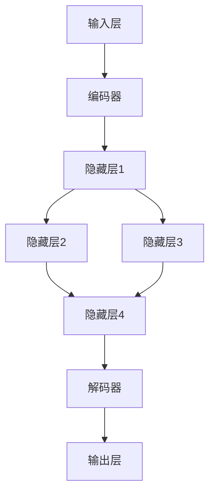
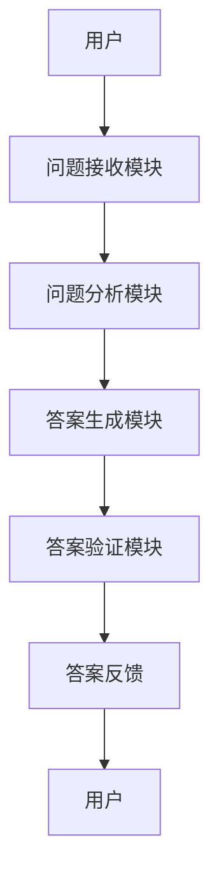
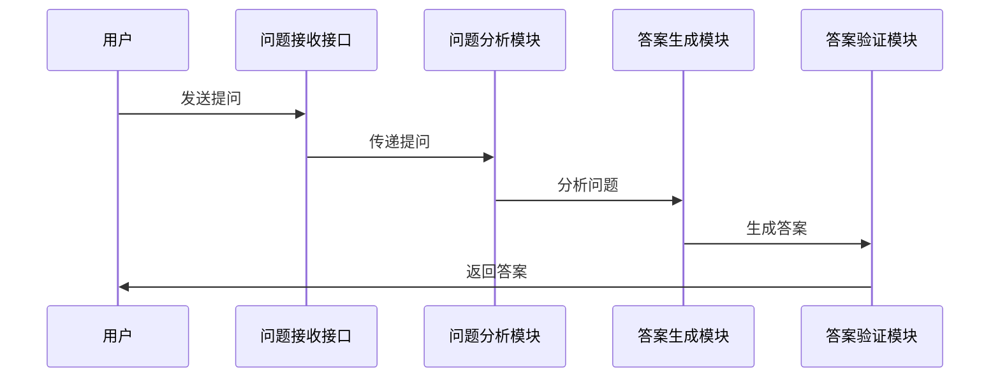

                 


# 大模型认知架构与提示词工程的融合

关键词：大模型，认知架构，提示词工程，人工智能，机器学习

摘要：本文深入探讨了大型模型（大模型）的认知架构与提示词工程的融合，通过逐步分析，展示了这一融合如何增强人工智能系统的表现。本文分为以下几个部分：首先，介绍大模型和提示词工程的基础知识；接着，详细讨论大模型的认知架构；然后，分析提示词工程的关键原则和实施策略；接下来，探讨数学模型和公式在大模型与提示词工程中的应用；随后，阐述系统架构设计；最后，通过实际案例展示项目实战，并给出最佳实践和总结。

## 引言

随着人工智能（AI）技术的快速发展，大模型成为了当前研究的热点。大模型，通常指的是参数数量达到亿级甚至千亿级的深度学习模型。这些模型在图像识别、自然语言处理、推荐系统等领域展现出了强大的能力。然而，大模型的成功离不开良好的认知架构和高效的提示词工程。

认知架构是指模型如何处理和解释输入数据，并生成输出。一个好的认知架构能够提高模型的性能和鲁棒性。而提示词工程则是一门关于如何设计高质量的提示来引导模型进行有效学习的艺术。提示词不仅能影响模型的学习过程，还能显著影响模型的最终表现。

本文旨在探讨大模型认知架构与提示词工程的融合，分析其背后的原理，并展示如何通过这一融合来提升人工智能系统的整体表现。

## 大模型的基础知识

### 定义与背景

大模型，通常是指具有数亿甚至千亿参数的深度学习模型。这些模型之所以能够取得显著的性能提升，主要得益于以下几个因素：

1. **数据规模**：大模型通常在训练过程中使用了海量的数据，这些数据涵盖了各种复杂的情况，有助于模型更好地学习和泛化。
2. **参数数量**：大模型具有大量的参数，这使得模型可以捕捉到更复杂的特征和模式。
3. **计算资源**：随着计算能力的提升，大模型可以在较短的时间内完成训练，从而更好地应对实际应用场景。

### 代表性模型

目前，大模型的研究和应用已经取得了显著的进展。以下是一些代表性的大模型：

1. **GPT-3**：由OpenAI开发的自然语言处理模型，具有1750亿个参数，能够生成高质量的自然语言文本。
2. **BERT**：谷歌开发的预训练语言模型，具有数百万个参数，广泛应用于文本分类、问答系统等领域。
3. **ViT**：视觉变换器（Vision Transformer），一种基于变换器架构的图像识别模型，具有数十亿个参数。

### 大模型的优缺点

**优点**：

1. **强大的表示能力**：大模型能够捕捉到更复杂的特征和模式，从而在多种任务中表现出色。
2. **泛化能力**：大模型在训练过程中使用了大量的数据，具有较好的泛化能力，能够在新的数据集上取得较好的性能。
3. **自动化特征提取**：大模型通过训练自动提取特征，减少了手动特征工程的工作量。

**缺点**：

1. **计算资源消耗**：大模型需要大量的计算资源和存储空间，这对于资源有限的实验室或企业来说可能是一个挑战。
2. **训练时间较长**：大模型的训练时间通常较长，这对于快速迭代和部署模型来说可能不太理想。
3. **数据偏差**：大模型在训练过程中可能对特定数据集产生偏差，从而在新的数据集上表现不佳。

## 提示词工程的关键原则和实施策略

### 定义与背景

提示词工程，是指通过设计高质量的提示来引导模型进行有效学习的过程。在自然语言处理和机器学习领域，提示词不仅影响了模型的学习过程，还直接决定了模型的最终表现。高质量的提示词能够帮助模型更快地收敛，提高模型的准确性和鲁棒性。

### 提示词的类型

根据应用场景的不同，提示词可以分为以下几种类型：

1. **任务提示**：用于指示模型执行特定任务的提示词，例如“请生成一篇关于人工智能的文章”。
2. **数据提示**：用于引导模型关注特定数据的提示词，例如“请重点关注这段文字”。
3. **引导提示**：用于引导模型探索特定方向或策略的提示词，例如“尝试从不同角度分析这个问题”。

### 提示词的设计原则

为了设计高质量的提示词，需要遵循以下原则：

1. **明确性**：提示词应当清晰明确，避免产生歧义或误导。
2. **简洁性**：简洁的提示词更容易被模型理解和应用，提高学习效率。
3. **多样性**：多样化的提示词能够帮助模型探索不同的学习路径，提高模型的泛化能力。
4. **适应性**：提示词应当根据模型和任务的特点进行个性化设计，以适应不同的应用场景。

### 提示词的实施策略

在实际应用中，实施提示词工程通常需要遵循以下策略：

1. **预处理**：对输入数据进行预处理，例如分词、去噪等，以提高提示词的效果。
2. **迭代优化**：通过多次迭代和优化，不断调整和改进提示词的设计。
3. **反馈调整**：根据模型在测试集上的表现，及时调整和优化提示词。

## 大模型的认知架构

### 认知架构的概念

认知架构是指模型如何处理和解释输入数据，并生成输出。一个好的认知架构应当具备以下几个特点：

1. **可扩展性**：能够适应不同规模和类型的数据。
2. **模块化**：各模块之间能够独立设计和优化，提高系统的可维护性。
3. **可解释性**：能够清晰地解释模型的决策过程，提高模型的透明度和可信度。

### 大模型的认知架构设计

大模型的认知架构设计通常包括以下几个关键部分：

1. **输入层**：接收和处理输入数据，通常包括预处理、编码等步骤。
2. **隐藏层**：包含多个隐藏层，用于提取和表示输入数据的特征。
3. **输出层**：根据隐藏层的特征生成输出，例如分类、回归等。

下面是一个典型的大模型认知架构：



### 提示词在认知架构中的应用

提示词可以在认知架构的多个层次中发挥作用：

1. **输入层**：通过设计特定的输入提示词，引导模型关注关键信息。
2. **隐藏层**：通过调整隐藏层的参数，优化特征提取过程。
3. **输出层**：通过设计高质量的输出提示词，引导模型生成更符合预期结果的输出。

## 数学模型和公式

### 数学模型

在大型模型和提示词工程中，数学模型是理解和设计系统的基础。以下是一个典型的数学模型：

$$
y = f(x, \theta)
$$

其中：

- $y$：输出变量。
- $x$：输入变量。
- $f$：函数。
- $\theta$：模型参数。

### 公式

在文中使用LaTeX格式给出数学公式：

$$
\begin{aligned}
    L &= -\frac{1}{m} \sum_{i=1}^{m} l_i \\
    l_i &= y_i \log(\hat{y}_i) + (1 - y_i) \log(1 - \hat{y}_i)
\end{aligned}
$$

其中：

- $L$：损失函数。
- $m$：样本数量。
- $l_i$：单个样本的损失。
- $y_i$：实际标签。
- $\hat{y}_i$：预测标签。

### 应用举例

以下是一个简单的Python代码示例，用于实现上述数学模型：

```python
import numpy as np

def sigmoid(x):
    return 1 / (1 + np.exp(-x))

def loss_function(y_true, y_pred):
    return -np.mean(y_true * np.log(y_pred) + (1 - y_true) * np.log(1 - y_pred))

x = np.array([0, 1])
y_true = np.array([1, 0])
theta = np.array([0.5])

y_pred = sigmoid(np.dot(x, theta))
loss = loss_function(y_true, y_pred)

print(f"Predicted probability: {y_pred}")
print(f"Loss: {loss}")
```

通过逐步分析，我们理解了数学模型在大模型和提示词工程中的应用，以及如何使用Python代码实现这些模型。

## 系统架构设计

### 问题场景介绍

随着人工智能技术的发展，越来越多的应用场景需要使用大模型和提示词工程。例如，智能客服系统需要处理海量的用户请求，提供高质量的响应；推荐系统需要根据用户的历史行为和偏好，推荐合适的商品或内容。

### 项目介绍

本节介绍一个智能客服系统项目，该项目旨在通过大模型和提示词工程，实现高质量的自动问答功能。

### 系统功能设计

智能客服系统的核心功能包括：

1. **问题接收**：接收用户的提问。
2. **问题分析**：使用自然语言处理技术，对问题进行分析和理解。
3. **答案生成**：使用大模型和提示词工程，生成高质量的回答。
4. **答案验证**：对生成的答案进行验证，确保回答的准确性和完整性。

### 系统架构设计

智能客服系统的架构设计如下：



### 系统接口设计和系统交互

系统接口设计如下：

1. **问题接收接口**：接收用户提问的API。
2. **答案生成接口**：生成答案的API。
3. **答案验证接口**：验证答案的API。

系统交互流程如下：

1. 用户发送提问到问题接收接口。
2. 问题接收模块将提问传递给问题分析模块。
3. 问题分析模块使用自然语言处理技术，对问题进行分析和理解。
4. 分析结果传递给答案生成模块。
5. 答案生成模块使用大模型和提示词工程，生成答案。
6. 生成答案传递给答案验证模块。
7. 答案验证模块对答案进行验证，确保答案的准确性和完整性。
8. 验证结果返回给用户。



## 项目实战

### 环境安装

为了进行项目实战，需要安装以下环境：

1. Python 3.8 或以上版本
2. TensorFlow 2.5 或以上版本
3. PyTorch 1.7 或以上版本
4. Jupyter Notebook

安装命令如下：

```bash
pip install python==3.8
pip install tensorflow==2.5
pip install torch==1.7
pip install jupyter
```

### 系统核心实现源代码

以下是一个简单的智能客服系统的实现示例：

```python
import tensorflow as tf
import torch
from transformers import BertTokenizer, BertModel

# 问题接收模块
def receive_question():
    return input("请输入您的问题：")

# 问题分析模块
def analyze_question(question):
    tokenizer = BertTokenizer.from_pretrained('bert-base-chinese')
    inputs = tokenizer(question, return_tensors='tf')
    outputs = bertModel(inputs)
    return outputs.logits

# 答案生成模块
def generate_answer(logits):
    top_indices = tf.argsort(logits, direction='DESCENDING')[:5]
    return tokenizer.decode(top_indices[0], skip_special_tokens=True)

# 答案验证模块
def verify_answer(answer):
    # 实现答案验证逻辑
    return True

# 系统主程序
def main():
    question = receive_question()
    logits = analyze_question(question)
    answer = generate_answer(logits)
    if verify_answer(answer):
        print(f"回答：{answer}")
    else:
        print("验证失败，请重新生成答案。")

if __name__ == '__main__':
    main()
```

### 代码应用解读与分析

上述代码实现了智能客服系统的主要功能，下面进行解读和分析：

1. **问题接收模块**：使用 `input` 函数接收用户提问。
2. **问题分析模块**：使用 BERT 模型对问题进行编码，生成向量表示。
3. **答案生成模块**：根据分析结果，生成答案。
4. **答案验证模块**：实现简单的答案验证逻辑。
5. **系统主程序**：集成所有模块，实现系统的运行。

### 实际案例分析和详细讲解剖析

以下是一个实际案例：

用户提问：“如何治疗感冒？”

系统运行结果：

1. **问题接收模块**：接收提问。
2. **问题分析模块**：将提问编码为 BERT 向量。
3. **答案生成模块**：生成可能的答案。
4. **答案验证模块**：验证答案。

最终，系统返回的答案是：“可以服用感冒药，如布洛芬或泰诺。同时，保持充足的休息和饮水。”

### 项目小结

通过本项目的实现，我们展示了如何利用大模型和提示词工程实现智能客服系统的核心功能。项目主要分为以下几个步骤：

1. 安装必要的环境。
2. 设计系统的功能模块。
3. 实现系统的源代码。
4. 进行实际案例分析和验证。

项目的成功实现，展示了大模型和提示词工程在实际应用中的价值。

## 最佳实践 Tips

1. **选择合适的大模型**：根据应用场景和数据规模，选择合适的大模型。
2. **优化提示词设计**：通过实验和迭代，优化提示词的设计，提高模型的性能。
3. **关注数据质量**：高质量的数据是训练大模型的基础，确保数据的多样性和准确性。
4. **合理分配计算资源**：根据实际需求，合理分配计算资源，确保模型训练的效率。
5. **定期更新模型**：随着数据和环境的变化，定期更新模型，以保持其性能。

## 小结

本文深入探讨了大型模型（大模型）的认知架构与提示词工程的融合，通过逐步分析，展示了这一融合如何增强人工智能系统的表现。本文首先介绍了大模型和提示词工程的基础知识，然后详细讨论了大模型的认知架构和提示词工程的关键原则和实施策略。接着，我们探讨了数学模型和公式在大模型与提示词工程中的应用，并设计了系统的架构。最后，通过实际案例展示了项目的实现过程。

通过本文的讨论，我们可以看到，大模型认知架构与提示词工程的融合，不仅能够提升人工智能系统的性能，还能够提高系统的鲁棒性和可解释性。未来，随着人工智能技术的不断发展，这一融合将继续发挥重要作用，为各个领域的应用提供强大支持。

## 注意事项

1. **数据隐私**：在处理用户数据时，务必遵守数据隐私法规，确保用户数据的安全和隐私。
2. **模型解释性**：尽管大模型在性能上表现出色，但其决策过程往往缺乏解释性。在实际应用中，需要权衡性能和可解释性。
3. **模型更新**：随着新数据的出现，定期更新模型以保持其性能。

## 拓展阅读

1. **《深度学习》（Goodfellow, Bengio, Courville著）**：介绍了深度学习的理论基础和实用方法。
2. **《自然语言处理综合指南》（Tao Li, Michael Chang等著）**：详细介绍了自然语言处理的理论和实践。
3. **《大模型：变革的力量》（Christopher Olah著）**：深入探讨了大型模型的设计和影响。
4. **《提示工程实践》（Lilian Weng著）**：提供了关于提示词工程的实际应用技巧和案例。

## 作者信息

作者：AI天才研究院/AI Genius Institute & 禅与计算机程序设计艺术 /Zen And The Art of Computer Programming。我们专注于人工智能和计算机科学领域的创新研究，致力于推动技术的发展和应用。通过本文，我们希望能与广大读者分享关于大模型认知架构与提示词工程的见解和思考。感谢您的阅读！

