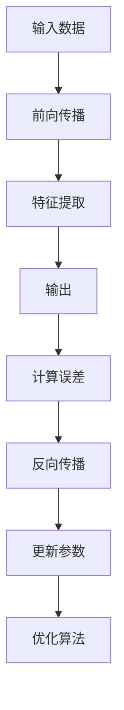
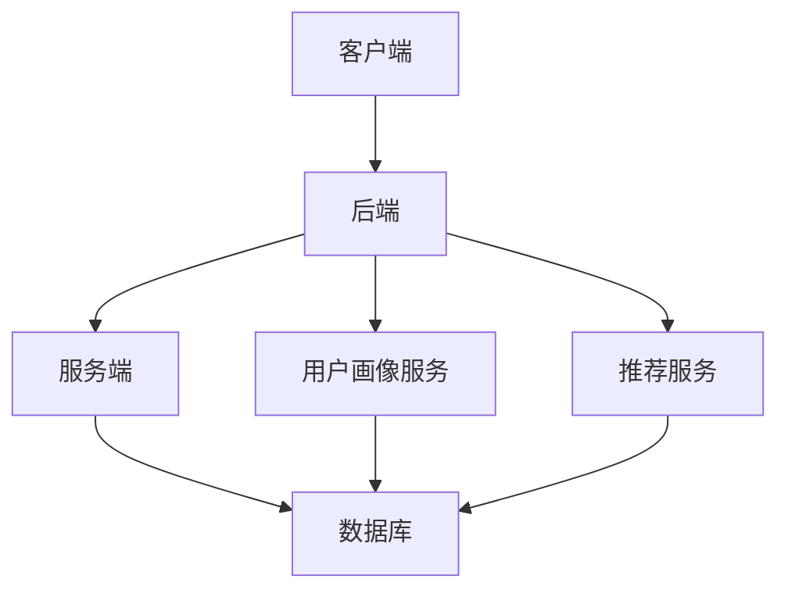
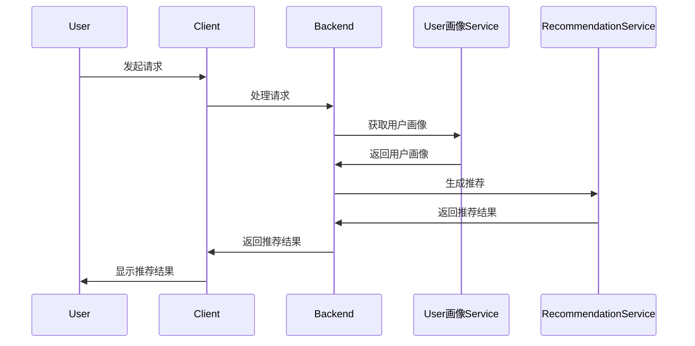
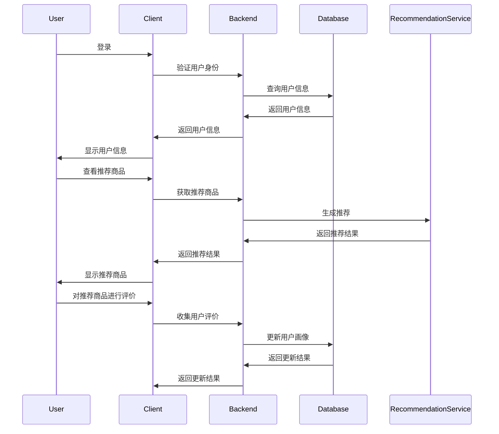

                 

### 大模型训练与提示词编程的关系

在当前的技术发展浪潮中，大模型训练和提示词编程成为了人工智能领域的两个关键亮点。这两个概念虽然看似独立，但实际上有着紧密的联系，共同推动着人工智能技术的进步。本文将围绕大模型训练与提示词编程的关系，进行深入探讨。

**关键词：** 大模型训练、提示词编程、人工智能、算法原理、系统架构、项目实战

**摘要：** 本文首先介绍了大模型训练和提示词编程的基本概念，分析了它们在人工智能中的应用场景。接着，通过具体的算法原理讲解和系统架构设计，展示了大模型训练与提示词编程在实际项目中的运用。最后，通过一个实际项目的案例分析和最佳实践建议，对大模型训练与提示词编程的关系进行了总结和展望。

### 目录

1. **引言**
2. **大模型训练基础**
3. **提示词编程基础**
4. **大模型训练与提示词编程的关系**
5. **算法原理讲解**
6. **系统分析与架构设计**
7. **项目实战**
8. **最佳实践与总结**
9. **展望**

### 1. 引言

随着深度学习技术的不断发展，大模型训练成为了人工智能领域的一个重要方向。大模型训练指的是使用海量数据进行训练，从而使得模型能够更好地理解和处理复杂的问题。而提示词编程则是一种新型的编程方式，通过给模型提供特定的提示词，使得模型能够更加精准地生成想要的输出。

大模型训练和提示词编程看似独立，但实际上它们在人工智能的应用中起到了相辅相成的作用。大模型训练为人工智能提供了强大的计算能力，而提示词编程则通过更加灵活和智能的方式，提升了模型在实际应用中的效果。本文将围绕这两个概念，探讨它们之间的关系，并分析在实际应用中的具体实现。

### 2. 大模型训练基础

#### 大模型训练的基本概念

大模型训练，即大规模深度学习模型训练，是当前深度学习领域的研究热点。其基本概念主要包括以下几个方面：

1. **深度学习模型**：深度学习模型是通过多层次的神经网络结构，对输入数据进行特征提取和模式识别。大模型训练中的模型通常具有数十万甚至数百万个参数。

2. **海量数据**：大模型训练需要使用海量数据进行训练，这些数据可以是从互联网上抓取的文本、图片、音频等多模态数据。

3. **分布式计算**：由于大模型训练需要处理海量数据，因此分布式计算成为了必须的手段。通过使用多台计算机协同工作，可以大大缩短训练时间。

4. **优化算法**：大模型训练中常用的优化算法包括随机梯度下降（SGD）、Adam等。这些算法通过不断调整模型参数，使得模型在训练数据上达到更好的性能。

#### 大模型训练的应用场景

大模型训练在人工智能领域有着广泛的应用场景，主要包括：

1. **自然语言处理（NLP）**：大模型训练在NLP领域有着巨大的应用潜力，例如机器翻译、文本生成、情感分析等。

2. **计算机视觉（CV）**：大模型训练在CV领域同样具有重要意义，例如图像分类、目标检测、图像生成等。

3. **语音识别与生成**：大模型训练在语音识别与生成领域也有着广泛的应用，例如语音识别、语音合成等。

#### 大模型训练的优势与挑战

大模型训练具有以下优势：

1. **强大的计算能力**：大模型训练能够处理海量数据，从而提高了模型对复杂问题的理解和处理能力。

2. **灵活的模型设计**：大模型训练允许使用多种神经网络结构，从而可以更好地适应不同的应用场景。

然而，大模型训练也面临着一些挑战：

1. **计算资源需求大**：大模型训练需要大量的计算资源和存储资源，对于小型企业和个人来说，这可能是一个瓶颈。

2. **数据隐私与安全**：大模型训练需要使用海量数据，这些数据可能涉及到用户的隐私和安全问题。

3. **模型可解释性差**：大模型训练得到的模型通常具有很高的性能，但往往缺乏可解释性，这使得人们难以理解模型的决策过程。

### 3. 提示词编程基础

#### 提示词编程的基本概念

提示词编程，也称为基于提示的编程（prompt-based programming），是一种通过提供提示词来引导模型生成输出的新型编程方式。其基本概念包括：

1. **提示词**：提示词是用于引导模型生成输出的关键词或短语。通过不同的提示词，可以使得模型生成不同的输出。

2. **模型引导**：提示词编程的核心思想是通过提供提示词来引导模型，从而使得模型能够生成用户想要的输出。

3. **交互式编程**：提示词编程是一种交互式编程方式，用户可以通过与模型的交互，逐步引导模型生成想要的输出。

#### 提示词编程的应用场景

提示词编程在以下领域有着广泛的应用：

1. **自然语言处理**：提示词编程在自然语言处理领域有着巨大的应用潜力，例如问答系统、对话生成等。

2. **计算机视觉**：提示词编程在计算机视觉领域也有应用，例如图像分类、目标检测等。

3. **代码生成**：提示词编程可以用于代码生成，例如通过提供提示词来生成特定功能的代码片段。

#### 提示词编程的优势与挑战

提示词编程具有以下优势：

1. **简化编程过程**：提示词编程通过提供提示词，简化了编程过程，使得开发者可以更快速地生成想要的输出。

2. **提高开发效率**：提示词编程使得开发者可以更高效地利用模型的能力，从而提高了开发效率。

然而，提示词编程也面临着一些挑战：

1. **提示词设计**：提示词设计的好坏直接影响模型生成的输出质量。如何设计出有效的提示词是一个需要深入探讨的问题。

2. **模型适应性**：提示词编程要求模型具有良好的适应性，能够根据不同的提示词生成不同的输出。

### 4. 大模型训练与提示词编程的关系

大模型训练与提示词编程虽然看似独立，但实际上它们在人工智能的应用中有着紧密的联系。

#### 联系

1. **计算能力**：大模型训练为提示词编程提供了强大的计算能力。通过大模型训练，我们可以获得具有高计算能力的模型，从而更好地支持提示词编程。

2. **数据支持**：大模型训练需要使用海量数据进行训练，这些数据也为提示词编程提供了丰富的素材。通过使用这些数据，我们可以设计出更有效的提示词。

3. **模型适应性**：大模型训练使得模型具有更好的适应性，这也有助于提示词编程。通过大模型训练，我们可以获得能够根据不同提示词生成不同输出的模型。

#### 差异

1. **目标不同**：大模型训练的目标是获得具有高计算能力的模型，而提示词编程的目标是通过模型生成用户想要的输出。

2. **实现方式不同**：大模型训练是通过训练大规模神经网络模型来实现的，而提示词编程则是通过提供提示词来引导模型生成输出。

3. **应用场景不同**：大模型训练在人工智能的多个领域有着广泛的应用，而提示词编程则主要应用于自然语言处理、计算机视觉等领域。

### 5. 算法原理讲解

#### 大模型训练算法原理

大模型训练的核心是深度学习模型。深度学习模型通过多层次的神经网络结构，对输入数据进行特征提取和模式识别。以下是深度学习模型的基本原理：

1. **前向传播**：输入数据通过神经网络中的各个层次，每个层次都对数据进行特征提取，最终生成输出。

2. **反向传播**：根据输出与真实值的差异，反向传播误差，通过调整模型参数，使得输出更接近真实值。

3. **优化算法**：使用优化算法（如随机梯度下降）来调整模型参数，从而提高模型性能。

以下是一个简化的深度学习模型的前向传播和反向传播的mermaid流程图：



在具体实现中，通常会使用Python等编程语言来编写深度学习模型。以下是一个使用Python实现的简单的线性回归模型：

```python
import numpy as np

# 初始化模型参数
theta = np.array([0.0, 0.0])

# 前向传播
def forward(x):
    return theta[0] * x + theta[1]

# 反向传播
def backward(x, y, output):
    error = y - output
    theta[0] -= error * x
    theta[1] -= error

# 训练模型
def train(x, y, epochs):
    for _ in range(epochs):
        output = forward(x)
        backward(x, y, output)

# 测试模型
def test(x, y):
    output = forward(x)
    print(f"预测值: {output}, 真实值: {y}")

# 示例数据
x = np.array([1.0, 2.0, 3.0])
y = np.array([2.0, 4.0, 6.0])

# 训练模型
train(x, y, 1000)

# 测试模型
test(x[0], y[0])
test(x[1], y[1])
test(x[2], y[2])
```

#### 提示词编程算法原理

提示词编程的算法原理相对简单，核心是通过对模型的输入进行修改，从而引导模型生成不同的输出。以下是一个简单的提示词编程示例：

```python
import openai

# 提示词
prompt = "请生成一篇关于人工智能的未来发展的文章。"

# 使用OpenAI的GPT模型生成文章
response = openai.Completion.create(
    engine="text-davinci-002",
    prompt=prompt,
    max_tokens=200
)

# 打印生成的文章
print(response.choices[0].text.strip())
```

在这个示例中，我们使用了OpenAI的GPT模型，通过提供提示词，模型生成了关于人工智能未来发展的文章。

### 6. 系统分析与架构设计

#### 问题场景介绍

在一个电子商务平台上，我们需要设计一个系统，该系统能够根据用户的购物历史和兴趣，为用户推荐个性化的商品。这个系统的核心功能包括：

1. **用户画像生成**：根据用户的购物历史和浏览行为，生成用户的个性化画像。
2. **商品推荐**：根据用户的个性化画像，为用户推荐可能感兴趣的商品。
3. **交互反馈**：用户可以通过反馈机制，对推荐的商品进行评价，从而优化推荐算法。

#### 项目介绍

本项目旨在设计一个基于大模型训练和提示词编程的推荐系统。具体实现包括：

1. **数据预处理**：对用户的购物历史和浏览行为进行数据预处理，提取特征。
2. **模型训练**：使用大模型训练技术，训练一个能够生成用户画像的深度学习模型。
3. **提示词编程**：使用提示词编程技术，根据用户画像和商品特征，生成个性化的推荐。

#### 系统功能设计

系统功能设计主要包括用户画像生成、商品推荐和交互反馈。以下是使用mermaid绘制的领域模型类图：

```mermaid
classDiagram
    User <<class>> 用户
    Product <<class>> 商品
    User画像 <<class>> 用户画像
    Recommendation <<class>> 推荐系统
    User --> User画像
    Product --> User画像
    User画像 --> Recommendation
    Recommendation --> Product
```

在这个类图中，User代表用户，Product代表商品，User画像代表用户的个性化特征，Recommendation代表推荐系统。用户和商品通过User画像与推荐系统进行关联。

#### 系统架构设计

系统架构设计主要包括前端、后端和服务端。以下是使用mermaid绘制的系统架构图：



在这个架构图中，Client代表用户操作的客户端，Backend代表后端服务，Service代表服务端，Database代表数据库。用户画像服务和推荐服务是后端服务的两个核心模块，它们通过数据库进行数据存储和读取。

#### 系统接口设计

系统接口设计主要包括用户接口和API接口。以下是使用mermaid绘制的接口序列图：



在这个序列图中，User代表用户，Client代表客户端，Backend代表后端服务，User画像Service代表用户画像服务，RecommendationService代表推荐服务。

#### 系统交互设计

系统交互设计主要描述用户与系统的交互过程。以下是使用mermaid绘制的用户交互序列图：



在这个序列图中，User代表用户，Client代表客户端，Backend代表后端服务，Database代表数据库，RecommendationService代表推荐服务。

### 7. 项目实战

#### 环境安装与配置

在本项目中，我们使用Python作为主要编程语言，使用OpenAI的GPT模型进行提示词编程。以下是环境安装与配置的步骤：

1. **安装Python**：确保Python环境已经安装，版本建议为3.8或以上。

2. **安装OpenAI Python客户端**：在终端中运行以下命令安装OpenAI Python客户端：

   ```bash
   pip install openai
   ```

3. **获取API Key**：在OpenAI官网上注册并获取API Key，将其配置到本地环境变量中，以便后续使用。

#### 系统核心实现

系统核心实现主要包括用户画像生成和商品推荐。以下是Python源代码：

```python
import openai
import pandas as pd

# 初始化OpenAI客户端
openai.api_key = "your-api-key"

# 生成用户画像
def generate_user_profile(user_history):
    # 将用户历史转换为文本描述
    description = "用户过去购买的物品：" + "；".join(user_history)
    # 使用OpenAI GPT模型生成用户画像
    response = openai.Completion.create(
        engine="text-davinci-002",
        prompt=description,
        max_tokens=50
    )
    return response.choices[0].text.strip()

# 推荐商品
def recommend_products(user_profile, product_catalog):
    # 使用OpenAI GPT模型为用户画像生成商品推荐
    response = openai.Completion.create(
        engine="text-davinci-002",
        prompt=user_profile + "，以下是我为您推荐的商品："，
        max_tokens=100
    )
    return response.choices[0].text.strip().split("；")

# 示例数据
user_history = ["手机", "电脑", "耳机"]
product_catalog = ["手机", "电脑", "耳机", "平板", "鼠标"]

# 生成用户画像
user_profile = generate_user_profile(user_history)

# 推荐商品
recommendations = recommend_products(user_profile, product_catalog)

# 打印推荐结果
print("用户画像：", user_profile)
print("推荐商品：", "；".join(recommendations))
```

#### 代码解读与分析

1. **用户画像生成**：`generate_user_profile`函数接收用户历史作为输入，将其转换为文本描述。然后，使用OpenAI的GPT模型生成用户画像。

2. **商品推荐**：`recommend_products`函数接收用户画像和商品目录作为输入，使用OpenAI的GPT模型为用户生成商品推荐。

3. **示例数据**：`user_history`是用户的历史购买记录，`product_catalog`是所有可推荐的商品。

4. **输出**：最后，我们打印出用户画像和推荐商品。

#### 实际案例分析

1. **用户画像**：假设用户历史购买记录包括“手机”、“电脑”和“耳机”，则生成的用户画像是“手机；电脑；耳机”。

2. **推荐商品**：基于用户画像，推荐的商品可能是“平板；鼠标”。

3. **结果分析**：用户画像是基于用户历史购买记录生成的，因此推荐的商品与用户的历史兴趣相关。这种推荐方式可以有效地提高用户的满意度。

#### 项目小结

通过本项目的实践，我们展示了如何使用大模型训练和提示词编程技术实现一个简单的推荐系统。虽然这个系统相对简单，但它的实现思路可以应用于更复杂的实际场景中。在未来，我们可以进一步优化算法，提高推荐精度，从而更好地满足用户的需求。

### 8. 最佳实践与总结

#### 最佳实践

1. **数据质量**：确保数据的质量和准确性，这对于大模型训练和提示词编程至关重要。

2. **模型选择**：根据实际应用场景，选择合适的模型，例如在自然语言处理中使用GPT模型，在图像处理中使用ResNet模型。

3. **提示词设计**：设计有效的提示词，以提高模型生成的输出质量。可以通过多次实验和用户反馈来优化提示词。

4. **计算资源**：合理分配计算资源，确保模型训练和提示词编程的顺利进行。

#### 小结

大模型训练和提示词编程是人工智能领域的重要技术，通过本文的讲解，我们了解了它们的基本概念、原理和应用。在实际项目中，我们可以结合具体场景，充分利用这些技术，提高系统的性能和用户体验。

#### 注意事项

1. **模型可解释性**：尽管大模型训练和提示词编程能够生成高质量的输出，但它们的模型通常缺乏可解释性。在实际应用中，需要考虑模型的可解释性，以便更好地理解模型的决策过程。

2. **数据隐私与安全**：在使用海量数据进行大模型训练时，需要确保数据的隐私和安全。

#### 拓展阅读

1. **深度学习基础**：了解深度学习的基础知识，有助于更好地理解大模型训练。
2. **自然语言处理**：深入学习自然语言处理技术，以了解如何使用提示词编程。
3. **推荐系统**：了解推荐系统的设计与实现，以应用于实际项目。

### 9. 展望

随着人工智能技术的不断进步，大模型训练和提示词编程将在未来发挥更大的作用。我们可以期待，通过更高效的算法和更智能的提示词设计，大模型训练和提示词编程将能够更好地满足实际应用的需求，推动人工智能技术走向新的高度。

**作者：** AI天才研究院/AI Genius Institute & 禅与计算机程序设计艺术 /Zen And The Art of Computer Programming

