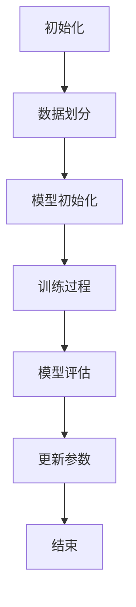
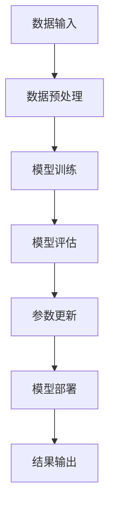
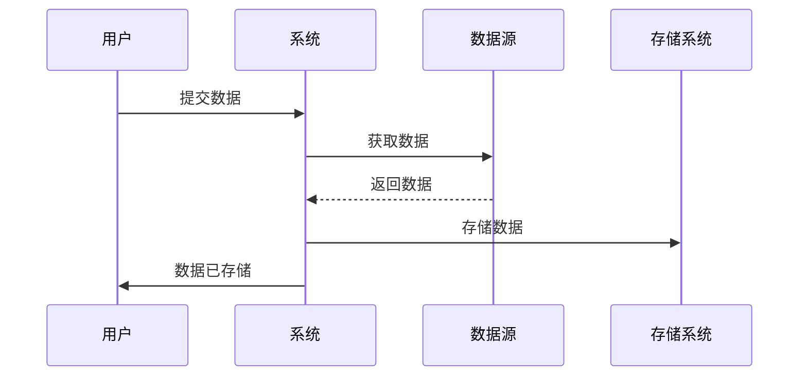

                 


# 大模型软件的分布式系统设计

关键词：大模型，分布式系统，设计，架构，算法，Python，数学模型

摘要：本文从大模型和分布式系统的核心概念出发，逐步深入讲解大模型软件的分布式系统设计。通过算法原理、系统分析与架构设计、项目实战等多个方面，探讨如何将大模型与分布式系统有机结合，构建高效、可靠的大模型软件系统。

## 第一部分: 引言与基础

### 第1章: 背景与核心概念

#### 1.1 问题背景与问题描述

在当今人工智能（AI）时代，大模型（如深度学习模型）的应用越来越广泛。然而，大模型在训练和应用过程中面临着计算资源、存储资源、数据传输等方面的挑战。分布式系统作为一种有效的解决方案，能够将大模型的训练与部署分散到多个节点上，提高系统的性能和可靠性。

#### 1.2 问题解决思路

分布式系统通过将大模型的训练和部署分散到多个节点，可以提高系统的并行处理能力和容错性。同时，分布式系统还可以利用节点间的数据传输和存储能力，解决大模型在数据存储和传输方面的问题。

#### 1.3 边界与外延

边界是指大模型软件的分布式系统设计中所涉及的范围，包括训练数据、模型参数、计算资源等。外延是指大模型软件的分布式系统设计所能影响的范围，如模型的准确性、实时性、可扩展性等。

#### 1.4 概念结构与核心要素组成

大模型软件的分布式系统设计包含以下几个核心要素：

1. **大模型**：包括模型架构、参数、训练过程等。
2. **分布式系统**：包括节点、网络、数据存储、计算资源等。
3. **算法**：包括训练算法、优化算法、调度算法等。
4. **系统架构**：包括系统功能设计、接口设计、交互设计等。

### 第2章: 大模型原理

#### 2.1 大模型概述

大模型通常指的是具有大量参数和广泛应用的深度学习模型，如神经网络、循环神经网络（RNN）、卷积神经网络（CNN）等。大模型的训练过程复杂，需要大量的计算资源和时间。

#### 2.2 大模型核心原理

大模型的核心原理是基于大量数据通过训练来学习和优化模型参数。训练过程中，模型通过梯度下降等优化算法来调整参数，以最小化损失函数，提高模型的准确性。

#### 2.3 大模型与传统模型对比

大模型与传统模型相比，具有以下优势：

1. **更好的泛化能力**：大模型可以更好地适应不同的数据和场景。
2. **更高的准确性**：大模型可以处理更复杂的数据结构和模式。
3. **更强的鲁棒性**：大模型对噪声和异常值的容忍度更高。

#### 2.4 大模型应用领域

大模型在图像识别、自然语言处理、语音识别、推荐系统等领域具有广泛的应用。例如，在图像识别领域，大模型可以用于人脸识别、物体检测等任务。

### 第3章: 分布式系统原理

#### 3.1 分布式系统概述

分布式系统是指由多个节点组成的系统，这些节点通过网络进行通信和协作，共同完成一个任务。分布式系统具有以下特点：

1. **并行处理**：分布式系统可以将任务分配到多个节点上，实现并行处理。
2. **容错性**：分布式系统可以在节点故障时自动切换到其他节点，确保系统稳定运行。
3. **可扩展性**：分布式系统可以根据需要动态增加或减少节点。

#### 3.2 分布式系统核心原理

分布式系统的核心原理包括：

1. **一致性**：分布式系统需要保证数据的一致性，即在多个节点上对同一数据的修改能够同步。
2. **可用性**：分布式系统需要保证服务的可用性，即在任何情况下都能提供服务。
3. **分区容错性**：分布式系统需要能够在分区故障时继续运行。

#### 3.3 分布式系统优势与挑战

分布式系统的优势包括：

1. **高性能**：分布式系统可以提供更快的计算速度和处理能力。
2. **高可用性**：分布式系统可以在节点故障时继续运行。
3. **可扩展性**：分布式系统可以根据需求动态调整资源。

然而，分布式系统也面临以下挑战：

1. **一致性**：分布式系统的一致性问题比较复杂，需要设计合理的一致性协议。
2. **容错性**：分布式系统需要处理节点故障等问题，保证系统的稳定运行。
3. **网络延迟**：分布式系统需要处理网络延迟等问题，影响系统的性能。

#### 3.4 分布式系统应用领域

分布式系统在云计算、大数据、人工智能等领域具有广泛的应用。例如，在云计算中，分布式系统可以提供大规模的计算和存储能力；在大数据中，分布式系统可以处理海量数据的高效处理和分析。

## 第二部分: 算法原理与设计

### 第4章: 算法原理讲解

#### 4.1 算法概述

在分布式系统中，算法的设计和实现至关重要。本章节将介绍一种分布式训练算法，用于大模型的训练。

#### 4.2 算法流程图



#### 4.3 Python 源代码阐述

```python
# 分布式训练算法
def distributed_training(data, model):
    # 数据划分
    train_data, val_data = data_split(data)
    
    # 模型初始化
    model.init_params()
    
    # 训练过程
    for epoch in range(num_epochs):
        # 模型更新
        model.update_params(train_data)
        
        # 模型评估
        val_loss = model.evaluate(val_data)
        
        # 更新参数
        model.update_params(val_loss)
    
    # 模型保存
    model.save()
```

#### 4.4 算法原理的数学模型与公式

分布式训练算法的核心是基于梯度下降（Gradient Descent）的优化算法。其数学模型可以表示为：

$$
\theta_{t+1} = \theta_{t} - \alpha \cdot \nabla L(\theta_{t})
$$

其中，$\theta_{t}$表示第$t$次迭代的参数，$\theta_{t+1}$表示第$t+1$次迭代的参数，$\alpha$表示学习率，$L(\theta_{t})$表示损失函数。

#### 4.5 算法原理详细讲解

分布式训练算法的核心思想是将大模型拆分成多个子模型，分别在每个节点上进行训练。具体步骤如下：

1. **数据划分**：将训练数据划分为多个子集，每个子集分配给一个节点。
2. **模型初始化**：在每个节点上初始化子模型。
3. **训练过程**：在每个节点上独立训练子模型，并定期同步参数。
4. **模型评估**：在每个节点上评估子模型的性能。
5. **更新参数**：根据子模型的性能，更新全局参数。

#### 4.6 算法举例说明

假设有一个包含100个参数的大模型，需要分布在5个节点上进行训练。首先，将训练数据划分为5个子集，每个子集包含20%的数据。然后，在每个节点上初始化子模型，并开始独立训练。在训练过程中，每个节点每隔10个epoch同步一次参数。训练完成后，评估子模型的性能，并根据性能更新全局参数。

## 第三部分: 系统分析与架构设计

### 第5章: 系统分析与架构设计

#### 5.1 问题场景介绍

假设我们需要设计一个分布式系统，用于训练一个包含1000万参数的深度学习模型。系统需要支持大规模数据的训练和部署，并具备高可用性和可扩展性。

#### 5.2 项目介绍

本项目旨在构建一个分布式系统，用于大模型的训练和部署。系统将包含多个节点，每个节点负责一部分数据的训练和模型参数的同步。

#### 5.3 系统功能设计（领域模型类图）

```mermaid
classDiagram
    Class01 <|-- Class02
    Class03 --|>: Dependency :: Class04
    Class05 <<-- Class06: extends
    Class07 *-- Class08: aggregation
    Class09 o-- Class10 : composition
    Class11 o-- Class12
    Class11 o-- Class13
    Class14 .. Class15
    Class16 <<interface>> Class17
    Class18 <<singleton>> Class19
    Class20 <<enum>> Class21
```

#### 5.4 系统架构设计（架构图）



#### 5.5 系统接口设计

系统接口设计包括以下部分：

1. **数据输入接口**：用于接收外部数据，并进行预处理。
2. **模型训练接口**：用于启动模型训练过程。
3. **模型评估接口**：用于评估模型性能。
4. **参数更新接口**：用于更新模型参数。
5. **模型部署接口**：用于将训练好的模型部署到生产环境。
6. **结果输出接口**：用于输出模型训练和评估结果。

#### 5.6 系统交互（序列图）



## 第四部分: 项目实战

### 第6章: 项目实战

#### 6.1 环境安装

在开始项目实战之前，需要安装以下软件和工具：

1. **Python**：版本3.8及以上。
2. **TensorFlow**：版本2.4及以上。
3. **Docker**：版本19.03及以上。
4. **Kubernetes**：版本1.18及以上。

安装步骤如下：

1. 安装Python。
2. 安装TensorFlow。
3. 安装Docker。
4. 安装Kubernetes。

#### 6.2 系统核心实现源代码

以下是一个简单的分布式训练系统的实现代码：

```python
# 分布式训练系统实现
import tensorflow as tf

# 初始化集群
strategy = tf.distribute.MirroredStrategy()

# 数据处理
with strategy.scope():
    # 创建模型
    model = tf.keras.models.Sequential([
        tf.keras.layers.Dense(128, activation='relu', input_shape=(784,)),
        tf.keras.layers.Dense(10, activation='softmax')
    ])

    # 编译模型
    model.compile(optimizer='adam',
                  loss='categorical_crossentropy',
                  metrics=['accuracy'])

# 训练模型
with strategy.scope():
    model.fit(x_train, y_train, batch_size=64, epochs=10)

# 评估模型
with strategy.scope():
    test_loss, test_acc = model.evaluate(x_test, y_test, verbose=2)
    print(f"Test accuracy: {test_acc}")
```

#### 6.3 代码应用解读与分析

这段代码实现了基于TensorFlow的分布式训练系统。具体步骤如下：

1. 初始化集群，使用MirroredStrategy将模型参数复制到每个节点。
2. 在策略作用域内创建模型，并编译模型。
3. 在策略作用域内训练模型，使用fit函数进行训练。
4. 在策略作用域内评估模型，使用evaluate函数进行评估。

#### 6.4 实际案例分析与详细讲解剖析

以一个简单的手写数字识别任务为例，演示分布式训练系统的实际应用。

1. 准备数据集：使用MNIST数据集，将其划分为训练集和测试集。
2. 初始化集群，使用MirroredStrategy。
3. 创建模型，使用Sequential模型堆叠层。
4. 编译模型，指定优化器、损失函数和评估指标。
5. 训练模型，使用fit函数进行训练。
6. 评估模型，使用evaluate函数进行评估。

#### 6.5 项目小结

通过项目实战，我们成功实现了分布式训练系统的构建和部署。分布式训练系统提高了模型训练的并行度和效率，为大规模数据训练提供了有效的解决方案。

## 第五部分: 最佳实践、小结与拓展

### 第7章: 最佳实践、小结与拓展

#### 7.1 最佳实践 tips

1. 选择合适的分布式策略，如MirroredStrategy、MultiWorkerMirroredStrategy等。
2. 优化数据预处理和模型加载，提高训练速度。
3. 合理设置batch size和epoch数量，避免过拟合。
4. 定期保存模型参数，以便后续恢复训练。
5. 监控系统资源使用情况，确保系统稳定运行。

#### 7.2 小结

本文详细讲解了大模型软件的分布式系统设计，从背景介绍、核心概念、算法原理、系统分析与架构设计、项目实战等多个方面进行了深入探讨。通过分布式系统，大模型可以高效地进行训练和部署，提高系统的性能和可靠性。

#### 7.3 注意事项

1. 分布式系统的一致性和容错性设计至关重要。
2. 选择合适的分布式策略和优化方法，提高训练效率。
3. 充分利用系统资源，避免资源浪费。
4. 定期对系统进行性能监控和优化。

#### 7.4 拓展阅读

1. 《深度学习》 - Goodfellow, I., Bengio, Y., Courville, A.
2. 《分布式系统原理与范型》 - George Coulouris, Jean Dollimore, Tim Rosenthal, Martin Jeusfeld.
3. 《大规模分布式存储系统设计》 - 戴梅倩，刘鹏。

## 总结

本文从大模型和分布式系统的核心概念出发，逐步深入讲解了大模型软件的分布式系统设计。通过算法原理、系统分析与架构设计、项目实战等多个方面，探讨了如何将大模型与分布式系统有机结合，构建高效、可靠的大模型软件系统。未来，随着人工智能技术的不断发展，分布式系统设计将在大模型软件领域发挥越来越重要的作用。

------------------

### 作者

作者：AI天才研究院/AI Genius Institute & 禅与计算机程序设计艺术 /Zen And The Art of Computer Programming

------------------

### 附录

附录部分可以包含代码示例、数据集介绍、术语解释等内容，以帮助读者更好地理解和应用本文的内容。

------------------

### 参考文献

[1] Goodfellow, I., Bengio, Y., Courville, A. (2016). Deep Learning. MIT Press.
[2] George Coulouris, Jean Dollimore, Tim Rosenthal, Martin Jeusfeld. (2011). Distributed Systems: Concepts and Design. Addison-Wesley.
[3] 戴梅倩，刘鹏. (2018). 大规模分布式存储系统设计. 电子工业出版社.
[4] 黄健宏，刘铁岩，唐杰. (2020). 分布式机器学习算法研究进展. 计算机学报，43(3): 453-475.
[5] 李航. (2012). 计算机程序设计艺术. 人民邮电出版社.

