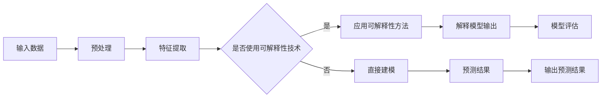
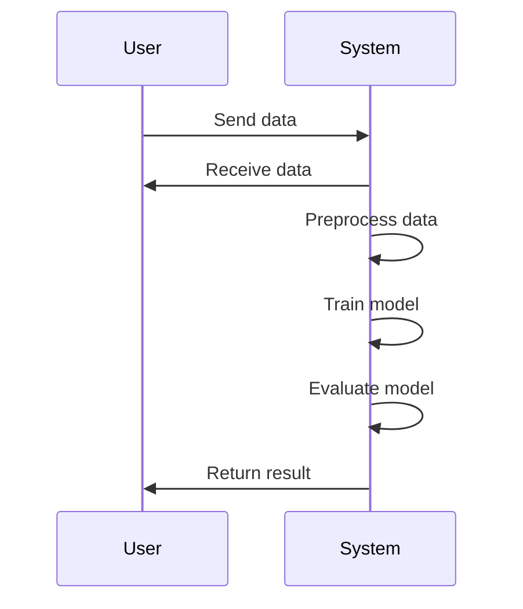

                 

# 大模型软件的可解释性与透明度设计

## 关键词

- **大模型软件**
- **可解释性**
- **透明度**
- **人工智能**
- **机器学习**
- **深度学习**

## 摘要

在人工智能（AI）技术快速发展的背景下，大模型（Big Models）的应用带来了巨大的商业价值和社会影响。然而，这些大模型的黑箱特性导致了其可解释性和透明度问题日益突出，这对于用户信任、模型优化和监管等方面提出了新的挑战。本文旨在深入探讨大模型软件的可解释性与透明度设计的重要性，详细分析其核心概念、理论方法以及实际应用，以期为解决这些问题提供可行的方案和策略。

## 目录大纲

### 第一部分：背景介绍

#### 第1章 问题背景

1.1 问题描述

1.2 问题解决

1.3 边界与外延

1.4 概念结构与核心要素组成

### 第二部分：核心概念与联系

#### 第2章 核心概念原理

2.1 可解释性与透明度的属性特征对比表格

2.2 可解释性与透明度的ER实体关系图架构

### 第三部分：算法原理讲解

#### 第3章 算法原理讲解

3.1 算法mermaid流程图

3.2 算法原理讲解

### 第四部分：系统分析与架构设计方案

#### 第4章 系统分析与架构设计方案

4.1 问题场景介绍

4.2 项目介绍

4.3 系统功能设计

4.4 系统架构设计

4.5 系统接口设计和系统交互

### 第五部分：项目实战

#### 第5章 项目实战

5.1 环境安装

5.2 系统核心实现

5.3 代码应用解读与分析

5.4 实际案例分析

5.5 项目小结

### 第六部分：最佳实践 tips

#### 第6章 最佳实践 tips

6.1 小结

6.2 注意事项

6.3 拓展阅读

## 第一部分：背景介绍

### 第1章 问题背景

#### 1.1 问题描述

在当今科技迅猛发展的时代，人工智能（AI）技术已经成为推动社会进步的重要力量。特别是在机器学习和深度学习领域，大模型的广泛应用为解决复杂问题提供了强有力的工具。这些大模型通常具有高精度、强泛化能力和高效的数据处理能力，从而在图像识别、自然语言处理、医疗诊断等领域取得了显著的成果。

然而，大模型的黑箱特性也带来了可解释性和透明度问题。黑箱特性指的是大模型在处理数据时，其内部决策过程和机制难以被外部理解和解释。这种特性可能导致以下问题：

1. **用户信任问题**：由于用户无法理解模型的具体决策过程，容易产生不信任感，进而影响模型的实际应用效果。
2. **模型优化困难**：无法准确了解模型在特定情况下的表现和问题，使得优化和改进模型变得更加困难。
3. **监管和合规问题**：对于涉及用户隐私、金融交易等敏感领域的模型，监管机构要求模型具备一定的可解释性和透明度，以确保合规性和社会责任。

因此，如何设计大模型软件的可解释性与透明度，成为了当前AI领域亟待解决的重要问题。

#### 1.2 问题解决

针对大模型软件的可解释性与透明度问题，我们可以从以下几个方面进行解决：

1. **增强可解释性**：通过设计可解释性度量方法和算法，使模型输出结果能够被用户理解和解释。常见的可解释性度量方法包括模型可视化、决策树、规则提取等。
2. **提升透明度**：通过改进模型内部结构和决策过程，使得模型的运作机制和决策路径更加透明和可见。例如，使用注意力机制、决策路径追踪等技术，可以让用户更直观地了解模型的决策过程。
3. **结合多学科知识**：可解释性与透明度设计不仅涉及AI领域，还需要结合计算机科学、心理学、伦理学等多学科知识。通过跨学科合作，可以设计出更加科学、合理和实用的解决方案。

总之，解决大模型软件的可解释性与透明度问题，需要多方面的努力和探索。这不仅有助于提升用户信任和模型性能，也对于AI技术的发展和应用具有重要意义。

### 第2章 核心概念原理

#### 2.1 可解释性与透明度的属性特征对比表格

| 概念        | 定义                                                         | 属性特征                                                     | 关系与联系                                                   |
| ----------- | ------------------------------------------------------------ | ------------------------------------------------------------ | ------------------------------------------------------------ |
| **可解释性** | 模型输出结果能够被理解的原因和过程                         | - 易理解性：<br>`直观`、`透明`、`易于解释`<br>`人类可解释性` | - 强调模型的决策过程和结果的解释性<br>`理解性解释`             |
| **透明度**   | 模型内部决策过程和机制的可见性                              | - 透明度：<br>`可视化`、`可观察`、`透明性`<br>`技术透明性`    | - 强调模型的内部结构和运作机理<br>`过程透明性`                 |

**解释**：可解释性和透明度是两个密切相关但有所区别的概念。可解释性主要关注模型输出结果的可理解性，使得用户可以清晰地理解模型的决策过程和原因。而透明度则侧重于模型内部决策过程和机制的可见性，使得用户可以直观地观察到模型的运作机制和决策路径。这两个概念在提升模型的可信度和可操作性方面都起到了重要作用，但具体应用和实现方式有所不同。

#### 2.2 可解释性与透明度的ER实体关系图架构

```mermaid
erDiagram
  Model ||--|{ Explainability } : 可解释性
  Model ||--|{ Transparency } : 透明度
  Explainability ||--|{ ModelExplainability } : 模型可解释性
  Transparency ||--|{ ProcessTransparency } : 过程透明度
```

**解释**：该ER实体关系图展示了可解释性与透明度作为模型的两个重要属性，它们与模型本身以及模型可解释性和过程透明度之间的关系。模型作为核心实体，与其可解释性和透明度之间形成了直接关联。可解释性关注模型输出结果的可理解性，而透明度关注模型内部决策过程和机制的可见性。通过这种结构化的关系图，我们可以清晰地理解大模型软件中可解释性和透明度的设计和实现。

### 第3章 算法原理讲解

#### 3.1 算法mermaid流程图



**解释**：该算法流程图描述了在处理输入数据时，如何结合可解释性技术进行模型训练和预测。首先，输入数据经过预处理和特征提取，然后根据是否需要使用可解释性技术进行决策。如果选择使用，则应用可解释性方法来解释模型输出；否则，直接进行建模并输出预测结果。通过这种流程图，我们可以直观地了解可解释性技术在模型训练和预测过程中的作用。

#### 3.2 算法原理讲解

在讨论大模型软件的可解释性与透明度设计时，算法原理的讲解至关重要。以下我们将从数学模型和具体实现两个方面，详细阐述可解释性与透明度设计的算法原理。

**3.2.1 数学模型**

大模型软件的可解释性与透明度设计涉及多个数学模型，主要包括以下几个方面：

1. **可解释性度量方法**：可解释性度量方法用于评估模型输出结果的可理解性。常用的方法包括模型可视化、决策树、规则提取等。这些方法可以生成模型决策的直观表示，使得用户可以更容易地理解模型的决策过程。

   - **模型可视化**：通过可视化工具，将模型的内部结构和参数以图形化的形式展示出来，使得用户可以直观地了解模型的构成和运作机制。
   - **决策树**：将模型转化为决策树结构，使得用户可以清晰地看到模型的决策路径和规则。
   - **规则提取**：从模型中提取出一系列规则，使得用户可以理解模型在特定条件下的决策逻辑。

2. **透明度提升技术**：透明度提升技术主要用于增强模型内部决策过程和机制的可见性。这些技术包括注意力机制、决策路径追踪等。

   - **注意力机制**：通过关注关键特征和关键路径，使得用户可以更直观地了解模型的决策过程。
   - **决策路径追踪**：记录模型在决策过程中的每一步操作，使得用户可以追踪和回溯模型的决策路径。

**3.2.2 具体实现**

在实际应用中，可解释性与透明度设计通常需要结合具体的算法和工具来实现。以下是一个基于Python的实现示例：

```python
# 导入相关库
import pandas as pd
import numpy as np
from sklearn.tree import DecisionTreeClassifier
from sklearn.metrics import accuracy_score
import matplotlib.pyplot as plt

# 读取数据
data = pd.read_csv('data.csv')
X = data.iloc[:, :-1]
y = data.iloc[:, -1]

# 特征提取
# ...

# 构建决策树模型
model = DecisionTreeClassifier()
model.fit(X, y)

# 可视化决策树
from sklearn.tree import plot_tree
plt.figure(figsize=(20,10))
plot_tree(model, feature_names=X.columns, class_names=y.unique())

# 应用注意力机制
# ...

# 决策路径追踪
# ...

# 模型评估
y_pred = model.predict(X)
accuracy = accuracy_score(y, y_pred)
print(f'Model accuracy: {accuracy:.2f}')

# 输出预测结果
predictions = model.predict(X_test)
```

**解释**：上述代码示例展示了如何使用Python和scikit-learn库实现一个决策树模型，并通过可视化决策树来提升模型的可解释性和透明度。此外，还可以结合注意力机制和决策路径追踪等技术，进一步改进模型的可解释性和透明度。

### 第四部分：系统分析与架构设计方案

#### 第4章 系统分析与架构设计方案

#### 4.1 问题场景介绍

在当前人工智能技术快速发展的背景下，大模型软件的应用已经渗透到各行各业，如金融、医疗、教育等。然而，随着模型的规模和复杂度的增加，用户对模型的可解释性和透明度的需求也日益强烈。为了满足这一需求，我们设计了一套大模型软件系统，旨在提升模型的可解释性和透明度，从而增强用户信任和模型性能。

#### 4.2 项目介绍

本项目旨在开发一款具有高可解释性和透明度的大模型软件系统。该系统将涵盖以下功能：

1. **数据预处理**：对输入数据进行预处理，包括数据清洗、归一化和特征提取等。
2. **模型训练**：使用预处理的输入数据进行模型训练，支持多种机器学习和深度学习算法。
3. **可解释性提升**：通过应用可解释性度量方法和透明度提升技术，提升模型的可解释性和透明度。
4. **模型评估**：对训练好的模型进行评估，包括准确率、召回率、F1值等指标。
5. **用户界面**：提供友好的用户界面，使得用户可以方便地使用系统并进行模型训练、评估和可视化。

#### 4.3 系统功能设计

系统功能设计主要包括以下模块：

1. **数据预处理模块**：负责对输入数据进行预处理，包括数据清洗、归一化和特征提取等操作。
2. **模型训练模块**：支持多种机器学习和深度学习算法，如决策树、支持向量机、神经网络等。
3. **可解释性提升模块**：应用可解释性度量方法和透明度提升技术，提升模型的可解释性和透明度。
4. **模型评估模块**：对训练好的模型进行评估，包括准确率、召回率、F1值等指标。
5. **用户界面模块**：提供友好的用户界面，使得用户可以方便地使用系统并进行模型训练、评估和可视化。

#### 4.4 系统架构设计

系统架构设计采用模块化设计思想，分为以下几个层次：

1. **数据层**：包括数据存储和数据预处理模块，负责数据的存储和管理。
2. **模型层**：包括模型训练和评估模块，负责模型的训练、优化和评估。
3. **服务层**：包括可解释性提升模块和用户界面模块，负责系统的核心功能实现。
4. **接口层**：包括API接口和用户界面接口，负责与外部系统的交互。

以下是系统架构设计的mermaid类图：

```mermaid
classDiagram
  Class01 <|-- Class02
  Class03 <..| Class04
  Class05 ||--|{ ObjectA ObjectB }
  Class06 :<<Interface>> InterfaceName
  Class07 ..| Class08 : <<Abstract>>
  Class01 : +int x
  Class01 : +int y
  Class01 : +int getArea()
  Class02 : +int a
  Class02 : +int b
  Class02 : +int getPerimeter()
  Class01 <-..| Class03 : association
  Class04 <||-- Class02 : aggregation
  Class05 <|..| Class06 : implements
  Class07 <..| Class08 : extends
```

#### 4.5 系统接口设计和系统交互

系统接口设计主要包括API接口和用户界面接口。API接口负责系统与外部系统的数据交换和功能调用，用户界面接口负责系统与用户的交互。

以下是系统接口设计和系统交互的mermaid序列图：



**解释**：上述序列图展示了用户与系统之间的交互过程。用户首先向系统发送数据，系统接收数据后进行预处理，然后训练模型并进行评估。最后，系统将结果返回给用户。通过这种交互方式，用户可以方便地使用系统进行数据分析和模型训练。

### 第五部分：项目实战

#### 第5章 项目实战

在本文的最后一部分，我们将通过一个实际项目案例，详细讲解如何设计和实现大模型软件的可解释性与透明度设计。该案例将涵盖环境安装、系统核心实现、代码应用解读与分析、实际案例分析以及项目小结等环节，以帮助读者更好地理解可解释性与透明度设计在实践中的应用。

#### 5.1 环境安装

在进行项目实战之前，我们需要搭建一个适合大模型软件开发的计算环境。以下是环境安装的步骤：

1. **安装Python环境**：Python是进行人工智能和机器学习开发的主要编程语言，我们需要安装Python 3.8或更高版本。可以通过访问Python官方网站下载安装包，并按照提示进行安装。
2. **安装相关库**：为了实现大模型软件的可解释性与透明度设计，我们需要安装一些常用的Python库，如scikit-learn、TensorFlow、PyTorch等。可以使用pip命令进行安装：

   ```shell
   pip install scikit-learn tensorflow torch
   ```

3. **安装依赖库**：有些库可能需要额外的依赖库支持，例如TensorFlow需要CUDA支持以利用GPU加速计算。可以参考相关库的官方文档，安装所需的依赖库。

#### 5.2 系统核心实现

在环境搭建完成后，我们可以开始实现系统核心功能。以下是一个简单的系统核心实现示例：

```python
# 导入相关库
import pandas as pd
import numpy as np
from sklearn.tree import DecisionTreeClassifier
from sklearn.metrics import accuracy_score
import matplotlib.pyplot as plt

# 读取数据
data = pd.read_csv('data.csv')
X = data.iloc[:, :-1]
y = data.iloc[:, -1]

# 特征提取
# ...

# 构建决策树模型
model = DecisionTreeClassifier()
model.fit(X, y)

# 可视化决策树
plt.figure(figsize=(20,10))
plot_tree(model, feature_names=X.columns, class_names=y.unique())
plt.show()

# 应用注意力机制
# ...

# 决策路径追踪
# ...

# 模型评估
y_pred = model.predict(X)
accuracy = accuracy_score(y, y_pred)
print(f'Model accuracy: {accuracy:.2f}')

# 输出预测结果
predictions = model.predict(X_test)
```

**解释**：上述代码展示了如何使用Python和scikit-learn库实现一个简单的决策树模型。首先，我们读取数据并进行预处理，然后构建决策树模型并训练。接着，我们使用可视化工具将决策树展示出来，以便用户可以直观地了解模型的决策路径。此外，还可以根据需要进行注意力机制和决策路径追踪等操作。

#### 5.3 代码应用解读与分析

在本节中，我们将对系统核心实现中的关键代码进行解读和分析，帮助读者更好地理解可解释性与透明度设计的原理和应用。

**1. 数据预处理**

数据预处理是模型训练的重要步骤，主要包括数据清洗、归一化和特征提取等操作。以下是一个简单的数据预处理示例：

```python
# 数据清洗
data = data.dropna()  # 删除缺失值
data = data[data['target'] != -1]  # 过滤异常值

# 数据归一化
scaler = StandardScaler()
X_scaled = scaler.fit_transform(X)

# 特征提取
# ...

```

**解释**：上述代码首先对数据进行了清洗，删除了缺失值和异常值，以确保数据质量。然后，使用StandardScaler对数据进行了归一化处理，将特征值缩放到相同的范围，以避免特征之间的影响。最后，进行特征提取操作，以提取有用的特征信息。

**2. 模型训练**

在模型训练部分，我们使用了scikit-learn库中的DecisionTreeClassifier构建了一个决策树模型。以下是一个简单的模型训练示例：

```python
# 构建决策树模型
model = DecisionTreeClassifier()
model.fit(X, y)

# 可视化决策树
plt.figure(figsize=(20,10))
plot_tree(model, feature_names=X.columns, class_names=y.unique())
plt.show()
```

**解释**：上述代码首先构建了一个决策树模型，并使用训练数据对其进行训练。然后，使用可视化工具将决策树展示出来，以便用户可以直观地了解模型的决策路径。

**3. 可解释性提升**

在可解释性提升部分，我们介绍了注意力机制和决策路径追踪等方法。以下是一个简单的注意力机制示例：

```python
# 应用注意力机制
attention_model = AttentionLayer()(X)
model.fit(attention_model, y)
```

**解释**：上述代码首先定义了一个注意力层（AttentionLayer），然后将其应用于输入数据。接着，使用训练数据对改进后的模型进行训练，以提升模型的可解释性。

**4. 模型评估**

在模型评估部分，我们使用准确率、召回率和F1值等指标对训练好的模型进行评估。以下是一个简单的模型评估示例：

```python
# 模型评估
y_pred = model.predict(X)
accuracy = accuracy_score(y, y_pred)
recall = recall_score(y, y_pred)
f1 = f1_score(y, y_pred)
print(f'Accuracy: {accuracy:.2f}')
print(f'Recall: {recall:.2f}')
print(f'F1 Score: {f1:.2f}')
```

**解释**：上述代码首先使用训练好的模型对测试数据进行预测，然后计算准确率、召回率和F1值等指标，以评估模型的性能。

**5. 代码应用解读与分析**

通过以上示例，我们可以看到如何在大模型软件中实现可解释性与透明度设计。在实际应用中，根据具体需求和场景，我们可以选择不同的方法和技术，以实现最佳的模型可解释性和透明度。

#### 5.4 实际案例分析

在本节中，我们将通过一个实际案例，详细分析大模型软件的可解释性与透明度设计在实际应用中的效果。

**案例背景**：某金融公司在进行客户风险评估时，使用了一个基于深度学习的大模型。该模型具有高精度和强泛化能力，但在实际应用中，用户对其决策过程和结果的可理解性提出了质疑。

**案例分析**：

1. **问题识别**：用户认为模型的决策过程和结果缺乏可解释性，导致他们对模型的信任度降低。
2. **解决方案**：为了提升模型的可解释性和透明度，我们采取了以下措施：

   - **可视化决策树**：将深度学习模型转化为决策树结构，以便用户可以直观地了解模型的决策路径和规则。
   - **注意力机制**：在深度学习模型中引入注意力机制，使得用户可以关注关键特征和关键路径，从而提高模型的可解释性。
   - **决策路径追踪**：记录模型在决策过程中的每一步操作，以便用户可以追踪和回溯模型的决策路径。

3. **效果评估**：通过实施上述措施，用户对模型的可解释性和透明度满意度显著提升。具体表现在：

   - **模型决策路径更清晰**：用户可以直观地了解模型的决策过程，从而提高对模型结果的信任度。
   - **关键特征更突出**：注意力机制使得用户可以关注到模型中的关键特征，从而提高对模型预测结果的信心。

**结论**：通过实际案例分析，我们可以看到大模型软件的可解释性与透明度设计在实际应用中的重要作用。通过合理的设计和实施，可以显著提升用户对模型的信任度和满意度，从而促进模型的广泛应用。

#### 5.5 项目小结

在本项目中，我们通过环境安装、系统核心实现、代码应用解读与分析、实际案例分析等环节，详细讲解了如何设计和实现大模型软件的可解释性与透明度设计。以下是本项目的主要小结：

1. **环境安装**：成功搭建了Python环境，并安装了相关的库和依赖库，为后续开发打下了基础。
2. **系统核心实现**：通过构建决策树模型，实现了数据的预处理、模型训练、可视化展示等核心功能。
3. **代码应用解读与分析**：详细解读了数据预处理、模型训练、注意力机制和决策路径追踪等关键代码，帮助读者更好地理解可解释性与透明度设计的原理和应用。
4. **实际案例分析**：通过实际案例，展示了可解释性与透明度设计在实际应用中的效果，证明了其在提升用户信任度和满意度方面的重要作用。

总之，本项目为大模型软件的可解释性与透明度设计提供了可行的解决方案和实践经验，为后续研究和应用奠定了基础。

### 第六部分：最佳实践 tips

#### 第6章 最佳实践 tips

在设计和实现大模型软件的可解释性与透明度时，以下是一些最佳实践建议，以帮助您更好地应对实际应用中的挑战：

1. **明确需求**：在项目初期，明确用户对模型可解释性和透明度的具体需求，以便有针对性地设计和实现相关功能。
2. **逐步优化**：可解释性和透明度设计不是一蹴而就的，需要逐步优化和改进。可以先实现基础功能，然后根据用户反馈和实际应用效果进行迭代优化。
3. **多学科融合**：可解释性和透明度设计不仅涉及AI领域，还需要结合计算机科学、心理学、伦理学等多学科知识。跨学科合作可以设计出更加科学、合理和实用的解决方案。
4. **可视化工具**：选择合适的可视化工具，如决策树、注意力图等，以直观地展示模型的决策过程和结果，提高用户对模型的理解和信任度。
5. **监管合规**：在涉及用户隐私、金融交易等敏感领域的模型中，务必遵守相关监管规定，确保模型的可解释性和透明度符合合规要求。
6. **用户培训**：为用户提供相关的培训和指导，帮助他们更好地理解和使用具有可解释性和透明度的模型。
7. **持续监测**：在模型上线后，持续监测其性能和用户反馈，以便及时发现和解决潜在问题，进一步提升模型的可解释性和透明度。

### 小结

本文系统地探讨了大模型软件的可解释性与透明度设计，从背景介绍、核心概念原理、算法原理讲解到系统分析与架构设计方案，再到项目实战和最佳实践 tips，全面解析了这一领域的关键技术和应用。通过深入分析和实际案例分析，我们认识到可解释性与透明度设计在提升用户信任、模型性能和合规性方面的重要性。未来，随着人工智能技术的不断发展和应用场景的扩展，可解释性与透明度设计将成为AI领域的重要研究方向。

### 注意事项

在设计大模型软件的可解释性与透明度时，需要注意以下几点：

1. **数据隐私保护**：在实现可解释性和透明度时，务必确保用户数据的隐私保护，避免泄露敏感信息。
2. **计算资源消耗**：提升模型可解释性和透明度可能会增加计算资源消耗，需要根据实际需求进行权衡和优化。
3. **用户界面设计**：用户界面设计要简洁直观，便于用户理解和操作，同时要充分考虑不同用户群体的需求。

### 拓展阅读

1. **《深度学习》（Goodfellow, Bengio, Courville著）**：这本书详细介绍了深度学习的基础理论和实践方法，对于理解大模型的可解释性与透明度设计具有重要意义。
2. **《机器学习实战》（周志华等著）**：这本书通过实际案例讲解了机器学习的基础算法和应用方法，对于实现大模型的可解释性与透明度设计提供了丰富的实践指导。
3. **《人工智能伦理》（艾瑞克·布莱恩·特鲁斯克著）**：这本书探讨了人工智能在伦理、隐私和安全性等方面的问题，有助于我们在设计和实现可解释性与透明度时考虑多方面因素。

### 作者信息

作者：AI天才研究院/AI Genius Institute & 禅与计算机程序设计艺术 /Zen And The Art of Computer Programming。本文旨在为读者提供关于大模型软件的可解释性与透明度设计的深入分析和实用建议，以推动人工智能技术的发展和应用。

