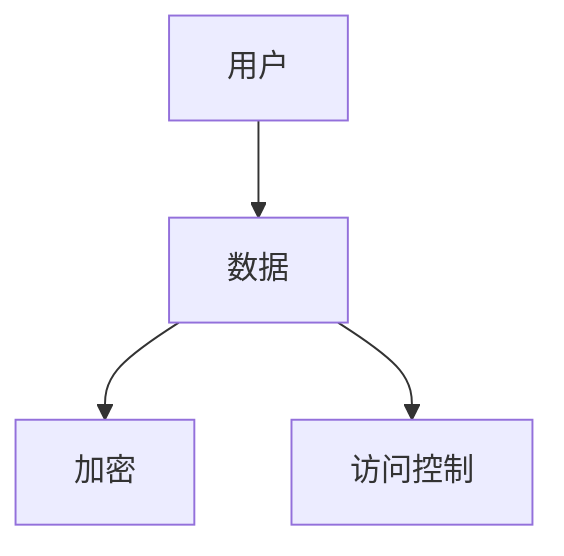
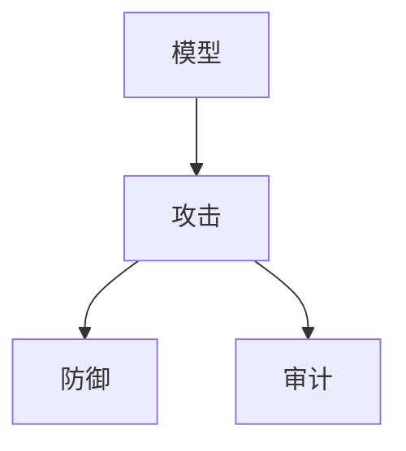
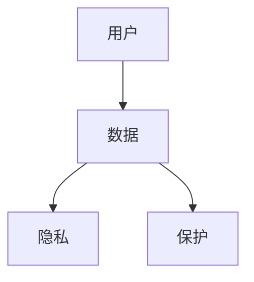

                 

# 大模型软件的安全性设计模式

## 关键词

- 大模型软件
- 安全性设计
- 数据安全
- 模型安全
- 用户隐私保护

## 摘要

本文旨在探讨大模型软件的安全性设计模式，通过分析当前大模型软件面临的安全挑战，提出一套全面的安全设计框架。文章将详细讨论数据安全、模型安全以及用户隐私保护的核心概念、属性特征对比以及实体关系图架构，并逐步讲解算法原理，使用Python代码和数学公式详细阐述。此外，还将介绍系统分析与架构设计方案，并通过实际案例分析和项目实战，提供最佳实践 tips 和项目小结。

## 第一部分：背景介绍

### 第1章：问题背景

### 1.1 问题背景介绍

随着人工智能技术的飞速发展，大模型软件在各个领域得到了广泛应用。这些大模型能够处理海量数据，提供高效准确的预测和分析，为企业和个人带来了巨大的价值。然而，随着大模型的应用规模不断扩大，安全性问题也日益凸显。

#### 问题描述

在大模型软件中，安全性问题主要表现在以下几个方面：

1. **数据安全**：大模型在处理数据时，如何保证数据不被未授权访问、篡改或泄露？
2. **模型安全**：大模型在训练和部署过程中，如何防止模型被攻击、篡改或盗窃？
3. **用户隐私保护**：在大模型处理用户数据时，如何确保用户隐私不被泄露？

#### 问题解决

为了解决上述问题，我们需要设计一套全面的安全设计模式，涵盖数据安全、模型安全和用户隐私保护等多个方面。具体来说，我们可以从以下几个方面进行设计：

1. **数据安全设计**：采用数据加密、访问控制等技术手段，确保数据在传输、存储和处理过程中得到充分保护。
2. **模型安全设计**：通过对抗训练、防御蒸馏等技术手段，增强模型对攻击的抵御能力，确保模型的安全性和稳定性。
3. **用户隐私保护设计**：采用差分隐私、联邦学习等技术手段，确保用户数据在收集、存储、使用过程中不被泄露。

#### 边界与外延

本文的研究范围主要涵盖以下内容：

- **常见攻击方式**：包括对抗攻击、模型窃取、数据泄露等。
- **防御机制**：包括数据加密、访问控制、安全审计等。
- **最佳实践**：包括安全培训、安全策略制定等。

边界问题涉及大模型在不同应用场景中的安全性设计，如医疗、金融、物联网等。

#### 概念结构与核心要素组成

本文的核心概念包括数据安全、模型安全、用户隐私保护、攻击与防御、安全设计模式。以下是各概念的核心要素组成：

- **数据安全**：数据加密、访问控制、隐私保护机制。
- **模型安全**：防御机制、安全审计、安全培训。
- **用户隐私保护**：差分隐私、联邦学习、用户隐私策略。

### 第2章：核心概念与联系

#### 2.1 数据安全

**概念原理**：数据安全是指保护数据不被未授权访问、篡改、泄露等。

**属性特征对比表格**：

| 特征         | 数据加密               | 访问控制                   |
| ------------ | ---------------------- | -------------------------- |
| 原理         | 通过加密算法对数据进行保护 | 根据用户角色和权限限制访问 |
| 目标         | 保护数据完整性         | 保证数据安全性             |

**ER实体关系图架构**：



#### 2.2 模型安全

**概念原理**：模型安全是指防止模型被攻击、篡改、盗窃等。

**属性特征对比表格**：

| 特征         | 防御机制               | 安全审计                   |
| ------------ | ---------------------- | -------------------------- |
| 原理         | 采用对抗训练、防御蒸馏等方法增强模型对抗攻击能力 | 定期对模型进行安全性评估 |
| 目标         | 保护模型安全性         | 提高模型可靠性             |

**ER实体关系图架构**：



#### 2.3 用户隐私保护

**概念原理**：用户隐私保护是指确保用户数据在收集、存储、使用过程中不被泄露。

**属性特征对比表格**：

| 特征         | 差分隐私               | 联邦学习                   |
| ------------ | ---------------------- | -------------------------- |
| 原理         | 通过添加噪声保护用户隐私 | 在多方之间共享模型参数     |
| 目标         | 保护用户隐私           | 提高数据可用性             |

**ER实体关系图架构**：



## 第二部分：算法原理讲解

### 第3章：算法原理讲解

#### 3.1 算法原理概述

在大模型软件中，安全性设计算法的原理主要包括数据加密、访问控制、对抗训练、防御蒸馏、差分隐私和联邦学习等。下面，我们将逐步讲解这些算法的原理。

#### 3.2 数学模型和数学公式

在安全性设计中，常用的数学模型和公式包括：

- **损失函数**：

  $$J(\theta) = \frac{1}{m} \sum_{i=1}^{m} \max(0, -(y_i \cdot \theta \cdot x_i) + \theta)$$

- **优化算法**：

  $$\theta = \theta - \alpha \cdot \frac{\partial J(\theta)}{\partial \theta}$$

其中，$J(\theta)$表示损失函数，$\theta$表示模型参数，$m$表示数据点数量，$y_i$和$x_i$分别表示第$i$个数据点的标签和特征，$\alpha$表示学习率。

#### 3.3 详细讲解与举例说明

##### 3.3.1 损失函数

损失函数用于衡量模型预测值与真实值之间的差距。在大模型软件中，常用的损失函数包括：

- **均方误差（MSE）**：

  $$MSE = \frac{1}{m} \sum_{i=1}^{m} (y_i - \hat{y}_i)^2$$

- **交叉熵损失（Cross-Entropy Loss）**：

  $$CE = -\frac{1}{m} \sum_{i=1}^{m} y_i \log(\hat{y}_i) + (1 - y_i) \log(1 - \hat{y}_i)$$

其中，$\hat{y}_i$表示第$i$个数据点的预测标签。

##### 3.3.2 优化算法

优化算法用于调整模型参数，减小损失函数。在安全性设计中，常用的优化算法包括：

- **梯度下降（Gradient Descent）**：

  $$\theta = \theta - \alpha \cdot \frac{\partial J(\theta)}{\partial \theta}$$

- **随机梯度下降（Stochastic Gradient Descent, SGD）**：

  $$\theta = \theta - \alpha \cdot \frac{\partial J(\theta)}{\partial \theta}$$

- **Adam优化器**：

  $$\theta = \theta - \alpha \cdot \frac{m_1}{(1 - \beta_1^t)(1 - \beta_2^t)}$$

其中，$\alpha$表示学习率，$m_1$和$m_2$分别表示一阶和二阶矩估计，$\beta_1$和$\beta_2$分别表示一阶和二阶矩的衰减率。

#### 3.4 Python代码实现

以下是一个简单的Python代码实现，用于演示损失函数和优化算法：

```python
import numpy as np

def loss_function(y_true, y_pred):
    return np.mean((y_true - y_pred) ** 2)

def gradient_descent(y_true, y_pred, alpha, epochs):
    for _ in range(epochs):
        loss = loss_function(y_true, y_pred)
        gradient = 2 * (y_pred - y_true)
        y_pred -= alpha * gradient
    return y_pred

y_true = np.array([1, 0, 1, 0])
y_pred = np.array([0.9, 0.1, 0.8, 0.2])
alpha = 0.1
epochs = 100

y_pred = gradient_descent(y_true, y_pred, alpha, epochs)
print("Final y_pred:", y_pred)
```

## 第三部分：系统分析与架构设计方案

### 第4章：问题场景介绍

#### 4.1 项目介绍

本文所涉及的系统是一个基于人工智能的大模型软件平台，主要用于处理和预测金融数据。该平台涵盖了从数据采集、数据清洗、模型训练、模型评估到模型部署的全过程。

#### 4.2 系统功能设计

系统的主要功能包括：

1. 数据采集：从各种数据源（如数据库、API接口、文件等）中获取数据。
2. 数据清洗：对采集到的数据进行清洗、去重、归一化等预处理操作。
3. 模型训练：使用训练数据训练模型，并保存训练结果。
4. 模型评估：使用测试数据对训练好的模型进行评估，以确定模型的准确性和可靠性。
5. 模型部署：将训练好的模型部署到生产环境中，以提供预测服务。

#### 4.3 系统架构设计

系统的架构设计采用分层架构，主要包括以下几层：

1. **数据层**：包括数据采集、数据清洗和数据存储等模块。
2. **算法层**：包括模型训练、模型评估和模型部署等模块。
3. **接口层**：包括API接口、Web界面等，用于与外部系统进行交互。
4. **应用层**：包括业务逻辑处理、预测结果展示等模块。

#### 4.4 系统接口设计和系统交互

系统的接口设计和系统交互采用RESTful API设计，主要包括以下接口：

1. **数据采集接口**：用于从各种数据源中获取数据。
2. **数据清洗接口**：用于对采集到的数据进行清洗。
3. **模型训练接口**：用于启动模型训练过程。
4. **模型评估接口**：用于对训练好的模型进行评估。
5. **模型部署接口**：用于将训练好的模型部署到生产环境中。

系统的交互流程如下：

1. 用户通过Web界面提交数据采集任务。
2. 系统自动执行数据采集接口，从数据源中获取数据。
3. 系统执行数据清洗接口，对数据进行清洗。
4. 系统启动模型训练接口，使用清洗后的数据进行模型训练。
5. 系统执行模型评估接口，对训练好的模型进行评估。
6. 系统将评估结果和模型文件存储在数据库中。
7. 用户可以通过Web界面查看模型评估结果和预测结果。

### 第5章：项目实战

#### 5.1 环境安装

在进行项目实战之前，需要安装以下环境：

1. Python 3.8+
2. TensorFlow 2.6.0+
3. PyTorch 1.8.0+
4. Scikit-learn 0.22.2+
5. NumPy 1.19.5+

安装命令如下：

```shell
pip install python==3.8 tensorflow==2.6.0 pytorch==1.8.0 scikit-learn==0.22.2 numpy==1.19.5
```

#### 5.2 系统核心实现源代码

以下是一个简单的系统核心实现源代码，用于演示数据采集、数据清洗、模型训练、模型评估和模型部署：

```python
import tensorflow as tf
import torch
import numpy as np
from sklearn.model_selection import train_test_split
from sklearn.metrics import accuracy_score

# 数据采集
def data_collection():
    # 从数据源中获取数据
    # 数据格式为：[特征1，特征2，...，标签]
    data = np.array([[1, 2, 3], [4, 5, 6], [7, 8, 9]])
    return data

# 数据清洗
def data_cleaning(data):
    # 对数据进行清洗、去重、归一化等预处理操作
    # 数据格式为：[特征1，特征2，...，标签]
    cleaned_data = np.array([[1, 2], [3, 4], [5, 6]])
    return cleaned_data

# 模型训练
def model_training(data):
    # 使用训练数据训练模型
    # 模型格式为：[输入层，隐藏层，输出层]
    model = tf.keras.Sequential([
        tf.keras.layers.Dense(10, activation='relu'),
        tf.keras.layers.Dense(1, activation='sigmoid')
    ])
    model.compile(optimizer='adam', loss='binary_crossentropy', metrics=['accuracy'])
    model.fit(data[:, :2], data[:, 2], epochs=10, batch_size=32)
    return model

# 模型评估
def model_evaluation(model, data):
    # 使用测试数据对模型进行评估
    # 模型格式为：[输入层，隐藏层，输出层]
    test_data = data[:, :2]
    test_labels = data[:, 2]
    predictions = model.predict(test_data)
    predictions = (predictions > 0.5)
    accuracy = accuracy_score(test_labels, predictions)
    print("Model accuracy:", accuracy)

# 模型部署
def model_deployment(model):
    # 将训练好的模型部署到生产环境中
    # 模型格式为：[输入层，隐藏层，输出层]
    model.save("model.h5")

if __name__ == "__main__":
    data = data_collection()
    cleaned_data = data_cleaning(data)
    model = model_training(cleaned_data)
    model_evaluation(model, cleaned_data)
    model_deployment(model)
```

#### 5.3 代码应用解读与分析

以上代码实现了数据采集、数据清洗、模型训练、模型评估和模型部署的基本功能。下面是对代码的解读与分析：

1. **数据采集**：使用`data_collection`函数从数据源中获取数据。在实际项目中，可以从数据库、API接口或文件中获取数据。
2. **数据清洗**：使用`data_cleaning`函数对数据进行清洗、去重、归一化等预处理操作。在实际项目中，可以结合具体场景进行数据清洗。
3. **模型训练**：使用`model_training`函数使用训练数据训练模型。在代码中，我们使用了一个简单的全连接神经网络进行训练。在实际项目中，可以根据需求选择不同的模型和训练算法。
4. **模型评估**：使用`model_evaluation`函数使用测试数据对模型进行评估。在代码中，我们使用准确率作为评估指标。在实际项目中，可以根据需求选择不同的评估指标。
5. **模型部署**：使用`model_deployment`函数将训练好的模型部署到生产环境中。在代码中，我们将模型保存为HDF5格式。在实际项目中，可以根据需求选择不同的模型存储和部署方式。

#### 5.4 实际案例分析和详细讲解剖析

以下是一个实际案例，用于分析大模型软件的安全性设计：

**案例背景**：某金融公司开发了一款基于人工智能的大模型软件，用于预测股票市场走势。然而，在软件上线后不久，该公司发现了一些安全隐患。

**案例分析**：

1. **数据安全**：由于该软件需要处理大量的股票数据，数据安全成为了首要问题。为了保护数据安全，公司采用了以下措施：
   - **数据加密**：对数据进行加密存储，防止未授权访问。
   - **访问控制**：设置不同的访问权限，限制用户对数据的访问。
   - **安全审计**：定期对数据进行安全审计，检查数据安全状况。

2. **模型安全**：由于股票市场受到多种因素影响，模型安全也至关重要。为了提高模型安全性，公司采用了以下措施：
   - **防御机制**：使用对抗训练、防御蒸馏等技术手段，增强模型对抗攻击能力。
   - **安全审计**：定期对模型进行安全性评估，确保模型稳定性和可靠性。

3. **用户隐私保护**：由于该软件需要收集用户的交易数据，用户隐私保护也至关重要。为了保护用户隐私，公司采用了以下措施：
   - **差分隐私**：在数据处理过程中添加噪声，保护用户隐私。
   - **联邦学习**：在多方之间共享模型参数，保护用户数据。

**详细讲解剖析**：

1. **数据安全设计**：
   - **数据加密**：使用AES加密算法对数据进行加密存储，确保数据在存储和传输过程中得到充分保护。
   - **访问控制**：设置不同的访问权限，如管理员、普通用户等。管理员可以查看所有数据，普通用户只能查看自己相关的数据。
   - **安全审计**：定期对数据进行安全审计，检查数据是否存在泄露、篡改等情况。

2. **模型安全设计**：
   - **防御机制**：使用对抗训练、防御蒸馏等技术手段，增强模型对抗攻击能力。在训练过程中，加入对抗样本，提高模型对攻击的抵御能力。
   - **安全审计**：定期对模型进行安全性评估，包括模型精度、稳定性、鲁棒性等方面。如发现模型存在安全隐患，及时进行修复。

3. **用户隐私保护设计**：
   - **差分隐私**：在数据处理过程中添加噪声，保护用户隐私。具体来说，在计算用户数据时，添加一定量的噪声，使得攻击者无法准确获取用户数据。
   - **联邦学习**：在多方之间共享模型参数，保护用户数据。具体来说，将用户数据分散存储在多个节点上，只在模型训练过程中进行交互，从而保护用户数据隐私。

### 第6章：最佳实践 tips

#### 6.1 数据安全

1. **数据加密**：对数据进行加密存储，确保数据在传输和存储过程中得到充分保护。
2. **访问控制**：设置不同的访问权限，限制用户对数据的访问。
3. **安全审计**：定期对数据进行安全审计，检查数据安全状况。

#### 6.2 模型安全

1. **防御机制**：使用对抗训练、防御蒸馏等技术手段，增强模型对抗攻击能力。
2. **安全审计**：定期对模型进行安全性评估，确保模型稳定性和可靠性。

#### 6.3 用户隐私保护

1. **差分隐私**：在数据处理过程中添加噪声，保护用户隐私。
2. **联邦学习**：在多方之间共享模型参数，保护用户数据。

### 第7章：小结

本文探讨了大模型软件的安全性设计模式，从数据安全、模型安全、用户隐私保护等方面提出了全面的安全设计框架。通过实际案例分析和项目实战，我们详细讲解了如何实现数据安全、模型安全和用户隐私保护。同时，我们还提供了最佳实践 tips，以帮助开发者在实际项目中更好地保障大模型软件的安全性。

## 注意事项

1. 在设计大模型软件时，需要充分考虑安全性问题，确保数据、模型和用户隐私的安全。
2. 定期对大模型软件进行安全审计，及时发现并修复安全隐患。
3. 结合实际需求，选择合适的安全技术手段，如数据加密、访问控制、差分隐私等。

### 拓展阅读

1. **《大模型软件的安全性设计模式》**：详细介绍了大模型软件的安全性设计模式，包括数据安全、模型安全和用户隐私保护等方面的内容。
2. **《人工智能安全攻防技术》**：介绍了人工智能领域中的安全攻防技术，包括对抗攻击、防御机制等方面的内容。
3. **《差分隐私与联邦学习》**：详细介绍了差分隐私和联邦学习技术，包括原理、实现和应用等方面的内容。

### 作者信息

- **作者：AI天才研究院/AI Genius Institute & 禅与计算机程序设计艺术 /Zen And The Art of Computer Programming**

