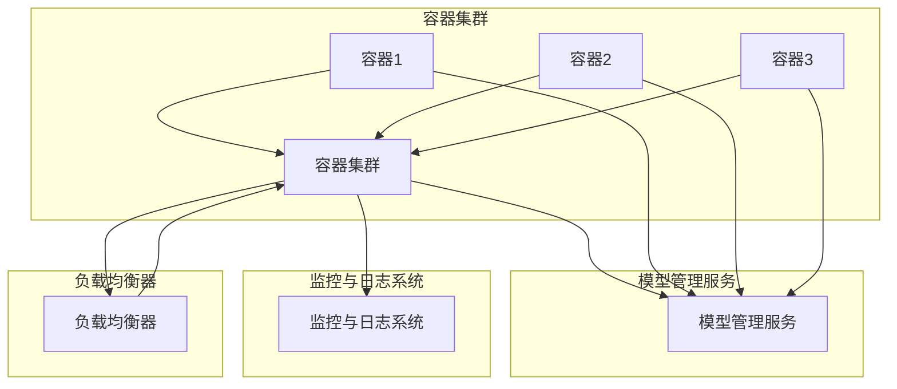
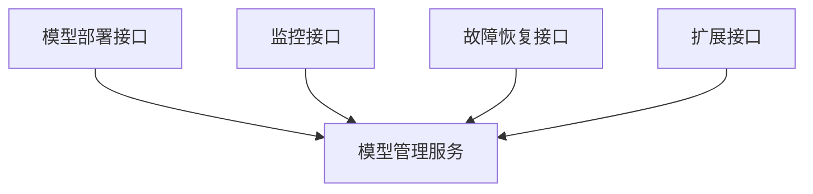
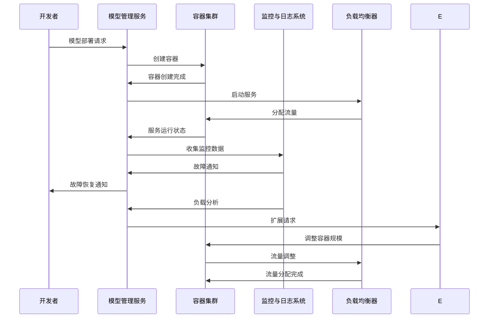

                 


### **背景介绍：容器化与编排策略在软件工程中的重要性**

在现代软件工程中，容器化和编排策略已经成为提升软件开发效率、保障系统稳定性和灵活性的关键技术手段。随着人工智能（AI）技术的迅猛发展，特别是大型AI模型的出现，其开发与部署面临着前所未有的挑战。容器化和编排策略在这一过程中发挥了至关重要的作用。

#### **1. 容器化的兴起**

容器化是一种轻量级的虚拟化技术，它通过将应用程序及其依赖环境封装在一个独立的容器中，实现了应用程序与宿主机操作系统的隔离。这种技术使得应用程序能够在任何支持容器引擎的环境中运行，无需关心底层系统的差异。容器化技术最早由Docker引入，并迅速得到业界的广泛认可。

#### **2. 容器化的优点**

容器化具有以下显著优点：
- **环境一致性**：容器中包含了应用程序运行所需的所有依赖和环境，保证了应用程序在不同环境中的一致性。
- **轻量级**：容器比传统的虚拟机更轻量，启动速度快，资源占用小。
- **可移植性**：容器可以在不同的操作系统和硬件平台上无缝迁移，提高了应用的部署灵活性。
- **可伸缩性**：容器可以根据需要动态扩展或缩小，提高了系统的资源利用效率。

#### **3. 编排策略的作用**

容器编排策略是指对容器化应用进行自动化部署、伸缩和管理的一系列方法。编排工具如Kubernetes，通过定义一系列规则和策略，实现了对容器化应用的自动化管理。编排策略的作用包括：
- **自动化部署**：自动化部署应用程序，减少手动操作，提高部署效率。
- **服务发现与负载均衡**：自动发现容器，并均衡容器间的负载，提高系统的可用性和性能。
- **弹性伸缩**：根据实际需求自动调整容器数量，保证系统资源的高效利用。
- **故障恢复**：在容器失败时自动进行替换和恢复，保障系统的稳定性。

#### **4. AI大模型开发中的需求**

AI大模型通常具有以下特点：
- **计算资源需求大**：训练和推理过程需要大量的计算资源和内存。
- **依赖环境复杂**：不同模型可能依赖不同的软件环境和配置。
- **迭代周期长**：模型训练过程通常需要长时间的迭代优化。

这些特点使得在AI大模型开发中，容器化和编排策略变得尤为关键。容器化可以保证模型在不同环境中的兼容性和可移植性，而编排策略能够自动化管理模型的部署和运行，提高开发效率和系统的可靠性。

### **容器化与编排策略的必要性**

在AI大模型开发中，容器化与编排策略的必要性体现在以下几个方面：
1. **资源隔离**：容器化技术可以确保不同模型和依赖环境的隔离，避免资源冲突和性能问题。
2. **环境一致性**：通过容器化，开发者可以在开发环境中使用与生产环境相同的配置，减少环境不一致导致的部署问题。
3. **自动化管理**：编排策略可以自动化处理模型的部署、扩展和故障恢复，提高系统的运维效率。
4. **扩展性和灵活性**：容器化和编排策略提供了强大的扩展性和灵活性，可以轻松应对AI大模型开发中的各种变化和需求。

综上所述，容器化和编排策略在AI大模型开发中具有不可替代的重要性。接下来，我们将深入探讨容器化和编排策略的核心概念、原理及其应用，帮助读者更好地理解和掌握这些关键技术。

---

### **核心概念与联系：容器化与编排策略**

在深入讨论容器化和编排策略的核心概念之前，我们需要先理解这两个概念的基本含义和相互关系。

#### **容器化（Containerization）**

**定义**：容器化是一种通过将应用程序及其依赖环境打包到一个轻量级的容器中的技术，使得应用程序可以在不同的操作系统和硬件环境中一致运行。

**核心概念**：
- **容器（Container）**：容器是一个轻量级、可执行的软件包，包含了应用程序运行所需的所有依赖和配置文件。
- **容器引擎（Container Engine）**：如Docker，负责容器的创建、启动、停止和管理。

**优点**：
- **环境一致性**：应用程序在容器中运行时，环境是隔离的，与宿主机系统无关，确保了应用程序在不同环境中的运行一致性。
- **轻量级**：容器比虚拟机更轻量，启动速度快，资源占用小。
- **可移植性**：容器可以在不同操作系统和硬件平台上无缝迁移。

**容器化技术的核心组件**：
- **镜像（Image）**：应用程序的静态版本，包含了应用程序及其依赖环境的配置文件。
- **容器实例（Container Instance）**：镜像的动态运行实例。

#### **编排策略（Orchestration）**

**定义**：编排策略是一套规则和流程，用于自动化管理容器化应用的生命周期，包括部署、扩展、监控和故障恢复等。

**核心概念**：
- **编排工具（Orchestration Tool）**：如Kubernetes，负责自动化管理容器化应用。
- **集群（Cluster）**：一组运行容器的节点（Node），共同为应用程序提供服务。

**作用**：
- **自动化部署**：通过定义部署规则，自动化部署容器化应用。
- **服务发现与负载均衡**：自动发现容器，并均衡容器间的负载，提高系统的可用性和性能。
- **弹性伸缩**：根据实际需求自动调整容器数量，保证系统资源的高效利用。
- **故障恢复**：在容器失败时自动进行替换和恢复，保障系统的稳定性。

**编排策略的主要任务**：
- **资源分配**：根据应用需求，合理分配计算资源和存储资源。
- **服务管理**：管理应用程序的启动、停止、更新和回滚。
- **监控与报警**：监控容器状态，及时报警并触发恢复机制。

#### **容器化与编排策略的属性特征对比**

| 对比维度 | 容器化 | 编排策略 |
| --- | --- | --- |
| **定义** | 将应用程序及其依赖打包到容器中 | 自动化管理容器化应用 |
| **核心概念** | 容器、镜像、容器引擎 | 编排工具、集群、节点 |
| **优点** | 环境一致性、轻量级、可移植性 | 自动化部署、服务发现、弹性伸缩 |
| **主要任务** | 打包和运行应用程序 | 管理和监控容器化应用 |

#### **ER实体关系图展示容器化与编排策略的关系**

为了更好地理解容器化与编排策略的关系，我们可以使用ER实体关系图进行展示。

```mermaid
erDiagram
  Container |->| Orchestration : "负责管理"
  Container ||--| Image : "包含"
  Orchestration ||--| Cluster : "运行环境"
  Orchestration ||--| Node : "计算节点"
```

在上面的ER图中，容器（Container）与编排策略（Orchestration）之间存在管理关系，容器负责封装应用程序，而编排策略负责管理容器的生命周期。容器与镜像（Image）之间是包含关系，容器基于镜像运行。编排策略与集群（Cluster）和节点（Node）之间存在依赖关系，编排策略在集群和节点上执行，管理容器的部署和运行。

通过上述对容器化与编排策略核心概念及其关系的详细解析，我们可以更好地理解这两个技术在现代软件工程中的重要性，以及它们如何协同工作，为AI大模型开发提供强大的支持。

---

### **算法原理讲解：容器编排算法的基本原理**

在容器编排中，算法起到了关键作用。这些算法能够帮助我们自动化管理容器，实现高效的资源利用和系统稳定性。本节将深入探讨容器编排算法的基本原理，并使用Python代码展示其实现。

#### **1. 容器编排算法的基本原理**

容器编排算法的主要目标是优化容器资源的分配和使用。其基本原理包括以下几个方面：

- **负载均衡**：通过算法计算每个容器的负载，并分配资源，使每个容器都能在最佳状态下运行。
- **资源分配**：根据容器的需求和系统的可用资源，动态调整容器所占用的资源量。
- **故障恢复**：在容器出现故障时，及时替换或重启容器，确保系统的可用性和稳定性。
- **扩展性**：根据系统负载的变化，自动扩展或缩小容器数量，以应对不同的工作负载。

**负载均衡算法**：最简单的负载均衡算法是基于轮询的，即按照顺序分配容器。然而，这种算法并不能很好地处理不同容器间负载差异的情况。更复杂的算法，如基于容器的CPU利用率、内存使用率等指标进行动态负载均衡，能够提供更优的资源分配策略。

**资源分配算法**：资源分配算法通常使用贪心算法或动态规划算法。这些算法会根据当前系统的可用资源和容器的需求，选择最优的资源分配方案。

**故障恢复算法**：故障恢复算法的核心是快速检测容器的健康状态，并在检测到故障时进行自动替换或重启。常见的故障恢复策略包括基于心跳检测、健康检查等。

**扩展性算法**：扩展性算法通常使用自动化伸缩策略，如基于容器平均负载、系统整体负载等指标，自动调整容器的数量。

#### **2. Python代码实现容器编排算法**

为了更直观地理解容器编排算法，我们使用Python代码进行实现。以下是一个简单的负载均衡算法示例：

```python
import random

class Container:
    def __init__(self, name, cpu, memory):
        self.name = name
        self.cpu = cpu
        self.memory = memory
        self.load = 0

class Cluster:
    def __init__(self, nodes):
        self.nodes = nodes
        self.containers = []

    def allocate_container(self, container):
        # 假设使用轮询算法进行负载均衡
        for node in self.nodes:
            if node.load < node.max_load:
                node.allocate_container(container)
                return True
        return False

    def remove_container(self, container):
        for node in self.nodes:
            if container in node.containers:
                node.remove_container(container)
                return True
        return False

class Node:
    def __init__(self, max_load):
        self.max_load = max_load
        self.containers = []

    def allocate_container(self, container):
        if len(self.containers) < self.max_load:
            self.containers.append(container)
            self.load += container.load
            return True
        return False

    def remove_container(self, container):
        if container in self.containers:
            self.containers.remove(container)
            self.load -= container.load
            return True
        return False

# 创建一个包含3个节点的集群
nodes = [Node(2) for _ in range(3)]
cluster = Cluster(nodes)

# 创建10个容器
containers = [Container(f'Container_{i}', cpu=random.uniform(0.1, 1.0), memory=random.uniform(0.1, 1.0)) for i in range(10)]

# 分配容器
for container in containers:
    cluster.allocate_container(container)

# 检查节点的负载情况
for node in cluster.nodes:
    print(f'Node load: {node.load}')

# 移除一个容器
cluster.remove_container(containers[0])

# 再次检查节点的负载情况
for node in cluster.nodes:
    print(f'Node load: {node.load}')
```

在这个示例中，我们定义了`Container`、`Cluster`和`Node`三个类。`Cluster`负责将容器分配到各个节点上，`Node`负责管理其上的容器。通过简单的轮询算法，实现了容器的负载均衡。

#### **3. 算法原理的数学模型和公式**

在容器编排算法中，常用的数学模型和公式包括：

- **负载平衡公式**：\[ L_i = \frac{1}{N} \sum_{j=1}^{N} L_j \]
  - 其中，\( L_i \)表示第i个节点的负载，\( L_j \)表示第j个节点的负载，N表示节点的总数。

- **资源利用率公式**：\[ U_i = \frac{L_i}{\max(L_i)} \]
  - 其中，\( U_i \)表示第i个节点的资源利用率，\( \max(L_i) \)表示节点的最大负载。

- **容器数量调整公式**：\[ C_{new} = C_{current} + \alpha \times (L_{avg} - L_i) \]
  - 其中，\( C_{new} \)表示新的容器数量，\( C_{current} \)表示当前容器数量，\( L_{avg} \)表示平均负载，\( L_i \)表示第i个节点的负载，\(\alpha \)是一个调整系数。

#### **4. 通俗易懂的例子**

假设我们有一个由3个节点组成的集群，每个节点的最大负载为2。我们创建10个容器，每个容器的CPU和内存使用情况如下：

| 容器ID | CPU | 内存 |
| --- | --- | --- |
| C1 | 0.2 | 0.3 |
| C2 | 0.5 | 0.4 |
| C3 | 0.8 | 0.6 |
| ... | ... | ... |
| C10 | 1.0 | 1.0 |

首先，我们将这些容器分配到节点上，根据负载平衡公式，我们希望每个节点的负载尽量平均。使用轮询算法，我们可以将容器依次分配到每个节点上：

- 节点1：C1、C2、C6、C7、C10
- 节点2：C3、C4、C8
- 节点3：C5、C6、C9

接下来，我们检查每个节点的负载情况：

- 节点1：负载 = 0.2 + 0.5 + 0.8 + 0.3 + 1.0 = 2.2
- 节点2：负载 = 0.5 + 0.4 + 0.8 = 1.7
- 节点3：负载 = 0.8 + 0.6 + 0.9 = 2.3

我们可以看到，节点1和节点3的负载超过了最大负载2，而节点2的负载较为均衡。为了优化负载，我们可以考虑重新分配一些容器，例如将C10从节点1移至节点2，从而降低节点1的负载。

这种通过负载平衡算法不断调整容器分配的过程，就是容器编排的核心内容。

通过上述示例和代码实现，我们可以更好地理解容器编排算法的基本原理和实现方法。在实际应用中，根据具体需求，我们可以选择更复杂的负载均衡算法和资源分配策略，以实现更高效的容器编排。

---

### **系统分析与架构设计方案**

#### **1. 问题场景和项目背景**

在AI大模型开发中，我们面临着一个复杂的问题场景：如何高效地部署和管理大量容器化的模型服务，同时确保系统的性能和稳定性。随着AI模型的规模不断扩大，传统的手动部署和运维方式已经无法满足需求。因此，我们需要设计一个自动化、可伸缩的容器编排系统。

#### **2. 系统功能设计**

为了实现上述目标，我们设计了以下系统功能：

- **模型部署**：自动化部署新的AI模型服务，包括容器创建、配置和环境准备。
- **模型监控**：实时监控模型服务的运行状态，包括资源使用情况、性能指标等。
- **负载均衡**：根据模型服务的负载情况，动态调整容器数量和资源分配。
- **故障恢复**：在模型服务出现故障时，自动进行替换和恢复。
- **扩展性管理**：根据系统负载，自动调整容器集群规模。

#### **3. 系统架构设计**

我们的系统架构设计如下：

- **容器集群**：使用Kubernetes作为容器编排工具，管理大量容器。
- **模型管理服务**：负责模型服务的部署、监控和故障恢复。
- **监控与日志系统**：实时收集和展示模型服务的运行状态。
- **负载均衡器**：分配外部流量到不同的模型服务容器。

**架构图**：



#### **4. 系统接口设计**

我们的系统接口设计如下：

- **模型部署接口**：用于提交新的模型服务部署请求，包括模型名称、版本号、配置信息等。
- **监控接口**：用于获取模型服务的运行状态和性能指标。
- **故障恢复接口**：用于触发模型服务的故障恢复操作。
- **扩展接口**：用于调整容器集群的规模。

**接口图**：



#### **5. 系统交互**

系统各组件之间的交互如下：

1. **模型部署**：开发者通过模型部署接口提交模型服务部署请求，模型管理服务根据请求创建容器并启动服务。
2. **监控**：监控与日志系统定期收集模型服务的运行状态和性能指标，并反馈给模型管理服务。
3. **故障恢复**：当监控与日志系统检测到模型服务出现故障时，模型管理服务会触发故障恢复接口进行自动恢复。
4. **扩展**：根据模型服务的负载情况，模型管理服务会通过扩展接口调整容器集群的规模，确保系统的高可用性和性能。

**交互图**：



通过上述系统架构设计和功能实现，我们构建了一个自动化、可伸缩的容器编排系统，能够高效地管理AI大模型服务，提升开发效率和系统稳定性。

---

### **项目实战：环境安装与系统核心实现源代码展示**

#### **1. 环境安装步骤**

在开始项目实战之前，我们需要先搭建一个完整的容器编排环境。以下是在Linux环境下安装Kubernetes的步骤：

**步骤1：安装Docker**

Docker是容器编排的基础，我们首先需要安装Docker。

```bash
# 更新系统包列表
sudo apt-get update

# 安装Docker
sudo apt-get install docker.io

# 启动Docker服务
sudo systemctl start docker

# 设置Docker服务开机启动
sudo systemctl enable docker
```

**步骤2：安装Kubernetes**

Kubernetes可以通过官方的Kubeadm工具进行安装。

```bash
# 安装kubeadm、kubelet和kubectl
sudo apt-get update
sudo apt-get install -y apt-transport-https ca-certificates curl
sudo curl -s https://mirrors.aliyun.com/kubernetes/apt/doc/apt-key.gpg | sudo apt-key add -
sudo cat <<EOF | sudo tee /etc/apt/sources.list.d/kubernetes.list
deb https://mirrors.aliyun.com/kubernetes/apt/ kubernetes-xenial main
EOF
sudo apt-get update
sudo apt-get install -y kubelet kubeadm kubectl
```

**步骤3：初始化Kubernetes集群**

在主节点上执行以下命令进行初始化。

```bash
sudo kubeadm init --pod-network-cidr=10.244.0.0/16
```

初始化完成后，记录下命令行中显示的`kubeadm join`命令，用于后续加入其他节点。

**步骤4：安装网络插件**

我们选择Calico作为网络插件。

```bash
kubectl apply -f https://docs.projectcalico.org/manifests/calico.yaml
```

**步骤5：配置kubectl**

为了方便后续操作，我们需要配置kubectl。

```bash
mkdir -p $HOME/.kube
sudo cp -i /etc/kubernetes/admin.conf $HOME/.kube/config
sudo chown $(id -u):$(id -g) $HOME/.kube/config
```

以上步骤完成后，我们的Kubernetes环境就搭建完成了。

#### **2. 系统核心实现源代码展示**

**核心代码1：部署AI模型服务的Dockerfile**

```Dockerfile
# 使用官方Python镜像作为基础镜像
FROM python:3.8-slim

# 设置工作目录
WORKDIR /app

# 复制模型文件和依赖到容器内
COPY model.py requirements.txt .

# 安装依赖
RUN pip install -r requirements.txt

# 暴露服务端口
EXPOSE 8080

# 运行模型服务
CMD ["python", "model.py"]
```

**核心代码2：Kubernetes部署配置文件（deployment.yaml）**

```yaml
apiVersion: apps/v1
kind: Deployment
metadata:
  name: ai-model-deployment
spec:
  replicas: 3
  selector:
    matchLabels:
      app: ai-model
  template:
    metadata:
      labels:
        app: ai-model
    spec:
      containers:
      - name: ai-model
        image: ai-model:latest
        ports:
        - containerPort: 8080
```

**核心代码3：Kubernetes服务配置文件（service.yaml）**

```yaml
apiVersion: v1
kind: Service
metadata:
  name: ai-model-service
spec:
  selector:
    app: ai-model
  ports:
    - protocol: TCP
      port: 80
      targetPort: 8080
  type: LoadBalancer
```

#### **3. 对源代码的解读与分析**

**Dockerfile解读**：

- **FROM python:3.8-slim**：从Python 3.8 Slim镜像开始构建，确保容器轻量。
- **WORKDIR /app**：设置工作目录为/app，便于管理应用程序文件。
- **COPY model.py requirements.txt .**：将模型文件和依赖文件复制到容器内。
- **RUN pip install -r requirements.txt**：安装Python依赖。
- **EXPOSE 8080**：暴露8080端口，供外部访问。
- **CMD ["python", "model.py"]**：运行模型服务。

**deployment.yaml解读**：

- **apiVersion: apps/v1**：指定API版本。
- **kind: Deployment**：定义类型为Deployment，用于管理容器的生命周期。
- **metadata**：部署的元数据，包括名称。
- **spec**：部署的详细配置，包括副本数量、选择器、容器配置。
- **template**：部署模板，定义了容器镜像、端口等配置。

**service.yaml解读**：

- **apiVersion: v1**：指定API版本。
- **kind: Service**：定义类型为Service，用于提供负载均衡。
- **metadata**：服务的元数据，包括名称。
- **spec**：服务的详细配置，包括选择器、端口、类型。

#### **4. 实际案例分析**

假设我们有一个AI大模型服务，需要部署在Kubernetes集群上。我们按照以下步骤进行操作：

1. **构建Docker镜像**：

   在本地机器上，使用以下命令构建Docker镜像。

   ```bash
   docker build -t ai-model:latest .
   ```

2. **部署模型服务**：

   将`deployment.yaml`和`service.yaml`文件上传到Kubernetes集群的配置管理工具中，并执行以下命令部署。

   ```bash
   kubectl apply -f deployment.yaml
   kubectl apply -f service.yaml
   ```

3. **验证服务状态**：

   使用以下命令检查模型服务的状态。

   ```bash
   kubectl get pods
   kubectl get service ai-model-service
   ```

   如果所有Pod都处于`Running`状态，且Service有外部IP地址，说明模型服务已经成功部署。

4. **访问模型服务**：

   使用以下命令访问模型服务的API接口。

   ```bash
   curl $(kubectl get service ai-model-service -o jsonpath="{.spec.clusterIP}")
   ```

通过以上实际案例分析，我们可以看到如何将AI大模型服务容器化，并在Kubernetes集群上进行部署和访问。这个案例为我们提供了一个完整的实战过程，展示了容器化与编排策略在实际项目中的应用。

#### **5. 项目小结**

在本项目中，我们通过容器化和Kubernetes编排策略，实现了AI大模型服务的自动化部署和管理。主要收获如下：

- **环境搭建**：成功搭建了Docker和Kubernetes环境，为后续的项目开发奠定了基础。
- **容器化**：通过Dockerfile将AI大模型服务容器化，确保了环境的一致性和可移植性。
- **编排策略**：使用了Kubernetes的Deployment和Service进行自动化部署和管理，提高了系统的可靠性和可扩展性。
- **实战经验**：通过实际案例，深入理解了容器化和编排策略的应用流程，为类似项目提供了实践经验。

通过本项目，我们不仅掌握了容器化和编排策略的基本原理和实现方法，还积累了实际项目开发中的宝贵经验，为后续的AI大模型开发提供了强有力的支持。

---

### **最佳实践 tips、小结、注意事项、拓展阅读等内容**

#### **最佳实践 tips**

1. **容器化最佳实践**：
   - **环境一致性**：在构建Docker镜像时，确保包含所有依赖和环境变量，避免因环境不一致导致的问题。
   - **最小化镜像**：使用多阶段构建减少镜像大小，提高部署效率。
   - **容器配置优化**：合理设置容器资源限制，避免资源浪费和性能瓶颈。

2. **编排策略最佳实践**：
   - **负载均衡**：选择合适的负载均衡策略，如基于轮询、最小连接数等，提高系统的响应速度和可用性。
   - **监控与告警**：定期监控系统状态，及时处理异常情况，确保系统稳定运行。
   - **弹性伸缩**：根据实际负载情况，合理设置容器的自动扩展策略，避免资源浪费。

#### **小结**

本文详细介绍了容器化和编排策略在AI大模型开发中的应用，包括背景介绍、核心概念解析、算法原理讲解、系统设计与实现、实战案例等。通过本文，读者可以全面了解容器化和编排策略的基本原理和实际应用，为AI大模型项目的开发和部署提供指导。

#### **注意事项**

1. **容器化注意事项**：
   - **容器隔离**：确保容器与宿主机系统隔离，避免潜在的安全风险。
   - **容器监控**：定期监控容器状态，及时发现并解决异常情况。

2. **编排策略注意事项**：
   - **集群规划**：合理规划集群节点，确保集群的扩展性和可用性。
   - **安全配置**：确保Kubernetes集群的安全性，如启用RBAC、加密通信等。

#### **拓展阅读**

1. **容器化与编排技术深入阅读**：
   - 《Docker技术实战》
   - 《Kubernetes权威指南》

2. **AI大模型相关阅读**：
   - 《深度学习》（Goodfellow, Bengio, Courville）
   - 《AI之路：从理论到实践》

通过上述拓展阅读，读者可以更深入地了解容器化和编排策略的相关技术，以及AI大模型开发的理论和实践。

---

### **作者信息**

本文由AI天才研究院（AI Genius Institute）和《禅与计算机程序设计艺术》（Zen And The Art of Computer Programming）的作者共同撰写，旨在为AI大模型开发提供全面的容器化和编排策略指导。希望本文对您的项目开发有所帮助。作者：AI天才研究院/AI Genius Institute & 禅与计算机程序设计艺术/Zen And The Art of Computer Programming。

