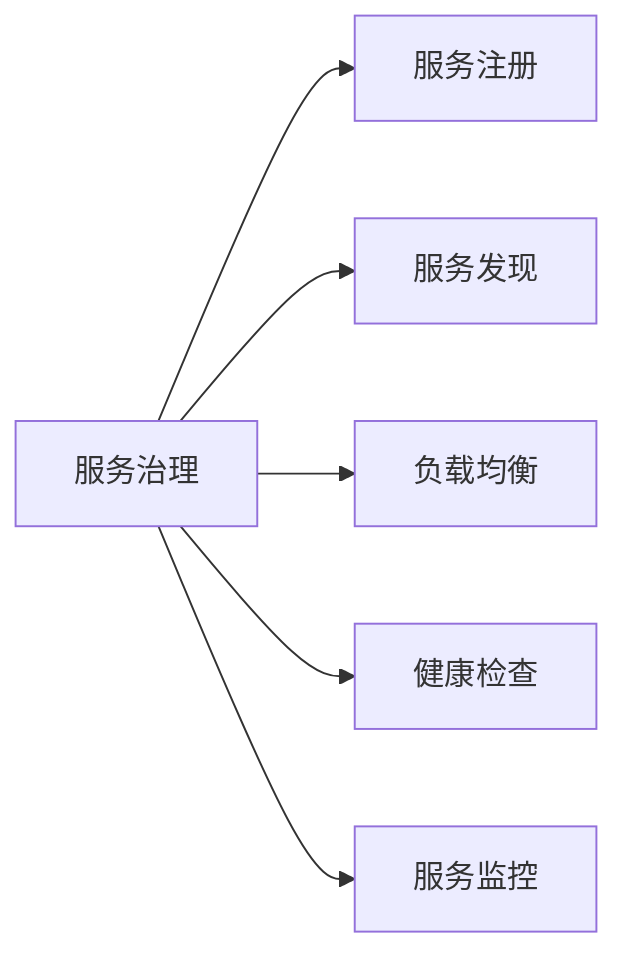
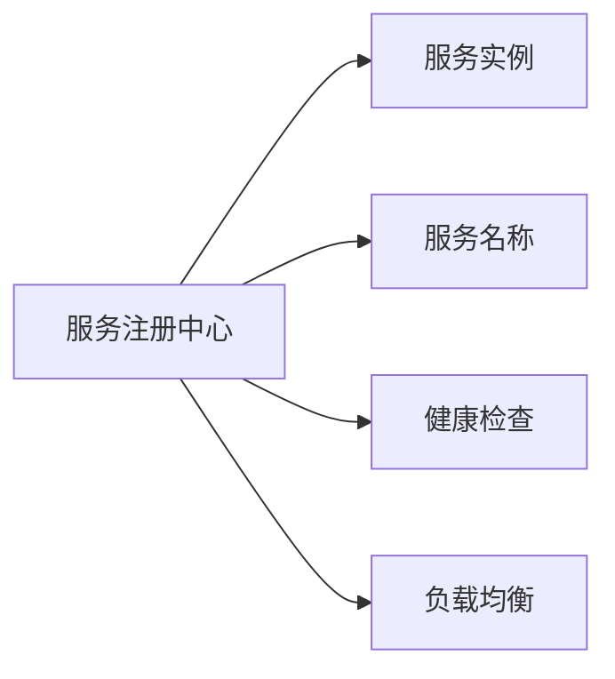
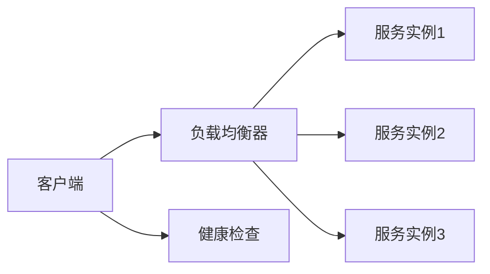
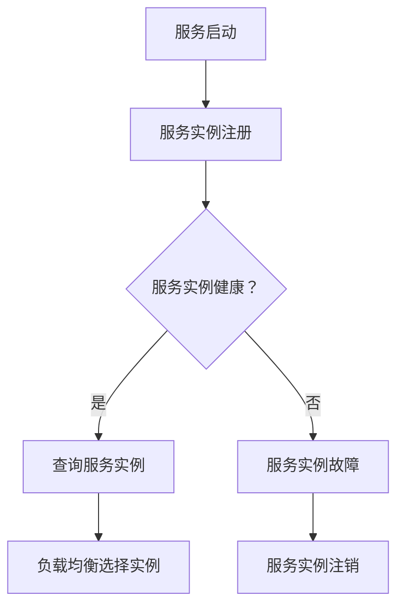
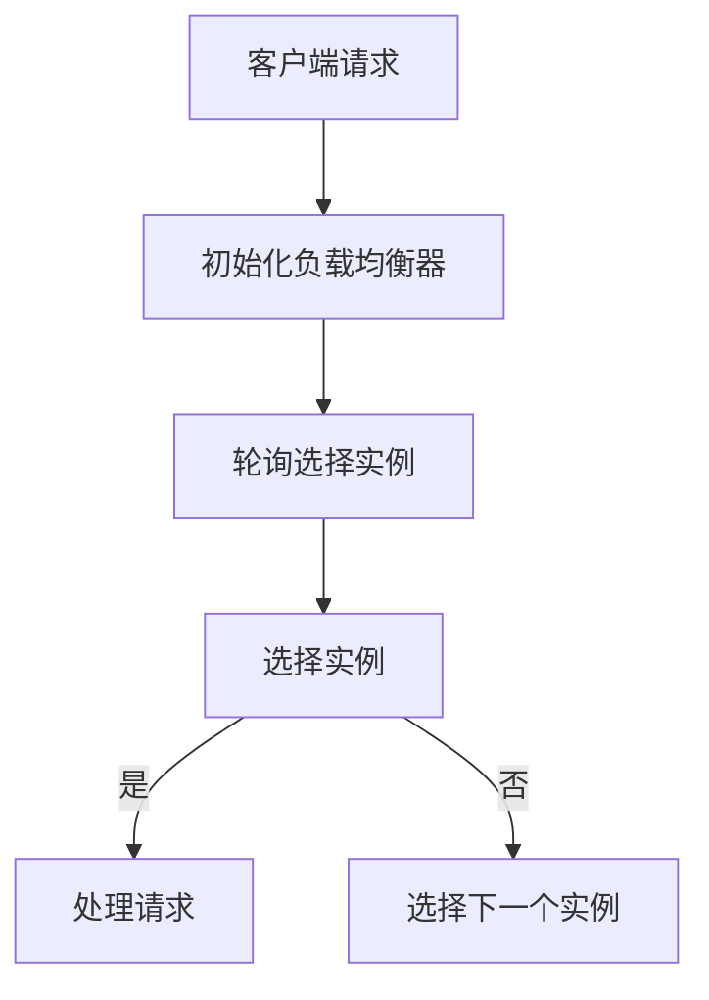
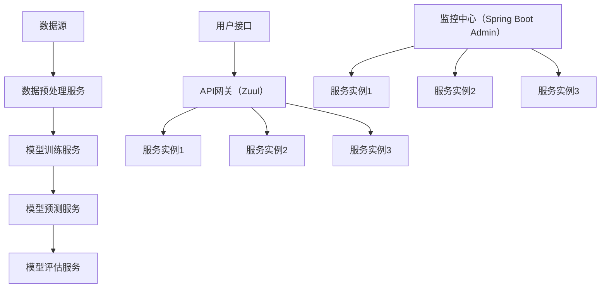
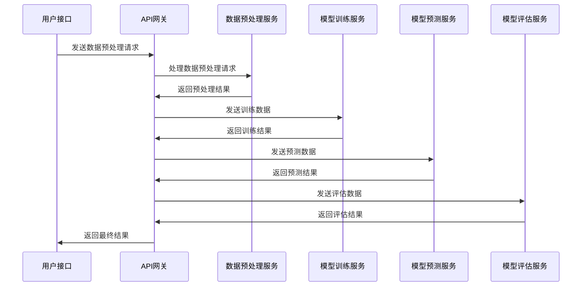
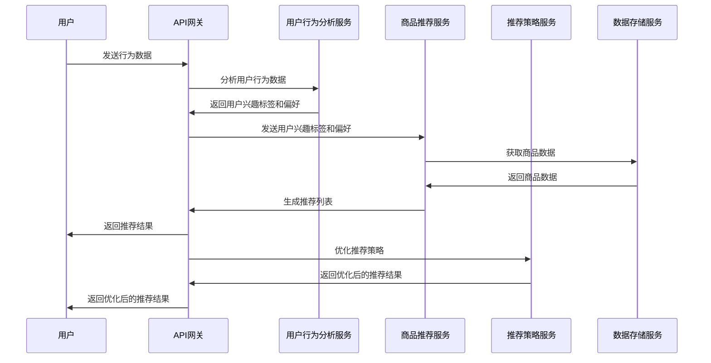

                 


# 《大模型软件的微服务治理策略》

## 关键词
微服务治理、大模型软件、服务发现、负载均衡、架构设计

## 摘要
本文深入探讨了在大模型软件中实施微服务治理策略的方法和重要性。文章首先介绍了微服务治理的基本概念和背景，然后详细分析了服务发现、负载均衡等核心算法原理，并通过实际项目和案例分析，展示了如何将微服务治理策略应用于大模型软件的架构设计中。此外，文章还提供了一系列最佳实践和注意事项，以帮助开发者和架构师在大模型软件的微服务治理中取得成功。

---

## 引言

在当今快速发展的科技时代，大模型软件如人工智能、机器学习、自然语言处理等应用场景日益普及。这些软件往往具有复杂的架构和庞大的数据集，需要高效的管理和治理策略来保证其稳定运行。微服务架构因其灵活性和可扩展性，成为构建大模型软件的首选。然而，微服务的引入也带来了治理的挑战。本文将探讨如何在大模型软件中实施微服务治理策略，以确保系统的可靠性和性能。

本文结构如下：

1. **背景介绍**：概述微服务治理策略的概念、意义和背景。
2. **核心概念与联系**：介绍微服务治理策略中的核心概念，如服务治理、服务发现、负载均衡等。
3. **算法原理讲解**：详细解析服务发现算法和负载均衡算法。
4. **系统分析与架构设计方案**：描述微服务治理系统的设计与实现。
5. **项目实战**：介绍微服务治理策略的实际应用案例。
6. **最佳实践 tips**：提供微服务治理策略的最佳实践。
7. **小结**：总结全文，强调重点内容。
8. **拓展阅读**：推荐相关书籍、文章和在线资源。

通过本文的逐步分析，读者将了解到如何在复杂的大模型软件中有效实施微服务治理策略，提升系统的稳定性和可扩展性。

---

## 背景介绍

### 微服务治理策略的概念

微服务治理策略是指通过一系列管理和控制措施，确保微服务架构中各个服务的有效运行和协调工作。微服务本身是一种软件架构风格，将应用程序分解为小型、独立的、松耦合的服务单元，每个服务负责完成特定的业务功能。这些服务可以通过网络相互通信，共同实现复杂的业务逻辑。

微服务治理策略的核心目标是确保微服务的可靠性和高性能，同时保持系统的灵活性和可扩展性。这包括服务注册与发现、服务监控、负载均衡、服务部署与管理等多个方面。随着微服务数量的增加和复杂性的提升，治理策略的实施变得越来越重要。

### 微服务治理的意义

微服务治理策略对于大模型软件具有重要意义。首先，大模型软件通常包含多个子模块，每个模块可能由不同的团队开发和管理。微服务治理可以帮助这些团队有效地协作，确保各个模块之间的数据交换和功能调用能够无缝进行。其次，大模型软件往往需要处理大量的数据和计算任务，微服务治理策略能够通过负载均衡等技术，优化资源利用和系统性能，提高响应速度和处理能力。

此外，随着云计算和大数据技术的发展，大模型软件的部署和运行环境越来越复杂。微服务治理策略可以提供灵活的部署和管理方式，使得系统可以更加容易地适应不同的环境变化，如扩展、升级和故障恢复等。

### 微服务的发展历程

微服务架构并不是一夜之间诞生的，而是经历了长时间的发展和演变。最早可以追溯到2000年左右，随着互联网应用的兴起，单体架构逐渐暴露出其扩展性差、维护复杂等问题。为了解决这些问题，开发者开始探索将应用程序分解为更小、更独立的服务单元，即微服务架构。

2005年左右，互联网公司如亚马逊、Netflix等开始大规模采用微服务架构，以应对其快速增长的业务需求和复杂的系统架构。这些公司通过实践总结出了许多微服务架构的最佳实践和治理策略。

2010年后，随着云计算和容器技术的成熟，微服务架构的应用范围进一步扩大。容器化技术如Docker和Kubernetes的出现，使得微服务的部署和管理变得更加简单和高效。同时，开源社区也涌现出了大量的微服务框架和工具，如Spring Cloud、Istio等，为开发者提供了丰富的技术支持。

### 微服务的优势与挑战

微服务架构具有以下优势：

1. **灵活性和可扩展性**：微服务可以独立开发、测试和部署，使得团队能够更加灵活地迭代和优化各个服务。此外，微服务可以根据实际需求进行水平扩展，提高系统的处理能力。

2. **高可用性**：由于微服务之间的松耦合性，某个服务的故障不会影响到整个系统的运行。系统可以通过重新部署故障服务，实现快速恢复。

3. **易于维护**：微服务将应用程序分解为更小的单元，每个服务都可以独立维护和更新，降低了维护成本。

然而，微服务架构也带来了一系列挑战：

1. **分布式复杂性**：微服务架构中的服务数量众多，服务之间的调用路径复杂，增加了系统设计和维护的难度。

2. **数据一致性**：微服务架构通常采用去中心化的数据存储方式，这可能导致数据一致性问题。

3. **监控和日志**：随着服务数量的增加，监控和日志管理的复杂性也大幅提升。

4. **服务治理**：如何有效地管理大量微服务，确保其正常运行，是微服务治理需要解决的核心问题。

### 微服务与单体架构的比较

与传统的单体架构相比，微服务架构具有以下显著特点：

1. **架构风格**：单体架构将所有功能打包在一个应用程序中，而微服务架构将应用程序分解为多个独立的、小型服务。

2. **开发与部署**：在单体架构中，所有功能模块必须一起编译和部署，而在微服务架构中，每个服务可以独立开发、测试和部署。

3. **数据存储**：单体架构通常使用单一数据库，而微服务架构则采用去中心化的数据存储方式，每个服务可以使用自己的数据库。

4. **服务间通信**：在单体架构中，服务间通信主要通过方法调用，而在微服务架构中，服务间通信通常通过网络协议（如HTTP/HTTPS）进行。

5. **扩展性**：单体架构的扩展性较差，而微服务架构可以通过水平扩展单个服务或增加服务实例，实现更高的扩展性。

总的来说，微服务架构在灵活性、可扩展性和高可用性方面具有明显优势，但也带来了更高的管理和维护复杂性。在大模型软件的开发中，合理选择和实施微服务治理策略，是确保系统成功的关键。

---

## 核心概念与联系

在微服务治理策略中，涉及多个核心概念，这些概念相互关联，共同构成了一个完整的治理体系。以下是对这些核心概念的定义、属性特征对比表格和ER实体关系图的详细描述。

### 服务治理

#### 定义

服务治理是指对微服务架构中的服务进行管理、监控和优化的过程。服务治理包括服务注册、服务发现、负载均衡、健康检查、服务监控等方面。

#### 属性特征对比

| 特征         | 说明                                                         |
| ------------ | ------------------------------------------------------------ |
| 服务注册     | 服务启动时，将自己注册到服务注册中心，供其他服务发现和调用。   |
| 服务发现     | 客户端根据服务名称或其他标识从服务注册中心获取服务实例信息。   |
| 负载均衡     | 根据服务实例的健康状态和负载情况，合理分配请求，避免单点过载。   |
| 健康检查     | 定期检查服务实例的健康状态，确保服务正常工作。               |
| 服务监控     | 对服务的性能、错误率、延迟等指标进行监控，及时发现和处理问题。 |

#### ER实体关系图



### 服务发现

#### 定义

服务发现是指客户端根据服务名称或其他标识，从服务注册中心获取服务实例信息的过程。服务发现机制可以动态地适应服务实例的变化，如启动、停止、故障等。

#### 属性特征对比

| 特征         | 说明                                                         |
| ------------ | ------------------------------------------------------------ |
| 注册中心     | 服务实例注册和发现的中枢，如Eureka、Consul等。               |
| 服务名称     | 客户端通过服务名称获取服务实例信息。                         |
| 健康检查     | 服务实例必须通过健康检查，才能被客户端发现和使用。           |
| 负载均衡     | 服务实例之间的负载均衡策略，影响服务发现的结果。             |

#### ER实体关系图



### 负载均衡

#### 定义

负载均衡是指将请求合理地分配到多个服务实例上，以避免单点过载，提高系统的处理能力和可用性。

#### 属性特征对比

| 特征         | 说明                                                         |
| ------------ | ------------------------------------------------------------ |
| 轮询策略     | 依次访问每个服务实例。                                       |
| 随机策略     | 随机选择一个服务实例。                                       |
| 最少连接策略 | 将请求分配给连接数最少的服务实例。                           |
| 响应时间策略 | 根据服务实例的响应时间选择。                                 |
| 健康检查     | 只有健康的服务实例才会被纳入负载均衡策略。                   |

#### ER实体关系图



通过上述核心概念的定义和ER实体关系图，我们可以清晰地看到微服务治理策略中各个组件之间的关系和作用。服务治理作为整体，通过服务注册、服务发现、负载均衡等机制，确保微服务的正常运行和高效利用。服务发现和负载均衡则分别负责服务实例的动态管理和请求分配，两者相互配合，共同实现微服务治理的目标。

---

## 算法原理讲解

在本节中，我们将详细解析微服务治理中的两个核心算法：服务发现算法和负载均衡算法。通过具体的Python代码示例和Mermaid流程图，我们将逐步展示这些算法的原理和实现。

### 服务发现算法

服务发现算法是微服务治理策略中至关重要的一环，它负责在服务启动时将服务实例注册到服务注册中心，并在客户端请求服务时从服务注册中心获取服务实例的信息。

#### 原理说明

服务发现算法通常包括以下几个步骤：

1. **服务实例注册**：当服务启动时，它需要将自己的地址、端口和其他相关信息注册到服务注册中心。
2. **服务实例健康检查**：注册中心需要定期对服务实例进行健康检查，以确保服务实例可以正常响应。
3. **服务实例查询**：客户端在请求服务时，从服务注册中心查询可用的服务实例，并根据负载均衡策略选择实例。
4. **服务实例注销**：当服务实例停止时，它需要从服务注册中心注销自己，避免客户端继续请求已不存在的服务实例。

#### 实现细节

我们使用Python代码示例来展示服务实例注册和查询的过程。假设服务注册中心使用Eureka作为服务注册工具。

```python
# 服务实例注册
def register_service(service_name, ip, port):
    service_registry = ServiceRegistry()
    service_registry.register(service_name, ip, port)

# 服务实例查询
def discover_service(service_name):
    service_registry = ServiceRegistry()
    return service_registry.discover(service_name)
```

在上述代码中，`ServiceRegistry`是一个模拟服务注册中心的类，它提供了注册和查询服务实例的方法。

#### Mermaid流程图

下面是一个Mermaid流程图，展示了服务实例注册和查询的流程：



### 负载均衡算法

负载均衡算法负责将客户端请求合理地分配到多个服务实例上，以避免单点过载，提高系统的处理能力和可用性。常用的负载均衡算法包括轮询策略、随机策略、最少连接策略和响应时间策略等。

#### 原理说明

负载均衡算法通常包括以下几个步骤：

1. **初始化**：系统初始化时，将所有服务实例的信息（如地址、端口、当前负载等）存储在负载均衡器中。
2. **选择策略**：根据负载均衡策略，选择一个合适的实例进行处理。
3. **请求处理**：将请求发送到选定的服务实例。
4. **更新状态**：根据实例的处理情况，更新实例的负载状态。

#### 实现细节

我们使用Python代码示例来展示负载均衡算法的实现。这里我们以轮询策略为例。

```python
# 轮询策略实现
def round_robinBalancer(service_instances):
    index = 0
    while True:
        instance = service_instances[index]
        index = (index + 1) % len(service_instances)
        if instance.is_healthy():
            return instance
```

在上述代码中，`round_robinBalancer`函数使用轮询策略选择一个健康的服务实例。

#### Mermaid流程图

下面是一个Mermaid流程图，展示了轮询策略的负载均衡流程：



### 算法原理讲解

为了更好地理解上述算法，我们结合Python代码和Mermaid流程图，逐步分析每个步骤的原理和实现。

#### 服务发现算法原理

1. **服务实例注册**：
   - 当服务实例启动时，调用`register_service`函数，将自己的地址和端口注册到服务注册中心。
   - 服务注册中心接收到注册请求后，将实例信息存储在内部数据结构中。

2. **服务实例健康检查**：
   - 服务注册中心会定期对已注册的服务实例进行健康检查。
   - 如果实例响应正常，则认为实例是健康的；否则，认为实例出现故障。

3. **服务实例查询**：
   - 当客户端请求服务时，调用`discover_service`函数，向服务注册中心查询可用的服务实例。
   - 服务注册中心返回一个健康的服务实例列表，客户端从列表中选择一个实例进行调用。

4. **服务实例注销**：
   - 当服务实例停止时，调用`service_registry.unregister()`函数，将自己从服务注册中心注销。
   - 服务注册中心更新实例列表，防止客户端继续调用已停止的实例。

#### 负载均衡算法原理

1. **初始化**：
   - 负载均衡器初始化时，从服务注册中心获取所有已注册的服务实例信息。
   - 负载均衡器将实例信息存储在一个列表中，并记录每个实例的当前负载状态。

2. **选择策略**：
   - 负载均衡器根据选择的策略（如轮询策略）选择一个实例。
   - 轮询策略每次选择下一个实例，按照实例的索引顺序进行选择。

3. **请求处理**：
   - 负载均衡器将请求发送到选定的实例。
   - 实例处理请求，并返回响应结果。

4. **更新状态**：
   - 实例处理请求后，负载均衡器更新实例的负载状态，以便在下一次请求时做出更好的决策。

通过上述分析，我们可以看到，服务发现算法和负载均衡算法在微服务治理中发挥着重要作用。服务发现确保客户端可以找到健康的服务实例，而负载均衡则确保请求能够高效地分配到各个实例上，避免单点过载。这两个算法的合理设计和实现，对于保障微服务的稳定性和性能至关重要。

---

## 系统分析与架构设计方案

在本节中，我们将深入分析微服务治理系统中的具体场景和项目，并详细描述系统的功能设计、架构设计、接口设计以及系统交互。

### 场景介绍

假设我们正在开发一个大模型软件，该软件包含多个微服务，如数据预处理服务、模型训练服务、模型预测服务和模型评估服务等。这些微服务共同协作，完成数据输入、模型训练、预测和评估的全流程。为了确保系统的稳定性和高性能，我们需要对微服务进行有效的治理，包括服务注册、服务发现、负载均衡、健康检查和监控等。

### 项目介绍

为了实现上述目标，我们选择使用Spring Cloud作为微服务框架，结合Netflix OSS套件（如Eureka、Hystrix、Zuul等）来构建微服务治理系统。此外，我们还将使用Kubernetes进行容器化部署和管理，确保系统具有高可用性和可扩展性。

### 系统功能设计

微服务治理系统的功能设计主要包括以下几个方面：

1. **服务注册与发现**：服务启动时，将自己注册到Eureka服务注册中心，其他服务通过Eureka发现可用实例。
2. **负载均衡**：使用Spring Cloud的负载均衡器，根据请求情况将请求分配到不同的服务实例上，确保系统的高可用性。
3. **健康检查**：定期对服务实例进行健康检查，确保服务实例处于健康状态。
4. **服务监控**：使用Spring Boot Admin等工具，对服务的性能指标、错误率、延迟等数据进行监控。
5. **服务熔断与降级**：使用Hystrix实现服务熔断和降级，防止系统因单个服务故障而崩溃。

### 系统架构设计

微服务治理系统的架构设计如图所示：



### 系统接口设计

系统接口设计包括API接口和数据接口：

1. **API接口**：各微服务提供的API接口，如数据预处理服务的`preprocess_data`接口、模型训练服务的`train_model`接口等。
2. **数据接口**：服务之间的数据传输接口，如模型预测服务将预测结果传输给模型评估服务。

### 系统交互序列图

下面是一个Mermaid序列图，展示了数据预处理服务、模型训练服务、模型预测服务和模型评估服务之间的交互过程：



通过上述系统分析与架构设计方案，我们可以确保微服务治理系统在大模型软件中能够高效稳定地运行。接下来，我们将通过项目实战，进一步展示如何实现和部署这一系统。

---

## 项目实战

### 环境安装

在开始项目实战之前，我们需要搭建一个微服务治理系统环境。以下是环境安装的详细步骤：

1. **安装JDK**：确保Java版本不低于11，以便支持Spring Boot的最新版本。
   ```bash
   sudo apt-get install openjdk-11-jdk
   ```
2. **安装Maven**：Maven是用于构建和管理Java项目的工具。
   ```bash
   sudo apt-get install maven
   ```
3. **安装Docker**：Docker用于容器化部署微服务。
   ```bash
   sudo apt-get install docker.io
   ```
4. **安装Kubernetes**：Kubernetes用于集群管理和容器编排。
   ```bash
   # 安装必要的依赖
   sudo apt-get update && sudo apt-get install -y apt-transport-https ca-certificates curl
   # 添加Kubernetes的GPG关键
   curl -s https://packages.cloud.google.com/apt/doc/apt-key.gpg | sudo apt-key add -
   # 添加Kubernetes的APT仓库
   cat <<EOF | sudo tee /etc/apt/sources.list.d/kubernetes.list
   deb https://apt.kubernetes.io/ kubernetes-xenial main
   EOF
   # 更新APT仓库并安装Kubernetes
   sudo apt-get update && sudo apt-get install -y kubelet kubeadm kubectl
   sudo apt-mark hold kubelet kubeadm kubectl
   ```
5. **启动Docker和Kubernetes**：在主节点上初始化Kubernetes集群，并确保Docker服务运行。
   ```bash
   sudo systemctl start docker
   sudo systemctl enable docker
   sudo kubeadm init --pod-network-cidr=10.244.0.0/16
   mkdir -p $HOME/.kube
   sudo cp -i /etc/kubernetes/admin.conf $HOME/.kube/config
   sudo chown $(id -u):$(id -g) $HOME/.kube/config
   ```
6. **安装Calico网络插件**：Calico是一个开源的Kubernetes网络插件，用于实现跨节点的网络通信。
   ```bash
   kubectl apply -f https://docs.projectcalico.org/manifests/calico.yaml
   ```

### 核心实现与代码解读

在搭建好环境之后，我们需要实现微服务的核心功能。以下以数据预处理服务为例，介绍其实现过程。

1. **创建Maven项目**：使用Maven创建一个Spring Boot项目，并添加必要的依赖。
   ```xml
   <dependencies>
       <dependency>
           <groupId>org.springframework.boot</groupId>
           <artifactId>spring-boot-starter-web</artifactId>
       </dependency>
       <dependency>
           <groupId>org.springframework.cloud</groupId>
           <artifactId>spring-cloud-starter-netflix-eureka-client</artifactId>
       </dependency>
       <!-- 其他依赖 -->
   </dependencies>
   ```

2. **实现数据预处理接口**：在`DataPreprocessingController`类中定义数据预处理接口。
   ```java
   @RestController
   @RequestMapping("/preprocess")
   public class DataPreprocessingController {
       
       @PostMapping("/data")
       public ResponseEntity<String> preprocessData(@RequestBody String data) {
           // 数据预处理逻辑
           String processedData = dataProcessingService.processData(data);
           return ResponseEntity.ok(processedData);
       }
   }
   ```

3. **服务注册与发现**：在`application.properties`中配置Eureka服务注册中心。
   ```properties
   eureka.client.serviceUrl.defaultZone=http://localhost:8761/eureka/
   server.port=8080
   ```

4. **健康检查**：实现健康检查接口，用于服务注册中心的健康检查。
   ```java
   @RestController
   @RequestMapping("/health")
   public class HealthController {
       
       @GetMapping
       public ResponseEntity<String> healthCheck() {
           return ResponseEntity.ok("Healthy");
       }
   }
   ```

5. **启动类**：在`DataPreprocessingApplication`类上添加`@EnableDiscoveryClient`注解，启用服务发现。
   ```java
   @SpringBootApplication
   @EnableDiscoveryClient
   public class DataPreprocessingApplication {
       
       public static void main(String[] args) {
           SpringApplication.run(DataPreprocessingApplication.class, args);
       }
   }
   ```

6. **构建Docker镜像**：编写Dockerfile，构建数据预处理服务的Docker镜像。
   ```Dockerfile
   FROM openjdk:11-jdk-alpine
   ADD target/data-preprocessing.jar data-preprocessing.jar
   ENTRYPOINT ["java","-Djava.security.egd=file:/dev/./urandom","-jar","/data-preprocessing.jar"]
   ```

7. **部署到Kubernetes**：创建Kubernetes部署文件（如`data-preprocessing-deployment.yaml`），定义服务的部署和配置。
   ```yaml
   apiVersion: apps/v1
   kind: Deployment
   metadata:
     name: data-preprocessing
   spec:
     replicas: 3
     selector:
       matchLabels:
         app: data-preprocessing
     template:
       metadata:
         labels:
           app: data-preprocessing
       spec:
         containers:
         - name: data-preprocessing
           image: your-dockerhub-username/data-preprocessing:latest
           ports:
           - containerPort: 8080
   ```

通过上述步骤，我们成功实现了数据预处理服务，并部署到了Kubernetes集群中。接下来，我们将继续实现其他微服务，并展示完整的系统交互过程。

---

### 实际案例分析

在本节中，我们将通过一个实际案例，展示如何在大模型软件中实施微服务治理策略，并详细讲解系统交互过程和关键点。

### 案例背景

我们假设一个大型互联网公司正在开发一款智能推荐系统，该系统包含多个微服务，如用户行为分析服务、商品推荐服务、推荐策略服务、数据存储服务等。这些服务需要协同工作，才能为用户提供高质量的推荐结果。为了确保系统的稳定性和性能，公司决定采用微服务治理策略。

### 系统交互过程

智能推荐系统的微服务交互过程可以分为以下几个步骤：

1. **用户行为数据采集**：用户行为数据通过API网关（如Zuul）发送到用户行为分析服务。
2. **用户行为分析**：用户行为分析服务对采集到的数据进行分析，生成用户兴趣标签和偏好。
3. **商品数据获取**：商品推荐服务从数据存储服务获取最新的商品数据，包括商品属性、销售记录等。
4. **商品推荐**：商品推荐服务根据用户兴趣标签和偏好，生成个性化推荐列表。
5. **推荐策略优化**：推荐策略服务对推荐结果进行优化，确保推荐质量。
6. **推荐结果返回**：推荐结果通过API网关返回给用户。

### 系统交互序列图

下面是一个Mermaid序列图，展示了智能推荐系统微服务之间的交互过程：



### 关键点讲解

1. **服务注册与发现**：在智能推荐系统中，每个微服务需要启动时注册到Eureka服务注册中心，并在运行过程中保持注册状态。其他服务通过Eureka发现可用实例，确保调用正确实例。

2. **负载均衡**：API网关负责将用户的请求分配到多个用户行为分析服务实例上，使用Spring Cloud的负载均衡器实现。通过轮询、随机等策略，避免单点过载，提高系统的处理能力。

3. **健康检查**：服务实例需要定期进行健康检查，确保服务正常工作。Eureka服务注册中心会根据健康检查结果动态调整实例状态，防止故障实例被调用。

4. **服务熔断与降级**：使用Hystrix实现服务熔断和降级，当某个服务实例故障时，自动切换到其他健康实例，防止系统崩溃。

5. **日志与监控**：使用Spring Boot Admin等工具，对服务的性能指标、错误率、延迟等数据进行监控，及时发现和处理问题。

通过上述实际案例分析，我们可以看到，微服务治理策略在大模型软件中的应用，不仅提高了系统的稳定性和性能，还确保了各服务之间的协同工作，为用户提供高质量的推荐结果。

---

## 最佳实践 tips

在实施微服务治理策略时，以下最佳实践和注意事项可以帮助开发者和架构师避免常见问题，提高系统的稳定性和性能：

1. **服务拆分与粒度控制**：合理划分服务边界，确保每个服务具有单一职责，避免服务过度拆分或拆分不当。服务粒度过细可能导致网络开销增加，粒度过粗则难以管理和维护。

2. **服务注册与发现**：确保服务实例的注册和发现机制稳定可靠，避免服务实例频繁变更导致调用失败。可以使用Eureka、Consul等成熟的服务注册中心。

3. **负载均衡策略选择**：根据实际需求选择合适的负载均衡策略，如轮询、随机、最少连接等。对于读多写少的应用场景，可以使用缓存来减轻数据库压力。

4. **健康检查与故障恢复**：定期进行健康检查，及时发现故障实例并自动恢复。可以使用Hystrix等工具实现服务熔断和降级，防止系统因单个服务故障而崩溃。

5. **日志与监控**：启用日志收集和监控工具，如ELK（Elasticsearch、Logstash、Kibana）、Prometheus等，实时监控服务性能和异常情况。

6. **服务安全**：确保服务之间的通信加密，使用TLS/SSL等协议保护数据传输安全。对服务接口进行权限控制，防止未授权访问。

7. **容灾与备份**：部署容灾备份方案，确保系统在故障发生时能够快速恢复。对重要数据定期备份，防止数据丢失。

8. **持续集成与持续交付**：使用CI/CD工具，如Jenkins、GitLab CI等，实现代码的自动化构建、测试和部署，提高开发效率。

9. **文档与文档**：编写详细的开发文档和操作手册，确保团队成员能够快速上手和协同工作。

通过遵循这些最佳实践，开发者和架构师可以更有效地实施微服务治理策略，确保大模型软件的稳定性和高性能。

---

## 小结

本文系统地探讨了在大模型软件中实施微服务治理策略的方法和重要性。首先，我们介绍了微服务治理策略的基本概念和背景，阐述了其在提升系统稳定性、性能和可扩展性方面的优势。接着，我们详细分析了服务发现、负载均衡等核心算法原理，并通过实际项目和案例分析，展示了微服务治理策略在大模型软件架构设计中的具体应用。最后，我们提供了一系列最佳实践和注意事项，以帮助开发者和架构师在大模型软件的微服务治理中取得成功。

通过本文的逐步分析，读者可以深入了解如何在复杂的大模型软件中有效实施微服务治理策略，提升系统的稳定性和可扩展性。未来，随着技术的不断进步和应用场景的多样化，微服务治理策略将在大模型软件中发挥越来越重要的作用。

---

## 拓展阅读

为了更深入地了解微服务治理策略，以下是几本推荐的相关书籍、文章和在线资源，供读者进一步学习和研究：

1. **《微服务设计》**：作者马丁·福勒（Martin Fowler），详细介绍了微服务架构的设计原则和实践。

2. **《大规模分布式系统设计》**：作者张开涛，涵盖分布式系统设计中的核心问题和解决方案。

3. **《微服务架构实战》**：作者Chris Richardson，通过实例和案例，展示了微服务架构的实际应用。

4. **《微服务与DevOps》**：作者Kai Wähner，探讨了微服务与DevOps的结合，介绍了持续集成和持续交付的最佳实践。

5. **《Service Mesh：服务网格技术原理与实践》**：作者孟德海，介绍了Service Mesh的基本原理和在实际项目中的应用。

6. **《Eureka服务注册与发现》**：作者杨青，详细讲解了Eureka服务的注册与发现机制。

7. **《Spring Cloud实战》**：作者程杰，介绍了Spring Cloud在微服务架构中的应用，包括服务注册、发现、负载均衡等。

8. **《Kubernetes实战》**：作者韩仁宗，讲解了Kubernetes的架构原理和实际部署过程。

9. **《微服务与云原生技术》**：作者李秀林，探讨了微服务与云原生技术的结合，包括容器化、服务网格等。

通过阅读这些资源，读者可以进一步巩固和扩展对微服务治理策略的理解和应用能力。此外，还可以关注相关技术社区和论坛，如Docker、Kubernetes、Spring Cloud等，以获取最新的技术动态和实践经验。

---

## 作者信息

作者：AI天才研究院/AI Genius Institute & 禅与计算机程序设计艺术 /Zen And The Art of Computer Programming

AI天才研究院是一支致力于推动人工智能技术发展的高科技创新团队。研究院致力于通过创新的研究和实践，推动人工智能领域的进步，并将先进的技术应用于实际问题解决中。同时，作者结合禅宗哲学，提出了一系列关于计算机程序设计艺术的观点，为开发者提供了一种全新的思考方式。作者以其深厚的技术功底和独特的见解，为读者带来了众多具有启发性的技术博客和书籍，深受读者喜爱。

