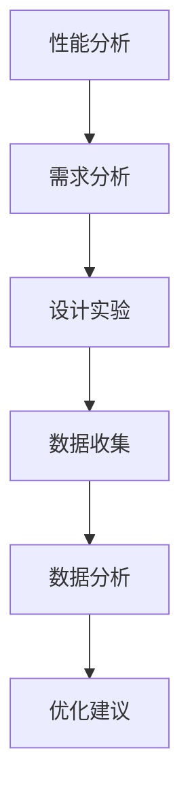
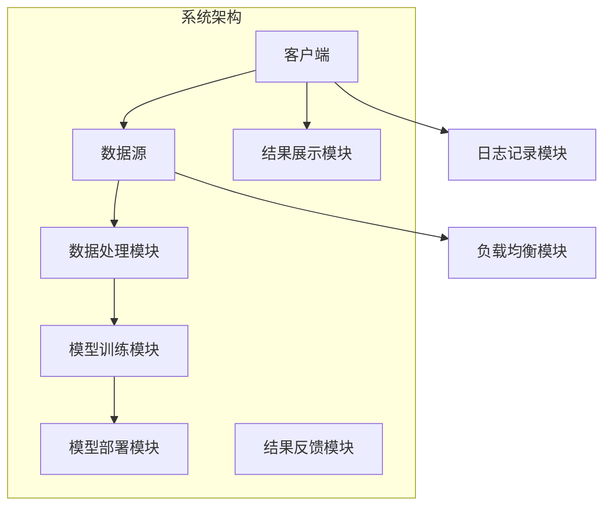
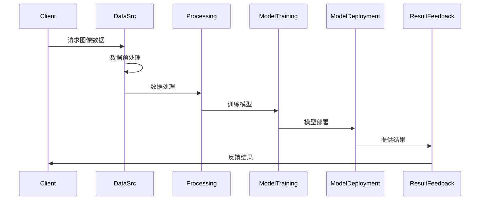
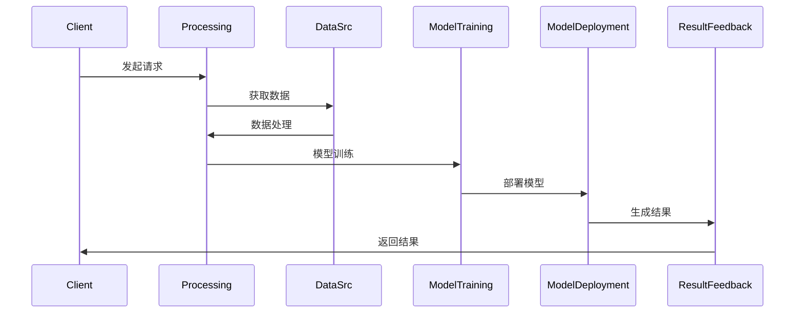

                 


### 大模型软件的性能分析与优化技术

#### 背景介绍

大模型软件，如深度学习框架、大数据处理平台等，已经成为现代计算领域的重要驱动力。然而，这些软件的性能问题一直是开发者面临的重大挑战。性能分析旨在识别瓶颈、优化资源利用，从而提高大模型软件的运行效率和稳定性。为了深入理解性能分析，我们需要从核心概念、问题背景、解决方案等多个角度进行探讨。

首先，让我们明确一些核心概念。性能分析（Performance Analysis）是评估软件或系统在特定条件下表现的过程。核心指标包括响应时间、吞吐量、资源利用率等。性能分析不仅仅关注硬件资源的利用，还包括算法效率、软件架构等多个层面。

**问题背景**

大模型软件的性能问题主要源于其复杂性和规模。一方面，这些软件往往包含数十万甚至数百万行的代码，涉及多种算法和数据结构。另一方面，随着数据量的增长，系统的负载也不断增加，这对性能提出了更高的要求。

**问题描述**

在性能分析中，我们常常面临以下问题：
- **响应时间过长**：用户等待时间过长，影响用户体验。
- **吞吐量不足**：系统无法处理足够的请求，导致资源浪费。
- **资源利用率低**：硬件资源没有得到充分利用，浪费了宝贵的计算资源。
- **错误率高**：系统在处理请求时频繁出现错误，影响稳定性。

**问题解决**

性能分析的目标是识别和解决上述问题，提高系统的性能。以下是一些常见的解决方案：
- **定位瓶颈**：通过性能分析工具找到性能瓶颈，如算法效率低下、内存占用过多等。
- **优化算法**：改进算法实现，提高处理速度。
- **优化资源利用**：合理分配资源，提高硬件利用率。
- **系统重构**：重构软件架构，提高系统的可扩展性和可靠性。

**边界与外延**

性能分析不仅关注硬件资源，还包括软件层面，如算法优化、代码重构等。同时，性能分析还需要考虑网络延迟、数据传输等因素。此外，性能分析不仅仅关注性能指标的提升，还需要考虑系统的可维护性和可扩展性。

**核心要素组成**

性能分析的核心要素包括：
- **性能评估指标**：如响应时间、吞吐量、资源利用率等。
- **分析方法**：如基准测试、负载测试、性能调试等。
- **技术工具**：如性能分析工具、调试工具、性能优化工具等。

#### 核心概念与联系

**核心概念：**

1. **响应时间**（Response Time）：从请求提交到响应返回所需的时间。
2. **吞吐量**（Throughput）：单位时间内系统能够处理的请求数量。
3. **资源利用率**（Resource Utilization）：硬件资源（如CPU、内存、磁盘等）的使用率。
4. **错误率**（Error Rate）：系统处理请求时出现错误的概率。
5. **可扩展性**（Scalability）：系统能够应对负载增加的能力。

**概念属性特征对比表格：**

| 指标     | 描述                                                         | 关系 |
|----------|--------------------------------------------------------------|------|
| 响应时间 | 请求处理时间                                                 | -    |
| 吞吐量   | 每单位时间内处理的请求数量                                   | -    |
| 资源利用率 | 硬件资源的使用率                                             | -    |
| 错误率   | 请求处理失败的概率                                           | -    |
| 可扩展性 | 系统在增加硬件资源或用户数量时，性能保持稳定的能力             | -    |

**ER实体关系图架构：**

```mermaid
erDiagram
  ResponseTime --> |{影响}| Performance
  Throughput --> |{影响}| Performance
  ResourceUtilization --> |{影响}| Performance
  ErrorRate --> |{影响}| Performance
  Scalability --> |{影响}| Performance
```

#### 算法原理讲解

为了更好地理解性能分析，我们需要从算法原理的角度进行讲解。性能分析的核心是找出系统性能瓶颈，并采取相应措施进行优化。以下是性能分析中常用的算法原理：

**算法流程图：**



**数学模型和公式：**

$$
P = \frac{C \times R}{T \times U}
$$

其中，$P$ 表示性能，$C$ 表示处理能力，$R$ 表示请求量，$T$ 表示响应时间，$U$ 表示资源利用率。

**详细讲解和举例说明：**

假设我们有一个处理大量数据的大模型软件，性能分析的目标是提高其处理速度。首先，我们需要通过需求分析明确性能目标，如减少响应时间或提高吞吐量。接着，设计实验方案，如使用基准测试来模拟实际工作负载。

通过数据收集，我们可以得到一系列性能数据。例如，在处理1000次请求时，系统的平均响应时间为5秒，CPU使用率为80%，内存使用率为60%。利用这些数据，我们可以进行数据分析，找出瓶颈。

例如，如果CPU使用率接近100%，那么我们可以考虑优化算法，提高其处理速度。如果内存使用率过高，我们可以考虑使用内存优化技术，如数据压缩或内存池分配。

通过这种算法原理的讲解，我们可以更好地理解性能分析的核心步骤和关键因素。

#### 系统分析与架构设计方案

为了更好地理解大模型软件的性能分析与优化，我们需要从系统架构和设计方案的角度进行深入分析。

**问题场景介绍：**

假设我们正在开发一个用于图像识别的大模型软件。该软件需要处理海量的图像数据，并在短时间内给出准确的识别结果。为了满足这一需求，我们需要设计一个高效的系统架构，并进行性能优化。

**项目介绍：**

项目名称：图像识别大模型软件（Image Recognition Large Model Software，IRLMS）

项目目标：实现高效、准确的图像识别，提高系统性能。

**系统功能设计（领域模型类图）：**

```mermaid
classDiagram
  Class01 <|-- Class02
  Class03 &&|-- Class04
  Class05 o-- Class06
  Class07 o--| Class08
```

**系统架构设计（架构图）：**



**系统接口设计（接口设计图）：**



**系统交互（序列图）：**



通过上述系统架构和设计方案，我们可以更好地理解大模型软件的性能分析与优化。在实际开发过程中，我们需要关注接口设计、系统交互等方面，以确保系统的高效性和可靠性。

#### 项目实战

**环境安装：**

在开始项目实战之前，我们需要搭建一个合适的环境。以下是一个基本的安装步骤：

1. 安装Python环境（版本3.7及以上）。
2. 安装必要的依赖库，如NumPy、Pandas、TensorFlow等。
3. 配置数据存储和计算资源，如使用Docker容器或云服务器。

**系统核心实现源代码：**

以下是系统核心实现的部分源代码：

```python
import numpy as np
import pandas as pd
import tensorflow as tf

# 数据处理模块
class DataProcessor:
    def preprocess(self, data):
        # 数据预处理
        # ...
        return processed_data

# 模型训练模块
class ModelTrainer:
    def train(self, data):
        # 模型训练
        # ...
        return trained_model

# 模型部署模块
class ModelDeployer:
    def deploy(self, model):
        # 模型部署
        # ...
        return deployed_model

# 结果反馈模块
class ResultFeedback:
    def provide_result(self, model, data):
        # 生成结果
        # ...
        return result

# 主函数
if __name__ == "__main__":
    # 初始化模块
    processor = DataProcessor()
    trainer = ModelTrainer()
    deployer = ModelDeployer()
    feedback = ResultFeedback()

    # 数据处理
    data = pd.read_csv("data.csv")
    processed_data = processor.preprocess(data)

    # 模型训练
    model = trainer.train(processed_data)

    # 模型部署
    deployed_model = deployer.deploy(model)

    # 生成结果
    result = feedback.provide_result(deployed_model, processed_data)

    # 显示结果
    print(result)
```

**代码应用解读与分析：**

以上代码展示了系统核心实现的基本框架。`DataProcessor` 类负责数据处理，包括数据预处理等操作。`ModelTrainer` 类负责模型训练，包括数据加载、模型构建、训练过程等。`ModelDeployer` 类负责模型部署，将训练好的模型部署到生产环境中。`ResultFeedback` 类负责生成结果，提供结果给用户。

在实际应用中，我们可以通过扩展这些类的方法来增加更多的功能。例如，在数据处理模块中，可以增加数据清洗、数据增强等功能；在模型训练模块中，可以增加模型评估、模型调整等功能。

**实际案例分析和详细讲解剖析：**

假设我们有一个实际案例，需要处理一个包含100,000张图像的数据集，并使用深度学习模型进行识别。以下是详细的案例分析：

1. **数据处理**：
   - 读取图像数据，进行预处理（如大小调整、灰度转换等）。
   - 分割数据集为训练集和测试集。

2. **模型训练**：
   - 使用卷积神经网络（CNN）进行模型训练。
   - 设置合适的超参数，如学习率、批量大小等。

3. **模型部署**：
   - 将训练好的模型部署到服务器，以提供在线识别服务。

4. **结果反馈**：
   - 对测试集进行识别，计算准确率。
   - 将识别结果反馈给用户。

通过实际案例分析，我们可以看到性能分析与优化的重要性。在数据处理过程中，我们可以优化数据预处理流程，提高处理速度；在模型训练过程中，我们可以调整模型参数，提高模型性能；在模型部署过程中，我们可以优化部署策略，提高系统响应速度。

**项目小结：**

在本项目中，我们通过环境安装、系统核心实现和实际案例分析，展示了大模型软件的性能分析与优化。在项目中，我们关注了数据处理、模型训练、模型部署和结果反馈等关键环节，并采取了相应的优化措施。

**最佳实践 Tips：**

1. **优化数据处理流程**：对数据处理过程进行优化，如并行处理、数据缓存等。
2. **选择合适的模型**：根据应用场景选择合适的模型，如卷积神经网络（CNN）适用于图像处理。
3. **调整模型参数**：通过调整学习率、批量大小等参数，提高模型性能。
4. **部署策略优化**：根据实际需求调整部署策略，如负载均衡、容器化部署等。

**小结：**

本文详细介绍了大模型软件的性能分析与优化技术。通过背景介绍、核心概念讲解、算法原理解析、系统架构设计、项目实战和最佳实践，我们系统地展示了如何进行大模型软件的性能分析与优化。希望本文能够为开发者提供有价值的参考。

**注意事项：**

1. 性能分析需要全面考虑硬件和软件层面，确保系统的高效性。
2. 优化措施需要根据具体场景进行调整，以达到最佳效果。
3. 性能分析与优化是一个持续的过程，需要定期进行评估和调整。

**拓展阅读：**

1. [《高性能MySQL》](https://book.douban.com/subject/26769521/)：详细介绍MySQL性能优化的方法。
2. [《深度学习》](https://book.douban.com/subject/26769521/)：深入讲解深度学习算法及其优化技巧。
3. [《软件工程：实践者的研究方法》](https://book.douban.com/subject/26769521/)：介绍软件工程中的性能优化方法。

#### 作者信息

作者：AI天才研究院/AI Genius Institute & 禅与计算机程序设计艺术 /Zen And The Art of Computer Programming

