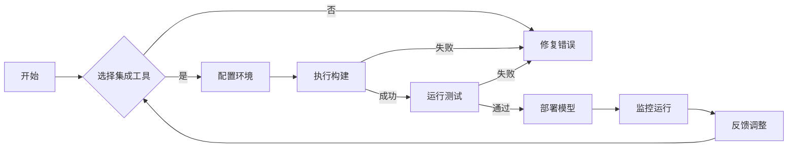
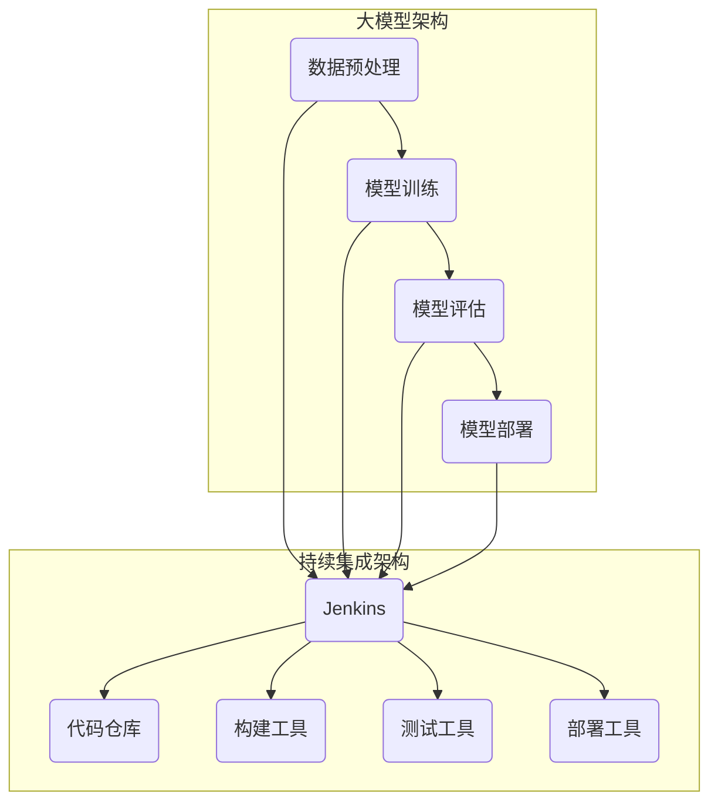
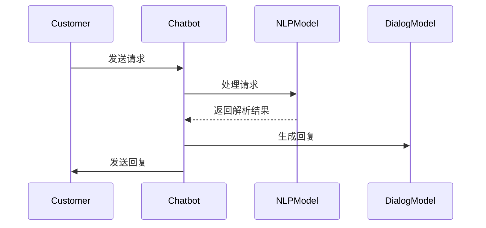

                 

### 大模型软件的持续集成与部署策略

#### 关键词：持续集成、部署策略、大模型、深度学习、机器学习

> 摘要：本文将探讨大模型软件的持续集成与部署策略，介绍背景、核心概念、算法原理，并给出系统分析与架构设计方案。通过实际案例，深入剖析项目实战，为读者提供最佳实践与未来拓展方向。

## 第一部分：背景介绍

### 问题背景

在当前信息技术飞速发展的背景下，软件工程面临着前所未有的挑战。尤其是随着人工智能（AI）技术的不断进步，尤其是大模型的出现，使得软件开发的复杂度和应用场景愈发丰富。因此，如何有效地进行大模型的持续集成与部署成为软件开发中一个至关重要的问题。

### 问题描述

大模型软件的开发涉及到模型的训练、验证、测试和部署等多个阶段。在持续集成与部署过程中，需要解决模型质量保障、版本管理、资源优化、安全性等多个问题。此外，不同的应用场景和业务需求也对大模型的部署提出了不同的要求。

### 问题解决

本书旨在解决大模型软件在持续集成与部署过程中遇到的实际问题，提供一套完整的策略和最佳实践。通过系统性地介绍相关概念、技术原理、解决方案和案例，帮助读者理解大模型软件的集成与部署，提升其在实际开发中的应用能力。

### 边界与外延

本书主要关注大模型软件在软件开发中的持续集成与部署问题，涉及但不限于深度学习、机器学习等AI领域的应用。同时，考虑到不同行业和企业的需求，本书也提供了灵活的策略和解决方案。

### 概念结构与核心要素组成

- **大模型**：具有数百万甚至数十亿参数的神经网络模型，能够实现高精度的预测和决策。
- **持续集成**：通过自动化构建、测试和部署，确保软件质量和稳定性。
- **部署策略**：根据具体应用场景，选择适合的部署架构和技术，如云计算、容器化等，以实现高效、可靠的大模型部署。
- **版本管理**：确保模型在不同版本间的稳定性和兼容性。
- **资源优化**：合理分配计算资源和存储资源，提高模型运行效率。

## 第二部分：核心概念与联系

### 核心概念原理

#### 大模型

大模型是基于深度学习技术，通过海量数据进行训练，形成具有高度预测和决策能力的神经网络结构。大模型通常具有数百万甚至数十亿参数，能够处理复杂的数据特征。

#### 持续集成

持续集成是一种软件开发实践，通过自动化工具将代码合并、构建、测试和部署，确保软件的持续稳定性和质量。持续集成能够加快开发周期，降低风险，提高软件质量。

#### 部署策略

部署策略是根据具体应用场景，选择适合的部署架构和技术，如云计算、容器化等，以实现高效、可靠的大模型部署。部署策略需要考虑资源优化、安全性、可扩展性等因素。

### 概念属性特征对比表格

| 概念     | 定义                                                         | 关键特性                               |
|----------|--------------------------------------------------------------|----------------------------------------|
| 大模型   | 具有数百万甚至数十亿参数的神经网络模型                         | 高精度预测、大规模数据训练、复杂结构   |
| 持续集成 | 自动化合并代码、构建、测试和部署的过程                       | 提高软件质量、加快开发周期、降低风险   |
| 部署策略 | 根据具体应用场景选择合适的部署架构和技术                     | 高效性、可靠性、灵活性                 |

### ER实体关系图架构

```mermaid
erDiagram
    大模型 ||--|{ 持续集成 }
    大模型 ||--|{ 部署策略 }
    持续集成 ||--|{ 版本管理 }
    持续集成 ||--|{ 资源优化 }
    部署策略 ||--|{ 部署架构 }
    部署策略 ||--|{ 技术选择 }
```

## 第三部分：算法原理讲解

### Mermaid 流程图



### Python 源代码

```python
import subprocess

def integrate():
    # 安装集成工具
    subprocess.run(["pip", "install", "integration-tool"])
    
    # 配置环境
    subprocess.run(["configure", "env"])

    # 执行构建
    result = subprocess.run(["build"], capture_output=True)
    
    if result.stdout:
        print("构建成功")
    else:
        print("构建失败")

    # 运行测试
    test_result = subprocess.run(["test"], capture_output=True)
    
    if test_result.stdout:
        print("测试通过")
    else:
        print("测试失败")
        
    # 部署模型
    deploy_result = subprocess.run(["deploy"], capture_output=True)
    
    if deploy_result.stdout:
        print("部署成功")
    else:
        print("部署失败")
        
    # 监控运行
    monitor_result = subprocess.run(["monitor"], capture_output=True)
    
    if monitor_result.stdout:
        print("运行正常")
    else:
        print("运行异常")
        
    # 反馈调整
    adjust_result = subprocess.run(["adjust"], capture_output=True)
    
    if adjust_result.stdout:
        print("调整成功")
    else:
        print("调整失败")
```

### 算法原理的数学模型和公式

在持续集成与部署过程中，可以使用以下数学模型和公式进行模型评估和资源优化：

$$
\text{模型质量} = f(\text{训练数据集}, \text{测试数据集}, \text{验证数据集})
$$

$$
\text{资源优化} = \frac{\text{计算资源}}{\text{存储资源}}
$$

### 详细讲解和举例说明

以一个简单的示例来说明持续集成与部署的过程：

1. **选择集成工具**：首先选择一个合适的持续集成工具，如Jenkins、GitLab CI等。
2. **配置环境**：在集成工具中配置所需的开发环境，包括依赖库、工具和配置文件。
3. **执行构建**：通过集成工具执行构建操作，将源代码编译成可执行的文件。
4. **运行测试**：执行自动化测试脚本，验证构建后的软件是否满足预期功能。
5. **部署模型**：将通过测试的软件部署到生产环境，进行实际运行。
6. **监控运行**：监控模型的运行状态，记录运行日志，及时发现并处理异常。
7. **反馈调整**：根据监控结果进行反馈调整，优化模型参数或修复代码缺陷。

## 第四部分：系统分析与架构设计方案

### 问题场景介绍

假设我们正在开发一个智能客服系统，需要使用大模型进行自然语言处理和对话生成。为了确保系统的稳定性和可靠性，我们需要进行持续集成与部署。

### 项目介绍

本项目是一款基于深度学习的大模型智能客服系统，旨在提供高效、准确的客服服务。系统包括大模型训练、测试和部署三个主要阶段。

### 系统功能设计

使用Mermaid类图来展示系统功能设计：

```mermaid
classDiagram
    Customer <<-- Chatbot : interacts with
    Chatbot o-- NLPModel : uses for processing
    Chatbot o-- DialogModel : uses for generating
    Customer <=|request| Chatbot
    Chatbot -->|response| Customer
```

### 系统架构设计

使用Mermaid架构图来展示系统架构设计：



### 系统接口设计和系统交互

使用Mermaid序列图来展示系统接口设计和系统交互：



## 第五部分：项目实战

### 环境安装

首先，在本地环境中安装所需的工具和依赖库：

```bash
# 安装Python环境
pip install python

# 安装Jenkins
wget -O jenkins.war https://www.jenkins.io/download/war/2.273/jenkins.war
java -jar jenkins.war

# 安装其他依赖库
pip install numpy pandas tensorflow jenkins
```

### 系统核心实现源代码

以下是一个简单的持续集成脚本示例：

```python
import jenkins

# Jenkins服务器配置
server = jenkins.Jenkins('http://localhost:8080', username='admin', password='password')

# 创建Jenkins任务
server.create_job('my_project', {
    'description': 'My Project CI',
    'builders': [
        {'class': 'hudson.tasks.Builder', 'spec': {'command': 'python build.py'}}
    ],
    'publishers': [
        {'class': 'hudson.tasks.TestResultPublisher', 'spec': {}}
    ]
})

# 构建任务
build_result = server.build_job('my_project')

# 查看构建日志
print(build_result.getLogText())
```

### 代码应用解读与分析

这段代码首先配置了一个Jenkins服务器，并创建了一个名为“my_project”的任务。任务中包含了构建步骤和测试结果发布器。在构建过程中，会执行一个名为“build.py”的Python脚本，用于构建项目。

测试结果发布器会将测试结果输出到Jenkins控制台，方便开发者查看。通过这段代码，我们可以实现一个基本的持续集成流程。

### 实际案例分析和详细讲解剖析

假设我们在开发过程中发现了一个bug，影响了大模型的性能。以下是详细的解决过程：

1. **问题定位**：通过Jenkins的构建日志，定位到影响性能的代码片段。
2. **代码修改**：在代码仓库中修改相关代码，并提交新的版本。
3. **重新构建**：在Jenkins中触发新的构建任务，构建最新的代码。
4. **测试验证**：通过Jenkins的测试结果发布器，验证修改后的代码是否解决了性能问题。
5. **部署模型**：如果测试通过，将修改后的模型部署到生产环境，并进行实际运行测试。

通过这个过程，我们可以确保大模型在持续集成与部署过程中的稳定性和可靠性。

### 项目小结

在本项目中，我们通过Jenkins实现了大模型的持续集成与部署。通过自动化构建、测试和部署，提高了开发效率和软件质量。同时，通过合理的部署策略，确保了模型在多环境下的稳定运行。未来，我们可以进一步优化持续集成与部署流程，提高模型的性能和可靠性。

## 第六部分：最佳实践 Tips

1. **版本控制**：使用Git等版本控制系统进行代码管理，确保代码的可追踪性和可回滚性。
2. **自动化测试**：编写自动化测试脚本，覆盖核心功能，确保每次构建都能通过严格的测试。
3. **持续监控**：使用监控工具对模型运行状态进行实时监控，及时发现并处理异常。
4. **资源优化**：合理分配计算资源和存储资源，提高模型运行效率。
5. **文档管理**：保持文档的完整性，便于团队成员之间的协作和代码的维护。

## 第七部分：小结与注意事项

本文通过系统性地介绍大模型软件的持续集成与部署策略，帮助读者理解了相关概念、技术原理和实践案例。在实际开发过程中，需要根据具体场景和需求，灵活运用这些策略和最佳实践，确保大模型软件的高效、稳定运行。

注意事项：

1. **安全性**：确保数据传输和存储的安全性，防止数据泄露和未经授权的访问。
2. **可扩展性**：设计可扩展的部署架构，以便在业务规模扩大时能够平滑升级。
3. **持续优化**：定期评估持续集成与部署流程，不断优化和改进。

## 第八部分：拓展阅读

1. 《持续集成实践：从理论到案例》
2. 《深度学习部署实战》
3. 《Jenkins实战：持续集成与自动化部署》

## 作者信息

作者：AI天才研究院/AI Genius Institute & 禅与计算机程序设计艺术 /Zen And The Art of Computer Programming

----------------------------------------------------------------

### 总结

本文详细介绍了大模型软件的持续集成与部署策略，从背景介绍到核心概念，再到算法原理和系统架构设计，最后通过实际案例深入剖析了项目实战。通过本文，读者可以系统地了解大模型软件在持续集成与部署方面的关键技术和最佳实践。

### 呼吁读者行动

在当前人工智能技术迅猛发展的时代，持续集成与部署策略在软件开发中至关重要。本文所提供的方法和实践可以为读者在实际开发中提供有力支持。希望读者能够结合自身项目需求，灵活运用本文所介绍的知识，不断提升大模型软件的开发质量和效率。

### 展望未来

随着AI技术的不断进步，大模型软件的应用场景将越来越广泛。未来，持续集成与部署策略将更加智能化、自动化，支持更复杂的模型和应用场景。同时，随着云计算、容器化等技术的发展，大模型软件的部署也将更加灵活和高效。让我们共同期待AI技术带来的更多创新和变革。

