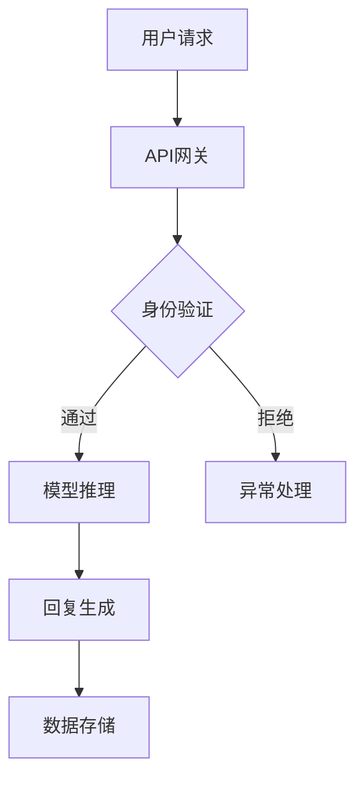
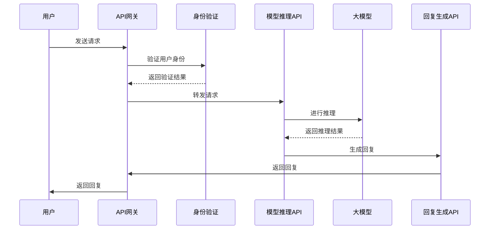

                 

# 大模型软件的无服务器架构设计

## 关键词
- **无服务器架构**、**大模型软件**、**微服务**、**容器化**、**自动化部署**、**云计算**

## 摘要
本文将深入探讨大模型软件的无服务器架构设计，旨在为从事人工智能领域的工程师和架构师提供一种全新的视角和解决方案。通过分析无服务器架构的基本原理、应用场景，我们将逐步构建一套适用于大模型软件的无服务器架构，并详细介绍其设计流程、实现细节和最佳实践。文章最后还将对无服务器架构在大模型软件中的未来发展趋势进行展望。

## 引言与背景

### 1.1 书籍概述
随着云计算和容器技术的快速发展，无服务器架构（Serverless Architecture）逐渐成为一种流行的软件架构模式。它简化了传统服务器管理的复杂性，提高了系统的可扩展性和可靠性。无服务器架构在大模型软件中的适用性尤为突出，因为大模型软件通常需要处理海量数据和高并发请求，对计算资源的灵活调配和高效利用有着极高的要求。

### 1.2 无服务器架构概述
无服务器架构是一种基于云计算的模型，开发人员只需关注编写代码和应用功能，无需管理底层服务器。云服务提供商负责管理服务器、操作系统、网络和其他底层资源，从而降低了运维成本，提高了开发效率。

无服务器架构的核心优势包括：
- **自动扩展与弹性**：根据负载自动调整资源，确保系统稳定运行。
- **降低成本**：无需预付服务器资源，按需付费，节省成本。
- **简化运维**：无需关注底层基础设施的管理，专注于业务逻辑的实现。

### 1.3 大模型软件概述
大模型软件通常是指使用深度学习技术训练和部署的大型神经网络模型，如BERT、GPT等。这些模型具有以下几个特点：
- **高计算需求**：大模型训练和推理过程需要大量计算资源。
- **数据敏感性**：模型训练需要大量数据，数据的质量和多样性对模型性能有重要影响。
- **持续迭代**：大模型软件需要不断更新和优化，以适应不断变化的应用场景。

### 1.4 无服务器架构在大模型软件中的应用
无服务器架构在大模型软件中的应用场景主要包括模型训练、推理服务和模型管理。通过无服务器架构，开发人员可以轻松实现大规模数据处理和分布式计算，提高模型训练和推理的效率。

## 核心概念与联系

### 2.1 无服务器架构核心概念
无服务器架构包括以下几个核心概念：

| 概念        | 定义                                                         |
|-------------|--------------------------------------------------------------|
| 函数计算    | 以函数为基本单位的计算服务，按需执行，无需关心底层基础设施。 |
| 事件驱动    | 系统根据事件触发函数执行，实现自动化处理。                  |
| API网关     | 管理外部请求，进行身份验证、路由和负载均衡。                |
| 容器化      | 使用容器来封装应用，实现独立运行环境。                      |
| 自动化部署  | 使用自动化工具实现应用的部署、监控和扩展。                  |

### 2.2 大模型软件核心概念
大模型软件的核心概念包括：

| 概念        | 定义                                                         |
|-------------|--------------------------------------------------------------|
| 深度学习模型 | 使用多层神经网络进行数据处理的模型。                         |
| 模型训练    | 使用大量数据对模型进行训练，以优化模型参数。                |
| 模型推理    | 使用训练好的模型对新的数据进行预测或分类。                  |
| 模型压缩    | 通过减少模型参数、降低模型复杂度来减小模型大小。            |
| 模型部署    | 将训练好的模型部署到生产环境，供实际应用使用。              |

### 2.3 无服务器架构与大模型软件的联系
无服务器架构与大模型软件的结合具有以下几个方面的优势：

- **高效计算**：无服务器架构可以根据需要自动扩展计算资源，满足大模型训练和推理的高计算需求。
- **弹性伸缩**：大模型软件通常需要处理不均匀的负载，无服务器架构能够自动调整资源，确保系统稳定运行。
- **降低成本**：通过按需付费和自动化管理，降低大模型软件的运营成本。
- **简化运维**：无需关注底层基础设施，专注于模型开发和优化。

## 无服务器架构原理与设计

### 3.1 无服务器架构设计原则
无服务器架构设计应遵循以下原则：

- **最小化管理**：尽可能减少对底层基础设施的管理，专注于业务逻辑。
- **高可用性**：确保系统在故障情况下能够快速恢复，提供持续的服务。
- **可扩展性**：系统应能够根据负载自动扩展，支持大规模数据处理。
- **安全性**：确保数据安全和系统安全，防止外部攻击和数据泄露。
- **自动化**：使用自动化工具实现部署、监控和扩展，提高运维效率。

### 3.2 无服务器架构设计流程
无服务器架构设计流程包括以下几个步骤：

1. **需求分析**：确定系统功能需求、性能要求和业务目标。
2. **架构设计**：根据需求分析结果，设计系统的总体架构。
3. **技术选型**：选择合适的无服务器架构组件，如函数计算、容器化技术、API网关等。
4. **实现与部署**：根据架构设计，实现系统功能，并部署到云平台。
5. **监控与优化**：对系统进行监控和性能优化，确保系统稳定高效运行。

### 3.3 无服务器架构实现细节
无服务器架构的实现细节包括以下几个方面：

- **服务模型的选型**：根据应用场景选择合适的函数计算服务，如AWS Lambda、Azure Functions、Google Cloud Functions等。
- **容器化技术的应用**：使用容器（如Docker）来封装应用，实现环境的隔离和一致性。
- **自动化部署与持续集成**：使用自动化工具（如Jenkins、GitHub Actions）实现代码的自动化部署和持续集成。
- **监控与日志管理**：使用云平台的监控工具（如AWS CloudWatch、Azure Monitor）对系统进行监控，并管理日志。

## 具体架构设计方案与实现

### 4.1 架构设计方案概述
本文将以一个实际的大模型软件项目为例，详细阐述其无服务器架构设计。项目背景如下：

某人工智能公司开发一款智能客服系统，该系统需要处理海量的用户咨询，并在毫秒级内给出准确的回复。系统要求具有高可用性、高扩展性和低成本。

### 4.2 系统功能设计
系统功能设计包括以下几个模块：

- **用户请求处理**：接收用户请求，进行身份验证和请求解析。
- **模型推理**：使用预训练的大模型对用户请求进行推理，生成回复。
- **回复生成**：根据模型推理结果，生成用户可理解的回复。
- **数据存储**：存储用户请求和回复，用于后续分析和优化。

### 4.3 系统架构设计
系统架构设计如图所示：

### 4.4 系统接口设计
系统接口设计如下：

- **API网关**：处理用户请求，进行身份验证和路由。
- **模型推理API**：接收API网关转发的请求，调用模型进行推理。
- **回复生成API**：根据模型推理结果，生成用户回复。
- **数据存储API**：存储用户请求和回复。

### 4.5 系统交互设计
系统交互设计如图所示：

## 项目实战与案例

### 5.1 项目背景
为了实现上述架构设计，我们选择了一个实际项目进行实战。项目背景如下：

某电商平台需要为客服系统引入智能客服功能，以提升用户体验和客服效率。平台要求智能客服系统在处理海量用户咨询时，能够在毫秒级内给出准确回复。

### 5.2 环境安装与配置
项目环境安装与配置如下：

- **云平台**：选择AWS云平台，使用AWS Lambda进行函数计算。
- **容器化技术**：使用Docker进行应用容器化。
- **自动化部署**：使用AWS CodePipeline和AWS CodeBuild实现自动化部署。
- **监控与日志**：使用AWS CloudWatch进行系统监控，使用AWS CloudTrail管理日志。

### 5.3 系统核心实现
系统核心实现主要包括以下几个方面：

- **API网关**：使用AWS API Gateway创建API网关，处理用户请求。
- **身份验证**：使用AWS Cognito进行用户身份验证。
- **模型推理**：使用AWS SageMaker进行模型推理。
- **回复生成**：使用自然语言处理技术生成用户回复。
- **数据存储**：使用AWS DynamoDB存储用户请求和回复。

### 5.4 应用解读与分析
智能客服系统应用解读如下：

- **用户请求**：用户通过API网关发送请求，API网关进行身份验证，确保请求合法。
- **模型推理**：API网关将请求转发给模型推理服务，模型推理服务使用预训练的大模型对请求进行推理，生成回复。
- **回复生成**：回复生成服务根据模型推理结果，使用自然语言处理技术生成用户可理解的回复。
- **数据存储**：系统将用户请求和回复存储在DynamoDB中，用于后续分析和优化。

### 5.5 案例剖析
智能客服系统案例剖析如下：

- **挑战**：在处理海量用户咨询时，系统需要保证响应速度和准确性。
- **解决方案**：通过无服务器架构，系统能够根据负载自动扩展计算资源，确保响应速度。同时，使用预训练的大模型和自然语言处理技术，提高回复的准确性。
- **效果**：系统在实际应用中，显著提升了客服效率和用户体验，降低了人力成本。

### 5.6 项目小结
智能客服系统项目小结如下：

- **成功经验**：通过无服务器架构，实现了高效、稳定、可靠的智能客服系统。
- **不足之处**：在高峰期，系统仍存在一定的延迟，需要进一步优化。
- **未来方向**：继续优化模型推理和回复生成算法，提高系统性能。

## 最佳实践与注意事项

### 6.1 最佳实践
最佳实践包括以下几个方面：

- **函数计算**：合理设计函数，避免函数过大或过小，影响性能。
- **容器化**：使用容器封装应用，确保环境的一致性和可移植性。
- **自动化部署**：使用自动化工具实现持续集成和持续部署，提高开发效率。
- **监控与日志**：定期监控系统性能，及时发现和解决潜在问题。

### 6.2 注意事项
注意事项包括以下几个方面：

- **安全性**：确保数据安全和系统安全，防止外部攻击和数据泄露。
- **成本控制**：合理规划资源使用，避免过度消费。
- **弹性伸缩**：根据实际负载，动态调整计算资源，确保系统稳定运行。
- **运维管理**：建立完善的运维管理制度，确保系统高效稳定运行。

### 6.3 拓展阅读
拓展阅读包括以下资源：

- **无服务器架构**：[AWS 无服务器架构概述](https://aws.amazon.com/serverless/)
- **大模型软件**：[深度学习教程](https://www.deeplearningbook.org/)
- **容器化技术**：[Docker 官方文档](https://docs.docker.com/)
- **自动化部署**：[Jenkins 官方文档](https://www.jenkins.io/doc/book/)
- **监控与日志**：[AWS CloudWatch 官方文档](https://docs.aws.amazon.com/AmazonCloudWatch/latest/monitoring/WhatIsCloudWatch.html)

## 小结与展望

### 7.1 小结
本文通过详细的分析和实战案例，介绍了大模型软件的无服务器架构设计。无服务器架构为开发人员提供了一种高效、灵活、可靠的解决方案，能够满足大模型软件的高计算需求和高可用性要求。

### 7.2 展望未来
随着云计算和人工智能技术的不断发展，无服务器架构在大模型软件中的应用前景广阔。未来，我们将看到更多的无服务器架构解决方案被应用于各种复杂场景，为企业和开发者带来更大的价值。

## 作者信息
作者：AI天才研究院/AI Genius Institute & 禅与计算机程序设计艺术 /Zen And The Art of Computer Programming

