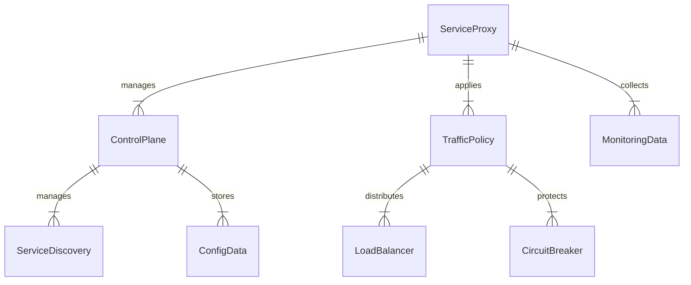

                 

## 文章标题

### 大模型软件的服务网格架构设计与实现

#### 关键词：大模型软件，服务网格，架构设计，实现，微服务

> 摘要：本文详细探讨了服务网格在支持大模型软件中的应用与实现。首先，介绍了服务网格的概念、背景及其在企业应用中的重要性。接着，我们通过深入分析服务网格的核心概念与架构设计原则，展示了如何构建高效、可扩展的服务网格架构。随后，文章详细阐述了服务网格的实现步骤、工具和部署策略，并通过实际案例展示了其部署与运维的最佳实践。最后，本文探讨了服务网格在不同行业中的应用场景及其未来发展趋势，为读者提供了全面的技术指导和前瞻性思考。

## 目录大纲

### 第一部分：背景介绍

#### 第1章：问题背景与定义

- **1.1 问题背景**

  - 服务网格的概念与发展历程
  - 服务网格在企业应用中的重要性
  - 服务网格面临的挑战与需求

- **1.2 定义与边界**

  - 服务网格的基本概念
  - 服务网格与容器化、微服务的关系
  - 服务网格的外延与核心要素

- **1.3 概念结构与核心要素组成**

  - 服务网格的核心组件
  - 服务网格的关键特性
  - 服务网格的技术架构

#### 第2章：核心概念与联系

- **2.1 服务网格原理**

  - 服务网格的工作机制
  - 服务网格的协议与标准

- **2.2 服务网格属性特征对比表格**

  - 不同服务网格产品的特性对比

- **2.3 服务网格的ER实体关系图架构**

  - 服务网格的实体关系与关联关系

### 第二部分：服务网格架构设计

#### 第3章：服务网格架构设计原理

- **3.1 架构设计原则**

  - 服务网格架构设计的基本原则
  - 架构设计中的常见问题与解决方案

- **3.2 服务网格架构设计方法**

  - 服务网格架构设计流程
  - 服务网格架构设计工具与技术

#### 第4章：服务网格架构设计实践

- **4.1 服务网格架构设计案例**

  - 案例一：企业级服务网格架构设计
  - 案例二：云计算服务网格架构设计

- **4.2 服务网格架构优化与调优**

  - 服务网格性能优化方法
  - 服务网格安全性优化

### 第三部分：服务网格实现与部署

#### 第5章：服务网格实现原理

- **5.1 服务网格实现步骤**

  - 服务网格实现的基本步骤
  - 服务网格实现的关键技术

- **5.2 服务网格实现工具**

  - 服务网格实现常用的工具与平台

#### 第6章：服务网格部署与运维

- **6.1 服务网格部署流程**

  - 服务网格部署的基本流程
  - 服务网格部署的注意事项

- **6.2 服务网格运维管理**

  - 服务网格运维的关键任务
  - 服务网格运维的最佳实践

### 第四部分：服务网格应用与未来趋势

#### 第7章：服务网格应用场景

- **7.1 服务网格在金融行业的应用**

  - 金融行业服务网格的应用案例
  - 金融行业服务网格的优势与挑战

- **7.2 服务网格在其他行业的应用**

  - 零售电商行业的应用
  - 医疗健康行业的应用

#### 第8章：服务网格的未来趋势

- **8.1 服务网格技术发展趋势**

  - 服务网格技术的最新进展
  - 服务网格技术未来的发展方向

- **8.2 服务网格在企业中的应用前景**

  - 服务网格对企业数字化转型的影响
  - 服务网格在企业应用中的挑战与机遇

### 第五部分：小结与展望

#### 第9章：小结与展望

- **9.1 小结**

  - 本书的核心内容回顾
  - 服务网格技术的重要意义

- **9.2 展望**

  - 服务网格技术未来的发展趋势
  - 服务网格技术对企业的影响

---

接下来，我们将逐步深入探讨服务网格的各个方面，包括其背景、核心概念、架构设计、实现与部署，以及其在不同行业中的应用和未来趋势。让我们一步一步地思考，深入了解服务网格在大模型软件架构设计中的重要作用。

---

## 第一部分：背景介绍

### 第1章：问题背景与定义

#### 1.1 问题背景

**服务网格的概念与发展历程**

服务网格（Service Mesh）是一个用于管理和服务间通信的软件层，它提供了服务间的负载均衡、服务发现、断路器、安全认证等功能。其核心思想是将服务之间的通信抽象出来，从而实现服务与应用的解耦。这一概念起源于2016年Netflix团队发布的Conduits项目，随后在2017年Istio项目的发布中得到了进一步的发展和完善。

**服务网格在企业应用中的重要性**

随着云计算、容器化和微服务架构的普及，企业的IT基础设施变得更加复杂和动态。传统的应用架构难以满足这种复杂性的需求，尤其是对于服务之间的通信管理和安全性保障。服务网格为企业提供了一种新的解决方案，可以解决以下问题：

- **服务间的通信管理**：服务网格通过抽象出服务之间的通信，提供了负载均衡、服务发现、断路器等机制，使得服务之间的通信更加高效和可靠。
- **安全性保障**：服务网格可以通过安全协议和认证机制，保障服务之间的通信安全性。
- **灵活性与可扩展性**：服务网格使得企业可以在不修改应用代码的情况下，轻松扩展和调整服务之间的通信机制。

**服务网格面临的挑战与需求**

尽管服务网格为企业提供了许多优势，但在实际应用中仍面临着一些挑战：

- **性能与资源消耗**：服务网格引入了额外的通信路径和处理层，可能会增加系统的延迟和资源消耗。
- **部署与运维**：服务网格的部署和运维相对复杂，需要专门的技能和工具。
- **跨云与多云环境**：服务网格需要能够支持跨云和多云环境的部署和管理。

为了解决这些问题，企业需要深入了解服务网格的核心概念和架构设计，以便能够充分利用其优势，同时规避潜在的风险。

#### 1.2 定义与边界

**服务网格的基本概念**

服务网格是一个独立的网络层，负责管理微服务之间的通信。它通过代理（代理通常称为“sidecar”）与应用程序进行通信，从而实现服务间的解耦。服务网格通常包括以下核心组件：

- **服务代理（Service Proxy）**：服务代理通常是一个轻量级的代理，它与应用程序一起部署。它负责处理服务间的通信，提供负载均衡、服务发现、断路器等功能。
- **控制平面（Control Plane）**：控制平面是服务网格的管理层，负责配置和监控服务代理的行为。它通常包括数据平面配置、策略管理、监控告警等功能。

**服务网格与容器化、微服务的关系**

服务网格是容器化和微服务架构的重要组成部分。容器化使得应用程序可以以轻量级、独立的方式运行，而微服务架构则使得应用程序可以被拆分为多个小型、独立的服务。服务网格通过管理这些服务之间的通信，实现了容器化和微服务架构的透明性和灵活性。

**服务网格的外延与核心要素组成**

服务网格不仅包括服务代理和控制平面，还包括一系列的支持组件和功能，这些组件和功能共同构成了服务网格的外延：

- **服务发现（Service Discovery）**：服务发现机制使得服务代理可以动态地发现和管理其他服务。
- **负载均衡（Load Balancing）**：负载均衡机制用于分配流量到不同的服务实例，提高系统的可用性和性能。
- **断路器（Circuit Breaker）**：断路器机制用于在服务不可用时，防止系统级雪崩。
- **服务认证与授权（Service Authentication and Authorization）**：服务认证与授权机制用于确保服务之间的通信是安全和受控的。
- **监控与日志（Monitoring and Logging）**：监控与日志机制用于收集和分析服务网格的性能和健康状况。

#### 1.3 概念结构与核心要素组成

**服务网格的核心组件**

服务网格的核心组件包括服务代理和控制平面。服务代理负责处理服务间的通信，而控制平面负责管理服务代理的配置和监控。

- **服务代理**：服务代理是一个轻量级的代理，通常是一个容器，与应用程序一起部署。它通过拦截应用程序的请求，将请求转发到相应的服务，同时提供负载均衡、服务发现、断路器等功能。

- **控制平面**：控制平面是一个集中的管理层，负责配置和管理服务代理。它通常包括一个数据平面配置中心，用于存储和管理服务代理的配置。此外，控制平面还提供策略管理和监控告警功能，确保服务网格的运行状态和安全。

**服务网格的关键特性**

服务网格具有以下几个关键特性：

- **解耦（Decoupling）**：服务网格通过抽象出服务之间的通信，实现了服务与应用的解耦，使得服务可以独立开发和部署。
- **透明性（Transparency）**：服务网格提供了一个统一的通信层，使得服务之间的通信变得更加透明和可管理。
- **可扩展性（Scalability）**：服务网格支持动态的流量分配和服务发现，使得系统可以轻松扩展以应对增长的需求。
- **安全性（Security）**：服务网格提供了一系列的安全机制，如认证、授权、加密等，确保服务之间的通信是安全和受控的。

**服务网格的技术架构**

服务网格的技术架构通常包括以下几个层次：

- **数据平面（Data Plane）**：数据平面是服务网格的通信层，包括服务代理和控制平面。服务代理负责处理服务间的通信，而控制平面负责管理服务代理的配置和监控。
- **控制平面（Control Plane）**：控制平面是服务网格的管理层，负责配置和管理服务代理。它通常包括一个数据平面配置中心，用于存储和管理服务代理的配置。此外，控制平面还提供策略管理和监控告警功能，确保服务网格的运行状态和安全。
- **服务发现（Service Discovery）**：服务发现机制用于动态地发现和管理其他服务。它通常通过DNS、API调用等方式进行。
- **负载均衡（Load Balancing）**：负载均衡机制用于分配流量到不同的服务实例，提高系统的可用性和性能。
- **断路器（Circuit Breaker）**：断路器机制用于在服务不可用时，防止系统级雪崩。
- **服务认证与授权（Service Authentication and Authorization）**：服务认证与授权机制用于确保服务之间的通信是安全和受控的。
- **监控与日志（Monitoring and Logging）**：监控与日志机制用于收集和分析服务网格的性能和健康状况。

### 第2章：核心概念与联系

#### 2.1 服务网格原理

**服务网格的工作机制**

服务网格的工作机制主要包括以下几个步骤：

1. **服务代理部署**：服务代理与应用程序一起部署，通常作为应用程序的伴随容器。
2. **请求转发**：应用程序将请求发送到服务代理，服务代理根据配置将请求转发到相应的服务。
3. **流量管理**：服务代理根据负载均衡策略和服务发现机制，将流量分配到不同的服务实例。
4. **安全认证**：服务代理在转发请求时，会进行安全认证，确保请求来源是合法的。
5. **响应处理**：服务代理接收到服务的响应后，将其返回给应用程序。

**服务网格的协议与标准**

服务网格通常支持以下协议与标准：

- **HTTP/1.1**：服务网格支持HTTP/1.1协议，用于服务之间的通信。
- **HTTP/2**：服务网格支持HTTP/2协议，提供更高的性能和更好的流量控制。
- **gRPC**：gRPC是一种高性能、跨语言的RPC框架，服务网格支持gRPC协议，用于服务之间的通信。
- **DNS**：服务网格使用DNS进行服务发现，动态地发现和管理其他服务。
- **OpenTracing**：OpenTracing是一种分布式追踪标准，服务网格支持OpenTracing，用于收集和分析服务网格的性能数据。
- **Kubernetes**：服务网格通常与Kubernetes集成，利用Kubernetes的服务发现和负载均衡功能。

#### 2.2 服务网格属性特征对比表格

以下表格展示了不同服务网格产品的特性对比：

| 服务网格产品 | 核心特性 | 优势 | 劣势 |
| :--- | :--- | :--- | :--- |
| Istio | 支持多种协议，高可用性 | 开源，社区支持强大 | 学习曲线较陡，部署和维护较复杂 |
| Linkerd | 轻量级，高性能 | 易于部署和维护，支持多协议 | 功能相对有限 |
| Service Mesh Hub | 集成多个服务网格产品 | 便于管理和监控 | 功能相对有限 |

#### 2.3 服务网格的ER实体关系图架构

以下是一个简单的ER实体关系图，展示了服务网格中的主要实体和它们之间的关系：

在这个ER图中，`ServiceProxy`是服务网格的核心组件，它与`ControlPlane`、`TrafficPolicy`和`MonitoringData`等实体之间存在关联关系。`ControlPlane`负责管理服务代理的配置和数据，`TrafficPolicy`用于定义流量管理策略，而`MonitoringData`用于收集和存储监控数据。

通过上述分析，我们可以看到服务网格的核心概念和架构设计是如何运作的。在接下来的章节中，我们将进一步探讨服务网格的架构设计原理和实现方法。

---

### 第3章：服务网格架构设计原理

#### 3.1 架构设计原则

**服务网格架构设计的基本原则**

在构建服务网格架构时，需要遵循以下基本原则：

1. **模块化（Modularity）**：服务网格架构应具有高度的模块化，使得每个组件可以独立开发和部署，从而提高系统的可维护性和扩展性。
2. **解耦（Decoupling）**：通过服务网格，将服务之间的通信抽象出来，实现服务与应用的解耦，从而降低系统的复杂度。
3. **透明性（Transparency）**：服务网格应提供透明的通信机制，使得服务之间的交互变得更加简单和可管理。
4. **可扩展性（Scalability）**：服务网格架构应支持系统的水平扩展，以应对不断增长的服务需求。
5. **安全性（Security）**：服务网格应提供全面的安全机制，确保服务之间的通信是安全和受控的。

**架构设计中的常见问题与解决方案**

在架构设计过程中，可能会遇到以下问题：

- **性能问题**：服务网格引入了额外的通信路径和处理层，可能会增加系统的延迟和资源消耗。解决方案是选择轻量级、高性能的服务网格实现，并进行性能调优。
- **部署和维护问题**：服务网格的部署和维护相对复杂，需要专门的技能和工具。解决方案是采用自动化部署和运维工具，减少手动操作，提高效率。
- **跨云与多云环境**：服务网格需要能够支持跨云和多云环境的部署和管理。解决方案是采用云原生服务网格实现，支持跨云部署和管理。

通过遵循上述原则和解决方案，可以构建一个高效、可靠、可扩展的服务网格架构。

#### 3.2 服务网格架构设计方法

**服务网格架构设计流程**

构建服务网格架构通常遵循以下流程：

1. **需求分析**：分析企业的业务需求和IT基础设施，确定服务网格的目标和范围。
2. **架构设计**：根据需求分析结果，设计服务网格的架构，包括数据平面、控制平面、服务代理等组件。
3. **方案评估**：评估不同的服务网格解决方案，选择最适合企业需求的产品或自定义实现。
4. **技术选型**：确定服务网格实现所需的技术栈，包括服务代理、控制平面、监控与日志等组件。
5. **开发与部署**：开发服务网格的组件，并进行部署，确保架构设计的正确性和可行性。
6. **测试与优化**：对服务网格进行测试和优化，确保其性能、可靠性和安全性。

**服务网格架构设计工具与技术**

在服务网格架构设计过程中，可以使用以下工具和技术：

- **服务代理**：常用的服务代理包括Envoy、Linkerd等，它们支持多种协议和丰富的功能。
- **控制平面**：常用的控制平面包括Istio、Conduits等，它们提供集中式管理和监控功能。
- **服务发现**：可以使用DNS、Consul、Zookeeper等服务发现工具，实现服务实例的动态发现。
- **负载均衡**：可以使用内置的负载均衡器，如轮询、最小连接数等算法，实现流量的合理分配。
- **安全认证**：可以使用TLS、OAuth2等安全协议，确保服务之间的通信是安全的。
- **监控与日志**：可以使用Prometheus、ELK（Elasticsearch、Logstash、Kibana）等监控和日志工具，实现服务网格的性能监控和日志分析。

通过上述工具和技术的组合，可以构建一个高效、可靠、可扩展的服务网格架构，满足企业的业务需求。

### 第4章：服务网格架构设计实践

#### 4.1 服务网格架构设计案例

**案例一：企业级服务网格架构设计**

在企业级应用中，服务网格架构的设计需要考虑高可用性、安全性和可扩展性。以下是一个典型企业级服务网格架构设计案例：

**需求分析**：
企业拥有多个微服务，分布在不同的云和本地环境中。要求实现服务间的可靠通信，确保系统的安全性和性能。

**架构设计**：
1. **数据平面**：使用Envoy作为服务代理，部署在每个微服务实例旁边。Envoy支持多种协议，可以实现高效的服务间通信。
2. **控制平面**：使用Istio作为控制平面，负责服务代理的配置管理和监控。Istio提供了一组强大的控制平面功能，如流量管理、断路器和安全认证。
3. **服务发现**：使用Consul作为服务发现工具，实现服务实例的动态发现和注册。Consul支持多数据中心部署，可以保证服务发现的高可用性。
4. **负载均衡**：使用Istio内置的负载均衡器，实现流量的合理分配。负载均衡策略可以根据服务性能和健康状态进行动态调整。
5. **安全认证**：使用TLS加密服务间的通信，确保数据传输的安全性。同时，使用OAuth2进行用户认证和授权，保障系统的安全性。

**技术选型**：
- **服务代理**：Envoy
- **控制平面**：Istio
- **服务发现**：Consul
- **负载均衡**：Istio内置负载均衡器
- **安全认证**：TLS + OAuth2
- **监控与日志**：Prometheus + ELK

**开发与部署**：
1. 使用Kubernetes进行服务网格的部署和管理，确保服务的自动化部署和扩展。
2. 配置Istio的控制平面，实现服务代理的自动注入和管理。
3. 部署Consul的服务发现组件，确保服务实例的动态发现和注册。

**测试与优化**：
1. 对服务网格进行性能测试，确保其能够满足业务需求。
2. 对服务网格进行安全测试，确保数据传输的安全性。
3. 根据测试结果，对服务网格进行调优，优化其性能和可靠性。

**案例二：云计算服务网格架构设计**

在云计算环境中，服务网格架构的设计需要考虑云服务的特性和自动化部署。以下是一个典型的云计算服务网格架构设计案例：

**需求分析**：
企业需要在云计算环境中部署服务网格，支持云服务的弹性扩展和可靠通信。

**架构设计**：
1. **数据平面**：使用Linkerd作为服务代理，部署在云服务实例旁边。Linkerd是轻量级的服务网格实现，适合云计算环境。
2. **控制平面**：使用Linkerd的控制平面，负责服务代理的配置管理和监控。控制平面可以通过API与云服务集成，实现自动化的服务网格管理。
3. **服务发现**：使用Kubernetes的服务发现机制，实现服务实例的动态发现和注册。Kubernetes提供了丰富的服务发现和负载均衡功能。
4. **负载均衡**：使用Kubernetes的内置负载均衡器，实现流量的合理分配。负载均衡策略可以根据服务性能和健康状态进行动态调整。
5. **安全认证**：使用TLS加密服务间的通信，确保数据传输的安全性。同时，使用IAM进行用户认证和授权，保障系统的安全性。

**技术选型**：
- **服务代理**：Linkerd
- **控制平面**：Linkerd内置控制平面
- **服务发现**：Kubernetes服务发现
- **负载均衡**：Kubernetes内置负载均衡器
- **安全认证**：TLS + IAM
- **监控与日志**：Prometheus + ELK

**开发与部署**：
1. 使用Kubernetes进行服务网格的部署和管理，确保服务的自动化部署和扩展。
2. 配置Linkerd的控制平面，实现服务代理的自动注入和管理。
3. 利用云服务的API，实现服务网格的自动扩展和弹性部署。

**测试与优化**：
1. 对服务网格进行性能测试，确保其能够满足业务需求。
2. 对服务网格进行安全测试，确保数据传输的安全性。
3. 根据测试结果，对服务网格进行调优，优化其性能和可靠性。

通过上述案例，我们可以看到服务网格架构设计在企业级和云计算环境中的应用。在接下来的章节中，我们将进一步探讨服务网格的实现与部署，以及其在不同行业的应用。

#### 4.2 服务网格架构优化与调优

**服务网格性能优化方法**

服务网格的性能优化是确保其稳定运行的关键。以下是一些常见的性能优化方法：

1. **减少通信延迟**：通过优化服务代理的配置，减少请求处理的延迟。例如，调整服务代理的连接池大小和超时时间，提高请求处理的效率。
2. **优化负载均衡策略**：根据服务的性能和健康状态，动态调整负载均衡策略。例如，使用最小连接数策略，确保流量优先分配到性能较好的服务实例。
3. **缓存数据**：在服务代理中启用缓存功能，减少对后端服务的访问次数。例如，使用本地缓存存储频繁访问的数据，提高系统的响应速度。
4. **压缩数据**：对传输的数据进行压缩，减少网络带宽的使用。例如，使用GZIP压缩请求和响应数据，降低网络负载。
5. **优化网络配置**：调整网络配置，提高网络的传输效率。例如，优化DNS解析时间，减少网络延迟。

**服务网格安全性优化**

服务网格的安全性优化是保障系统安全的关键。以下是一些常见的安全性优化方法：

1. **使用TLS加密**：在服务代理和服务之间启用TLS加密，确保数据传输的安全性。例如，使用自签名证书或从权威证书机构获取证书，确保加密的有效性。
2. **认证与授权**：使用OAuth2、JWT等认证机制，确保服务之间的通信是合法和受控的。例如，为每个服务实例配置唯一的令牌，确保只有合法的服务才能进行通信。
3. **访问控制**：在服务代理中配置访问控制策略，限制服务之间的访问权限。例如，通过配置ACL（访问控制列表），确保只有特定的服务才能访问其他服务。
4. **安全审计**：启用服务网格的审计功能，记录和监控服务之间的通信。例如，使用ELK栈收集和分析日志，及时发现和响应安全事件。

通过上述性能和安全优化方法，可以显著提升服务网格的性能和安全性，确保其稳定运行。

### 第5章：服务网格实现原理

#### 5.1 服务网格实现步骤

**服务网格实现的基本步骤**

构建服务网格通常需要以下基本步骤：

1. **需求分析与设计**：分析业务需求和IT基础设施，设计服务网格的架构和组件。
2. **组件选型与配置**：选择合适的服务网格组件，如服务代理、控制平面、服务发现工具等，并进行配置。
3. **部署与初始化**：在目标环境中部署服务网格组件，确保其正确初始化和配置。
4. **服务代理注入**：将服务代理注入到应用程序的容器中，确保应用程序能够通过服务网格进行通信。
5. **测试与验证**：对服务网格进行测试和验证，确保其能够满足业务需求。

**服务网格实现的关键技术**

服务网格实现的关键技术包括：

- **服务代理**：服务代理是服务网格的核心组件，负责处理服务间的通信。常用的服务代理包括Envoy、Linkerd等，它们支持多种协议和丰富的功能。
- **控制平面**：控制平面负责管理服务代理的配置和监控。常用的控制平面包括Istio、Conduits等，它们提供了一组强大的控制平面功能，如流量管理、断路器和安全认证。
- **服务发现**：服务发现是服务网格的重要功能，用于动态地发现和管理其他服务。常用的服务发现工具包括DNS、Consul、Zookeeper等。
- **负载均衡**：负载均衡是实现服务网格高性能的关键技术，用于合理分配流量到不同的服务实例。常用的负载均衡策略包括轮询、最小连接数等。
- **安全认证**：安全认证是确保服务网格通信安全的重要手段，常用的安全认证协议包括TLS、OAuth2等。
- **监控与日志**：监控与日志是实现服务网格可维护性的关键技术，用于收集和分析服务网格的性能数据。常用的监控与日志工具包括Prometheus、ELK等。

通过上述基本步骤和关键技术的组合，可以构建一个高效、可靠、可扩展的服务网格。

#### 5.2 服务网格实现工具

**服务网格实现常用的工具与平台**

在实现服务网格时，可以选用以下常用的工具与平台：

- **服务代理**：
  - **Envoy**：由Lyft开发的高性能C++服务代理，支持多种协议和丰富的功能。
  - **Linkerd**：由Buoyant开发的轻量级服务网格实现，支持HTTP/2、gRPC等协议。
  - **HashiCorp Nomad**：由HashiCorp开发的调度器和编排工具，支持服务代理的部署和管理。

- **控制平面**：
  - **Istio**：由Google、IBM和Lyft等公司共同开发的开放服务网格，提供了丰富的控制平面功能。
  - **Conduits**：由Netflix开发的早期服务网格实现，为服务代理提供了集中式管理功能。
  - **Kubernetes Ingress**：利用Kubernetes的Ingress资源，可以实现简单的服务网格功能。

- **服务发现**：
  - **Consul**：由HashiCorp开发的分布式服务发现和配置工具，支持服务实例的动态发现和注册。
  - **Eureka**：由Netflix开发的分布式服务发现组件，与Spring Cloud集成。
  - **Zookeeper**：由Apache软件基金会开发的分布式协调服务，支持服务发现和配置管理。

- **负载均衡**：
  - **Nginx**：开源的Web服务器和反向代理服务器，支持HTTP和HTTPS协议的负载均衡。
  - **HAProxy**：开源的负载均衡器，支持TCP和HTTP协议，提供丰富的负载均衡策略。
  - **Traefik**：开源的HTTP反向代理和负载均衡器，支持多种后端服务，如Docker、Kubernetes等。

- **安全认证**：
  - **TLS**：传输层安全协议，用于加密服务间的通信，确保数据传输的安全性。
  - **OAuth2**：开放授权协议，用于用户认证和授权，保障系统的安全性。
  - **JWT**：JSON Web Token，用于身份验证和授权，提供简单的认证机制。

- **监控与日志**：
  - **Prometheus**：开源的监控解决方案，用于收集和存储服务网格的性能数据。
  - **ELK Stack**：由Elasticsearch、Logstash和Kibana组成的日志分析平台，用于收集、存储和分析日志数据。
  - **Grafana**：开源的数据可视化工具，可以与Prometheus和ELK Stack集成，提供丰富的监控图表。

通过这些工具与平台的组合，可以构建一个功能强大、可靠的服务网格，满足企业的业务需求。

### 第6章：服务网格部署与运维

#### 6.1 服务网格部署流程

**服务网格部署的基本流程**

部署服务网格通常包括以下基本流程：

1. **环境准备**：确保部署环境满足服务网格的依赖条件，如操作系统、网络配置、存储等。
2. **组件安装**：根据所选服务网格的组件，进行必要的安装和配置。例如，安装Kubernetes集群、服务代理、控制平面等。
3. **配置管理**：配置服务网格的各个组件，确保其能够正确地协同工作。例如，配置服务代理的监听端口、控制平面的API地址等。
4. **服务代理注入**：将服务代理注入到应用程序的容器中，确保应用程序能够通过服务网格进行通信。例如，使用Kubernetes的Init容器或sidecar容器模式进行注入。
5. **测试验证**：对服务网格进行测试和验证，确保其能够满足业务需求。例如，模拟服务调用，检查服务发现、负载均衡、安全认证等功能是否正常。

**服务网格部署的注意事项**

在部署服务网格时，需要注意以下事项：

1. **网络配置**：确保网络配置正确，服务代理和控制平面之间的通信畅通无阻。例如，配置防火墙规则，确保流量能够正常转发。
2. **组件依赖**：确保服务网格的组件之间没有依赖冲突，例如，控制平面组件的版本需要与数据平面组件兼容。
3. **配置管理**：定期更新和检查服务网格的配置，确保其符合业务需求。例如，调整负载均衡策略、更新服务代理的配置等。
4. **监控与日志**：启用服务网格的监控和日志功能，确保能够及时发现和解决潜在问题。例如，配置Prometheus和Grafana进行性能监控，使用ELK Stack进行日志分析。

通过遵循上述基本流程和注意事项，可以确保服务网格的稳定部署和运行。

#### 6.2 服务网格运维管理

**服务网格运维的关键任务**

服务网格的运维管理包括以下关键任务：

1. **监控与性能优化**：监控服务网格的性能指标，如延迟、吞吐量、错误率等，并定期进行性能优化。例如，调整负载均衡策略、优化网络配置等。
2. **故障排查与恢复**：及时发现和排查服务网格的故障，并采取相应的恢复措施。例如，重启服务代理、重新配置控制平面等。
3. **安全性与合规性**：确保服务网格的安全性和合规性，例如，启用加密通信、配置访问控制策略等。
4. **版本更新与升级**：定期更新和升级服务网格的组件，确保其能够保持最新的功能和安全性。例如，更新Istio、Envoy等组件的版本。

**服务网格运维的最佳实践**

以下是服务网格运维的最佳实践：

1. **自动化运维**：使用自动化工具和脚本，进行服务网格的部署、监控和故障排查。例如，使用Ansible、Kubernetes Operator等工具，实现自动化的运维流程。
2. **持续集成与持续部署（CI/CD）**：将服务网格的部署和更新纳入CI/CD流程，确保其能够快速、可靠地部署到生产环境中。例如，使用Jenkins、GitLab CI等工具，实现自动化部署。
3. **文档与知识库**：建立服务网格的文档和知识库，记录运维过程中遇到的问题和解决方案。例如，编写运维手册、故障排除指南等。
4. **培训和知识分享**：定期组织培训和知识分享活动，提高运维团队的技能和知识水平。例如，举办内部讲座、工作坊等。

通过遵循上述最佳实践，可以显著提高服务网格的运维效率和稳定性。

### 第7章：服务网格应用场景

#### 7.1 服务网格在金融行业的应用

**金融行业服务网格的应用案例**

在金融行业，服务网格被广泛应用于交易系统、支付平台和风险管理系统等关键业务领域。以下是一些具体的案例：

1. **交易系统**：服务网格可以为交易系统提供高可用性和负载均衡功能，确保交易请求能够被快速处理。例如，使用Istio对交易所内的多个交易服务进行流量管理，提高交易系统的性能和可靠性。
2. **支付平台**：服务网格可以帮助支付平台实现跨行支付和跨境支付，通过服务代理和安全认证机制，确保支付过程的安全和高效。例如，使用Linkerd管理支付服务之间的通信，实现支付请求的快速处理和负载均衡。
3. **风险管理系统**：服务网格可以用于构建风险管理系统，通过对交易数据的实时监控和分析，发现潜在的风险并采取相应的措施。例如，使用Envoy作为服务代理，实现对交易数据的实时采集和监控。

**金融行业服务网格的优势与挑战**

**优势**：

1. **高可用性**：服务网格通过负载均衡和故障转移机制，确保关键业务系统能够持续运行，提高系统的可用性。
2. **安全性**：服务网格提供了全面的安全机制，如TLS加密、访问控制等，确保服务之间的通信是安全的。
3. **灵活性与可扩展性**：服务网格支持微服务架构，使得系统可以轻松扩展和调整，满足业务变化的需求。

**挑战**：

1. **性能与资源消耗**：服务网格引入了额外的通信路径和处理层，可能会增加系统的延迟和资源消耗，尤其是在高并发场景下。
2. **运维复杂性**：服务网格的部署和维护相对复杂，需要专门的技能和工具，对于运维团队来说是一个挑战。
3. **跨云与多云环境**：金融行业通常需要在多个云环境中部署系统，服务网格需要能够支持跨云和多云环境的部署和管理，这增加了系统的复杂度。

通过上述分析，我们可以看到服务网格在金融行业的应用优势显著，但也面临一定的挑战。通过合理的架构设计和运维管理，可以充分发挥服务网格的优势，同时克服其挑战。

#### 7.2 服务网格在其他行业的应用

**服务网格在零售电商行业的应用**

在零售电商行业，服务网格被广泛应用于订单处理、库存管理和用户行为分析等关键业务领域。以下是一些具体的案例：

1. **订单处理**：服务网格可以为订单处理系统提供高可用性和负载均衡功能，确保订单请求能够被快速处理。例如，使用Istio对订单处理系统中的多个服务进行流量管理，提高订单处理系统的性能和可靠性。
2. **库存管理**：服务网格可以帮助零售电商实现库存的实时更新和管理，通过服务代理和缓存机制，确保库存数据的准确性和实时性。例如，使用Linkerd管理库存服务之间的通信，实现对库存数据的快速访问和更新。
3. **用户行为分析**：服务网格可以用于构建用户行为分析系统，通过对用户行为数据的实时监控和分析，提供个性化的购物体验。例如，使用Envoy作为服务代理，实现对用户行为数据的实时采集和监控。

**服务网格在医疗健康行业的应用**

在医疗健康行业，服务网格被广泛应用于电子健康记录（EHR）、远程医疗和健康数据分析等关键业务领域。以下是一些具体的案例：

1. **电子健康记录**：服务网格可以为电子健康记录系统提供高可用性和安全性，确保医疗数据的实时更新和访问。例如，使用Istio对电子健康记录系统中的多个服务进行流量管理和安全认证，提高系统的性能和可靠性。
2. **远程医疗**：服务网格可以帮助远程医疗平台实现高效、安全的远程医疗服务，通过服务代理和加密通信，确保远程医疗服务的稳定和可靠。例如，使用Linkerd管理远程医疗服务之间的通信，提供安全的远程医疗服务。
3. **健康数据分析**：服务网格可以用于构建健康数据分析系统，通过对健康数据的实时采集和分析，提供个性化的健康建议。例如，使用Envoy作为服务代理，实现对健康数据的实时采集和监控，提供个性化的健康数据分析服务。

通过上述案例，我们可以看到服务网格在零售电商和医疗健康行业的广泛应用，以及其在这些行业中所发挥的重要作用。

### 第8章：服务网格的未来趋势

#### 8.1 服务网格技术发展趋势

**服务网格技术的最新进展**

服务网格技术在过去几年中取得了显著进展，以下是其中的几个关键趋势：

1. **多协议支持**：服务网格正在逐渐支持更多的协议，如gRPC、HTTP/3等，以满足不同业务场景的需求。例如，Istio和Linkerd已经支持了gRPC协议，使其能够更好地处理高性能、跨语言的微服务通信。
2. **跨云与多云支持**：随着企业对跨云和多云部署的需求日益增长，服务网格技术也在逐渐支持跨云和多云环境的部署和管理。例如，Istio已经宣布了跨云服务网格（Cross-Cloud Service Mesh）的功能，使得企业可以在不同的云环境中实现服务网格的统一管理。
3. **云原生技术整合**：服务网格与云原生技术（如Kubernetes）的整合日益紧密，使得服务网格能够更好地与云原生平台协同工作。例如，服务网格控制平面与Kubernetes API的集成，使得服务网格能够自动感知和管理Kubernetes集群中的服务实例。

**服务网格技术未来的发展方向**

服务网格技术未来的发展方向主要包括以下几个方面：

1. **智能服务网格**：随着人工智能和机器学习技术的发展，智能服务网格将成为一个重要趋势。通过引入智能算法和模型，服务网格可以自动调整流量管理策略、优化性能和安全性，提高系统的整体效能。
2. **服务网格生态系统**：服务网格的生态系统将逐渐丰富，包括更多的第三方组件、工具和集成方案。例如，服务网格与监控、日志分析、安全等工具的集成，将为企业提供更全面的运维和监控能力。
3. **边缘计算支持**：随着边缘计算的兴起，服务网格也将逐渐支持边缘场景的部署和管理。通过在边缘节点部署服务代理和控制平面，服务网格可以更好地支持实时性要求高的边缘应用。

通过上述发展趋势和未来方向，我们可以预见服务网格技术在未来的发展中将发挥更加重要的作用，为企业提供更加高效、可靠和智能的微服务通信解决方案。

#### 8.2 服务网格在企业中的应用前景

**服务网格对企业数字化转型的影响**

服务网格在企业的数字化转型中发挥着重要作用。以下是其主要影响：

1. **提高系统性能和可靠性**：通过服务网格，企业可以实现高效的服务间通信，提高系统的性能和可靠性。服务网格提供了负载均衡、断路器等功能，使得系统在面临高并发和复杂业务场景时，仍能保持良好的性能和稳定性。
2. **简化运维管理**：服务网格通过抽象出服务之间的通信，简化了运维管理的复杂性。企业可以轻松地部署、监控和更新服务网格，而无需担心具体的微服务实现细节。
3. **增强安全性**：服务网格提供了全面的安全机制，如TLS加密、访问控制等，确保服务之间的通信是安全的。这有助于企业保护其关键业务数据，防止数据泄露和未经授权的访问。

**服务网格在企业应用中的挑战与机遇**

**挑战**：

1. **学习曲线**：服务网格技术相对较新，对于企业来说，需要投入时间和资源进行学习和培训，以便充分理解和利用其功能。
2. **性能与资源消耗**：尽管服务网格可以提高系统的性能和可靠性，但在引入服务网格后，可能会增加系统的延迟和资源消耗。企业需要合理配置和调优服务网格，确保其性能和资源消耗在可接受的范围内。
3. **跨云与多云环境**：在跨云和多云环境中部署服务网格，可能会面临一定的挑战，例如不同云平台之间的兼容性和管理问题。企业需要选择合适的服务网格解决方案，确保其能够支持跨云和多云环境的部署和管理。

**机遇**：

1. **业务创新**：服务网格为企业提供了更灵活、可扩展的微服务架构，使得企业可以更快地响应市场需求，推动业务创新。
2. **成本优化**：通过服务网格，企业可以实现更高效的服务间通信，减少不必要的网络流量和资源消耗，从而优化运营成本。
3. **安全性提升**：服务网格提供了全面的安全机制，帮助企业提高系统的安全性，降低数据泄露和系统攻击的风险。

通过合理利用服务网格，企业可以在数字化转型过程中充分发挥其优势，同时克服潜在挑战，实现业务的持续创新和增长。

### 第9章：小结与展望

#### 9.1 小结

本文系统地介绍了服务网格在大模型软件架构设计中的应用与实现。首先，通过背景介绍，我们了解了服务网格的概念、发展历程及其在企业应用中的重要性。接着，我们详细分析了服务网格的核心概念与架构设计原理，展示了如何构建高效、可扩展的服务网格架构。然后，我们探讨了服务网格的实现步骤、工具和部署策略，并通过实际案例展示了其部署与运维的最佳实践。最后，我们分析了服务网格在不同行业中的应用场景及其未来发展趋势，为读者提供了全面的技术指导和前瞻性思考。

通过本文的学习，读者可以全面了解服务网格的基本原理和实现方法，掌握如何在实际项目中应用服务网格，提高系统的性能和可靠性。同时，本文也为服务网格技术的未来发展提供了有益的思考。

#### 9.2 展望

**服务网格技术未来的发展趋势**

随着云计算、容器化和微服务架构的持续发展，服务网格技术将迎来以下几个发展趋势：

1. **智能服务网格**：结合人工智能和机器学习技术，服务网格将变得更加智能，能够自动调整流量管理策略、优化性能和安全性。
2. **跨云与多云支持**：服务网格将逐渐支持跨云和多云环境的部署和管理，为企业提供更灵活的部署选择和更高效的资源利用。
3. **边缘计算支持**：随着边缘计算的重要性日益凸显，服务网格也将逐步支持边缘场景的部署和管理，满足实时性要求高的应用需求。

**服务网格技术对企业的影响**

服务网格技术将对企业产生深远的影响，主要体现在以下几个方面：

1. **业务创新**：服务网格提供灵活、可扩展的微服务架构，帮助企业更快地响应市场需求，推动业务创新。
2. **成本优化**：通过高效的服务间通信和资源利用，企业可以实现成本优化，降低运营成本。
3. **安全性提升**：服务网格提供全面的安全机制，帮助企业提高系统的安全性，降低数据泄露和系统攻击的风险。

**总结**

服务网格技术是现代微服务架构中的重要组成部分，它为企业提供了高效、可靠和安全的微服务通信解决方案。随着技术的不断进步，服务网格将在未来的企业应用中发挥更加重要的作用。通过持续关注服务网格技术的发展，企业可以充分利用其优势，实现业务的持续创新和增长。让我们期待服务网格技术在未来带来更多的惊喜和可能性。作者：AI天才研究院/AI Genius Institute & 禅与计算机程序设计艺术 /Zen And The Art of Computer Programming。

