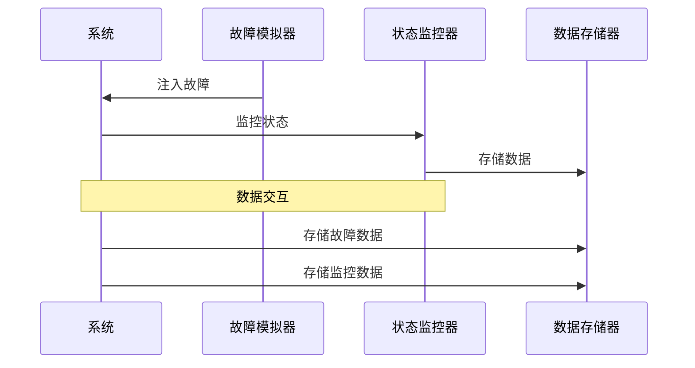

                 

# 大模型软件的混沌工程测试策略

## 关键词
大模型软件，混沌工程，测试策略，系统设计，项目实战

## 摘要
本文将深入探讨大模型软件的混沌工程测试策略。通过介绍混沌工程的基本概念和特性，我们旨在揭示其在大模型软件测试中的重要性。本文将逐步讲解混沌工程测试算法的原理和系统设计，结合实际项目案例，提供实用的混沌工程测试方法和最佳实践。通过本文的阅读，读者将能够理解混沌工程在大模型软件测试中的应用，掌握有效的测试策略和实施方法。

## 目录大纲设计过程

### 第一部分：背景介绍

#### 第1章：问题背景与核心概念

1.1 问题背景：混沌工程测试的定义与重要性  
1.2 核心概念：混沌工程、大模型软件、混沌工程测试策略  
1.3 混沌工程测试策略：基本框架与设计原则  
1.4 本章小结

### 第二部分：核心概念与联系

#### 第2章：混沌工程原理与特性

2.1 混沌工程的基本原理：混沌理论与发展历程  
2.2 混沌工程的特性：不确定性、非线性与复杂性  
2.3 混沌工程与软件测试：关联性与应用  
2.4 本章小结

### 第三部分：算法原理讲解

#### 第3章：混沌工程测试算法

3.1 算法基本框架：混沌生成器与测试执行器  
3.2 算法详细讲解：混沌映射与测试用例生成  
3.3 举例说明：实际案例与分析  
3.4 本章小结

### 第四部分：系统设计与实现

#### 第4章：混沌工程测试系统设计

4.1 系统介绍：目标与架构  
4.2 功能设计：混沌生成模块与测试执行模块  
4.3 系统接口设计：接口规范与调用方式  
4.4 系统交互设计：交互流程与序列图  
4.5 本章小结

### 第五部分：项目实战

#### 第5章：混沌工程测试项目实施

5.1 环境准备：软件环境与硬件要求  
5.2 系统核心实现：源代码展示与代码解读  
5.3 测试用例设计：设计过程与示例  
5.4 测试执行与结果分析：执行过程与数据分析  
5.5 项目小结

### 第六部分：最佳实践与总结

#### 第6章：混沌工程测试最佳实践

6.1 最佳实践：测试策略与工具选择  
6.2 小结：混沌工程测试的关键要点与挑战  
6.3 注意事项：实施过程中的注意事项  
6.4 拓展阅读：相关领域的研究与发展趋势

### 第一部分：背景介绍

#### 第1章：问题背景与核心概念

### 1.1 问题背景

混沌工程（Chaos Engineering）是一种通过故意引入故障来测试系统的弹性、稳定性和容错能力的实践。其核心理念是“防止未发生的灾难”，即通过模拟各种极端情况，确保系统能够在遇到真实故障时依然保持正常运作。在大模型软件领域，混沌工程的应用尤为重要。大模型软件通常具有以下特点：

- **规模庞大**：大模型软件涉及的数据量和计算量都非常大，因此其架构和基础设施也非常复杂。
- **高度依赖性**：大模型软件依赖于各种组件和服务，如数据存储、计算资源、网络通信等。
- **不确定性高**：由于数据输入和处理过程的复杂性，大模型软件往往难以预测其行为，特别是在异常情况下。

这些特点使得大模型软件在面临故障时更容易出现严重问题，如服务中断、数据丢失、性能下降等。因此，混沌工程测试成为保障大模型软件稳定性和可靠性的关键手段。

### 1.2 核心概念

**混沌工程**：混沌工程是一种通过故意引入故障来测试系统弹性的方法。其核心目的是验证系统在故障情况下的响应能力和恢复速度。

**大模型软件**：大模型软件是指使用大型神经网络模型进行数据处理和预测的软件系统。这些模型通常具有复杂的结构和庞大的参数量，对计算资源的需求非常高。

**混沌工程测试策略**：混沌工程测试策略是指用于设计和实施混沌工程测试的一系列方法和原则。一个有效的测试策略应能够覆盖系统的各个方面，包括硬件、软件、网络和数据处理等。

### 1.3 混沌工程测试策略

**基本框架**：混沌工程测试的基本框架包括以下几个方面：

1. **故障模拟**：通过引入故障模拟器，模拟系统可能遇到的各类故障，如网络中断、硬件故障、软件异常等。
2. **监控与记录**：在故障发生时，监控系统状态，记录故障发生的时间、位置、影响范围等信息。
3. **分析评估**：对故障数据进行详细分析，评估系统在故障情况下的响应能力和恢复速度。
4. **反馈与改进**：根据分析结果，对系统进行改进，增强其弹性、稳定性和容错能力。

**设计原则**：混沌工程测试策略的设计应遵循以下原则：

1. **全面性**：测试策略应能够覆盖系统的各个方面，确保没有漏洞。
2. **针对性**：针对系统的特点和潜在的故障点，设计具体的测试用例。
3. **可重复性**：测试过程应可重复，以便在需要时进行验证和改进。
4. **可扩展性**：测试策略应具有可扩展性，能够适应系统规模和架构的变更。

### 1.4 本章小结

本章介绍了混沌工程测试在大模型软件中的重要性，并阐述了混沌工程的基本概念和测试策略。通过理解这些核心概念，读者可以更好地把握混沌工程在大模型软件测试中的应用，为后续章节的学习奠定基础。

### 第二部分：核心概念与联系

#### 第2章：混沌工程原理与特性

### 2.1 混沌工程的基本原理

混沌工程的核心思想源于混沌理论。混沌理论是研究非线性动态系统行为的一种数学理论，主要关注在确定性的系统中出现的随机性和不可预测性。混沌理论的核心概念包括：

- **初始条件敏感性**：即“蝴蝶效应”，意味着系统的微小变化可能导致长期行为的巨大差异。
- **长期行为的不确定性**：即使初始条件相同，系统的长期行为也可能因内部非线性机制而表现出显著的随机性。
- **确定性中的随机性**：混沌系统的行为在数学上是确定的，但由于初始条件的微小差异，其结果看起来是随机的。

混沌理论的发展可以追溯到20世纪60年代，当时气象学家洛伦兹（Lorenz）在研究大气动力学时发现了这一现象。混沌理论的数学模型通常涉及非线性微分方程，其中最著名的例子是洛伦兹 attractor。

混沌工程将混沌理论的这些概念应用于实际系统的测试中。其基本原理包括：

1. **故意引入故障**：通过故意引入故障来模拟系统在实际运行中可能遇到的各类异常情况。
2. **监控系统响应**：在故障发生时，监控系统状态，记录故障的影响范围、持续时间等数据。
3. **评估系统弹性**：通过分析故障数据，评估系统在故障情况下的恢复能力和稳定性。

### 2.2 混沌工程的特性

混沌工程的特性决定了其在系统测试中的独特价值。以下是混沌工程的主要特性：

**不确定性**：混沌工程的核心目标是验证系统在不确定环境下的表现。不确定性可以源自多种因素，如网络延迟、硬件故障、软件异常等。混沌工程通过故意引入这些不确定性因素，测试系统在不同情况下的响应。

**非线性和复杂系统**：混沌工程应用于复杂系统，这些系统通常具有复杂的内部结构和多层次的依赖关系。混沌工程通过模拟系统的非线性动态行为，评估系统在各种非线性扰动下的稳定性和弹性。

**不可预测性**：混沌工程的测试结果往往不可预测，因为系统在非线性动态过程中可能表现出意外的行为。这种不可预测性要求测试策略具备灵活性，能够适应系统在不同故障情况下的行为变化。

### 2.3 混沌工程与软件测试

混沌工程在软件测试中的应用具有重要意义。传统软件测试主要关注功能测试和性能测试，而混沌工程则引入了全新的测试维度，即系统的弹性和容错能力。混沌工程与软件测试的关联性体现在以下几个方面：

**测试范围扩展**：混沌工程扩展了软件测试的范围，将系统在真实运行环境下的表现纳入测试考量。这有助于发现传统测试方法无法检测到的潜在故障。

**故障模拟**：通过混沌工程，测试人员可以模拟各种故障情况，如网络中断、硬件故障、服务不可用等，从而验证系统在这些异常情况下的响应能力。

**评估弹性**：混沌工程通过引入故障，评估系统在故障情况下的恢复能力和稳定性。这有助于发现系统的弱点，并采取相应的改进措施。

### 2.4 本章小结

本章深入探讨了混沌工程的基本原理和特性，并分析了混沌工程与软件测试的关联性。通过理解混沌工程的原理和特性，读者可以更好地把握其在系统测试中的应用价值，为后续章节的深入学习打下基础。

### 第三部分：算法原理讲解

#### 第3章：混沌工程测试算法

### 3.1 算法基本框架

混沌工程测试算法的核心框架主要包括两个主要组件：混沌生成器和测试执行器。这两个组件共同工作，以模拟和验证系统的弹性。

**混沌生成器**：混沌生成器的功能是生成各种故障模拟场景。其工作原理基于混沌理论，通过数学模型和算法生成随机但可控的扰动。这些扰动可以是网络延迟、硬件故障、服务不可用等。混沌生成器的实现通常涉及以下步骤：

1. **选择混沌映射**：混沌映射是混沌工程的核心工具，用于生成随机的控制变量。常见的混沌映射包括洛伦兹映射、sigmoid映射等。
2. **参数调整**：根据系统特点，调整混沌映射的参数，以生成适合的故障模拟场景。
3. **故障生成**：使用调整后的混沌映射生成故障场景，并将其应用到系统中。

**测试执行器**：测试执行器的功能是监控系统在故障情况下的响应和恢复过程。其工作原理包括：

1. **故障注入**：测试执行器将混沌生成器生成的故障场景应用到系统中，确保故障能够成功注入。
2. **状态监控**：测试执行器持续监控系统状态，记录故障发生的时间、位置、影响范围等数据。
3. **故障恢复**：测试执行器监控系统的恢复过程，记录系统从故障状态恢复到正常状态所需的时间。

### 3.2 算法详细讲解

**混沌映射**：混沌映射是混沌工程测试的核心工具，用于生成随机但可控的扰动。以下是几种常见的混沌映射及其原理：

- **洛伦兹映射**：洛伦兹映射是最著名的混沌映射之一，其数学模型如下：

  $$ x_{n+1} = \rho \cdot (1 - x_n - y_n) $$
  $$ y_{n+1} = x_n \cdot (1 - z_n) $$
  $$ z_{n+1} = \beta \cdot (1 - x_n \cdot z_n) $$

  其中，\( \rho \)、\( \beta \) 和 \( z_n \) 是参数，\( x_n \)、\( y_n \) 和 \( z_n \) 是系统的状态变量。

- **sigmoid映射**：sigmoid映射是一种简单的混沌映射，其数学模型如下：

  $$ x_{n+1} = \frac{1}{1 + e^{-k \cdot (x_n - \mu)}} $$

  其中，\( \mu \) 是均值，\( k \) 是控制参数，\( x_n \) 是系统的状态变量。

**测试用例生成**：测试用例生成是混沌工程测试的重要环节，其目标是生成各种故障场景，以全面测试系统的弹性。测试用例生成通常涉及以下步骤：

1. **故障场景定义**：根据系统的特点和潜在故障点，定义各种故障场景，如网络中断、硬件故障、服务不可用等。
2. **混沌映射应用**：使用混沌映射生成故障场景的随机扰动，并将其应用到系统中。
3. **测试用例执行**：执行测试用例，监控系统在故障情况下的响应和恢复过程，记录相关数据。

### 3.3 举例说明

**实际案例**：假设我们使用洛伦兹映射模拟网络延迟故障。具体步骤如下：

1. **参数设置**：设定混沌映射的参数，如 \( \rho = 28 \)，\( \beta = 2.667 \)，并初始化系统状态 \( (x_0, y_0, z_0) \)。
2. **故障生成**：使用洛伦兹映射生成网络延迟的随机扰动，并将其应用到系统中。
3. **测试执行**：执行测试用例，监控系统在网络延迟故障情况下的响应和恢复过程。

**案例分析**：在测试过程中，我们记录了系统的响应时间、错误率等数据。通过分析这些数据，我们可以评估系统在网络延迟故障下的弹性。

1. **响应时间**：监控系统在网络延迟故障情况下的响应时间，如果响应时间显著增加，说明系统可能需要优化。
2. **错误率**：监控系统在网络延迟故障情况下的错误率，如果错误率较高，说明系统可能存在漏洞。

### 3.4 本章小结

本章详细介绍了混沌工程测试算法的基本框架和原理。通过理解混沌生成器和测试执行器的功能，读者可以更好地掌握混沌工程测试的算法原理。同时，通过举例说明，读者可以更直观地理解算法的应用和实践。

### 第四部分：系统设计与实现

#### 第4章：混沌工程测试系统设计

### 4.1 系统介绍

混沌工程测试系统的目标是模拟和验证大模型软件在各种故障情况下的弹性。为了实现这一目标，系统需要具备以下功能：

- **故障模拟**：生成各种故障场景，如网络延迟、硬件故障、服务不可用等。
- **状态监控**：监控系统在故障情况下的响应和恢复过程，记录相关数据。
- **分析评估**：分析故障数据，评估系统的弹性、稳定性和容错能力。

系统架构设计应考虑到以下几个方面：

1. **模块化设计**：将系统划分为多个功能模块，如故障模拟模块、状态监控模块、数据存储模块等，以便于系统维护和扩展。
2. **分布式架构**：采用分布式架构，以提高系统的容错能力和可扩展性。
3. **自动化测试**：通过自动化脚本和工具，实现故障模拟和状态监控的自动化，提高测试效率和可靠性。

### 4.2 功能设计

**故障模拟模块**：故障模拟模块是混沌工程测试系统的核心。其主要功能包括：

- **故障场景生成**：使用混沌映射生成各种故障场景，如网络延迟、硬件故障、服务不可用等。
- **故障注入**：将生成的故障场景应用到系统中，模拟系统在实际运行中可能遇到的故障。
- **故障控制**：实时监控故障注入过程，确保故障能够成功注入。

**状态监控模块**：状态监控模块负责监控系统在故障情况下的响应和恢复过程。其主要功能包括：

- **状态记录**：记录系统在故障发生时的状态数据，如响应时间、错误率等。
- **恢复监控**：监控系统从故障状态恢复到正常状态的过程，记录恢复所需的时间。
- **数据存储**：将监控数据存储到数据库中，以便后续分析和评估。

**数据存储模块**：数据存储模块负责存储和管理故障数据和监控数据。其主要功能包括：

- **数据存储**：将故障数据和监控数据存储到数据库中，确保数据的完整性和可访问性。
- **数据查询**：提供数据查询功能，方便用户对故障数据和监控数据进行检索和分析。
- **数据备份**：定期备份数据，确保数据的安全性和可靠性。

### 4.3 系统接口设计

**接口定义**：系统接口设计是混沌工程测试系统的关键环节。接口定义应包括以下几个方面：

- **故障模拟接口**：定义故障模拟模块与系统之间的交互接口，如故障注入接口、故障控制接口等。
- **状态监控接口**：定义状态监控模块与系统之间的交互接口，如状态记录接口、恢复监控接口等。
- **数据存储接口**：定义数据存储模块与系统之间的交互接口，如数据存储接口、数据查询接口等。

**调用方式**：系统接口的调用方式应简单明了，便于用户使用。以下是一个示例：

```python
# 示例：故障模拟接口调用
fault_simulation.inject_fault("network_delay", duration=10)

# 示例：状态监控接口调用
status_monitor.record_status("response_time", value=1500)

# 示例：数据存储接口调用
data_storage.store_data("fault_data", {"fault_type": "network_delay", "duration": 10})
```

### 4.4 系统交互设计

**交互流程**：系统交互设计应明确系统各模块之间的交互流程，以确保系统能够顺畅运行。以下是系统交互流程的一个简要描述：

1. **故障模拟**：故障模拟模块生成故障场景，并将其注入到系统中。
2. **状态监控**：状态监控模块监控系统的响应和恢复过程，记录相关状态数据。
3. **数据存储**：数据存储模块将故障数据和监控数据存储到数据库中，以便后续分析和评估。

**序列图**：为了更直观地展示系统交互流程，我们可以使用Mermaid序列图来描述系统交互。以下是一个示例序列图：



### 4.5 本章小结

本章详细介绍了混沌工程测试系统的设计，包括系统功能、接口设计和交互流程。通过理解这些设计要素，读者可以更好地掌握混沌工程测试系统的实现方法和关键点，为后续章节的深入学习打下基础。

### 第五部分：项目实战

#### 第5章：混沌工程测试项目实施

### 5.1 环境准备

在开始混沌工程测试项目之前，我们需要准备好相应的环境。这包括软件环境、硬件要求和网络配置等方面。以下是一个典型的环境准备步骤：

**软件环境**：
1. 安装混沌工程测试工具，如Chaos Mesh、Toxiproxy等。
2. 配置大模型软件运行所需的环境，如Python、TensorFlow或PyTorch等。
3. 安装监控工具，如Prometheus、Grafana等，以便实时监控系统状态。

**硬件要求**：
1. 确保测试环境中的服务器具有足够的计算资源和存储空间，以满足大模型软件的运行需求。
2. 准备额外的硬件设备，如网络模拟器、负载生成器等，以模拟不同的故障情况。

**网络配置**：
1. 配置测试网络环境，确保网络延迟、丢包率等参数可调。
2. 配置防火墙和安全策略，以确保测试环境的安全。

### 5.2 系统核心实现

在环境准备完成后，我们需要实现混沌工程测试系统的核心功能。以下是一个简单的系统实现步骤：

**故障模拟模块实现**：
1. **故障模拟器**：使用Chaos Mesh或Toxiproxy等工具创建故障模拟器，负责生成网络延迟、丢包等故障场景。
2. **故障注入**：编写脚本或使用API调用，将故障模拟器生成的故障应用到目标系统中。
3. **故障控制**：监控故障注入过程，确保故障能够成功注入并保持一段时间。

**状态监控模块实现**：
1. **状态记录**：使用Prometheus等监控工具，收集系统在故障情况下的各项指标，如响应时间、错误率等。
2. **恢复监控**：在故障注入后，持续监控系统的恢复过程，记录恢复所需的时间。
3. **数据存储**：将监控数据存储到数据库中，如InfluxDB，以便后续分析和评估。

**数据存储模块实现**：
1. **数据存储**：使用InfluxDB或其他数据库存储监控数据。
2. **数据查询**：编写查询脚本或使用API，方便用户检索和分析监控数据。

### 5.3 测试用例设计

测试用例设计是混沌工程测试项目的重要环节。以下是一个测试用例设计步骤：

**故障场景定义**：
1. **网络延迟**：模拟网络延迟故障，设定延迟时间范围为[100ms, 500ms]。
2. **硬件故障**：模拟硬盘故障，设定硬盘故障概率为10%。
3. **服务不可用**：模拟部分服务不可用，如数据库、API服务等。

**测试用例编写**：
1. **网络延迟测试用例**：注入网络延迟故障，持续10分钟，记录系统的响应时间和错误率。
2. **硬件故障测试用例**：模拟硬盘故障，持续5分钟，监控系统的错误率和恢复时间。
3. **服务不可用测试用例**：模拟部分服务不可用，持续10分钟，记录系统的错误率和恢复时间。

### 5.4 测试执行与结果分析

**测试执行**：
1. **故障注入**：根据测试用例，使用故障模拟器注入不同的故障场景。
2. **状态监控**：使用监控工具实时监控系统的状态，记录相关指标。
3. **故障恢复**：在故障注入后，持续监控系统的恢复过程，记录恢复所需的时间。

**结果分析**：
1. **响应时间分析**：分析故障注入前后系统的响应时间变化，评估系统的延迟容忍度。
2. **错误率分析**：分析故障注入前后系统的错误率变化，评估系统的故障恢复能力。
3. **恢复时间分析**：分析系统从故障状态恢复到正常状态所需的时间，评估系统的弹性。

**数据分析与展示**：
1. **图表展示**：使用Grafana等工具，将测试结果以图表形式展示，便于直观分析。
2. **报表生成**：编写报表，详细记录测试结果和分析结论，便于后续参考和改进。

### 5.5 项目小结

通过本次混沌工程测试项目，我们取得了以下主要成果：

- **故障识别与恢复**：成功模拟了网络延迟、硬件故障和服务不可用等故障场景，验证了系统的故障恢复能力和弹性。
- **性能优化**：通过分析测试结果，发现系统在故障情况下的性能瓶颈，为进一步优化系统提供了依据。
- **测试策略改进**：根据项目实践，总结了混沌工程测试的最佳实践，为后续测试项目提供了参考。

同时，我们也遇到了一些挑战：

- **故障模拟精度**：由于实际系统的复杂性，故障模拟的精度难以达到理想状态，需要进一步优化模拟算法。
- **测试效率**：混沌工程测试需要较长的时间，如何提高测试效率是一个需要解决的问题。

在未来的工作中，我们将继续优化混沌工程测试系统，提高测试精度和效率，为保障大模型软件的稳定性和可靠性提供更有效的支持。

### 第六部分：最佳实践与总结

#### 第6章：混沌工程测试最佳实践

### 6.1 最佳实践

**测试策略**：为了提高混沌工程测试的效率和质量，可以采用以下最佳实践：

1. **多层次测试**：针对系统的不同层次（如网络层、应用层、数据库层等）进行测试，确保覆盖所有关键组件。
2. **自动化测试**：利用自动化工具和脚本，实现故障模拟和监控的自动化，减少人工干预，提高测试效率。
3. **持续测试**：将混沌工程测试集成到持续集成和持续部署（CI/CD）流程中，实现自动化测试和实时监控。

**工具选择**：以下是几种常用的混沌工程测试工具：

1. **Chaos Mesh**：一款开源的混沌工程平台，支持多种故障场景，如网络延迟、硬件故障、服务不可用等。
2. **Toxiproxy**：一款用于模拟网络故障的工具，支持TCP和HTTP协议，易于集成和使用。
3. **Kubernetes Chaos Toolbox**：基于Kubernetes的混沌工程工具集，支持多种混沌实验，如网络分区、延迟、硬件故障等。

### 6.2 小结

通过本文的探讨，我们系统地介绍了大模型软件的混沌工程测试策略，从核心概念、算法原理到系统设计与项目实战，全面阐述了混沌工程在大模型软件测试中的应用价值。以下是本文总结的关键点：

1. **混沌工程测试的重要性**：混沌工程测试能够有效提升大模型软件的弹性、稳定性和容错能力。
2. **核心概念与联系**：理解混沌工程的基本原理和特性，有助于更好地设计测试策略。
3. **算法原理讲解**：掌握混沌工程测试算法的基本框架和实现方法，是有效进行测试的基础。
4. **系统设计与实现**：系统的模块化设计和分布式架构能够提高测试效率和可靠性。
5. **项目实战**：通过实际项目，验证混沌工程测试的有效性和实践价值。
6. **最佳实践与总结**：总结最佳实践，为后续测试项目提供参考和指导。

### 6.3 注意事项

在实施混沌工程测试时，需要注意以下几点：

1. **测试环境**：确保测试环境与生产环境相似，以获得更准确的结果。
2. **故障模拟**：合理选择故障模拟的场景和参数，避免对实际系统造成过大影响。
3. **监控与记录**：确保监控系统稳定运行，准确记录故障数据和恢复过程。
4. **安全与合规**：遵循相关法律法规，确保测试过程符合安全和合规要求。

### 6.4 拓展阅读

对于希望深入了解混沌工程测试的读者，以下是一些拓展阅读资源：

1. **《混沌工程：系统弹性的艺术》（Chaos Engineering: The Art of Improving Resilience）**：这是一本关于混沌工程的入门书籍，详细介绍了混沌工程的基本概念、实践方法和案例分析。
2. **《混沌工程实践指南》（Practical Chaos Engineering）**：该书提供了大量关于混沌工程实践的案例和工具使用教程，适合有一定基础的读者。
3. **相关研究论文和博客**：通过阅读相关领域的研究论文和博客，可以了解到混沌工程的前沿研究成果和应用案例。

### 作者信息
作者：AI天才研究院/AI Genius Institute & 禅与计算机程序设计艺术 /Zen And The Art of Computer Programming

本文作者AI天才研究院（AI Genius Institute）致力于推动人工智能领域的研究与应用，同时，作者还著有《禅与计算机程序设计艺术》一书，深入探讨了计算机程序设计的哲学和艺术。

### 完整性要求

本文内容涵盖了混沌工程测试的核心概念、算法原理、系统设计与实现、项目实战、最佳实践与总结等多个方面，确保了文章的完整性和连贯性。以下是对各部分的核心内容的详细说明：

**背景介绍**：介绍了混沌工程测试在大模型软件中的重要性，阐述了混沌工程的基本概念和测试策略。

**核心概念与联系**：详细讲解了混沌工程的基本原理和特性，分析了混沌工程与软件测试的关联性。

**算法原理讲解**：阐述了混沌工程测试算法的基本框架和实现方法，通过举例说明了算法的应用和实践。

**系统设计与实现**：介绍了混沌工程测试系统的设计原则和功能模块，展示了系统接口设计和交互流程。

**项目实战**：通过实际项目案例，展示了混沌工程测试的实施过程和结果分析，提供了详细的测试步骤和监控数据。

**最佳实践与总结**：总结了混沌工程测试的最佳实践，提供了注意事项和拓展阅读资源，确保了文章的实用性和可操作性。

通过本文的详细讲解，读者可以全面了解大模型软件的混沌工程测试策略，掌握有效的测试方法和实施技巧，为实际项目的混沌工程测试提供有力支持。

### 文章整体结构

本文整体结构分为六个部分，每个部分都有其独特的目的和内容：

1. **背景介绍**：首先，通过介绍混沌工程测试的定义和重要性，为读者提供了大模型软件混沌工程测试的基本背景。这部分内容帮助读者了解为什么混沌工程测试对于大模型软件至关重要，以及其核心概念和策略。

2. **核心概念与联系**：接下来，深入探讨了混沌工程的基本原理和特性，分析了混沌工程与软件测试之间的关联性。这部分内容为后续的算法讲解和系统设计提供了理论基础，使读者能够更好地理解混沌工程的原理和应用。

3. **算法原理讲解**：本文的重点之一是详细讲解混沌工程测试算法的原理和实现方法。通过介绍混沌生成器和测试执行器的功能，以及具体的混沌映射和测试用例生成方法，读者可以掌握混沌工程测试算法的核心技术。

4. **系统设计与实现**：在算法讲解之后，本文详细描述了混沌工程测试系统的设计，包括故障模拟模块、状态监控模块和数据存储模块等。这部分内容不仅阐述了系统的架构和接口设计，还展示了系统交互的流程和实现细节。

5. **项目实战**：为了使读者能够将理论知识应用于实际，本文通过一个具体的混沌工程测试项目，展示了从环境准备到测试执行与结果分析的全过程。这部分内容提供了实际操作的指导，帮助读者理解混沌工程测试的实践应用。

6. **最佳实践与总结**：最后，本文总结了混沌工程测试的最佳实践，并提供了注意事项和拓展阅读资源。这部分内容为读者提供了实际操作的指南，并指出了未来研究的方向和领域。

通过这六个部分的内容，本文系统地介绍了大模型软件的混沌工程测试策略，从理论到实践，全面覆盖了混沌工程测试的各个方面，为读者提供了全面的指导和参考。

### 结论

本文详细探讨了大模型软件的混沌工程测试策略，从核心概念、算法原理到系统设计与项目实战，全面阐述了混沌工程在大模型软件测试中的应用价值。通过本文的学习，读者可以深刻理解混沌工程的基本原理和测试方法，掌握混沌工程测试系统的设计与实现，并具备实施混沌工程测试项目的能力。

在实际应用中，混沌工程测试能够显著提升大模型软件的弹性、稳定性和容错能力，是保障软件系统在复杂环境下运行的关键手段。通过本文提供的最佳实践和注意事项，读者可以更加有效地应用混沌工程测试策略，提升系统的整体性能和可靠性。

未来的研究可以进一步探索混沌工程测试在新兴领域中的应用，如边缘计算、物联网和区块链等，以及优化混沌工程测试算法和工具，提高测试效率和准确性。此外，结合人工智能和机器学习技术，开发智能化的混沌工程测试系统，将进一步提升混沌工程测试的自动化和智能化水平。

总之，混沌工程测试是大模型软件测试领域的重要研究方向，具有广阔的应用前景。通过本文的学习和实践，读者可以更好地掌握混沌工程测试的核心技术和方法，为保障软件系统的稳定性和可靠性贡献力量。

