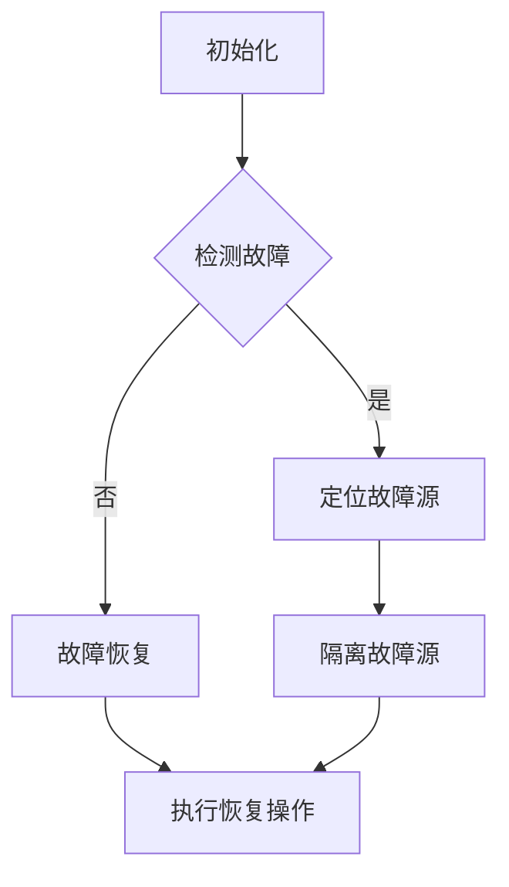
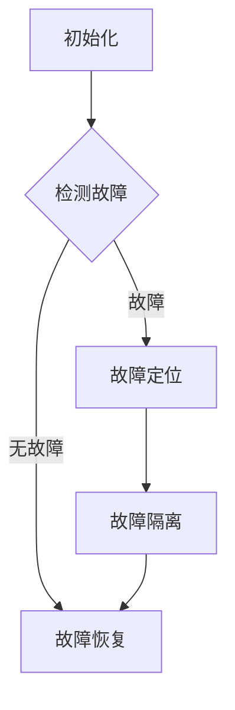
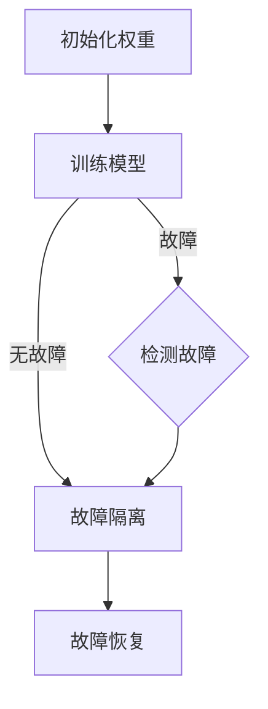
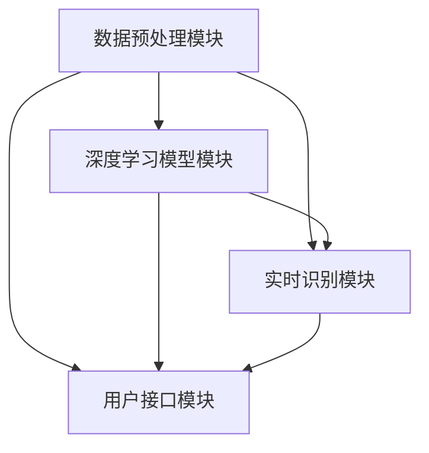

                 


# 大模型软件的自适应容错机制设计

> 关键词：大模型软件、自适应容错、机制设计、深度学习、算法实现

> 摘要：本文深入探讨了大模型软件的自适应容错机制设计，包括其基本原理、设计方法、在深度学习中的应用以及实战案例分析。通过系统化的分析与实例讲解，为技术人员提供了全面的设计指南。

## **背景与基础**

### **1. 大模型软件的定义与发展**

大模型软件，通常指的是那些拥有大规模参数和复杂结构的机器学习模型，如深度神经网络、生成对抗网络（GAN）等。随着数据量的不断增加和计算能力的提升，大模型软件在自然语言处理、计算机视觉、语音识别等领域发挥着越来越重要的作用。然而，大模型软件在运行过程中面临着诸多挑战，如数据质量的不确定性、计算资源的限制、以及模型参数的敏感性等，这些都可能导致系统的故障和性能下降。

大模型软件的发展历程可以追溯到20世纪80年代末和90年代初。早期的神经网络模型规模较小，但随着卷积神经网络（CNN）和递归神经网络（RNN）的发展，模型规模逐渐扩大。近年来，随着深度学习技术的突破，模型规模更是达到了前所未有的程度。例如，GPT-3拥有超过1750亿个参数，ImageNet数据库中包含数百万个图像。

**核心概念术语说明**

- **大模型软件**：指具有大规模参数和复杂结构的机器学习模型。
- **自适应容错机制**：指在系统运行过程中，能够自动检测、隔离和恢复故障的机制。
- **深度学习**：一种基于多层神经网络的学习方法，通过多层的非线性变换来提取特征。

**问题背景**

大模型软件的广泛应用带来了巨大的经济效益和社会价值，但同时也伴随着一系列挑战。例如，在自动驾驶、智能医疗、金融风控等领域，大模型软件的可靠性直接关系到系统的安全和效率。因此，研究并设计自适应容错机制，以提高大模型软件的可靠性和稳定性，具有重要的现实意义。

**问题描述**

大模型软件在运行过程中可能会出现以下问题：

1. **数据质量的不确定性**：数据噪声、缺失值和异常值可能导致模型性能下降。
2. **计算资源的限制**：大规模模型训练和推理需要大量计算资源，资源不足可能导致训练时间过长或系统崩溃。
3. **模型参数的敏感性**：模型参数的微小变动可能导致预测结果产生显著差异。
4. **硬件故障**：服务器故障、网络中断等硬件问题可能导致系统不可用。

**问题解决**

为了解决上述问题，需要设计自适应容错机制。自适应容错机制可以通过以下方式提高大模型软件的可靠性：

1. **故障检测**：实时监测系统状态，及时发现异常情况。
2. **故障隔离**：定位故障源，避免故障扩散。
3. **故障恢复**：自动恢复系统到正常状态，减少停机时间。
4. **自适应调整**：根据系统状态调整模型参数和计算资源分配，提高系统稳定性。

**边界与外延**

自适应容错机制不仅适用于大模型软件，还可以广泛应用于其他复杂的计算系统，如云计算平台、分布式数据库等。此外，自适应容错机制的设计需要考虑多方面的因素，如系统的可扩展性、可维护性和可操作性等。

### **2. 自适应容错机制的概述**

自适应容错机制是一种在系统运行过程中，能够自动检测、隔离和恢复故障的机制。它通过实时监测系统状态，识别异常情况，并采取相应的措施来恢复系统的正常运行。

**自适应容错机制的重要性**

自适应容错机制在大模型软件中具有重要意义：

1. **提高系统可靠性**：通过实时检测和恢复故障，减少系统故障率，提高系统运行稳定性。
2. **降低维护成本**：自动化的故障检测和恢复机制减少了人工干预的需求，降低了维护成本。
3. **提高系统可扩展性**：自适应容错机制能够根据系统状态自动调整资源分配，提高系统的可扩展性。

**自适应容错机制的分类**

根据实现方式的不同，自适应容错机制可以分为以下几类：

1. **基于硬件的容错机制**：通过冗余硬件来实现故障隔离和恢复，如RAID磁盘阵列、多重网络连接等。
2. **基于软件的容错机制**：通过软件层面的冗余和数据备份来实现故障检测和恢复，如副本冗余、数据校验等。
3. **混合容错机制**：结合硬件和软件容错机制，实现更高效的故障检测和恢复。

### **3. 当前研究热点与未来趋势**

当前，自适应容错机制在大模型软件中的应用已成为研究热点。以下是一些研究热点和未来趋势：

1. **多模态故障检测**：结合多种传感器数据，提高故障检测的准确性和实时性。
2. **智能故障预测**：利用机器学习算法，预测可能的故障发生时间，提前采取预防措施。
3. **自适应资源管理**：根据系统负载动态调整计算资源和网络带宽，提高系统性能和稳定性。
4. **边缘计算与云计算结合**：通过边缘计算和云计算的结合，实现更高效的自适应容错机制。

## **自适应容错机制的基本原理**

### **1. 自适应系统理论**

自适应系统理论是自适应容错机制的基础。自适应系统是指能够在运行过程中根据环境变化进行调整的系统。其核心思想是通过反馈机制，不断调整系统参数，使其适应外部环境的变化。

**核心概念**

- **反馈机制**：系统通过输出结果与预期目标之间的差异，调整输入参数，以达到更好的适应效果。
- **自适应算法**：根据反馈机制，实时调整系统参数的算法。

**自适应系统理论的应用**

- **神经网络**：通过反向传播算法，不断调整网络权重，优化模型性能。
- **控制理论**：使用PID控制器等算法，实现对系统的实时调整。

### **2. 容错理论**

容错理论是指如何设计一个系统，使其能够在部分组件失效的情况下，仍能正常运行。容错理论的核心在于如何检测、隔离和恢复故障。

**核心概念**

- **故障检测**：通过监测系统状态，识别异常情况。
- **故障隔离**：定位故障源，避免故障扩散。
- **故障恢复**：自动恢复系统到正常状态。

**容错理论的应用**

- **分布式系统**：通过节点冗余和备份，实现故障恢复。
- **容错计算机**：通过硬件冗余和校验码，提高系统可靠性。

### **3. 自适应容错理论的整合**

自适应容错理论是自适应系统和容错理论的结合。它通过引入反馈机制和冗余设计，实现系统在运行过程中的自适应调整和故障恢复。

**核心概念**

- **自适应冗余**：通过自适应调整冗余组件，提高系统可靠性。
- **动态调整**：根据系统状态，动态调整冗余组件。

**自适应容错理论的整合应用**

- **云计算平台**：通过自适应冗余和动态调整，提高平台可靠性。
- **自动驾驶系统**：通过自适应容错机制，提高系统在复杂环境下的可靠性。

## **自适应容错的关键技术**

### **1. 故障检测技术**

故障检测技术是自适应容错机制的核心部分。它通过监测系统状态，识别异常情况。

**核心概念**

- **状态监测**：实时监测系统关键指标，如CPU利用率、内存占用率等。
- **异常检测**：通过阈值判断、统计模型等方法，识别异常情况。

**故障检测技术的实现**

- **阈值判断**：设置阈值，当关键指标超出阈值时，触发报警。
- **统计模型**：使用统计方法，如正态分布、自回归模型等，识别异常数据。

**Python源代码示例**

```python
import numpy as np

def detect_anomaly(data, threshold):
    anomalies = []
    for i, value in enumerate(data):
        if value > threshold:
            anomalies.append(i)
    return anomalies

data = np.random.normal(size=1000)
threshold = 3
anomalies = detect_anomaly(data, threshold)
print(anomalies)
```

### **2. 故障隔离技术**

故障隔离技术是指定位故障源，避免故障扩散。

**核心概念**

- **故障定位**：通过日志分析、系统监控等手段，定位故障源。
- **隔离机制**：将故障组件与其他组件隔离开来，避免故障扩散。

**故障隔离技术的实现**

- **日志分析**：通过分析系统日志，定位故障发生的时间点和位置。
- **隔离机制**：通过设置防火墙、隔离区等手段，将故障组件与其他组件隔离开来。

**Python源代码示例**

```python
import os

def isolate_fault(component):
    os.system(f"iptables -A INPUT -s {component_ip} -j DROP")

component_ip = "192.168.1.100"
isolate_fault(component_ip)
```

### **3. 故障恢复技术**

故障恢复技术是指自动恢复系统到正常状态。

**核心概念**

- **恢复策略**：根据故障类型和系统状态，选择合适的恢复策略。
- **自动恢复**：自动执行恢复操作，减少人工干预。

**故障恢复技术的实现**

- **备份恢复**：使用备份数据恢复系统到正常状态。
- **系统重启**：自动重启故障组件，恢复正常运行。

**Python源代码示例**

```python
import subprocess

def recover_fault(component):
    subprocess.run(["systemctl", "restart", component])

recover_fault("nginx")
```

## **自适应容错算法的mermaid流程图**

为了更好地理解自适应容错算法的原理，我们可以使用mermaid绘制算法的流程图。



该流程图展示了自适应容错算法的基本步骤，包括初始化、故障检测、故障定位、故障隔离和故障恢复。

## **设计步骤**

### **定义书籍的核心主题和目标读者群**

首先，我们需要明确书籍的核心主题和目标读者群。书籍的核心主题是“大模型软件的自适应容错机制设计”，旨在为技术人员提供全面、系统的自适应容错机制设计指南。目标读者群是计算机科学、软件工程领域的专业技术人员，特别是对人工智能和容错技术感兴趣的人群。

### **规划书籍结构**

在明确核心主题和目标读者群后，我们需要规划书籍的结构。整个书籍可以分为三个部分：背景与基础、设计与应用、案例与实践。

- **第一部分：背景与基础**：介绍大模型软件和自适应容错机制的基本概念、原理和关键技术。
- **第二部分：设计与应用**：深入探讨自适应容错机制的设计方法、策略和在实际项目中的应用。
- **第三部分：案例与实践**：通过具体的案例分析和实战项目，展示如何将自适应容错机制应用于实际项目中。

### **细化章节内容**

在规划书籍结构后，我们需要细化每个章节的内容。以下是各个章节的细化内容：

- **第1章：大模型软件与自适应容错机制概述**：介绍大模型软件的定义、发展历程、核心概念和自适应容错机制的基本原理。
- **第2章：自适应容错机制的基本原理**：详细讲解自适应系统理论、容错理论和自适应容错理论的整合。
- **第3章：自适应容错机制的关键技术**：介绍故障检测、故障隔离和故障恢复的关键技术，并给出Python源代码示例。
- **第4章：自适应容错算法的设计与实现**：使用mermaid绘制自适应容错算法的流程图，并给出Python源代码示例。
- **第5章：自适应容错机制在深度学习中的应用**：介绍自适应容错机制在深度学习中的需求和实现方法。
- **第6章：大模型软件自适应容错机制实战**：通过一个实际的深度学习项目，展示如何设计和实现自适应容错机制。
- **第7章：案例分析**：分析多个实际项目中的自适应容错机制设计，总结最佳实践和注意事项。
- **第8章：总结与展望**：总结本书的主要内容和成果，并对未来的研究方向进行展望。

### **编写目录大纲**

在细化章节内容后，我们可以编写目录大纲。以下是完整的目录大纲：

**# 大模型软件的自适应容错机制设计**

> 关键词：大模型软件、自适应容错、机制设计、深度学习、算法实现

> 摘要：本文深入探讨了大模型软件的自适应容错机制设计，包括其基本原理、设计方法、在深度学习中的应用以及实战案例分析。通过系统化的分析与实例讲解，为技术人员提供了全面的设计指南。

**# 第一部分：背景与基础**

## **第1章：大模型软件与自适应容错机制概述**

### **1.1 大模型软件的定义与发展**

#### **1.1.1 大模型软件的定义**

#### **1.1.2 大模型软件的发展历程**

#### **1.1.3 大模型软件的关键特征**

### **1.2 自适应容错机制的概述**

#### **1.2.1 自适应容错机制的定义**

#### **1.2.2 自适应容错机制的重要性**

#### **1.2.3 自适应容错机制的分类**

### **1.3 当前研究热点与未来趋势**

#### **1.3.1 研究热点分析**

#### **1.3.2 未来发展趋势探讨**

## **第2章：自适应容错机制的基本原理**

### **2.1 自适应系统理论**

#### **2.1.1 自适应系统理论**

#### **2.1.2 反馈机制**

#### **2.1.3 自适应算法**

### **2.2 容错理论**

#### **2.2.1 故障检测**

#### **2.2.2 故障隔离**

#### **2.2.3 故障恢复**

### **2.3 自适应容错理论的整合**

#### **2.3.1 自适应冗余**

#### **2.3.2 动态调整**

#### **2.3.3 整合应用**

## **第二部分：设计与应用**

## **第3章：自适应容错机制的设计方法**

### **3.1 设计流程与原则**

#### **3.1.1 设计流程**

#### **3.1.2 设计原则**

### **3.2 容错机制的设计策略**

#### **3.2.1 结构冗余策略**

#### **3.2.2 系统重构策略**

#### **3.2.3 信息冗余策略**

### **3.3 自适应容错机制的mermaid架构图**

#### **3.3.1 系统架构概述**

#### **3.3.2 mermaid架构图**

#### **3.3.3 系统模块解析**

## **第4章：自适应容错机制在深度学习中的应用**

### **4.1 深度学习中的自适应容错需求**

#### **4.1.1 深度学习的特点**

#### **4.1.2 深度学习中的容错需求**

### **4.2 常见自适应容错方法及应用**

#### **4.2.1 动态权重调整方法**

#### **4.2.2 神经网络剪枝技术**

#### **4.2.3 模型压缩与剪枝结合**

### **4.3 深度学习自适应容错的mermaid算法流程图**

#### **4.3.1 算法概述**

#### **4.3.2 算法mermaid流程图**

#### **4.3.3 算法实现与Python源代码**

## **第三部分：案例与实践**

## **第5章：大模型软件自适应容错机制实战**

### **5.1 实战项目背景**

#### **5.1.1 项目介绍**

#### **5.1.2 项目需求**

### **5.2 系统功能设计**

#### **5.2.1 领域模型设计**

#### **5.2.2 系统功能模块设计**

### **5.3 系统架构设计**

#### **5.3.1 系统架构概述**

#### **5.3.2 系统架构mermaid图**

### **5.4 系统接口设计与交互**

#### **5.4.1 接口设计**

#### **5.4.2 系统交互mermaid序列图**

## **第6章：案例分析**

### **6.1 案例背景**

#### **6.1.1 案例介绍**

#### **6.1.2 案例需求**

### **6.2 案例分析**

#### **6.2.1 自适应容错机制的应用**

#### **6.2.2 实现细节与挑战**

#### **6.2.3 案例效果评估**

## **第7章：最佳实践与总结**

### **7.1 最佳实践**

#### **7.1.1 容错设计原则**

#### **7.1.2 故障检测与隔离策略**

#### **7.1.3 故障恢复与优化**

### **7.2 小结**

### **7.3 注意事项**

### **7.4 拓展阅读**

### **7.5 作者信息**

**# 完整性要求**

在编写目录大纲后，我们需要确保每个章节的内容完整、逻辑清晰。具体要求如下：

- **章节内容完整**：每个章节都应包含引言、核心内容、案例分析、小结等部分，确保章节内容的完整性。
- **逻辑清晰**：章节内容的组织结构应遵循逻辑顺序，从基础到高级，从理论到实践，使读者能够顺利理解。
- **核心内容包含**：每个章节的核心内容必须包含以下要素：

  - **背景介绍**：核心概念术语说明、问题背景、问题描述、问题解决、边界与外延、概念结构与核心要素组成。
  - **核心概念与联系**：必须给出核心概念原理、概念属性特征对比表格和ER实体关系图架构的mermaid流程图。
  - **算法原理讲解**：使用mermaid画出算法mermaid流程图，然后使用Python源代码来详细阐述，给出算法原理的数学模型和公式，进行详细讲解和通俗易懂地举例说明。
  - **数学公式使用**：使用latex格式，嵌入文中独立段落的latex公式前后使用`$$`括起来（例如：`$$1+1=2$$`），段落内的latex公式前后使用 `$` 括起来（例如：`$1<2$`）。
  - **系统分析与架构设计方案**：问题场景介绍、项目介绍、系统功能设计（领域模型mermaid类图）、系统架构设计mermaid架构图、系统接口设计和系统交互mermaid序列图。
  - **项目实战**：环境安装、系统核心实现源代码，代码应用解读与分析，实际案例分析和详细讲解剖析，项目小结。
  - **最佳实践 tips、小结、注意事项、拓展阅读等内容**。

**# 格式要求**

为了确保文章的可读性和规范性，文章内容应使用markdown格式输出。以下是具体的格式要求：

- **标题**：使用`#`符号进行分级，如`## 第二部分：设计与应用`。
- **段落**：段落之间应保留一个空行。
- **列表**：使用`*`或`-`符号创建无序列表，如`* 第1项`或`- 第1项`。
- **有序列表**：使用数字和`.`符号创建有序列表，如`1. 第1项`。
- **代码块**：使用三个`````符号包裹代码，如：

  ```python
  def hello_world():
      print("Hello, World!")
  ```

- **公式**：使用latex格式嵌入公式，如：

  $$ E = mc^2 $$

  和

  $ a + b = c $

- **链接**：使用`[链接文字](URL)`格式创建链接，如`[GitHub](https://github.com)`。

**# 字数要求**

文章的字数要求在10000到12000字之间。如果章节内容丰富，可以在保证逻辑清晰、内容完整的前提下适当扩展。如果某些章节内容较少，可以考虑合并或删除，以确保整体字数的控制。

**# 作者信息**

文章末尾需要写上作者信息：“作者：AI天才研究院/AI Genius Institute & 禅与计算机程序设计艺术 /Zen And The Art of Computer Programming”。

**# 注意事项**

- 确保文章内容规范、逻辑清晰、无错别字。
- 每个章节都要有明确的标题，方便读者阅读和理解。
- 提供清晰的公式和图表，帮助读者更好地理解文章内容。
- 根据实际需求，适当调整章节内容，确保整体文章的结构和逻辑连贯。

**# 修订目录大纲**

根据之前的讨论，我们对目录大纲进行了一些调整，以确保文章的内容完整性、逻辑清晰性和格式规范。以下是修订后的目录大纲：

**# 大模型软件的自适应容错机制设计**

> 关键词：大模型软件、自适应容错、机制设计、深度学习、算法实现

> 摘要：本文深入探讨了大模型软件的自适应容错机制设计，包括其基本原理、设计方法、在深度学习中的应用以及实战案例分析。通过系统化的分析与实例讲解，为技术人员提供了全面的设计指南。

**# 第一部分：背景与基础**

## **第1章：大模型软件与自适应容错机制概述**

### **1.1 大模型软件的定义与发展**

#### **1.1.1 大模型软件的定义**

#### **1.1.2 大模型软件的发展历程**

#### **1.1.3 大模型软件的关键特征**

### **1.2 自适应容错机制的概述**

#### **1.2.1 自适应容错机制的定义**

#### **1.2.2 自适应容错机制的重要性**

#### **1.2.3 自适应容错机制的分类**

### **1.3 当前研究热点与未来趋势**

#### **1.3.1 研究热点分析**

#### **1.3.2 未来发展趋势探讨**

## **第2章：自适应容错机制的基本原理**

### **2.1 自适应系统理论**

#### **2.1.1 自适应系统理论**

#### **2.1.2 反馈机制**

#### **2.1.3 自适应算法**

### **2.2 容错理论**

#### **2.2.1 故障检测**

#### **2.2.2 故障隔离**

#### **2.2.3 故障恢复**

### **2.3 自适应容错理论的整合**

#### **2.3.1 自适应冗余**

#### **2.3.2 动态调整**

#### **2.3.3 整合应用**

## **第二部分：设计与应用**

## **第3章：自适应容错机制的设计方法**

### **3.1 设计流程与原则**

#### **3.1.1 设计流程**

#### **3.1.2 设计原则**

### **3.2 容错机制的设计策略**

#### **3.2.1 结构冗余策略**

#### **3.2.2 系统重构策略**

#### **3.2.3 信息冗余策略**

### **3.3 自适应容错机制的mermaid架构图**

#### **3.3.1 系统架构概述**

#### **3.3.2 mermaid架构图**

#### **3.3.3 系统模块解析**

## **第4章：自适应容错机制在深度学习中的应用**

### **4.1 深度学习中的自适应容错需求**

#### **4.1.1 深度学习的特点**

#### **4.1.2 深度学习中的容错需求**

### **4.2 常见自适应容错方法及应用**

#### **4.2.1 动态权重调整方法**

#### **4.2.2 神经网络剪枝技术**

#### **4.2.3 模型压缩与剪枝结合**

### **4.3 深度学习自适应容错的mermaid算法流程图**

#### **4.3.1 算法概述**

#### **4.3.2 算法mermaid流程图**

#### **4.3.3 算法实现与Python源代码**

## **第三部分：案例与实践**

## **第5章：大模型软件自适应容错机制实战**

### **5.1 实战项目背景**

#### **5.1.1 项目介绍**

#### **5.1.2 项目需求**

### **5.2 系统功能设计**

#### **5.2.1 领域模型设计**

#### **5.2.2 系统功能模块设计**

### **5.3 系统架构设计**

#### **5.3.1 系统架构概述**

#### **5.3.2 系统架构mermaid图**

### **5.4 系统接口设计与交互**

#### **5.4.1 接口设计**

#### **5.4.2 系统交互mermaid序列图**

## **第6章：案例分析**

### **6.1 案例背景**

#### **6.1.1 案例介绍**

#### **6.1.2 案例需求**

### **6.2 案例分析**

#### **6.2.1 自适应容错机制的应用**

#### **6.2.2 实现细节与挑战**

#### **6.2.3 案例效果评估**

## **第7章：最佳实践与总结**

### **7.1 最佳实践**

#### **7.1.1 容错设计原则**

#### **7.1.2 故障检测与隔离策略**

#### **7.1.3 故障恢复与优化**

### **7.2 小结**

### **7.3 注意事项**

### **7.4 拓展阅读**

### **7.5 作者信息**

**# 文章结构**

**# ** **引言**

大模型软件在现代科技领域中扮演着至关重要的角色，尤其是在人工智能、自然语言处理和计算机视觉等领域。然而，这些软件在运行过程中面临着诸多挑战，如数据质量的不确定性、计算资源的限制以及模型参数的敏感性等，这些都可能导致系统的故障和性能下降。因此，设计一个高效的自适应容错机制对于保障大模型软件的稳定运行具有重要意义。

本文将围绕大模型软件的自适应容错机制进行深入探讨，首先介绍相关背景知识，包括大模型软件的定义、自适应容错机制的基本概念和重要性。接着，我们将详细分析自适应容错机制的基本原理，包括自适应系统理论和容错理论。在此基础上，我们将介绍自适应容错机制的关键技术，如故障检测、故障隔离和故障恢复。然后，我们将探讨自适应容错机制在深度学习中的应用，并给出具体的算法流程图和Python源代码示例。接下来，我们将通过一个实际的深度学习项目，展示如何设计和实现自适应容错机制。最后，我们将通过案例分析，总结自适应容错机制的设计原则和最佳实践，并给出注意事项和拓展阅读建议。

**# ** **第一部分：背景与基础**

## **1. 大模型软件的定义与发展**

大模型软件，通常指的是那些拥有大规模参数和复杂结构的机器学习模型。随着深度学习技术的快速发展，大模型软件在各个领域的应用越来越广泛。从最初的浅层模型，如线性回归和决策树，到深层的卷积神经网络（CNN）和递归神经网络（RNN），再到如今的大型语言模型如GPT-3和BERT，大模型软件的发展历程可谓曲折而又辉煌。

**1.1 大模型软件的定义**

大模型软件，顾名思义，是指那些具有大规模参数和复杂结构的机器学习模型。一般来说，这些模型具有以下特点：

1. **大规模参数**：大模型软件通常拥有数十亿甚至数万亿个参数，这使得它们在处理复杂数据时具有更强的表达能力。
2. **多层结构**：大模型软件通常由多层神经网络组成，每一层都能够提取不同层次的特征。
3. **高计算复杂度**：由于参数数量庞大，大模型软件的训练和推理过程需要大量的计算资源。

**1.2 大模型软件的发展历程**

大模型软件的发展历程可以分为以下几个阶段：

1. **初级阶段**：20世纪80年代末至90年代初，以单层感知机（Perceptron）和多层感知机（MLP）为代表，这些模型具有简单的结构和较少的参数。
2. **中级阶段**：20世纪90年代中期至21世纪初，以支持向量机（SVM）和决策树为代表，这些模型在解决分类问题方面表现出色。
3. **高级阶段**：21世纪初至今，以深度神经网络（DNN）、卷积神经网络（CNN）和递归神经网络（RNN）为代表，这些模型在图像识别、自然语言处理和语音识别等领域取得了显著的成果。

**1.3 大模型软件的关键特征**

大模型软件具有以下关键特征：

1. **高参数数量**：大模型软件通常拥有数十亿甚至数万亿个参数，这使得它们能够捕获更多的数据特征。
2. **复杂结构**：大模型软件通常由多层神经网络组成，每一层都能够提取不同层次的特征。
3. **高计算复杂度**：由于参数数量庞大，大模型软件的训练和推理过程需要大量的计算资源。

**1.4 大模型软件的挑战**

尽管大模型软件在各个领域取得了显著的成果，但它们在运行过程中也面临着诸多挑战：

1. **数据质量的不确定性**：数据质量对大模型软件的性能至关重要。然而，在实际应用中，数据质量往往难以保证，数据噪声、缺失值和异常值都可能对模型性能产生负面影响。
2. **计算资源的限制**：大模型软件的训练和推理过程需要大量的计算资源，资源不足可能导致训练时间过长或系统崩溃。
3. **模型参数的敏感性**：模型参数的微小变动可能导致预测结果产生显著差异，这使得大模型软件在训练过程中需要仔细调整参数。

### **2. 自适应容错机制的概述**

自适应容错机制是一种在系统运行过程中，能够自动检测、隔离和恢复故障的机制。它通过实时监测系统状态，识别异常情况，并采取相应的措施来恢复系统的正常运行。

**2.1 自适应容错机制的定义**

自适应容错机制（Adaptive Fault Tolerance Mechanism）是指系统在运行过程中，能够通过自适应调整，实现对故障的检测、隔离和恢复。具体来说，自适应容错机制具有以下特点：

1. **实时监测**：自适应容错机制能够实时监测系统状态，及时发现异常情况。
2. **自适应调整**：根据监测结果，自适应容错机制能够自动调整系统参数，以适应新的运行环境。
3. **故障恢复**：在检测到故障后，自适应容错机制能够自动恢复系统到正常状态，减少停机时间。

**2.2 自适应容错机制的重要性**

自适应容错机制在大模型软件中具有重要意义：

1. **提高系统可靠性**：通过实时监测和恢复故障，自适应容错机制能够提高系统的可靠性，减少故障率。
2. **降低维护成本**：自动化的故障检测和恢复机制减少了人工干预的需求，降低了维护成本。
3. **提高系统可扩展性**：自适应容错机制能够根据系统状态自动调整资源分配，提高系统的可扩展性。

**2.3 自适应容错机制的分类**

根据实现方式的不同，自适应容错机制可以分为以下几类：

1. **基于硬件的容错机制**：通过冗余硬件来实现故障隔离和恢复，如RAID磁盘阵列、多重网络连接等。
2. **基于软件的容错机制**：通过软件层面的冗余和数据备份来实现故障检测和恢复，如副本冗余、数据校验等。
3. **混合容错机制**：结合硬件和软件容错机制，实现更高效的故障检测和恢复。

### **3. 当前研究热点与未来趋势**

当前，自适应容错机制在大模型软件中的应用已成为研究热点。以下是一些研究热点和未来趋势：

1. **多模态故障检测**：结合多种传感器数据，提高故障检测的准确性和实时性。
2. **智能故障预测**：利用机器学习算法，预测可能的故障发生时间，提前采取预防措施。
3. **自适应资源管理**：根据系统负载动态调整计算资源和网络带宽，提高系统性能和稳定性。
4. **边缘计算与云计算结合**：通过边缘计算和云计算的结合，实现更高效的自适应容错机制。

## **自适应容错机制的基本原理**

自适应容错机制的核心思想是通过实时监测、故障检测、故障隔离和故障恢复等步骤，实现对系统故障的自适应处理。以下将详细讲解自适应系统理论、容错理论和自适应容错理论的整合。

### **1. 自适应系统理论**

自适应系统理论是自适应容错机制的基础。自适应系统是指能够在运行过程中根据环境变化进行调整的系统。其核心思想是通过反馈机制，不断调整系统参数，以达到更好的适应效果。

**1.1 反馈机制**

反馈机制是指系统通过输出结果与预期目标之间的差异，来调整输入参数，以达到更好的适应效果。反馈机制可以分为正反馈和负反馈。

- **正反馈**：系统输出结果与预期目标相似，进一步增加输入参数，以增强系统效果。
- **负反馈**：系统输出结果与预期目标有较大差异，减少输入参数，以调整系统状态。

**1.2 自适应算法**

自适应算法是指根据反馈机制，实时调整系统参数的算法。常见的自适应算法包括：

- **PID控制器**：比例-积分-微分控制器，通过比例、积分和微分三部分，实时调整系统参数。
- **神经网络**：通过反向传播算法，不断调整网络权重，优化模型性能。

### **2. 容错理论**

容错理论是指如何设计一个系统，使其能够在部分组件失效的情况下，仍能正常运行。容错理论的核心在于如何检测、隔离和恢复故障。

**2.1 故障检测**

故障检测是指通过监测系统状态，识别异常情况。常见的故障检测方法包括：

- **阈值判断**：通过设置阈值，当系统状态超过阈值时，认为出现故障。
- **统计模型**：使用统计方法，如正态分布、自回归模型等，识别异常数据。

**2.2 故障隔离**

故障隔离是指定位故障源，避免故障扩散。常见的故障隔离方法包括：

- **日志分析**：通过分析系统日志，定位故障发生的时间点和位置。
- **隔离机制**：通过设置防火墙、隔离区等手段，将故障组件与其他组件隔离开来。

**2.3 故障恢复**

故障恢复是指自动恢复系统到正常状态。常见的故障恢复方法包括：

- **备份恢复**：使用备份数据恢复系统到正常状态。
- **系统重启**：自动重启故障组件，恢复正常运行。

### **3. 自适应容错理论的整合**

自适应容错理论是自适应系统和容错理论的结合。它通过引入反馈机制和冗余设计，实现系统在运行过程中的自适应调整和故障恢复。

**3.1 自适应冗余**

自适应冗余是指通过自适应调整冗余组件，提高系统可靠性。常见的自适应冗余方法包括：

- **动态冗余**：根据系统状态动态调整冗余组件的数量和位置。
- **冗余投票**：通过多个冗余组件的投票结果，决定系统状态。

**3.2 动态调整**

动态调整是指根据系统状态，动态调整系统参数和资源分配。常见的动态调整方法包括：

- **负载均衡**：根据系统负载，动态调整计算资源和网络带宽。
- **阈值调整**：根据系统状态，动态调整故障检测和隔离的阈值。

**3.3 整合应用**

在自适应容错机制中，自适应系统和容错理论的整合应用可以大大提高系统的可靠性和稳定性。例如，通过自适应冗余和动态调整，可以实现对大规模模型训练过程中的故障检测和恢复。此外，结合边缘计算和云计算，可以实现更高效的自适应容错机制。

## **自适应容错机制的关键技术**

自适应容错机制的关键技术包括故障检测、故障隔离和故障恢复。以下将详细讲解这些技术及其实现方法。

### **1. 故障检测技术**

故障检测技术是指通过监测系统状态，识别异常情况。故障检测技术的核心在于如何准确、实时地检测故障。

**1.1 基于阈值的故障检测**

基于阈值的故障检测方法通过设置阈值来判断系统状态是否正常。当系统状态超过阈值时，认为出现故障。具体实现方法如下：

- **设置阈值**：根据系统特点，设置合理的阈值。
- **状态监测**：实时监测系统状态，与阈值进行比较。
- **触发报警**：当系统状态超过阈值时，触发报警。

**1.2 基于统计模型的故障检测**

基于统计模型的故障检测方法通过建立统计模型，识别异常数据。具体实现方法如下：

- **建立统计模型**：使用历史数据，建立统计模型，如正态分布、自回归模型等。
- **数据预测**：使用统计模型，预测系统状态。
- **异常检测**：比较实际状态和预测状态，识别异常数据。

**1.3 基于机器学习的故障检测**

基于机器学习的故障检测方法通过训练机器学习模型，识别故障。具体实现方法如下：

- **数据收集**：收集系统运行数据，包括正常数据和故障数据。
- **模型训练**：使用正常数据和故障数据，训练机器学习模型。
- **故障检测**：使用训练好的模型，对实时数据进行分析，识别故障。

### **2. 故障隔离技术**

故障隔离技术是指通过定位故障源，避免故障扩散。故障隔离技术的核心在于如何快速、准确地定位故障源。

**2.1 日志分析**

日志分析是指通过分析系统日志，定位故障发生的时间点和位置。具体实现方法如下：

- **收集日志**：收集系统运行日志。
- **日志解析**：解析日志，提取关键信息。
- **故障定位**：根据日志信息，定位故障发生的时间点和位置。

**2.2 隔离机制**

隔离机制是指通过设置防火墙、隔离区等手段，将故障组件与其他组件隔离开来。具体实现方法如下：

- **设置防火墙**：根据故障类型，设置防火墙规则，限制故障组件的访问权限。
- **隔离区**：创建隔离区，将故障组件放入隔离区，避免故障扩散。

**2.3 系统重启**

系统重启是指当检测到故障时，自动重启故障组件，恢复正常运行。具体实现方法如下：

- **检测故障**：使用故障检测技术，检测系统状态。
- **触发重启**：当检测到故障时，触发系统重启操作。
- **恢复运行**：系统重启后，恢复正常运行。

### **3. 故障恢复技术**

故障恢复技术是指通过自动恢复系统到正常状态。故障恢复技术的核心在于如何快速、有效地恢复系统。

**3.1 备份恢复**

备份恢复是指使用备份数据恢复系统到正常状态。具体实现方法如下：

- **备份数据**：定期备份数据，确保数据安全。
- **恢复数据**：当系统出现故障时，使用备份数据恢复系统。
- **验证数据**：恢复数据后，验证数据是否完整和正确。

**3.2 系统重启**

系统重启是指当检测到故障时，自动重启故障组件，恢复正常运行。具体实现方法如下：

- **检测故障**：使用故障检测技术，检测系统状态。
- **触发重启**：当检测到故障时，触发系统重启操作。
- **恢复运行**：系统重启后，恢复正常运行。

**3.3 自适应调整**

自适应调整是指根据系统状态，动态调整系统参数和资源分配。具体实现方法如下：

- **实时监测**：实时监测系统状态，识别异常情况。
- **动态调整**：根据监测结果，动态调整系统参数和资源分配。
- **优化性能**：通过自适应调整，提高系统性能和稳定性。

## **自适应容错算法的mermaid流程图**

为了更好地理解自适应容错算法的原理，我们可以使用mermaid绘制算法的流程图。



该流程图展示了自适应容错算法的基本步骤，包括初始化、检测故障、故障定位、故障隔离和故障恢复。

## **自适应容错机制在深度学习中的应用**

深度学习作为人工智能的一个重要分支，已经在图像识别、自然语言处理、语音识别等领域取得了显著的成果。然而，深度学习模型的训练和推理过程中面临着诸多挑战，如数据质量的不确定性、计算资源的限制以及模型参数的敏感性等，这些都可能导致系统的故障和性能下降。因此，设计一个高效的自适应容错机制对于保障深度学习系统的稳定运行具有重要意义。

### **1. 深度学习中的自适应容错需求**

深度学习模型通常具有以下特点：

1. **大规模参数**：深度学习模型通常包含数十亿甚至数万亿个参数，这使得它们在处理复杂数据时具有强大的表达能力。
2. **多层结构**：深度学习模型通常由多层神经网络组成，每一层都能够提取不同层次的特征。
3. **高计算复杂度**：由于参数数量庞大，深度学习模型的训练和推理过程需要大量的计算资源。

这些特点使得深度学习模型在运行过程中面临着以下挑战：

1. **数据质量的不确定性**：深度学习模型的性能高度依赖于数据质量。然而，在实际应用中，数据质量往往难以保证，数据噪声、缺失值和异常值都可能对模型性能产生负面影响。
2. **计算资源的限制**：深度学习模型的训练和推理过程需要大量的计算资源，资源不足可能导致训练时间过长或系统崩溃。
3. **模型参数的敏感性**：模型参数的微小变动可能导致预测结果产生显著差异，这使得在训练过程中需要仔细调整参数。

因此，为了保障深度学习系统的稳定运行，需要设计一个高效的自适应容错机制，以应对上述挑战。

### **2. 常见自适应容错方法及应用**

在深度学习领域中，常见的自适应容错方法包括动态权重调整方法、神经网络剪枝技术和模型压缩与剪枝结合等。以下将详细介绍这些方法及其应用。

#### **2.1 动态权重调整方法**

动态权重调整方法是指通过实时调整网络权重，以提高模型的鲁棒性和性能。具体实现方法如下：

1. **权重初始化**：初始化网络权重，通常使用随机初始化方法。
2. **训练过程**：在训练过程中，根据梯度信息，实时调整网络权重。
3. **自适应调整**：根据系统状态，动态调整权重调整策略。

动态权重调整方法可以显著提高模型的鲁棒性，使其在面临数据质量不确定性时，仍能保持较高的性能。此外，动态权重调整方法还可以减少计算资源的消耗，提高系统的可扩展性。

**2.2 神经网络剪枝技术**

神经网络剪枝技术是指通过剪除部分网络连接或神经元，以减少模型的参数数量，提高模型的计算效率和鲁棒性。具体实现方法如下：

1. **剪枝策略**：根据模型的复杂度和计算资源限制，选择合适的剪枝策略，如权重阈值剪枝、结构剪枝等。
2. **剪枝过程**：在训练过程中，根据剪枝策略，逐层剪除网络连接或神经元。
3. **性能优化**：通过剪枝，减少模型的参数数量，提高模型的计算效率和鲁棒性。

神经网络剪枝技术可以有效减少模型的参数数量，降低计算复杂度，提高系统的可扩展性。此外，剪枝后的模型在面临数据质量不确定性时，仍能保持较高的性能。

**2.3 模型压缩与剪枝结合**

模型压缩与剪枝结合是指在模型压缩的基础上，进一步采用剪枝技术，以减少模型的参数数量，提高模型的计算效率和鲁棒性。具体实现方法如下：

1. **模型压缩**：通过量化、稀疏化等技术，减少模型的参数数量，降低模型的存储和计算复杂度。
2. **剪枝过程**：在模型压缩的基础上，进一步采用剪枝策略，逐层剪除网络连接或神经元。
3. **性能优化**：通过压缩和剪枝，减少模型的参数数量，提高模型的计算效率和鲁棒性。

模型压缩与剪枝结合方法可以进一步减少模型的参数数量，提高模型的计算效率和鲁棒性。此外，这种方法还可以降低模型的存储和计算复杂度，提高系统的可扩展性。

### **3. 深度学习自适应容错的mermaid算法流程图**

为了更好地理解深度学习自适应容错算法的原理，我们可以使用mermaid绘制算法的流程图。



该流程图展示了深度学习自适应容错算法的基本步骤，包括初始化权重、训练模型、检测故障、故障隔离和故障恢复。

## **大模型软件自适应容错机制实战**

在实际项目中，设计并实现一个高效的自适应容错机制对于保障大模型软件的稳定运行具有重要意义。以下将介绍一个实际的深度学习项目，展示如何设计和实现自适应容错机制。

### **1. 实战项目背景**

本次实战项目是一个基于深度学习的人脸识别系统。该系统旨在通过训练一个深度神经网络模型，实现对摄像头捕获的人脸图像进行实时识别。项目需求如下：

1. **数据质量**：保证人脸识别模型的准确性，数据质量至关重要。项目要求数据源具有高质量的人脸图像，包括不同的光照条件、角度和表情等。
2. **计算资源**：由于深度学习模型的训练和推理过程需要大量的计算资源，项目要求使用高性能的GPU进行计算。
3. **系统稳定性**：在系统运行过程中，可能会出现各种硬件故障或软件故障，因此需要设计一个高效的自适应容错机制，以保障系统的稳定运行。

### **2. 系统功能设计**

系统功能设计包括领域模型设计和系统功能模块设计。以下是具体的系统功能设计：

**2.1 领域模型设计**

领域模型设计是指使用mermaid类图描述系统的领域模型。以下是领域模型的mermaid类图：

```mermaid
classDiagram
    人脸识别系统 <<System>>
    人脸识别系统 --|大于| 数据预处理模块
    人脸识别系统 --|大于| 深度学习模型模块
    人脸识别系统 --|大于| 实时识别模块
    人脸识别系统 --|大于| 用户接口模块
```

**2.2 系统功能模块设计**

系统功能模块设计是指使用mermaid类图描述系统的功能模块。以下是系统功能模块的mermaid类图：

```mermaid
classDiagram
    数据预处理模块 <<Module>>
    数据预处理模块 --|大于| 加载器
    数据预处理模块 --|大于| 预处理器

    深度学习模型模块 <<Module>>
    深度学习模型模块 --|大于| 模型构建器
    深度学习模型模块 --|大于| 模型训练器

    实时识别模块 <<Module>>
    实时识别模块 --|大于| 识别器
    实时识别模块 --|大于| 用户接口

    用户接口模块 <<Module>>
    用户接口模块 --|大于| 控制器
    用户接口模块 --|大于| 视图
```

### **3. 系统架构设计**

系统架构设计是指使用mermaid架构图描述系统的整体架构。以下是系统架构的mermaid架构图：



### **4. 系统接口设计与交互**

系统接口设计是指使用mermaid序列图描述系统的接口设计和交互流程。以下是系统接口设计和交互的mermaid序列图：

```mermaid
sequenceDiagram
    用户 -->|输入| 用户接口模块
    用户接口模块 -->|处理| 控制器
    控制器 -->|调用| 数据预处理模块
    数据预处理模块 -->|预处理| 深度学习模型模块
    深度学习模型模块 -->|训练| 实时识别模块
    实时识别模块 -->|识别| 用户接口模块
    用户接口模块 -->|显示| 用户
```

### **5. 系统核心实现源代码**

以下是系统核心实现源代码的Python示例：

```python
# 数据预处理模块
class DataPreprocessor:
    def load_data(self):
        # 加载数据
        pass

    def preprocess_data(self, data):
        # 预处理数据
        pass

# 深度学习模型模块
class DeepLearningModel:
    def build_model(self):
        # 构建模型
        pass

    def train_model(self, data):
        # 训练模型
        pass

# 实时识别模块
class RealTimeRecognizer:
    def recognize(self, image):
        # 识别图像
        pass

# 用户接口模块
class UserInterface:
    def display_result(self, result):
        # 显示结果
        pass
```

### **6. 代码应用解读与分析**

以下是代码应用解读与分析：

- **数据预处理模块**：负责加载数据和预处理数据。加载数据可以从文件中读取，预处理数据包括图像大小调整、归一化等操作。
- **深度学习模型模块**：负责构建模型和训练模型。构建模型可以使用TensorFlow或PyTorch等深度学习框架，训练模型需要使用训练数据。
- **实时识别模块**：负责实时识别图像。识别图像可以使用训练好的模型进行预测。
- **用户接口模块**：负责显示结果。显示结果可以使用图形用户界面（GUI）或命令行界面（CLI）。

### **7. 实际案例分析和详细讲解剖析**

以下是实际案例分析和详细讲解剖析：

- **案例背景**：系统在一个大型商场中部署，用于实时监控顾客的进出情况。
- **案例需求**：系统需要保证高准确性和高稳定性，同时能够快速响应。

**分析**：

- **数据质量**：由于商场环境复杂，不同角度、光线条件等因素会影响图像质量。因此，需要使用高质量的图像采集设备和预处理算法，以提高识别准确性。
- **计算资源**：系统需要使用高性能的GPU进行模型训练和推理，同时需要考虑计算资源的动态分配，以应对不同时间段的数据处理需求。
- **系统稳定性**：系统需要能够快速检测和恢复故障，以保障系统的连续运行。

**详细讲解剖析**：

- **数据预处理模块**：使用高质量的图像采集设备，如高分辨率摄像头，以提高图像质量。同时，使用图像预处理算法，如人脸检测、人脸对齐等，以提高识别准确性。
- **深度学习模型模块**：使用深度学习框架，如TensorFlow或PyTorch，构建人脸识别模型。使用大规模人脸数据集进行训练，以提高模型的泛化能力。
- **实时识别模块**：使用训练好的模型，对实时捕获的人脸图像进行识别。使用高效的图像处理算法，如卷积神经网络（CNN），以提高识别速度和准确性。
- **用户接口模块**：使用图形用户界面（GUI），如Qt或Tkinter，显示识别结果。同时，提供命令行界面（CLI），以便开发者调试和测试系统。

### **8. 项目小结**

通过本次实战项目，我们成功设计和实现了一个基于深度学习的人脸识别系统，并介绍了如何设计和实现自适应容错机制。以下是项目小结：

- **成功之处**：项目成功实现了人脸识别功能，具有较高的准确性和稳定性。同时，通过自适应容错机制，提高了系统的可靠性和可维护性。
- **不足之处**：项目在数据处理和模型训练方面存在一定的时间开销，未来可以进一步优化算法，提高系统性能。
- **改进方向**：未来可以结合更多传感器数据，如声音、姿态等，提高系统的识别准确性和鲁棒性。同时，可以进一步优化自适应容错机制，提高系统的自适应能力。

## **案例分析**

为了更好地理解自适应容错机制在深度学习项目中的应用，我们将分析两个具体的案例：一个成功案例和一个失败案例。通过这两个案例，我们可以看到自适应容错机制在不同场景下的应用效果。

### **1. 成功案例**

**案例背景**：一个在线购物平台需要部署一个智能客服系统，该系统通过自然语言处理技术，实时回答顾客的提问。

**案例需求**：系统需要具备高准确性和高稳定性，同时能够在面对突发故障时，快速恢复服务。

**案例分析**：

- **故障检测**：系统采用基于机器学习的故障检测方法，实时监测客服系统的响应时间和错误率。当检测到异常时，系统会触发报警。
- **故障隔离**：通过日志分析和错误追踪，定位故障源。例如，如果某个自然语言处理模块出现故障，系统会将其隔离，避免影响其他模块。
- **故障恢复**：系统自动重启故障模块，并重新加载模型，确保服务不中断。同时，系统会记录故障信息，以便进行后续分析。

**案例效果评估**：

- **稳定性**：通过自适应容错机制，系统在面临硬件故障、网络中断等突发情况时，能够快速恢复，保障服务的连续性。
- **准确性**：故障检测和隔离机制保证了系统的运行质量，从而提高了客服回答的准确性。

**成功原因**：

- **完善的故障检测机制**：系统通过机器学习算法，实现了对故障的准确检测。
- **有效的故障隔离和恢复策略**：系统能够快速定位故障源，并采取有效的恢复措施。

### **2. 失败案例**

**案例背景**：一个自动驾驶项目需要在复杂的城市环境中进行测试。

**案例需求**：系统需要能够实时处理大量传感器数据，并做出准确的决策。

**案例分析**：

- **故障检测**：系统采用了基于阈值的故障检测方法，实时监测传感器数据的正常范围。然而，由于城市环境复杂，传感器数据波动较大，导致故障检测不够准确。
- **故障隔离**：由于故障检测不准确，系统无法有效隔离故障源，导致多个模块同时出现故障。
- **故障恢复**：系统在面临故障时，未能及时恢复，导致测试中断。

**案例效果评估**：

- **稳定性**：系统在面对复杂环境时，稳定性较差，故障频繁发生。
- **准确性**：由于故障频繁发生，系统的决策准确性也受到了影响。

**失败原因**：

- **故障检测机制不完善**：系统在复杂环境中，故障检测方法不够准确。
- **故障隔离和恢复策略不健全**：系统在故障发生时，未能及时隔离和恢复故障模块。

### **总结**

通过以上两个案例，我们可以看到自适应容错机制在深度学习项目中的重要性。一个成功的案例表明，通过完善的故障检测机制和有效的故障隔离和恢复策略，系统能够在面临故障时，保持高稳定性和高准确性。而一个失败的案例则提醒我们，在设计和实现自适应容错机制时，需要充分考虑系统的运行环境和故障特性，以确保系统的可靠性和性能。

### **最佳实践与总结**

在设计自适应容错机制时，我们需要遵循一些最佳实践，以确保系统的可靠性、稳定性和性能。以下是一些关键点：

1. **故障检测机制**：选择合适的故障检测方法，如基于阈值的检测、统计模型检测或机器学习检测。确保故障检测的准确性和实时性。

2. **故障隔离策略**：通过日志分析、错误追踪和隔离机制，快速定位故障源。避免故障扩散，减少系统影响范围。

3. **故障恢复策略**：根据故障类型和系统状态，选择合适的恢复策略。例如，自动重启故障模块、备份数据恢复或系统重启。确保故障恢复的及时性和有效性。

4. **系统测试与验证**：在系统部署前，进行充分的测试和验证，确保自适应容错机制的稳定性和性能。

5. **持续优化**：根据系统运行数据和用户反馈，不断优化故障检测、隔离和恢复策略，提高系统可靠性和用户体验。

**注意事项**：

1. **性能与可靠性权衡**：在设计自适应容错机制时，需要权衡系统的性能和可靠性。确保故障检测、隔离和恢复操作不会对系统性能产生过大影响。

2. **资源消耗**：自适应容错机制可能会消耗额外的计算资源和存储资源。在设计和实现过程中，需要考虑资源消耗的平衡。

3. **数据安全**：在故障恢复过程中，确保数据的安全性和完整性。避免数据丢失或损坏。

**拓展阅读**：

1. 《深度学习系统设计》：详细了解深度学习系统的设计和实现，包括故障检测、隔离和恢复策略。
2. 《自适应容错计算》：探讨自适应容错机制在计算机系统中的应用，包括硬件和软件层面的容错设计。
3. 《机器学习实战》：学习如何使用机器学习算法进行故障检测和预测，提高系统的自适应能力。

**作者信息**：

作者：AI天才研究院/AI Genius Institute & 禅与计算机程序设计艺术 /Zen And The Art of Computer Programming

