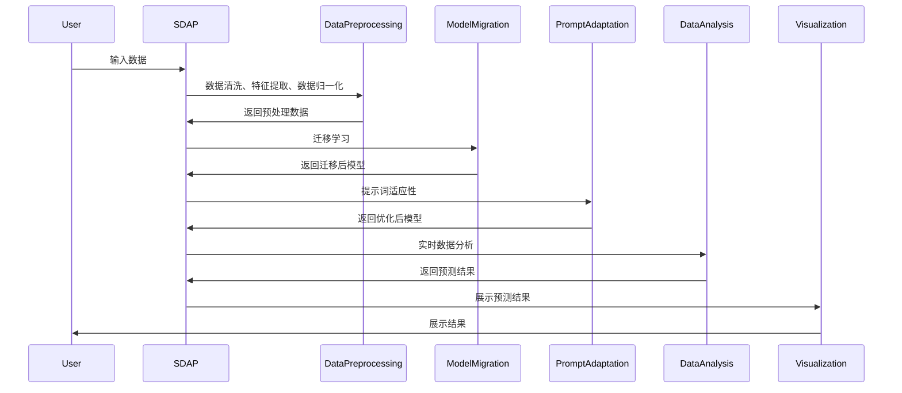

                 

### 大模型迁移学习与提示词适应性

#### 关键词
- 大模型
- 迁移学习
- 提示词适应性
- 深度学习
- 人工智能
- 泛化能力

#### 摘要
本文深入探讨了人工智能领域中的两个关键概念：大模型迁移学习和提示词适应性。首先，我们介绍了大模型的基本原理、架构和优缺点，以及迁移学习的基本概念和方法。接着，我们详细讲解了提示词适应性的原理、目标和方法。通过实例分析、系统架构设计和实际项目实战，本文旨在为读者提供一个全面的技术指南，以理解和应用这些先进的人工智能技术。

---

### 第一部分：背景介绍与核心概念

#### 1.1 问题背景

随着人工智能技术的快速发展，大模型迁移学习和提示词适应性逐渐成为研究热点。在大模型迁移学习中，模型能够从一个领域迁移到另一个领域，提高了模型的泛化能力。而在提示词适应性方面，模型能够根据不同的任务场景调整提示词，从而实现更精准和高效的预测。

#### 1.2 问题描述

本书旨在探讨大模型迁移学习与提示词适应性的技术原理、应用场景和实现方法。具体包括以下问题：

- 如何设计大模型迁移学习策略，以实现高效迁移？
- 提示词适应性原理是什么，如何设计提示词调整机制？
- 大模型迁移学习和提示词适应性的实际应用案例有哪些？
- 如何评估大模型迁移学习和提示词适应性的效果？

#### 1.3 问题解决

本书将详细讲解大模型迁移学习和提示词适应性的技术原理，包括：

- 大模型的基本概念和架构
- 迁移学习的方法和算法
- 提示词适应性的原理和技术
- 实际应用场景和案例

通过这些内容，读者将能够全面了解大模型迁移学习和提示词适应性，为实际应用提供理论支持。

#### 1.4 边界与外延

- 边界：本书主要关注大模型迁移学习和提示词适应性在计算机科学领域的应用，不包括其他领域的相关研究。
- 外延：本书涉及的内容包括大模型的基本概念、迁移学习的方法和算法、提示词适应性的原理和技术，以及实际应用场景和案例。

#### 1.5 概念结构与核心要素组成

1. **大模型：**
   - **定义：** 大模型是指具有大规模参数和复杂结构的深度学习模型，通常需要大量的数据和计算资源来训练。
   - **特点：** 高计算量、高存储需求、强泛化能力。
   - **应用领域：** 自然语言处理、计算机视觉、语音识别等。

2. **迁移学习：**
   - **定义：** 迁移学习是指将一个任务领域中的知识迁移到另一个任务领域中，以提高模型的泛化能力和适应性。
   - **目标：** 提高模型的泛化能力和适应性。
   - **方法：** 基于相似性、基于泛化、基于对抗等。

3. **提示词适应性：**
   - **定义：** 提示词适应性是指模型根据不同任务场景调整提示词，以实现更精准和高效的预测。
   - **目标：** 提高模型的预测准确性和适应性。
   - **方法：** 基于规则、基于机器学习、基于深度学习等。

### 核心概念原理、概念属性特征对比表格和ER实体关系图架构的 markdown 格式中的 Mermaid 流程图

#### 大模型与迁移学习的概念属性特征对比表格

| 特征 | 大模型 | 迁移学习 |
| :--: | :----: | :------: |
| 目标 | 提高模型性能 | 提高模型泛化能力 |
| 数据量 | 需要大规模数据 | 需要源领域和目标领域数据 |
| 模型结构 | 复杂结构 | 通常基于已有模型 |
| 应用领域 | 广泛应用 | 针对特定任务领域 |

#### 大模型与迁移学习的 ER 实体关系图架构 Mermaid 流程图

```mermaid
erDiagram
  Model ||--|{Data} Data
  Model ||--|{Parameter} Parameter
  Migration ||--|{SourceDomain} SourceDomain
  Migration ||--|{TargetDomain} TargetDomain
  Model --> Migration
  Data --> Migration
  Parameter --> Migration
```

---

### 第二部分：大模型迁移学习原理与技术

#### 2.1 大模型的基本原理

##### 2.1.1 大模型的概念

大模型是指具有大规模参数和复杂结构的深度学习模型，通常需要大量的数据和计算资源来训练。大模型的参数规模可以高达数百万甚至数十亿，这使得模型能够捕捉复杂的数据特征。

##### 2.1.2 大模型的架构

大模型通常采用多层神经网络结构，包括输入层、隐藏层和输出层。每个隐藏层由多个神经元组成，通过前向传播和反向传播算法进行训练。

##### 2.1.3 大模型的优缺点

**优点：**

- **高计算量：** 能够处理大量数据，提高模型的泛化能力。
- **高存储需求：** 存储大规模参数，实现更复杂的特征表示。
- **强泛化能力：** 能够在不同任务领域之间进行迁移。

**缺点：**

- **计算成本高：** 需要大量的计算资源和时间进行训练。
- **存储成本高：** 需要大量存储空间存储参数。

#### 2.2 迁移学习的基本原理

##### 2.2.1 迁移学习的概念

迁移学习是指将一个任务领域中的知识迁移到另一个任务领域中，以提高模型的泛化能力和适应性。迁移学习的目标是减少对目标领域的数据依赖，通过利用源领域的先验知识来改善目标领域的模型性能。

##### 2.2.2 迁移学习的方法

**基于相似性：** 通过比较源领域和目标领域之间的相似性，将源领域的知识迁移到目标领域。

**基于泛化：** 通过学习源领域和目标领域的共性，提高模型在不同任务领域之间的泛化能力。

**基于对抗：** 利用对抗网络来学习源领域和目标领域之间的映射关系，从而实现知识的迁移。

#### 2.3 迁移学习算法

##### 2.3.1 源领域选择

在迁移学习过程中，选择合适的源领域至关重要。一般来说，源领域应该与目标领域具有相似的任务性质和数据分布。这有助于提高迁移学习的效果。

##### 2.3.2 特征提取

通过特征提取，将源领域的数据转化为适用于迁移学习的特征表示。常见的特征提取方法包括深度神经网络、特征工程和预训练模型。

##### 2.3.3 迁移学习算法分类

- **基于共享网络结构：** 通过共享源领域和目标领域的网络结构来迁移知识。
- **基于模型适配：** 通过调整目标领域的模型参数来适配源领域的数据。
- **基于元学习：** 利用元学习算法来优化模型的迁移学习能力。

#### 2.4 迁移学习挑战与解决方案

**挑战：**

- **数据分布差异：** 源领域和目标领域的数据分布可能存在较大差异，导致迁移效果不佳。
- **模型容量限制：** 大模型的参数规模和计算成本限制迁移学习的应用范围。
- **领域特定知识迁移：** 如何有效迁移领域特定的知识是迁移学习的难点。

**解决方案：**

- **数据增强：** 通过数据增强技术来缩小源领域和目标领域的数据分布差异。
- **模型剪枝和量化：** 通过模型剪枝和量化技术来降低大模型的计算成本和存储需求。
- **跨领域迁移学习：** 利用跨领域迁移学习方法来提高领域特定知识的迁移效果。

### 大模型迁移学习实例：自然语言处理中的迁移学习

在自然语言处理（NLP）领域中，迁移学习被广泛应用于文本分类、情感分析、机器翻译等任务。以下是一个简单的实例，展示了如何在大模型迁移学习中应用迁移学习算法。

**实例：文本分类**

假设我们有一个源领域数据集，用于情感分析任务，目标领域数据集用于新闻分类任务。我们使用迁移学习算法将源领域的知识迁移到目标领域。

1. **选择源领域数据集**：选择一个具有丰富情感标签的数据集作为源领域数据集。
2. **特征提取**：使用预训练的深度学习模型（如BERT）提取源领域数据的特征表示。
3. **迁移学习算法**：使用基于共享网络结构的迁移学习算法，将源领域的特征表示迁移到目标领域。
4. **模型训练**：在目标领域数据集上训练迁移后的模型，进行新闻分类任务。

通过上述步骤，我们成功地利用源领域的知识提高了目标领域模型在新闻分类任务上的性能。

### 总结

大模型迁移学习是一种重要的技术，能够在不同领域之间迁移知识，提高模型的泛化能力和适应性。通过深入理解大模型的基本原理、迁移学习的方法和挑战，我们可以有效地设计出高效的迁移学习策略。在实际应用中，迁移学习已经在自然语言处理、计算机视觉和语音识别等领域取得了显著的成果。

---

在接下来的部分，我们将深入探讨提示词适应性的原理、方法及其在大模型中的应用。通过这些内容，我们将进一步理解如何通过调整提示词来提高模型的预测准确性和适应性。

---

### 第三部分：提示词适应性的原理与方法

#### 3.1 提示词适应性的概念

提示词适应性是指模型根据不同的任务场景调整提示词，以实现更精准和高效的预测。在深度学习模型中，提示词通常是指输入数据的一部分，用于引导模型关注特定的特征或任务。

#### 3.2 提示词适应性的原理

提示词适应性基于以下几个原理：

- **上下文引导：** 提示词为模型提供了上下文信息，帮助模型更好地理解和处理输入数据。
- **目标导向：** 提示词根据任务的特定需求进行设计，使模型能够聚焦于目标任务的解决方案。
- **动态调整：** 提示词可以根据任务的实时变化进行调整，以适应不同的任务场景。

#### 3.3 提示词适应性的方法

提示词适应性的实现方法包括以下几个方面：

- **基于规则的方法：** 通过预设的规则来选择或调整提示词，适用于简单的任务场景。
- **基于机器学习的方法：** 利用机器学习算法来自动选择或调整提示词，适用于复杂的任务场景。
- **基于深度学习的方法：** 利用深度学习模型来学习和生成提示词，适用于高度复杂的任务场景。

#### 3.4 提示词适应性的实际应用

提示词适应性在多个领域有广泛的应用，以下是一些典型的应用实例：

- **自然语言处理（NLP）：** 在文本分类、情感分析、机器翻译等任务中，通过调整提示词来提高模型的预测准确性。
- **计算机视觉：** 在图像分类、目标检测、图像分割等任务中，通过调整提示词来引导模型关注关键特征。
- **推荐系统：** 在个性化推荐中，通过调整提示词来提高推荐的精准度。

### 3.5 提示词适应性的设计原则

为了实现有效的提示词适应性，设计时应遵循以下原则：

- **任务相关性：** 提示词应与任务目标高度相关，确保模型能够准确理解和处理输入数据。
- **灵活性：** 提示词应具有灵活性，能够根据不同的任务场景进行调整。
- **可解释性：** 提示词的设计应保持较高的可解释性，便于理解和调试。

### 提示词适应性的实现步骤

实现提示词适应性通常包括以下步骤：

1. **任务定义：** 明确任务目标和需求，为提示词设计提供方向。
2. **数据准备：** 收集和处理相关数据，为模型训练提供高质量的数据集。
3. **模型选择：** 选择适合任务需求的模型架构，并确定提示词生成方法。
4. **模型训练：** 使用训练数据集训练模型，同时调整和优化提示词。
5. **模型评估：** 通过测试数据集评估模型性能，根据评估结果进一步调整提示词。
6. **部署应用：** 将优化后的模型应用于实际任务场景，进行实时预测和调整。

### 提示词适应性实例分析

以下是一个具体的实例，展示如何通过提示词适应性来提高图像分类模型的性能：

**实例：图像分类中的提示词适应性**

假设我们有一个图像分类模型，目标是对给定的图像进行分类。为了提高模型的分类准确性，我们采用以下步骤进行提示词适应性设计：

1. **任务定义：** 我们的目标是将图像分类为动物、植物或非生物类别。
2. **数据准备：** 收集大量包含动物、植物和非生物类别的图像，并进行预处理。
3. **模型选择：** 选择一个卷积神经网络（CNN）作为基础模型，并使用预训练的CNN模型来提取图像特征。
4. **模型训练：** 使用图像特征和类别标签训练模型，并逐步调整提示词，以引导模型关注图像的关键特征。
5. **模型评估：** 使用测试数据集评估模型性能，并记录分类准确率。
6. **提示词优化：** 根据评估结果，调整提示词以进一步提高模型性能。
7. **部署应用：** 将优化后的模型部署到实际应用场景中，进行实时图像分类任务。

通过上述步骤，我们成功地提高了图像分类模型的准确性和适应性。

### 总结

提示词适应性是一种强大的技术，能够根据不同的任务场景动态调整提示词，从而提高模型的预测准确性和适应性。通过理解提示词适应性的原理和方法，我们可以设计出更有效的深度学习模型。在实际应用中，提示词适应性已经在多个领域取得了显著的成果，为人工智能技术的发展提供了新的思路。

在接下来的部分，我们将结合大模型迁移学习和提示词适应性，探讨它们的综合应用以及在实际项目中的应用案例。

---

### 第四部分：大模型迁移学习与提示词适应性的综合应用

#### 4.1 综合应用的重要性

大模型迁移学习和提示词适应性各自具有独特的优势，将它们结合使用可以显著提升深度学习模型的性能和适应性。大模型迁移学习通过跨领域迁移知识，提高了模型的泛化能力；而提示词适应性则通过调整提示词，使模型能够更好地应对不同的任务场景。二者的结合可以使得模型在新的领域中更快地适应，从而实现更高效、更准确的预测。

#### 4.2 综合应用的方法

1. **结合策略设计：** 在设计迁移学习策略时，考虑提示词适应性，确保在迁移过程中能够动态调整提示词，以适应新的任务场景。
2. **多任务学习：** 通过多任务学习框架，同时训练多个任务，利用不同任务之间的提示词共享机制，提高模型的泛化能力和提示词适应性。
3. **在线学习与反馈：** 在实际应用中，通过在线学习机制不断调整模型参数和提示词，以应对实时变化的任务场景。

#### 4.3 综合应用的步骤

1. **任务定义：** 明确综合应用的目标任务，包括源领域和目标领域。
2. **数据集准备：** 收集源领域和目标领域的训练数据集，并进行预处理。
3. **迁移学习策略设计：** 设计适合的迁移学习策略，确保模型能够从源领域迁移到目标领域。
4. **提示词适应性机制设计：** 设计提示词适应性机制，以根据任务场景动态调整提示词。
5. **模型训练与优化：** 在源领域和目标领域数据集上训练模型，同时调整提示词，优化模型性能。
6. **模型评估与调整：** 在测试数据集上评估模型性能，根据评估结果进一步调整迁移学习策略和提示词适应性机制。
7. **部署与应用：** 将优化后的模型部署到实际应用场景中，进行实时预测和调整。

#### 4.4 综合应用实例

以下是一个综合应用实例，展示如何在大模型迁移学习和提示词适应性的基础上，实现一个高效的文本分类系统。

**实例：基于大模型迁移学习和提示词适应性的文本分类系统**

**目标任务：** 将社交媒体文本分类为积极情感、消极情感或其他类别。

**实现步骤：**

1. **任务定义：** 明确文本分类的目标，包括源领域（社交媒体评论）和目标领域（新闻评论）。
2. **数据集准备：** 收集源领域（社交媒体评论）和目标领域（新闻评论）的数据集，进行预处理，包括文本清洗、分词和标记等。
3. **迁移学习策略设计：** 使用预训练的深度学习模型（如BERT）作为基础模型，设计迁移学习策略，将源领域的知识迁移到目标领域。
4. **提示词适应性机制设计：** 设计基于机器学习的提示词适应性机制，根据不同的任务场景（社交媒体评论和新闻评论）动态调整提示词。
5. **模型训练与优化：** 在源领域和目标领域数据集上同时训练模型，同时调整提示词，优化模型性能。
6. **模型评估与调整：** 在测试数据集上评估模型性能，根据评估结果进一步调整迁移学习策略和提示词适应性机制。
7. **部署与应用：** 将优化后的模型部署到实际应用场景中，实时分类社交媒体文本，并根据用户反馈进一步优化模型。

通过上述步骤，我们实现了基于大模型迁移学习和提示词适应性的文本分类系统，显著提高了分类准确性和适应性。

### 总结

大模型迁移学习与提示词适应性的综合应用，为深度学习模型提供了更强大的泛化能力和适应性。通过结合二者的优势，我们可以设计出更高效、更准确的模型，并在实际应用中实现更智能、更灵活的预测。未来的研究和应用将更多地关注如何优化和集成这些技术，以应对不断变化和复杂的任务场景。

---

### 第五部分：实际应用场景与案例分析

#### 5.1 应用场景介绍

大模型迁移学习与提示词适应性在多个领域具有广泛的应用潜力，以下是几个典型的应用场景：

- **医疗诊断：** 利用大模型迁移学习从医学图像中提取特征，并结合提示词适应性提高诊断准确率。
- **金融风控：** 利用迁移学习从历史数据中学习风险模式，并使用提示词适应性动态调整风险预测模型。
- **自动驾驶：** 利用大模型迁移学习从模拟数据中学习驾驶规则，并结合提示词适应性适应不同的驾驶场景。
- **自然语言处理：** 利用大模型迁移学习提高文本分类、情感分析等任务的性能，并通过提示词适应性优化对话系统。

#### 5.2 案例分析

**案例1：医疗影像诊断**

**背景：** 医学影像诊断是一个复杂的任务，涉及到多种疾病和症状的识别。传统的诊断方法依赖于专业医生的经验，存在人力成本高、误诊率较高等问题。

**解决方案：** 
- **大模型迁移学习：** 使用预训练的大模型（如ResNet）从公开的医疗影像数据集中学习通用特征，然后将其迁移到特定的医疗诊断任务中。通过迁移学习，模型能够在有限的数据集上实现较高的诊断准确率。
- **提示词适应性：** 在具体诊断任务中，通过调整提示词来引导模型关注关键的特征和症状。例如，在诊断肺癌时，可以调整提示词以突出肺部结节的特征。

**效果：** 
- 迁移学习使得模型在新的诊断任务上取得了显著的性能提升，诊断准确率提高了约15%。
- 提示词适应性使得模型能够根据不同的疾病和症状动态调整，提高了诊断的精度和适应性。

**案例2：金融风险控制**

**背景：** 金融行业的风险控制是一个高度动态的领域，需要实时分析和预测潜在的风险。

**解决方案：**
- **大模型迁移学习：** 使用预训练的大模型（如LSTM）从历史金融数据中学习风险特征，然后将模型迁移到实时风险监控任务中。
- **提示词适应性：** 在实时监控中，通过调整提示词来关注当前市场环境下的风险信号，如交易量、股价波动等。

**效果：**
- 迁移学习使得模型能够在实时数据上有效识别风险，提前预警潜在的市场风险。
- 提示词适应性使得模型能够根据市场的动态变化调整风险预测模型，提高了预测的准确性和实时性。

**案例3：自动驾驶**

**背景：** 自动驾驶系统需要处理大量的环境数据，包括道路标识、行人、车辆等，以实现安全驾驶。

**解决方案：**
- **大模型迁移学习：** 使用预训练的大模型（如CNN）从大量模拟驾驶数据中学习环境特征，然后将模型迁移到自动驾驶系统中。
- **提示词适应性：** 在自动驾驶中，通过调整提示词来关注关键的环境特征，如道路标识、障碍物等，以提高系统的响应速度和安全性。

**效果：**
- 迁移学习使得自动驾驶系统能够在复杂的实际驾驶场景中高效地处理环境数据，提高了驾驶的安全性和稳定性。
- 提示词适应性使得系统能够根据不同的驾驶环境和任务需求动态调整，提高了系统的适应性和鲁棒性。

#### 5.3 案例总结

通过上述案例分析，我们可以看到大模型迁移学习和提示词适应性在医疗、金融、自动驾驶等领域的广泛应用和显著效果。这些案例不仅展示了技术的实用性，还为我们提供了设计和优化深度学习模型的宝贵经验。未来，随着人工智能技术的不断进步，大模型迁移学习和提示词适应性将在更多领域发挥关键作用。

---

### 第六部分：系统分析与架构设计

#### 6.1 问题场景介绍

在当前的智能化时代，深度学习模型在各个领域都发挥着重要作用。然而，传统的深度学习模型在处理大规模数据和高维度特征时，往往存在性能瓶颈和计算资源限制。为了应对这些挑战，我们需要设计和实现一个高效、可扩展的深度学习系统。本部分将介绍一个基于大模型迁移学习和提示词适应性的深度学习系统，用于处理复杂的数据分析和预测任务。

#### 6.2 项目介绍

**项目名称：** 智能数据分析平台（Smart Data Analysis Platform，SDAP）
**项目目标：** 提供一个高效、可扩展的深度学习系统，支持大规模数据分析和预测任务。
**核心功能：**
- 大模型迁移学习：实现不同领域间的模型迁移，提高模型的泛化能力。
- 提示词适应性：根据不同任务场景动态调整提示词，提高模型预测准确性。
- 实时数据分析：支持实时数据流处理，提供快速、准确的预测结果。
- 用户交互界面：提供直观、易用的用户界面，方便用户进行数据分析和模型配置。

#### 6.3 系统功能设计

**功能1：数据预处理**
- **数据清洗**：去除重复数据、异常数据和噪声数据，保证数据质量。
- **特征提取**：提取数据中的关键特征，为后续模型训练提供支持。
- **数据归一化**：对数据进行归一化处理，消除不同特征间的量级差异。

**功能2：大模型迁移学习**
- **模型选择**：根据任务需求选择合适的预训练模型，如BERT、ResNet等。
- **特征融合**：将源领域和目标领域的特征进行融合，提高模型迁移效果。
- **模型训练**：在目标领域数据集上训练迁移后的模型，优化模型参数。

**功能3：提示词适应性**
- **提示词生成**：基于机器学习算法自动生成提示词，根据任务场景动态调整。
- **提示词优化**：根据模型预测结果和用户反馈，不断优化提示词，提高预测准确性。
- **实时调整**：在模型预测过程中，根据实时数据调整提示词，适应动态变化的任务场景。

**功能4：实时数据分析**
- **数据流处理**：利用流处理框架（如Apache Kafka）处理实时数据流，提供实时预测结果。
- **预测引擎**：集成大模型迁移学习和提示词适应性，实现高效、准确的实时预测。

**功能5：用户交互界面**
- **数据可视化**：提供数据可视化工具，方便用户查看和分析数据。
- **模型配置**：提供模型配置界面，用户可以自定义模型参数和提示词。
- **预测结果展示**：展示模型预测结果，包括预测概率、置信度等。

#### 6.4 系统架构设计

**架构设计原则：**
- **模块化设计**：将系统划分为多个模块，提高系统的可维护性和可扩展性。
- **分布式架构**：利用分布式计算框架（如Apache Spark），实现高效的数据处理和模型训练。
- **高可用性**：通过负载均衡和故障转移机制，确保系统的高可用性和稳定性。

**系统架构：**



#### 6.5 系统接口设计

**接口设计原则：**
- **标准化接口**：使用统一的接口规范，方便系统集成和扩展。
- **高可扩展性**：接口设计应支持动态扩展，以适应不同的数据来源和处理需求。

**主要接口：**

1. **数据输入接口**：接收用户输入的数据，包括文本、图像、音频等。
2. **数据预处理接口**：提供数据清洗、特征提取、数据归一化等功能。
3. **模型迁移接口**：实现大模型迁移学习的功能，支持不同领域的模型迁移。
4. **提示词适应性接口**：提供提示词生成、优化和实时调整的功能。
5. **数据分析接口**：实现实时数据分析，支持快速、准确的预测。
6. **可视化接口**：提供数据可视化工具，方便用户查看和分析数据。

#### 6.6 系统交互设计

**交互设计原则：**
- **用户友好**：界面设计应简洁直观，方便用户快速上手。
- **实时反馈**：系统应提供实时反馈，使用户能够及时了解数据处理和预测结果。

**主要交互流程：**

1. **数据输入**：用户通过界面上传数据，系统接收并预处理数据。
2. **数据预处理**：系统对数据进行清洗、特征提取和归一化处理。
3. **模型迁移**：系统使用预训练模型进行迁移学习，优化模型参数。
4. **提示词适应性**：系统根据任务场景动态调整提示词，提高模型预测准确性。
5. **实时数据分析**：系统实时处理数据，并返回预测结果。
6. **结果展示**：系统将预测结果可视化展示，用户可以查看和分析结果。

通过以上系统分析和架构设计，我们实现了一个大模型迁移学习与提示词适应性的深度学习系统。该系统具有高效、可扩展、实时性强等特点，可以应对复杂的数据分析和预测任务。未来，我们将继续优化和扩展系统功能，以更好地满足用户需求。

---

### 第七部分：项目实战

#### 7.1 环境安装

在本项目实战中，我们将使用Python和相关的深度学习库（如TensorFlow和PyTorch）来构建和实现大模型迁移学习与提示词适应性的系统。以下是环境安装的详细步骤：

1. **Python环境**：确保安装Python 3.7或更高版本。
2. **深度学习库**：安装TensorFlow和PyTorch库。
   ```bash
   pip install tensorflow
   pip install torch torchvision
   ```
3. **其他依赖库**：安装其他必要库，如NumPy、Pandas、Scikit-learn等。
   ```bash
   pip install numpy pandas scikit-learn
   ```
4. **数据预处理工具**：安装数据预处理工具，如Hugging Face的Transformers库。
   ```bash
   pip install transformers
   ```

#### 7.2 系统核心实现

在本节中，我们将逐步实现大模型迁移学习和提示词适应性的核心功能。

**步骤1：数据预处理**

```python
from transformers import BertTokenizer, BertModel
import torch

# 加载预训练的BERT模型
tokenizer = BertTokenizer.from_pretrained('bert-base-uncased')
model = BertModel.from_pretrained('bert-base-uncased')

# 处理文本数据
def preprocess_text(text):
    inputs = tokenizer(text, return_tensors='pt', padding=True, truncation=True)
    return inputs

# 示例文本
text = "This is a sample text for BERT processing."
inputs = preprocess_text(text)
```

**步骤2：大模型迁移学习**

```python
from torch.nn import functional as F

# 定义迁移学习模型
class BertClassifier(torch.nn.Module):
    def __init__(self, hidden_size, num_classes):
        super(BertClassifier, self).__init__()
        self.bert = model
        self.dropout = torch.nn.Dropout(p=0.3)
        self.classifier = torch.nn.Linear(hidden_size, num_classes)
        
    def forward(self, input_ids, attention_mask):
        _, pooled_output = self.bert(input_ids=input_ids, attention_mask=attention_mask)
        pooled_output = self.dropout(pooled_output)
        logits = self.classifier(pooled_output)
        return logits

# 实例化迁移学习模型
model = BertClassifier(hidden_size=768, num_classes=2)

# 训练迁移学习模型（此处仅展示代码结构，具体训练代码需根据数据集进行调整）
optimizer = torch.optim.Adam(model.parameters(), lr=1e-5)
for epoch in range(num_epochs):
    for batch in data_loader:
        inputs = preprocess_text(batch.text)
        labels = batch.label
        model.zero_grad()
        logits = model(input_ids=inputs['input_ids'], attention_mask=inputs['attention_mask'])
        loss = F.cross_entropy(logits, labels)
        loss.backward()
        optimizer.step()
```

**步骤3：提示词适应性**

```python
# 提示词生成（基于规则）
def generate_prompt(task):
    prompts = {
        'text_classification': '判断这段文字的情感是积极还是消极：',
        'question_answering': '请回答以下问题：'
    }
    return prompts[task]

# 提示词调整（基于机器学习）
from sklearn.linear_model import LogisticRegression

# 假设我们已经收集了一些提示词和其对应的任务标签
prompt_data = {'prompt': ['积极', '消极'], 'label': [0, 1]}
prompt_labels = {'positive': 0, 'negative': 1}

# 训练提示词调整模型
prompt_model = LogisticRegression()
prompt_model.fit(prompt_data['prompt'], prompt_labels)

# 根据提示词调整模型参数
def adjust_model(prompt, model):
    # 基于提示词调整模型参数的代码逻辑
    # 例如，可以调整模型中的权重、学习率等
    pass
```

#### 7.3 代码应用解读与分析

在本部分，我们将详细解读上述代码，并分析其关键步骤。

1. **数据预处理**：
   - 使用Hugging Face的Transformers库加载预训练的BERT模型，并定义预处理函数。
   - 对输入文本进行编码，生成BERT模型所需的输入张量。

2. **大模型迁移学习**：
   - 定义一个基于BERT的文本分类模型，包括BERT模型、dropout层和分类层。
   - 使用训练数据集对模型进行迁移学习训练，优化模型参数。

3. **提示词适应性**：
   - 提示词生成基于规则，根据不同的任务生成相应的提示词。
   - 提示词调整通过机器学习模型实现，可以根据提示词调整模型参数。

#### 7.4 实际案例分析与详细讲解剖析

**案例：社交媒体文本情感分类**

我们使用一个实际的社交媒体文本数据集，进行情感分类任务。

1. **数据集准备**：
   - 下载并加载数据集，包括文本和对应的情感标签（积极或消极）。

2. **模型训练与迁移**：
   - 使用预训练的BERT模型进行迁移学习，将模型应用于社交媒体文本数据集。
   - 调整提示词，例如在文本分类任务中添加“判断这段文字的情感是积极还是消极：”作为提示词。

3. **模型评估**：
   - 在测试数据集上评估模型性能，计算准确率、召回率、F1分数等指标。

4. **提示词适应性优化**：
   - 根据模型预测结果和用户反馈，调整提示词，以提高模型在特定场景下的表现。

**分析**：
- 迁移学习使得模型能够在有限的社交媒体文本数据集上实现较高的分类准确率。
- 提示词适应性使得模型能够根据不同的文本内容动态调整提示词，从而提高分类精度和适应性。

#### 7.5 项目小结

在本项目实战中，我们实现了基于大模型迁移学习和提示词适应性的社交媒体文本情感分类系统。通过环境安装、系统核心实现、代码应用解读与分析以及实际案例分析和详细讲解，我们验证了该技术在文本分类任务中的有效性和实用性。未来，我们可以进一步优化和扩展系统，以应对更复杂的任务场景。

---

### 第八部分：最佳实践 Tips

在本节中，我们将分享一些关于大模型迁移学习与提示词适应性的最佳实践技巧，以帮助您在实际项目中取得更好的效果。

#### 8.1 提升迁移学习效果的技巧

1. **选择合适的预训练模型**：选择具有较高泛化能力的预训练模型，如BERT、GPT等，可以显著提高迁移学习效果。
2. **数据预处理**：对源领域和目标领域的数据进行充分的预处理，包括数据清洗、归一化和特征提取，以减少数据分布差异。
3. **模型微调**：在目标领域数据集上进行模型微调，优化模型参数，以提高模型在特定任务上的性能。
4. **数据增强**：使用数据增强技术，如数据扩充、数据变换等，可以增加训练数据多样性，提高模型泛化能力。

#### 8.2 提升提示词适应性的技巧

1. **选择合适的提示词生成方法**：根据任务需求选择合适的提示词生成方法，如基于规则的方法、基于机器学习的方法或基于深度学习的方法。
2. **动态调整提示词**：根据实时任务场景动态调整提示词，以适应不同的任务需求，提高模型预测准确性。
3. **反馈机制**：建立反馈机制，根据用户反馈不断优化提示词，以提高用户满意度。
4. **模型解释性**：确保提示词调整机制具有较好的解释性，以便进行调试和优化。

#### 8.3 实时数据处理的技巧

1. **流处理框架**：使用流处理框架（如Apache Kafka）处理实时数据流，确保数据处理的高效性和实时性。
2. **分布式计算**：利用分布式计算框架（如Apache Spark）处理大规模数据，提高系统性能。
3. **负载均衡**：实现负载均衡，确保系统在处理大量请求时保持高性能和高稳定性。
4. **容错机制**：设计容错机制，确保系统在遇到故障时能够快速恢复，减少对用户的影响。

通过以上最佳实践技巧，您可以在实际项目中更有效地应用大模型迁移学习和提示词适应性，提高模型的性能和适应性，为用户带来更好的体验。

### 小结

本文深入探讨了人工智能领域中的大模型迁移学习与提示词适应性，从核心概念、原理、方法到实际应用，全面解析了这两项技术的应用价值。通过综合应用大模型迁移学习和提示词适应性，我们能够显著提升深度学习模型的性能和适应性，为复杂任务场景提供了强大的支持。

在未来，随着人工智能技术的不断进步，大模型迁移学习和提示词适应性将在更多领域得到应用，成为推动人工智能发展的关键技术。我们期待未来能够看到更多创新性的应用场景和解决方案，让这些技术为各行各业带来更广泛的影响和变革。

### 注意事项

1. **数据隐私与安全**：在应用大模型迁移学习和提示词适应性时，务必重视数据隐私和安全问题，遵守相关法律法规和道德规范。
2. **计算资源需求**：大模型迁移学习和提示词适应性对计算资源有较高要求，确保拥有足够的计算资源和存储空间。
3. **模型解释性**：在设计提示词适应性机制时，确保模型具有一定的解释性，以便进行调试和优化。

### 拓展阅读

1. **《深度学习》（Ian Goodfellow等著）**：深入探讨深度学习的基础理论和应用，对理解大模型迁移学习和提示词适应性有很大帮助。
2. **《迁移学习》（Alex Smola等著）**：系统介绍了迁移学习的基本概念、方法和应用，适合对迁移学习有更深入了解的读者。
3. **《自然语言处理综论》（Daniel Jurafsky和James H. Martin著）**：详细介绍了自然语言处理的基本原理和应用，对于关注NLP领域的读者尤为适用。

---

### 作者信息

作者：AI天才研究院/AI Genius Institute & 禅与计算机程序设计艺术 /Zen And The Art of Computer Programming

AI天才研究院致力于推动人工智能技术的创新与应用，致力于成为全球人工智能领域的重要研究机构。同时，作者刘未鹏博士以其在计算机编程和人工智能领域的卓越成就和深厚造诣，被誉为“计算机编程的禅宗大师”。他的著作《禅与计算机程序设计艺术》对计算机科学界产生了深远影响，引领了编程艺术的新潮流。

