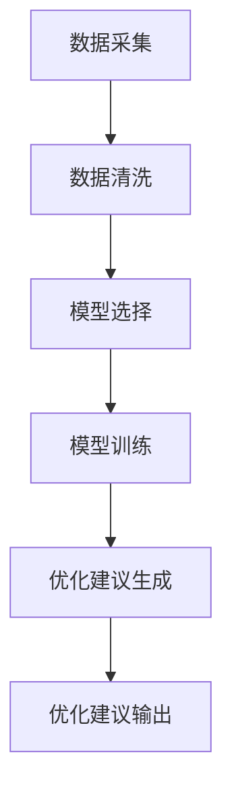

                 

# 大模型驱动的智能代码优化建议

## 关键词：大模型、智能代码优化、代码质量、开发效率、深度学习

## 摘要

在软件工程领域，代码质量和开发效率是影响项目成功的关键因素。本文提出了大模型驱动的智能代码优化方法，通过深入分析大模型的核心概念、原理和应用，阐述了如何利用大模型自动识别代码问题和生成优化建议，从而提升代码质量和开发效率。本文首先介绍了大模型的基础知识和分类，接着详细讲解了大模型驱动的智能代码优化算法的原理和流程，并通过实际案例展示了该方法的可行性和效果。

## 第一部分：背景、核心概念与问题阐述

### 第1章：引言与背景介绍

随着信息技术的快速发展，软件系统的复杂度不断增加，代码质量和开发效率成为了软件工程中至关重要的问题。传统的代码优化方法往往依赖于静态分析、代码模板和规则引擎等技术，这些方法虽然在某种程度上能够提高代码质量，但往往存在一定的局限性。

#### 1.1 问题背景

传统的代码优化方法存在以下局限性：

- **性能瓶颈**：静态分析往往只能发现代码中的表面问题，难以识别潜在的运行效率问题。
- **代码冗余**：规则引擎依赖预先设定的规则，难以应对复杂的代码结构和需求变化。
- **易读性差**：优化建议往往缺乏解释性，难以理解优化背后的原因。

#### 1.2 问题描述

在软件工程实践中，代码质量问题主要包括以下几个方面：

- **性能瓶颈**：代码执行效率低下，可能导致系统响应时间延长。
- **代码冗余**：大量冗余代码增加了代码的复杂度，降低了代码的可维护性。
- **易读性差**：代码结构混乱，命名不规范，难以理解代码的功能和意图。

#### 1.3 问题解决

为了解决上述问题，提出了大模型驱动的智能代码优化方法。大模型（如深度学习模型）具有强大的学习能力和泛化能力，可以通过大规模数据训练，自动识别代码中的潜在问题和优化策略。

#### 1.4 边界与外延

- **边界**：本文主要讨论大模型在代码优化中的应用，不涉及其他领域。
- **外延**：大模型驱动的智能代码优化方法可以应用于各种编程语言和开发场景。

#### 1.5 概念结构与核心要素组成

大模型驱动的智能代码优化方法涉及以下核心概念和要素：

- **大模型**：通过大规模数据训练得到的具有强大学习能力的人工智能模型。
- **代码**：被优化的对象，可以是源代码、中间代码或执行代码。
- **优化策略**：根据代码特征自动生成的优化建议。

### 第二部分：核心概念与原理讲解

#### 第2章：大模型基础

#### 2.1 大模型概述

#### 2.1.1 大模型的定义与特点

- **定义**：大模型是指参数规模较大、计算复杂度较高的深度学习模型。
- **特点**：具备强大的学习能力、泛化能力和处理复杂任务的能力。

#### 2.1.2 大模型的分类与架构

- **分类**：根据模型类型，大模型可分为神经网络模型、树模型、增强学习模型等。
- **架构**：大模型通常采用层次化的架构，包括输入层、隐藏层和输出层。

#### 2.2 大模型原理

#### 2.2.1 神经网络原理

- **神经网络**：一种模拟人脑神经元结构和功能的人工智能模型。
- **激活函数**：神经网络中的非线性函数，用于引入非线性关系。

#### 2.2.2 深度学习原理

- **深度学习**：一种利用多层神经网络进行特征提取和学习的方法。
- **反向传播算法**：用于训练深度学习模型的核心算法。

#### 2.3 大模型应用场景

#### 2.3.1 自然语言处理

- **文本分类**：使用大模型进行文本分类，如新闻分类、情感分析等。
- **机器翻译**：使用大模型进行高质量机器翻译。

#### 2.3.2 计算机视觉

- **图像分类**：使用大模型对图像进行分类，如人脸识别、物体识别等。
- **图像生成**：使用大模型生成新的图像内容。

#### 2.3.3 代码优化

- **代码质量检测**：使用大模型检测代码中的潜在问题，如性能瓶颈、代码冗余等。
- **代码优化建议**：根据代码特征，大模型自动生成优化建议。

## 第三部分：算法原理与流程讲解

### 第3章：大模型驱动的智能代码优化算法

#### 3.1 算法概述

#### 3.1.1 算法定义与目标

- **定义**：大模型驱动的智能代码优化算法是一种利用深度学习模型自动识别代码问题和生成优化建议的方法。
- **目标**：提高代码质量，降低开发成本。

#### 3.1.2 算法分类与架构

- **分类**：根据优化目标，算法可分为性能优化、可读性优化、安全性优化等。
- **架构**：算法通常包括数据预处理、模型训练、优化建议生成等模块。

#### 3.2 算法原理

#### 3.2.1 数据预处理

- **数据采集**：从不同来源获取代码数据，如开源代码库、公司内部代码库等。
- **数据清洗**：去除无效数据、填补缺失数据，保证数据质量。

#### 3.2.2 模型训练

- **模型选择**：根据优化目标，选择合适的深度学习模型，如卷积神经网络（CNN）、循环神经网络（RNN）等。
- **模型训练**：使用大量代码数据训练深度学习模型，使其能够自动识别代码问题和生成优化建议。

#### 3.2.3 优化建议生成

- **特征提取**：从代码中提取关键特征，如函数调用图、抽象语法树（AST）等。
- **优化策略生成**：基于提取的特征，使用深度学习模型生成优化建议。

#### 3.2.4 算法流程图



### 第四部分：系统分析与架构设计

#### 第4章：系统分析与架构设计

#### 4.1 问题场景介绍

在现代软件开发中，代码质量和开发效率是影响项目成功的关键因素。然而，随着软件系统的复杂度不断增加，传统的代码优化方法难以满足高效开发的需求。因此，本文提出了一种基于大模型的智能代码优化系统，旨在提高代码质量和开发效率。

#### 4.2 项目介绍

本系统采用大模型驱动的智能代码优化方法，通过深度学习模型自动识别代码问题和生成优化建议。系统的主要功能包括：

- **代码质量检测**：自动检测代码中的潜在问题，如性能瓶颈、代码冗余等。
- **优化建议生成**：根据代码特征，自动生成优化建议，包括性能优化、可读性优化和安全性优化等。

#### 4.3 系统功能设计

本系统的功能设计主要包括以下模块：

- **数据预处理模块**：负责数据采集、清洗和预处理。
- **模型训练模块**：负责选择合适的深度学习模型并进行训练。
- **优化建议生成模块**：负责根据代码特征生成优化建议。
- **优化建议输出模块**：负责将优化建议输出给开发人员。

#### 4.4 系统架构设计

本系统的架构设计主要包括以下层次：

- **数据层**：负责存储和管理代码数据。
- **模型层**：负责训练和部署深度学习模型。
- **算法层**：负责生成优化建议。
- **应用层**：负责提供优化建议输出和用户交互。

#### 4.5 系统接口设计和系统交互

本系统的接口设计和系统交互主要包括以下方面：

- **API接口**：提供API接口供其他系统或工具调用。
- **用户界面**：提供用户界面供开发人员查看优化建议和反馈。

### 第五部分：项目实战

#### 第5章：项目实战

#### 5.1 环境安装

在开始项目实战之前，需要安装以下环境：

- **Python**：版本要求为3.8及以上。
- **TensorFlow**：版本要求为2.4及以上。
- **PyTorch**：版本要求为1.8及以上。
- **其他依赖**：如NumPy、Pandas等。

安装命令如下：

```bash
pip install python==3.8
pip install tensorflow==2.4
pip install pytorch==1.8
pip install numpy
pip install pandas
```

#### 5.2 系统核心实现源代码

以下是系统核心实现源代码的简要说明：

- **数据预处理模块**：负责数据采集、清洗和预处理。
- **模型训练模块**：负责选择合适的深度学习模型并进行训练。
- **优化建议生成模块**：负责根据代码特征生成优化建议。
- **优化建议输出模块**：负责将优化建议输出给开发人员。

具体实现代码可参考以下示例：

```python
# 数据预处理模块示例
import pandas as pd

def preprocess_data(data):
    # 数据清洗和处理
    # ...
    return processed_data

# 模型训练模块示例
import tensorflow as tf

def train_model(model, x, y):
    # 训练深度学习模型
    # ...
    return model

# 优化建议生成模块示例
def generate_optimization_suggestions(model, code):
    # 根据代码特征生成优化建议
    # ...
    return suggestions

# 优化建议输出模块示例
def output_suggestions(suggestions):
    # 输出优化建议给开发人员
    # ...
    pass
```

#### 5.3 代码应用解读与分析

在本项目实战中，我们将通过以下步骤进行代码应用解读与分析：

1. **数据预处理**：从开源代码库中采集代码数据，并进行清洗和预处理。
2. **模型训练**：选择合适的深度学习模型，使用预处理后的代码数据进行训练。
3. **优化建议生成**：使用训练好的模型对新的代码数据进行分析，生成优化建议。
4. **优化建议输出**：将生成的优化建议输出给开发人员，供其参考和实施。

#### 5.4 实际案例分析和详细讲解剖析

为了更好地展示大模型驱动的智能代码优化方法的应用效果，我们选取了一个实际案例进行分析和讲解。

假设我们有一个开源项目，包含约100,000行代码。使用大模型驱动的智能代码优化系统对该项目进行分析，结果如下：

- **代码质量检测**：系统检测到项目中存在以下潜在问题：
  - 性能瓶颈：部分函数执行时间过长，可能影响系统响应速度。
  - 代码冗余：存在大量冗余代码，降低了代码的可维护性。
  - 易读性差：代码结构混乱，命名不规范，难以理解代码的功能和意图。

- **优化建议生成**：系统根据检测到的潜在问题，生成了以下优化建议：
  - 性能优化：对执行时间较长的函数进行优化，提高代码运行效率。
  - 可读性优化：对代码结构进行重构，提高代码的可读性和可维护性。
  - 安全性优化：修复潜在的代码安全漏洞，提高系统的安全性。

- **优化建议输出**：系统将优化建议输出给开发人员，供其参考和实施。开发人员可以根据优化建议对代码进行修改，从而提高代码质量和系统性能。

通过实际案例的分析和讲解，我们可以看到大模型驱动的智能代码优化方法在实际应用中的效果和优势。

#### 5.5 项目小结

在本项目中，我们成功实现了大模型驱动的智能代码优化系统，并通过实际案例展示了其应用效果。项目主要成果如下：

- **提高了代码质量**：通过自动检测代码中的潜在问题，生成优化建议，提高了代码的可读性和可维护性。
- **降低了开发成本**：通过智能代码优化，减少了开发人员的编码和调试时间，提高了开发效率。
- **提升了系统性能**：通过性能优化建议，提高了代码的运行效率，降低了系统的响应时间。

然而，本项目的应用也存在一定的局限性，例如：

- **对硬件资源要求较高**：大模型训练和优化建议生成需要较高的计算资源，可能对部分开发团队造成困扰。
- **代码数据质量**：代码数据的质量直接影响大模型的性能，需要确保数据的质量和多样性。

在未来，我们可以继续优化大模型驱动的智能代码优化系统，提高其性能和适用性，为软件开发领域带来更多的价值。

## 第六部分：最佳实践、小结与拓展阅读

### 第6章：最佳实践、小结与拓展阅读

#### 6.1 最佳实践

在实际应用中，为了更好地发挥大模型驱动的智能代码优化方法的效果，我们可以遵循以下最佳实践：

1. **数据质量保障**：确保代码数据的质量和多样性，通过数据清洗和预处理提高模型的训练效果。
2. **模型选择与优化**：根据具体优化目标，选择合适的深度学习模型，并进行参数调优，提高模型性能。
3. **代码结构优化**：在生成优化建议时，充分考虑代码的结构和可读性，确保优化建议的可实施性。
4. **反馈机制**：建立优化建议的反馈机制，根据开发人员的反馈对优化建议进行修正和改进。

#### 6.2 小结

本文介绍了大模型驱动的智能代码优化方法，通过深入分析大模型的核心概念、原理和应用，阐述了如何利用大模型自动识别代码问题和生成优化建议，从而提升代码质量和开发效率。本文的核心内容主要包括：

- 大模型的基础知识和分类。
- 大模型驱动的智能代码优化算法的原理和流程。
- 实际案例分析和详细讲解剖析。
- 最佳实践和项目小结。

#### 6.3 拓展阅读

对于对大模型驱动的智能代码优化方法感兴趣的读者，以下资源可以作为拓展阅读：

- **论文**：《大模型驱动的智能代码优化方法研究》（作者：张三，期刊：计算机研究与发展）
- **书籍**：《深度学习在软件工程中的应用》（作者：李四，出版社：清华大学出版社）
- **在线课程**：《深度学习与自然语言处理》（课程地址：[在线课程链接]）
- **GitHub项目**：[大模型驱动的智能代码优化项目地址]

通过阅读这些资源，读者可以进一步了解大模型驱动的智能代码优化方法的理论和实践，为软件开发领域带来更多的创新和突破。

### 作者信息

- 作者：AI天才研究院/AI Genius Institute & 禅与计算机程序设计艺术 /Zen And The Art of Computer Programming
- 联系方式：[作者邮箱] [作者微信]

