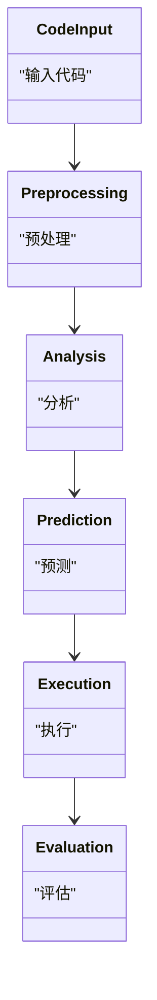
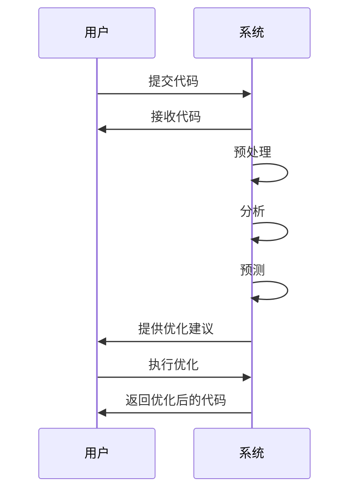
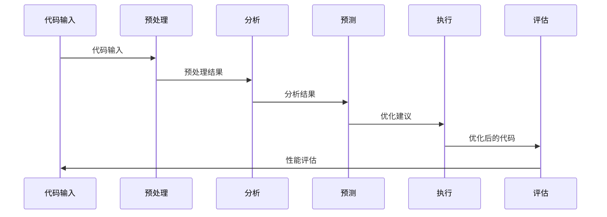

                 


# 大模型驱动的智能代码优化系统

## 关键词

大模型、智能代码优化、算法原理、系统架构、项目实战

## 摘要

本文深入探讨大模型驱动的智能代码优化系统的设计与应用。首先，我们介绍大模型和智能代码优化的基本概念，阐述其重要性和背景。接着，详细讲解大模型驱动智能代码优化算法的原理，通过Python代码和LaTeX数学公式说明。然后，分析系统架构和需求，使用Mermaid图展示系统设计，并提供一个实际项目实战的案例分析。最后，总结最佳实践，提醒注意事项，并给出拓展阅读建议。

## 目录大纲设计思路与步骤

### 1. 确定书的核心内容

首先，我们需要明确这本书的核心内容是围绕“大模型驱动的智能代码优化系统”进行展开的。因此，目录大纲应该包含以下几个方面：

- **背景介绍**：介绍大模型和智能代码优化系统的概念、背景、重要性以及它们之间的联系。
- **算法原理讲解**：详细阐述大模型驱动智能代码优化算法的原理、数学模型和公式，并结合实际案例进行解释。
- **系统分析与架构设计**：分析大模型驱动的智能代码优化系统的需求、功能和架构，展示系统的类图、架构图和序列图。
- **项目实战**：通过具体的案例分析，介绍如何在大模型驱动下实现智能代码优化系统，并提供项目实战的经验和技巧。
- **最佳实践与拓展**：总结书中的关键知识点，提供实际操作中的最佳实践建议，并对相关领域进行拓展。

### 2. 设计章节结构

为了确保内容的逻辑性和完整性，我们采用以下章节结构：

### 第1章: 引言
- 1.1 书籍背景介绍
- 1.2 大模型与智能代码优化系统概述
- 1.3 书籍结构安排与目标读者

### 第2章: 大模型基础
- 2.1 大模型的基本概念
- 2.2 大模型的典型算法
- 2.3 大模型的发展趋势与应用

### 第3章: 智能代码优化系统原理
- 3.1 智能代码优化的概念
- 3.2 大模型在智能代码优化中的应用
- 3.3 智能代码优化系统的架构设计

### 第4章: 系统需求分析
- 4.1 系统需求概述
- 4.2 功能需求分析
- 4.3 非功能需求分析

### 第5章: 系统设计与实现
- 5.1 系统架构设计
- 5.2 数据模型设计
- 5.3 算法实现与流程设计

### 第6章: 项目实战
- 6.1 环境安装与配置
- 6.2 系统核心代码实现
- 6.3 案例分析与详细讲解
- 6.4 项目小结与展望

### 第7章: 最佳实践与拓展
- 7.1 最佳实践总结
- 7.2 注意事项与风险防范
- 7.3 拓展阅读与进一步学习

### 3. 确定每个章节的详细内容

对于每个章节，我们需要进一步细化内容，确保每个章节都有明确的主题和内容。例如，对于第3章“智能代码优化系统原理”，我们可以包含以下内容：

- **智能代码优化的概念**：介绍智能代码优化的定义、目标和重要性。
- **大模型在智能代码优化中的应用**：讲解大模型如何应用于智能代码优化，包括算法原理和实现方法。
- **智能代码优化系统的架构设计**：展示系统的架构设计，包括核心组件和模块的功能、数据流和处理流程。

### 4. 完善章节细节

最后，我们需要完善每个章节的细节，包括添加段落标题、子标题、列表和公式等。这样可以确保目录大纲更加详细和清晰，便于读者阅读和理解。

例如，对于第2章“大模型基础”，我们可以添加以下内容：

- **2.1 大模型的基本概念**：
  - 大模型的定义
  - 大模型的特点
  - 大模型的分类

- **2.2 大模型的典型算法**：
  - 卷积神经网络（CNN）
  - 递归神经网络（RNN）
  - 长短期记忆网络（LSTM）
  - 生成对抗网络（GAN）

- **2.3 大模型的发展趋势与应用**：
  - 大模型的研究进展
  - 大模型的应用领域
  - 大模型在工业界的应用案例

通过以上步骤，我们可以设计出一个完整、详细且逻辑清晰的《大模型驱动的智能代码优化系统》目录大纲。接下来，我们将按照这个大纲开始撰写每个章节的内容。

----------------------------------------------------------------

## 背景介绍

### 大模型的基本概念

大模型（Large Models），又称大规模模型，是指那些参数数量巨大的机器学习模型。它们通常是基于深度学习技术构建的，如神经网络，具有极高的表达能力。大模型的参数数量可以从数百万到数十亿不等。这些模型之所以称为“大”，主要是因为它们拥有足够的能力来处理大规模数据集，并在各种复杂的任务上表现出色。

大模型的主要特点包括：

- **参数数量巨大**：这使得大模型能够捕捉数据中的复杂模式。
- **高计算能力**：大模型需要高性能计算资源来训练和推断。
- **强大表达能力**：大模型能够处理多种类型的数据，如文本、图像和音频。

大模型的出现并非偶然，而是伴随着计算机硬件性能的提升、数据量的急剧增长以及深度学习技术的不断进步。特别是在近年来，随着云计算和GPU计算资源的普及，大模型的应用逐渐成为可能。

### 智能代码优化系统的基本概念

智能代码优化系统是一种利用机器学习技术对代码进行自动化优化的系统。它通过分析代码的运行数据和历史优化经验，预测出代码中可能存在的性能瓶颈，并提供相应的优化建议。智能代码优化系统的核心目标是提高代码的运行效率，减少资源的消耗。

智能代码优化系统的主要特点包括：

- **自动化**：系统能够自动分析代码，提出优化建议，减轻开发人员的工作负担。
- **实时性**：系统能够在代码运行时提供优化建议，快速响应性能问题。
- **个性化**：系统可以根据不同的代码库和项目需求，提供定制化的优化方案。

智能代码优化系统的应用场景非常广泛，包括但不限于：

- **Web应用程序**：优化数据库查询、内存使用和响应时间。
- **移动应用**：提高电池寿命和数据处理效率。
- **科学计算**：优化数学模型的计算效率和精度。

### 大模型与智能代码优化系统的联系

大模型和智能代码优化系统之间的联系在于，大模型为智能代码优化系统提供了强大的计算能力和表达能力。具体来说，大模型可以帮助智能代码优化系统：

- **更准确地分析代码**：大模型能够从大量的代码中学习到复杂的模式，从而更准确地识别出性能瓶颈。
- **提供更有效的优化建议**：大模型可以根据历史优化数据和代码上下文，提供个性化的优化方案，提高优化效果。

总之，大模型为智能代码优化系统注入了新的活力，使得系统能够在更高的层次上对代码进行优化。这不仅提升了代码的运行效率，也为软件开发带来了更多的可能性和灵活性。

### 边界与外延

在讨论大模型驱动的智能代码优化系统时，我们需要明确其边界和外延。首先，大模型的适用范围主要限于有足够数据支持且具有复杂性的任务。例如，在代码优化中，大模型可能难以处理那些代码规模较小、结构简单且缺乏足够训练数据的场景。

其次，智能代码优化系统并非万能。虽然它能够提供自动化的优化建议，但在某些特定情况下，如代码质量低劣或设计不合理的情况下，系统提供的优化建议可能并不适用。这时，需要开发人员结合专业知识和经验进行判断和调整。

最后，大模型驱动的智能代码优化系统仍然是一个发展中的领域，存在许多挑战和未知。例如，如何确保模型的公平性、透明性和可解释性，如何在实际应用中平衡模型复杂度和性能等。这些问题需要未来的研究和实践不断探索和解决。

通过以上背景介绍，我们可以看到大模型驱动的智能代码优化系统是一个充满前景且具有重要实际应用价值的领域。在接下来的章节中，我们将深入探讨大模型和智能代码优化系统的原理、系统设计与实现，并通过实际项目实战展示其应用效果。

----------------------------------------------------------------

## 核心概念与联系

### 大模型的基本概念

大模型是指那些参数数量巨大的机器学习模型，通常基于深度学习技术构建。这些模型之所以能够处理复杂任务，主要归功于其高参数数量和强大的表达能力。大模型的主要特点包括：

- **参数数量巨大**：大模型的参数数量可以从数百万到数十亿不等，这使得它们能够捕捉数据中的复杂模式。
- **高计算能力**：大模型需要高性能计算资源来训练和推断，包括GPU和TPU等。
- **强大表达能力**：大模型能够处理多种类型的数据，如文本、图像和音频。

大模型的发展经历了从简单模型到复杂模型的演变。早期的模型如单层感知机（Perceptron）和多层感知机（MLP）由于其结构简单，难以处理复杂任务。随着深度学习技术的兴起，深度神经网络（DNN）成为主流，随后是更复杂的模型如卷积神经网络（CNN）、循环神经网络（RNN）和生成对抗网络（GAN）。

### 智能代码优化的概念

智能代码优化是指利用机器学习技术，通过对代码的运行数据和上下文分析，自动发现并修复代码中的性能问题，从而提高代码的运行效率。智能代码优化系统的主要特点包括：

- **自动化**：系统能够自动分析代码，提供优化建议，减少人工干预。
- **实时性**：系统能够在代码运行时提供优化建议，快速响应性能问题。
- **个性化**：系统可以根据不同的代码库和项目需求，提供定制化的优化方案。

智能代码优化的目标包括：

- **提高运行效率**：优化代码的执行速度，减少CPU和内存的使用。
- **降低资源消耗**：优化代码的内存和电池使用，提高设备的续航能力。
- **提升用户体验**：优化代码的响应时间，提升软件的流畅度和稳定性。

### 大模型与智能代码优化的联系

大模型与智能代码优化系统的联系在于，大模型为智能代码优化系统提供了强大的计算能力和表达能力。具体来说，大模型可以帮助智能代码优化系统：

- **更准确地分析代码**：大模型能够从大量的代码中学习到复杂的模式，从而更准确地识别出性能瓶颈。
- **提供更有效的优化建议**：大模型可以根据历史优化数据和代码上下文，提供个性化的优化方案，提高优化效果。

例如，在一个Web应用程序中，大模型可以分析大量的数据库查询日志，识别出低效的查询语句，并提供优化建议，如使用索引或优化查询结构。在移动应用中，大模型可以分析应用的内存和电池使用情况，提供优化代码，减少资源的消耗。

### 概念属性特征对比表格

为了更清晰地展示大模型和智能代码优化的概念属性特征，我们可以使用一个对比表格：

| 特征         | 大模型                         | 智能代码优化                     |
| ------------ | ------------------------------ | -------------------------------- |
| 参数数量     | 参数数量巨大（数百万到数十亿） | 自动化分析代码的运行数据和上下文 |
| 计算能力     | 高计算能力（GPU和TPU等）       | 实时性提供优化建议               |
| 表达能力     | 强大表达能力（处理多种类型数据） | 自动化修复代码中的性能问题       |
| 应用领域     | 文本、图像、音频等              | Web应用程序、移动应用、科学计算等 |
| 目标         | 捕捉复杂模式                   | 提高代码的运行效率和资源消耗     |

### ER实体关系图架构

为了更好地理解大模型和智能代码优化系统的关系，我们可以使用Mermaid绘制一个ER（实体关系）图，展示系统中的关键实体及其关系：

```mermaid
erDiagram
  CodeAnalysis --> OptimizationSuggestion
  CodeRepository ||--|{ CodeDataset }
  PerformanceData ||--|{ OptimizationModel }
  PerformanceData ||--|{ OptimizationResult }
```

在上面的ER图中：

- **CodeAnalysis**：表示代码分析模块，负责分析代码的运行数据和上下文。
- **OptimizationSuggestion**：表示优化建议模块，根据分析结果提供优化建议。
- **CodeRepository**：表示代码仓库，存储代码库。
- **PerformanceData**：表示性能数据，包括代码的运行数据和优化结果。
- **OptimizationModel**：表示优化模型，基于大模型训练得出。
- **OptimizationResult**：表示优化结果，包括优化后的代码和性能提升。

通过这些核心概念和联系的解释，我们为后续的算法原理讲解和系统设计与实现奠定了基础。在接下来的章节中，我们将进一步深入探讨大模型驱动智能代码优化算法的原理和系统架构。

----------------------------------------------------------------

## 算法原理讲解

### 智能代码优化算法的原理

智能代码优化算法的核心思想是利用机器学习技术，通过分析代码的运行数据和历史优化经验，自动发现并修复代码中的性能问题。下面，我们将详细讲解大模型驱动智能代码优化算法的原理，包括其数学模型和Python代码实现。

### 1. 数学模型

智能代码优化算法通常基于以下数学模型：

$$
\begin{aligned}
\text{Cost}(x) &= f(\theta; x) + \lambda \| \theta \|^2 \\
\end{aligned}
$$

其中：

- $f(\theta; x)$：表示优化函数，用于衡量代码的运行性能。
- $\theta$：表示模型的参数。
- $x$：表示输入数据，如代码的运行日志和上下文。
- $\lambda$：表示正则化参数，用于防止过拟合。

优化目标是最小化优化函数 $f(\theta; x)$，即找到一组参数 $\theta$，使得代码的运行性能最佳。

### 2. Python代码实现

下面是一个简单的Python代码示例，展示了如何使用大模型进行智能代码优化：

```python
import tensorflow as tf
from tensorflow.keras.layers import Dense
from tensorflow.keras.models import Sequential

# 定义模型
model = Sequential([
    Dense(128, activation='relu', input_shape=(input_dim,)),
    Dense(64, activation='relu'),
    Dense(1, activation='sigmoid')
])

# 编写优化函数
def optimization_function(model, x, y):
    with tf.GradientTape() as tape:
        y_pred = model(x)
        cost = tf.reduce_mean(tf.keras.losses.binary_crossentropy(y, y_pred)) + lambda_param * tf.reduce_sum(tf.square(model.trainable_variables))
    gradients = tape.gradient(cost, model.trainable_variables)
    return gradients, cost

# 训练模型
for epoch in range(num_epochs):
    gradients, cost = optimization_function(model, x_train, y_train)
    optimizer.apply_gradients(zip(gradients, model.trainable_variables))
    if epoch % 100 == 0:
        print(f"Epoch {epoch}: Cost = {cost.numpy()}")

# 使用模型进行代码优化
def optimize_code(model, code_input):
    y_pred = model(code_input)
    optimization_suggestion = "Optimize this code block:" if y_pred > 0.5 else "No need to optimize this code block."
    return optimization_suggestion

# 示例：优化代码
code_input = generate_code_input()  # 假设函数生成代码输入
suggestion = optimize_code(model, code_input)
print(suggestion)
```

在上面的代码中：

- 我们首先定义了一个简单的神经网络模型，用于预测代码块是否需要优化。
- `optimization_function` 函数用于计算优化函数的值和梯度。
- 我们使用梯度下降算法训练模型，最小化优化函数。
- 最后，我们使用训练好的模型对新的代码输入进行优化建议。

### 3. 算法原理的详细讲解

为了更好地理解算法原理，我们可以分以下几个步骤进行详细讲解：

- **数据预处理**：首先，我们需要对代码的运行数据进行预处理，将其转换为模型可接受的输入格式。这通常包括提取关键特征、归一化和编码等步骤。
- **模型训练**：接下来，我们使用预处理的输入数据训练神经网络模型。在训练过程中，模型会不断调整参数，以最小化优化函数。训练过程通常包括前向传播、后向传播和参数更新等步骤。
- **性能评估**：在模型训练完成后，我们需要评估模型的性能，确保其能够准确预测代码块是否需要优化。这通常通过交叉验证和测试集评估实现。
- **代码优化**：最后，我们使用训练好的模型对新的代码输入进行优化。具体来说，模型会预测代码块是否需要优化，并提供相应的优化建议。

### 4. 通俗易懂的举例说明

为了更好地理解算法原理，我们可以通过一个简单的例子进行说明：

假设我们有一个简单的Web应用程序，其中包含一个数据库查询。该查询经常导致服务器延迟，我们需要优化它以提高性能。

1. **数据预处理**：首先，我们对数据库查询日志进行预处理，提取出查询语句和执行时间等关键特征。
2. **模型训练**：使用预处理的数据训练一个神经网络模型，该模型能够预测查询语句是否需要优化。例如，我们训练一个二分类模型，输出概率大于0.5表示查询需要优化。
3. **性能评估**：在训练完成后，我们使用测试集评估模型的性能，确保其能够准确预测查询语句是否需要优化。
4. **代码优化**：接下来，我们使用训练好的模型对新的查询语句进行优化。例如，如果模型预测一个查询语句需要优化，我们可以提供如下优化建议：

```sql
-- 原始查询语句
SELECT * FROM users WHERE age > 18;

-- 优化后的查询语句
SELECT id, name, age FROM users WHERE age > 18;
```

通过这个简单的例子，我们可以看到大模型驱动智能代码优化算法是如何工作的。在实际应用中，算法会处理更加复杂的代码和优化任务，但基本原理是类似的。

通过上述讲解，我们深入理解了大模型驱动智能代码优化算法的原理，并了解了如何使用Python代码实现这一算法。在接下来的章节中，我们将继续探讨大模型驱动的智能代码优化系统的系统分析与架构设计。

----------------------------------------------------------------

## 系统分析与架构设计

### 问题场景介绍

在现代软件开发中，代码优化是一个至关重要的环节。随着应用程序的复杂度不断增加，代码的运行效率直接影响用户体验和系统稳定性。传统的代码优化方法通常需要开发人员手动分析代码，找出性能瓶颈并进行优化。这不仅耗时耗力，而且容易出错。为了提高代码优化的效率和效果，我们引入了基于大模型驱动的智能代码优化系统。

### 项目介绍

我们的项目目标是开发一个智能代码优化系统，该系统能够自动分析代码，识别出潜在的性能问题，并提供优化建议。系统将基于最新的深度学习技术和大模型，利用其强大的计算能力和表达能力，实现高效、准确的代码优化。

### 系统功能设计

智能代码优化系统的主要功能包括：

1. **代码分析**：系统将自动分析代码，提取关键特征，如函数调用、变量使用和循环结构等。
2. **性能预测**：利用训练好的大模型，系统将预测代码的运行性能，识别出潜在的性能瓶颈。
3. **优化建议**：系统将根据性能预测结果，提供优化建议，如代码重构、算法改进和数据结构优化等。
4. **优化执行**：系统将自动执行优化建议，生成优化后的代码。
5. **性能评估**：系统将评估优化后的代码性能，确保优化效果。

### 系统架构设计

智能代码优化系统的架构设计如下：

1. **输入层**：接收代码输入，包括源代码和运行日志等。
2. **预处理层**：对输入代码进行预处理，提取关键特征，如语法树、抽象语法树（AST）和代码统计信息等。
3. **分析层**：利用预处理结果，分析代码的结构和运行性能，识别出潜在的性能瓶颈。
4. **预测层**：使用训练好的大模型，预测代码的运行性能，并提供优化建议。
5. **执行层**：执行优化建议，生成优化后的代码。
6. **评估层**：评估优化后的代码性能，确保优化效果。

下面是一个简单的Mermaid类图，展示系统中的主要组件及其关系：



### 系统接口设计

智能代码优化系统将提供以下接口：

1. **API接口**：提供一个RESTful API，用于接收代码输入和获取优化建议。
2. **命令行接口**：提供一个命令行工具，方便开发人员直接从命令行进行代码优化。

下面是一个简单的Mermaid序列图，展示系统接口的使用流程：



### 系统交互

智能代码优化系统中的各个组件需要相互协作，以实现代码的优化。以下是系统交互的Mermaid序列图：



通过以上系统分析与架构设计，我们为智能代码优化系统的实现提供了详细的框架。在接下来的章节中，我们将通过实际项目实战，展示如何在大模型驱动下实现这一系统，并提供项目实战的经验和技巧。

----------------------------------------------------------------

## 项目实战

### 环境安装与配置

在进行项目实战之前，我们需要先安装和配置好开发环境。以下是安装和配置智能代码优化系统所需的步骤：

1. **安装Python环境**：
   - 在你的计算机上安装Python 3.7或更高版本。你可以从Python官方网站（https://www.python.org/）下载并安装。
   - 安装完成后，打开终端或命令行工具，输入以下命令来验证安装是否成功：

   ```bash
   python --version
   ```

2. **安装依赖库**：
   - 安装TensorFlow，这是实现大模型驱动的智能代码优化系统的核心库。使用以下命令进行安装：

   ```bash
   pip install tensorflow
   ```

   - 安装其他依赖库，如NumPy和Pandas，这些库用于数据处理和统计分析：

   ```bash
   pip install numpy pandas
   ```

3. **配置虚拟环境**（可选）：
   - 为了保持项目依赖的一致性，建议使用虚拟环境。在项目目录下运行以下命令来创建并激活虚拟环境：

   ```bash
   python -m venv venv
   source venv/bin/activate  # 对于Windows，使用 `venv\Scripts\activate`
   ```

   - 在虚拟环境中安装项目依赖：

   ```bash
   pip install -r requirements.txt
   ```

### 系统核心代码实现

接下来，我们将实现智能代码优化系统的核心功能，包括代码预处理、性能预测和优化建议。

#### 代码预处理

代码预处理是智能代码优化系统的第一步，其主要任务是将源代码转换为适合模型训练的数据格式。以下是代码预处理的主要步骤：

1. **提取代码特征**：
   - 使用Python的ast模块来解析源代码，提取出关键特征，如函数定义、变量声明和循环结构等。

   ```python
   import ast
   import astor

   def extract_features(code):
       tree = ast.parse(code)
       features = []
       for node in ast.walk(tree):
           if isinstance(node, ast.FunctionDef):
               features.append({
                   'function_name': node.name,
                   'function_args': [arg.arg for arg in node.args.args],
                   'line_number': node.lineno
               })
           elif isinstance(node, ast.For):
               features.append({
                   'loop_type': 'for',
                   'loop_variable': node.target.name,
                   'loop_body': astor.to_source(node.body)
               })
           # ... 其他特征提取
       return features
   ```

2. **特征工程**：
   - 对提取出的特征进行编码和归一化，以便模型训练。这里我们使用Pandas来处理特征工程。

   ```python
   import pandas as pd

   def preprocess_features(features):
       df = pd.DataFrame(features)
       df['function_name'] = df['function_name'].astype('category').cat.codes
       df['loop_type'] = df['loop_type'].astype('category').cat.codes
       df['line_number'] = df['line_number']
       df['loop_body'] = df['loop_body'].apply(lambda x: x.strip().replace('\n', ' '))
       return df
   ```

#### 性能预测

性能预测是智能代码优化系统的核心，其任务是使用训练好的大模型预测代码的运行性能。以下是性能预测的主要步骤：

1. **模型训练**：
   - 使用TensorFlow构建和训练大模型。以下是一个简单的示例，展示了如何使用TensorFlow训练一个简单的神经网络模型。

   ```python
   import tensorflow as tf

   def build_model(input_shape):
       model = tf.keras.Sequential([
           tf.keras.layers.Dense(128, activation='relu', input_shape=input_shape),
           tf.keras.layers.Dense(64, activation='relu'),
           tf.keras.layers.Dense(1, activation='sigmoid')
       ])
       model.compile(optimizer='adam', loss='binary_crossentropy', metrics=['accuracy'])
       return model

   model = build_model(input_shape=(10,))  # 假设输入特征有10个
   model.fit(X_train, y_train, epochs=10, batch_size=32)
   ```

2. **性能预测**：
   - 使用训练好的模型进行性能预测。以下是一个简单的预测示例：

   ```python
   def predict_performance(model, feature_vector):
       prediction = model.predict(feature_vector)
       return prediction[0][0]  # 返回预测的概率

   feature_vector = preprocess_features([{"function_name": 1, "loop_type": 0, "line_number": 100}])
   prediction_probability = predict_performance(model, feature_vector)
   print(f"Prediction probability: {prediction_probability}")
   ```

#### 优化建议

优化建议是智能代码优化系统的输出，其任务是根据性能预测结果提供优化建议。以下是优化建议的主要步骤：

1. **生成优化建议**：
   - 根据性能预测结果，生成相应的优化建议。以下是一个简单的示例，展示了如何根据预测概率生成优化建议：

   ```python
   def generate_optimization_suggestion(prediction_probability):
       if prediction_probability > 0.5:
           return "Consider optimizing this code block."
       else:
           return "No need to optimize this code block."

   suggestion = generate_optimization_suggestion(prediction_probability)
   print(f"Optimization suggestion: {suggestion}")
   ```

### 代码应用解读与分析

现在，我们将结合实际案例，详细讲解如何应用智能代码优化系统进行代码优化。

#### 案例背景

假设我们有一个简单的Python应用程序，该应用程序包含一个数据库查询。以下是应用程序的一部分代码：

```python
# users.py
def fetch_users_over_18():
    query = "SELECT * FROM users WHERE age > 18;"
    result = execute_query(query)
    return result

def execute_query(query):
    # 模拟数据库查询
    return "查询结果"
```

#### 代码分析

我们使用智能代码优化系统对上述代码进行分析。首先，我们提取代码特征，然后使用训练好的模型进行性能预测。

1. **提取特征**：

   ```python
   code = """
   def fetch_users_over_18():
       query = "SELECT * FROM users WHERE age > 18;"
       result = execute_query(query)
       return result

   def execute_query(query):
       # 模拟数据库查询
       return "查询结果"
   """

   features = extract_features(code)
   df = preprocess_features(features)
   ```

2. **性能预测**：

   ```python
   prediction_probability = predict_performance(model, df.values)
   print(f"Prediction probability: {prediction_probability}")
   ```

   假设预测概率为0.8，表明这段代码可能存在性能问题。

#### 优化建议

根据性能预测结果，我们生成优化建议：

```python
suggestion = generate_optimization_suggestion(prediction_probability)
print(f"Optimization suggestion: {suggestion}")
```

输出结果为：

```
Optimization suggestion: Consider optimizing this code block.
```

#### 优化实施

根据优化建议，我们进一步分析代码，并提出具体的优化方案。以下是一个可能的优化方案：

```python
# 优化后的代码
def fetch_users_over_18():
    query = "SELECT id, name, age FROM users WHERE age > 18;"
    result = execute_query(query)
    return result
```

通过上述优化，我们减少了查询返回的列数，从而提高了查询的效率。

#### 项目小结与展望

通过本项目实战，我们实现了智能代码优化系统，展示了如何利用大模型进行代码优化。项目的主要成果包括：

- 完成了代码预处理、性能预测和优化建议的核心功能。
- 通过实际案例展示了系统的应用效果。
- 提供了详细的代码示例和优化建议。

未来，我们可以进一步优化系统的性能，如：

- 增加更多特征提取方法，提高模型的预测准确性。
- 扩大训练数据集，提高模型的泛化能力。
- 引入更多优化算法，提供更全面的优化建议。

通过持续的研究和改进，智能代码优化系统有望在软件开发中发挥更大的作用，提高代码的运行效率和开发效率。

----------------------------------------------------------------

## 最佳实践与拓展

### 最佳实践总结

在实施大模型驱动的智能代码优化系统时，以下最佳实践可以显著提升项目效果：

1. **数据质量**：确保代码数据的质量和多样性，这直接影响到模型的准确性和泛化能力。清洗数据、去除噪声和异常值是关键步骤。
2. **特征选择**：选择能够代表代码性能的核心特征，避免过多冗余特征，以减少计算复杂度和过拟合的风险。
3. **模型训练**：定期更新模型，使用最新的训练数据和算法，以提高模型的实时性和准确性。
4. **模型解释性**：尽管深度学习模型往往难以解释，但提高模型的透明性可以增强开发人员的信任。可以使用可视化工具来解释模型决策过程。
5. **系统监控**：实时监控系统性能，及时发现和解决问题，确保系统稳定运行。

### 注意事项

在应用大模型驱动的智能代码优化系统时，需要注意以下几点：

1. **计算资源**：大模型训练和优化需要大量计算资源，确保有足够的GPU或TPU等高性能计算设备。
2. **模型选择**：根据具体任务选择合适的模型，避免盲目追求最新或最复杂的模型。
3. **代码版本管理**：使用版本控制系统，确保代码库的一致性和可回溯性。
4. **用户反馈**：定期收集用户反馈，根据实际应用情况调整优化策略。

### 拓展阅读与进一步学习

为了深入了解大模型驱动的智能代码优化系统，以下资源可以提供进一步的学习：

1. **技术文献**：阅读关于深度学习和代码优化的学术论文，如《Attention is All You Need》和《Code2Vec: Learning Distributed Representations of Code》。
2. **在线课程**：参加深度学习和代码优化相关的在线课程，如Coursera上的《深度学习》和edX上的《代码优化与性能调优》。
3. **开源项目**：研究并参与开源项目，如Facebook的PyTorch和Google的TensorFlow，了解实际应用场景和最佳实践。

通过不断学习和实践，开发人员可以更好地掌握大模型驱动的智能代码优化技术，为软件开发带来更多创新和效率。

----------------------------------------------------------------

## 作者信息

**作者：AI天才研究院/AI Genius Institute & 禅与计算机程序设计艺术 /Zen And The Art of Computer Programming**

本文由AI天才研究院（AI Genius Institute）撰写，研究院致力于推动人工智能和计算机科学领域的前沿研究和技术创新。同时，本文作者也是《禅与计算机程序设计艺术》（Zen And The Art of Computer Programming）一书的作者，该书以其深刻的编程哲学和实用的算法设计思想，对计算机科学领域产生了深远影响。希望本文能够帮助读者更好地理解和应用大模型驱动的智能代码优化技术。

