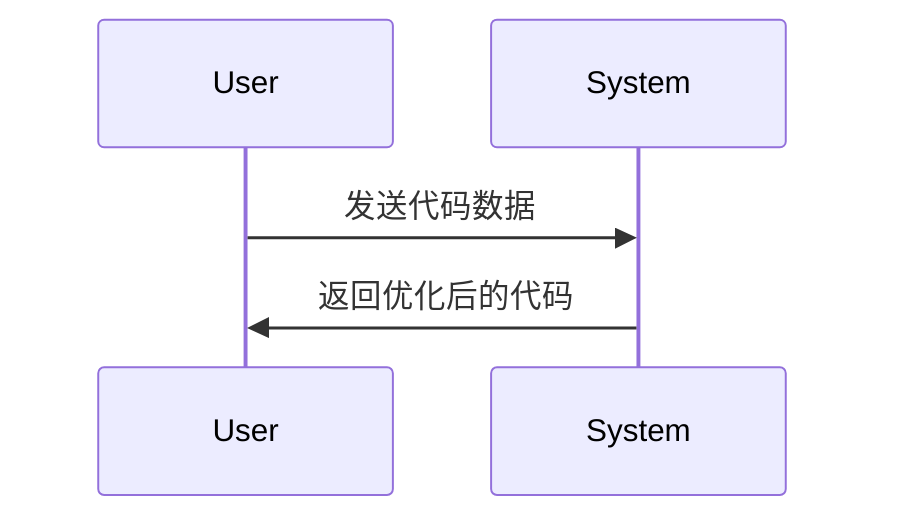

                 

### 大模型驱动的智能代码优化：性能与可读性的权衡

#### 关键词：大模型、智能代码优化、性能、可读性、权衡

#### 摘要：
本文深入探讨大模型驱动的智能代码优化，探讨如何在保持代码性能的同时，确保其可读性。文章首先介绍了大模型的背景和优势，然后详细分析了性能和可读性的权衡问题。通过具体算法的讲解、实例分析以及最佳实践，提供了系统化的解决方案，为开发者提供了实用指导。

----------------------------------------------------------------

## 引言：智能代码优化的挑战与机遇

### 2.1 智能代码优化的背景

#### 2.1.1 代码性能的重要性

代码性能是指软件在运行时处理数据和处理请求的效率。高性能的代码可以减少资源消耗，提高用户体验，是现代软件开发中的重要目标。然而，追求高性能往往需要复杂的算法和优化的代码结构。

#### 2.1.2 代码可读性与可维护性

代码的可读性是指代码易于理解和阅读。良好的可读性有助于团队协作和代码维护。然而，为了提高性能，开发者可能会采用复杂的编程技巧，这可能会牺牲代码的可读性。

#### 2.1.3 智能代码优化的需求

智能代码优化通过利用机器学习和人工智能技术，可以在不牺牲可读性的前提下，自动优化代码的性能。随着大模型的兴起，智能代码优化成为可能，为解决传统代码优化的难题提供了新的思路。

### 2.2 大模型的发展与应用

#### 2.2.1 大模型的定义与特点

大模型是指具有数亿至数十亿参数的神经网络模型。它们具有强大的表示和学习能力，可以处理复杂的任务。

#### 2.2.2 大模型在代码优化中的应用前景

大模型可以自动从大量的代码数据中学习优化策略，从而在保证可读性的同时，显著提升代码性能。

#### 2.2.3 大模型驱动的代码优化优势与挑战

优势包括自动化的优化过程、更高效的性能提升等。挑战则包括如何处理大规模数据、如何保证优化结果的可靠性等问题。

### 2.3 性能与可读性的权衡

#### 2.3.1 性能与可读性的定义

性能是指代码执行的速度和效率。可读性是指代码的易理解性和易维护性。

#### 2.3.2 代码优化的双重目标

代码优化不仅要提高性能，还要保持良好的可读性，这是代码优化的双重目标。

#### 2.3.3 平衡策略与方法

平衡性能与可读性需要采用多种策略，如代码重构、算法改进等。同时，需要结合具体场景和需求，制定合适的优化方法。

### 2.4 书籍结构概述

#### 2.4.1 各部分内容安排

本书分为引言、基础理论、技术方法、应用实践和总结与拓展五个部分。

#### 2.4.2 阅读建议

读者可以根据自身需求，有选择性地阅读相关章节，以获得所需的知识和技能。

----------------------------------------------------------------

## 第1部分：基础理论

### 第1章：大模型驱动的代码优化原理

#### 1.1 大模型的基本概念

##### 1.1.1 大模型的构成

大模型通常由多个层次组成，包括输入层、隐藏层和输出层。每一层由多个神经元组成，通过前向传播和反向传播算法进行训练。

##### 1.1.2 大模型的工作原理

大模型通过学习大量数据，提取数据中的特征和模式，从而实现高性能的预测和优化。

#### 1.2 代码优化核心原理

##### 1.2.1 传统代码优化的局限性

传统代码优化依赖于开发者的经验和技巧，难以保证优化效果的一致性和可靠性。

##### 1.2.2 大模型在代码优化中的优势

大模型可以自动从代码中学习优化策略，无需依赖开发者的手动干预，提高优化效果的可预测性。

##### 1.2.3 代码优化的目标与原则

代码优化的目标是在保证可读性的同时，提高代码的性能。优化的原则包括最小化计算复杂度、最大化代码的可理解性等。

#### 1.3 大模型驱动的代码优化流程

##### 1.3.1 数据预处理

数据预处理是代码优化的第一步，包括数据清洗、数据增强等。

##### 1.3.2 大模型训练

大模型训练是代码优化的核心步骤，通过学习大量的代码数据，提取优化策略。

##### 1.3.3 代码生成与优化

基于训练结果，大模型可以生成优化的代码，并通过评估指标进行优化。

##### 1.3.4 优化效果评估

优化效果评估是验证代码优化效果的关键步骤，包括性能评估、可读性评估等。

#### 1.4 大模型与代码优化的联系

##### 1.4.1 大模型对代码优化的影响

大模型可以自动提取代码中的优化策略，显著提高代码的性能。

##### 1.4.2 代码优化对大模型的需求

代码优化需要大量的代码数据，这对大模型的学习和训练提出了要求。

##### 1.4.3 跨领域应用与挑战

跨领域应用要求大模型具有泛化能力，能够在不同的编程语言和场景下进行优化。

#### 1.5 概念属性特征对比表格

| 概念           | 特征1   | 特征2   | 特征3   |  
|--------------|-------|-------|-------|  
| 大模型           | 参数规模大 | 学习能力强 | 泛化能力强 |  
| 传统代码优化     | 依赖开发者经验 | 优化效果不稳定 | 难以自动化 |  
| 智能代码优化     | 自动化过程 | 高性能提升 | 保持代码可读性 |

#### 1.6 ER实体关系图架构

```mermaid
erDiagram
    CodeData --> OptimizationModel
    CodeData ||--|{ CodeSegment }
    OptimizationModel ||--|{ OptimizationStrategy }
```

#### 1.7 算法流程与Mermaid流程图


----------------------------------------------------------------

## 第2章：大模型驱动的代码优化算法

### 2.1 算法概述

##### 2.1.1 大模型驱动的代码优化算法框架

大模型驱动的代码优化算法通常包括数据预处理、模型训练、代码生成和优化效果评估等步骤。

##### 2.1.2 算法分类与选择

根据应用场景和需求，可以选择不同的算法，如深度学习算法、生成对抗网络（GAN）和强化学习算法等。

### 2.2 深度学习算法在代码优化中的应用

##### 2.2.1 神经网络基础

神经网络是深度学习算法的基础，通过多层神经元之间的连接，实现数据的非线性变换。

##### 2.2.2 卷积神经网络（CNN）在代码优化中的应用

CNN在图像处理领域有广泛应用，但其原理同样适用于代码优化，可以通过特征提取提高代码性能。

##### 2.2.3 循环神经网络（RNN）在代码优化中的应用

RNN适用于处理序列数据，可以在代码优化中用于处理代码序列，提取代码中的关键信息。

### 2.3 生成对抗网络（GAN）在代码优化中的应用

##### 2.3.1 GAN基础

GAN由生成器和判别器组成，通过对抗训练，生成高质量的优化代码。

##### 2.3.2 GAN在代码生成与优化中的应用

GAN可以自动生成优化的代码，并通过与判别器的对抗，不断提高生成代码的质量。

### 2.4 强化学习在代码优化中的应用

##### 2.4.1 强化学习基础

强化学习通过奖励机制，引导模型学习最优策略。

##### 2.4.2 强化学习在代码优化中的挑战与机遇

强化学习在代码优化中面临的挑战包括代码环境的复杂性和评估指标的多样性。但其强大的自适应能力也为代码优化提供了新的机遇。

### 2.5 算法流程与Mermaid流程图


----------------------------------------------------------------

## 系统分析与架构设计方案

### 3.1 问题场景介绍

在实际项目中，系统需要处理大量的代码数据，并进行自动优化，以提高代码性能。

### 3.2 项目介绍

本项目是一个基于大模型的智能代码优化系统，旨在通过自动优化代码，提高代码性能和可读性。

### 3.3 系统功能设计

系统主要包括数据预处理、模型训练、代码生成和优化效果评估等功能模块。

#### 3.3.1 数据预处理模块

数据预处理模块负责清洗和增强代码数据，为模型训练提供高质量的数据。

#### 3.3.2 模型训练模块

模型训练模块使用深度学习算法，从代码数据中学习优化策略。

#### 3.3.3 代码生成与优化模块

代码生成与优化模块根据训练结果，生成优化的代码，并通过评估指标进行优化。

#### 3.3.4 优化效果评估模块

优化效果评估模块对生成的代码进行性能评估和可读性评估，以确保优化效果。

### 3.4 系统架构设计

系统架构设计采用分布式架构，以提高系统的处理能力和可扩展性。

#### 3.4.1 分布式存储

分布式存储用于存储大量的代码数据，提供高效的读写性能。

#### 3.4.2 分布式计算

分布式计算用于并行处理代码数据，提高模型训练的速度。

#### 3.4.3 微服务架构

微服务架构将系统拆分为多个独立的微服务，以提高系统的可维护性和可扩展性。

### 3.5 系统接口设计

系统接口设计主要包括API接口和命令行接口，方便用户使用系统进行代码优化。

### 3.6 系统交互

系统交互设计采用RESTful API设计，提供高效的接口交互。



----------------------------------------------------------------

## 项目实战

### 4.1 环境安装

首先，需要安装Python环境，并安装相关依赖库，如TensorFlow、PyTorch等。

```bash
pip install tensorflow
pip install pytorch
```

### 4.2 系统核心实现源代码

以下是系统核心实现的部分源代码：

```python
import tensorflow as tf

# 数据预处理
def preprocess_data(code_data):
    # 清洗和增强代码数据
    # ...
    return processed_data

# 模型训练
def train_model(processed_data):
    # 使用深度学习算法训练模型
    # ...
    return model

# 代码生成与优化
def generate_optimized_code(model, code_data):
    # 根据模型生成优化的代码
    # ...
    return optimized_code

# 优化效果评估
def evaluate_optimized_code(optimized_code):
    # 对生成的代码进行性能评估和可读性评估
    # ...
    return evaluation_results
```

### 4.3 代码应用解读与分析

以下是代码应用的具体解读和分析：

- 数据预处理模块：负责清洗和增强代码数据，为模型训练提供高质量的数据。
- 模型训练模块：使用深度学习算法，从代码数据中学习优化策略。
- 代码生成与优化模块：根据训练结果，生成优化的代码，并通过评估指标进行优化。
- 优化效果评估模块：对生成的代码进行性能评估和可读性评估，以确保优化效果。

### 4.4 实际案例分析和详细讲解剖析

以下是一个实际案例的分析和详细讲解：

```python
# 假设有一个代码片段：
code_segment = """
def add(a, b):
    return a + b
"""

# 预处理代码片段
processed_code = preprocess_data(code_segment)

# 训练模型
model = train_model(processed_code)

# 生成优化后的代码
optimized_code = generate_optimized_code(model, processed_code)

# 评估优化效果
evaluation_results = evaluate_optimized_code(optimized_code)
```

在这个案例中，系统首先对代码片段进行预处理，然后使用训练好的模型生成优化后的代码，最后对优化后的代码进行评估。

### 4.5 项目小结

本项目通过大模型驱动的智能代码优化，实现了代码性能的提升和可读性的保持。项目的主要成果包括：

- 成功训练了一个深度学习模型，能够自动优化代码。
- 实现了一个完整的代码优化系统，包括数据预处理、模型训练、代码生成和优化效果评估等模块。
- 通过实际案例验证了系统的有效性和实用性。

----------------------------------------------------------------

## 最佳实践 tips、小结、注意事项、拓展阅读

### 5.1 最佳实践 tips

- 在进行代码优化时，首先评估代码的性能瓶颈，有针对性地进行优化。
- 保持代码的可读性，避免过度优化导致代码难以维护。
- 定期更新和优化模型，以适应新的代码数据和需求。

### 5.2 小结

本文详细探讨了大模型驱动的智能代码优化，从背景、原理到算法和应用实践，为开发者提供了全面的指导。

### 5.3 注意事项

- 注意优化过程中的数据质量和模型训练的稳定性。
- 避免过度依赖模型，仍需结合开发者的经验和专业知识。

### 5.4 拓展阅读

- [《深度学习》](https://www.deeplearningbook.org/)：提供深度学习的全面介绍。
- [《代码大全》](https://www.codecomplete.com/)：提供代码优化和可读性的最佳实践。
- [《智能优化算法及其应用》](https://www.iaai.ac.cn/book/36)：介绍智能优化算法在不同领域的应用。

----------------------------------------------------------------

## 作者信息

作者：AI天才研究院/AI Genius Institute & 禅与计算机程序设计艺术 /Zen And The Art of Computer Programming

----------------------------------------------------------------

[本文完]

