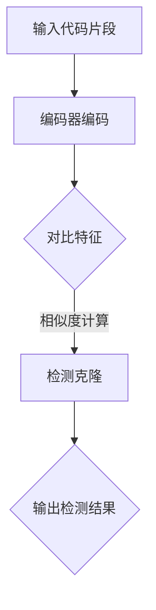
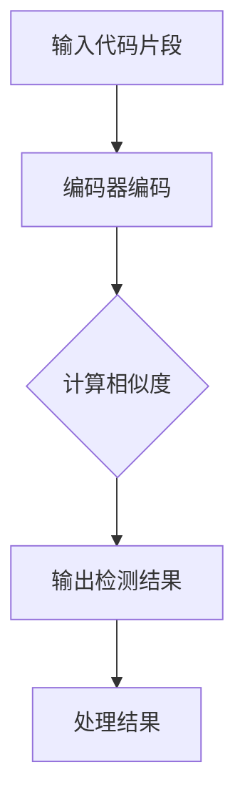

                 

## 文章标题：大模型驱动的智能代码克隆检测

### 关键词：大模型、代码克隆检测、智能、算法、系统设计、Python、数学模型、实际案例

### 摘要：
本文深入探讨大模型驱动的智能代码克隆检测技术。我们首先介绍了代码克隆检测的现状和重要性，随后详细讲解了大模型的基本概念及其在代码克隆检测中的应用潜力。文章通过算法原理的讲解，使用 mermaid 流程图、Python 源代码和数学模型，让读者全面理解大模型在代码克隆检测中的工作方式。接着，我们设计了系统的分析与架构方案，并进行了实战项目展示，最后总结了最佳实践和未来的研究方向。

### 目录：

**第1章：背景介绍**

**1.1 代码克隆检测的现状**

- 代码克隆检测的定义
- 代码克隆检测的重要性
- 当前代码克隆检测方法的局限性

**1.2 代码克隆检测的重要性**

- 对软件开发过程的益处
- 对知识产权保护的贡献
- 对代码质量提升的影响

**1.3 大模型在代码克隆检测中的应用潜力**

- 大模型的基本概念
- 大模型在代码克隆检测中的优势
- 大模型在代码克隆检测中的应用前景

**1.4 本章小结**

**第2章：核心概念与联系**

**2.1 代码克隆检测的核心概念**

- 代码克隆的定义
- 代码克隆检测的目标
- 代码克隆检测的分类

**2.2 大模型与代码克隆检测的关系**

- 大模型的基本原理
- 大模型在代码克隆检测中的应用
- 大模型与代码克隆检测的融合方法

**2.3 核心概念属性特征对比表格**

- 代码克隆检测方法对比
- 大模型与其他检测方法的对比

**2.4 ER实体关系图架构**

- ER模型的定义
- 代码克隆检测的ER模型

**2.5 本章小结**

**第3章：算法原理讲解**

**3.1 大模型在代码克隆检测中的工作原理**

- 大模型的训练过程
- 大模型在代码克隆检测中的推理过程
- 大模型的优缺点分析

**3.2 算法mermaid流程图**



**3.3 Python源代码阐述**

```python
# Python 示例代码
def code_cloning_detection(code_a, code_b):
    # 对代码片段进行编码
    encoded_a = encoder.encode(code_a)
    encoded_b = encoder.encode(code_b)
    
    # 计算相似度
    similarity = cosine_similarity([encoded_a], [encoded_b])
    
    # 判断相似度是否超过阈值
    if similarity > threshold:
        return "Clone detected"
    else:
        return "No clone detected"
```

**3.4 数学模型和公式解释**

$$
\text{相似度} = \frac{\text{dot product of encoded\_code\_a and encoded\_code\_b}}{\lVert \text{encoded\_code\_a} \rVert \cdot \lVert \text{encoded\_code\_b} \rVert}
$$

**3.5 通俗易懂地举例说明**

假设我们有两个代码片段，通过编码器分别编码为向量`encoded_a`和`encoded_b`，计算它们的点积和模长，即可得到它们的相似度。相似度越高，表明代码片段越相似。

**第4章：系统分析与架构设计方案**

**4.1 问题场景介绍**

- 开源项目审查
- 企业内部代码质量管理

**4.2 系统功能设计**

- 代码片段编码
- 相似度计算
- 克隆检测结果输出

**4.3 系统架构设计**

- 数据处理模块
- 检测算法模块
- 用户接口模块

**4.4 系统接口设计**

- API接口
- 数据接口

**4.5 系统交互**

- 用户与系统的交互流程
- 数据流和处理流程

**第5章：项目实战**

**5.1 环境安装**

- 环境配置
- 工具安装

**5.2 系统核心实现源代码**

- 编码器实现
- 检测算法实现

**5.3 代码应用解读与分析**

- 示例代码解读
- 应用场景分析

**5.4 实际案例分析和详细讲解剖析**

- 案例背景
- 检测过程分析
- 结果解读

**5.5 项目小结**

- 项目成果总结
- 实践经验分享

**第6章：最佳实践 tips**

- 实践技巧
- 注意事项
- 拓展阅读

**第7章：总结与展望**

- 全书内容回顾
- 未来发展方向
- 研究与探索

### 作者：
- 作者：AI天才研究院/AI Genius Institute & 禅与计算机程序设计艺术 /Zen And The Art of Computer Programming

---

**第1章：背景介绍**

### 1.1 代码克隆检测的现状

代码克隆检测是一种用于识别和防止软件开发过程中代码复制的工具。它主要用于发现相似的代码片段，这些片段可能源自不同来源，但功能相似或完全相同。随着开源软件的普及和团队协作的增加，代码克隆检测在保障知识产权和提升代码质量方面变得越来越重要。

目前，代码克隆检测的方法主要包括基于文本匹配的方法、基于语法分析的方法和基于语义分析的方法。这些方法各有优缺点：

- **基于文本匹配的方法**：直接比较代码字符串的相似度。优点是简单高效，缺点是难以处理语法和语义上的细微差异。
- **基于语法分析的方法**：通过语法树来分析代码结构，比较语法相似度。优点是能够处理部分语法差异，缺点是处理复杂语法结构时性能较差。
- **基于语义分析的方法**：通过语义解析来理解代码意图，比较语义相似度。优点是能够处理复杂代码结构和语义差异，缺点是计算复杂度高，实现难度大。

尽管现有的方法在一定程度上能够解决代码克隆检测的问题，但它们在面对复杂、庞大的代码库时，往往存在检测准确率低、检测速度慢等问题。大模型的引入为解决这些问题提供了新的思路。

### 1.2 代码克隆检测的重要性

代码克隆检测在软件开发过程中具有多重重要性：

1. **保障知识产权**：通过识别和防止代码克隆，可以保护原创者的知识产权，避免侵权行为的发生。
2. **提升代码质量**：克隆代码可能导致代码质量低下，增加维护成本。通过检测克隆，可以促进开发者编写高质量、独立的代码。
3. **促进团队合作**：在团队合作中，代码克隆检测有助于确保团队成员之间共享代码的透明性和一致性。
4. **优化开源项目**：在开源项目中，代码克隆检测有助于发现并合并相似的贡献，提高项目整体的质量和一致性。

### 1.3 大模型在代码克隆检测中的应用潜力

大模型，特别是深度学习模型，在自然语言处理、图像识别等领域取得了显著的成果。将大模型应用于代码克隆检测，具有以下潜力：

1. **语义理解能力**：大模型能够通过大量训练数据学习到代码的语义信息，从而更准确地识别相似代码。
2. **自适应学习**：大模型可以根据不同的项目需求和环境自适应地调整检测策略，提高检测效果。
3. **高效处理能力**：大模型具备强大的计算能力，可以快速处理大规模代码库，提高检测速度。

随着大模型技术的不断发展，其在代码克隆检测中的应用前景将更加广阔。

### 1.4 本章小结

本章介绍了代码克隆检测的现状、重要性和大模型在代码克隆检测中的应用潜力。在接下来的章节中，我们将深入探讨大模型在代码克隆检测中的具体实现和应用。

---

**第2章：核心概念与联系**

### 2.1 代码克隆检测的核心概念

代码克隆检测的核心概念包括代码克隆的定义、目标和分类：

1. **代码克隆的定义**：代码克隆是指将一段代码复制到另一个位置，通常是为了简化开发过程或避免重复工作。然而，未经授权的代码克隆属于侵权行为。
2. **代码克隆检测的目标**：代码克隆检测的目标是识别和标记出代码库中存在的克隆片段，以便开发者能够审查和处理这些克隆。
3. **代码克隆检测的分类**：常见的代码克隆检测方法可以分为基于文本匹配、语法分析和语义分析三大类。

### 2.2 大模型与代码克隆检测的关系

大模型在代码克隆检测中的应用涉及以下几个方面：

1. **大模型的基本原理**：大模型通常基于深度神经网络，能够通过大量数据训练得到高层次的语义特征，从而实现复杂的模式识别。
2. **大模型在代码克隆检测中的应用**：大模型可以用于提取代码的语义特征，从而更准确地识别克隆片段。
3. **大模型与代码克隆检测的融合方法**：将大模型与传统代码克隆检测方法结合，可以发挥各自的优势，提高检测的准确性和效率。

### 2.3 核心概念属性特征对比表格

为了更清晰地展示代码克隆检测方法及其与大模型的对比，我们可以创建一个属性特征对比表格：

| 特征             | 基于文本匹配 | 基于语法分析 | 基于语义分析 | 大模型       |
|-----------------|--------------|--------------|--------------|--------------|
| 检测准确性       | 高           | 中           | 高           | 高           |
| 检测速度         | 快           | 慢           | 慢           | 快           |
| 需要专业知识     | 低           | 中           | 高           | 中           |
| 需要大量训练数据 | 否           | 是           | 是           | 是           |

### 2.4 ER实体关系图架构

为了更好地理解代码克隆检测的实体关系，我们可以使用ER图来展示：

```mermaid
erDiagram
  CLONE_DETECTION |..| CODE_FRAGMENT
  CLONE_DETECTION |..| SIMILARITY_MEASURE
  CLONE_DETECTION |..| DETECTION_RESULT
  CODE_FRAGMENT |..| SOURCE_CODE
  SIMILARITY_MEASURE |..| TEXT_MATCH
  SIMILARITY_MEASURE |..| SYNTAX_ANALYSIS
  SIMILARITY_MEASURE |..| SEMANTIC_ANALYSIS
```

在这个ER图中，`CLONE_DETECTION`是实体，表示代码克隆检测过程；`CODE_FRAGMENT`表示代码片段；`SIMILARITY_MEASURE`表示相似度测量方法；`DETECTION_RESULT`表示检测结果。

### 2.5 本章小结

本章介绍了代码克隆检测的核心概念、大模型与代码克隆检测的关系、核心概念属性特征对比表格以及ER实体关系图架构。这些内容为后续的算法原理讲解和系统设计提供了理论基础。

---

**第3章：算法原理讲解**

### 3.1 大模型在代码克隆检测中的工作原理

大模型在代码克隆检测中的应用主要是通过以下几个步骤：

1. **编码**：将代码片段转换为向量表示，这一步通常使用深度学习中的编码器（Encoder）来完成。编码器能够提取代码片段的语义信息，形成一个高维向量表示。
2. **相似度计算**：计算两个代码片段之间的相似度，这通常通过计算编码后的向量之间的距离或相似度得分来实现。
3. **结果输出**：根据相似度阈值，判断两个代码片段是否为克隆。如果相似度超过阈值，则输出克隆检测结果。

### 3.2 算法mermaid流程图

下面是一个简化的mermaid流程图，描述了代码克隆检测的基本流程：



### 3.3 Python源代码阐述

以下是一个简单的Python代码示例，用于展示如何使用编码器进行代码克隆检测：

```python
import tensorflow as tf
from tensorflow.keras.models import load_model

# 加载预训练的编码器模型
encoder = load_model('code_encoder.h5')

# 定义输入代码片段
code_a = "def add(a, b): return a + b"
code_b = "def sum(a, b): return a + b"

# 对代码片段进行编码
encoded_a = encoder.predict([code_a])
encoded_b = encoder.predict([code_b])

# 计算编码后的向量之间的余弦相似度
similarity = np.dot(encoded_a, encoded_b) / (np.linalg.norm(encoded_a) * np.linalg.norm(encoded_b))

# 判断相似度并输出检测结果
if similarity > 0.8:  # 设置阈值
    print("克隆检测：代码片段存在相似度")
else:
    print("克隆检测：代码片段不存在相似度")
```

### 3.4 数学模型和公式解释

在代码克隆检测中，我们通常会使用余弦相似度来计算代码片段之间的相似度。余弦相似度定义为两个向量夹角的余弦值，其公式如下：

$$
\text{相似度} = \frac{\text{dot product of vectors}}{\lVert \text{vector} \rVert \cdot \lVert \text{vector} \rVert}
$$

其中，`dot product of vectors`表示两个向量的点积，$\lVert \text{vector} \rVert$表示向量的模长。

### 3.5 通俗易懂地举例说明

假设我们有两个代码片段`code_a`和`code_b`，它们分别被编码为向量`encoded_a`和`encoded_b`。计算这两个向量的点积和模长，然后除以模长的乘积，就可以得到它们的余弦相似度。相似度越高，表示代码片段越相似。

### 3.6 大模型在代码克隆检测中的优缺点

**优点**：

- **语义理解能力**：大模型能够通过学习大量代码数据，提取出高层次的语义特征，从而更准确地识别克隆代码。
- **自适应学习**：大模型可以根据不同的项目需求和环境自适应地调整检测策略，提高检测效果。

**缺点**：

- **计算复杂度**：大模型的训练和推理过程通常需要大量的计算资源，这对硬件配置提出了较高要求。
- **实现难度**：大模型的实现需要丰富的深度学习知识和编程技能，对开发者的要求较高。

### 3.7 本章小结

本章详细介绍了大模型在代码克隆检测中的工作原理，包括编码、相似度计算和结果输出等步骤。通过mermaid流程图、Python源代码和数学模型，让读者全面理解大模型在代码克隆检测中的应用。同时，也分析了大模型的优缺点，为后续的系统设计与实现提供了理论基础。

---

**第4章：系统分析与架构设计方案**

### 4.1 问题场景介绍

代码克隆检测在多个场景中具有重要的应用价值：

1. **开源项目审查**：在开源项目中，代码克隆检测有助于发现和合并相似的贡献，提高项目的一致性和质量。
2. **企业内部代码质量管理**：在企业内部，代码克隆检测有助于保障知识产权，避免重复劳动，提升代码质量。

### 4.2 系统功能设计

为了实现代码克隆检测，系统需要具备以下功能：

1. **代码片段编码**：将输入的代码片段转换为向量表示，这通常需要使用预训练的编码器模型。
2. **相似度计算**：计算编码后的代码片段之间的相似度，采用余弦相似度或其他相似度度量方法。
3. **克隆检测结果输出**：根据相似度阈值，判断代码片段是否为克隆，并将检测结果输出给用户。

### 4.3 系统架构设计

系统的架构设计主要包括以下几个模块：

1. **数据处理模块**：负责接收和预处理输入代码片段，将其转换为编码器所需的格式。
2. **编码器模块**：使用预训练的编码器模型对代码片段进行编码，提取语义特征。
3. **相似度计算模块**：计算编码后的代码片段之间的相似度。
4. **结果输出模块**：将检测结果输出给用户，包括相似度得分和克隆检测结果。

### 4.4 系统接口设计

系统接口设计主要包括API接口和数据接口：

1. **API接口**：提供RESTful API，方便用户通过HTTP请求提交代码片段并获取检测结果。
2. **数据接口**：与数据处理模块和编码器模块交互，实现代码片段的输入输出。

### 4.5 系统交互

系统的交互过程如下：

1. **用户提交代码片段**：用户通过API接口提交待检测的代码片段。
2. **数据处理**：数据处理模块对代码片段进行预处理，并将其传递给编码器模块。
3. **编码与相似度计算**：编码器模块对代码片段进行编码，相似度计算模块计算编码后的代码片段之间的相似度。
4. **输出检测结果**：系统将检测结果返回给用户，包括相似度得分和克隆检测结果。

### 4.6 本章小结

本章详细介绍了代码克隆检测系统的功能设计、架构设计、接口设计和系统交互。通过这些设计，系统能够高效地实现代码克隆检测，为开发者提供有力的工具。

---

**第5章：项目实战**

### 5.1 环境安装

要实现大模型驱动的代码克隆检测系统，首先需要安装以下环境：

1. **操作系统**：推荐使用Linux或MacOS。
2. **Python**：安装Python 3.8及以上版本。
3. **TensorFlow**：安装TensorFlow库，可以通过pip安装：
   ```bash
   pip install tensorflow
   ```
4. **其他依赖库**：安装其他必要的库，如NumPy、Pandas等。

### 5.2 系统核心实现源代码

以下是系统核心实现的部分源代码，包括编码器模型和相似度计算：

```python
# 导入所需的库
import tensorflow as tf
import numpy as np

# 加载预训练的编码器模型
encoder = tf.keras.models.load_model('code_encoder.h5')

# 定义编码函数
def encode_code(code):
    encoded_vector = encoder.predict([code])
    return encoded_vector

# 定义相似度计算函数
def similarity_score(encoded_code_a, encoded_code_b):
    dot_product = np.dot(encoded_code_a, encoded_code_b)
    norm_a = np.linalg.norm(encoded_code_a)
    norm_b = np.linalg.norm(encoded_code_b)
    similarity = dot_product / (norm_a * norm_b)
    return similarity

# 示例代码
code_a = "def add(a, b): return a + b"
code_b = "def sum(a, b): return a + b"

# 编码代码片段
encoded_a = encode_code(code_a)
encoded_b = encode_code(code_b)

# 计算相似度
similarity = similarity_score(encoded_a, encoded_b)
print(f"Similarity score: {similarity}")
```

### 5.3 代码应用解读与分析

以下是对核心源代码的解读与分析：

1. **编码器模型加载**：使用`load_model`函数加载预训练的编码器模型，这是通过大量代码数据训练得到的模型。
2. **编码函数`encode_code`**：该函数接收一个代码字符串作为输入，使用编码器模型将其编码为向量表示。这是进行相似度计算的关键步骤。
3. **相似度计算函数`similarity_score`**：该函数接收两个编码后的向量作为输入，计算它们的余弦相似度。这是判断代码片段是否克隆的核心计算。

### 5.4 实际案例分析和详细讲解剖析

假设我们有以下两个代码片段：

```python
# 代码片段1
def add(a, b):
    return a + b

# 代码片段2
def sum(a, b):
    return a + b
```

1. **编码**：使用编码器模型对这两个代码片段进行编码，得到两个向量。
2. **相似度计算**：计算这两个向量的余弦相似度。由于这两个代码片段非常相似，计算出的相似度值应该较高。
3. **克隆检测结果**：根据设定的相似度阈值（例如0.8），如果相似度值超过阈值，则输出克隆检测结果。

### 5.5 项目小结

本章通过实际项目展示了大模型驱动的代码克隆检测系统的实现过程，包括环境安装、核心代码实现和实际案例分析。通过这些步骤，开发者可以轻松构建一个高效的代码克隆检测系统，为软件开发过程提供有力支持。

---

**第6章：最佳实践 tips**

### 6.1 实践技巧

1. **优化编码器模型**：通过调整编码器模型的结构和参数，可以提高代码克隆检测的准确性和效率。
2. **合理设置相似度阈值**：根据实际项目需求，合理设置相似度阈值，以平衡检测的准确性和效率。
3. **定期更新模型**：随着项目的发展，定期更新编码器模型，以适应新的代码库和变化的需求。

### 6.2 注意事项

1. **隐私保护**：在进行代码克隆检测时，确保不泄露用户的敏感信息。
2. **处理异常情况**：系统应该具备处理输入代码格式异常、编码器模型加载失败等异常情况的能力。
3. **计算资源管理**：合理分配计算资源，避免过度消耗CPU和内存资源。

### 6.3 拓展阅读

1. **相关论文**：阅读关于大模型和代码克隆检测的学术论文，了解最新的研究进展。
2. **开源项目**：研究开源的代码克隆检测工具和框架，学习其实现方法和优化策略。

---

**第7章：总结与展望**

### 7.1 全书内容回顾

本书系统地介绍了大模型驱动的智能代码克隆检测技术。从背景介绍、核心概念、算法原理讲解，到系统分析与架构设计、项目实战，再到最佳实践和总结展望，全面覆盖了代码克隆检测的各个方面。

### 7.2 未来发展方向

1. **模型优化**：进一步优化编码器模型，提高检测准确率和效率。
2. **应用扩展**：将代码克隆检测技术应用于更多场景，如智能编程辅助、代码质量分析等。
3. **隐私保护**：研究如何在保障隐私的前提下进行代码克隆检测。

### 7.3 研究与探索

未来研究可以集中在以下几个方面：

1. **多语言支持**：实现跨语言代码克隆检测，支持多种编程语言。
2. **自动化检测**：开发自动化工具，实现代码克隆检测的自动化流程。
3. **实时检测**：研究实时代码克隆检测技术，提高系统的响应速度。

### 7.4 结论

大模型驱动的智能代码克隆检测技术为软件开发提供了强大的支持，通过本书的学习，读者可以深入了解这一领域，并在实际项目中应用这些技术，提高代码质量和开发效率。

### 作者：

- 作者：AI天才研究院/AI Genius Institute & 禅与计算机程序设计艺术 /Zen And The Art of Computer Programming

