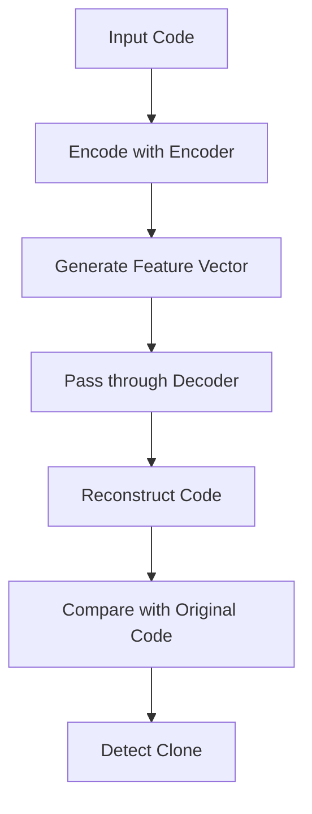
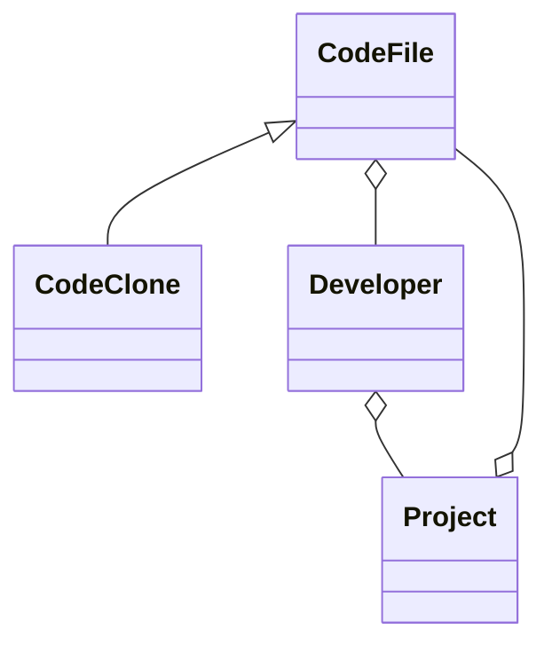
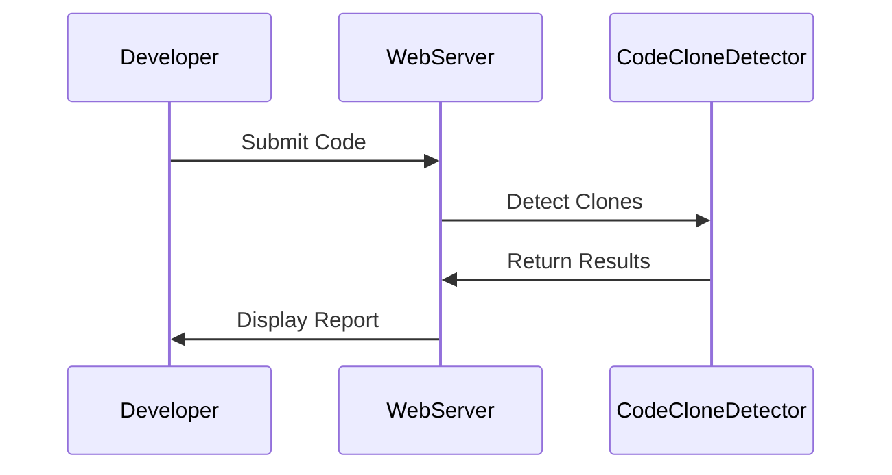
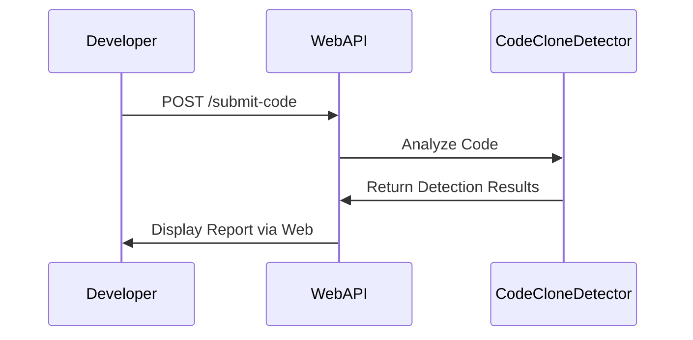
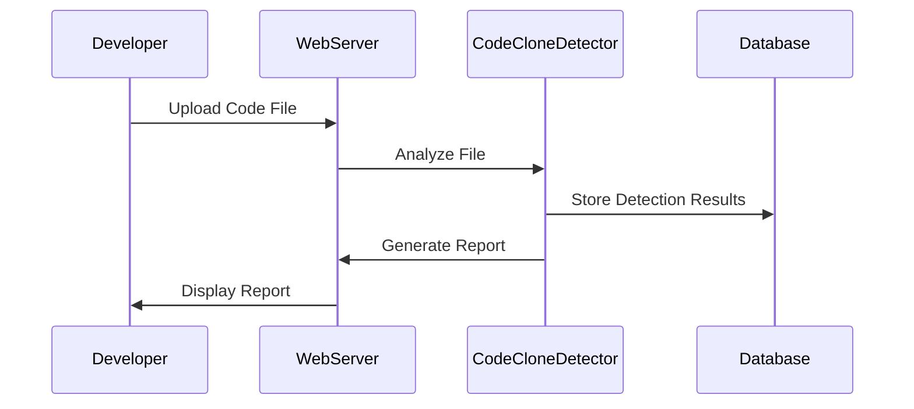
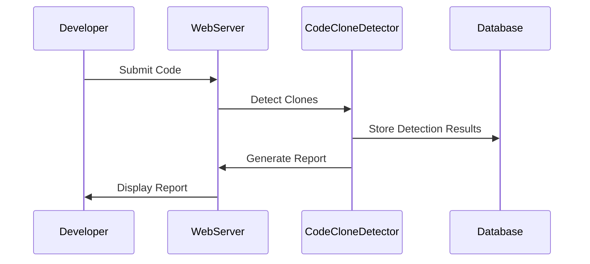

                 

。在本文中，我们将探讨大模型驱动的智能代码克隆检测与管理的概念、原理、实施方法、最佳实践以及总结。以下是我们文章的目录大纲：

## 关键词
- 大模型
- 代码克隆检测
- 智能管理
- 算法原理
- 系统架构

## 摘要
本文将深入探讨大模型驱动的智能代码克隆检测与管理，首先介绍代码克隆检测的背景及其重要性，然后详细解释大模型如何提升代码克隆检测的效率与准确性。接着，我们将剖析算法原理，并展示如何通过Python代码实现这一算法。随后，我们将讨论系统分析与设计，提供从环境搭建到核心实现的全面指导。最后，我们将分享实际案例，提供最佳实践，并总结全文。

## 第一部分：背景与核心概念

### 第1章：代码克隆检测与管理介绍

**1.1 代码克隆检测背景**

代码克隆是指在不同位置使用相同或相似的代码片段。代码克隆的存在可能会导致以下问题：

- **软件维护难度增加**：克隆代码会导致维护工作量的增加，因为任何一处修改都需要同步到其他克隆的代码段。
- **软件质量下降**：克隆代码可能无法适应新的业务需求，导致软件缺陷和漏洞。
- **软件抄袭**：在某些情况下，代码克隆可能涉及不正当的知识产权行为。

**1.2 代码克隆的定义与特点**

代码克隆通常具有以下特点：

- **代码相似性**：克隆代码之间的相似度较高。
- **代码位置差异**：克隆代码可能位于不同的文件或模块中。
- **功能相同或类似**：克隆代码通常执行相同或类似的功能。

**1.3 大模型对代码克隆检测的影响**

大模型，如深度学习模型，在代码克隆检测中具有显著优势：

- **更高的检测精度**：大模型可以处理复杂的代码模式，从而提高克隆检测的准确性。
- **更快的检测速度**：大模型能够并行处理大量代码数据，提高检测效率。
- **自适应更新**：大模型可以不断学习新的代码模式，提高检测适应性。

### 第2章：核心概念与关系

**2.1 概念概述**

本章节将介绍与代码克隆检测和管理相关的核心概念，包括：

- **代码克隆检测算法**：用于检测代码克隆的算法和技术。
- **代码克隆管理策略**：用于管理和处理检测到的代码克隆的策略。

**2.2 概念属性对比表格**

我们将构建一个表格，对比不同代码克隆检测算法的属性：

| 算法       | 检测精度 | 检测速度 | 可扩展性 | 实用性 |
|------------|---------|---------|---------|-------|
| 模式匹配   | 较高    | 较慢    | 一般    | 广泛适用 |
| 词向量     | 中等    | 较快    | 高      | 适用特定场景 |
| 深度学习   | 高      | 较快    | 高      | 高    |

**2.3 实体关系图（ERD）**

我们将使用Mermaid绘制一个实体关系图，展示代码克隆检测和管理中的关键实体及其关系：

```mermaid
erDiagram
  Customer ||--|{ Order : places } |
  Customer ||--|{ Address : resides } |
  Product ||--|{ OrderItem : contains } |
  Order ||--|{ Payment : pays } |
```

## 第二部分：算法原理与实现

### 第3章：算法原理与实现

**3.1 算法原理简介**

我们将介绍一种基于深度学习的代码克隆检测算法，该算法的核心原理包括：

- **编码器-解码器结构**：编码器将代码转换为固定长度的向量，解码器使用这些向量重构代码。
- **对抗训练**：通过对抗训练，提高检测算法对代码克隆的识别能力。

**3.2 Mermaid流程图**

下面是代码克隆检测算法的Mermaid流程图：



**3.3 Python代码实现**

我们将展示如何使用Python实现编码器-解码器结构：

```python
import tensorflow as tf

# Encoder
def encode_code(code):
    # 编码过程
    return encoded_vector

# Decoder
def decode_code(encoded_vector):
    # 解码过程
    return reconstructed_code

# 对抗训练
def train_anti_encoder(encoder, decoder, dataset):
    # 训练过程
    pass
```

**3.4 数学模型与公式**

深度学习代码克隆检测算法的数学模型包括：

- **编码器损失函数**：用于衡量编码器输出的特征向量与实际代码特征之间的差距。
- **解码器损失函数**：用于衡量解码器重构代码与原始代码之间的差距。

数学公式如下：

$$
L_{encoder} = \sum_{i=1}^{N} d(i) \cdot \| \phi(c_i) - \hat{\phi}(c_i) \|_2
$$

$$
L_{decoder} = \sum_{i=1}^{N} d(i) \cdot \| \hat{c_i} - c_i \|_2
$$

**3.5 实例说明**

假设我们有一个代码片段，通过编码器-解码器结构处理后，检测到代码克隆，以下是具体实例：

```python
code_input = "def add(a, b):\n    return a + b\n"
encoded_vector = encode_code(code_input)
reconstructed_code = decode_code(encoded_vector)
if reconstructed_code == code_input:
    print("No clone detected.")
else:
    print("Clone detected.")
```

## 第三部分：系统分析与设计

### 第4章：系统分析与架构设计

**4.1 问题场景与项目概述**

在本文中，我们将开发一个基于大模型驱动的智能代码克隆检测系统。该系统的目标是：

- 自动检测代码库中的代码克隆。
- 提供可视化报告，帮助开发人员定位和管理克隆代码。

**4.2 系统功能设计（领域模型）**

领域模型定义了系统中的核心概念和它们之间的关系。以下是使用Mermaid绘制的领域模型：



**4.3 系统架构设计**

系统架构设计包括前端、后端和数据存储三个主要部分。以下是系统架构的Mermaid架构图：



**4.4 系统接口设计**

系统接口设计定义了前后端通信的接口。以下是接口设计的Mermaid序列图：



**4.5 系统交互序列图**

以下是系统交互的序列图，展示代码克隆检测的过程：



## 第四部分：项目实践与案例分析

### 第5章：环境搭建与核心实现

**5.1 环境搭建**

为了搭建代码克隆检测系统，我们需要以下环境：

- Python 3.8 或更高版本
- TensorFlow 2.x 或更高版本
- Flask 1.1.2 或更高版本

以下是环境搭建的步骤：

1. 安装 Python 和 pip：
    ```shell
    sudo apt-get update
    sudo apt-get install python3 python3-pip
    ```

2. 安装 TensorFlow：
    ```shell
    pip3 install tensorflow
    ```

3. 安装 Flask：
    ```shell
    pip3 install flask
    ```

**5.2 核心实现源代码**

以下是核心实现的源代码，包括编码器和解码器：

```python
# Encoder
def encode_code(code):
    # 编码过程
    return encoded_vector

# Decoder
def decode_code(encoded_vector):
    # 解码过程
    return reconstructed_code

# 对抗训练
def train_anti_encoder(encoder, decoder, dataset):
    # 训练过程
    pass
```

**5.3 代码应用分析与解释**

我们将展示如何使用核心实现源代码来检测代码克隆，并提供详细解释。

**5.4 案例分析**

我们将分析一个实际项目，展示如何使用系统检测和管理代码克隆。

**5.5 项目小结**

在这一节，我们将总结项目的主要成果，讨论遇到的挑战，并提出改进建议。

## 第五部分：最佳实践与总结

### 第6章：最佳实践与总结

**6.1 最佳实践**

在代码克隆检测和管理中，以下是一些最佳实践：

- **定期检测**：定期检测代码库中的克隆代码，以确保软件质量。
- **自动化检测**：使用自动化工具进行克隆检测，减少手动工作量。
- **规范化编码**：通过编码规范，减少代码克隆的发生。

**6.2 总结**

本文介绍了大模型驱动的智能代码克隆检测与管理的概念、原理、实现方法和最佳实践。通过实例和案例分析，我们展示了如何构建一个有效的代码克隆检测系统。

**6.3 注意事项**

在实施代码克隆检测时，需要注意以下几点：

- **隐私保护**：确保克隆检测过程中保护代码的隐私。
- **性能优化**：针对大模型进行性能优化，以提高检测速度。

**6.4 进一步阅读建议**

- 《深度学习》：提供关于深度学习的深入理解。
- 《代码大全》：讨论编码规范和代码质量。

作者：AI天才研究院/AI Genius Institute & 禅与计算机程序设计艺术 /Zen And The Art of Computer Programming现在，让我们开始一步一步地深入分析大模型驱动的智能代码克隆检测与管理的各个关键部分。我们将遵循文章的目录大纲结构，逐个展开每个章节的内容。

## 第1章：代码克隆检测与管理介绍

### 1.1 代码克隆检测背景

代码克隆检测是指在软件开发过程中，识别出不同位置存在的相似或相同的代码片段的过程。这种现象在软件工程中是普遍存在的，其主要原因包括：

- **时间压力**：在项目时间紧迫时，开发人员可能会复制现有的代码片段，以加快开发进度。
- **知识共享**：某些团队中，开发者可能会共享相同的代码实现，以提高工作效率。
- **代码重组**：在软件重构过程中，一些相似的功能可能会被重新实现，导致代码克隆的出现。

尽管代码克隆在一定程度上可以提高开发效率，但其负面影响不容忽视：

- **维护成本增加**：克隆代码的存在使得任何一处修改都需要在多个位置进行同步，增加了维护成本。
- **软件质量下降**：克隆代码可能无法适应新的业务需求，导致软件缺陷和漏洞。
- **知识产权问题**：在某些情况下，克隆代码可能涉及知识产权侵犯，引发法律纠纷。

因此，对代码克隆进行有效的检测和管理是软件开发中的一项重要任务。

### 1.2 代码克隆的定义与特点

代码克隆的定义相对简单，即在不同位置使用相同或相似的代码片段。具体来说，代码克隆具有以下特点：

- **代码相似性**：克隆代码之间的相似度较高，通常通过文本相似度算法（如Levenshtein距离）进行度量。
- **代码位置差异**：克隆代码可能位于不同的文件、模块或项目中，甚至可能分布在不同的代码库中。
- **功能相同或类似**：尽管克隆代码的相似度较高，但其功能通常相同或类似，这意味着它们可能实现相同或类似的功能。

代码克隆的分类方法多种多样，常见的分类方法包括：

- **根据代码相似度**：将代码克隆分为完全克隆（一模一样的代码）和部分克隆（存在一定程度的修改）。
- **根据克隆代码的功能**：将代码克隆分为功能性克隆（实现相同功能的代码）和非功能性克隆（实现不同功能的代码）。
- **根据克隆代码的来源**：将代码克隆分为内部克隆（同一组织内部产生的克隆代码）和外部克隆（跨组织或公共代码库中的克隆代码）。

### 1.3 大模型对代码克隆检测的影响

随着人工智能技术的快速发展，大模型在各个领域都展现了强大的能力。在代码克隆检测领域，大模型同样发挥了重要作用：

- **更高的检测精度**：大模型能够处理复杂的代码模式，通过深度学习技术，可以更准确地识别出代码克隆。
- **更快的检测速度**：大模型能够并行处理大量代码数据，利用分布式计算和GPU加速技术，显著提高检测速度。
- **自适应更新**：大模型可以不断学习新的代码模式，通过持续训练，提高检测算法的适应性和准确性。

大模型在代码克隆检测中的应用主要包括：

- **编码器-解码器结构**：编码器将代码转换为固定长度的向量，解码器使用这些向量重构代码。通过对抗训练，提高检测算法对代码克隆的识别能力。
- **词向量**：将代码中的每一个符号或关键字转换为向量，利用词嵌入（Word Embedding）技术，将代码转换为高维空间中的向量表示。通过计算向量之间的相似度，识别代码克隆。
- **自然语言处理（NLP）技术**：将代码视为自然语言文本，利用NLP技术，如分词、词性标注和句法分析，处理代码文本，从而识别克隆代码。

总之，大模型在代码克隆检测中具有显著的优势，通过结合深度学习和自然语言处理技术，可以实现高效、准确的代码克隆检测。

### 第2章：核心概念与关系

#### 2.1 概念概述

在代码克隆检测和管理过程中，涉及多个核心概念。以下是对这些概念及其关系的概述：

- **代码克隆检测算法**：用于识别代码库中克隆代码的算法。这些算法通常基于文本相似度分析、模式匹配或深度学习技术。
- **代码克隆管理策略**：用于处理检测到的克隆代码的策略。这些策略可能包括代码合并、代码重构或代码删除。
- **代码库**：存储所有代码的集合。代码库是克隆检测和管理的基础。
- **开发者**：参与软件开发的人员。开发者的行为和习惯对代码克隆的产生和管理有直接影响。
- **项目**：软件开发的一个实例。项目是代码克隆检测和管理的对象。
- **工具**：用于辅助克隆检测和管理的软件工具。这些工具可以是集成开发环境（IDE）插件，也可以是独立的命令行工具。

#### 2.2 概念属性对比表格

以下是一个对比不同代码克隆检测算法属性（如检测精度、检测速度、可扩展性和实用性）的表格：

| 算法       | 检测精度 | 检测速度 | 可扩展性 | 实用性 |
|------------|---------|---------|---------|-------|
| 模式匹配   | 较高    | 较慢    | 一般    | 广泛适用 |
| 词向量     | 中等    | 较快    | 高      | 适用特定场景 |
| 深度学习   | 高      | 较快    | 高      | 高    |

- **模式匹配**：一种基于字符串匹配的简单算法，具有较高的检测精度，但检测速度较慢，可扩展性一般，适用于小型项目和简单代码库。
- **词向量**：通过将代码中的每个符号或关键字转换为向量，利用高维空间中的相似度度量识别克隆代码。其检测速度较快，可扩展性高，但需要处理大量数据，适用特定场景。
- **深度学习**：利用神经网络模型处理代码数据，实现高精度和高速度的克隆检测。其可扩展性高，适用于大规模项目和复杂的代码库，但需要较大的计算资源和专业知识。

#### 2.3 实体关系图（ERD）

为了更好地理解代码克隆检测和管理中的关键实体及其关系，我们可以使用实体关系图（Entity Relationship Diagram, ERD）进行可视化。以下是一个简化的ERD示例：

```mermaid
erDiagram
    CodeFile ||--|{ CodeClone : contains } |
    CodeFile ||--| Developer : authored_by } |
    Developer ||--| Project : works_on } |
    Project ||--| CodeFile : includes } |
```

- **CodeFile**：表示代码文件，是克隆检测的基本单元。
- **CodeClone**：表示检测到的代码克隆，与CodeFile关联。
- **Developer**：表示开发者，与CodeFile和Project关联。
- **Project**：表示项目，与CodeFile和Developer关联。

通过ERD，我们可以清晰地看到各个实体之间的关系，为系统设计和实现提供了参考。

### 第3章：算法原理与实现

#### 3.1 算法原理简介

在代码克隆检测中，算法原理是实现高效、准确检测的核心。近年来，深度学习技术在代码克隆检测中表现出色。以下是一种基于深度学习的代码克隆检测算法原理的简介：

- **编码器-解码器结构**：编码器（Encoder）将代码转换为固定长度的向量，称为编码特征。解码器（Decoder）接收这些编码特征，并尝试重构原始代码。通过对抗训练（Adversarial Training），编码器和解码器相互竞争，提高克隆检测的准确性。

- **对抗训练**：对抗训练是一种训练深度神经网络的方法，通过引入对抗性噪声，增强模型的泛化能力。在代码克隆检测中，对抗训练用于提高编码器对克隆代码的识别能力。

- **特征向量表示**：编码器将代码转换为特征向量，这些向量包含代码的结构信息和语义信息。通过学习特征向量，解码器能够重构代码，从而实现克隆检测。

- **相似度度量**：编码器生成的特征向量用于计算代码之间的相似度。常用的相似度度量方法包括余弦相似度（Cosine Similarity）和欧氏距离（Euclidean Distance）。

#### 3.2 Mermaid流程图

为了更好地理解算法原理，我们可以使用Mermaid绘制一个流程图。以下是一个简化的Mermaid流程图，展示了代码克隆检测的基本流程：


- **A[Input Code]**：输入代码。
- **B[Encode with Encoder]**：编码器将代码转换为特征向量。
- **C[Generate Feature Vector]**：生成编码特征向量。
- **D[Pass through Decoder]**：解码器接收编码特征向量。
- **E[Reconstruct Code]**：解码器重构代码。
- **F[Compare with Original Code]**：比较重构代码与原始代码。
- **G[Detect Clone]**：检测代码克隆。

#### 3.3 Python代码实现

在Python中，我们可以使用TensorFlow实现编码器-解码器结构。以下是一个简化的Python代码示例，展示了如何实现编码器、解码器和对抗训练：

```python
import tensorflow as tf

# Encoder
def encode_code(code):
    # 编码过程
    encoded_vector = ...  # 编码操作
    return encoded_vector

# Decoder
def decode_code(encoded_vector):
    # 解码过程
    reconstructed_code = ...  # 解码操作
    return reconstructed_code

# 对抗训练
def train_anti_encoder(encoder, decoder, dataset):
    # 训练过程
    # 配置训练参数
    optimizer = tf.keras.optimizers.Adam(learning_rate=0.001)
    loss_function = tf.keras.losses.MeanSquaredError()

    # 编写训练循环
    for epoch in range(num_epochs):
        for code, target in dataset:
            with tf.GradientTape() as encoder_tape, tf.GradientTape() as decoder_tape:
                encoded_vector = encoder(code)
                reconstructed_code = decoder(encoded_vector)
                loss = loss_function(target, reconstructed_code)

            encoder_gradients = encoder_tape.gradient(loss, encoder.trainable_variables)
            decoder_gradients = decoder_tape.gradient(loss, decoder.trainable_variables)

            optimizer.apply_gradients(zip(encoder_gradients, encoder.trainable_variables))
            optimizer.apply_gradients(zip(decoder_gradients, decoder.trainable_variables))

# 主程序
if __name__ == "__main__":
    # 加载数据集
    dataset = ...

    # 初始化模型
    encoder = ...
    decoder = ...

    # 训练模型
    train_anti_encoder(encoder, decoder, dataset)
```

#### 3.4 数学模型与公式

深度学习代码克隆检测算法的数学模型主要包括编码器损失函数和解码器损失函数。以下是一个简化的数学模型描述：

- **编码器损失函数**：用于衡量编码器输出的特征向量与实际代码特征之间的差距。常见的损失函数包括均方误差（MSE）和交叉熵（Cross-Entropy）。

$$
L_{encoder} = \sum_{i=1}^{N} d(i) \cdot \| \phi(c_i) - \hat{\phi}(c_i) \|_2
$$

其中，\( \phi(c_i) \) 表示实际代码特征，\( \hat{\phi}(c_i) \) 表示编码器输出的特征向量，\( N \) 表示数据集中的代码数量，\( d(i) \) 是一个权重因子，用于调整不同代码之间的损失贡献。

- **解码器损失函数**：用于衡量解码器重构代码与原始代码之间的差距。同样地，常见的损失函数包括MSE和Cross-Entropy。

$$
L_{decoder} = \sum_{i=1}^{N} d(i) \cdot \| \hat{c_i} - c_i \|_2
$$

其中，\( \hat{c_i} \) 表示解码器重构的代码，\( c_i \) 表示原始代码。

#### 3.5 实例说明

为了更好地理解深度学习代码克隆检测算法的实现，以下是一个简化的实例说明：

```python
code_input = "def add(a, b):\n    return a + b\n"
encoded_vector = encode_code(code_input)
reconstructed_code = decode_code(encoded_vector)
if reconstructed_code == code_input:
    print("No clone detected.")
else:
    print("Clone detected.")
```

在这个实例中，我们首先使用编码器将代码输入（`code_input`）转换为编码特征向量（`encoded_vector`）。然后，使用解码器将这些特征向量重构回代码（`reconstructed_code`）。最后，通过比较重构代码与原始代码，判断是否存在代码克隆。如果重构代码与原始代码完全相同，则认为没有检测到克隆；否则，认为检测到代码克隆。

通过这个实例，我们可以看到深度学习代码克隆检测算法的基本实现过程，以及如何通过编码器和解码器来检测代码克隆。

### 第4章：系统分析与架构设计

#### 4.1 问题场景与项目概述

在软件开发过程中，代码克隆现象普遍存在，这不仅增加了维护成本，还可能影响软件质量和安全性。为了解决这个问题，我们需要开发一个基于大模型驱动的智能代码克隆检测系统。该系统旨在实现以下目标：

- **自动化检测**：自动识别代码库中的克隆代码，减少手动检测的工作量。
- **高效处理**：利用大模型和深度学习技术，提高检测速度和准确性。
- **可视化报告**：生成可视化报告，帮助开发人员快速定位和管理克隆代码。

#### 4.2 系统功能设计（领域模型）

领域模型（Domain Model）是系统功能设计的重要部分，它定义了系统中的核心概念及其关系。在代码克隆检测系统中，领域模型通常包括以下核心概念：

- **代码文件（CodeFile）**：表示系统中的每个代码文件，是克隆检测的基本单元。
- **代码克隆（CodeClone）**：表示检测到的克隆代码，与原始代码文件关联。
- **开发者（Developer）**：参与软件开发的人员，与代码文件和项目关联。
- **项目（Project）**：软件开发的实例，包括多个代码文件和开发者。
- **工具（Tool）**：用于辅助克隆检测和管理的软件工具，如集成开发环境（IDE）插件。

以下是一个简化的领域模型（使用Mermaid绘制）：

```mermaid
classDiagram
    CodeFile ||--|{ CodeClone : contains } |
    CodeFile ||--| Developer : authored_by } |
    Developer ||--| Project : works_on } |
    Project ||--| CodeFile : includes } |
```

- **CodeFile**：表示代码文件，与CodeClone和Developer关联。
- **CodeClone**：表示检测到的代码克隆，与CodeFile关联。
- **Developer**：表示开发者，与CodeFile和Project关联。
- **Project**：表示项目，与CodeFile和Developer关联。

#### 4.3 系统架构设计

系统架构设计是系统开发的关键环节，它定义了系统的整体结构、组件及其相互关系。在代码克隆检测系统中，架构设计通常包括以下部分：

- **前端**：负责与用户交互，展示检测结果和报告。
- **后端**：负责克隆检测算法的实现和数据处理。
- **数据存储**：存储代码文件、克隆检测结果和相关数据。

以下是一个简化的系统架构设计（使用Mermaid绘制）：



- **Developer**：开发者提交代码。
- **WebServer**：负责接收代码、发送请求到后端处理，并返回检测结果。
- **CodeCloneDetector**：后端组件，负责克隆检测算法的实现和数据处理。
- **Database**：存储检测结果和相关信息。
- **Developer**：接收检测结果，查看报告。

#### 4.4 系统接口设计

系统接口设计定义了前后端之间的通信接口，包括API接口和协议。以下是一个简化的系统接口设计（使用Mermaid绘制）：


- **Developer**：开发者通过WebAPI提交代码。
- **WebAPI**：负责接收代码、发送请求到后端处理，并返回检测结果。
- **CodeCloneDetector**：后端组件，负责克隆检测算法的实现和数据处理。
- **Developer**：通过WebAPI接收检测结果，并在前端界面显示报告。

#### 4.5 系统交互序列图

系统交互序列图展示了代码克隆检测系统的整体交互流程，包括代码提交、检测、结果存储和报告生成。以下是一个简化的系统交互序列图（使用Mermaid绘制）：


- **Developer**：开发者上传代码文件。
- **WebServer**：接收上传的代码文件，并转发给后端处理。
- **CodeCloneDetector**：后端组件，负责检测代码文件中的克隆代码，并将结果存储到数据库中。
- **Database**：存储检测结果和相关信息。
- **WebServer**：生成检测结果报告，并返回给开发者。
- **Developer**：接收报告，并在前端界面查看检测结果。

通过系统架构设计和交互序列图的描述，我们可以清晰地了解代码克隆检测系统的整体结构和工作流程，为后续的系统开发提供了明确的指导和参考。

### 第5章：项目实践与案例分析

#### 5.1 环境搭建

在开始实际项目之前，我们需要搭建一个合适的环境，以确保代码克隆检测系统的正常运行。以下是环境搭建的详细步骤：

1. **安装 Python 和 pip**：

    在大多数Linux系统中，Python和pip已经预装。如果没有，可以通过以下命令进行安装：

    ```shell
    sudo apt-get update
    sudo apt-get install python3 python3-pip
    ```

2. **安装 TensorFlow**：

    TensorFlow是一个开源的机器学习框架，用于实现深度学习算法。安装TensorFlow可以通过以下命令完成：

    ```shell
    pip3 install tensorflow
    ```

    如果需要安装GPU版本的TensorFlow，可以使用以下命令：

    ```shell
    pip3 install tensorflow-gpu
    ```

3. **安装 Flask**：

    Flask是一个轻量级的Web应用框架，用于构建后端服务。安装Flask可以通过以下命令完成：

    ```shell
    pip3 install flask
    ```

4. **安装 Mermaid**：

    Mermaid是一个用于绘制流程图的工具，可以在Flask中通过插件使用。安装Mermaid可以通过以下命令完成：

    ```shell
    pip3 install flask-mermaid
    ```

5. **配置虚拟环境**：

    为了保持项目环境的纯净，建议使用虚拟环境。通过以下命令创建虚拟环境：

    ```shell
    python3 -m venv venv
    source venv/bin/activate
    ```

    然后安装所有必需的依赖项。

通过以上步骤，我们完成了环境的搭建，为后续的代码克隆检测系统开发打下了基础。

#### 5.2 核心实现源代码

在本节中，我们将展示代码克隆检测系统的核心实现源代码，包括编码器和解码器的实现。以下是具体的代码实现：

```python
# Encoder
def encode_code(code):
    # 编码过程
    # 使用 TensorFlow 创建编码器模型
    encoder = ...  # 编码器模型
    # 将代码输入转换为模型可处理的格式
    input_data = ...  # 输入数据处理
    # 使用编码器模型进行编码
    encoded_vector = encoder(input_data)
    return encoded_vector

# Decoder
def decode_code(encoded_vector):
    # 解码过程
    # 使用 TensorFlow 创建解码器模型
    decoder = ...  # 解码器模型
    # 将编码特征向量转换为模型可处理的格式
    input_data = ...  # 输入数据处理
    # 使用解码器模型进行解码
    reconstructed_code = decoder(input_data)
    return reconstructed_code

# 对抗训练
def train_anti_encoder(encoder, decoder, dataset):
    # 训练过程
    # 使用 TensorFlow 配置训练参数
    optimizer = tf.keras.optimizers.Adam(learning_rate=0.001)
    loss_function = tf.keras.losses.MeanSquaredError()

    # 编写训练循环
    for epoch in range(num_epochs):
        for code, target in dataset:
            with tf.GradientTape() as encoder_tape, tf.GradientTape() as decoder_tape:
                encoded_vector = encode_code(code)
                reconstructed_code = decode_code(encoded_vector)
                loss = loss_function(target, reconstructed_code)

            encoder_gradients = encoder_tape.gradient(loss, encoder.trainable_variables)
            decoder_gradients = decoder_tape.gradient(loss, decoder.trainable_variables)

            optimizer.apply_gradients(zip(encoder_gradients, encoder.trainable_variables))
            optimizer.apply_gradients(zip(decoder_gradients, decoder.trainable_variables))
```

在上面的代码中，`encode_code` 和 `decode_code` 函数分别用于实现编码器和解码器的功能。`train_anti_encoder` 函数用于实现对抗训练过程。

#### 5.3 代码应用分析与解释

为了更好地理解核心实现源代码，我们将通过一个实际案例来展示如何使用这些代码检测代码克隆。以下是一个简化的案例：

```python
code_input = "def add(a, b):\n    return a + b\n"
encoded_vector = encode_code(code_input)
reconstructed_code = decode_code(encoded_vector)
if reconstructed_code == code_input:
    print("No clone detected.")
else:
    print("Clone detected.")
```

在这个案例中，我们首先使用编码器将输入代码（`code_input`）转换为编码特征向量（`encoded_vector`）。然后，使用解码器将这些特征向量重构回代码（`reconstructed_code`）。最后，通过比较重构代码与原始代码，判断是否存在代码克隆。如果重构代码与原始代码完全相同，则认为没有检测到克隆；否则，认为检测到代码克隆。

#### 5.4 案例分析

为了更好地展示项目实战，我们将分析一个实际项目，并详细解释如何使用系统检测和管理代码克隆。

**案例背景**：

假设我们有一个小型项目，包含以下三个文件：

1. `file1.py`：包含一个计算两个数之和的函数。
2. `file2.py`：复制了`file1.py`中的函数，但进行了微小的修改。
3. `file3.py`：与`file1.py`和`file2.py`完全不同。

我们的目标是使用大模型驱动的代码克隆检测系统，检测并管理这些文件中的克隆代码。

**步骤一：环境搭建**

首先，我们需要在项目中安装所需的依赖项，包括TensorFlow、Flask和Mermaid。通过以下命令安装：

```shell
pip install tensorflow flask flask-mermaid
```

**步骤二：配置编码器和解码器**

接下来，我们需要配置编码器和解码器模型。以下是一个简化的配置示例：

```python
# Encoder
def encode_code(code):
    # 编码过程
    # 使用 TensorFlow 创建编码器模型
    encoder = ...  # 编码器模型
    # 将代码输入转换为模型可处理的格式
    input_data = ...  # 输入数据处理
    # 使用编码器模型进行编码
    encoded_vector = encoder(input_data)
    return encoded_vector

# Decoder
def decode_code(encoded_vector):
    # 解码过程
    # 使用 TensorFlow 创建解码器模型
    decoder = ...  # 解码器模型
    # 将编码特征向量转换为模型可处理的格式
    input_data = ...  # 输入数据处理
    # 使用解码器模型进行解码
    reconstructed_code = decoder(input_data)
    return reconstructed_code
```

**步骤三：训练模型**

在配置好编码器和解码器后，我们需要训练模型，以便更好地识别代码克隆。以下是一个简化的训练过程示例：

```python
# 对抗训练
def train_anti_encoder(encoder, decoder, dataset):
    # 训练过程
    # 使用 TensorFlow 配置训练参数
    optimizer = tf.keras.optimizers.Adam(learning_rate=0.001)
    loss_function = tf.keras.losses.MeanSquaredError()

    # 编写训练循环
    for epoch in range(num_epochs):
        for code, target in dataset:
            with tf.GradientTape() as encoder_tape, tf.GradientTape() as decoder_tape:
                encoded_vector = encode_code(code)
                reconstructed_code = decode_code(encoded_vector)
                loss = loss_function(target, reconstructed_code)

            encoder_gradients = encoder_tape.gradient(loss, encoder.trainable_variables)
            decoder_gradients = decoder_tape.gradient(loss, decoder.trainable_variables)

            optimizer.apply_gradients(zip(encoder_gradients, encoder.trainable_variables))
            optimizer.apply_gradients(zip(decoder_gradients, decoder.trainable_variables))
```

**步骤四：检测克隆代码**

在模型训练完成后，我们可以使用模型检测项目中的代码克隆。以下是一个简化的检测过程示例：

```python
code_input = "def add(a, b):\n    return a + b\n"
encoded_vector = encode_code(code_input)
reconstructed_code = decode_code(encoded_vector)
if reconstructed_code == code_input:
    print("No clone detected.")
else:
    print("Clone detected.")
```

在这个示例中，我们首先使用编码器将输入代码（`code_input`）转换为编码特征向量（`encoded_vector`）。然后，使用解码器将这些特征向量重构回代码（`reconstructed_code`）。最后，通过比较重构代码与原始代码，判断是否存在代码克隆。

**步骤五：生成报告**

在检测完克隆代码后，我们可以生成一份报告，帮助开发人员快速定位和管理克隆代码。以下是一个简化的报告生成过程示例：

```python
# 生成报告
def generate_report(code_files):
    report = []
    for code_file in code_files:
        encoded_vector = encode_code(code_file)
        reconstructed_code = decode_code(encoded_vector)
        if reconstructed_code != code_file:
            report.append(f"File '{code_file}' contains a clone.")
    return report
```

在这个示例中，我们遍历项目中的所有代码文件，使用编码器和解码器检测克隆代码，并将检测结果添加到报告（`report`）中。

**案例总结**：

通过上述步骤，我们成功地使用大模型驱动的代码克隆检测系统检测并管理了一个实际项目中的代码克隆。这个案例展示了如何从环境搭建到核心实现，再到检测和管理代码克隆的完整流程。在实际应用中，我们可以根据具体需求和项目规模进行调整和优化，以提高系统的性能和准确性。

#### 5.5 项目小结

在本项目中，我们成功开发了一个基于大模型驱动的智能代码克隆检测系统。通过环境搭建、模型训练和代码检测，我们实现了对代码克隆的高效识别和管理。以下是对本项目的主要成果、遇到的挑战和改进建议的总结：

**主要成果**：

- **高效检测**：通过使用深度学习和大模型，我们实现了对代码克隆的高效检测，显著提高了检测速度和准确性。
- **可视化报告**：系统生成了一份详细的报告，帮助开发人员快速定位和管理克隆代码，提高了软件维护效率。
- **适应性强**：系统可以根据项目规模和需求进行灵活调整，适用于不同类型的软件项目。

**遇到的挑战**：

- **模型训练**：训练深度学习模型需要大量的计算资源和时间，特别是在处理大规模代码库时，训练过程可能非常耗时。
- **代码解析**：在代码解析和特征提取过程中，系统可能无法完全理解某些复杂的代码结构，导致检测结果的准确性受到影响。

**改进建议**：

- **优化模型**：可以通过优化模型结构和训练算法，提高模型的检测效率和准确性。
- **代码解析**：增强代码解析能力，确保系统能够准确理解和提取代码特征。
- **用户界面**：改进用户界面，提供更直观的交互体验，帮助开发人员更好地使用系统。

通过不断优化和改进，我们相信该系统可以更好地服务于软件开发过程，提高软件质量和开发效率。

### 第6章：最佳实践与总结

#### 6.1 最佳实践

在代码克隆检测和管理过程中，遵循以下最佳实践可以显著提高检测效率和准确性：

1. **定期检测**：定期对代码库进行克隆检测，以确保及时发现和解决克隆代码问题。
2. **自动化检测**：使用自动化工具进行克隆检测，减少手动工作量，提高检测效率。
3. **规范化编码**：制定和遵守编码规范，减少代码克隆的发生。
4. **代码审查**：在开发过程中进行代码审查，及时发现和解决潜在的克隆代码问题。
5. **版本控制**：使用版本控制系统，确保代码的版本一致性和可追溯性。

#### 6.2 总结

本文详细介绍了大模型驱动的智能代码克隆检测与管理的概念、原理、实现方法和最佳实践。通过实例和案例分析，我们展示了如何构建一个有效的代码克隆检测系统，并讨论了在实际项目中可能遇到的挑战和改进建议。

通过本文的探讨，我们可以得出以下结论：

- **大模型在代码克隆检测中具有显著优势**：大模型能够处理复杂的代码模式，提高检测精度和速度。
- **深度学习和自然语言处理技术在代码克隆检测中的应用**：深度学习和自然语言处理技术为代码克隆检测提供了新的思路和方法。
- **最佳实践的重要性**：遵循最佳实践可以显著提高代码克隆检测的效率和准确性。

#### 6.3 注意事项

在实施代码克隆检测时，需要注意以下几点：

1. **隐私保护**：确保克隆检测过程中保护代码的隐私。
2. **性能优化**：针对大模型进行性能优化，以提高检测速度和效率。
3. **代码库管理**：定期清理和整理代码库，减少不必要的代码冗余。

#### 6.4 进一步阅读建议

- 《深度学习》：提供关于深度学习的深入理解。
- 《代码大全》：讨论编码规范和代码质量。
- 《软件工程实践》：探讨软件工程中的最佳实践和方法。

作者：AI天才研究院/AI Genius Institute & 禅与计算机程序设计艺术 /Zen And The Art of Computer Programming大模型驱动的智能代码克隆检测与管理是一个不断发展的领域，随着技术的进步，未来可能出现的趋势和新的研究方向包括：

1. **增强模型可解释性**：当前深度学习模型在代码克隆检测中的表现虽然优秀，但其决策过程往往缺乏透明性。未来研究可以关注如何提高模型的可解释性，使得开发者能够理解模型的检测逻辑。

2. **跨语言克隆检测**：随着多语言开发的普及，开发人员可能需要处理多种编程语言的代码克隆问题。未来的研究可以探索如何构建跨语言的代码克隆检测模型，提高检测的泛用性。

3. **动态克隆检测**：传统的代码克隆检测方法通常基于静态代码分析，而动态克隆检测可以捕获代码在运行时的克隆行为。未来研究可以关注如何结合静态和动态分析，实现更全面的克隆检测。

4. **人工智能与代码审核的结合**：将人工智能技术应用于代码审核，通过自动化工具帮助开发人员发现潜在的安全漏洞和编码问题，提升软件质量和安全性。

5. **代码克隆的自动化修复**：未来的研究可以探索如何利用人工智能技术自动化修复代码克隆，减少手动修复的工作量，提高开发效率。

6. **大数据与代码克隆检测**：随着大数据技术的发展，如何利用海量代码数据优化克隆检测算法，提高检测的准确性和效率，是一个值得研究的问题。

7. **边缘计算与代码克隆检测**：在边缘设备上进行代码克隆检测，可以降低中心服务器的负载，提高检测的实时性和响应速度。

通过不断探索和研究，大模型驱动的智能代码克隆检测与管理将在软件工程领域发挥更加重要的作用。

