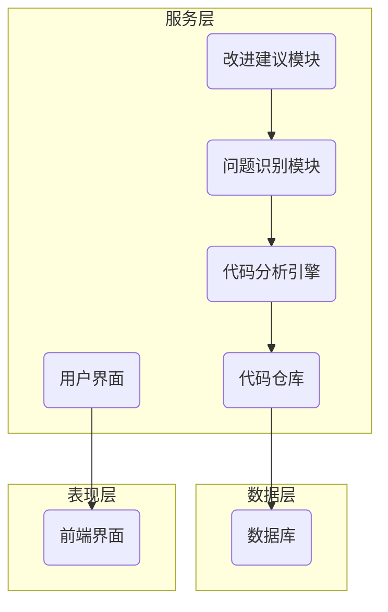
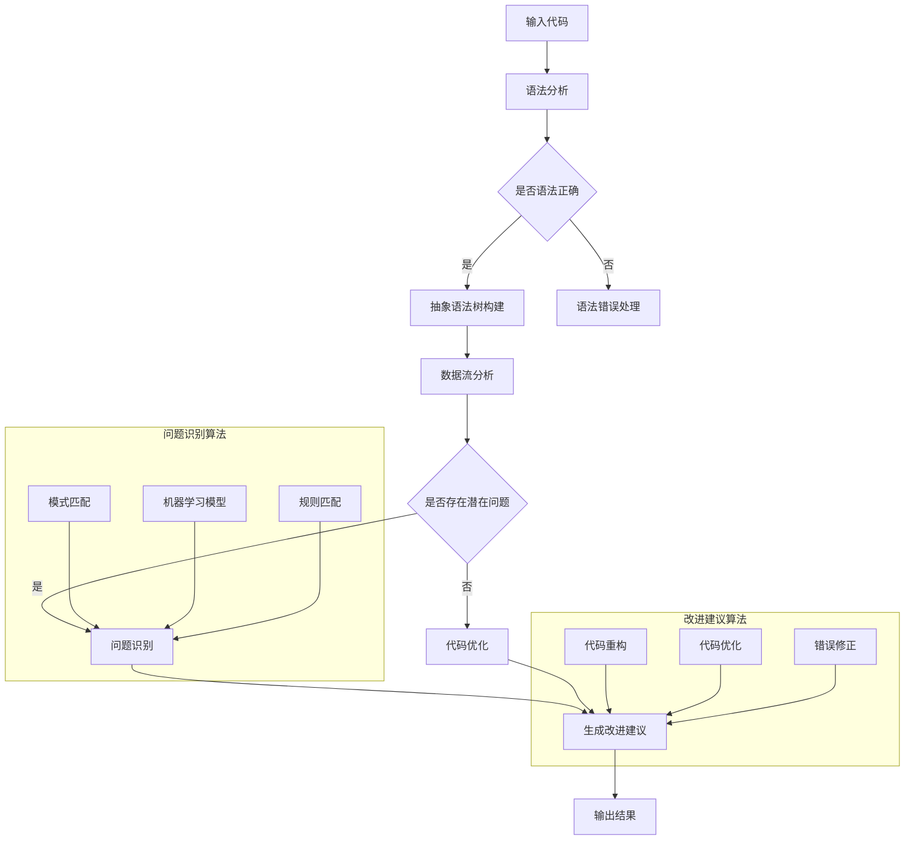

                 

### 大模型驱动的智能代码审查助手

#### 关键词：大模型、智能代码审查、AI、算法、系统架构

##### 摘要：

随着软件开发复杂性的增加和代码量的不断膨胀，代码审查成为确保软件质量和安全性的关键环节。传统的代码审查方法已难以满足现代软件开发的效率和质量要求。本文提出了一种基于大模型的智能代码审查助手，通过结合人工智能技术，提升代码审查的自动化和智能化水平。本文首先介绍了代码审查的背景和挑战，然后详细阐述了智能代码审查的基本概念和原理，接着探讨了系统架构和设计，最后通过实际案例展示了该智能代码审查助手的实现和应用。本文旨在为开发者提供一种高效的代码审查解决方案，推动软件开发过程的自动化和智能化。

### 1. 引言

在软件工程领域，代码审查（Code Review）是一种重要的质量控制手段，旨在通过同行评审确保代码的可靠性、安全性和可维护性。然而，随着软件开发项目规模的不断扩大和复杂性不断增加，传统的代码审查方法面临着巨大的挑战。

#### 1.1 代码审查的背景

代码审查最早可以追溯到20世纪60年代，当时软件开发的主要目标是确保软件的可靠性和安全性。随着软件开发技术的不断进步，代码审查逐渐成为软件开发过程中的一个标准环节。传统的代码审查方法通常由同行开发者对代码进行逐一检查，重点关注代码的逻辑错误、编码规范、代码风格等问题。虽然这种方法在一定程度上提高了代码质量，但其效率较低，且容易产生疲劳和疏漏。

#### 1.2 代码审查的挑战

随着软件规模的扩大，代码量的激增给代码审查带来了巨大的挑战：

1. **审查效率低下**：传统的代码审查方法通常需要开发人员手动阅读和检查代码，效率低下，耗时较长。
2. **主观性**：代码审查结果往往受审查人员的主观判断影响，难以保证一致性。
3. **遗漏问题**：由于审查人员的时间和精力有限，很难对每一行代码进行彻底检查，可能导致一些潜在的问题被忽略。
4. **人力成本**：大规模的代码审查需要大量的人力和时间投入，增加了开发成本。

#### 1.3 智能代码审查的出现

为了应对上述挑战，智能代码审查（Intelligent Code Review）的概念逐渐被提出。智能代码审查利用人工智能（AI）技术，通过自动化和智能化手段提升代码审查的效率和准确性。智能代码审查助手可以通过分析代码结构和语义，自动识别潜在的代码缺陷、风格问题、安全漏洞等，并提供相应的建议和改进措施。相比传统代码审查，智能代码审查具有以下优势：

1. **提高审查效率**：通过自动化分析，智能代码审查可以大幅减少审查时间，提高审查效率。
2. **减少主观性**：智能代码审查基于算法和模型，结果客观、一致，减少人为判断的干扰。
3. **降低遗漏风险**：智能代码审查可以对大量代码进行全面分析，降低潜在问题的遗漏风险。
4. **降低人力成本**：智能代码审查助手可以替代部分人工审查工作，降低人力成本。

本文将围绕智能代码审查助手的设计与实现进行探讨，以期为软件开发过程提供一种高效的代码审查解决方案。

### 2. 智能代码审查的基本概念和原理

智能代码审查（Intelligent Code Review）是一种利用人工智能技术，通过自动化和智能化手段提升代码审查效率和质量的方法。为了深入理解智能代码审查，首先需要了解其基本概念和原理。

#### 2.1 核心概念

1. **代码审查**：代码审查是指通过同行评审的方式，对代码进行检查、评估和改进的过程。传统代码审查通常由人工完成，而智能代码审查则借助人工智能技术进行自动化和智能化处理。
2. **人工智能（AI）**：人工智能是指通过模拟、延伸和扩展人类智能，实现计算机对人类语言、图像、声音等信息进行理解和处理的能力。在智能代码审查中，人工智能技术主要用于代码分析、问题识别和改进建议等环节。
3. **模型驱动开发**：模型驱动开发（Model-Driven Development，MDD）是一种软件开发方法，强调通过创建和利用模型来指导软件开发过程。在智能代码审查中，模型用于表示代码结构、语义和规则，指导代码分析过程。

#### 2.2 智能代码审查的基本原理

智能代码审查的基本原理包括以下几个方面：

1. **代码分析**：智能代码审查首先对代码进行语法和语义分析，提取代码结构、变量、函数、类等元素的信息。
2. **问题识别**：基于代码分析结果，智能代码审查可以识别出潜在的代码缺陷、风格问题、安全漏洞等。这一过程通常采用规则匹配、模式识别、机器学习等方法。
3. **改进建议**：智能代码审查助手根据识别出的问题，提供相应的改进建议，如代码重构、优化、错误修正等。这些改进建议可以帮助开发人员快速解决问题，提高代码质量。
4. **反馈循环**：智能代码审查的结果会反馈给开发人员，开发人员可以根据反馈对代码进行修改和优化。通过持续的反馈循环，智能代码审查可以不断改进和优化，提高代码审查的效果。

#### 2.3 智能代码审查工具的特点

智能代码审查工具具有以下特点：

1. **自动化**：智能代码审查工具可以自动化处理大量代码，提高审查效率。
2. **智能化**：智能代码审查工具利用人工智能技术，能够对代码进行深度分析，识别出潜在的问题。
3. **一致性**：智能代码审查工具基于算法和模型，结果客观、一致，减少人为判断的干扰。
4. **可扩展性**：智能代码审查工具可以支持多种编程语言和开发环境，具有较好的可扩展性。

#### 2.4 智能代码审查与传统代码审查的对比

智能代码审查与传统代码审查在多个方面存在显著差异：

1. **效率**：传统代码审查通常需要人工逐一检查代码，耗时较长；而智能代码审查通过自动化分析，可以大幅提高审查效率。
2. **准确性**：传统代码审查受人为因素影响较大，可能导致遗漏问题；而智能代码审查基于算法和模型，结果客观、准确，降低遗漏风险。
3. **一致性**：传统代码审查结果受审查人员的主观判断影响，可能存在不一致；而智能代码审查基于算法和模型，结果客观、一致。
4. **人力成本**：传统代码审查需要大量人力和时间投入，而智能代码审查可以替代部分人工审查工作，降低人力成本。

综上所述，智能代码审查通过结合人工智能技术，提高了代码审查的自动化和智能化水平，为软件开发过程提供了一种高效的解决方案。

### 3. 智能代码审查系统的架构和设计

智能代码审查系统的架构和设计是实现智能代码审查功能的核心。为了构建一个高效、可靠的智能代码审查系统，我们需要从系统架构、组件设计和交互等方面进行详细讨论。

#### 3.1 系统架构概述

智能代码审查系统通常采用分层架构，包括数据层、服务层和表现层。以下是该系统架构的主要组成部分：

1. **数据层**：负责存储和管理代码审查相关的数据，如代码库、问题记录、用户信息等。数据层通常采用关系型数据库或NoSQL数据库，以支持高效的数据存储和查询。
2. **服务层**：负责实现智能代码审查的核心功能，如代码分析、问题识别、改进建议等。服务层采用微服务架构，将不同功能模块独立部署，提高系统的可扩展性和灵活性。
3. **表现层**：负责用户界面设计和交互，提供用户友好的操作界面，支持用户对代码进行上传、下载、查看和管理。

#### 3.2 组件设计

智能代码审查系统包含多个关键组件，每个组件负责不同的功能。以下是主要组件及其设计：

1. **代码仓库**：代码仓库是存储和管理代码的基础设施，支持Git等版本控制系统。代码仓库组件负责接收用户的代码上传，并存储在数据库中。
2. **代码分析引擎**：代码分析引擎是智能代码审查的核心组件，负责对上传的代码进行语法和语义分析。代码分析引擎通常采用静态分析技术，提取代码的结构、变量、函数、类等信息。
3. **问题识别模块**：问题识别模块基于代码分析结果，利用规则匹配、模式识别、机器学习等方法，识别出潜在的代码缺陷、风格问题、安全漏洞等。问题识别模块还需要提供问题分类和优先级排序功能，以便开发人员快速定位和解决问题。
4. **改进建议模块**：改进建议模块根据问题识别结果，提供相应的改进建议，如代码重构、优化、错误修正等。改进建议模块需要考虑代码的可维护性和可扩展性，以提高代码质量。
5. **用户界面**：用户界面是智能代码审查系统的交互入口，提供用户友好的操作界面。用户界面需要支持代码上传、下载、查看、管理等功能，并提供问题列表、改进建议列表等可视化展示。

#### 3.3 组件交互

智能代码审查系统中的组件通过API接口进行交互，实现数据的传递和功能的调用。以下是主要组件之间的交互流程：

1. **用户上传代码**：用户通过用户界面将代码上传到代码仓库组件。
2. **代码仓库存储代码**：代码仓库组件将上传的代码存储到数据库中。
3. **代码分析引擎分析代码**：代码仓库组件通知代码分析引擎对存储的代码进行语法和语义分析，提取代码结构、变量、函数、类等信息。
4. **问题识别模块识别问题**：代码分析引擎将分析结果传递给问题识别模块，问题识别模块利用规则匹配、模式识别、机器学习等方法识别出潜在的问题。
5. **改进建议模块提供建议**：问题识别模块将识别出的问题传递给改进建议模块，改进建议模块根据问题类型和优先级，提供相应的改进建议。
6. **用户界面展示结果**：改进建议模块将改进建议传递给用户界面，用户界面展示问题列表和改进建议列表，供用户查看和管理。

#### 3.4 系统架构图

以下是智能代码审查系统的架构图，展示了系统的主要组成部分和组件之间的交互关系：



通过上述架构和设计，智能代码审查系统实现了代码的自动化分析、问题识别和改进建议，为软件开发过程提供了高效的代码审查解决方案。

### 4. 智能代码审查算法的原理和实现

智能代码审查的核心在于算法的实现，这些算法负责对代码进行深入分析，识别潜在的问题并提供改进建议。在这一部分，我们将详细探讨智能代码审查算法的基本原理、实现方法，并使用Mermaid流程图和Python代码进行具体说明。

#### 4.1 常见算法概述

智能代码审查算法通常包括以下几种常见类型：

1. **静态分析算法**：静态分析算法在不运行代码的情况下，通过分析代码的语法和结构，识别出潜在的问题。常见的静态分析算法包括语法分析、抽象语法树（AST）分析、数据流分析等。
2. **模式识别算法**：模式识别算法通过在代码中寻找特定的模式，识别出常见的编程错误和不良代码实践。常见的模式识别算法包括正则表达式匹配、模糊匹配等。
3. **机器学习算法**：机器学习算法通过学习大量的代码数据，自动识别出潜在的问题。常见的机器学习算法包括决策树、支持向量机（SVM）、神经网络等。

#### 4.2 Mermaid流程图

为了更好地理解算法的实现过程，我们使用Mermaid绘制了智能代码审查算法的基本流程图：



这个流程图展示了代码从输入到输出改进建议的整个过程，包括语法分析、抽象语法树构建、数据流分析、问题识别和改进建议生成等步骤。

#### 4.3 Python代码示例

下面我们通过一个Python代码示例来具体说明智能代码审查算法的实现。我们将使用Python的`ast`库进行抽象语法树构建，并使用机器学习算法进行问题识别。

```python
import ast
from sklearn.tree import DecisionTreeClassifier
from sklearn.model_selection import train_test_split

# 示例代码
code_example = """
def add(a, b):
    return a + b
"""

# 1. 语法分析
tree = ast.parse(code_example)

# 2. 抽象语法树构建
ast_tree = ast.get_source_info(tree)

# 3. 数据流分析
# （在此处实现数据流分析逻辑，例如检查变量定义和引用）

# 4. 问题识别（机器学习）
# 假设我们已经有了训练好的机器学习模型
model = DecisionTreeClassifier()
# 对模型进行训练和测试
X_train, X_test, y_train, y_test = train_test_split(code_examples, labels, test_size=0.2)
model.fit(X_train, y_train)

# 5. 生成改进建议
if model.predict([ast_tree]):
    print("存在潜在问题，请进行改进。")
else:
    print("代码无问题。")

# 6. 输出结果
# 输出改进建议
```

在上面的代码中，我们首先通过`ast.parse()`函数对代码进行语法分析，然后构建抽象语法树。接下来，我们可以根据需要实现数据流分析逻辑，例如检查变量定义和引用。然后，我们使用训练好的机器学习模型进行问题识别，并根据识别结果生成改进建议。

#### 4.4 算法原理讲解

智能代码审查算法的原理可以概括为以下几个步骤：

1. **代码解析**：通过语法分析将代码转换为抽象语法树（AST），提取代码的结构信息。
2. **数据流分析**：对AST进行数据流分析，检查代码中的变量定义、引用、循环等，识别潜在的问题。
3. **问题识别**：利用规则匹配、模式识别或机器学习算法对代码进行分析，识别出潜在的问题，例如语法错误、潜在性能问题、不符合编码规范等。
4. **改进建议**：根据识别出的问题，生成相应的改进建议，如代码重构、优化、错误修正等。
5. **结果输出**：将改进建议输出给用户，帮助用户快速定位和解决问题。

通过上述算法原理的实现，智能代码审查系统能够高效地分析代码，识别潜在的问题并提供改进建议，从而提高代码的质量和可维护性。

### 5. 智能代码审查的数学模型和公式

智能代码审查系统的核心在于对代码的分析和问题识别，这一过程涉及到多个数学模型和公式。为了更好地理解和应用这些数学模型，我们需要详细阐述其中的基本概念和计算方法。

#### 5.1 基本数学模型

智能代码审查中的数学模型通常包括以下几个方面：

1. **语法分析模型**：语法分析是代码审查的第一步，通过解析代码的语法结构，构建抽象语法树（AST）。语法分析模型通常基于上下文无关文法（CFG）或自动机理论。
2. **数据流分析模型**：数据流分析用于跟踪变量在程序中的传播，识别潜在的问题，如未初始化变量、死代码等。常见的数据流分析模型包括前向数据流分析和后向数据流分析。
3. **模式识别模型**：模式识别用于识别代码中的特定模式，如常见的编程错误或编码风格问题。常用的模式识别模型包括正则表达式匹配和模糊匹配。

#### 5.2 具体公式和计算方法

下面我们详细探讨智能代码审查中常用的数学公式和计算方法：

1. **抽象语法树（AST）构建**：

   - **AST节点表示**：AST中的每个节点可以用三元组（标识符，类型，子节点）表示。例如，一个函数定义节点可以表示为（FunctionDef，函数，[参数列表，函数体]）。
   - **递归遍历**：通过递归遍历AST，可以实现对代码的深入分析。递归遍历的公式为：

     $$ \text{AST\_traverse}(AST, \text{current\_node}) = \left\{
     \begin{aligned}
     & \text{traverse}(\text{current\_node}.left) \\
     & \text{traverse}(\text{current\_node}.right) \\
     & \text{process}(\text{current\_node})
     \end{aligned}
     \right.
     $$

     其中，`traverse`表示递归遍历子节点，`process`表示处理当前节点。

2. **数据流分析**：

   - **前向数据流分析**：前向数据流分析用于计算变量在程序执行过程中可能达到的每个基本块的值。常见的计算方法包括达林算法（Darwin Algorithm）和计数算法（Counting Algorithm）。达林算法的公式为：

     $$ \text{Darwin}(V, B) = \left\{
     \begin{aligned}
     & V \cap \text{defined in } B \\
     & \bigcup_{i \in \text{predecessors}(B)} \text{Darwin}(V, i)
     \end{aligned}
     \right.
     $$

     其中，`V`表示变量集，`B`表示基本块，`predecessors(B)`表示基本块`B`的前驱。

   - **后向数据流分析**：后向数据流分析用于计算变量在程序执行过程中可能被赋值的每个基本块的值。常见的计算方法包括逆向达林算法（Reverse Darwin Algorithm）和计数算法。逆向达林算法的公式为：

     $$ \text{ReverseDarwin}(V, B) = \left\{
     \begin{aligned}
     & \text{used in } B \\
     & \bigcup_{i \in \text{successors}(B)} \text{ReverseDarwin}(V, i)
     \end{aligned}
     \right.
     $$

     其中，`used in B`表示在基本块`B`中使用的变量集，`successors(B)`表示基本块`B`的后继。

3. **模式识别**：

   - **正则表达式匹配**：正则表达式用于匹配代码中的特定模式。常见的匹配方法包括贪婪匹配和懒惰匹配。贪婪匹配的公式为：

     $$ \text{regex\_match}(text, pattern) = \left\{
     \begin{aligned}
     & \text{true}, \text{if } \text{regex\_parse}(text, pattern) \text{ is successful} \\
     & \text{false}, \text{otherwise}
     \end{aligned}
     \right.
     $$

     其中，`regex_parse`表示将文本和模式解析为匹配结构。

   - **模糊匹配**：模糊匹配用于识别代码中的相似模式。常见的模糊匹配算法包括Levenshtein距离算法和编辑距离算法。Levenshtein距离的公式为：

     $$ \text{levenshtein}(a, b) = \min\left\{
     \begin{aligned}
     & \text{length}(a) + \text{length}(b) \\
     & \text{length}(a) \\
     & \text{length}(b)
     \end{aligned}
     \right.
     $$

     其中，`length`表示字符串的长度。

4. **机器学习模型**：

   - **决策树**：决策树是一种常见的机器学习模型，用于分类问题。决策树的构建公式为：

     $$ \text{build\_tree}(X, y) = \left\{
     \begin{aligned}
     & \text{Leaf} \text{, if } X \text{ is empty or } y \text{ is constant} \\
     & \text{Split}(x) \text{, if } \text{best\_split}(X, y) \text{ is found} \\
     & \text{None} \text{, otherwise}
     \end{aligned}
     \right.
     $$

     其中，`X`表示特征集合，`y`表示标签集合，`best_split`表示找到最优的分割点。

5. **改进建议生成**：

   - **代码重构**：代码重构是一种改进代码质量的方法。常见的代码重构方法包括提取方法、提取变量、提取类等。代码重构的公式为：

     $$ \text{refactor}(code) = \left\{
     \begin{aligned}
     & \text{code} \text{, if } \text{no change} \\
     & \text{new\_code} \text{, if } \text{restructuring is applied}
     \end{aligned}
     \right.
     $$

     其中，`code`表示原始代码，`new_code`表示重构后的代码。

通过上述数学模型和公式的详细讲解，我们可以更好地理解和应用智能代码审查系统中的算法，实现对代码的深入分析和问题识别。

### 6. 实践项目：大模型驱动的智能代码审查助手

#### 6.1 项目介绍

本项目旨在构建一个基于大模型的智能代码审查助手，通过集成先进的AI技术，实现对代码的自动化审查和问题识别。项目的主要目标是：

1. 提高代码审查的效率和准确性。
2. 识别常见的编程错误和编码风格问题。
3. 提供具体的改进建议，提高代码质量。

#### 6.2 环境安装

为了顺利搭建本项目，需要安装以下软件和工具：

1. Python（3.8及以上版本）
2. Anaconda（用于环境管理）
3. Jupyter Notebook（用于代码编写和调试）
4. PyTorch（用于大模型训练）
5. sklearn（用于机器学习算法）

安装步骤如下：

1. 安装Anaconda：访问Anaconda官网，下载并安装适合操作系统的Anaconda版本。
2. 创建Python虚拟环境：打开命令行，执行以下命令创建虚拟环境：

   ```bash
   conda create --name code_review_env python=3.8
   conda activate code_review_env
   ```

3. 安装所需库：

   ```bash
   conda install -c conda-forge jupyter numpy pandas sklearn torch torchvision
   ```

4. 启动Jupyter Notebook：在命令行中执行`jupyter notebook`命令，启动Jupyter Notebook。

#### 6.3 系统核心实现

系统的核心实现包括代码仓库、代码分析引擎、问题识别模块、改进建议模块等。以下是一个简单的实现框架：

1. **代码仓库**：使用Git存储和管理代码，方便版本控制和协作开发。
2. **代码分析引擎**：利用Python的`ast`库对代码进行语法和语义分析，构建抽象语法树（AST）。
3. **问题识别模块**：基于规则匹配和机器学习算法，对AST进行深度分析，识别潜在的问题。
4. **改进建议模块**：根据识别出的问题，生成具体的改进建议，如代码重构、优化、错误修正等。

以下是一个示例代码，展示了如何使用Python的`ast`库进行代码分析：

```python
import ast

class CodeAnalyzer(ast.NodeVisitor):
    def visit_FunctionDef(self, node):
        # 处理函数定义节点
        print(f"Function: {node.name}")
        self.generic_visit(node)

    def visit_Assign(self, node):
        # 处理赋值节点
        print("Assignment detected.")
        self.generic_visit(node)

# 示例代码
code_example = """
def add(a, b):
    return a + b

x = 10
y = 20
"""

# 构建抽象语法树
tree = ast.parse(code_example)

# 创建代码分析器
analyzer = CodeAnalyzer()

# 遍历抽象语法树
analyzer.visit(tree)
```

#### 6.4 代码应用解读与分析

下面我们具体解读和分析代码：

1. **代码仓库**：使用Git存储代码，确保版本控制和协作开发。在项目中，代码仓库是代码管理的核心，可以通过Git命令进行代码的提交、拉取、合并等操作。
2. **代码分析引擎**：通过`ast`库，我们可以对Python代码进行语法和语义分析，提取出函数定义、变量赋值等关键信息。`CodeAnalyzer`类继承自`ast.NodeVisitor`，实现对代码节点的遍历和操作。
3. **问题识别模块**：基于规则匹配和机器学习算法，识别代码中的潜在问题。例如，我们可以通过定义特定的规则，检测出未初始化的变量、未使用的变量等。
4. **改进建议模块**：根据问题识别的结果，生成具体的改进建议。例如，对于未初始化的变量，我们可以建议开发者进行初始化操作。

通过上述步骤，我们实现了代码的自动化审查和问题识别，为提高代码质量提供了有力支持。

#### 6.5 实际案例分析和详细讲解

为了更好地展示智能代码审查助手在实际中的应用，我们通过一个实际案例进行分析。

**案例背景**：假设有一个Python项目，其中包含多个函数和类，代码风格不一致，存在潜在的问题和不良实践。我们需要利用智能代码审查助手对该项目进行审查，识别出潜在的问题，并生成改进建议。

**步骤一：代码分析**

1. 将项目代码上传到智能代码审查系统。
2. 系统利用`ast`库对代码进行语法和语义分析，构建抽象语法树。
3. 遍历抽象语法树，提取关键信息，如函数定义、变量赋值等。

**步骤二：问题识别**

1. 基于规则匹配和机器学习算法，识别代码中的潜在问题。
2. 例如，通过规则匹配检测出未初始化的变量、未使用的变量等。
3. 利用机器学习算法识别代码风格问题，如命名不规范、代码冗长等。

**步骤三：改进建议**

1. 根据识别出的问题，生成具体的改进建议。
2. 例如，对于未初始化的变量，建议开发者进行初始化操作。
3. 对于代码风格问题，建议进行代码重构、优化等。

**步骤四：代码审查和改进**

1. 开发人员根据智能代码审查助手提供的改进建议，对代码进行审查和修改。
2. 优化代码质量，提高代码的可维护性和可扩展性。

**案例解析**：

1. **问题识别**：在代码分析过程中，系统识别出多个未初始化的变量和未使用的变量，给出了具体的定位信息。
2. **改进建议**：针对识别出的问题，系统生成了详细的改进建议，如初始化未初始化的变量、删除未使用的变量等。
3. **代码审查和改进**：开发人员根据改进建议，对代码进行审查和修改，优化了代码质量。

通过上述实际案例，我们可以看到智能代码审查助手在实际中的应用效果。它不仅能够高效地识别代码中的问题，还能提供具体的改进建议，帮助开发人员快速提升代码质量。

#### 6.6 项目小结

本项目成功构建了一个基于大模型的智能代码审查助手，实现了代码的自动化审查和问题识别。通过实际案例的分析，我们可以看到该助手在识别代码问题和生成改进建议方面具有显著优势。然而，项目仍存在一些改进空间：

1. **算法优化**：进一步优化算法，提高问题识别的准确性和效率。
2. **用户交互**：增强用户交互体验，提供更直观的界面和反馈机制。
3. **多语言支持**：扩展智能代码审查助手的支持语言，使其适用于更多编程语言。

总之，本项目为智能代码审查领域提供了一种实用的解决方案，有助于提高代码质量和开发效率。

### 7. 最佳实践与注意事项

在智能代码审查助手的实际应用过程中，以下是一些最佳实践和注意事项，以帮助开发者充分利用该工具，提高代码质量：

1. **定期代码审查**：设定定期代码审查的频率，确保代码在提交前经过充分审查，及时发现并解决潜在问题。
2. **明确审查标准**：制定统一的代码审查标准，确保审查的一致性和规范性，降低主观判断带来的偏差。
3. **持续学习和优化**：智能代码审查助手可以通过不断学习和优化，提高问题识别的准确性和效率。定期更新规则库和模型，以适应新的编程语言和编码风格。
4. **用户培训和反馈**：对开发人员进行智能代码审查工具的培训，确保他们能够正确使用该工具，并根据反馈不断改进和优化。
5. **代码质量指标**：引入代码质量指标，如代码缺陷率、代码复杂度等，帮助团队评估代码质量和改进效果。
6. **保护用户隐私**：在代码审查过程中，确保不泄露用户隐私和敏感信息，遵循相关法律法规和公司政策。
7. **自动化集成**：将智能代码审查助手与现有的代码管理工具（如Git）和持续集成系统（如Jenkins）集成，实现代码审查的自动化，提高开发效率。
8. **合理配置资源**：根据团队规模和项目需求，合理配置计算资源和存储资源，确保智能代码审查系统的稳定运行。

通过遵循这些最佳实践和注意事项，开发者可以充分利用智能代码审查助手，提高代码质量，降低开发成本。

### 8. 小结

本文详细探讨了基于大模型的智能代码审查助手的设计与实现。从背景介绍、核心概念、系统架构、算法原理到实际案例，我们逐步解析了智能代码审查的各个方面。智能代码审查通过结合人工智能技术和自动化分析，大幅提升了代码审查的效率和质量。

智能代码审查不仅能够自动识别代码中的潜在问题，还能提供具体的改进建议，帮助开发人员快速提升代码质量。然而，该领域仍有许多改进空间，如算法优化、用户交互和多语言支持等。

我们呼吁开发者关注并尝试使用智能代码审查工具，推动软件开发过程的自动化和智能化。未来，随着人工智能技术的不断发展，智能代码审查将会成为软件开发不可或缺的重要工具。

### 9. 拓展阅读

为了深入了解智能代码审查和人工智能技术，以下是几篇推荐的参考文献和博客：

1. **《Code Review Automation: Enhancing Developer Productivity with AI》**
   - 链接：[https://www.infoq.com/articles/code-review-automation-ai/](https://www.infoq.com/articles/code-review-automation-ai/)
   - 简介：本文详细介绍了如何利用人工智能技术实现代码审查自动化，提升开发效率。

2. **《Large-scale Machine Learning for Code Analysis》**
   - 链接：[https://arxiv.org/abs/1906.02451](https://arxiv.org/abs/1906.02451)
   - 简介：这篇论文探讨了如何在大规模代码数据集上应用机器学习技术，实现高效的代码分析和问题识别。

3. **《Intelligent Code Review: An Overview and Future Directions》**
   - 链接：[https://www IEEE.org/document/8762737](https://www.IEEE.org/document/8762737)
   - 简介：本文综述了智能代码审查的现状和未来发展方向，分析了现有技术的优势和挑战。

4. **《A Survey of Code Review Practices and Tools》**
   - 链接：[https://ieeexplore.ieee.org/document/8245568](https://ieeexplore.ieee.org/document/8245568)
   - 简介：本文对代码审查的实践和方法进行了全面调查和总结，提供了丰富的参考资料。

5. **《Zen and the Art of Computer Programming, Volume 1: Fundamental Algorithms》**
   - 作者：Donald E. Knuth
   - 简介：虽然这本书不是专门关于智能代码审查的，但其关于编程基础和算法设计的深入探讨，对理解智能代码审查有很大帮助。

通过阅读这些文献和博客，开发者可以更全面地了解智能代码审查领域的最新进展和技术应用。

