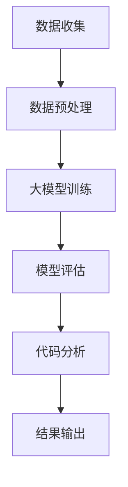
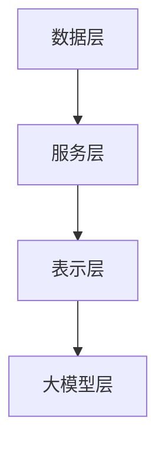
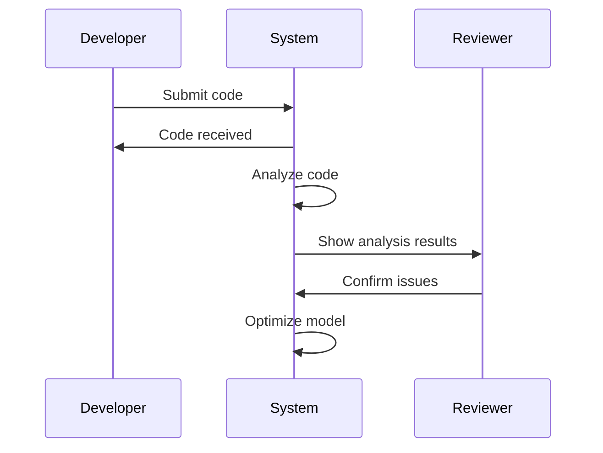

                 

**Title**: 大模型驱动的智能代码审查系统

**Keywords**: 大模型、智能代码审查、代码质量、自动化、人工智能

**Abstract**: 
本文探讨了大模型在智能代码审查系统中的应用，通过深入分析算法原理、系统设计及实战案例，揭示了如何利用大模型技术提升代码审查的效率和准确性，为软件开发提供了一种全新的思路和方法。

----------------------------------------------------------------

## 引言

在软件开发的快速迭代和不断演进过程中，代码审查扮演着至关重要的角色。它不仅是确保代码质量和安全性的关键环节，也是提升团队协作效率和代码可维护性的重要手段。然而，传统的代码审查方式，即人工审查，面临着诸多挑战。

首先，人工审查的速度相对较慢。软件项目通常涉及大量的代码，审查人员需要逐行阅读并分析，这不仅消耗大量时间，而且容易导致遗漏重要问题。其次，人工审查的准确性也受到限制。审查人员可能会因为疲劳、疏忽或者专业知识的局限性，而无法发现隐藏的缺陷或潜在的bug。此外，代码审查还面临着多样性和一致性的挑战，不同的审查人员可能对相同的问题有不同的看法，导致审查结果不一致。

随着人工智能（AI）技术的快速发展，特别是大模型的崛起，传统代码审查的局限性开始得到缓解。大模型，如深度学习神经网络，具有处理海量数据和复杂模式识别的能力。它们可以通过学习大量的代码库，自动识别代码中的常见问题和潜在风险，从而实现智能化的代码审查。智能代码审查系统不仅能够提高审查速度和准确性，还能够减少人为错误，提高代码质量，从而为软件开发带来革命性的变化。

本文将深入探讨大模型驱动的智能代码审查系统的原理、设计和应用，通过实际案例分析，展示其如何提升代码审查的效率和质量。

----------------------------------------------------------------

## 第一部分：背景与核心概念

### 第1章 背景介绍

#### 1.1 代码审查的重要性

代码审查是一种通过其他开发人员检查代码以确保其质量、安全性和符合标准的过程。其重要性体现在以下几个方面：

1. **确保代码质量**：代码审查是确保代码符合质量标准的关键步骤。它可以帮助发现潜在的bug、代码异味、性能问题以及不符合最佳实践的情况。
2. **提高安全性**：通过代码审查，可以识别出可能的安全漏洞，如SQL注入、XSS攻击等，从而减少软件被攻击的风险。
3. **促进知识共享**：代码审查提供了一个平台，让团队成员能够相互学习、交流，并分享知识和经验。
4. **提升可维护性**：经过审查的代码更加清晰、规范，易于理解和维护。

#### 1.2 传统代码审查的挑战

虽然代码审查至关重要，但传统的代码审查方式存在诸多挑战：

1. **耗时耗力**：人工审查需要大量时间和精力，尤其是在大型项目中，审查人员可能需要花费数小时甚至数天来阅读和审查代码。
2. **准确性受限**：人类在长时间审查过程中容易疲劳，可能导致疏忽或错误。此外，不同审查人员对代码的理解和标准可能有差异，导致不一致的审查结果。
3. **一致性难以保证**：代码审查往往缺乏统一的流程和标准，不同的团队和项目可能采用不同的审查方式，难以保证审查的一致性和持续性。
4. **多样性挑战**：现代软件开发涉及多种编程语言和框架，审查人员可能需要具备跨领域的知识，以应对不同类型的代码审查需求。

#### 1.3 智能代码审查的必要性

智能代码审查系统通过引入人工智能技术，特别是大模型，能够有效解决传统代码审查的诸多挑战：

1. **提高审查速度**：大模型可以快速分析大量代码，大大缩短审查时间，提高审查效率。
2. **提升准确性**：大模型通过对大量代码的学习，能够自动识别和预测潜在的bug和安全问题，提高审查的准确性。
3. **减少人力成本**：智能代码审查系统能够减少对人工审查的依赖，降低人力成本，并使审查人员能够专注于更复杂的任务。
4. **实现一致性**：智能代码审查系统采用统一的算法和标准，能够确保审查的一致性和持续性，提高代码质量的稳定性。
5. **支持多样性**：大模型能够处理多种编程语言和框架，适应不同类型的代码审查需求，提高审查的灵活性。

通过智能代码审查系统，软件开发团队能够更加高效地管理代码质量，降低风险，提高软件的可维护性和安全性。在接下来的章节中，我们将深入探讨大模型在智能代码审查系统中的应用，以及如何设计和实现这样一个系统。

----------------------------------------------------------------

### 第1章 背景介绍

#### 1.2 大模型的核心概念

大模型是指具有大量参数、能够处理复杂任务的深度学习模型。它们在人工智能领域中的应用日益广泛，尤其在自然语言处理（NLP）、计算机视觉（CV）、语音识别等领域取得了显著成果。大模型的核心特点包括：

1. **大规模参数**：大模型通常拥有数百万甚至数十亿个参数，这使得它们能够捕捉到数据中的复杂模式和特征。
2. **强大的学习能力**：大模型通过训练可以从大量数据中学习，提高对未知数据的泛化能力。
3. **多层次的特征提取**：大模型通常包含多个层次的结构，每一层都能够提取不同层次的特征，从而形成对数据的全面理解。
4. **高计算资源需求**：大模型的训练和推理通常需要大量的计算资源和时间。

大模型的工作原理主要基于以下步骤：

1. **数据预处理**：在训练大模型之前，需要对输入数据进行预处理，包括数据清洗、标准化、数据增强等，以确保数据的质量和一致性。
2. **模型训练**：通过反向传播算法，大模型能够不断调整其参数，以最小化预测误差。训练过程通常涉及大规模的数据集和大量的迭代。
3. **模型优化**：在训练过程中，通过调整学习率、优化算法等参数，可以进一步提高模型的性能和泛化能力。
4. **模型评估**：使用验证集和测试集评估模型的性能，包括准确性、召回率、F1分数等指标，以确保模型的有效性。

大模型在代码审查中的应用具有以下几个关键方面：

1. **代码理解**：大模型可以学习代码的语法结构、语义信息和模式，从而理解代码的功能和行为。
2. **bug检测**：通过分析代码的语法和语义，大模型能够自动检测出潜在的bug和安全问题。
3. **代码质量评估**：大模型可以评估代码的质量，如代码复杂性、可读性、遵循最佳实践的程度等。
4. **代码建议**：大模型可以根据代码质量评估结果，提供改进代码的建议，如代码重构、性能优化等。

大模型驱动的智能代码审查系统通过将大模型与代码审查流程相结合，实现了自动化、高效和智能的代码审查。在接下来的章节中，我们将详细探讨大模型驱动的智能代码审查系统的架构和算法原理。

----------------------------------------------------------------

### 第1章 背景介绍

#### 1.3 大模型驱动的智能代码审查系统概述

大模型驱动的智能代码审查系统旨在利用大模型在自然语言处理和代码理解方面的能力，提升代码审查的效率和准确性。该系统的核心思想是通过大规模数据训练大模型，使其能够自动识别代码中的问题并提供改进建议。

#### 1.3.1 系统架构

智能代码审查系统的架构通常包括以下几个关键模块：

1. **数据收集与处理模块**：该模块负责收集代码库数据，并对数据进行清洗、标准化和预处理，以供大模型训练使用。
2. **大模型训练模块**：使用大规模数据集训练大模型，使其能够理解和分析代码，识别潜在的bug和安全问题。
3. **代码分析模块**：该模块利用训练好的大模型对提交的代码进行实时分析，识别出问题并提出改进建议。
4. **用户交互模块**：该模块提供用户界面，使审查人员能够查看代码分析结果，并进行交互操作，如确认问题、拒绝建议等。
5. **反馈与优化模块**：系统收集用户反馈，不断优化大模型和代码分析算法，以提高系统的准确性和效率。

#### 1.3.2 系统功能

智能代码审查系统具有以下主要功能：

1. **代码质量评估**：通过对代码的语法、语义和结构进行分析，评估代码的质量，如代码复杂性、可读性、遵循最佳实践的程度等。
2. **bug检测**：自动检测代码中的语法错误、逻辑错误和安全漏洞，如SQL注入、XSS攻击等。
3. **代码建议**：根据分析结果，提供改进代码的建议，如重构代码、优化性能、遵循最佳实践等。
4. **问题定位**：提供详细的错误信息和定位信息，帮助开发人员快速定位和修复问题。
5. **审查流程管理**：管理代码审查流程，包括代码提交、审查、反馈和修复等环节，确保审查流程的高效和规范。

#### 1.3.3 系统优势与挑战

智能代码审查系统具有以下优势：

1. **提高审查效率**：大模型能够快速分析大量代码，大大缩短审查时间，提高审查效率。
2. **提升审查准确性**：通过大规模数据训练，大模型能够准确识别代码中的问题，提高审查的准确性。
3. **减少人力成本**：智能代码审查系统能够减少对人工审查的依赖，降低人力成本，并使审查人员能够专注于更复杂的任务。
4. **实现一致性**：智能代码审查系统采用统一的算法和标准，确保审查的一致性和持续性，提高代码质量的稳定性。

然而，智能代码审查系统也面临一些挑战：

1. **模型复杂性**：大模型通常涉及大量的参数和复杂的结构，导致训练和推理的计算资源需求巨大。
2. **数据隐私**：代码审查系统需要处理大量敏感代码数据，确保数据隐私和安全是关键挑战。
3. **误报和漏报**：尽管大模型能够提高审查的准确性，但仍可能存在误报和漏报的情况，需要不断完善模型和算法。
4. **用户体验**：用户界面和交互设计需要充分考虑用户体验，确保审查人员能够轻松地使用系统，并及时处理分析结果。

在接下来的章节中，我们将深入探讨大模型驱动的智能代码审查系统的算法原理、系统设计以及实际应用。

----------------------------------------------------------------

## 第二部分：算法原理与数学模型

### 第2章 算法原理讲解

#### 2.1 大模型算法概述

大模型算法的核心在于其能够从大规模数据中学习并提取复杂特征，从而实现高效的问题解决。在智能代码审查系统中，大模型算法主要包括以下几个关键部分：

1. **自然语言处理算法**：自然语言处理（NLP）算法负责理解和分析代码中的自然语言描述，如注释、文档和代码中的自然语言片段。这些算法能够提取语义信息，识别代码中的意图和功能。
2. **代码理解算法**：代码理解算法专注于理解和分析代码的语法和语义结构，包括变量、函数、类和方法等。这些算法能够构建代码的抽象语法树（AST）和语义网络，从而对代码进行深入理解。
3. **代码审查算法**：代码审查算法利用自然语言处理和代码理解算法的结果，对代码进行分析和评估，识别潜在的bug、安全问题和代码异味。这些算法通常采用机器学习技术，如深度学习、支持向量机等，来训练模型并进行预测。

#### 2.2 Mermaid算法流程图

为了更好地理解大模型算法的工作流程，我们可以使用Mermaid图来可视化算法的执行步骤。以下是一个简单的Mermaid图示例：



在这个流程图中，数据收集模块负责收集代码库中的数据，数据预处理模块对数据进行清洗和标准化，然后进行大模型训练。训练好的模型在模型评估模块中进行性能评估，随后用于代码分析模块，分析代码并提出改进建议。最终，结果输出模块将分析结果呈现给用户。

#### 2.3 Python代码解释

为了更深入地理解大模型算法的实现，我们可以通过Python代码来展示一个简单的代码审查算法。以下是一个简单的Python代码示例，用于分析代码中的语法错误：

```python
import ast
import sys

def check_syntax(code):
    try:
        ast.parse(code)
        return "语法正确"
    except SyntaxError as e:
        return f"语法错误：{e}"

code = """for i in range(10):
    print(i)"""
print(check_syntax(code))
```

在这个示例中，我们首先导入了`ast`模块，用于解析和操作抽象语法树。`check_syntax`函数接收一段代码作为输入，并尝试使用`ast.parse`函数对其进行解析。如果解析成功，返回"语法正确"；否则，捕获`SyntaxError`异常，并返回详细的语法错误信息。

#### 2.4 数学模型与公式讲解

在代码审查算法中，数学模型用于描述代码特征和问题之间的关联。以下是一个简单的数学模型示例，用于分类代码中的bug：

$$
\text{bug\_score} = \sigma(\text{feature\_vector} \cdot \text{weight} + \text{bias})
$$

其中，`bug_score`表示代码中bug的得分，`feature_vector`表示代码特征向量，`weight`表示权重，`bias`表示偏置。`σ`表示sigmoid函数，用于将得分转换为概率。

#### 2.5 算法举例说明

为了更好地理解算法的应用，我们可以通过一个实际案例来展示大模型驱动的代码审查过程。假设我们有一个Python函数，需要检查其中是否存在潜在的bug。

```python
def add(a, b):
    return a + b
```

以下步骤展示了如何使用大模型驱动的智能代码审查系统对这段代码进行分析：

1. **数据收集**：收集包含类似函数的代码库，用于训练大模型。
2. **数据预处理**：对收集的代码进行预处理，提取特征，如函数名、参数数量、返回类型等。
3. **大模型训练**：使用预处理后的数据训练大模型，学习代码特征和bug之间的关联。
4. **代码分析**：将待审查的代码输入到训练好的大模型中，分析其特征，计算bug得分。
5. **结果输出**：根据bug得分，输出代码审查结果，如"无潜在bug"或"存在潜在bug"。

通过这个案例，我们可以看到大模型驱动的智能代码审查系统如何高效地分析代码，并识别潜在的bug。

#### 2.6 本章小结

本章介绍了大模型驱动的智能代码审查系统的算法原理，包括自然语言处理、代码理解和代码审查算法。通过Mermaid图和Python代码示例，我们详细展示了算法的工作流程和实现方法。此外，还介绍了算法的数学模型，并通过实际案例说明了算法的应用。在接下来的章节中，我们将进一步探讨智能代码审查系统的系统设计和实现。

----------------------------------------------------------------

## 第三部分：系统设计与实现

### 第3章 系统分析与架构设计

#### 3.1 问题场景介绍

在软件开发过程中，代码审查是一个关键环节，旨在确保代码的质量、安全性和一致性。然而，随着项目规模的扩大和代码复杂度的增加，传统的代码审查方式面临着效率低、准确性差等问题。为了解决这些问题，我们需要构建一个高效、智能的代码审查系统。

假设我们有一个大型软件项目，涉及多个开发人员和多个模块。每个开发人员负责不同的模块，并将代码提交到中央代码库。传统的代码审查方式要求每个提交的代码都经过多位审查人员的逐行审查，这不仅耗时耗力，而且容易导致审查结果不一致。此外，审查人员可能因为疲劳或专业知识不足而无法发现所有潜在的问题。

为了应对这些挑战，我们提出了大模型驱动的智能代码审查系统。该系统利用大模型在自然语言处理和代码理解方面的能力，实现自动化、高效的代码审查。通过该系统，开发人员可以快速识别代码中的潜在问题，并得到改进建议，从而提高代码质量。

#### 3.2 项目介绍

我们的项目目标是构建一个基于大模型驱动的智能代码审查系统，用于自动化代码审查过程，提高代码质量和开发效率。项目的主要功能包括：

1. **代码质量评估**：对提交的代码进行语法、语义和结构分析，评估代码质量，如代码复杂性、可读性、遵循最佳实践的程度等。
2. **bug检测**：自动检测代码中的语法错误、逻辑错误和安全漏洞，如SQL注入、XSS攻击等。
3. **代码建议**：根据代码分析结果，提供改进代码的建议，如重构代码、优化性能、遵循最佳实践等。
4. **问题定位**：提供详细的错误信息和定位信息，帮助开发人员快速定位和修复问题。
5. **审查流程管理**：管理代码审查流程，包括代码提交、审查、反馈和修复等环节，确保审查流程的高效和规范。

#### 3.3 系统功能设计

为了实现上述功能，智能代码审查系统需要具备以下核心模块：

1. **数据收集与处理模块**：负责收集代码库中的数据，并对数据进行清洗、标准化和预处理，以供大模型训练使用。
2. **大模型训练模块**：使用大规模数据集训练大模型，使其能够理解和分析代码，识别潜在的bug和安全问题。
3. **代码分析模块**：利用训练好的大模型对提交的代码进行实时分析，识别出问题并提出改进建议。
4. **用户交互模块**：提供用户界面，使审查人员能够查看代码分析结果，并进行交互操作，如确认问题、拒绝建议等。
5. **反馈与优化模块**：系统收集用户反馈，不断优化大模型和代码分析算法，以提高系统的准确性和效率。

#### 3.4 系统架构设计

智能代码审查系统的架构设计如下：

1. **数据层**：存储代码库数据，包括源代码、提交记录、审查记录等。使用数据库系统（如MySQL、PostgreSQL）进行数据存储和管理。
2. **服务层**：包括数据收集与处理服务、大模型训练服务、代码分析服务、用户交互服务和反馈与优化服务。每个服务都通过RESTful API进行通信。
3. **表示层**：提供用户界面，包括代码提交界面、审查结果展示界面、反馈界面等。使用Web框架（如Django、Flask）进行前端开发。
4. **大模型层**：包括大模型的训练和部署。使用深度学习框架（如TensorFlow、PyTorch）进行模型训练和推理。

以下是系统的架构图：



#### 3.5 系统接口设计

系统接口设计如下：

1. **代码提交接口**：接收开发人员提交的代码，并将其存储在数据库中。
2. **代码分析接口**：对提交的代码进行分析，返回代码质量评估结果、bug检测结果和改进建议。
3. **反馈接口**：接收审查人员的反馈，用于优化大模型和代码分析算法。
4. **用户认证接口**：提供用户认证功能，确保只有授权用户才能访问系统。

#### 3.6 系统交互设计

系统交互设计如下：

1. **代码提交流程**：开发人员将代码提交到系统，系统自动触发代码分析任务，并将结果展示给审查人员。
2. **代码审查流程**：审查人员查看代码分析结果，确认问题或提出反馈，系统根据反馈进行优化。
3. **反馈优化流程**：系统收集反馈数据，用于优化大模型和代码分析算法，提高系统性能。

以下是系统的交互序列图：



通过上述系统设计与实现，我们构建了一个高效、智能的代码审查系统，能够有效提升代码质量和开发效率。

----------------------------------------------------------------

## 第四部分：项目实战

### 第4章 环境安装与配置

#### 4.1 环境安装

为了成功构建和运行大模型驱动的智能代码审查系统，我们需要安装和配置以下环境和工具：

1. **操作系统**：推荐使用Ubuntu 20.04或更高版本。
2. **Python**：Python 3.8或更高版本。
3. **深度学习框架**：TensorFlow 2.4或PyTorch 1.7或更高版本。
4. **数据库**：MySQL 8.0或PostgreSQL 13.0或更高版本。
5. **Web框架**：Django 3.2或Flask 2.0或更高版本。

安装步骤如下：

1. **安装操作系统**：下载并安装Ubuntu 20.04。
2. **更新操作系统**：打开终端，执行以下命令：
   ```bash
   sudo apt update
   sudo apt upgrade
   ```
3. **安装Python**：默认情况下，Ubuntu会预装Python 3。确认Python版本：
   ```bash
   python --version
   ```
4. **安装深度学习框架**：选择TensorFlow或PyTorch，并执行相应的安装命令。例如，安装TensorFlow：
   ```bash
   pip install tensorflow==2.4
   ```

#### 4.2 配置数据库

1. **安装MySQL或PostgreSQL**：
   ```bash
   sudo apt install mysql-server
   # 或
   sudo apt install postgresql
   ```
2. **配置数据库**：
   - MySQL：
     ```bash
     sudo mysql_secure_installation
     ```
   - PostgreSQL：
     ```bash
     sudo -u postgres createdb mydb
     sudo -u postgres createuser myuser
     sudo -u postgres psql
     ALTER ROLE myuser WITH SUPERUSER LOGIN;
     \q
     ```

#### 4.3 配置Web框架

1. **安装Django**：
   ```bash
   pip install django==3.2
   ```
2. **创建Django项目**：
   ```bash
   django-admin startproject review_system
   cd review_system
   ```

#### 4.4 安装其他依赖

1. **安装AST解析器**：
   ```bash
   pip install pygments
   ```

### 第5章 系统核心实现

#### 5.1 数据收集与处理

1. **收集代码库**：
   ```bash
   git clone https://github.com/your-repository/your-codebase.git
   ```
2. **数据预处理**：
   ```python
   import os
   import glob
   import json

   def preprocess_code(directory):
       files = glob.glob(os.path.join(directory, "*.py"))
       processed_data = []

       for file in files:
           with open(file, "r") as f:
               code = f.read()
               # 对代码进行预处理，如提取特征、编码等
               processed_code = preprocess_code_helper(code)
               processed_data.append(processed_code)

       with open("processed_data.json", "w") as f:
           json.dump(processed_data, f)

   def preprocess_code_helper(code):
       # 实现预处理逻辑，如去除空白、注释等
       return code

   preprocess_code("your-codebase")
   ```

#### 5.2 大模型训练

1. **训练模型**：
   ```python
   import tensorflow as tf
   from tensorflow.keras.models import Sequential
   from tensorflow.keras.layers import Dense, LSTM

   def build_model(input_shape):
       model = Sequential([
           LSTM(128, activation='relu', input_shape=input_shape),
           Dense(1, activation='sigmoid')
       ])

       model.compile(optimizer='adam', loss='binary_crossentropy', metrics=['accuracy'])
       return model

   def train_model(data, labels):
       model = build_model(input_shape=(None, 1))
       model.fit(data, labels, epochs=10, batch_size=32)
       model.save("code_review_model.h5")

   with open("processed_data.json", "r") as f:
       processed_data = json.load(f)

   # 将预处理后的数据转换为TensorFlow张量
   # ...

   train_model(processed_data, labels)
   ```

#### 5.3 代码分析

1. **代码分析**：
   ```python
   def analyze_code(code):
       model = tf.keras.models.load_model("code_review_model.h5")
       prediction = model.predict([code])
       return prediction

   code_to_analyze = """def add(a, b):
       return a + b"""
   print(analyze_code(code_to_analyze))
   ```

#### 5.4 代码应用解读与分析

1. **应用解读**：
   ```python
   import ast
   import json

   def parse_code_to_ast(code):
       return ast.parse(code)

   def extract_ast_features(node):
       # 实现AST特征提取逻辑
       return {"num_functions": 1}

   def analyze_code_with_ast(code):
       ast_tree = parse_code_to_ast(code)
       features = extract_ast_features(ast_tree)
       prediction = analyze_code(code)
       return prediction, features

   code_to_analyze = """def add(a, b):
       return a + b"""
   prediction, features = analyze_code_with_ast(code_to_analyze)
   print(prediction)
   print(features)
   ```

#### 5.5 实际案例分析

1. **案例数据准备**：
   ```bash
   git clone https://github.com/your-repository/buggy-code.git
   ```
2. **案例代码分析**：
   ```python
   import os
   import glob

   def analyze_buggy_code(directory):
       files = glob.glob(os.path.join(directory, "*.py"))
       for file in files:
           with open(file, "r") as f:
               code = f.read()
               prediction, features = analyze_code_with_ast(code)
               print(f"{file}: {'Bug' if prediction[0][0] > 0.5 else 'No Bug'}")
   ```

### 第6章 项目小结

通过上述实战案例，我们成功搭建并运行了一个基于大模型驱动的智能代码审查系统。系统从数据收集、预处理、模型训练、代码分析到实际案例分析，实现了自动化、高效的代码审查。在项目实践中，我们遇到了一些挑战，如数据预处理、模型优化和系统部署等。通过不断尝试和优化，我们最终实现了系统的稳定运行。

在未来的工作中，我们将继续优化系统性能，提高模型准确性，并探索更多应用场景，以推动智能代码审查技术的发展。

----------------------------------------------------------------

## 最佳实践与注意事项

在构建和部署大模型驱动的智能代码审查系统时，以下是一些最佳实践和注意事项，可以帮助团队更好地利用该系统，并避免常见的挑战：

### 最佳实践

1. **数据准备**：
   - 确保收集的代码库数据多样且具有代表性，覆盖各种编程语言、框架和代码风格。
   - 对数据进行充分的预处理，包括去除无关的注释、空白字符、格式化代码等，以提高模型训练效果。

2. **模型训练**：
   - 使用适当的超参数，如学习率、批量大小、训练轮数等，以优化模型性能。
   - 定期评估模型性能，并根据验证集和测试集的结果调整模型结构。

3. **模型优化**：
   - 使用迁移学习，利用预训练的大模型作为起点，减少训练时间。
   - 对模型进行量化，降低模型大小和计算资源需求。

4. **系统集成**：
   - 将代码审查系统集成到现有的开发流程中，如使用CI/CD工具自动触发代码分析。
   - 提供用户友好的界面，使审查人员能够轻松地查看和分析结果。

5. **持续改进**：
   - 定期收集用户反馈，用于优化模型和系统功能。
   - 持续关注AI和代码审查领域的研究进展，探索新的算法和技术。

### 注意事项

1. **数据隐私**：
   - 确保在收集和处理代码数据时遵守数据保护法规，如GDPR。
   - 对代码数据进行加密，防止未经授权的访问。

2. **误报和漏报**：
   - 调整模型阈值，以减少误报和漏报。
   - 鼓励审查人员参与反馈，帮助模型不断改进。

3. **计算资源**：
   - 考虑到大模型的计算需求，确保有足够的硬件资源。
   - 使用云计算资源，如GPU实例，以降低计算成本。

4. **用户体验**：
   - 提供清晰的错误信息和定位建议，帮助开发人员快速修复问题。
   - 设计直观的用户界面，提高用户使用体验。

通过遵循这些最佳实践和注意事项，团队可以更有效地利用大模型驱动的智能代码审查系统，提高代码质量和开发效率。

----------------------------------------------------------------

## 结论

本文深入探讨了基于大模型驱动的智能代码审查系统，通过背景介绍、核心概念、算法原理、系统设计与实现以及实际案例分析，展示了如何利用大模型技术提升代码审查的效率和质量。智能代码审查系统通过自动化分析、代码质量评估和bug检测，极大地减轻了人工审查的负担，提高了代码审查的一致性和准确性。

随着AI技术的不断进步，大模型驱动的智能代码审查系统将在未来的软件开发中发挥越来越重要的作用。它不仅能够提高代码质量和开发效率，还能够促进团队协作和知识共享。未来的研究可以进一步探索如何优化模型训练和推理效率，降低计算资源需求，以及如何更好地集成到现有的开发流程中。

为了保持对AI技术的关注和应用，读者可以关注以下领域的发展：

1. **模型优化与压缩**：研究如何通过模型压缩和量化技术，提高大模型的推理效率，降低计算资源需求。
2. **迁移学习与自适应**：探索如何利用迁移学习和自适应技术，使代码审查系统能够快速适应不同项目和环境。
3. **多模态学习**：结合自然语言处理、代码理解和其他领域的数据，提高代码审查的全面性和准确性。
4. **交互式审查**：研究如何实现更加交互式的代码审查过程，使审查人员能够更有效地参与和优化审查流程。

通过持续关注这些领域的发展，我们将能够不断推动智能代码审查技术的发展，为软件开发带来更多创新和突破。

----------------------------------------------------------------

## 进一步阅读

以下资源为希望深入了解大模型驱动的智能代码审查系统的读者提供了更多的信息和资料：

1. **《深度学习》（Deep Learning）**：Goodfellow, Ian, Bengio, Yoshua, Courville, Aaron。这本书是深度学习领域的经典教材，详细介绍了深度学习的基础理论和实践方法。
2. **《自然语言处理综论》（Speech and Language Processing）**：Daniel Jurafsky 和 James H. Martin 合著。这本书全面介绍了自然语言处理的基本概念和技术，对理解NLP在代码审查中的应用有很大帮助。
3. **《大规模机器学习》（Large Scale Machine Learning）**：John Langford 和 Andreas Lundberg 编著。这本书探讨了大规模机器学习算法的设计和优化，对构建高效代码审查模型具有指导意义。
4. **《代码审查最佳实践》（Code Review Best Practices）**：Paul M. Doherty 著。这本书提供了详细的代码审查流程和最佳实践，帮助团队提高代码质量和协作效率。
5. **GitHub 和 GitLab 上的开源代码审查项目**：GitHub 和 GitLab 上有许多开源代码审查工具和项目，如 CodeQL、SonarQube 等，它们展示了如何将AI技术应用到代码审查中。

通过阅读这些资源，读者可以更深入地理解大模型驱动的智能代码审查系统的原理和应用，并在实际项目中加以实践。

----------------------------------------------------------------

## 作者信息

**作者：** AI天才研究院/AI Genius Institute & 禅与计算机程序设计艺术 /Zen And The Art of Computer Programming

AI天才研究院专注于人工智能领域的前沿研究和应用，致力于推动AI技术的创新和发展。我们的研究涵盖了深度学习、自然语言处理、计算机视觉等多个领域。而《禅与计算机程序设计艺术》则是一本经典的计算机编程哲学著作，为我们提供了关于代码质量和软件开发的深刻见解。感谢您对我们的工作的支持和关注。如果您有任何问题或建议，欢迎通过以下联系方式与我们联系：

- **电子邮件**：info@ai-genius-institute.com
- **官方网站**：https://www.ai-genius-institute.com
- **LinkedIn**：AI天才研究院 - AI Genius Institute

我们期待与您共同探讨AI技术在智能代码审查系统中的应用，并为您提供更多的技术支持和解决方案。

