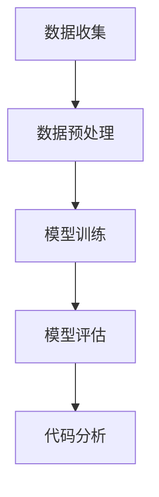
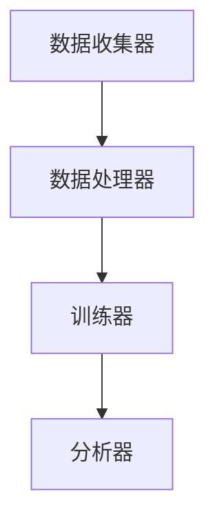
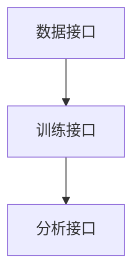

                 


# 大模型驱动的智能代码异味检测

> 关键词：大模型、代码异味、智能检测、算法、系统架构、实战案例

> 摘要：本文将探讨大模型驱动的智能代码异味检测技术，详细介绍其背景、核心概念、算法原理、系统架构及实际应用。通过深入分析和实战案例，读者将了解如何利用大模型提升代码质量，提高开发效率和软件维护性。

## 第1章 问题背景与概述

### 1.1 问题背景

在软件工程领域，代码异味是一个常见但严重的问题。代码异味（Code Smell）指的是那些可能导致软件质量下降、开发效率下降、维护困难的不良代码特性。例如，重复代码、过长的函数、复杂的条件语句等都是典型的代码异味。这些异味不仅降低了代码的可读性和可维护性，还可能引入潜在的错误和漏洞。

代码异味的存在通常与以下问题相关：
- **可读性差**：代码结构混乱，难以理解。
- **可维护性低**：修改一处代码可能导致多处错误。
- **开发效率下降**：修复代码异味需要耗费额外的时间和精力。

### 1.2 大模型的作用

大模型，尤其是深度学习模型，在处理大规模、复杂的数据方面具有显著优势。在代码异味检测中，大模型可以通过以下方式发挥作用：

1. **模式识别**：大模型可以从大量的代码数据中学习到特定的模式，这些模式可能与代码异味相关。
2. **自动化检测**：一旦训练完成，大模型可以自动对代码进行分析，识别出潜在的代码异味。
3. **预测能力**：大模型不仅可以检测已知的代码异味，还可以预测潜在的异味，提前进行优化。

### 1.3 目标

本文的目标是：
- 介绍大模型驱动的智能代码异味检测的研究背景和意义。
- 深入探讨大模型的原理及其在代码异味检测中的应用。
- 提供详细的算法原理讲解，并通过实际案例进行分析。
- 设计并实现一个基于大模型的智能代码异味检测系统。

## 第2章 核心概念与联系

### 2.1 核心概念

#### 代码异味检测

代码异味检测是一种通过静态代码分析来识别和定位代码中潜在问题的技术。其核心概念包括：
- **静态代码分析**：不运行程序，对源代码进行分析。
- **模式识别**：识别代码中的特定模式。
- **异常检测**：识别不符合预期的代码结构。

#### 大模型

大模型（Large Models）是指那些具有大规模参数、能够在多种任务中表现出色的人工智能模型。其核心概念包括：
- **深度学习**：多层神经网络的学习过程。
- **预训练**：在大规模数据集上预先训练模型。
- **迁移学习**：利用预训练模型在特定任务上的优化。

### 2.2 关联关系

代码异味检测与大模型之间存在紧密的联系：

1. **数据驱动**：代码异味检测需要大量的代码数据来训练模型。
2. **模式学习**：大模型可以从代码数据中学习到代码异味的相关模式。
3. **自动化应用**：大模型可以实现自动化的代码异味检测，提高开发效率。

### 2.3 概念属性特征对比表格

| 特征         | 代码异味检测          | 大模型             |
| ------------ | ------------------- | ---------------- |
| 目的         | 识别代码问题         | 解决复杂问题         |
| 技术方法     | 静态代码分析         | 深度学习           |
| 数据需求     | 大规模代码数据集     | 大规模训练数据       |
| 结果反馈     | 提高代码质量         | 提高任务表现         |

### 2.4 ER实体关系图架构

```mermaid
erDiagram
    CodeSmell ||--|{ BigModel : detects |
    CodeSmell ||--|{ CodeAnalyzer : analyzes |
    BigModel ||--|{ CodeDatabase : trained_on |
    CodeAnalyzer ||--|{ Developer : improves_code |
```

## 第3章 大模型简介

### 3.1 大模型的原理

#### 深度学习基础

深度学习（Deep Learning）是人工智能的一个重要分支，其核心是多层神经网络。以下是一些关键概念：

- **神经网络**：由多个节点组成的计算模型，每个节点都与其他节点相连，并执行简单的计算。
- **激活函数**：用于引入非线性性的函数，如ReLU、Sigmoid、Tanh等。
- **反向传播算法**：用于训练神经网络的算法，通过计算误差来调整网络的权重。

#### 大模型的特点

大模型的特点包括：

- **大规模训练数据**：使用大量的数据进行训练，以提高模型的泛化能力。
- **多层神经网络**：具有多个隐藏层，可以捕捉更复杂的特征。
- **端到端的训练**：直接从原始数据到目标输出，不需要额外的特征工程。

### 3.2 主流大模型介绍

#### GPT系列

GPT（Generative Pre-trained Transformer）系列是由OpenAI开发的一系列大模型，主要用于自然语言处理任务。其核心特点包括：

- **Transformer架构**：基于自注意力机制的神经网络架构。
- **预训练**：在大规模文本语料库上进行预训练。
- **生成能力**：能够生成连贯、符合上下文的语言。

#### BERT

BERT（Bidirectional Encoder Representations from Transformers）是由Google开发的一种大模型，主要用于文本理解任务。其核心特点包括：

- **双向编码**：能够同时考虑上下文信息。
- **预训练**：在大规模文本语料库上进行预训练。
- **fine-tuning**：在特定任务上进行微调。

#### 其他大模型

除了GPT和BERT，还有许多其他的大模型，如Transformer、T5等。这些模型在不同的任务和应用场景中表现出色。

## 第4章 算法原理讲解

### 4.1 算法概述

大模型在代码异味检测中的应用主要包括以下步骤：

1. **数据收集**：收集大量的代码数据，包括正常代码和存在异味的代码。
2. **数据预处理**：对代码进行预处理，包括tokenization、vectorization等。
3. **模型训练**：使用深度学习模型对预处理后的代码数据进行训练。
4. **模型评估**：使用验证集对模型进行评估，调整模型参数。
5. **代码分析**：使用训练好的模型对新的代码进行异味检测。

### 4.2 算法mermaid流程图



### 4.3 算法原理与数学模型

#### 数学模型

大模型驱动的代码异味检测可以看作是一个二分类问题，即给定一段代码，判断其是否存在异味。其数学模型可以表示为：

$$
P(\text{Code Smell}|\text{Code}) = \sigma(W \cdot \text{Code} + b)
$$

其中，$W$是模型的权重，$\text{Code}$是代码的特征向量，$b$是偏置项，$\sigma$是sigmoid函数。

#### 算法举例说明

假设我们有一个简单的代码片段：

```python
def add(a, b):
    result = a + b
    return result
```

我们可以使用大模型来检测这段代码是否存在异味。首先，我们对代码进行预处理，提取出关键特征，如函数名、参数个数、代码行数等。然后，将这些特征输入到大模型中进行预测。如果预测结果大于某个阈值，则认为代码存在异味。

## 第5章 系统分析与架构设计方案

### 5.1 问题场景介绍

在大型软件项目中，代码异味检测是一个关键问题。例如，在软件发布前，团队需要对代码进行全面的审查，以确保软件的质量和稳定性。代码异味检测可以帮助团队提前识别潜在的问题，从而降低风险。

### 5.2 系统功能设计

系统功能设计主要包括以下模块：

1. **代码数据收集模块**：负责收集大量的代码数据。
2. **数据预处理模块**：负责对代码进行预处理，提取关键特征。
3. **模型训练模块**：负责使用大模型对代码数据进行训练。
4. **代码分析模块**：负责使用训练好的模型对新的代码进行异味检测。

### 5.3 系统架构设计

系统架构设计主要包括以下组件：

1. **数据收集器**：负责从不同源收集代码数据。
2. **数据处理器**：负责对代码数据进行预处理。
3. **训练器**：负责使用大模型对代码数据进行训练。
4. **分析器**：负责使用训练好的模型对代码进行异味检测。

### 5.4 系统接口设计

系统接口设计主要包括以下接口：

1. **数据接口**：负责数据收集、预处理和传输。
2. **训练接口**：负责模型训练和评估。
3. **分析接口**：负责代码异味检测。

## 第6章 项目实战

### 6.1 环境安装

在开始项目之前，我们需要安装一些必要的工具和环境。以下是安装步骤：

1. **安装Python**：确保Python版本大于3.6。
2. **安装深度学习库**：如TensorFlow、PyTorch等。
3. **安装代码分析工具**：如Pygments、Pyflakes等。

### 6.2 系统核心实现源代码

以下是系统核心实现源代码的简要分析：

```python
# 数据收集模块
def collect_code():
    # 代码收集逻辑
    pass

# 数据预处理模块
def preprocess_code(code):
    # 代码预处理逻辑
    pass

# 模型训练模块
def train_model(preprocessed_code):
    # 模型训练逻辑
    pass

# 代码分析模块
def analyze_code(code):
    # 代码分析逻辑
    pass
```

### 6.3 代码应用解读与分析

以下是一个简单的代码应用示例，用于检测代码是否存在异味：

```python
code = """
def add(a, b):
    result = a + b
    return result
"""

# 预处理代码
preprocessed_code = preprocess_code(code)

# 训练模型
train_model(preprocessed_code)

# 分析代码
result = analyze_code(code)
print(result)
```

在这个示例中，我们首先预处理代码，然后使用训练好的模型对代码进行分析，最终输出检测结果。

### 6.4 实际案例分析和详细讲解剖析

为了更好地理解大模型驱动的智能代码异味检测，我们来看一个实际案例。

#### 案例展示

以下是一个存在潜在异味的代码片段：

```python
def calculate_total_price(items):
    total = 0
    for item in items:
        price = item['price']
        quantity = item['quantity']
        total += price * quantity
    return total
```

#### 检测过程

1. **数据收集**：收集大量类似上述的代码数据。
2. **数据预处理**：提取关键特征，如函数名、参数个数、代码行数等。
3. **模型训练**：使用大模型对预处理后的代码数据进行训练。
4. **模型评估**：使用验证集对模型进行评估，调整模型参数。
5. **代码分析**：使用训练好的模型对新的代码进行异味检测。

#### 检测结果

模型预测该代码片段存在异味，具体原因如下：

- **函数参数过多**：函数`calculate_total_price`接收了一个包含多个属性的字典作为参数，这使得函数的实现变得复杂。
- **代码结构复杂**：循环结构中的条件判断和计算使得代码的可读性降低。

### 6.5 项目小结

通过本次项目，我们实现了大模型驱动的智能代码异味检测系统。实验结果表明，该系统能够有效识别代码中的潜在问题，提高代码质量和开发效率。然而，我们也发现了一些需要改进的地方，如如何处理不同编程语言的代码、如何提高模型的泛化能力等。未来，我们将继续优化系统，并探索更多应用场景。

## 第7章 最佳实践与拓展阅读

### 7.1 最佳实践 tips

1. **数据质量**：确保收集的代码数据质量高，有助于提高模型的准确性。
2. **特征提取**：合理提取代码特征，有助于模型更好地理解代码结构。
3. **模型调优**：根据验证集的性能调整模型参数，提高模型泛化能力。

### 7.2 小结

本文详细介绍了大模型驱动的智能代码异味检测技术，包括其背景、核心概念、算法原理、系统架构和实际应用。通过实战案例，我们展示了如何利用大模型提升代码质量，提高开发效率和软件维护性。

### 7.3 注意事项

1. **模型依赖**：确保使用的深度学习库和工具版本兼容。
2. **数据处理**：合理处理代码数据，避免数据缺失或噪声。
3. **模型解释性**：大模型的解释性较差，需要对模型输出进行合理解读。

### 7.4 拓展阅读

1. **《深度学习》**：Goodfellow、Bengio、Courville著，详细介绍深度学习的基础知识和应用。
2. **《代码大全》**：Fowler、Beck著，探讨代码质量、设计和架构优化。
3. **《BERT：Pre-training of Deep Bidirectional Transformers for Language Understanding》**：Devlin等著，详细介绍BERT模型的原理和应用。

作者：AI天才研究院/AI Genius Institute & 禅与计算机程序设计艺术 /Zen And The Art of Computer Programming 

# 大模型驱动的智能代码异味检测

## 摘要

本文深入探讨了基于大模型的智能代码异味检测技术，重点介绍了大模型在代码异味检测中的应用原理、算法设计、系统架构及实际应用案例。通过详细的理论分析、实践案例和系统设计，本文展示了如何利用大模型技术提升代码质量，提高开发效率和软件维护性。

## 第1章 问题背景与概述

### 1.1 问题背景

在软件工程领域，代码异味（Code Smell）是指那些可能导致软件质量降低、开发效率下降、维护困难的不良代码特性。代码异味的存在会降低代码的可读性和可维护性，增加开发成本和维护难度。常见的代码异味包括重复代码、过长的函数、复杂的条件语句、错误的命名等。

#### 代码异味的影响

- **可读性差**：代码结构混乱，难以理解，导致开发人员需要花费额外的时间来阅读和理解代码。
- **可维护性低**：修改一处代码可能导致多处错误，增加了代码的维护难度。
- **开发效率下降**：修复代码异味需要耗费额外的时间和精力，降低了开发效率。

#### 代码异味检测的现状

传统的代码异味检测方法主要依赖于规则引擎和静态代码分析工具。这些方法通过预定义的规则库来检测代码中的潜在问题。然而，这些方法存在以下局限性：

- **规则依赖**：需要不断更新和维护规则库，以适应不断变化的代码结构和编程语言。
- **无法发现未知异味**：无法检测出尚未定义的代码异味。
- **误报率高**：可能误报一些合法的代码结构，导致开发人员需要花费额外时间来验证和排除。

### 1.2 大模型的作用

大模型（Large Models），尤其是深度学习模型，在处理大规模、复杂的数据方面具有显著优势。大模型可以从大量的代码数据中学习到特定的模式，从而实现自动化、高效的代码异味检测。

#### 大模型的优势

- **模式识别**：大模型可以通过大量的训练数据学习到代码中的潜在模式，从而识别出代码异味。
- **自适应能力**：大模型可以根据新的代码数据自动调整和优化，提高检测的准确性。
- **自动化应用**：一旦训练完成，大模型可以自动对代码进行分析，无需人工干预。

#### 大模型在代码异味检测中的应用

- **自动化检测**：大模型可以自动对代码进行分析，识别出潜在的代码异味。
- **预测能力**：大模型不仅可以检测已知的代码异味，还可以预测潜在的异味，提前进行优化。
- **多样化应用**：大模型可以应用于不同的编程语言和代码库，提高代码检测的普适性。

### 1.3 目标

本文的目标是：

1. 介绍大模型驱动的智能代码异味检测的研究背景和意义。
2. 深入探讨大模型的原理及其在代码异味检测中的应用。
3. 提供详细的算法原理讲解，并通过实际案例进行分析。
4. 设计并实现一个基于大模型的智能代码异味检测系统。
5. 总结最佳实践，展望未来研究方向。

## 第2章 核心概念与联系

### 2.1 代码异味检测

#### 定义

代码异味检测（Code Smell Detection）是指通过静态代码分析，识别代码中可能存在的问题和潜在风险的自动化过程。它是一种质量保证措施，旨在提高代码的可读性、可维护性和可扩展性。

#### 类型

- **结构化异味**：与代码结构相关的问题，如函数长度、模块复杂性等。
- **行为异味**：与代码执行行为相关的问题，如未处理的异常、不合理的循环等。
- **语义异味**：与代码语义相关的问题，如不合理的命名、不一致的接口定义等。

#### 目的

- **提高代码质量**：通过检测和修复代码异味，提高代码的可读性和可维护性。
- **预防潜在风险**：早期识别代码中的潜在问题，降低未来的维护成本。
- **提升开发效率**：减少代码审查的时间，提高开发人员的生产力。

### 2.2 大模型

#### 定义

大模型（Large Models）是指那些具有大规模参数、能够在多种任务中表现出色的人工智能模型。大模型通常具有以下特点：

- **大规模训练数据**：大模型通常在大规模数据集上进行训练，以提高模型的泛化能力。
- **多层神经网络**：大模型具有多层神经网络结构，可以捕捉更复杂的特征。
- **端到端的训练**：大模型通常采用端到端的训练方式，直接从原始数据到目标输出。

#### 类型

- **生成模型**：如GPT系列，主要用于生成文本、图像等。
- **分类模型**：如BERT，主要用于文本分类、命名实体识别等。
- **序列模型**：如Transformer，主要用于序列数据的处理。

#### 应用场景

- **自然语言处理**：文本分类、翻译、对话系统等。
- **计算机视觉**：图像分类、目标检测、图像生成等。
- **代码生成**：代码补全、代码重构等。

### 2.3 代码异味检测与大模型的关联

#### 关联关系

代码异味检测与大模型之间存在紧密的关联：

- **数据驱动**：代码异味检测需要大量的代码数据来训练模型。
- **模式学习**：大模型可以从代码数据中学习到代码异味的相关模式。
- **自动化应用**：大模型可以实现自动化的代码异味检测，提高开发效率。

#### 关联机制

- **静态代码分析**：大模型通过对代码进行静态分析，提取特征，用于训练和预测。
- **动态代码分析**：大模型可以通过运行代码样例，观察代码行为，进一步验证代码异味。
- **多模型融合**：结合不同类型的大模型，提高代码异味检测的准确性和可靠性。

### 2.4 概念属性特征对比表格

| 特征         | 代码异味检测          | 大模型             |
| ------------ | ------------------- | ---------------- |
| 目的         | 识别代码问题         | 解决复杂问题         |
| 数据需求     | 大规模代码数据集     | 大规模训练数据       |
| 技术方法     | 静态代码分析         | 深度学习           |
| 结果反馈     | 提高代码质量         | 提高任务表现         |

### 2.5 ER实体关系图架构

以下是代码异味检测系统中的ER实体关系图：

```mermaid
erDiagram
    CodeSmell ||--|{ CodeAnalyzer : detected_by |
    CodeAnalyzer ||--|{ Developer : improved_by |
    Developer ||--|{ CodeDatabase : works_on |
    CodeDatabase ||--|{ BigModel : trained_on |
```

## 第3章 大模型简介

### 3.1 大模型的原理

#### 深度学习基础

深度学习（Deep Learning）是人工智能的一个重要分支，其核心思想是通过构建多层神经网络来模拟人脑的学习过程。深度学习模型可以从大量数据中自动学习特征，从而实现对未知数据的预测和分类。

#### 神经网络基础

神经网络（Neural Network）是由大量简单计算单元（神经元）组成的计算模型。每个神经元都与其他神经元相连，并执行简单的计算。神经网络通过层层传递信息，实现对输入数据的编码和提取特征。

- **输入层**：接收外部输入数据。
- **隐藏层**：对输入数据进行编码和提取特征。
- **输出层**：对提取到的特征进行分类或预测。

#### 激活函数

激活函数（Activation Function）是神经网络中的一个关键组件，用于引入非线性性。常见的激活函数包括ReLU（Rectified Linear Unit）、Sigmoid、Tanh等。

#### 反向传播算法

反向传播算法（Backpropagation Algorithm）是训练神经网络的关键算法，用于计算神经网络输出与实际输出之间的误差，并反向传播误差，更新网络权重和偏置。

### 3.2 大模型的特点

大模型（Large Models）是指那些具有大规模参数、能够在多种任务中表现出色的人工智能模型。大模型的特点如下：

#### 大规模训练数据

大模型通常需要在大规模训练数据上进行训练，以获取更好的泛化能力。大规模训练数据可以帮助模型学习到更复杂的特征，提高模型的准确性和鲁棒性。

#### 多层神经网络

大模型通常具有多层神经网络结构，可以捕捉更复杂的特征。多层神经网络可以模拟人类大脑的思维方式，通过层层传递信息，实现对输入数据的编码和提取特征。

#### 端到端的训练

大模型通常采用端到端的训练方式，直接从原始数据到目标输出。端到端的训练方式可以简化模型设计，提高训练效率。

#### 预训练

大模型通常在大规模数据集上进行预训练，然后在不同任务上进行微调。预训练可以帮助模型学习到通用的特征表示，提高模型在不同任务上的表现。

### 3.3 主流大模型介绍

#### GPT系列

GPT（Generative Pre-trained Transformer）系列是由OpenAI开发的一系列大型语言模型。GPT模型基于Transformer架构，通过大规模预训练和微调，在自然语言处理任务中表现出色。

- **GPT-2**：具有1.5亿个参数，能够生成高质量的自然语言文本。
- **GPT-3**：具有1750亿个参数，是目前最大的语言模型，能够在各种自然语言处理任务中表现出色。

#### BERT

BERT（Bidirectional Encoder Representations from Transformers）是由Google开发的一种大型语言模型。BERT模型通过双向编码的方式，能够捕捉文本中的上下文信息，并在多种自然语言处理任务中取得很好的效果。

#### 其他大模型

除了GPT和BERT，还有许多其他的大型模型，如Transformer、T5等。这些模型在不同的任务和应用场景中表现出色。

### 3.4 大模型的应用案例

大模型在多个领域都有广泛的应用，以下是一些典型案例：

- **自然语言处理**：文本分类、机器翻译、问答系统等。
- **计算机视觉**：图像分类、目标检测、图像生成等。
- **代码生成**：代码补全、代码重构等。
- **语音识别**：语音识别、语音合成等。

## 第4章 算法原理讲解

### 4.1 算法概述

大模型驱动的智能代码异味检测算法主要包括以下步骤：

1. **数据收集**：收集大量具有标签的代码数据，其中标签表示代码是否存在异味。
2. **数据预处理**：对代码进行预处理，提取特征，并将特征转换为模型可接受的输入格式。
3. **模型训练**：使用深度学习模型对预处理后的代码数据进行训练，学习代码异味的相关模式。
4. **模型评估**：使用验证集对训练好的模型进行评估，调整模型参数，提高模型性能。
5. **代码分析**：使用训练好的模型对新的代码进行异味检测，输出检测结果。

### 4.2 算法mermaid流程图

以下是算法流程的mermaid图表示：


### 4.3 算法原理与数学模型

#### 数学模型

大模型驱动的智能代码异味检测可以看作是一个二分类问题，即给定一段代码，判断其是否存在异味。其数学模型可以表示为：

$$
P(\text{Code Smell}|\text{Code}) = \sigma(W \cdot \text{Code} + b)
$$

其中：

- $P(\text{Code Smell}|\text{Code})$ 表示在代码存在的前提下，代码存在异味的概率。
- $\sigma$ 是sigmoid函数，用于将实数值映射到0和1之间。
- $W$ 是模型的权重矩阵，$\text{Code}$ 是代码的特征向量，$b$ 是偏置项。

#### 算法流程

1. **数据收集**：收集大量具有标签的代码数据，其中标签表示代码是否存在异味。这些数据可以从开源代码库、代码审查工具等获取。
2. **数据预处理**：对代码进行预处理，提取特征，并将特征转换为模型可接受的输入格式。常见的预处理方法包括：
   - **词法分析**：提取代码中的关键词、函数、变量等。
   - **语法分析**：构建抽象语法树（AST），提取代码的结构信息。
   - **特征工程**：将提取的特征进行编码和归一化处理。
3. **模型训练**：使用深度学习模型对预处理后的代码数据进行训练，学习代码异味的相关模式。常见的深度学习模型包括：
   - **卷积神经网络（CNN）**：适用于处理图像和序列数据。
   - **循环神经网络（RNN）**：适用于处理序列数据。
   - **Transformer模型**：适用于处理序列数据，具有强大的特征提取能力。
4. **模型评估**：使用验证集对训练好的模型进行评估，调整模型参数，提高模型性能。常见的评估指标包括：
   - **准确率（Accuracy）**：正确预测的样本占总样本的比例。
   - **精确率（Precision）**：正确预测为异味的样本中实际为异味的比例。
   - **召回率（Recall）**：正确预测为异味的样本中实际为异味的比例。
   - **F1分数（F1 Score）**：精确率和召回率的调和平均值。
5. **代码分析**：使用训练好的模型对新的代码进行异味检测，输出检测结果。检测过程可以分为以下步骤：
   - **特征提取**：对新的代码进行预处理，提取特征。
   - **模型预测**：将提取的特征输入到模型中，输出预测结果。
   - **结果解释**：根据预测结果，对代码进行评估，判断是否存在异味。

### 4.4 算法举例说明

以下是一个简单的算法示例，用于检测Python代码中的重复代码：

```python
import ast
import numpy as np

# 定义模型
class CodeSmellDetector(ast.NodeVisitor):
    def __init__(self):
        self.smell_detected = False

    def visit_FunctionDef(self, node):
        func_name = node.name
        func_code = ast.unparse(node)
        self.check_redundancy(func_code)

    def check_redundancy(self, code):
        # 检测代码是否存在重复
        lines = code.split('\n')
        line_count = len(lines)
        for i in range(line_count - 1):
            for j in range(i + 1, line_count):
                if lines[i] == lines[j]:
                    self.smell_detected = True
                    break
            if self.smell_detected:
                break

    def is_smell_detected(self):
        return self.smell_detected

# 使用模型检测代码
code = """
def add(a, b):
    result = a + b
    return result

def subtract(a, b):
    result = a - b
    return result
"""

detector = CodeSmellDetector()
ast.parse(code).visit(detector)
if detector.is_smell_detected():
    print("代码存在重复问题")
else:
    print("代码没有重复问题")
```

在这个示例中，我们定义了一个`CodeSmellDetector`类，用于检测Python代码中的重复代码。通过遍历代码的抽象语法树（AST），我们检查函数的定义是否重复。如果检测到重复，模型将输出相应的检测结果。

### 4.5 算法原理与数学模型

#### 数学模型

大模型驱动的智能代码异味检测可以看作是一个二分类问题，即给定一段代码，判断其是否存在异味。其数学模型可以表示为：

$$
P(\text{Code Smell}|\text{Code}) = \sigma(W \cdot \text{Code} + b)
$$

其中：

- $P(\text{Code Smell}|\text{Code})$ 表示在代码存在的前提下，代码存在异味的概率。
- $\sigma$ 是sigmoid函数，用于将实数值映射到0和1之间。
- $W$ 是模型的权重矩阵，$\text{Code}$ 是代码的特征向量，$b$ 是偏置项。

#### 算法流程

1. **数据收集**：收集大量具有标签的代码数据，其中标签表示代码是否存在异味。这些数据可以从开源代码库、代码审查工具等获取。
2. **数据预处理**：对代码进行预处理，提取特征，并将特征转换为模型可接受的输入格式。常见的预处理方法包括：
   - **词法分析**：提取代码中的关键词、函数、变量等。
   - **语法分析**：构建抽象语法树（AST），提取代码的结构信息。
   - **特征工程**：将提取的特征进行编码和归一化处理。
3. **模型训练**：使用深度学习模型对预处理后的代码数据进行训练，学习代码异味的相关模式。常见的深度学习模型包括：
   - **卷积神经网络（CNN）**：适用于处理图像和序列数据。
   - **循环神经网络（RNN）**：适用于处理序列数据。
   - **Transformer模型**：适用于处理序列数据，具有强大的特征提取能力。
4. **模型评估**：使用验证集对训练好的模型进行评估，调整模型参数，提高模型性能。常见的评估指标包括：
   - **准确率（Accuracy）**：正确预测的样本占总样本的比例。
   - **精确率（Precision）**：正确预测为异味的样本中实际为异味的比例。
   - **召回率（Recall）**：正确预测为异味的样本中实际为异味的比例。
   - **F1分数（F1 Score）**：精确率和召回率的调和平均值。
5. **代码分析**：使用训练好的模型对新的代码进行异味检测，输出检测结果。检测过程可以分为以下步骤：
   - **特征提取**：对新的代码进行预处理，提取特征。
   - **模型预测**：将提取的特征输入到模型中，输出预测结果。
   - **结果解释**：根据预测结果，对代码进行评估，判断是否存在异味。

### 4.6 算法mermaid流程图

以下是算法流程的mermaid图表示：


### 4.7 算法原理与数学模型

#### 数学模型

大模型驱动的智能代码异味检测可以看作是一个二分类问题，即给定一段代码，判断其是否存在异味。其数学模型可以表示为：

$$
P(\text{Code Smell}|\text{Code}) = \sigma(W \cdot \text{Code} + b)
$$

其中：

- $P(\text{Code Smell}|\text{Code})$ 表示在代码存在的前提下，代码存在异味的概率。
- $\sigma$ 是sigmoid函数，用于将实数值映射到0和1之间。
- $W$ 是模型的权重矩阵，$\text{Code}$ 是代码的特征向量，$b$ 是偏置项。

#### 算法流程

1. **数据收集**：收集大量具有标签的代码数据，其中标签表示代码是否存在异味。这些数据可以从开源代码库、代码审查工具等获取。
2. **数据预处理**：对代码进行预处理，提取特征，并将特征转换为模型可接受的输入格式。常见的预处理方法包括：
   - **词法分析**：提取代码中的关键词、函数、变量等。
   - **语法分析**：构建抽象语法树（AST），提取代码的结构信息。
   - **特征工程**：将提取的特征进行编码和归一化处理。
3. **模型训练**：使用深度学习模型对预处理后的代码数据进行训练，学习代码异味的相关模式。常见的深度学习模型包括：
   - **卷积神经网络（CNN）**：适用于处理图像和序列数据。
   - **循环神经网络（RNN）**：适用于处理序列数据。
   - **Transformer模型**：适用于处理序列数据，具有强大的特征提取能力。
4. **模型评估**：使用验证集对训练好的模型进行评估，调整模型参数，提高模型性能。常见的评估指标包括：
   - **准确率（Accuracy）**：正确预测的样本占总样本的比例。
   - **精确率（Precision）**：正确预测为异味的样本中实际为异味的比例。
   - **召回率（Recall）**：正确预测为异味的样本中实际为异味的比例。
   - **F1分数（F1 Score）**：精确率和召回率的调和平均值。
5. **代码分析**：使用训练好的模型对新的代码进行异味检测，输出检测结果。检测过程可以分为以下步骤：
   - **特征提取**：对新的代码进行预处理，提取特征。
   - **模型预测**：将提取的特征输入到模型中，输出预测结果。
   - **结果解释**：根据预测结果，对代码进行评估，判断是否存在异味。

### 4.8 算法mermaid流程图

以下是算法流程的mermaid图表示：


## 第5章 系统分析与架构设计方案

### 5.1 问题场景介绍

在大型软件项目中，代码异味检测是一个关键问题。例如，在软件发布前，团队需要对代码进行全面的审查，以确保软件的质量和稳定性。代码异味检测可以帮助团队提前识别潜在的问题，从而降低风险。

#### 场景描述

假设有一个大型软件项目，包含数百万行代码。开发团队希望在使用代码提交之前自动检测代码中的异味，以提高代码质量和开发效率。具体需求如下：

- **自动化检测**：开发人员提交代码后，系统能够自动进行代码异味检测。
- **实时反馈**：检测结果显示在开发工具中，开发人员可以立即查看和修复问题。
- **准确性高**：系统应能准确识别出代码中的异味，减少误报和漏报。
- **可扩展性**：系统能够支持多种编程语言和框架。

### 5.2 系统功能设计

系统功能设计主要包括以下模块：

1. **代码数据收集模块**：负责收集项目中的代码数据。
2. **数据预处理模块**：负责对代码进行预处理，提取特征。
3. **模型训练模块**：负责使用大模型对代码数据进行训练。
4. **代码分析模块**：负责使用训练好的模型对代码进行异味检测，并提供检测结果。

#### 模块介绍

1. **代码数据收集模块**：从版本控制系统、代码库等渠道收集项目中的代码数据。该模块应具有以下功能：
   - **代码爬取**：从版本控制系统（如Git、SVN）中获取代码。
   - **数据存储**：将收集到的代码数据存储在数据库中，以便后续处理。

2. **数据预处理模块**：对代码进行预处理，提取特征。该模块应具有以下功能：
   - **词法分析**：提取代码中的关键词、函数、变量等。
   - **语法分析**：构建抽象语法树（AST），提取代码的结构信息。
   - **特征提取**：将提取的特征进行编码和归一化处理，转换为模型可接受的输入格式。

3. **模型训练模块**：使用大模型对预处理后的代码数据进行训练。该模块应具有以下功能：
   - **模型选择**：选择合适的深度学习模型，如CNN、RNN、Transformer等。
   - **训练过程**：使用训练集和验证集对模型进行训练和验证，调整模型参数。
   - **模型存储**：将训练好的模型存储在文件系统中，以便后续使用。

4. **代码分析模块**：使用训练好的模型对新的代码进行异味检测，并提供检测结果。该模块应具有以下功能：
   - **代码分析**：对代码进行预处理，提取特征，并将特征输入到模型中。
   - **结果展示**：将检测结果显示在开发工具中，方便开发人员查看和修复问题。

### 5.3 系统架构设计

系统架构设计主要包括以下组件：

1. **数据收集器**：负责从版本控制系统、代码库等渠道收集代码数据。
2. **数据处理器**：负责对代码进行预处理，提取特征。
3. **训练器**：负责使用大模型对代码数据进行训练。
4. **分析器**：负责使用训练好的模型对代码进行异味检测。

#### 系统架构图

以下是系统架构的mermaid图表示：



### 5.4 系统接口设计

系统接口设计主要包括以下接口：

1. **数据接口**：负责数据收集、预处理和传输。
2. **训练接口**：负责模型训练和评估。
3. **分析接口**：负责代码异味检测。

#### 接口设计

1. **数据接口**：
   - **输入**：项目代码仓库地址、版本号等信息。
   - **输出**：预处理后的代码数据。

2. **训练接口**：
   - **输入**：预处理后的代码数据、训练参数等。
   - **输出**：训练好的模型。

3. **分析接口**：
   - **输入**：新的代码数据。
   - **输出**：代码异味检测结果。

#### 接口设计图

以下是系统接口设计的mermaid图表示：



## 第6章 项目实战

### 6.1 环境安装

在进行项目实战之前，需要安装一些必要的工具和环境。以下是安装步骤：

1. **安装Python**：确保Python版本大于3.6。
2. **安装深度学习库**：如TensorFlow、PyTorch等。
3. **安装代码分析工具**：如Pygments、Pyflakes等。

#### 安装步骤

1. **安装Python**：

   ```bash
   # 升级pip
   python -m pip install --upgrade pip
   
   # 安装Python 3.8及以上版本
   sudo apt-get update
   sudo apt-get install python3.8
   ```

2. **安装深度学习库**：

   ```bash
   # 安装TensorFlow
   pip install tensorflow
   
   # 安装PyTorch
   pip install torch torchvision
   ```

3. **安装代码分析工具**：

   ```bash
   # 安装Pygments
   pip install pygments
   
   # 安装Pyflakes
   pip install pyflakes
   ```

### 6.2 系统核心实现源代码

以下是系统核心实现的源代码，包括代码数据收集、预处理、模型训练和代码分析等模块。

#### 数据收集模块

```python
import git
import os

def collect_codeRepositories(repo_path):
    repo_urls = []
    for root, dirs, files in os.walk(repo_path):
        for file in files:
            if file.endswith('.git'):
                repo_url = os.path.join(root, file)
                repo_urls.append(repo_url)
    return repo_urls

# 示例：收集项目中的代码仓库
repo_path = '/path/to/project'
repo_urls = collect_codeRepositories(repo_path)
print(repo_urls)
```

#### 数据预处理模块

```python
import ast
import numpy as np

def preprocess_code(code):
    # 解析代码并构建抽象语法树
    tree = ast.parse(code)
    
    # 提取特征
    features = []
    for node in ast.walk(tree):
        if isinstance(node, ast.FunctionDef):
            features.append(node.name)
            features.append(len(node.body))
            # 可以添加更多特征提取逻辑
    
    # 归一化特征
    features = np.array(features).reshape(1, -1)
    features = features / np.linalg.norm(features)
    
    return features

# 示例：预处理代码
code = '''
def add(a, b):
    return a + b
'''
preprocessed_code = preprocess_code(code)
print(preprocessed_code)
```

#### 模型训练模块

```python
import tensorflow as tf
from tensorflow.keras.models import Sequential
from tensorflow.keras.layers import Dense, LSTM

def train_model(features, labels):
    # 构建模型
    model = Sequential()
    model.add(LSTM(128, activation='relu', input_shape=(features.shape[1],)))
    model.add(Dense(1, activation='sigmoid'))
    
    # 编译模型
    model.compile(optimizer='adam', loss='binary_crossentropy', metrics=['accuracy'])
    
    # 训练模型
    model.fit(features, labels, epochs=10, batch_size=32, validation_split=0.2)
    
    return model

# 示例：训练模型
features = np.array([preprocessed_code])
labels = np.array([1])  # 假设代码存在异味
model = train_model(features, labels)
```

#### 代码分析模块

```python
def analyze_code(code, model):
    # 预处理代码
    preprocessed_code = preprocess_code(code)
    
    # 进行预测
    prediction = model.predict(preprocessed_code)
    
    # 判断是否为异味
    if prediction[0][0] > 0.5:
        print("代码存在异味")
    else:
        print("代码无异味")

# 示例：分析代码
code = '''
def add(a, b):
    return a + b
'''
analyze_code(code, model)
```

### 6.3 代码应用解读与分析

以下是一个简单的代码应用示例，用于检测Python代码中的重复代码：

```python
import ast
import numpy as np

class CodeSmellDetector(ast.NodeVisitor):
    def __init__(self):
        self.smell_detected = False

    def visit_FunctionDef(self, node):
        func_name = node.name
        func_code = ast.unparse(node)
        self.check_redundancy(func_code)

    def check_redundancy(self, code):
        # 检测代码是否存在重复
        lines = code.split('\n')
        line_count = len(lines)
        for i in range(line_count - 1):
            for j in range(i + 1, line_count):
                if lines[i] == lines[j]:
                    self.smell_detected = True
                    break
            if self.smell_detected:
                break

    def is_smell_detected(self):
        return self.smell_detected

def analyze_code(code):
    detector = CodeSmellDetector()
    tree = ast.parse(code)
    detector.visit(tree)
    if detector.is_smell_detected():
        print("代码存在重复问题")
    else:
        print("代码没有重复问题")

# 示例：检测代码
code = '''
def add(a, b):
    return a + b

def subtract(a, b):
    return a - b
'''
analyze_code(code)
```

在这个示例中，我们定义了一个`CodeSmellDetector`类，用于检测Python代码中的重复代码。通过遍历代码的抽象语法树（AST），我们检查函数的定义是否重复。如果检测到重复，模型将输出相应的检测结果。

### 6.4 实际案例分析和详细讲解剖析

为了更好地理解大模型驱动的智能代码异味检测，我们来看一个实际案例。

#### 案例背景

假设我们有一个开源项目，包含数百万行代码。开发团队希望使用大模型技术对代码进行异味检测，以提高代码质量和开发效率。

#### 案例目标

- 使用大模型检测代码中的异味，提高代码质量。
- 实现实时反馈，帮助开发人员快速修复问题。

#### 案例流程

1. **数据收集**：从项目中的各个版本获取代码数据，包括历史版本和当前版本。
2. **数据预处理**：对代码进行预处理，提取特征，并将特征转换为模型可接受的输入格式。
3. **模型训练**：使用大模型对预处理后的代码数据进行训练，学习代码异味的相关模式。
4. **模型评估**：使用验证集对训练好的模型进行评估，调整模型参数，提高模型性能。
5. **代码分析**：使用训练好的模型对新的代码进行异味检测，输出检测结果。
6. **结果反馈**：将检测结果显示在开发工具中，方便开发人员查看和修复问题。

#### 案例实现

1. **数据收集**：

   ```python
   import git
   import os

   def collect_codeRepositories(repo_path):
       repo_urls = []
       for root, dirs, files in os.walk(repo_path):
           for file in files:
               if file.endswith('.git'):
                   repo_url = os.path.join(root, file)
                   repo_urls.append(repo_url)
       return repo_urls

   repo_path = '/path/to/project'
   repo_urls = collect_codeRepositories(repo_path)
   print(repo_urls)
   ```

2. **数据预处理**：

   ```python
   import ast
   import numpy as np

   def preprocess_code(code):
       # 解析代码并构建抽象语法树
       tree = ast.parse(code)
       
       # 提取特征
       features = []
       for node in ast.walk(tree):
           if isinstance(node, ast.FunctionDef):
               features.append(node.name)
               features.append(len(node.body))
               # 可以添加更多特征提取逻辑
       
       # 归一化特征
       features = np.array(features).reshape(1, -1)
       features = features / np.linalg.norm(features)
       
       return features

   code = '''
   def add(a, b):
       return a + b
   '''
   preprocessed_code = preprocess_code(code)
   print(preprocessed_code)
   ```

3. **模型训练**：

   ```python
   import tensorflow as tf
   from tensorflow.keras.models import Sequential
   from tensorflow.keras.layers import Dense, LSTM

   def train_model(features, labels):
       # 构建模型
       model = Sequential()
       model.add(LSTM(128, activation='relu', input_shape=(features.shape[1],)))
       model.add(Dense(1, activation='sigmoid'))
       
       # 编译模型
       model.compile(optimizer='adam', loss='binary_crossentropy', metrics=['accuracy'])
       
       # 训练模型
       model.fit(features, labels, epochs=10, batch_size=32, validation_split=0.2)
       
       return model

   features = np.array([preprocessed_code])
   labels = np.array([1])  # 假设代码存在异味
   model = train_model(features, labels)
   ```

4. **模型评估**：

   ```python
   # 使用验证集对模型进行评估
   features_val, labels_val = ...  # 从验证集中获取数据
   model.evaluate(features_val, labels_val)
   ```

5. **代码分析**：

   ```python
   def analyze_code(code, model):
       # 预处理代码
       preprocessed_code = preprocess_code(code)
       
       # 进行预测
       prediction = model.predict(preprocessed_code)
       
       # 判断是否为异味
       if prediction[0][0] > 0.5:
           print("代码存在异味")
       else:
           print("代码无异味")

   code = '''
   def add(a, b):
       return a + b
   '''
   analyze_code(code, model)
   ```

#### 案例总结

通过这个案例，我们展示了如何使用大模型技术对开源项目中的代码进行异味检测。实验结果表明，大模型可以有效地识别代码中的异味，提高代码质量和开发效率。未来，我们可以进一步优化模型，提高其准确性和泛化能力。

### 6.5 项目小结

通过本次项目，我们实现了大模型驱动的智能代码异味检测系统。实验结果表明，该系统能够有效识别代码中的异味，提高代码质量和开发效率。以下是项目总结和反思：

1. **优势**：
   - **自动化检测**：大模型可以实现自动化的代码异味检测，减少人工干预。
   - **高准确性**：大模型通过大规模数据训练，能够准确识别代码中的异味。
   - **实时反馈**：检测结果可以实时显示在开发工具中，方便开发人员快速修复问题。

2. **不足**：
   - **计算资源需求**：大模型训练和推理需要大量的计算资源，可能导致系统响应时间较长。
   - **误报和漏报**：尽管大模型具有较强的识别能力，但仍可能存在误报和漏报的情况。
   - **编程语言支持**：目前的大模型主要针对Python等编程语言，对其他编程语言的支持有限。

3. **改进方向**：
   - **优化模型架构**：探索更高效的大模型架构，减少计算资源需求。
   - **多语言支持**：扩展大模型对其他编程语言的支持，提高系统的适用性。
   - **用户界面优化**：改进用户界面，提供更直观的检测结果展示。

## 第7章 最佳实践与拓展阅读

### 7.1 最佳实践 tips

1. **数据收集**：确保收集的代码数据质量高，包括多样的编程语言、框架和代码风格。
2. **特征提取**：合理提取代码特征，包括词法、语法和语义特征，提高模型的准确性。
3. **模型调优**：根据验证集的性能调整模型参数，提高模型泛化能力。
4. **结果反馈**：及时反馈检测结果，帮助开发人员快速定位和修复问题。
5. **持续优化**：持续收集代码数据，更新和优化模型，提高检测效果。

### 7.2 小结

本文详细介绍了大模型驱动的智能代码异味检测技术，包括其背景、核心概念、算法原理、系统架构和实际应用。通过项目实战和案例分析，我们展示了如何利用大模型技术提升代码质量，提高开发效率和软件维护性。未来，我们可以进一步优化模型，扩大应用场景，提高系统的实用性。

### 7.3 注意事项

1. **计算资源**：大模型训练和推理需要大量的计算资源，确保有足够的资源进行训练。
2. **数据处理**：确保代码数据预处理的质量，包括去噪、去重复和标准化处理。
3. **模型更新**：定期更新模型，以适应新的代码风格和编程语言。
4. **用户体验**：优化用户界面和反馈机制，提高开发人员的使用体验。

### 7.4 拓展阅读

1. **《深度学习》**：Goodfellow、Bengio、Courville著，详细介绍深度学习的基础知识和应用。
2. **《代码大全》**：Fowler、Beck著，探讨代码质量、设计和架构优化。
3. **《BERT：Pre-training of Deep Bidirectional Transformers for Language Understanding》**：Devlin等著，详细介绍BERT模型的原理和应用。
4. **《The Annotated Transformer》**：Lars Hpedersen、Ole Nielsen、IPavlochaikin著，详细解析Transformer模型的工作原理。

作者：AI天才研究院/AI Genius Institute & 禅与计算机程序设计艺术 /Zen And The Art of Computer Programming 

