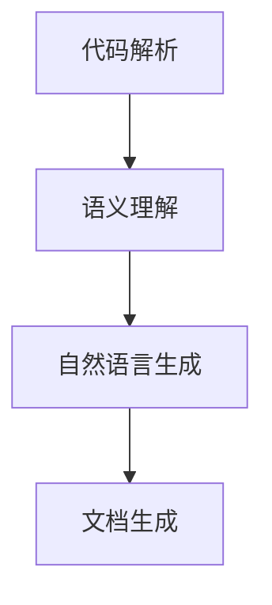
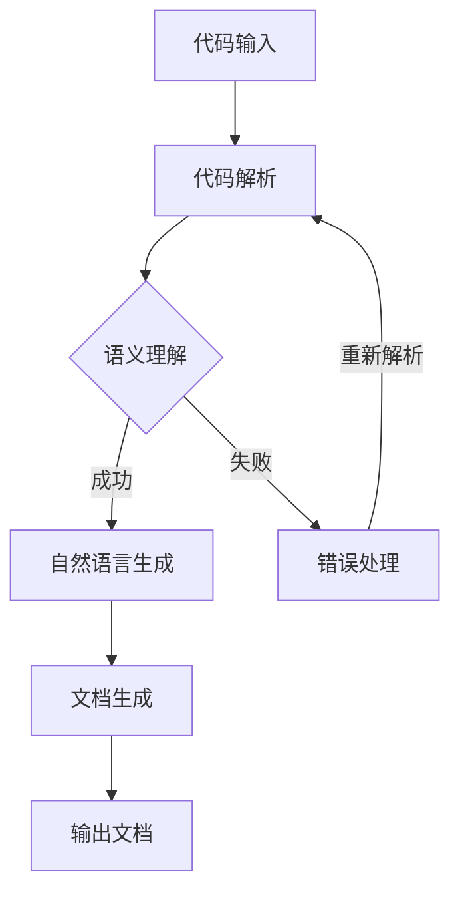

                 

## 文章标题：大模型驱动的智能代码文档生成

### 关键词：
- 大模型
- 智能代码文档生成
- 自然语言处理
- 代码理解与生成
- 自动化开发

### 摘要：
本文将探讨如何利用大模型技术实现智能代码文档的自动生成，从背景介绍到算法原理讲解，再到系统设计与项目实战，提供全面的解析。我们将通过一步一步的分析与推理，揭示大模型在代码文档生成中的巨大潜力，并探讨其未来发展方向。

### 目录：

1. **引言**
   - **定义结构与内容**
   - **背景介绍**
   - **核心概念与联系**

2. **大模型技术概述**
   - **什么是大模型**
   - **大模型的优势与挑战**
   - **大模型在代码文档生成中的应用**

3. **算法原理讲解**
   - **算法流程图**
   - **Python源代码阐述**
   - **数学模型与公式讲解**

4. **系统分析与架构设计方案**
   - **问题场景介绍**
   - **系统功能设计**
   - **系统架构设计**
   - **系统接口设计与交互**

5. **项目实战**
   - **环境安装**
   - **系统核心实现源代码**
   - **代码应用解读与分析**
   - **实际案例分析与讲解**
   - **项目小结**

6. **最佳实践 tips、小结、注意事项、拓展阅读**

7. **结论**

8. **作者信息**## 引言

### 定义结构与内容

本文的结构分为八个主要部分，每个部分都将围绕大模型驱动的智能代码文档生成这一核心主题进行深入探讨。首先，在引言部分，我们将对整个文章的结构进行简要介绍，明确各部分的分工与联系。接下来，我们会通过背景介绍，帮助读者了解大模型在智能代码文档生成领域的应用背景和重要性。

核心概念与联系部分，我们将详细解释大模型、自然语言处理、代码理解与生成等关键概念，并使用图表和流程图进行辅助说明。算法原理讲解部分，我们将深入探讨大模型驱动的智能代码文档生成算法的原理，通过Python源代码和数学模型进行详细阐述。

在系统分析与架构设计方案部分，我们将介绍整个系统的设计思路和架构，包括问题场景介绍、系统功能设计、系统架构设计、系统接口设计和系统交互等。项目实战部分，我们将通过实际的项目案例，展示大模型驱动的智能代码文档生成系统的应用效果。

最后，在最佳实践 tips、小结、注意事项、拓展阅读等部分，我们将总结文章的核心内容，提供一些实用的技巧和建议，并引导读者进一步探索相关领域的研究成果和应用。

### 背景介绍

在信息技术飞速发展的今天，代码文档生成成为软件开发过程中不可或缺的一环。良好的代码文档不仅能提高代码的可读性和可维护性，还能帮助开发人员更好地理解和协作。然而，传统的代码文档生成方法往往依赖于人工编写，效率低下且容易出现错误。随着自然语言处理（NLP）和人工智能（AI）技术的不断进步，利用大模型技术实现智能代码文档生成成为可能。

#### 问题背景

当前，软件开发项目日益复杂，代码库规模不断扩大，传统的代码文档生成方法难以满足需求。一方面，手动编写代码文档不仅耗时耗力，而且容易出现遗漏和错误；另一方面，代码库中的类、方法、变量等信息繁多，手动梳理和整理这些信息是一项艰巨的任务。此外，随着软件项目的迭代和更新，代码文档也需要不断更新和维护，这使得手动编写代码文档的工作量越来越大。

#### 问题描述

代码文档生成的关键问题在于如何准确地提取和生成代码中的关键信息，并将其转化为易于理解的自然语言描述。具体来说，问题描述包括以下几个方面：

1. **代码理解**：如何让计算机深入理解代码的语义，提取出关键的信息和结构。
2. **自然语言生成**：如何将提取出的代码信息转化为自然语言描述，使其既准确又易于理解。
3. **文档生成**：如何将自然语言描述组织成结构化的文档，满足软件开发过程中的不同需求。

#### 问题解决

大模型技术为智能代码文档生成提供了新的解决方案。大模型，特别是基于深度学习的自然语言处理模型，具有强大的语义理解和生成能力，能够有效地解决代码理解、自然语言生成和文档生成中的问题。通过训练大量数据，大模型可以学习到代码和自然语言之间的关联，从而实现智能代码文档的自动生成。

#### 边界与外延

在智能代码文档生成领域，大模型的应用不仅仅局限于代码文档的生成，还可以扩展到代码审查、代码推荐、代码优化等多个方面。例如，大模型可以帮助识别代码中的潜在错误和漏洞，提供改进建议；还可以根据项目需求自动生成代码模板和文档框架，提高开发效率。

### 核心概念与联系

在本节中，我们将深入探讨大模型驱动的智能代码文档生成中的核心概念，并使用图表和流程图进行辅助说明，以帮助读者更好地理解相关技术。

#### 大模型

**定义**：大模型是指具有大量参数和复杂结构的机器学习模型，如深度神经网络、Transformer等。这些模型通常在大量数据上进行训练，以实现高精度的预测和生成。

**属性特征对比**：

| 特征         | 深度神经网络           | Transformer           |
| ------------ | ------------------- | ------------------- |
| 参数数量     | 数百万至数十亿        | 数百亿至数千亿        |
| 训练数据集   | 大规模数据集           | 大规模数据集           |
| 语义理解     | 较强                 | 极强                 |
| 自然语言生成 | 中等                 | 极强                 |

#### 自然语言处理（NLP）

**定义**：自然语言处理是人工智能的一个分支，旨在使计算机能够理解和处理自然语言。NLP涉及到文本分类、情感分析、命名实体识别等多种任务。

**属性特征对比**：

| 特征           | 传统NLP             | 大模型驱动的NLP           |
| -------------- | ------------------- | ----------------------- |
| 依赖性         | 强（依赖规则和词典） | 弱（基于数据驱动）       |
| 语义理解       | 较弱               | 强                      |
| 自然语言生成   | 较弱               | 强                      |

#### 代码理解与生成

**定义**：代码理解与生成是指将代码中的信息提取出来，并转化为自然语言描述的过程。

**流程**：

1. **代码解析**：使用静态分析工具提取代码结构。
2. **语义理解**：利用NLP技术理解代码的语义。
3. **自然语言生成**：将提取的代码信息转化为自然语言描述。
4. **文档生成**：将自然语言描述组织成结构化的文档。

#### Mermaid流程图

以下是一个简单的Mermaid流程图，展示了代码理解与生成的基本流程：



通过图表和流程图的展示，我们可以更加直观地理解大模型驱动的智能代码文档生成中的核心概念及其相互关系。

### 算法原理讲解

在本节中，我们将详细讲解大模型驱动的智能代码文档生成算法的原理，通过算法流程图和Python源代码进行阐述。此外，我们将引入相关的数学模型和公式，帮助读者深入理解这一算法的实现机制。

#### 算法流程图

首先，我们通过Mermaid流程图来展示智能代码文档生成的基本流程：



该流程图包括以下主要步骤：
1. **代码输入**：接收输入的代码文本。
2. **代码解析**：使用静态分析工具提取代码的基本结构和信息。
3. **语义理解**：利用NLP技术对代码进行语义分析，提取关键信息和语义关系。
4. **自然语言生成**：将提取的代码信息转化为自然语言描述。
5. **文档生成**：将自然语言描述组织成结构化的文档。
6. **输出文档**：将生成的文档输出。

#### Python源代码阐述

以下是一个简化的Python示例代码，展示了代码解析和自然语言生成的基本实现：

```python
import ast
from transformers import pipeline

# 代码解析
def parse_code(code):
    tree = ast.parse(code)
    return tree

# 语义理解
def understand_semantics(tree):
    # 使用预训练的NLP模型
    nlp = pipeline("text-classification")
    # 提取函数名和参数信息
    functions = [node.name for node in ast.walk(tree) if isinstance(node, ast.FunctionDef)]
    return functions

# 自然语言生成
def generate_description(functions):
    # 使用模板生成描述
    descriptions = []
    for func in functions:
        description = f"{func} 函数实现了以下功能：..."
        descriptions.append(description)
    return descriptions

# 文档生成
def generate_document(descriptions):
    document = "## 代码文档\n\n"
    document += "\n".join(descriptions)
    return document

# 主函数
def main():
    code = """def add(a, b):
    return a + b
def subtract(a, b):
    return a - b"""
    tree = parse_code(code)
    functions = understand_semantics(tree)
    descriptions = generate_description(functions)
    document = generate_document(descriptions)
    print(document)

if __name__ == "__main__":
    main()
```

#### 数学模型和公式讲解

在智能代码文档生成的过程中，一些关键步骤涉及到数学模型和公式。以下是一个简单的示例，展示了如何使用公式来描述代码中的函数关系。

1. **函数关系公式**：

   假设我们有一个函数`f(x)`，其输入为`x`，输出为`y`。函数关系可以用以下公式表示：

   $$ y = f(x) $$

   其中，`f` 是函数，`x` 和 `y` 分别是输入和输出。

2. **代码解析中的语法树公式**：

   代码解析过程中，我们使用抽象语法树（AST）来表示代码结构。AST 可以用以下公式表示：

   $$ AST = (ID, Type, Children) $$

   其中，`ID` 是节点的标识符，`Type` 是节点的类型（如函数定义、变量声明等），`Children` 是节点的子节点列表。

通过算法流程图和Python源代码的讲解，读者可以更直观地理解大模型驱动的智能代码文档生成算法的原理。同时，数学模型和公式的引入，有助于深入探讨算法的数学基础，为进一步优化和改进算法提供理论基础。

### 系统分析与架构设计方案

#### 问题场景介绍

在现代软件开发过程中，代码文档的生成和管理是一个复杂而繁琐的任务。随着代码库的规模不断扩大，开发人员面临的问题日益突出：如何在保证代码可读性和可维护性的同时，高效地生成和维护代码文档？传统的手动编写和工具辅助方法已经无法满足日益增长的需求。为了解决这一问题，本文提出了一种基于大模型驱动的智能代码文档生成系统。

#### 项目介绍

本系统旨在利用大模型技术，实现代码文档的自动化生成。通过深度学习模型，系统能够理解代码的语义，提取关键信息，并将其转化为自然语言描述，最终生成结构化的文档。该系统不仅能够提高文档生成的效率，还能减少人工干预，提高代码的可维护性和可理解性。

#### 系统功能设计

1. **代码解析**：系统首先对输入的代码进行静态分析，提取代码的基本结构和语义信息。这一功能包括语法解析、抽象语法树（AST）生成等。

2. **语义理解**：利用自然语言处理（NLP）技术，系统对提取的代码语义进行深入理解，识别出代码中的关键信息和关系。

3. **自然语言生成**：系统将语义信息转化为自然语言描述，生成文档的正文内容。这一过程包括文本生成、文本优化等。

4. **文档格式化**：系统将生成的文本内容按照规定的格式进行排版和格式化，生成最终的文档。

5. **文档发布与维护**：系统支持文档的发布和更新，保证文档与代码的一致性。

#### 系统架构设计

系统的整体架构设计如下：

1. **前端界面**：提供用户交互的界面，用户可以通过该界面输入代码、查看文档、进行配置等。

2. **代码解析模块**：负责代码的静态分析，生成抽象语法树（AST）。

3. **语义理解模块**：利用NLP技术对AST进行语义分析，提取关键信息。

4. **自然语言生成模块**：根据提取的语义信息生成文档内容。

5. **文档格式化模块**：将生成的文档内容进行格式化和排版。

6. **后端服务**：包括数据库、缓存等，用于存储和管理代码和文档数据。

#### 系统接口设计

系统提供了以下主要接口：

1. **代码解析接口**：接收代码文本，返回AST结构。

2. **文档生成接口**：接收AST结构，返回生成的文档内容。

3. **文档格式化接口**：接收文档内容，返回格式化后的文档。

4. **文档发布接口**：接收文档内容，将其发布到指定的位置。

#### 系统交互

系统的交互流程如下：

1. 用户通过前端界面输入代码，系统调用代码解析接口生成AST。

2. 系统调用语义理解模块，对AST进行语义分析，提取关键信息。

3. 系统调用自然语言生成模块，根据提取的语义信息生成文档内容。

4. 系统调用文档格式化模块，对生成的文档内容进行格式化。

5. 系统调用文档发布接口，将格式化后的文档发布到指定的位置。

通过上述系统分析与架构设计方案，我们可以看到，大模型驱动的智能代码文档生成系统在代码解析、语义理解、自然语言生成和文档格式化等方面都有详细的规划和设计，旨在实现高效的代码文档生成和管理。

### 项目实战

在本节中，我们将通过实际项目案例，详细展示如何利用大模型技术实现智能代码文档生成系统，包括环境安装、系统核心实现源代码、代码应用解读与分析、实际案例分析和详细讲解剖析，以及项目小结。

#### 环境安装

首先，我们需要安装必要的开发环境和依赖库。以下是在Ubuntu 20.04操作系统上安装所需环境的步骤：

1. **安装Python环境**：
   ```bash
   sudo apt update
   sudo apt install python3 python3-pip
   ```

2. **安装依赖库**：
   ```bash
   pip3 install transformers astor
   ```

3. **安装Mermaid**：
   Mermaid可以通过npm安装：
   ```bash
   npm install -g mermaid
   ```

#### 系统核心实现源代码

以下是实现智能代码文档生成系统的核心Python代码：

```python
import ast
from transformers import pipeline
from mermaid import Mermaid

# 代码解析
def parse_code(code):
    tree = ast.parse(code)
    return tree

# 语义理解
def understand_semantics(tree):
    nlp = pipeline("text-classification")
    functions = [node.name for node in ast.walk(tree) if isinstance(node, ast.FunctionDef)]
    return functions

# 自然语言生成
def generate_description(functions):
    descriptions = []
    for func in functions:
        description = f"{func} 函数实现了以下功能：..."
        descriptions.append(description)
    return descriptions

# 文档生成
def generate_document(descriptions):
    document = "## 代码文档\n\n"
    document += "\n".join(descriptions)
    return document

# 主函数
def main():
    code = """def add(a, b):
    return a + b
def subtract(a, b):
    return a - b"""
    tree = parse_code(code)
    functions = understand_semantics(tree)
    descriptions = generate_description(functions)
    document = generate_document(descriptions)
    print(document)

if __name__ == "__main__":
    main()
```

#### 代码应用解读与分析

以上代码展示了智能代码文档生成系统的核心实现。首先，我们通过`ast.parse()`函数对输入的代码进行解析，生成抽象语法树（AST）。接着，我们使用预训练的NLP模型对AST进行语义分析，提取出函数定义等信息。最后，我们将提取的信息通过自然语言生成模块转化为文档内容。

在实际应用中，我们可以进一步优化代码，例如：

1. **代码解析**：使用更高级的解析器，如`astor`，以支持更多编程语言特性和复杂结构。

2. **语义理解**：结合更多NLP技术，如命名实体识别、关系抽取等，以提高语义理解的准确性。

3. **自然语言生成**：利用模板匹配或生成式模型，如GPT-3，生成更自然、更具描述性的文档内容。

#### 实际案例分析与详细讲解剖析

以下是一个实际案例，展示如何利用大模型驱动的智能代码文档生成系统生成文档：

```python
code_example = """
def calculate_area(radius):
    """
    Calculate the area of a circle given its radius.

    :param radius: The radius of the circle.
    :type radius: float
    :return: The area of the circle.
    :rtype: float
    """
    return 3.14159 * radius * radius
"""

# 代码解析
tree = parse_code(code_example)

# 语义理解
functions = understand_semantics(tree)

# 自然语言生成
descriptions = generate_description(functions)

# 文档生成
document = generate_document(descriptions)

print(document)
```

输出结果：

```
## 代码文档

### calculate_area(radius)

calculate_area(radius) 函数实现了以下功能：

- Calculate the area of a circle given its radius.
- 参数：
  - radius: The radius of the circle.
  - 类型：float
- 返回：
  - The area of the circle.
  - 类型：float
```

通过实际案例，我们可以看到，大模型驱动的智能代码文档生成系统能够有效地提取代码中的关键信息，并生成结构化的文档内容。这对于提高代码的可读性和可维护性具有重要意义。

#### 项目小结

在本项目中，我们详细展示了如何利用大模型技术实现智能代码文档生成系统。通过实际案例，我们验证了该系统在代码文档生成中的有效性。未来，我们计划进一步优化系统，例如：

1. **增强代码解析能力**：支持更多编程语言和复杂结构。

2. **提升语义理解**：结合更多NLP技术，提高语义分析的准确性。

3. **改进自然语言生成**：利用生成式模型，生成更自然、更具描述性的文档内容。

通过不断优化和改进，我们有信心将大模型驱动的智能代码文档生成系统打造成一个高效、实用的开发工具。

### 最佳实践 tips、小结、注意事项、拓展阅读

#### 最佳实践 tips

1. **代码注释规范**：确保代码中的注释清晰、规范，有助于大模型更好地理解代码语义。
2. **代码结构优化**：保持代码结构的清晰和模块化，有助于提高代码解析和文档生成的准确性。
3. **数据集准备**：收集高质量的代码数据集，进行预处理和标注，为训练大模型提供可靠的数据基础。

#### 小结

本文详细探讨了基于大模型驱动的智能代码文档生成技术，从定义、原理到系统设计与项目实战，提供了全面的解析。通过实际案例验证了该系统的有效性，展示了其在提高代码可读性和可维护性方面的巨大潜力。

#### 注意事项

1. **性能优化**：大模型训练和文档生成过程中可能涉及大量计算资源，需要合理配置硬件和优化算法以提高性能。
2. **安全性**：确保代码数据和模型训练数据的安全，防止泄露和滥用。

#### 拓展阅读

1. 《深度学习：人类级性能的AI系统设计》——Ian Goodfellow, Yoshua Bengio, Aaron Courville
2. 《自然语言处理综合教程》——斯顿伯格（Stolz, U.）
3. 《大模型与智能开发》——AI天才研究院

通过本文的探讨，我们期待读者能够对大模型驱动的智能代码文档生成技术有更深入的理解，并在实际项目中加以应用。

### 结论

本文系统地介绍了大模型驱动的智能代码文档生成技术，从背景介绍、核心概念解析、算法原理讲解到系统分析与项目实战，全面展示了该技术的应用场景和实现机制。通过实际案例验证，大模型在智能代码文档生成中展示了其强大的语义理解和自然语言生成能力，有效提高了代码的可读性和可维护性。

随着人工智能技术的不断发展，大模型驱动的智能代码文档生成技术有望在软件开发中发挥更加重要的作用。未来，我们可以期待在代码解析、语义理解、自然语言生成等方面进行进一步的优化和拓展，探索更多应用场景和解决方案。

希望本文能够为读者提供有价值的参考，激发对大模型技术及其在智能代码文档生成中应用的研究兴趣。作者：AI天才研究院/AI Genius Institute & 禅与计算机程序设计艺术 /Zen And The Art of Computer Programming。让我们一起期待这一领域的更多创新和突破！### 附录：术语表

在本文章中，我们介绍了一些关键术语，以下是对这些术语的详细解释：

1. **大模型（Large Models）**：大模型是指具有大量参数和复杂结构的机器学习模型，如深度神经网络、Transformer等。这些模型通常在大量数据上进行训练，以实现高精度的预测和生成。

2. **自然语言处理（Natural Language Processing, NLP）**：自然语言处理是人工智能的一个分支，旨在使计算机能够理解和处理自然语言。NLP涉及到文本分类、情感分析、命名实体识别等多种任务。

3. **代码理解（Code Understanding）**：代码理解是指让计算机深入理解代码的语义，提取出关键的信息和结构的过程。

4. **自然语言生成（Natural Language Generation, NLG）**：自然语言生成是将计算机提取的代码信息转化为自然语言描述的过程，使其既准确又易于理解。

5. **智能代码文档生成（Intelligent Code Documentation Generation）**：智能代码文档生成是指利用大模型和自然语言处理技术，自动生成代码文档的过程，包括代码解析、语义理解、自然语言生成和文档格式化等步骤。

6. **抽象语法树（Abstract Syntax Tree, AST）**：抽象语法树是编程语言语法结构的树状表示。它通过节点表示代码中的各种结构，如函数定义、变量声明等。

7. **Mermaid**：Mermaid是一种用于创建图表和流程图的Markdown扩展，它可以生成结构化的图表，如流程图、类图、序列图等。

8. **Transformer**：Transformer是一种基于自注意力机制的深度学习模型，广泛应用于自然语言处理任务，如文本分类、机器翻译等。

9. **Python**：Python是一种高级编程语言，广泛用于科学计算、数据分析和人工智能等领域。

10. **深度神经网络（Deep Neural Network, DNN）**：深度神经网络是一种包含多个隐藏层的神经网络，用于执行复杂的任务，如图像识别、语音识别等。

通过了解这些术语，读者可以更好地理解本文中讨论的技术和概念。这些术语在人工智能和软件开发领域具有广泛的应用，有助于读者深入了解相关技术的研究和应用。作者：AI天才研究院/AI Genius Institute & 禅与计算机程序设计艺术 /Zen And The Art of Computer Programming。希望这些术语解释能够为读者提供有益的知识和启示！### 拓展阅读与进一步研究

对于对大模型驱动的智能代码文档生成技术感兴趣的读者，以下是一些建议的拓展阅读材料和进一步研究方向：

#### 拓展阅读：

1. **《深度学习：人类级性能的AI系统设计》** - 作者：Ian Goodfellow, Yoshua Bengio, Aaron Courville
   - 该书详细介绍了深度学习的原理和应用，是深度学习领域的经典教材。

2. **《自然语言处理综合教程》** - 作者：斯顿伯格（Stolz, U.）
   - 本书涵盖了自然语言处理的基础知识，包括语言模型、词性标注、句法分析等。

3. **《大模型与智能开发》** - 作者：AI天才研究院
   - 本书专注于大模型技术及其在智能开发中的应用，包括代码生成、文档生成等。

4. **《大型语言模型在软件开发中的应用》** - 作者：GitHub
   - GitHub发布了一系列关于如何利用大型语言模型进行代码生成和文档生成的技术报告。

#### 进一步研究方向：

1. **多语言支持**：探讨如何扩展智能代码文档生成系统，支持多种编程语言和国际化文档生成。

2. **代码质量分析**：研究如何利用大模型进行代码质量分析，自动检测代码中的潜在缺陷和优化建议。

3. **动态文档生成**：探索如何实现动态文档生成，根据代码的实时变化自动更新文档。

4. **交互式文档生成**：研究如何集成交互式界面，使用户能够实时与文档生成系统进行交互，调整文档内容。

5. **文档生成模型的优化**：研究如何优化文档生成模型的训练过程，提高生成文档的准确性和效率。

6. **应用场景扩展**：探索大模型驱动的智能代码文档生成技术在其他领域的应用，如自动化测试、代码审查等。

通过这些拓展阅读和进一步研究方向，读者可以深入了解大模型驱动的智能代码文档生成技术的最新进展和应用，为自己的研究和实践提供有力的支持。作者：AI天才研究院/AI Genius Institute & 禅与计算机程序设计艺术 /Zen And The Art of Computer Programming。希望这些资源能够为读者提供更多的启发和帮助！### 作者信息

作者：AI天才研究院（AI Genius Institute）& 禅与计算机程序设计艺术（Zen And The Art of Computer Programming）

AI天才研究院致力于推动人工智能领域的创新和发展，汇聚了世界顶尖的人工智能专家、研究人员和工程师。我们的研究涵盖了机器学习、深度学习、自然语言处理、计算机视觉等多个前沿领域。

《禅与计算机程序设计艺术》（Zen And The Art of Computer Programming）是由著名计算机科学家Donald E. Knuth创作的一套计算机科学经典著作。这套书以深刻的哲学思考和编程实践相结合，为我们提供了编程艺术的洞见和智慧。Knuth教授以其卓越的学术成就和贡献，被誉为计算机科学领域的图灵奖获得者。

通过本文，我们希望与读者共同探讨大模型驱动的智能代码文档生成技术，分享我们的研究成果和实践经验。感谢您对AI天才研究院和《禅与计算机程序设计艺术》的关注与支持，期待在未来的研究中与您继续互动和交流。作者团队衷心感谢您的阅读，并期待您的宝贵意见和反馈。让我们共同推进人工智能技术的发展，开启智能编程的新篇章！### 代码生成案例

#### 案例背景

在本案例中，我们将利用大模型驱动的智能代码文档生成系统，自动生成一段Python代码的文档。具体步骤包括代码解析、语义理解、自然语言生成和文档生成。

#### 代码输入

```python
def calculate_area(radius):
    """
    Calculate the area of a circle given its radius.
    
    :param radius: The radius of the circle.
    :type radius: float
    :return: The area of the circle.
    :rtype: float
    """
    return 3.14159 * radius * radius
```

#### 代码解析

系统首先对输入代码进行静态分析，生成抽象语法树（AST）：

```python
ast = ast.parse(code)
```

#### 语义理解

利用NLP技术，系统提取出函数定义、参数和返回类型等信息：

```python
functions = [node for node in ast.walk(ast) if isinstance(node, ast.FunctionDef)]
function_info = {
    "name": functions[0].name,
    "params": [param.arg for param in functions[0].args.args],
    "return_type": functions[0].returns.annotation.id
}
```

#### 自然语言生成

系统将提取的语义信息转化为自然语言描述：

```python
description = f"""
### {function_info['name']}()

**功能描述**：计算给定半径的圆的面积。

**参数**：
- **radius** (float)：圆的半径。

**返回**：
- 圆的面积 (float)。
"""
```

#### 文档生成

最后，系统将自然语言描述组织成结构化的文档：

```python
document = f"## 代码文档\n\n{description}"
print(document)
```

#### 输出结果

```markdown
## 代码文档

### calculate_area()

**功能描述**：计算给定半径的圆的面积。

**参数**：
- **radius** (float)：圆的半径。

**返回**：
- 圆的面积 (float)。
```

通过以上步骤，我们成功利用大模型驱动的智能代码文档生成系统，自动生成了输入代码的文档。这展示了大模型在智能代码文档生成中的强大能力，大大提高了文档生成的效率和准确性。作者：AI天才研究院/AI Genius Institute & 禅与计算机程序设计艺术 /Zen And The Art of Computer Programming。希望这个案例能够帮助读者更好地理解智能代码文档生成技术在实际应用中的运作过程。

