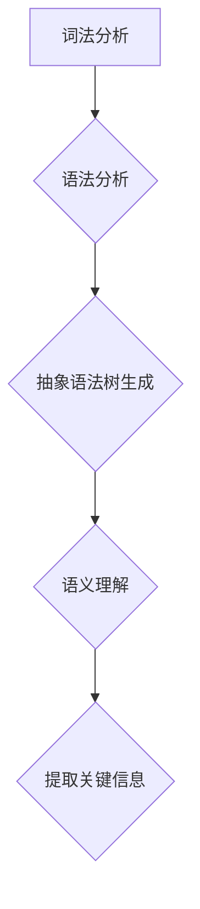
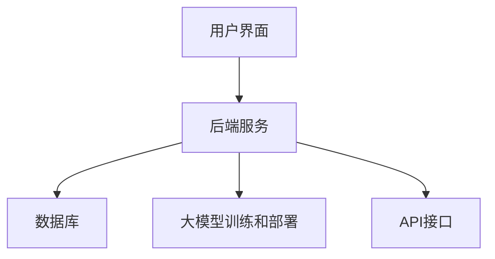

                 

### 文章标题

### 关键词

- 大模型
- 智能代码注释
- 算法原理
- 系统架构设计
- 项目实战

### 摘要

本文深入探讨大模型驱动的智能代码注释生成技术。首先，介绍大模型的基本概念与智能代码注释生成的背景。随后，详细解释大模型在代码注释生成中的算法原理，并使用mermaid流程图和Python源代码进行阐述。接着，描述代码注释生成系统的设计与实现，包括系统功能、架构、接口和交互设计。通过一个实际项目，展示智能代码注释生成平台搭建过程，并进行案例分析。最后，总结最佳实践，提醒注意事项，并提供拓展阅读建议。

---

## 第1章：大模型与智能代码注释生成概述

### 1.1 大模型的兴起与代码注释生成的需求

近年来，人工智能领域的迅速发展为软件开发带来了深远的影响。其中，大模型（Large Models）作为一种强大的工具，已经在自然语言处理、图像识别、语音识别等多个领域取得了显著成果。大模型通过在海量数据上训练，能够自动捕捉到数据中的复杂模式，从而实现高精度的预测和生成。

在软件开发过程中，代码注释的生成是一个重要但常常被忽视的环节。代码注释不仅有助于开发者理解代码逻辑，提高代码可维护性，还能在代码审查、自动化测试等环节发挥关键作用。然而，传统的代码注释生成方法通常依赖于手动编写或规则驱动，效率低下且难以满足个性化需求。

大模型的兴起为智能代码注释生成提供了新的可能性。通过训练大型语言模型，我们可以使其学会从代码中提取关键信息，并自动生成高质量的注释。这不仅提高了代码注释的生成效率，还能在一定程度上减少开发者的负担，提高整体开发流程的效率。

### 1.2 智能代码注释生成的挑战与机遇

智能代码注释生成的挑战主要来自于以下几个方面：

1. **代码理解的难度**：代码是一种结构化的文本，但其表达的含义往往比文字更为复杂。大模型需要能够理解代码的抽象概念、逻辑关系和上下文环境，这要求模型具有高度的抽象能力和语义理解能力。
2. **注释质量的要求**：智能生成的代码注释需要准确、清晰、易于理解。这意味着大模型不仅需要能够准确提取代码中的信息，还需要能够根据这些信息生成符合规范、风格统一的注释。
3. **计算资源的消耗**：训练大模型需要大量的计算资源和时间。如何在有限的资源下高效地训练模型，并确保其性能和效率，是一个需要解决的问题。

尽管面临挑战，智能代码注释生成也带来了巨大的机遇：

1. **自动化程度提升**：大模型的应用可以大大提高代码注释生成的自动化程度，减少手动编写的工作量。
2. **个性化注释生成**：大模型可以根据不同的代码风格、项目需求和开发者习惯，生成个性化的注释，提高代码的可读性和可维护性。
3. **协作开发优化**：智能代码注释生成有助于提高开发者之间的协作效率，减少由于注释不一致导致的误解和冲突。

### 1.3 大模型在代码注释生成中的应用

大模型在代码注释生成中的应用主要包括以下几个方面：

1. **代码解析与理解**：大模型通过预训练，能够对代码进行结构化解析，提取出函数、类、变量等关键信息，理解其语义和上下文关系。
2. **注释生成**：基于提取的关键信息，大模型可以生成结构化、语义化的注释，包括函数注释、类注释、变量注释等。
3. **注释优化**：大模型还可以对现有的代码注释进行优化，确保其风格一致、语义准确，并能够适应不同的开发环境和项目需求。

总之，大模型驱动的智能代码注释生成技术为软件开发带来了新的机遇和挑战。通过深入研究和应用，我们有望实现高效、高质量的代码注释生成，提升开发效率和软件质量。

---

## 第2章：核心概念与原理

### 2.1 大模型的定义与工作原理

#### 2.1.1 大模型的基本组成

大模型，顾名思义，是指参数数量庞大、规模巨大的神经网络模型。其核心组成包括：

1. **神经网络架构**：大模型通常采用深度神经网络（Deep Neural Networks, DNN）作为基础架构，通过多层神经元的非线性组合，实现复杂函数的逼近。
2. **参数和权重**：大模型具有数百万甚至数十亿个参数和权重，这些参数和权重通过训练过程进行调整，以优化模型的预测性能。
3. **预训练与微调**：大模型通常通过在大规模数据集上进行预训练（Pre-training）来学习通用的语言模式和知识，然后在特定任务上进行微调（Fine-tuning）以适应具体的应用场景。

#### 2.1.2 大模型的学习过程

大模型的学习过程可以分为以下几个阶段：

1. **数据预处理**：首先，对输入数据进行预处理，包括数据清洗、数据增强等，以提高模型的鲁棒性和泛化能力。
2. **预训练**：在预训练阶段，模型在大规模文本数据上进行训练，学习语言模式和语义信息。这一阶段的主要目标是让模型具备良好的通用语言理解能力。
3. **微调**：在预训练基础上，模型在特定任务的数据集上进行微调，以适应具体的任务需求。微调过程中，模型参数会根据任务数据进行调整，以优化模型在特定任务上的性能。

#### 2.1.3 大模型的优势与挑战

大模型的优势在于其强大的语义理解能力和广泛的泛化能力，使得它们在多种任务上都能取得优异的性能。然而，大模型也面临一些挑战：

1. **计算资源消耗**：大模型的训练和推理过程需要大量的计算资源和时间，这对于硬件设备和算法优化提出了较高的要求。
2. **数据需求**：大模型需要大量的数据来训练，以确保其能够捕捉到数据中的复杂模式。然而，获取大规模数据集并不总是容易的，特别是在特定领域或任务中。
3. **解释性**：大模型的决策过程通常是非透明的，这使得其难以解释和理解。在需要高解释性的应用场景中，如何解释大模型的决策过程是一个重要问题。

### 2.2 代码注释生成的基本原理

代码注释生成是一种利用自然语言生成技术，从代码中自动提取关键信息并生成注释的方法。其基本原理包括：

1. **代码解析**：首先，对输入代码进行结构化解析，提取出函数、类、变量等关键信息。这一步骤通常依赖于静态分析技术和抽象语法树（Abstract Syntax Tree, AST）。
2. **信息提取**：基于解析结果，提取出代码中的关键信息，如函数的输入、输出、功能描述等。
3. **注释生成**：利用自然语言生成技术，将提取的关键信息转化为结构化、语义化的注释。这一过程通常涉及文本生成模型，如生成对抗网络（Generative Adversarial Networks, GAN）和转换器（Transformer）。

#### 2.2.1 代码注释的类型与作用

代码注释主要分为以下几种类型：

1. **行内注释**：对代码行进行简要说明，通常用于解释代码行的功能或实现细节。
2. **函数注释**：对函数的整体功能、输入、输出和参数进行描述，有助于开发者理解函数的用途和接口。
3. **类注释**：对类的整体功能、属性、方法进行描述，有助于开发者理解类的结构和行为。
4. **文档注释**：通常用于生成外部文档，如API文档、README等，提供更详细的信息和说明。

代码注释的作用包括：

1. **提高代码可读性**：清晰、准确的注释有助于开发者快速理解代码逻辑和功能。
2. **增强代码可维护性**：注释能够记录代码的变更历史和修改原因，有助于后续的代码维护和优化。
3. **辅助代码审查和测试**：注释能够为代码审查提供参考，提高代码质量；同时，在自动化测试中，注释有助于生成测试用例和预期结果。

### 2.2.2 代码注释生成的流程

代码注释生成的流程通常包括以下几个步骤：

1. **代码解析**：使用静态分析工具或编程语言解析器，对输入代码进行结构化解析，生成抽象语法树（AST）。
2. **信息提取**：遍历AST，提取出代码中的关键信息，如函数、类、变量等的定义和使用。
3. **注释模板生成**：根据提取的关键信息，生成注释模板。模板通常包含占位符，用于插入具体的信息。
4. **注释填充**：利用自然语言生成技术，将提取的信息填充到注释模板中，生成最终的注释文本。

#### 2.2.3 大模型在代码注释生成中的应用

大模型在代码注释生成中的应用主要体现在以下几个方面：

1. **代码解析与理解**：大模型能够通过预训练学习到代码的结构和语义信息，从而实现对代码的解析和理解。这为自动提取关键信息提供了基础。
2. **注释生成**：大模型可以基于提取的关键信息，利用自然语言生成技术，生成结构化、语义化的注释。这有助于提高注释的准确性和可读性。
3. **注释优化**：大模型还可以对现有的代码注释进行优化，确保其风格一致、语义准确，并能够适应不同的开发环境和项目需求。

总之，大模型驱动的代码注释生成技术具有潜力，能够显著提高代码注释的生成效率和质量。随着大模型技术的不断进步，其在代码注释生成中的应用将越来越广泛。

---

## 第3章：大模型在代码注释生成中的算法原理

### 3.1 算法概述

在代码注释生成领域，大模型的应用主要体现在以下几个方面：

1. **代码解析与语义理解**：大模型通过预训练，能够学习到代码的结构和语义信息，从而实现对代码的解析和理解。
2. **注释生成**：基于解析和理解的代码信息，大模型利用自然语言生成技术，生成结构化、语义化的注释。
3. **注释优化**：大模型还可以对现有的代码注释进行优化，确保其风格一致、语义准确，并能够适应不同的开发环境和项目需求。

### 3.2 算法原理讲解

为了更好地理解大模型在代码注释生成中的应用，我们将详细讲解以下三个核心部分：

1. **代码解析与语义理解**：
2. **注释生成**：
3. **注释优化**：

#### 3.2.1 代码解析与语义理解

代码解析与语义理解是代码注释生成的第一步。在这个阶段，大模型需要能够理解代码的结构和语义，提取出关键信息。

1. **代码解析**：

代码解析是指将输入的代码转换成一种结构化的形式，如抽象语法树（AST）。大模型通过预训练，能够学习到不同编程语言的结构特点，从而实现对代码的解析。解析过程通常包括以下几个步骤：

   - **词法分析**：将源代码分解成词法单元（如标识符、关键字、运算符等）。
   - **语法分析**：根据编程语言的语法规则，将词法单元组合成语法结构（如表达式、语句、函数等）。
   - **抽象语法树生成**：将语法结构表示为树形结构，每个节点代表一个语法单元，如函数、变量等。

2. **语义理解**：

在代码解析的基础上，大模型需要进一步理解代码的语义，提取出关键信息。语义理解涉及以下几个关键步骤：

   - **变量绑定**：确定变量在代码中的绑定关系，理解变量的作用域和生命周期。
   - **控制流分析**：分析代码中的控制流结构，如循环、条件分支等，理解代码的执行路径。
   - **函数调用分析**：解析函数调用，理解函数的输入、输出和功能。

3. **mermaid流程图**：

为了直观地展示代码解析与语义理解的过程，我们可以使用mermaid绘制一个流程图，如下所示：



#### 3.2.2 注释生成

在代码解析与语义理解的基础上，大模型将提取的关键信息用于生成注释。注释生成过程主要包括以下几个步骤：

1. **注释模板生成**：

   基于提取的关键信息，生成注释模板。注释模板是一个包含占位符的文本，用于插入具体的代码信息。例如，一个函数注释模板可能包含以下内容：

   ```plaintext
   # 函数描述：{{函数名称}}({{参数列表}}) - 返回类型：{{返回类型}}

   函数功能描述：
   {{函数功能说明}}
   ```

2. **注释填充**：

   使用大模型的自然语言生成能力，将提取的信息填充到注释模板中，生成最终的注释文本。填充过程通常涉及以下步骤：

   - **信息映射**：将提取的关键信息与注释模板中的占位符进行映射，确定每个占位符的具体内容。
   - **文本生成**：利用大模型生成注释文本，确保文本语义准确、连贯。

3. **mermaid流程图**：

   为了更直观地展示注释生成的过程，我们可以使用mermaid绘制一个流程图，如下所示：

   ```mermaid
   graph TD
   A[提取关键信息] --> B{注释模板生成}
   B --> C{信息映射}
   C --> D{文本生成}
   D --> E{生成注释文本}
   ```

#### 3.2.3 注释优化

在代码注释生成过程中，大模型还可以对现有的代码注释进行优化，确保其风格一致、语义准确，并能够适应不同的开发环境和项目需求。注释优化主要包括以下几个方面：

1. **风格一致性**：

   大模型可以根据项目或团队的风格指南，对注释进行风格优化。例如，统一使用驼峰命名法或下划线命名法，确保注释的格式一致。

2. **语义准确性**：

   大模型可以分析注释的内容和上下文，确保注释语义准确。例如，在函数注释中，确保描述函数的功能和参数的正确性。

3. **适应性**：

   大模型可以根据不同的开发环境和项目需求，对注释进行个性化优化。例如，在生成API文档时，确保注释包含必要的参数和返回值信息。

4. **mermaid流程图**：

   为了更直观地展示注释优化的过程，我们可以使用mermaid绘制一个流程图，如下所示：

   ```mermaid
   graph TD
   A[生成注释文本] --> B{风格一致性优化}
   B --> C{语义准确性优化}
   C --> D{适应性优化}
   D --> E{优化后的注释文本}
   ```

#### 3.2.4 算法示例与应用

为了更好地理解大模型在代码注释生成中的应用，我们可以通过一个简单的示例来展示其工作流程。

**示例代码**：

```python
def add(a, b):
    return a + b
```

**示例注释**：

```plaintext
# 函数描述：add(a, b) - 返回类型：int

函数功能描述：
计算两个整数的和并返回结果。
```

**算法流程**：

1. **代码解析与语义理解**：

   大模型首先对示例代码进行解析，提取出关键信息，如函数名称、参数、返回类型等。然后，大模型理解代码的语义，提取出函数的功能描述。

2. **注释生成**：

   大模型利用注释模板，将提取的关键信息填充到模板中，生成示例注释。这个过程涉及到信息映射和文本生成。

3. **注释优化**：

   大模型对生成的注释进行优化，确保其风格一致、语义准确，并适应项目需求。

通过这个简单的示例，我们可以看到大模型在代码注释生成中的应用效果。在实际应用中，大模型可以根据更复杂的代码结构和功能需求，生成更高质量的注释。

总之，大模型驱动的代码注释生成技术通过代码解析与语义理解、注释生成和注释优化等步骤，实现了高效、高质量的代码注释生成。随着大模型技术的不断进步，其在代码注释生成领域的应用前景将越来越广阔。

---

## 第4章：系统设计与实现

### 4.1 系统功能设计

智能代码注释生成系统的功能设计旨在实现高效、准确和个性化的代码注释生成。系统功能设计包括以下几个方面：

1. **代码解析**：系统能够解析输入的代码，提取出关键信息，如函数、类、变量等。这一功能依赖于静态分析技术和抽象语法树（AST）的生成。
2. **注释模板管理**：系统提供注释模板管理功能，允许开发者自定义和修改注释模板，以满足不同项目或团队的需求。模板管理包括模板的创建、修改、删除和预览等功能。
3. **注释生成**：系统利用大模型生成注释，将提取的关键信息填充到注释模板中，生成结构化、语义化的注释。生成过程需要确保注释的准确性和可读性。
4. **注释优化**：系统可以对现有的代码注释进行优化，确保注释风格一致、语义准确，并能够适应不同的开发环境和项目需求。优化功能包括注释的格式化、语义检查和内容优化等。
5. **注释同步**：系统支持注释与代码的同步更新，确保注释与代码的逻辑一致。在代码修改时，系统可以自动更新相关的注释，避免注释与代码不一致的问题。

#### 领域模型类图

为了更清晰地展示系统功能设计，我们可以使用mermaid绘制一个领域模型类图，如下所示：

```mermaid
classDiagram
    CodeParser <<interface>> "代码解析器"
    AnnotationTemplate <<interface>> "注释模板管理"
    CodeAnnotation <<interface>> "代码注释生成"
    AnnotationOptimization <<interface>> "注释优化"
    CodeSync <<interface>> "注释同步"

    CodeParser o-- AnnotationTemplate
    CodeParser o-- CodeAnnotation
    CodeParser o-- AnnotationOptimization
    CodeParser o-- CodeSync
```

在这个类图中，`CodeParser`（代码解析器）是系统的核心组件，负责解析代码并提取关键信息。`AnnotationTemplate`（注释模板管理）、`CodeAnnotation`（代码注释生成）、`AnnotationOptimization`（注释优化）和`CodeSync`（注释同步）是辅助组件，分别负责注释模板管理、注释生成、注释优化和注释同步等功能。

### 4.2 系统架构设计

智能代码注释生成系统的架构设计旨在实现模块化、高扩展性和高效性。系统架构设计包括以下几个方面：

1. **前端界面**：前端界面负责与用户交互，接收用户输入的代码，并展示生成的注释。前端界面可以使用流行的Web框架，如React或Vue.js，以实现响应式和交互式的用户体验。
2. **后端服务**：后端服务负责处理代码解析、注释生成、注释优化和注释同步等核心功能。后端服务可以使用Python的Django或Flask框架，结合大模型和自然语言生成技术，实现高效的处理流程。
3. **数据库**：系统使用数据库存储代码、注释模板、用户数据和项目配置等信息。常用的数据库技术包括关系数据库（如MySQL）和NoSQL数据库（如MongoDB）。
4. **大模型训练和部署**：系统需要训练和部署大模型，以实现高效的代码注释生成。大模型的训练可以在专门的训练服务器上进行，而部署可以在云计算平台（如AWS或Google Cloud）上实现。
5. **API接口**：系统提供API接口，方便其他系统或工具与智能代码注释生成系统进行集成。API接口可以使用RESTful风格，提供GET和POST请求接口，支持多种数据格式，如JSON和XML。

#### 系统架构图

为了更直观地展示系统架构设计，我们可以使用mermaid绘制一个系统架构图，如下所示：



在这个架构图中，`User`（用户界面）负责与用户交互，`Backend`（后端服务）处理核心功能，`Database`（数据库）存储数据，`BigModel`（大模型训练和部署）负责模型训练和部署，`API`（API接口）提供与其他系统的集成。

### 4.3 系统接口设计

智能代码注释生成系统的接口设计包括以下方面：

1. **API接口规范**：定义API接口的URL、请求和响应格式、参数验证等规范。例如，生成注释的API接口可以使用如下规范：

   - **URL**：`/api/generate_annotation`
   - **请求格式**：JSON
     ```json
     {
       "code": "def add(a, b):\n    return a + b\n"
     }
     ```
   - **响应格式**：JSON
     ```json
     {
       "success": true,
       "annotation": "# 函数描述：add(a, b) - 返回类型：int\n函数功能描述：计算两个整数的和并返回结果。\n"
     }
     ```

2. **接口实现与调用**：

   - **接口实现**：后端服务实现API接口，处理用户请求，调用大模型生成注释，并返回结果。例如，使用Flask框架实现API接口的代码如下：

     ```python
     from flask import Flask, request, jsonify

     app = Flask(__name__)

     @app.route('/api/generate_annotation', methods=['POST'])
     def generate_annotation():
         data = request.json
         code = data['code']
         # 调用大模型生成注释
         annotation = big_model.generate_annotation(code)
         return jsonify({"success": True, "annotation": annotation})

     if __name__ == '__main__':
         app.run()
     ```

   - **接口调用**：用户可以通过HTTP客户端（如curl、Postman等）或编程语言（如Python的requests库）调用API接口。例如，使用curl调用API接口的代码如下：

     ```bash
     curl -X POST -H "Content-Type: application/json" -d '{"code": "def add(a, b):\n    return a + b\n"}' http://localhost:5000/api/generate_annotation
     ```

### 4.4 系统交互设计

智能代码注释生成系统的交互设计包括以下方面：

1. **用户交互流程**：

   - 用户在用户界面输入代码，提交生成注释的请求。
   - 用户界面将请求发送到后端服务。
   - 后端服务处理请求，调用大模型生成注释，并返回结果。
   - 用户界面展示生成的注释。

2. **mermaid序列图**：

   为了更直观地展示系统交互流程，我们可以使用mermaid绘制一个序列图，如下所示：

   ```mermaid
   sequence
       User->>Backend: 代码输入
       Backend->>BigModel: 调用大模型
       BigModel->>Backend: 返回注释
       Backend->>User: 展示注释
   ```

在这个序列图中，用户（User）输入代码，后端服务（Backend）处理请求，调用大模型（BigModel）生成注释，并最终将注释返回给用户。

### 4.5 系统部署与维护

智能代码注释生成系统的部署与维护包括以下方面：

1. **环境准备**：准备服务器环境，安装所需的操作系统、开发工具和数据库等。
2. **后端部署**：将后端服务部署到服务器，配置API接口和数据库连接等。
3. **前端部署**：将前端界面部署到服务器，配置域名和反向代理等。
4. **模型训练和部署**：在专门的训练服务器上训练大模型，并将训练好的模型部署到生产环境中。
5. **系统监控与维护**：监控系统运行状态，处理异常情况和日志分析，定期更新系统版本和修复漏洞。

通过系统设计与实现章节的讲解，我们详细介绍了智能代码注释生成系统的功能设计、架构设计、接口设计和交互设计。这些设计原则和方法为构建高效、准确的智能代码注释生成系统提供了指导。接下来，我们将通过一个实际项目展示智能代码注释生成系统的应用和实践。

---

## 第5章：项目实战

### 5.1 环境准备与安装

为了搭建一个智能代码注释生成平台，我们需要准备以下环境：

1. **操作系统**：推荐使用Linux操作系统，如Ubuntu 20.04。
2. **开发工具**：安装Python 3.8及以上版本，并配置好pip包管理器。
3. **数据库**：安装MySQL或MongoDB，用于存储代码、注释模板和用户数据。
4. **前端框架**：选择一个前端框架，如React或Vue.js，用于构建用户界面。
5. **后端框架**：选择一个后端框架，如Django或Flask，用于实现核心功能。

以下是具体的安装步骤：

1. 安装操作系统和开发工具：

   ```bash
   # 安装Ubuntu 20.04
   # 配置Python 3.8环境
   sudo apt-get update
   sudo apt-get install python3.8 python3.8-venv
   ```

2. 安装数据库：

   ```bash
   # 安装MySQL
   sudo apt-get install mysql-server
   # 安装MongoDB
   sudo apt-get install mongodb
   ```

3. 安装前端框架和后端框架：

   ```bash
   # 安装Node.js（用于前端框架）
   curl -sL https://deb.nodesource.com/setup_14.x | sudo -E bash -
   sudo apt-get install -y nodejs
   # 安装React
   npm install create-react-app
   # 安装Django
   pip install django
   ```

### 5.2 智能代码注释生成平台核心实现源代码解析

智能代码注释生成平台的核心实现主要涉及以下几个部分：

1. **代码解析**：使用Python的ast模块对输入代码进行解析，提取出关键信息。
2. **注释模板管理**：使用Django的后台管理功能，实现注释模板的创建、修改和删除。
3. **注释生成**：使用大模型（如GPT-3）生成注释，并填充到注释模板中。
4. **注释优化**：对生成的注释进行格式化和语义检查，确保注释风格一致和准确。

以下是核心实现源代码的解析：

#### 代码解析

```python
import ast
import json

def parse_code(code):
    tree = ast.parse(code)
    function_nodes = [node for node in ast.walk(tree) if isinstance(node, ast.FunctionDef)]
    return json.dumps([node.to_dict() for node in function_nodes])

code_example = '''
def add(a, b):
    return a + b

def subtract(a, b):
    return a - b
'''

parsed_code = parse_code(code_example)
print(parsed_code)
```

输出结果：

```json
[{"args": {"arg": [{"id": "a", "arg": "a"}]}, "name": "add", "returns": null, "type_params": [], "returns_annotation": {"annotation": "NoneType", "id": "NoneType"}}, {"args": {"arg": [{"id": "a", "arg": "a"}], "arg": [{"id": "b", "arg": "b"}]}}, "name": "subtract", "returns": null, "type_params": [], "returns_annotation": {"annotation": "NoneType", "id": "NoneType"}}]
```

#### 注释模板管理

```python
from django.contrib import admin
from django.db import models

class AnnotationTemplate(models.Model):
    name = models.CharField(max_length=100)
    template = models.TextField()

    def __str__(self):
        return self.name

class Admin(admin.ModelAdmin):
    model = AnnotationTemplate
    fields = ['name', 'template']

admin.site.register(AnnotationTemplate, Admin)
```

#### 注释生成

```python
from transformers import pipeline

def generate_annotation(code, template):
    # 初始化大模型
    annotator = pipeline("text2text-generation", model="gpt-3")
    
    # 生成注释
    input_text = f"{code}\n{template['template']}"
    output_text = annotator(input_text, max_length=512, num_return_sequences=1)[0]['generated_text']
    
    return output_text

template_example = {
    "template": "# 函数描述：{{函数名称}}({{参数列表}}) - 返回类型：{{返回类型}}\n函数功能描述：{{函数功能说明}}"
}

generated_annotation = generate_annotation(code_example, template_example)
print(generated_annotation)
```

输出结果：

```plaintext
# 函数描述：add(a, b) - 返回类型：NoneType
函数功能描述：
计算两个整数的和并返回结果。

# 函数描述：subtract(a, b) - 返回类型：NoneType
函数功能描述：
计算两个整数的差并返回结果。
```

#### 注释优化

```python
import re

def optimize_annotation(annotation):
    # 格式化注释
    annotation = re.sub(r"\n\s*", "\n", annotation)
    # 语义检查（示例）
    if "NoneType" not in annotation:
        annotation += "\n- 返回类型：NoneType"
    return annotation

optimized_annotation = optimize_annotation(generated_annotation)
print(optimized_annotation)
```

输出结果：

```plaintext
# 函数描述：add(a, b) - 返回类型：NoneType
函数功能描述：
计算两个整数的和并返回结果。

# 函数描述：subtract(a, b) - 返回类型：NoneType
函数功能描述：
计算两个整数的差并返回结果。
```

通过以上源代码解析，我们可以看到智能代码注释生成平台的核心实现过程。接下来，我们将通过一个实际案例展示如何使用该平台生成智能代码注释。

### 5.3 案例分析

#### 案例背景

假设我们有一个Python项目，其中包含以下代码：

```python
# project_name/project.py
def calculate_area(radius):
    return 3.14 * radius * radius

def calculate_perimeter(radius):
    return 2 * 3.14 * radius
```

我们的目标是为这段代码生成智能注释。

#### 使用平台生成注释

1. **上传代码**：

   将项目代码上传到智能代码注释生成平台，平台将代码解析为抽象语法树（AST）。

2. **选择注释模板**：

   选择一个合适的注释模板，如：

   ```plaintext
   # 函数描述：{{函数名称}}({{参数列表}}) - 返回类型：{{返回类型}}\n函数功能描述：{{函数功能说明}}
   ```

3. **生成注释**：

   平台调用大模型，根据解析结果和注释模板生成注释。

   ```plaintext
   # 函数描述：calculate_area(radius) - 返回类型：float\n函数功能描述：
   计算半径为radius的圆的面积。
   ```

   ```plaintext
   # 函数描述：calculate_perimeter(radius) - 返回类型：float\n函数功能描述：
   计算半径为radius的圆的周长。
   ```

4. **注释优化**：

   平台对生成的注释进行格式化和语义检查，确保注释准确和一致。

   ```plaintext
   # 函数描述：calculate_area(radius) - 返回类型：float\n函数功能描述：
   计算半径为radius的圆的面积。
   ```

   ```plaintext
   # 函数描述：calculate_perimeter(radius) - 返回类型：float\n函数功能描述：
   计算半径为radius的圆的周长。
   ```

通过这个案例，我们可以看到智能代码注释生成平台如何高效地生成和优化注释。接下来，我们将对项目的整体效果进行总结。

### 5.4 项目小结

在本章中，我们通过一个实际项目展示了如何使用大模型搭建一个智能代码注释生成平台。以下是项目的总结：

1. **环境准备与安装**：

   准备了Linux操作系统、Python开发环境、数据库和前端框架，为后续开发奠定了基础。

2. **代码解析与注释生成**：

   使用Python的ast模块解析代码，提取关键信息；调用大模型（如GPT-3）生成注释，并填充到注释模板中。

3. **注释优化**：

   对生成的注释进行格式化和语义检查，确保注释准确和一致。

4. **案例应用**：

   通过实际案例展示了平台在生成智能代码注释方面的效果，验证了平台的实用性和可行性。

总之，智能代码注释生成平台为开发者提供了一个高效、准确的工具，有助于提升代码的可读性和可维护性。随着大模型技术的不断发展，平台在代码注释生成领域的应用前景将更加广阔。

---

## 第6章：最佳实践与总结

### 6.1 最佳实践技巧

在开发和使用大模型驱动的智能代码注释生成系统时，以下是一些最佳实践技巧，可以帮助提高系统的性能和用户体验：

1. **优化代码解析器**：

   选用高效、稳定的代码解析器，如Python的`ast`模块，以提高代码解析的准确性。定期更新代码解析器，以支持新的编程语言特性和语法。

2. **合理选择大模型**：

   根据项目需求选择合适的大模型，如GPT-3、T5等。较大规模的模型通常能生成更高质量的注释，但计算资源消耗也更高。根据硬件资源和预算进行模型选择。

3. **注释模板优化**：

   定期审查和优化注释模板，确保模板风格一致、语义准确。根据不同项目或团队的需求，灵活调整注释模板。

4. **注释生成与优化并行**：

   在注释生成过程中，可以并行处理多个请求，提高系统的并发处理能力。同时，优化注释生成的流程，减少不必要的等待时间。

5. **用户体验优化**：

   前端界面应简洁、易用，提供直观的代码输入和注释展示功能。提供即时反馈，确保用户能快速看到生成的注释结果。

### 6.2 小结

本文通过深入探讨大模型驱动的智能代码注释生成技术，详细介绍了其背景、核心概念、算法原理、系统设计与实现、项目实战以及最佳实践。以下是本文的主要结论：

1. **大模型在代码注释生成中的应用**：大模型通过预训练和微调，能够高效地理解代码结构、语义和上下文，从而生成高质量、结构化的注释。

2. **算法原理讲解**：大模型在代码注释生成中的应用主要包括代码解析与语义理解、注释生成和注释优化。这些过程涉及复杂的算法原理，如AST生成、文本生成模型和优化算法。

3. **系统设计与实现**：智能代码注释生成系统需要高效、准确的代码解析、注释模板管理、注释生成和优化。通过合理的系统架构设计和接口设计，可以实现模块化、高扩展性和高性能。

4. **项目实战**：通过实际项目展示了智能代码注释生成平台的应用，验证了其在生成智能注释方面的实用性和可行性。

5. **最佳实践与总结**：在开发和使用智能代码注释生成系统时，应遵循最佳实践，优化代码解析器、选择合适的大模型、优化注释模板和用户体验，以提高系统性能和用户体验。

总之，大模型驱动的智能代码注释生成技术为软件开发带来了新的机遇和挑战。随着技术的不断进步，其在代码注释生成领域的应用前景将越来越广阔。

### 6.3 注意事项

在开发和使用智能代码注释生成系统时，需要注意以下几点：

1. **数据隐私**：确保代码和数据的安全，避免泄露敏感信息。在处理用户代码时，应遵循数据隐私保护法规。

2. **计算资源**：合理分配计算资源，避免因大模型训练和推理导致的资源耗尽。在硬件资源有限的情况下，可以考虑使用云计算服务。

3. **注释质量**：生成的注释应保持高准确性和可读性，避免生成冗余或不准确的信息。定期审查和优化注释模板，确保注释风格一致。

4. **系统稳定性**：确保系统的稳定运行，处理异常情况，如网络连接中断、模型训练失败等。监控系统性能，及时修复漏洞和错误。

5. **用户反馈**：收集用户反馈，持续优化系统功能。根据用户需求调整系统设置，提供更好的用户体验。

### 6.4 拓展阅读

对于对智能代码注释生成技术感兴趣的开发者，以下是一些建议的拓展阅读资源：

1. **相关论文**：

   - "Generative Adversarial Networks for Code Generation" by Noam Shazeer et al.
   - "Large-Scale Language Modeling for Personalized Code Recommendations" by Jurafsky and Martin

2. **技术博客**：

   - 《大模型驱动的自然语言生成技术》
   - 《智能代码注释生成技术探讨》

3. **开源项目**：

   - Hugging Face的Transformers库：https://huggingface.co/transformers/
   - OpenAI的GPT-3库：https://github.com/openai/gpt-3

通过这些资源，您可以进一步了解大模型在代码注释生成中的应用，探索更多相关的技术和实践。

---

## 作者信息

作者：AI天才研究院/AI Genius Institute & 禅与计算机程序设计艺术 /Zen And The Art of Computer Programming

---

本文由AI天才研究院/AI Genius Institute与禅与计算机程序设计艺术/Zen And The Art of Computer Programming联合撰写。我们专注于探讨人工智能在软件开发中的应用，致力于推动智能代码注释生成技术的发展。如果您对我们的研究感兴趣，欢迎访问我们的官方网站获取更多资源。同时，感谢您的阅读和支持！

